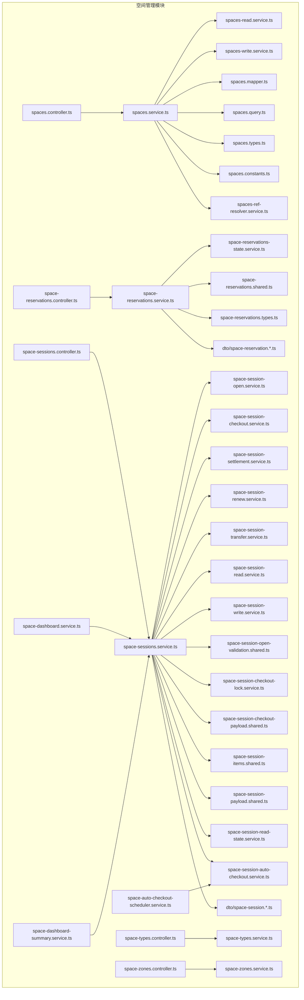
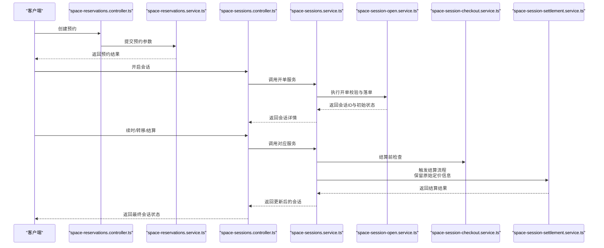
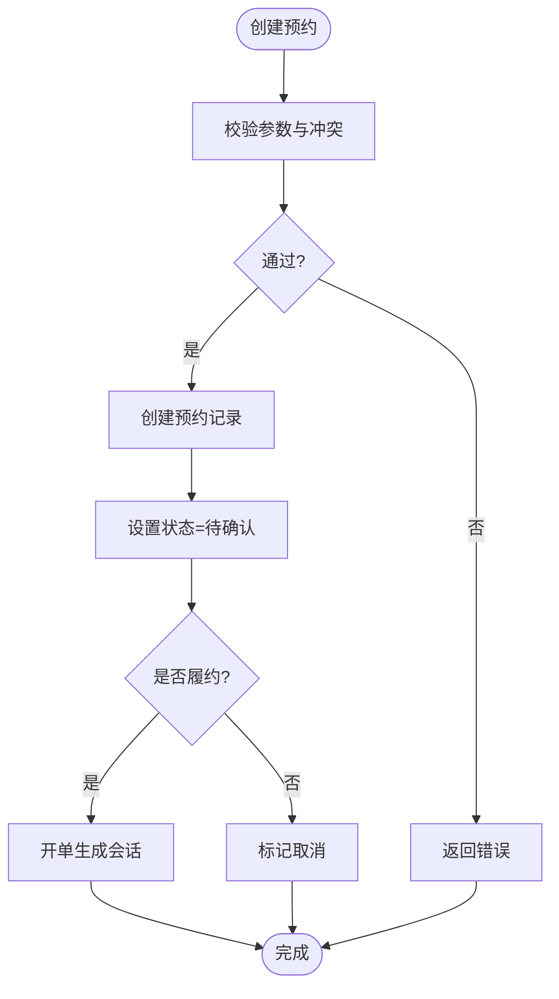
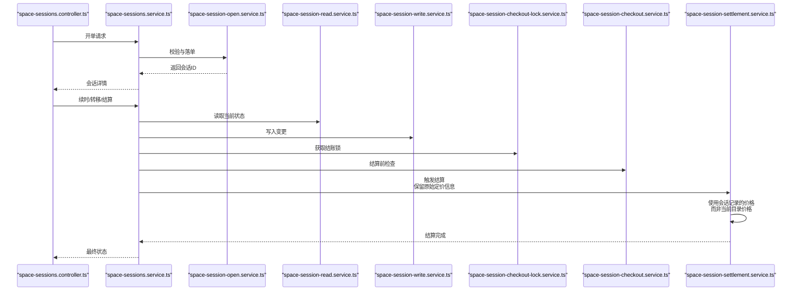
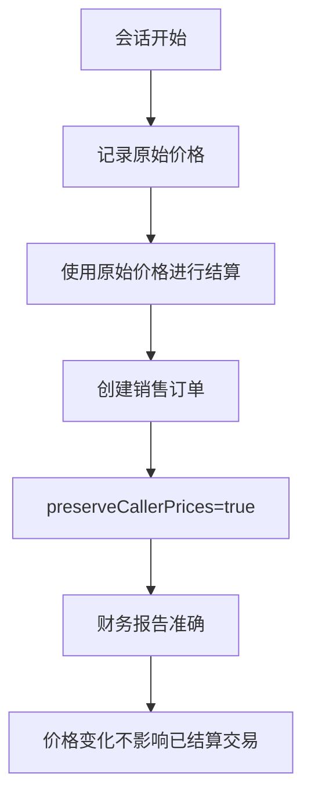
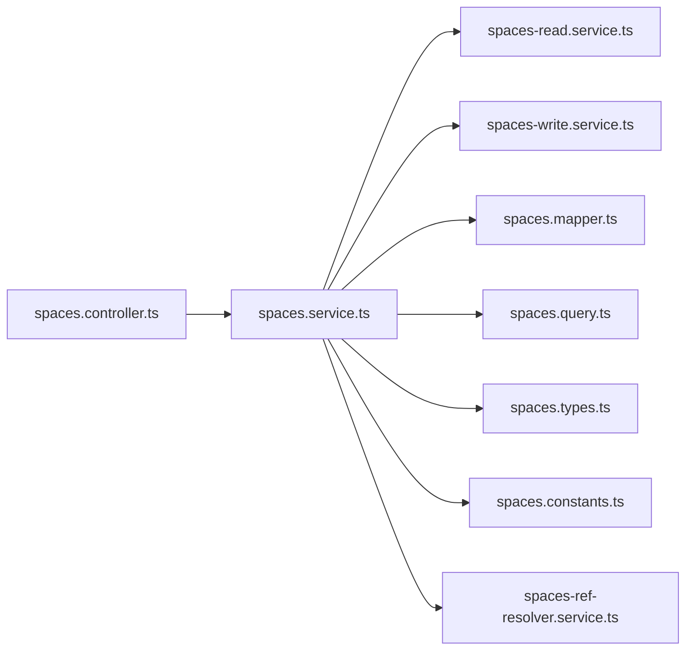

# 空间管理

<cite>
**本文引用的文件**
- [spaces.module.ts](file://src/purely-profit/operations/spaces/spaces.module.ts)
- [spaces.controller.ts](file://src/purely-profit/operations/spaces/spaces.controller.ts)
- [spaces.service.ts](file://src/purely-profit/operations/spaces/spaces.service.ts)
- [spaces-read.service.ts](file://src/purely-profit/operations/spaces/spaces-read.service.ts)
- [spaces-write.service.ts](file://src/purely-profit/operations/spaces/spaces-write.service.ts)
- [spaces.mapper.ts](file://src/purely-profit/operations/spaces/spaces.mapper.ts)
- [spaces.query.ts](file://src/purely-profit/operations/spaces/spaces.query.ts)
- [spaces.types.ts](file://src/purely-profit/operations/spaces/spaces.types.ts)
- [spaces.constants.ts](file://src/purely-profit/operations/spaces/spaces.constants.ts)
- [spaces-ref-resolver.service.ts](file://src/purely-profit/operations/spaces/spaces-ref-resolver.service.ts)
- [space-reservations.controller.ts](file://src/purely-profit/operations/spaces/space-reservations.controller.ts)
- [space-reservations.service.ts](file://src/purely-profit/operations/spaces/space-reservations.service.ts)
- [space-reservations-state.service.ts](file://src/purely-profit/operations/spaces/space-reservations-state.service.ts)
- [space-reservations.shared.ts](file://src/purely-profit/operations/spaces/space-reservations.shared.ts)
- [space-reservations.types.ts](file://src/purely-profit/operations/spaces/space-reservations.types.ts)
- [space-reservations.query.dto.ts](file://src/purely-profit/operations/spaces/dto/space-reservation.query.dto.ts)
- [space-reservation.dto.ts](file://src/purely-profit/operations/spaces/dto/space-reservation.dto.ts)
- [space-reservation.request.dto.ts](file://src/purely-profit/operations/spaces/dto/space-reservation.request.dto.ts)
- [space-reservation.response.dto.ts](file://src/purely-profit/operations/spaces/dto/space-reservation.response.dto.ts)
- [space-sessions.controller.ts](file://src/purely-profit/operations/spaces/space-sessions.controller.ts)
- [space-sessions.service.ts](file://src/purely-profit/operations/spaces/space-sessions.service.ts)
- [space-session-open.service.ts](file://src/purely-profit/operations/spaces/space-session-open.service.ts)
- [space-session-checkout.service.ts](file://src/purely-profit/operations/spaces/space-session-checkout.service.ts)
- [space-session-settlement.service.ts](file://src/purely-profit/operations/spaces/space-session-settlement.service.ts)
- [space-session-renew.service.ts](file://src/purely-profit/operations/spaces/space-session-renew.service.ts)
- [space-session-transfer.service.ts](file://src/purely-profit/operations/spaces/space-session-transfer.service.ts)
- [space-session-read.service.ts](file://src/purely-profit/operations/spaces/space-session-read.service.ts)
- [space-session-write.service.ts](file://src/purely-profit/operations/spaces/space-session-write.service.ts)
- [space-session-open-validation.shared.ts](file://src/purely-profit/operations/spaces/space-session-open-validation.shared.ts)
- [space-session-checkout-lock.service.ts](file://src/purely-profit/operations/spaces/space-session-checkout-lock.service.ts)
- [space-session-checkout-payload.shared.ts](file://src/purely-profit/operations/spaces/space-session-checkout-payload.shared.ts)
- [space-session-items.shared.ts](file://src/purely-profit/operations/spaces/space-session-items.shared.ts)
- [space-session-payload.shared.ts](file://src/purely-profit/operations/spaces/space-session-payload.shared.ts)
- [space-session-read-state.service.ts](file://src/purely-profit/operations/spaces/space-session-read-state.service.ts)
- [space-session-auto-checkout.service.ts](file://src/purely-profit/operations/spaces/space-session-auto-checkout.service.ts)
- [space-session.dto.ts](file://src/purely-profit/operations/spaces/dto/space-session.dto.ts)
- [space-session.request.dto.ts](file://src/purely-profit/operations/spaces/dto/space-session.request.dto.ts)
- [space-session.response.dto.ts](file://src/purely-profit/operations/spaces/dto/space-session.response.dto.ts)
- [space-session.query.dto.ts](file://src/purely-profit/operations/spaces/dto/space-session.query.dto.ts)
- [space-session-list.query.dto.ts](file://src/purely-profit/operations/spaces/dto/space-session-list.query.dto.ts)
- [space-session-list.response.dto.ts](file://src/purely-profit/operations/spaces/dto/space-session-list.response.dto.ts)
- [space-session-open.request.dto.ts](file://src/purely-profit/operations/spaces/dto/space-session-open.request.dto.ts)
- [space-session-checkout.request.dto.ts](file://src/purely-profit/operations/spaces/dto/space-session-checkout.request.dto.ts)
- [space-session-checkout.response.dto.ts](file://src/purely-profit/operations/spaces/dto/space-session-checkout.response.dto.ts)
- [space-session-renew.request.dto.ts](file://src/purely-profit/operations/spaces/dto/space-session-renew.request.dto.ts)
- [space-session-renew.response.dto.ts](file://src/purely-profit/operations/spaces/dto/space-session-renew.response.dto.ts)
- [space-session-transfer.request.dto.ts](file://src/purely-profit/operations/spaces/dto/space-session-transfer.request.dto.ts)
- [space-session-transfer.response.dto.ts](file://src/purely-profit/operations/spaces/dto/space-session-transfer.response.dto.ts)
- [space-session-shared.response.dto.ts](file://src/purely-profit/operations/spaces/dto/space-session-shared.response.dto.ts)
- [space-session.constants.ts](file://src/purely-profit/operations/spaces/dto/space-session.constants.ts)
- [space-types.controller.ts](file://src/purely-profit/operations/spaces/space-types.controller.ts)
- [space-types.service.ts](file://src/purely-profit/operations/spaces/space-types.service.ts)
- [space-zones.controller.ts](file://src/purely-profit/operations/spaces/space-zones.controller.ts)
- [space-zones.service.ts](file://src/purely-profit/operations/spaces/space-zones.service.ts)
- [space-dashboard.service.ts](file://src/purely-profit/operations/spaces/space-dashboard.service.ts)
- [space-dashboard-summary.service.ts](file://src/purely-profit/operations/spaces/space-dashboard-summary.service.ts)
- [space-auto-checkout-scheduler.service.ts](file://src/purely-profit/operations/spaces/space-auto-checkout-scheduler.service.ts)
- [spaces.prisma](file://prisma/purely-profit/operations/spaces.prisma)
- [20260515013000_add_space_management_and_reservations/migration.sql](file://prisma/migrations/20260515013000_add_space_management_and_reservations/migration.sql)
- [20260515023000_add_space_sessions/migration.sql](file://prisma/migrations/20260515023000_add_space_sessions/migration.sql)
</cite>

## 更新摘要
**所做更改**
- 更新了会话结算章节，重点介绍了保留原始定价信息的财务准确性改进
- 新增了结算流程中价格保护机制的技术细节
- 强调了会话开始后价格变化对财务报告的影响控制

## 目录
1. [简介](#简介)
2. [项目结构](#项目结构)
3. [核心组件](#核心组件)
4. [架构总览](#架构总览)
5. [详细组件分析](#详细组件分析)
6. [依赖分析](#依赖分析)
7. [性能考虑](#性能考虑)
8. [故障排查指南](#故障排查指南)
9. [结论](#结论)
10. [附录](#附录)

## 简介
本文件系统性阐述"空间管理"子系统的功能与实现，覆盖空间类型、空间区域、空间实体、空间预订与空间会话的完整生命周期；解释空间预订、使用、结算等业务流程；提供空间统计、利用率与报表能力；介绍空间优化、自动结账与异常处理等高级特性；并说明与会员系统、商品模块的集成关系。内容基于仓库中实际代码与数据库模型进行梳理，确保可追溯到具体源文件。

**更新** 本次更新重点关注会话结算过程中的财务准确性改进，特别是保留原始定价信息以应对会话开始后的价格变化，确保准确的财务报告。

## 项目结构
空间管理位于 operations 子域下的 spaces 模块，采用按功能分层的组织方式：控制器（controller）负责接口入口，服务（service）封装业务逻辑，读写服务分离（read/write），查询构建器（query builder）与映射器（mapper）负责数据转换与查询组装，DTO 定义请求/响应结构，Prisma 模型定义数据表与枚举。

**图表来源**
- [spaces.controller.ts:1-200](file://src/purely-profit/operations/spaces/spaces.controller.ts#L1-L200)
- [spaces.service.ts:1-300](file://src/purely-profit/operations/spaces/spaces.service.ts#L1-L300)
- [space-reservations.controller.ts:1-200](file://src/purely-profit/operations/spaces/space-reservations.controller.ts#L1-L200)
- [space-reservations.service.ts:1-300](file://src/purely-profit/operations/spaces/space-reservations.service.ts#L1-L300)
- [space-sessions.controller.ts:1-300](file://src/purely-profit/operations/spaces/space-sessions.controller.ts#L1-L300)
- [space-sessions.service.ts:1-400](file://src/purely-profit/operations/spaces/space-sessions.service.ts#L1-L400)
- [space-types.controller.ts:1-200](file://src/purely-profit/operations/spaces/space-types.controller.ts#L1-L200)
- [space-zones.controller.ts:1-200](file://src/purely-profit/operations/spaces/space-zones.controller.ts#L1-L200)
- [space-dashboard.service.ts:1-200](file://src/purely-profit/operations/spaces/space-dashboard.service.ts#L1-L200)
- [space-dashboard-summary.service.ts:1-200](file://src/purely-profit/operations/spaces/space-dashboard-summary.service.ts#L1-L200)
- [space-auto-checkout-scheduler.service.ts:1-200](file://src/purely-profit/operations/spaces/space-auto-checkout-scheduler.service.ts#L1-L200)

**章节来源**
- [spaces.module.ts:1-120](file://src/purely-profit/operations/spaces/spaces.module.ts#L1-L120)
- [spaces.controller.ts:1-200](file://src/purely-profit/operations/spaces/spaces.controller.ts#L1-L200)
- [spaces.service.ts:1-300](file://src/purely-profit/operations/spaces/spaces.service.ts#L1-L300)

## 核心组件
- 空间实体与基础配置
  - 空间类型（SpaceType）：用于对空间进行分类，如"包厢"、"会议室"等，支持按门店维度唯一与索引。
  - 空间区域（SpaceZone）：对空间进行地理或功能分区，支持按门店维度唯一与索引。
  - 空间（Space）：具体的空间实例，关联类型与区域，具备容量、脏房启用、自动结账、状态等属性，并维护预约与会话关系。
- 预订（SpaceReservation）：记录客户对空间的预约信息，包括客人姓名、电话、预约时段、人数、备注与状态（待确认/已履约/已取消）。
- 会话（SpaceSession）：空间的实际使用记录，关联预约或销售订单，记录开始/结束时间、计费模式（按时/按项/混合/倒计时）、预付信息、物品明细与续时记录等。
- 控制器与服务
  - 空间控制器与服务：提供空间的增删改查、查询聚合与读写分离。
  - 预订控制器与服务：提供预约的创建、状态变更、查询与状态机服务。
  - 会话控制器与服务：提供开单、续时、转移、结算、自动结账与读写服务。
  - 类型与区域控制器与服务：提供类型与区域的增删改查。
  - 仪表盘与调度：提供空间运营看板、汇总统计与自动结账调度任务。

**更新** 会话结算服务现在包含价格保护机制，确保会话开始后的价格变化不影响已结算交易的财务准确性。

**章节来源**
- [spaces.service.ts:1-300](file://src/purely-profit/operations/spaces/spaces.service.ts#L1-L300)
- [spaces-read.service.ts:1-200](file://src/purely-profit/operations/spaces/spaces-read.service.ts#L1-L200)
- [spaces-write.service.ts:1-200](file://src/purely-profit/operations/spaces/spaces-write.service.ts#L1-L200)
- [space-reservations.service.ts:1-300](file://src/purely-profit/operations/spaces/space-reservations.service.ts#L1-L300)
- [space-sessions.service.ts:1-400](file://src/purely-profit/operations/spaces/space-sessions.service.ts#L1-L400)
- [space-types.service.ts:1-200](file://src/purely-profit/operations/spaces/space-types.service.ts#L1-L200)
- [space-zones.service.ts:1-200](file://src/purely-profit/operations/spaces/space-zones.service.ts#L1-L200)
- [space-dashboard.service.ts:1-200](file://src/purely-profit/operations/spaces/space-dashboard.service.ts#L1-L200)
- [space-dashboard-summary.service.ts:1-200](file://src/purely-profit/operations/spaces/space-dashboard-summary.service.ts#L1-L200)
- [space-auto-checkout-scheduler.service.ts:1-200](file://src/purely-profit/operations/spaces/space-auto-checkout-scheduler.service.ts#L1-L200)

## 架构总览
空间管理采用"控制器-服务-读写-映射-查询"的分层架构，结合 Prisma 数据模型与迁移脚本，形成从领域模型到持久化的完整闭环。会话生命周期贯穿预订、开单、续时、转移、结算与自动结账，形成完整的业务闭环。

**图表来源**
- [space-reservations.controller.ts:1-200](file://src/purely-profit/operations/spaces/space-reservations.controller.ts#L1-L200)
- [space-reservations.service.ts:1-300](file://src/purely-profit/operations/spaces/space-reservations.service.ts#L1-L300)
- [space-sessions.controller.ts:1-300](file://src/purely-profit/operations/spaces/space-sessions.controller.ts#L1-L300)
- [space-sessions.service.ts:1-400](file://src/purely-profit/operations/spaces/space-sessions.service.ts#L1-L400)
- [space-session-open.service.ts:1-200](file://src/purely-profit/operations/spaces/space-session-open.service.ts#L1-L200)
- [space-session-checkout.service.ts:1-200](file://src/purely-profit/operations/spaces/space-session-checkout.service.ts#L1-L200)
- [space-session-settlement.service.ts:1-200](file://src/purely-profit/operations/spaces/space-session-settlement.service.ts#L1-L200)

## 详细组件分析

### 数据模型与枚举
- 空间状态（SpaceStatus）：空闲、占用、已预约、清洁。
- 预约状态（SpaceReservationStatus）：待确认、已履约、已取消。
- 会话状态（SpaceSessionStatus）：活跃、已结算。
- 计费模式（SpaceBillingMode）：按时、按项、混合、倒计时。
- 关键字段：空间关联类型与区域、容量、脏房启用、自动结账；会话关联预约/销售订单、计费模式、预付信息、物品明细、续时记录、状态与时间戳。

**章节来源**
- [spaces.prisma:1-140](file://prisma/purely-profit/operations/spaces.prisma#L1-L140)
- [20260515013000_add_space_management_and_reservations/migration.sql:1-99](file://prisma/migrations/20260515013000_add_space_management_and_reservations/migration.sql#L1-L99)
- [20260515023000_add_space_sessions/migration.sql:1-44](file://prisma/migrations/20260515023000_add_space_sessions/migration.sql#L1-L44)

### 空间类型与区域
- 空间类型（SpaceType）
  - 职责：为空间分类，支持按门店唯一与索引优化。
  - 关键点：与 Space 的外键关系，限制删除以保证数据一致性。
- 空间区域（SpaceZone）
  - 职责：对空间进行分区，支持按门店唯一与索引优化。
  - 关键点：Space 的 zoneId 可为空，允许未分区空间存在。
- 控制器与服务
  - 提供 CRUD 与查询聚合，配合 mapper 与 query builder 实现高效检索。

**章节来源**
- [space-types.controller.ts:1-200](file://src/purely-profit/operations/spaces/space-types.controller.ts#L1-L200)
- [space-types.service.ts:1-200](file://src/purely-profit/operations/spaces/space-types.service.ts#L1-L200)
- [space-zones.controller.ts:1-200](file://src/purely-profit/operations/spaces/space-zones.controller.ts#L1-L200)
- [space-zones.service.ts:1-200](file://src/purely-profit/operations/spaces/space-zones.service.ts#L1-L200)

### 空间实体与读写
- 空间（Space）
  - 职责：承载空间实例，维护状态、容量、脏房与自动结账等属性。
  - 关联：与 SpaceType、SpaceZone、SpaceReservation、SpaceSession 多重关系。
- 读写分离
  - 读服务：提供查询、聚合与索引利用，降低写入压力。
  - 写服务：封装变更操作，保证事务与一致性。
- 映射与查询
  - Mapper：统一 DTO 与实体之间的转换。
  - QueryBuilder：根据条件动态拼装查询，支持分页、排序与过滤。

**章节来源**
- [spaces.controller.ts:1-200](file://src/purely-profit/operations/spaces/spaces.controller.ts#L1-L200)
- [spaces.service.ts:1-300](file://src/purely-profit/operations/spaces/spaces.service.ts#L1-L300)
- [spaces-read.service.ts:1-200](file://src/purely-profit/operations/spaces/spaces-read.service.ts#L1-L200)
- [spaces-write.service.ts:1-200](file://src/purely-profit/operations/spaces/spaces-write.service.ts#L1-L200)
- [spaces.mapper.ts:1-200](file://src/purely-profit/operations/spaces/spaces.mapper.ts#L1-L200)
- [spaces.query.ts:1-200](file://src/purely-profit/operations/spaces/spaces.query.ts#L1-L200)

### 预订管理
- 预订生命周期
  - 创建：接收客人信息、预约时段、人数与备注。
  - 状态机：待确认 -> 已履约（开单）/已取消。
  - 查询：支持按空间、状态、时间范围筛选。
- 校验与冲突检测
  - 基于索引与查询构建器进行并发冲突检测。
- DTO 与状态服务
  - 请求/响应 DTO 规范化输入输出。
  - 状态服务维护状态流转与幂等。

**图表来源**
- [space-reservations.service.ts:1-300](file://src/purely-profit/operations/spaces/space-reservations.service.ts#L1-L300)
- [space-reservations-state.service.ts:1-200](file://src/purely-profit/operations/spaces/space-reservations-state.service.ts#L1-L200)
- [space-reservation.request.dto.ts:1-200](file://src/purely-profit/operations/spaces/dto/space-reservation.request.dto.ts#L1-L200)
- [space-reservation.response.dto.ts:1-200](file://src/purely-profit/operations/spaces/dto/space-reservation.response.dto.ts#L1-L200)

**章节来源**
- [space-reservations.controller.ts:1-200](file://src/purely-profit/operations/spaces/space-reservations.controller.ts#L1-L200)
- [space-reservations.service.ts:1-300](file://src/purely-profit/operations/spaces/space-reservations.service.ts#L1-L300)
- [space-reservations-state.service.ts:1-200](file://src/purely-profit/operations/spaces/space-reservations-state.service.ts#L1-L200)
- [space-reservations.shared.ts:1-200](file://src/purely-profit/operations/spaces/space-reservations.shared.ts#L1-L200)
- [space-reservations.types.ts:1-200](file://src/purely-profit/operations/spaces/space-reservations.types.ts#L1-L200)
- [space-reservation.dto.ts:1-200](file://src/purely-profit/operations/spaces/dto/space-reservation.dto.ts#L1-L200)
- [space-reservation.query.dto.ts:1-200](file://src/purely-profit/operations/spaces/dto/space-reservation.query.dto.ts#L1-L200)

### 会话管理
- 会话生命周期
  - 开单：校验规则、锁定资源、创建会话并初始化计费。
  - 续时：记录续时历史，更新计费与时间。
  - 转移：在同空间内转移使用人或用途。
  - 结算：计算费用、处理预付、生成销售订单关联。
  - 自动结账：定时任务触发超时或倒计时结束的会话。
- 锁定与幂等
  - 结账锁：防止并发重复结算。
  - Payload 共享：跨服务共享会话状态与计算上下文。
- 读写分离
  - 读服务：查询当前状态、历史续时与物品明细。
  - 写服务：变更状态、更新计费与续时记录。

**更新** 会话结算过程现已增强价格保护机制，确保会话开始后的价格变化不会影响已结算交易的财务准确性。

**图表来源**
- [space-sessions.controller.ts:1-300](file://src/purely-profit/operations/spaces/space-sessions.controller.ts#L1-L300)
- [space-sessions.service.ts:1-400](file://src/purely-profit/operations/spaces/space-sessions.service.ts#L1-L400)
- [space-session-open.service.ts:1-200](file://src/purely-profit/operations/spaces/space-session-open.service.ts#L1-L200)
- [space-session-read.service.ts:1-200](file://src/purely-profit/operations/spaces/space-session-read.service.ts#L1-L200)
- [space-session-write.service.ts:1-200](file://src/purely-profit/operations/spaces/space-session-write.service.ts#L1-L200)
- [space-session-checkout-lock.service.ts:1-200](file://src/purely-profit/operations/spaces/space-session-checkout-lock.service.ts#L1-L200)
- [space-session-checkout.service.ts:1-200](file://src/purely-profit/operations/spaces/space-session-checkout.service.ts#L1-L200)
- [space-session-settlement.service.ts:1-200](file://src/purely-profit/operations/spaces/space-session-settlement.service.ts#L1-L200)

**章节来源**
- [space-sessions.controller.ts:1-300](file://src/purely-profit/operations/spaces/space-sessions.controller.ts#L1-L300)
- [space-sessions.service.ts:1-400](file://src/purely-profit/operations/spaces/space-sessions.service.ts#L1-L400)
- [space-session-open.service.ts:1-200](file://src/purely-profit/operations/spaces/space-session-open.service.ts#L1-L200)
- [space-session-checkout.service.ts:1-200](file://src/purely-profit/operations/spaces/space-session-checkout.service.ts#L1-L200)
- [space-session-settlement.service.ts:1-200](file://src/purely-profit/operations/spaces/space-session-settlement.service.ts#L1-L200)
- [space-session-renew.service.ts:1-200](file://src/purely-profit/operations/spaces/space-session-renew.service.ts#L1-L200)
- [space-session-transfer.service.ts:1-200](file://src/purely-profit/operations/spaces/space-session-transfer.service.ts#L1-L200)
- [space-session-read.service.ts:1-200](file://src/purely-profit/operations/spaces/space-session-read.service.ts#L1-L200)
- [space-session-write.service.ts:1-200](file://src/purely-profit/operations/spaces/space-session-write.service.ts#L1-L200)
- [space-session-open-validation.shared.ts:1-200](file://src/purely-profit/operations/spaces/space-session-open-validation.shared.ts#L1-L200)
- [space-session-checkout-lock.service.ts:1-200](file://src/purely-profit/operations/spaces/space-session-checkout-lock.service.ts#L1-L200)
- [space-session-checkout-payload.shared.ts:1-200](file://src/purely-profit/operations/spaces/space-session-checkout-payload.shared.ts#L1-L200)
- [space-session-items.shared.ts:1-200](file://src/purely-profit/operations/spaces/space-session-items.shared.ts#L1-L200)
- [space-session-payload.shared.ts:1-200](file://src/purely-profit/operations/spaces/space-session-payload.shared.ts#L1-L200)
- [space-session-read-state.service.ts:1-200](file://src/purely-profit/operations/spaces/space-session-read-state.service.ts#L1-L200)
- [space-session-auto-checkout.service.ts:1-200](file://src/purely-profit/operations/spaces/space-session-auto-checkout.service.ts#L1-L200)
- [space-session.dto.ts:1-200](file://src/purely-profit/operations/spaces/dto/space-session.dto.ts#L1-L200)
- [space-session.request.dto.ts:1-200](file://src/purely-profit/operations/spaces/dto/space-session.request.dto.ts#L1-L200)
- [space-session.response.dto.ts:1-200](file://src/purely-profit/operations/spaces/dto/space-session.response.dto.ts#L1-L200)
- [space-session.query.dto.ts:1-200](file://src/purely-profit/operations/spaces/dto/space-session.query.dto.ts#L1-L200)
- [space-session-list.query.dto.ts:1-200](file://src/purely-profit/operations/spaces/dto/space-session-list.query.dto.ts#L1-L200)
- [space-session-list.response.dto.ts:1-200](file://src/purely-profit/operations/spaces/dto/space-session-list.response.dto.ts#L1-L200)
- [space-session-open.request.dto.ts:1-200](file://src/purely-profit/operations/spaces/dto/space-session-open.request.dto.ts#L1-L200)
- [space-session-checkout.request.dto.ts:1-200](file://src/purely-profit/operations/spaces/dto/space-session-checkout.request.dto.ts#L1-L200)
- [space-session-checkout.response.dto.ts:1-200](file://src/purely-profit/operations/spaces/dto/space-session-checkout.response.dto.ts#L1-L200)
- [space-session-renew.request.dto.ts:1-200](file://src/purely-profit/operations/spaces/dto/space-session-renew.request.dto.ts#L1-L200)
- [space-session-renew.response.dto.ts:1-200](file://src/purely-profit/operations/spaces/dto/space-session-renew.response.dto.ts#L1-L200)
- [space-session-transfer.request.dto.ts:1-200](file://src/purely-profit/operations/spaces/dto/space-session-transfer.request.dto.ts#L1-L200)
- [space-session-transfer.response.dto.ts:1-200](file://src/purely-profit/operations/spaces/dto/space-session-transfer.response.dto.ts#L1-L200)
- [space-session-shared.response.dto.ts:1-200](file://src/purely-profit/operations/spaces/dto/space-session-shared.response.dto.ts#L1-L200)
- [space-session.constants.ts:1-200](file://src/purely-profit/operations/spaces/dto/space-session.constants.ts#L1-L200)

### 会话结算增强功能
**更新** 会话结算过程现已包含重要的财务准确性改进：保留原始定价信息以应对会话开始后的价格变化。

- 结算流程增强
  - 价格保护机制：在结算时使用会话记录的价格而非当前目录价格，确保财务报告的准确性。
  - preserveCallerPrices 参数：在创建销售订单时启用价格保护，避免会话开始后调价影响已结算交易。
  - 财务一致性：即使商品价格在会话期间发生变化，已结算的交易仍按原始价格记账。

- 技术实现细节
  - 结算服务中的 createSessionSaleOrder 方法包含 preserveCallerPrices: true 参数。
  - 会话物品明细中的 salePrice 字段来自会话记录而非实时查询。
  - 销售订单创建时跳过库存验证和扣除，专注于价格保护。

**图表来源**
- [space-session-settlement.service.ts:258-262](file://src/purely-profit/operations/spaces/space-session-settlement.service.ts#L258-L262)
- [space-session-checkout.service.ts:148-155](file://src/purely-profit/operations/spaces/space-session-checkout.service.ts#L148-L155)

**章节来源**
- [space-session-settlement.service.ts:1-304](file://src/purely-profit/operations/spaces/space-session-settlement.service.ts#L1-L304)
- [space-session-checkout.service.ts:1-229](file://src/purely-profit/operations/spaces/space-session-checkout.service.ts#L1-L229)

### 统计、利用率与报表
- 运营看板
  - 提供空间使用率、收入、客流量等指标的聚合展示。
- 汇总服务
  - 基于会话与预订数据进行多维统计，支持时间范围与空间维度聚合。
- 报表导出
  - 支持按日/周/月维度导出空间使用与收益报表。

**章节来源**
- [space-dashboard.service.ts:1-200](file://src/purely-profit/operations/spaces/space-dashboard.service.ts#L1-L200)
- [space-dashboard-summary.service.ts:1-200](file://src/purely-profit/operations/spaces/space-dashboard-summary.service.ts#L1-L200)

### 自动结账与调度
- 自动结账调度器
  - 周期性扫描超时或倒计时结束的会话，触发自动结账流程。
- 会话自动结账服务
  - 在无人值守场景下保障空间周转与收益。

**章节来源**
- [space-auto-checkout-scheduler.service.ts:1-200](file://src/purely-profit/operations/spaces/space-auto-checkout-scheduler.service.ts#L1-L200)
- [space-session-auto-checkout.service.ts:1-200](file://src/purely-profit/operations/spaces/space-session-auto-checkout.service.ts#L1-L200)

### 与会员系统、商品模块的集成
- 与会员系统
  - 预订与会话可记录客人姓名与电话，便于后续会员转化与积分联动。
  - 结算阶段可对接会员账户支付与积分抵扣。
- 与商品模块
  - 会话物品明细（items）支持与商品库存、销售订单联动，实现空间内商品消费闭环。
  - 结算时可生成销售订单并同步库存与财务流水。

**章节来源**
- [space-reservation.dto.ts:1-200](file://src/purely-profit/operations/spaces/dto/space-reservation.dto.ts#L1-L200)
- [space-session.dto.ts:1-200](file://src/purely-profit/operations/spaces/dto/space-session.dto.ts#L1-L200)
- [space-session-items.shared.ts:1-200](file://src/purely-profit/operations/spaces/space-session-items.shared.ts#L1-L200)

## 依赖分析
- 模块内聚与耦合
  - 控制器仅负责参数解析与调用服务，服务内部再委派到读写、校验与共享组件，保持高内聚低耦合。
- 外部依赖
  - Prisma：数据模型与迁移脚本驱动持久化。
  - Redis/缓存：可选的缓存预热与失效策略（由上层模块提供）。
- 循环依赖
  - 通过服务间接口与共享 DTO 解耦，避免循环依赖。

**图表来源**
- [spaces.controller.ts:1-200](file://src/purely-profit/operations/spaces/spaces.controller.ts#L1-L200)
- [spaces.service.ts:1-300](file://src/purely-profit/operations/spaces/spaces.service.ts#L1-L300)
- [spaces-read.service.ts:1-200](file://src/purely-profit/operations/spaces/spaces-read.service.ts#L1-L200)
- [spaces-write.service.ts:1-200](file://src/purely-profit/operations/spaces/spaces-write.service.ts#L1-L200)
- [spaces.mapper.ts:1-200](file://src/purely-profit/operations/spaces/spaces.mapper.ts#L1-L200)
- [spaces.query.ts:1-200](file://src/purely-profit/operations/spaces/spaces.query.ts#L1-L200)
- [spaces.types.ts:1-200](file://src/purely-profit/operations/spaces/spaces.types.ts#L1-L200)
- [spaces.constants.ts:1-200](file://src/purely-profit/operations/spaces/spaces.constants.ts#L1-L200)
- [spaces-ref-resolver.service.ts:1-200](file://src/purely-profit/operations/spaces/spaces-ref-resolver.service.ts#L1-L200)

**章节来源**
- [spaces.module.ts:1-120](file://src/purely-profit/operations/spaces/spaces.module.ts#L1-L120)
- [spaces.service.ts:1-300](file://src/purely-profit/operations/spaces/spaces.service.ts#L1-L300)

## 性能考虑
- 索引优化
  - 空间与预订、会话均建立复合索引，加速按门店、状态、时间范围的查询。
- 读写分离
  - 读服务专注查询与聚合，写服务专注变更，降低锁竞争。
- 缓存策略
  - 对热点空间与类型/区域进行缓存预热，减少数据库压力。
- 批量与异步
  - 自动结账调度采用异步批处理，避免阻塞主流程。

## 故障排查指南
- 预订冲突
  - 现象：创建失败或状态异常。
  - 排查：检查索引与查询构建器的并发冲突检测逻辑，确认时间段与空间占用情况。
- 会话状态不一致
  - 现象：续时/转移后状态异常。
  - 排查：核对读写服务的状态读取与写入顺序，确认结账锁是否正确释放。
- 结算异常
  - 现象：重复结算或金额不正确。
  - 排查：检查结账锁与结算前置检查，核对物品明细与计费模式。
- 自动结账未触发
  - 现象：超时会话未自动结账。
  - 排查：检查调度器执行频率与会话状态判断逻辑。
- **更新** 价格保护问题
  - 现象：结算后发现价格与预期不符。
  - 排查：确认 preserveCallerPrices 参数是否正确传递，检查会话记录中的原始价格字段。

**章节来源**
- [space-reservations.service.ts:1-300](file://src/purely-profit/operations/spaces/space-reservations.service.ts#L1-L300)
- [space-session-checkout-lock.service.ts:1-200](file://src/purely-profit/operations/spaces/space-session-checkout-lock.service.ts#L1-L200)
- [space-session-checkout.service.ts:1-200](file://src/purely-profit/operations/spaces/space-session-checkout.service.ts#L1-L200)
- [space-session-auto-checkout.service.ts:1-200](file://src/purely-profit/operations/spaces/space-session-auto-checkout.service.ts#L1-L200)

## 结论
空间管理模块以清晰的分层架构与完善的领域模型支撑了从空间类型/区域到实体、从预订到会话的全生命周期管理。通过读写分离、索引优化与自动结账调度，系统在保证一致性的同时提升了性能与可用性。与会员与商品模块的集成为业务拓展提供了基础能力。

**更新** 本次更新特别强调了会话结算过程中的财务准确性改进。通过保留原始定价信息的机制，系统能够有效应对会话开始后的价格变化，确保财务报告的准确性和一致性。这一改进对于需要精确财务核算的商业环境尤为重要，避免了因价格波动导致的财务差异问题。

建议在生产环境中结合缓存与异步批处理进一步优化吞吐与延迟，同时确保价格保护机制的正确配置以维持财务准确性。

## 附录
- API 示例与数据结构
  - 预订相关
    - 创建预约：请求 DTO 与响应 DTO 定义见 [space-reservation.request.dto.ts:1-200](file://src/purely-profit/operations/spaces/dto/space-reservation.request.dto.ts#L1-L200)，[space-reservation.response.dto.ts:1-200](file://src/purely-profit/operations/spaces/dto/space-reservation.response.dto.ts#L1-L200)。
    - 查询预约：查询 DTO 见 [space-reservation.query.dto.ts:1-200](file://src/purely-profit/operations/spaces/dto/space-reservation.query.dto.ts#L1-L200)。
  - 会话相关
    - 开单请求：见 [space-session-open.request.dto.ts:1-200](file://src/purely-profit/operations/spaces/dto/space-session-open.request.dto.ts#L1-L200)。
    - 结算请求/响应：见 [space-session-checkout.request.dto.ts:1-200](file://src/purely-profit/operations/spaces/dto/space-session-checkout.request.dto.ts#L1-L200)，[space-session-checkout.response.dto.ts:1-200](file://src/purely-profit/operations/spaces/dto/space-session-checkout.response.dto.ts#L1-L200)。
    - 续时请求/响应：见 [space-session-renew.request.dto.ts:1-200](file://src/purely-profit/operations/spaces/dto/space-session-renew.request.dto.ts#L1-L200)，[space-session-renew.response.dto.ts:1-200](file://src/purely-profit/operations/spaces/dto/space-session-renew.response.dto.ts#L1-L200)。
    - 转移请求/响应：见 [space-session-transfer.request.dto.ts:1-200](file://src/purely-profit/operations/spaces/dto/space-session-transfer.request.dto.ts#L1-L200)，[space-session-transfer.response.dto.ts:1-200](file://src/purely-profit/operations/spaces/dto/space-session-transfer.response.dto.ts#L1-L200)。
    - 列表查询：见 [space-session-list.query.dto.ts:1-200](file://src/purely-profit/operations/spaces/dto/space-session-list.query.dto.ts#L1-L200)，[space-session-list.response.dto.ts:1-200](file://src/purely-profit/operations/spaces/dto/space-session-list.response.dto.ts#L1-L200)。
  - 业务场景示例
    - 预订到会话：参考 [space-reservations.controller.ts:1-200](file://src/purely-profit/operations/spaces/space-reservations.controller.ts#L1-L200) 与 [space-sessions.controller.ts:1-300](file://src/purely-profit/operations/spaces/space-sessions.controller.ts#L1-L300) 的调用链。
    - 自动结账：参考 [space-auto-checkout-scheduler.service.ts:1-200](file://src/purely-profit/operations/spaces/space-auto-checkout-scheduler.service.ts#L1-L200) 与 [space-session-auto-checkout.service.ts:1-200](file://src/purely-profit/operations/spaces/space-session-auto-checkout.service.ts#L1-L200)。
    - **更新** 价格保护结算：参考 [space-session-settlement.service.ts:258-262](file://src/purely-profit/operations/spaces/space-session-settlement.service.ts#L258-L262) 中的 preserveCallerPrices 参数配置。
- 数据模型参考
  - 空间类型/区域/空间/预订/会话的 Prisma 模型与迁移脚本见 [spaces.prisma:1-140](file://prisma/purely-profit/operations/spaces.prisma#L1-L140)、[20260515013000_add_space_management_and_reservations/migration.sql:1-99](file://prisma/migrations/20260515013000_add_space_management_and_reservations/migration.sql#L1-L99)、[20260515023000_add_space_sessions/migration.sql:1-44](file://prisma/migrations/20260515023000_add_space_sessions/migration.sql#L1-L44)。