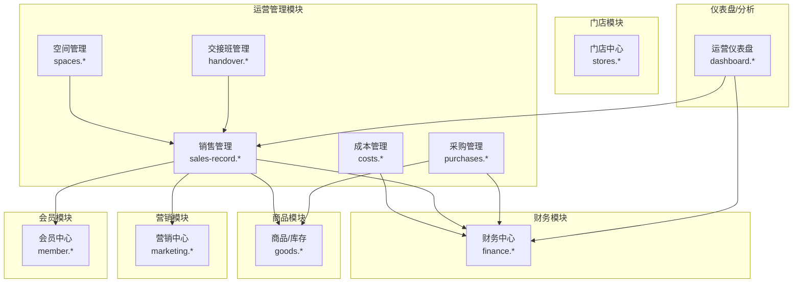
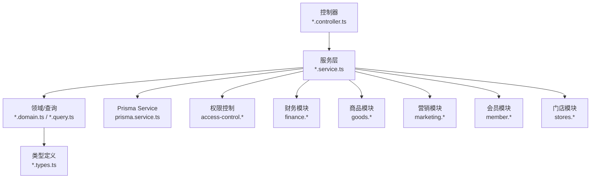
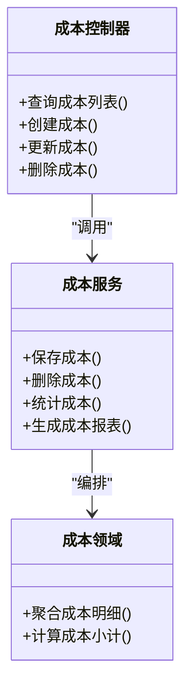
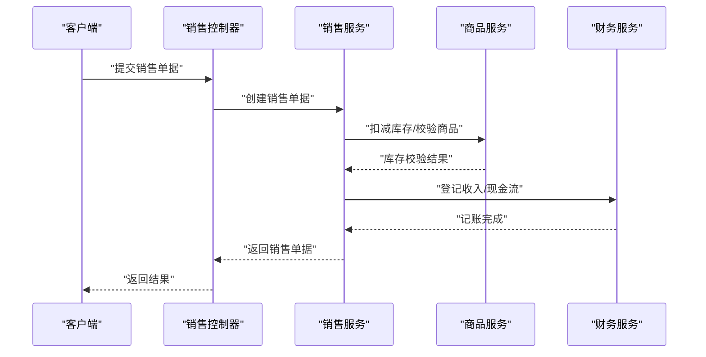
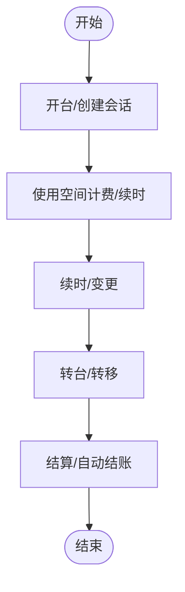
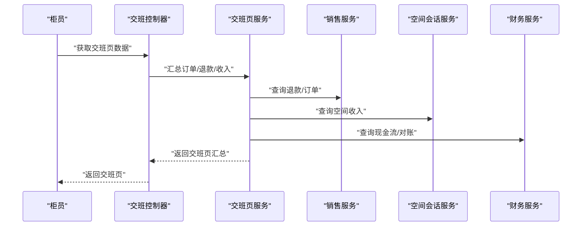
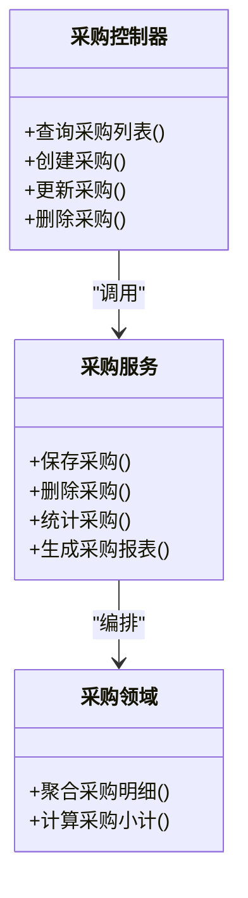
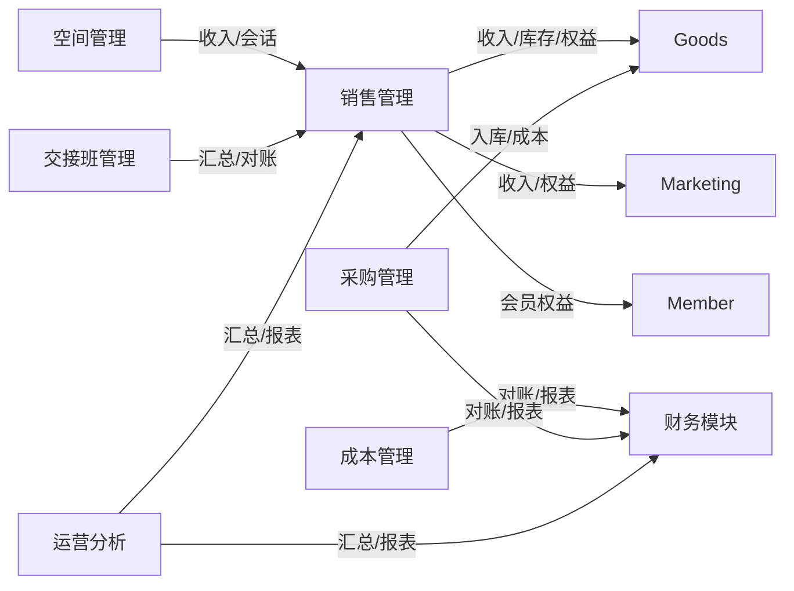

# 运营管理模块

<cite>
**本文引用的文件**
- [costs.controller.ts](file://src/purely-profit/operations/costs/costs.controller.ts)
- [costs.service.ts](file://src/purely-profit/operations/costs/costs.service.ts)
- [costs.domain.ts](file://src/purely-profit/operations/costs/costs.domain.ts)
- [costs.query.ts](file://src/purely-profit/operations/costs/costs.query.ts)
- [costs.types.ts](file://src/purely-profit/operations/costs/costs.types.ts)
- [sales-record.controller.ts](file://src/purely-profit/operations/sales-record/sales-record.controller.ts)
- [sales-record.service.ts](file://src/purely-profit/operations/sales-record/sales-record.service.ts)
- [sales-record.domain.ts](file://src/purely-profit/operations/sales-record/sales-record.domain.ts)
- [sales-record.query.ts](file://src/purely-profit/operations/sales-record/sales-record.query.ts)
- [sales-record.types.ts](file://src/purely-profit/operations/sales-record/sales-record.types.ts)
- [sales-record-stats.service.ts](file://src/purely-profit/operations/sales-record/sales-record-stats.service.ts)
- [sales-record-report.service.ts](file://src/purely-profit/operations/sales-record/sales-record-report.service.ts)
- [sales-record-create-flow.service.ts](file://src/purely-profit/operations/sales-record/sales-record-create-flow.service.ts)
- [sales-record-list.service.ts](file://src/purely-profit/operations/sales-record/sales-record-list.service.ts)
- [sales-record-products.service.ts](file://src/purely-profit/operations/sales-record/sales-record-products.service.ts)
- [space-reservations.controller.ts](file://src/purely-profit/operations/spaces/space-reservations.controller.ts)
- [space-reservations.service.ts](file://src/purely-profit/operations/spaces/space-reservations.service.ts)
- [space-reservations.types.ts](file://src/purely-profit/operations/spaces/space-reservations.types.ts)
- [space-sessions.controller.ts](file://src/purely-profit/operations/spaces/space-sessions.controller.ts)
- [space-sessions.service.ts](file://src/purely-profit/operations/spaces/space-sessions.service.ts)
- [space-sessions.types.ts](file://src/purely-profit/operations/spaces/space-sessions.types.ts)
- [spaces.controller.ts](file://src/purely-profit/operations/spaces/spaces.controller.ts)
- [spaces-read.service.ts](file://src/purely-profit/operations/spaces/spaces-read.service.ts)
- [spaces-write.service.ts](file://src/purely-profit/operations/spaces/spaces-write.service.ts)
- [space-types.controller.ts](file://src/purely-profit/operations/spaces/space-types.controller.ts)
- [space-types.service.ts](file://src/purely-profit/operations/spaces/space-types.service.ts)
- [space-zones.controller.ts](file://src/purely-profit/operations/spaces/space-zones.controller.ts)
- [space-zones.service.ts](file://src/purely-profit/operations/spaces/space-zones.service.ts)
- [handover.controller.ts](file://src/purely-profit/operations/handover/handover.controller.ts)
- [handover.service.ts](file://src/purely-profit/operations/handover/handover.service.ts)
- [handover-page.service.ts](file://src/purely-profit/operations/handover/handover-page.service.ts)
- [handover-records.service.ts](file://src/purely-profit/operations/handover/handover-records.service.ts)
- [handover-records-revenue.service.ts](file://src/purely-profit/operations/handover/handover-records-revenue.service.ts)
- [handover-records-query.service.ts](file://src/purely-profit/operations/handover/handover-records-query.service.ts)
- [handover-records-detail.service.ts](file://src/purely-profit/operations/handover/handover-records-detail.service.ts)
- [handover.access.ts](file://src/purely-profit/operations/handover/handover.access.ts)
- [handover.types.ts](file://src/purely-profit/operations/handover/handover.types.ts)
- [purchases.controller.ts](file://src/purely-profit/operations/purchases/purchases.controller.ts)
- [purchases.service.ts](file://src/purely-profit/operations/purchases/purchases.service.ts)
- [purchases.domain.ts](file://src/purely-profit/operations/purchases/purchases.domain.ts)
- [purchases.query.ts](file://src/purely-profit/operations/purchases/purchases.query.ts)
- [purchases.types.ts](file://src/purely-profit/operations/purchases/purchases.types.ts)
- [access-control-alignment.spec.ts](file://src/purely-profit/access-control/access-control-alignment.spec.ts)
- [finance.controller.ts](file://src/purely-profit/finance/finance.controller.ts)
- [finance.service.ts](file://src/purely-profit/finance/finance.service.ts)
- [finance-account.service.ts](file://src/purely-profit/finance/finance-account.service.ts)
- [finance-cash-flow.service.ts](file://src/purely-profit/finance/finance-cash-flow.service.ts)
- [finance-reconciliation.service.ts](file://src/purely-profit/finance/finance-reconciliation.service.ts)
- [goods.controller.ts](file://src/purely-profit/goods/products/products.controller.ts)
- [goods.service.ts](file://src/purely-profit/goods/products/products.service.ts)
- [inventory.controller.ts](file://src/purely-profit/goods/inventory/inventory.controller.ts)
- [inventory.service.ts](file://src/purely-profit/goods/inventory/inventory.service.ts)
- [marketing.controller.ts](file://src/purely-profit/marketing/marketing.controller.ts)
- [marketing.service.ts](file://src/purely-profit/marketing/marketing.service.ts)
- [marketing-customers.controller.ts](file://src/purely-profit/marketing/marketing-customers.controller.ts)
- [marketing-customers.service.ts](file://src/purely-profit/marketing/marketing-customers.service.ts)
- [marketing-promotions.controller.ts](file://src/purely-profit/marketing/marketing-promotions.controller.ts)
- [marketing-promotions.service.ts](file://src/purely-profit/marketing/marketing-promotions.service.ts)
- [marketing-transactions.controller.ts](file://src/purely-profit/marketing/marketing-transactions.controller.ts)
- [marketing-transactions.service.ts](file://src/purely-profit/marketing/marketing-transactions.service.ts)
- [member.controller.ts](file://src/purely-profit/member/members/members.controller.ts)
- [member.service.ts](file://src/purely-profit/member/members/members.service.ts)
- [stores.controller.ts](file://src/purely-profit/stores/stores.controller.ts)
- [stores.service.ts](file://src/purely-profit/stores/stores.service.ts)
- [dashboard-home.controller.ts](file://src/purely-profit/dashboard/dashboard-home/dashboard-home.controller.ts)
- [dashboard-home.service.ts](file://src/purely-profit/dashboard/dashboard-home/dashboard-home.service.ts)
- [business-analysis.controller.ts](file://src/purely-profit/dashboard/business-analysis/business-analysis.controller.ts)
- [business-analysis.service.ts](file://src/purely-profit/dashboard/business-analysis/business-analysis.service.ts)
- [profit-detail.controller.ts](file://src/purely-profit/dashboard/profit-detail/profit-detail.controller.ts)
- [profit-detail.service.ts](file://src/purely-profit/dashboard/profit-detail/profit-detail.service.ts)
</cite>

## 目录
1. [简介](#简介)
2. [项目结构](#项目结构)
3. [核心组件](#核心组件)
4. [架构总览](#架构总览)
5. [详细组件分析](#详细组件分析)
6. [依赖分析](#依赖分析)
7. [性能考虑](#性能考虑)
8. [故障排查指南](#故障排查指南)
9. [结论](#结论)
10. [附录](#附录)

## 简介
运营管理模块围绕“成本管理、销售管理、空间管理、交接班管理、采购管理”五大核心子系统构建，覆盖运营流程控制、成本核算、收入统计、运营数据分析与报表、权限控制与监控预警等能力。模块通过与财务、商品、营销、会员等模块的协同，形成完整的运营闭环：从商品与库存管理到销售与收款，再到成本归集与财务对账，最终输出运营报表与利润分析。

## 项目结构
运营管理模块位于 src/purely-profit/operations 下，按功能域划分目录，控制器负责对外接口，服务层封装业务逻辑，领域与查询层处理复杂聚合与统计，类型定义统一数据契约。同时，权限控制与财务、商品、营销、会员、门店等模块存在跨域协作。

图表来源
- [costs.controller.ts](file://src/purely-profit/operations/costs/costs.controller.ts)
- [sales-record.controller.ts](file://src/purely-profit/operations/sales-record/sales-record.controller.ts)
- [space-sessions.controller.ts](file://src/purely-profit/operations/spaces/space-sessions.controller.ts)
- [handover.controller.ts](file://src/purely-profit/operations/handover/handover.controller.ts)
- [purchases.controller.ts](file://src/purely-profit/operations/purchases/purchases.controller.ts)
- [finance.controller.ts](file://src/purely-profit/finance/finance.controller.ts)
- [goods.controller.ts](file://src/purely-profit/goods/products/products.controller.ts)
- [marketing.controller.ts](file://src/purely-profit/marketing/marketing.controller.ts)
- [member.controller.ts](file://src/purely-profit/member/members/members.controller.ts)
- [stores.controller.ts](file://src/purely-profit/stores/stores.controller.ts)
- [dashboard-home.controller.ts](file://src/purely-profit/dashboard/dashboard-home/dashboard-home.controller.ts)

章节来源
- [costs.controller.ts](file://src/purely-profit/operations/costs/costs.controller.ts)
- [sales-record.controller.ts](file://src/purely-profit/operations/sales-record/sales-record.controller.ts)
- [spaces.controller.ts](file://src/purely-profit/operations/spaces/spaces.controller.ts)
- [handover.controller.ts](file://src/purely-profit/operations/handover/handover.controller.ts)
- [purchases.controller.ts](file://src/purely-profit/operations/purchases/purchases.controller.ts)

## 核心组件
- 成本管理：支持成本记录的增删改查、成本分类与统计、成本对账与报表。
- 销售管理：支持销售单据创建、订单列表与详情、商品准备、销售统计与报表。
- 空间管理：支持空间类型/区域/空间的读写、空间会话的开台/续时/结算/转台/自动结账、预约状态管理。
- 交接班管理：支持交班页汇总（订单、退款、现金、附加收入）、交班记录查询与详情、交班确认与对账。
- 采购管理：支持采购单据的创建、查询、统计与对账，联动商品与财务。

章节来源
- [costs.controller.ts](file://src/purely-profit/operations/costs/costs.controller.ts)
- [sales-record.controller.ts](file://src/purely-profit/operations/sales-record/sales-record.controller.ts)
- [space-sessions.controller.ts](file://src/purely-profit/operations/spaces/space-sessions.controller.ts)
- [handover.controller.ts](file://src/purely-profit/operations/handover/handover.controller.ts)
- [purchases.controller.ts](file://src/purely-profit/operations/purchases/purchases.controller.ts)

## 架构总览
运营管理模块采用“控制器-服务-领域/查询-类型”的分层设计，服务层承担主要业务编排，领域与查询层负责复杂聚合与统计，类型定义确保接口一致性。模块与财务、商品、营销、会员、门店等模块通过服务调用与数据契约进行协作。

图表来源
- [costs.service.ts](file://src/purely-profit/operations/costs/costs.service.ts)
- [sales-record.service.ts](file://src/purely-profit/operations/sales-record/sales-record.service.ts)
- [space-sessions.service.ts](file://src/purely-profit/operations/spaces/space-sessions.service.ts)
- [handover.service.ts](file://src/purely-profit/operations/handover/handover.service.ts)
- [purchases.service.ts](file://src/purely-profit/operations/purchases/purchases.service.ts)
- [finance.service.ts](file://src/purely-profit/finance/finance.service.ts)
- [goods.service.ts](file://src/purely-profit/goods/products/products.service.ts)
- [marketing.service.ts](file://src/purely-profit/marketing/marketing.service.ts)
- [member.service.ts](file://src/purely-profit/member/members/members.service.ts)
- [stores.service.ts](file://src/purely-profit/stores/stores.service.ts)

## 详细组件分析

### 成本管理
- 功能要点
  - 记录成本发生、分类与统计，支持成本明细查询与汇总。
  - 与财务模块对账，生成成本报表。
- 关键实现路径
  - 控制器：[costs.controller.ts](file://src/purely-profit/operations/costs/costs.controller.ts)
  - 服务：[costs.service.ts](file://src/purely-profit/operations/costs/costs.service.ts)
  - 领域/查询/类型：[costs.domain.ts](file://src/purely-profit/operations/costs/costs.domain.ts)、[costs.query.ts](file://src/purely-profit/operations/costs/costs.query.ts)、[costs.types.ts](file://src/purely-profit/operations/costs/costs.types.ts)

图表来源
- [costs.controller.ts](file://src/purely-profit/operations/costs/costs.controller.ts)
- [costs.service.ts](file://src/purely-profit/operations/costs/costs.service.ts)
- [costs.domain.ts](file://src/purely-profit/operations/costs/costs.domain.ts)

章节来源
- [costs.controller.ts](file://src/purely-profit/operations/costs/costs.controller.ts)
- [costs.service.ts](file://src/purely-profit/operations/costs/costs.service.ts)
- [costs.domain.ts](file://src/purely-profit/operations/costs/costs.domain.ts)
- [costs.query.ts](file://src/purely-profit/operations/costs/costs.query.ts)
- [costs.types.ts](file://src/purely-profit/operations/costs/costs.types.ts)

### 销售管理
- 功能要点
  - 销售单据创建流程、订单列表与详情、商品准备、销售统计与报表。
  - 支持退款场景回传并体现在交班页与交班记录中。
- 关键实现路径
  - 控制器：[sales-record.controller.ts](file://src/purely-profit/operations/sales-record/sales-record.controller.ts)
  - 服务：[sales-record.service.ts](file://src/purely-profit/operations/sales-record/sales-record.service.ts)
  - 统计/报表：[sales-record-stats.service.ts](file://src/purely-profit/operations/sales-record/sales-record-stats.service.ts)、[sales-record-report.service.ts](file://src/purely-profit/operations/sales-record/sales-record-report.service.ts)
  - 创建流程/列表/商品：[sales-record-create-flow.service.ts](file://src/purely-profit/operations/sales-record/sales-record-create-flow.service.ts)、[sales-record-list.service.ts](file://src/purely-profit/operations/sales-record/sales-record-list.service.ts)、[sales-record-products.service.ts](file://src/purely-profit/operations/sales-record/sales-record-products.service.ts)
  - 领域/查询/类型：[sales-record.domain.ts](file://src/purely-profit/operations/sales-record/sales-record.domain.ts)、[sales-record.query.ts](file://src/purely-profit/operations/sales-record/sales-record.query.ts)、[sales-record.types.ts](file://src/purely-profit/operations/sales-record/sales-record.types.ts)

图表来源
- [sales-record.controller.ts](file://src/purely-profit/operations/sales-record/sales-record.controller.ts)
- [sales-record.service.ts](file://src/purely-profit/operations/sales-record/sales-record.service.ts)
- [goods.service.ts](file://src/purely-profit/goods/products/products.service.ts)
- [finance.service.ts](file://src/purely-profit/finance/finance.service.ts)

章节来源
- [sales-record.controller.ts](file://src/purely-profit/operations/sales-record/sales-record.controller.ts)
- [sales-record.service.ts](file://src/purely-profit/operations/sales-record/sales-record.service.ts)
- [sales-record-stats.service.ts](file://src/purely-profit/operations/sales-record/sales-record-stats.service.ts)
- [sales-record-report.service.ts](file://src/purely-profit/operations/sales-record/sales-record-report.service.ts)
- [sales-record-create-flow.service.ts](file://src/purely-profit/operations/sales-record/sales-record-create-flow.service.ts)
- [sales-record-list.service.ts](file://src/purely-profit/operations/sales-record/sales-record-list.service.ts)
- [sales-record-products.service.ts](file://src/purely-profit/operations/sales-record/sales-record-products.service.ts)
- [sales-record.domain.ts](file://src/purely-profit/operations/sales-record/sales-record.domain.ts)
- [sales-record.query.ts](file://src/purely-profit/operations/sales-record/sales-record.query.ts)
- [sales-record.types.ts](file://src/purely-profit/operations/sales-record/sales-record.types.ts)

### 空间管理
- 功能要点
  - 空间类型/区域/空间的读写；空间会话的开台、续时、结算、转台、自动结账；预约状态管理。
- 关键实现路径
  - 控制器：[space-types.controller.ts](file://src/purely-profit/operations/spaces/space-types.controller.ts)、[space-zones.controller.ts](file://src/purely-profit/operations/spaces/space-zones.controller.ts)、[spaces.controller.ts](file://src/purely-profit/operations/spaces/spaces.controller.ts)、[space-reservations.controller.ts](file://src/purely-profit/operations/spaces/space-reservations.controller.ts)、[space-sessions.controller.ts](file://src/purely-profit/operations/spaces/space-sessions.controller.ts)
  - 服务：[space-types.service.ts](file://src/purely-profit/operations/spaces/space-types.service.ts)、[space-zones.service.ts](file://src/purely-profit/operations/spaces/space-zones.service.ts)、[spaces-read.service.ts](file://src/purely-profit/operations/spaces/spaces-read.service.ts)、[spaces-write.service.ts](file://src/purely-profit/operations/spaces/spaces-write.service.ts)、[space-reservations.service.ts](file://src/purely-profit/operations/spaces/space-reservations.service.ts)、[space-sessions.service.ts](file://src/purely-profit/operations/spaces/space-sessions.service.ts)
  - 类型：[space-reservations.types.ts](file://src/purely-profit/operations/spaces/space-reservations.types.ts)、[space-sessions.types.ts](file://src/purely-profit/operations/spaces/space-sessions.types.ts)

图表来源
- [space-sessions.controller.ts](file://src/purely-profit/operations/spaces/space-sessions.controller.ts)
- [space-sessions.service.ts](file://src/purely-profit/operations/spaces/space-sessions.service.ts)
- [space-reservations.controller.ts](file://src/purely-profit/operations/spaces/space-reservations.controller.ts)
- [space-reservations.service.ts](file://src/purely-profit/operations/spaces/space-reservations.service.ts)

章节来源
- [space-types.controller.ts](file://src/purely-profit/operations/spaces/space-types.controller.ts)
- [space-zones.controller.ts](file://src/purely-profit/operations/spaces/space-zones.controller.ts)
- [spaces.controller.ts](file://src/purely-profit/operations/spaces/spaces.controller.ts)
- [spaces-read.service.ts](file://src/purely-profit/operations/spaces/spaces-read.service.ts)
- [spaces-write.service.ts](file://src/purely-profit/operations/spaces/spaces-write.service.ts)
- [space-reservations.controller.ts](file://src/purely-profit/operations/spaces/space-reservations.controller.ts)
- [space-reservations.service.ts](file://src/purely-profit/operations/spaces/space-reservations.service.ts)
- [space-reservations.types.ts](file://src/purely-profit/operations/spaces/space-reservations.types.ts)
- [space-sessions.controller.ts](file://src/purely-profit/operations/spaces/space-sessions.controller.ts)
- [space-sessions.service.ts](file://src/purely-profit/operations/spaces/space-sessions.service.ts)
- [space-sessions.types.ts](file://src/purely-profit/operations/spaces/space-sessions.types.ts)

### 交接班管理
- 功能要点
  - 交班页汇总：订单数、支付方式构成、附加收入、空间收入、退款金额、备用金等。
  - 交班记录：查询、详情、收入统计、对账。
  - 退款场景：退款单据回传并在交班页与交班记录中展示。
- 关键实现路径
  - 控制器：[handover.controller.ts](file://src/purely-profit/operations/handover/handover.controller.ts)
  - 服务：[handover.service.ts](file://src/purely-profit/operations/handover/handover.service.ts)、[handover-page.service.ts](file://src/purely-profit/operations/handover/handover-page.service.ts)、[handover-records.service.ts](file://src/purely-profit/operations/handover/handover-records.service.ts)、[handover-records-revenue.service.ts](file://src/purely-profit/operations/handover/handover-records-revenue.service.ts)、[handover-records-query.service.ts](file://src/purely-profit/operations/handover/handover-records-query.service.ts)、[handover-records-detail.service.ts](file://src/purely-profit/operations/handover/handover-records-detail.service.ts)
  - 权限与类型：[handover.access.ts](file://src/purely-profit/operations/handover/handover.access.ts)、[handover.types.ts](file://src/purely-profit/operations/handover/handover.types.ts)

图表来源
- [handover.controller.ts](file://src/purely-profit/operations/handover/handover.controller.ts)
- [handover-page.service.ts](file://src/purely-profit/operations/handover/handover-page.service.ts)
- [sales-record.service.ts](file://src/purely-profit/operations/sales-record/sales-record.service.ts)
- [space-sessions.service.ts](file://src/purely-profit/operations/spaces/space-sessions.service.ts)
- [finance.service.ts](file://src/purely-profit/finance/finance.service.ts)

章节来源
- [handover.controller.ts](file://src/purely-profit/operations/handover/handover.controller.ts)
- [handover.service.ts](file://src/purely-profit/operations/handover/handover.service.ts)
- [handover-page.service.ts](file://src/purely-profit/operations/handover/handover-page.service.ts)
- [handover-records.service.ts](file://src/purely-profit/operations/handover/handover-records.service.ts)
- [handover-records-revenue.service.ts](file://src/purely-profit/operations/handover/handover-records-revenue.service.ts)
- [handover-records-query.service.ts](file://src/purely-profit/operations/handover/handover-records-query.service.ts)
- [handover-records-detail.service.ts](file://src/purely-profit/operations/handover/handover-records-detail.service.ts)
- [handover.access.ts](file://src/purely-profit/operations/handover/handover.access.ts)
- [handover.types.ts](file://src/purely-profit/operations/handover/handover.types.ts)

### 采购管理
- 功能要点
  - 采购单据的创建、查询、统计与对账，联动商品与财务。
- 关键实现路径
  - 控制器：[purchases.controller.ts](file://src/purely-profit/operations/purchases/purchases.controller.ts)
  - 服务：[purchases.service.ts](file://src/purely-profit/operations/purchases/purchases.service.ts)
  - 领域/查询/类型：[purchases.domain.ts](file://src/purely-profit/operations/purchases/purchases.domain.ts)、[purchases.query.ts](file://src/purely-profit/operations/purchases/purchases.query.ts)、[purchases.types.ts](file://src/purely-profit/operations/purchases/purchases.types.ts)

图表来源
- [purchases.controller.ts](file://src/purely-profit/operations/purchases/purchases.controller.ts)
- [purchases.service.ts](file://src/purely-profit/operations/purchases/purchases.service.ts)
- [purchases.domain.ts](file://src/purely-profit/operations/purchases/purchases.domain.ts)

章节来源
- [purchases.controller.ts](file://src/purely-profit/operations/purchases/purchases.controller.ts)
- [purchases.service.ts](file://src/purely-profit/operations/purchases/purchases.service.ts)
- [purchases.domain.ts](file://src/purely-profit/operations/purchases/purchases.domain.ts)
- [purchases.query.ts](file://src/purely-profit/operations/purchases/purchases.query.ts)
- [purchases.types.ts](file://src/purely-profit/operations/purchases/purchases.types.ts)

### 运营数据分析与报表
- 功能要点
  - 仪表盘首页、业务分析、利润明细等多维度运营报表。
- 关键实现路径
  - 控制器：[dashboard-home.controller.ts](file://src/purely-profit/dashboard/dashboard-home/dashboard-home.controller.ts)、[business-analysis.controller.ts](file://src/purely-profit/dashboard/business-analysis/business-analysis.controller.ts)、[profit-detail.controller.ts](file://src/purely-profit/dashboard/profit-detail/profit-detail.controller.ts)
  - 服务：[dashboard-home.service.ts](file://src/purely-profit/dashboard/dashboard-home/dashboard-home.service.ts)、[business-analysis.service.ts](file://src/purely-profit/dashboard/business-analysis/business-analysis.service.ts)、[profit-detail.service.ts](file://src/purely-profit/dashboard/profit-detail/profit-detail.service.ts)

章节来源
- [dashboard-home.controller.ts](file://src/purely-profit/dashboard/dashboard-home/dashboard-home.controller.ts)
- [business-analysis.controller.ts](file://src/purely-profit/dashboard/business-analysis/business-analysis.controller.ts)
- [profit-detail.controller.ts](file://src/purely-profit/dashboard/profit-detail/profit-detail.controller.ts)
- [dashboard-home.service.ts](file://src/purely-profit/dashboard/dashboard-home/dashboard-home.service.ts)
- [business-analysis.service.ts](file://src/purely-profit/dashboard/business-analysis/business-analysis.service.ts)
- [profit-detail.service.ts](file://src/purely-profit/dashboard/profit-detail/profit-detail.service.ts)

### 运营权限控制与协作关系
- 权限对齐
  - 不同角色在首页模块与关键接口权限上存在差异，体现运营侧重点与职责边界。
- 协作关系
  - 成本、销售、采购与财务对账；销售与商品、营销、会员联动；空间管理与销售联动；仪表盘与销售、财务联动。

章节来源
- [access-control-alignment.spec.ts](file://src/purely-profit/access-control/access-control-alignment.spec.ts)
- [finance.service.ts](file://src/purely-profit/finance/finance.service.ts)
- [goods.service.ts](file://src/purely-profit/goods/products/products.service.ts)
- [marketing.service.ts](file://src/purely-profit/marketing/marketing.service.ts)
- [member.service.ts](file://src/purely-profit/member/members/members.service.ts)
- [sales-record.service.ts](file://src/purely-profit/operations/sales-record/sales-record.service.ts)
- [space-sessions.service.ts](file://src/purely-profit/operations/spaces/space-sessions.service.ts)
- [dashboard-home.service.ts](file://src/purely-profit/dashboard/dashboard-home/dashboard-home.service.ts)

## 依赖分析
- 内部耦合
  - 各子模块控制器依赖对应服务；服务依赖Prisma进行数据访问；服务之间通过领域/查询层进行复杂聚合。
- 外部依赖
  - 与财务模块进行对账与现金流登记；与商品模块进行库存扣减与商品信息；与营销、会员模块进行交易与权益联动；与门店模块进行门店上下文与权限控制；与仪表盘模块进行运营数据汇总。

图表来源
- [costs.service.ts](file://src/purely-profit/operations/costs/costs.service.ts)
- [sales-record.service.ts](file://src/purely-profit/operations/sales-record/sales-record.service.ts)
- [space-sessions.service.ts](file://src/purely-profit/operations/spaces/space-sessions.service.ts)
- [handover.service.ts](file://src/purely-profit/operations/handover/handover.service.ts)
- [purchases.service.ts](file://src/purely-profit/operations/purchases/purchases.service.ts)
- [finance.service.ts](file://src/purely-profit/finance/finance.service.ts)
- [goods.service.ts](file://src/purely-profit/goods/products/products.service.ts)
- [marketing.service.ts](file://src/purely-profit/marketing/marketing.service.ts)
- [member.service.ts](file://src/purely-profit/member/members/members.service.ts)
- [dashboard-home.service.ts](file://src/purely-profit/dashboard/dashboard-home/dashboard-home.service.ts)

## 性能考虑
- 查询优化
  - 使用查询构建器与索引字段减少全表扫描，合理分页与限制返回字段数量。
- 缓存策略
  - 对高频报表与汇总数据进行缓存预热与失效控制，降低重复计算压力。
- 异步处理
  - 对耗时的报表生成与对账任务采用异步队列或定时任务，避免阻塞请求。
- 数据聚合
  - 在领域/查询层集中聚合统计，减少多次数据库往返。

## 故障排查指南
- 常见问题
  - 退款未回传导致交班页与交班记录异常：检查销售与空间会话的退款回传逻辑与查询条件。
  - 交班页汇总不准确：核对支付方式构成、附加收入、空间收入与退款金额的计算与合并逻辑。
  - 采购/成本报表与财务对账不平：检查成本入账时间窗、采购入库与付款状态。
- 排查步骤
  - 核对控制器到服务的调用链路与参数传递。
  - 检查Prisma查询条件与聚合函数是否正确。
  - 查看财务对账与现金流登记是否成功。
  - 对照单元测试中的断言与Mock数据验证边界场景。

章节来源
- [handover-page.service.ts](file://src/purely-profit/operations/handover/handover-page.service.ts)
- [handover-records-detail.service.ts](file://src/purely-profit/operations/handover/handover-records-detail.service.ts)
- [sales-record.controller.ts](file://src/purely-profit/operations/sales-record/sales-record.controller.ts)
- [finance.service.ts](file://src/purely-profit/finance/finance.service.ts)

## 结论
运营管理模块以清晰的分层与强协作为核心，围绕成本、销售、空间、交接班、采购五大子系统构建完整运营闭环，并通过与财务、商品、营销、会员、门店的深度集成，支撑运营流程控制、成本核算、收入统计与运营分析。建议持续完善权限对齐、报表性能与异常监控，保障运营数据的准确性与可追溯性。

## 附录
- 运营API接口（示例）
  - 成本管理
    - GET /operations/costs：查询成本列表
    - POST /operations/costs：创建成本
    - PUT /operations/costs/:id：更新成本
    - DELETE /operations/costs/:id：删除成本
  - 销售管理
    - POST /operations/sales-records：创建销售单据
    - GET /operations/sales-records：查询销售列表
    - GET /operations/sales-records/:id：销售单据详情
    - GET /operations/sales-records/stats：销售统计
    - GET /operations/sales-records/report：销售报表
  - 空间管理
    - GET /operations/spaces/types：空间类型列表
    - GET /operations/spaces/zones：空间区域列表
    - GET /operations/spaces：空间列表
    - GET /operations/spaces/reservations：预约列表
    - POST /operations/spaces/sessions：创建空间会话
    - POST /operations/spaces/sessions/:id/checkout：空间会话结算
    - POST /operations/spaces/sessions/:id/auto-checkout：空间会话自动结账
  - 交接班管理
    - GET /operations/handover/page：获取交班页汇总
    - GET /operations/handover/records：交班记录列表
    - GET /operations/handover/records/:id：交班记录详情
    - POST /operations/handover/records/:id/confirm：交班记录确认
  - 采购管理
    - POST /operations/purchases：创建采购单据
    - GET /operations/purchases：查询采购列表
    - GET /operations/purchases/stats：采购统计
    - GET /operations/purchases/report：采购报表
- 数据模型结构（示例）
  - 成本记录：包含成本类别、发生时间、金额、说明、关联单据等字段
  - 销售单据：包含订单号、下单时间、支付方式、商品明细、实收金额、退款金额等字段
  - 空间会话：包含空间ID、开台时间、结束时间、时长费用、续时记录、结算状态等字段
  - 交班记录：包含班次日期、班次类型、订单数、各支付方式金额、附加收入、空间收入、退款金额、备用金等字段
  - 采购单据：包含供应商、采购商品明细、单价、数量、总金额、入库状态、付款状态等字段
- 业务场景示例
  - 交班页汇总：在指定班次范围内统计订单数、支付方式构成、附加收入、空间收入、退款金额与备用金，用于交班对账。
  - 空间会话自动结账：根据会话时长与计费规则自动结算，释放空间资源。
  - 销售退款回传：退款单据回传后，在交班页与交班记录中展示退款项，保证对账一致。
  - 成本对账：成本发生后与财务对账，生成成本报表并与采购入库联动。