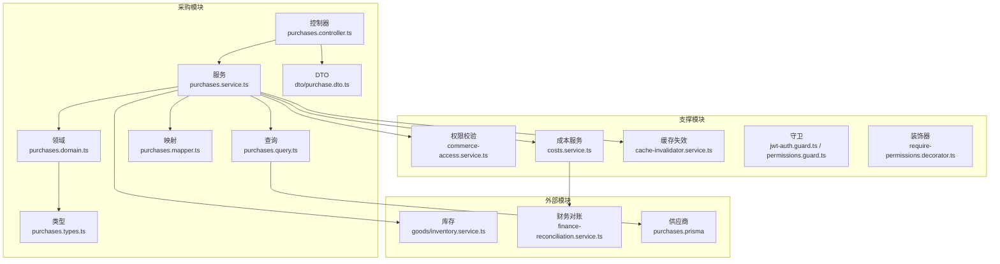
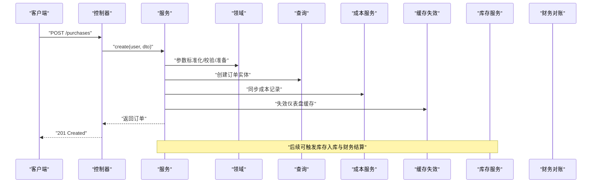
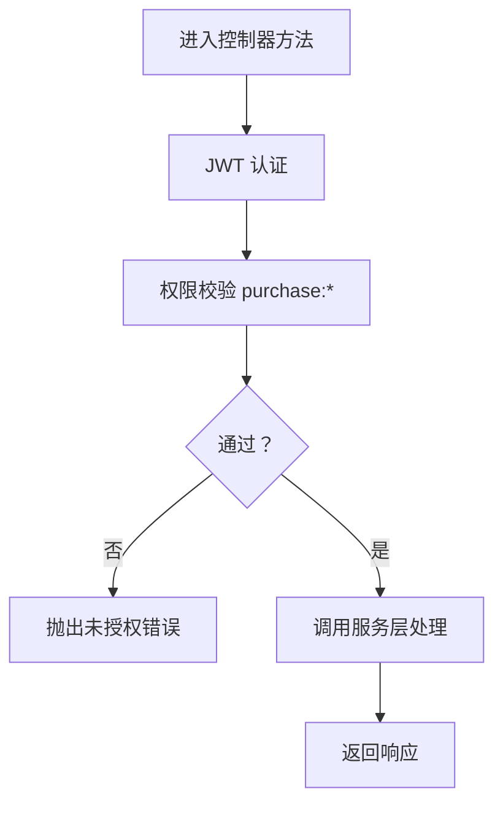
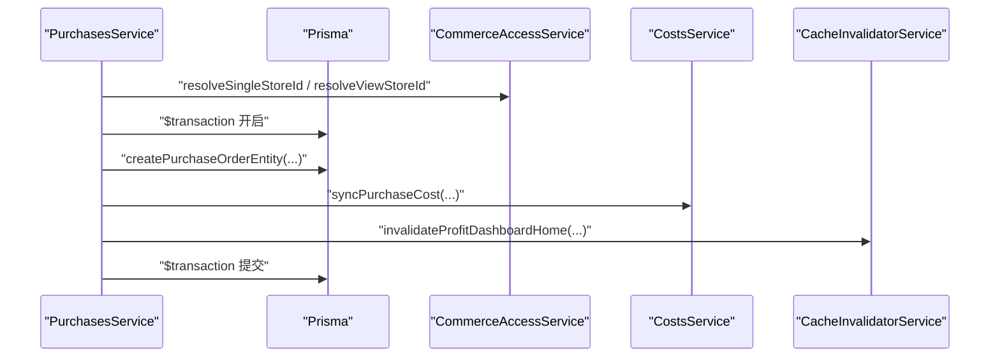
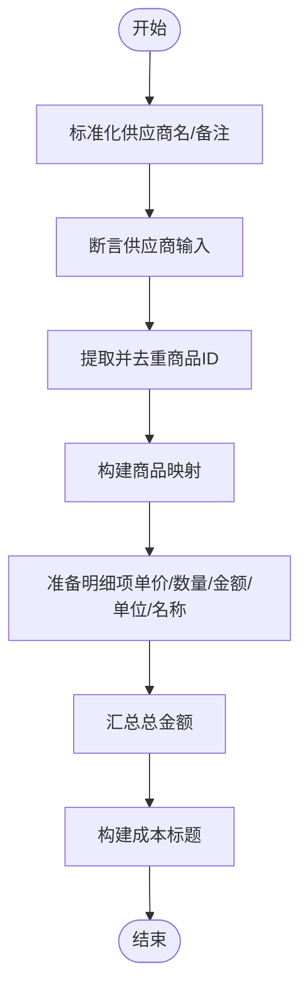
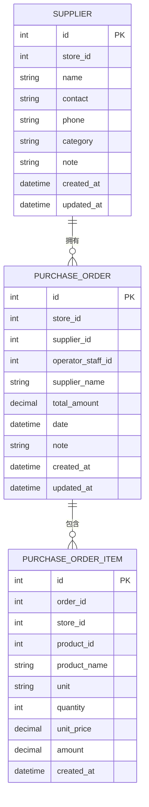
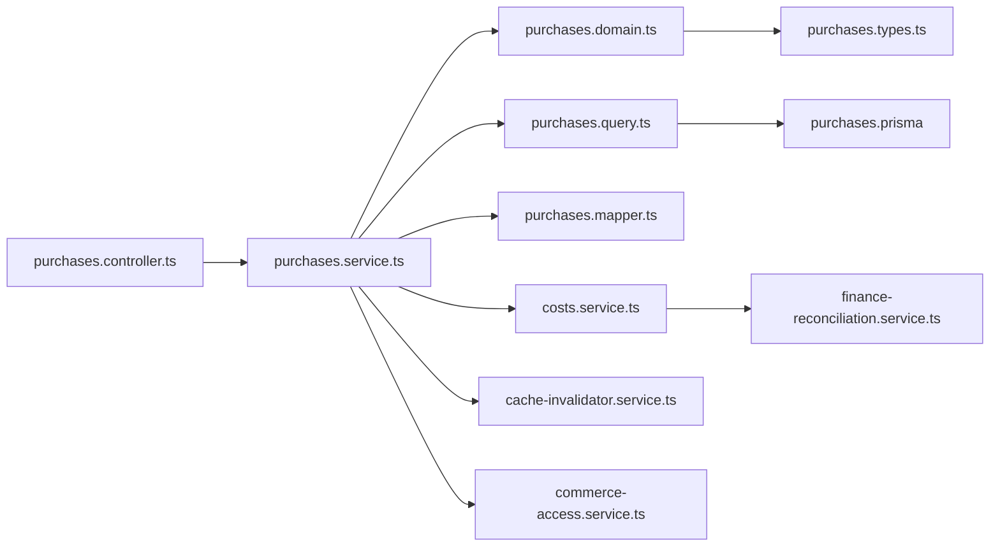

# 采购管理

<cite>
**本文引用的文件**
- [src/purely-profit/operations/purchases/purchases.controller.ts](file://src/purely-profit/operations/purchases/purchases.controller.ts)
- [src/purely-profit/operations/purchases/purchases.service.ts](file://src/purely-profit/operations/purchases/purchases.service.ts)
- [src/purely-profit/operations/purchases/purchases.domain.ts](file://src/purely-profit/operations/purchases/purchases.domain.ts)
- [src/purely-profit/operations/purchases/purchases.types.ts](file://src/purely-profit/operations/purchases/purchases.types.ts)
- [prisma/purely-profit/operations/purchases.prisma](file://prisma/purely-profit/operations/purchases.prisma)
- [src/purely-profit/operations/purchases/dto/purchase.dto.ts](file://src/purely-profit/operations/purchases/dto/purchase.dto.ts)
- [src/purely-profit/operations/purchases/purchases.query.ts](file://src/purely-profit/operations/purchases/purchases.query.ts)
- [src/purely-profit/operations/purchases/purchases.mapper.ts](file://src/purely-profit/operations/purchases/purchases.mapper.ts)
- [src/purely-profit/operations/costs/costs.service.ts](file://src/purely-profit/operations/costs/costs.service.ts)
- [src/purely-profit/finance/finance-reconciliation.service.ts](file://src/purely-profit/finance/finance-reconciliation.service.ts)
- [src/purely-profit/goods/inventory/inventory.service.ts](file://src/purely-profit/goods/inventory/inventory.service.ts)
- [src/purely-profit/marketing/customers/customers.service.ts](file://src/purely-profit/marketing/customers/customers.service.ts)
- [src/purely-profit/stores/stores.service.ts](file://src/purely-profit/stores/stores.service.ts)
- [src/purely-profit/auth/strategies/jwt.strategy.ts](file://src/purely-profit/auth/strategies/jwt.strategy.ts)
- [src/purely-profit/access-control/decorators/require-permissions.decorator.ts](file://src/purely-profit/access-control/decorators/require-permissions.decorator.ts)
- [src/purely-profit/access-control/guards/permissions.guard.ts](file://src/purely-profit/access-control/guards/permissions.guard.ts)
- [src/purely-profit/auth/guards/jwt-auth.guard.ts](file://src/purely-profit/auth/guards/jwt-auth.guard.ts)
- [src/purely-profit/commerce/commerce-access.service.ts](file://src/purely-profit/commerce/commerce-access.service.ts)
- [src/purely-profit/commerce/commerce.utils.ts](file://src/purely-profit/commerce/commerce.utils.ts)
- [src/redis/cache-invalidator.service.ts](file://src/redis/cache-invalidator.service.ts)
- [src/app.controller.ts](file://src/app.controller.ts)
- [src/app.module.ts](file://src/app.module.ts)
</cite>

## 目录
1. [简介](#简介)
2. [项目结构](#项目结构)
3. [核心组件](#核心组件)
4. [架构总览](#架构总览)
5. [详细组件分析](#详细组件分析)
6. [依赖关系分析](#依赖关系分析)
7. [性能考量](#性能考量)
8. [故障排查指南](#故障排查指南)
9. [结论](#结论)
10. [附录](#附录)

## 简介
本文件系统化阐述“采购管理”功能，覆盖从采购订单、采购入库到采购结算的完整业务闭环；解释采购申请、采购审批、采购执行等流程要点；提供采购分析、统计与报表能力说明；并介绍采购优化、监控与异常处理等高级特性。同时，明确采购管理与供应商管理、库存管理、财务模块的协同机制，并给出 API 使用示例、数据结构说明与典型业务场景演示。

## 项目结构
采购管理位于“operations/purchases”模块，采用分层设计：控制器（Controller）负责接口暴露与权限校验，服务（Service）封装业务逻辑与事务控制，领域（Domain）处理参数校验与数据准备，查询（Query）封装数据库访问，映射（Mapper）负责 DTO 转换与响应构建。Prisma 定义了供应商、采购单、采购明细等核心模型。

**图表来源**
- [src/purely-profit/operations/purchases/purchases.controller.ts:1-77](file://src/purely-profit/operations/purchases/purchases.controller.ts#L1-L77)
- [src/purely-profit/operations/purchases/purchases.service.ts:1-225](file://src/purely-profit/operations/purchases/purchases.service.ts#L1-L225)
- [src/purely-profit/operations/purchases/purchases.domain.ts:1-168](file://src/purely-profit/operations/purchases/purchases.domain.ts#L1-L168)
- [src/purely-profit/operations/purchases/purchases.types.ts:1-60](file://src/purely-profit/operations/purchases/purchases.types.ts#L1-L60)
- [src/purely-profit/operations/purchases/purchases.query.ts](file://src/purely-profit/operations/purchases/purchases.query.ts)
- [src/purely-profit/operations/purchases/purchases.mapper.ts](file://src/purely-profit/operations/purchases/purchases.mapper.ts)
- [src/purely-profit/operations/purchases/dto/purchase.dto.ts](file://src/purely-profit/operations/purchases/dto/purchase.dto.ts)
- [src/purely-profit/operations/costs/costs.service.ts](file://src/purely-profit/operations/costs/costs.service.ts)
- [src/purely-profit/goods/inventory/inventory.service.ts](file://src/purely-profit/goods/inventory/inventory.service.ts)
- [src/purely-profit/finance/finance-reconciliation.service.ts](file://src/purely-profit/finance/finance-reconciliation.service.ts)
- [prisma/purely-profit/operations/purchases.prisma:1-65](file://prisma/purely-profit/operations/purchases.prisma#L1-L65)

**章节来源**
- [src/purely-profit/operations/purchases/purchases.controller.ts:1-77](file://src/purely-profit/operations/purchases/purchases.controller.ts#L1-L77)
- [src/purely-profit/operations/purchases/purchases.service.ts:1-225](file://src/purely-profit/operations/purchases/purchases.service.ts#L1-L225)
- [prisma/purely-profit/operations/purchases.prisma:1-65](file://prisma/purely-profit/operations/purchases.prisma#L1-L65)

## 核心组件
- 控制器：提供“获取进货单列表”“获取进货统计”“创建进货单”“删除进货单”等接口，统一鉴权与权限校验。
- 服务：实现业务编排、事务控制、缓存失效、跨模块调用（成本、库存、财务）。
- 领域：参数标准化、校验、数据准备、金额计算、统计区间构建。
- 查询：封装数据库访问，包括订单、供应商、产品、统计聚合等。
- 映射：构建分页响应、空响应、统计响应、订单映射。
- 类型：定义查询参数、聚合结果、订单与明细结构。
- DTO：定义请求/响应的数据契约。

**章节来源**
- [src/purely-profit/operations/purchases/purchases.controller.ts:25-77](file://src/purely-profit/operations/purchases/purchases.controller.ts#L25-L77)
- [src/purely-profit/operations/purchases/purchases.service.ts:48-225](file://src/purely-profit/operations/purchases/purchases.service.ts#L48-L225)
- [src/purely-profit/operations/purchases/purchases.domain.ts:1-168](file://src/purely-profit/operations/purchases/purchases.domain.ts#L1-L168)
- [src/purely-profit/operations/purchases/purchases.types.ts:1-60](file://src/purely-profit/operations/purchases/purchases.types.ts#L1-L60)
- [src/purely-profit/operations/purchases/purchases.mapper.ts](file://src/purely-profit/operations/purchases/purchases.mapper.ts)
- [src/purely-profit/operations/purchases/purchases.query.ts](file://src/purely-profit/operations/purchases/purchases.query.ts)
- [src/purely-profit/operations/purchases/dto/purchase.dto.ts](file://src/purely-profit/operations/purchases/dto/purchase.dto.ts)

## 架构总览
采购管理遵循“控制器-服务-领域-查询-映射”的分层架构，结合权限守卫、JWT 认证、缓存失效与跨模块协作，形成完整的业务闭环。

**图表来源**
- [src/purely-profit/operations/purchases/purchases.controller.ts:54-63](file://src/purely-profit/operations/purchases/purchases.controller.ts#L54-L63)
- [src/purely-profit/operations/purchases/purchases.service.ts:120-190](file://src/purely-profit/operations/purchases/purchases.service.ts#L120-L190)
- [src/purely-profit/operations/purchases/purchases.domain.ts:60-168](file://src/purely-profit/operations/purchases/purchases.domain.ts#L60-L168)
- [src/purely-profit/operations/purchases/purchases.query.ts](file://src/purely-profit/operations/purchases/purchases.query.ts)
- [src/purely-profit/operations/costs/costs.service.ts](file://src/purely-profit/operations/costs/costs.service.ts)
- [src/redis/cache-invalidator.service.ts](file://src/redis/cache-invalidator.service.ts)

## 详细组件分析

### 控制器与权限
- 接口路径：/purchases、/purchase-orders
- 权限装饰器：purchase:view、purchase:create、purchase:delete
- 认证：JWT + 权限守卫
- 主要接口：
  - GET /purchases：列表查询与分页
  - GET /purchases/stats：统计查询
  - POST /purchases：创建采购单
  - DELETE /purchases/:id：删除采购单

**图表来源**
- [src/purely-profit/operations/purchases/purchases.controller.ts:25-77](file://src/purely-profit/operations/purchases/purchases.controller.ts#L25-L77)
- [src/purely-profit/auth/guards/jwt-auth.guard.ts](file://src/purely-profit/auth/guards/jwt-auth.guard.ts)
- [src/purely-profit/access-control/guards/permissions.guard.ts](file://src/purely-profit/access-control/guards/permissions.guard.ts)
- [src/purely-profit/access-control/decorators/require-permissions.decorator.ts](file://src/purely-profit/access-control/decorators/require-permissions.decorator.ts)

**章节来源**
- [src/purely-profit/operations/purchases/purchases.controller.ts:25-77](file://src/purely-profit/operations/purchases/purchases.controller.ts#L25-L77)

### 服务层：业务编排与事务
- 列表与统计：解析分页、构建查询条件、并发聚合、返回分页与统计结果
- 创建流程：解析门店与经办员工、标准化供应商信息、校验商品有效性、准备明细与金额、事务内创建订单与成本记录、失效缓存
- 删除流程：校验访问权限、删除订单并失效缓存

**图表来源**
- [src/purely-profit/operations/purchases/purchases.service.ts:120-190](file://src/purely-profit/operations/purchases/purchases.service.ts#L120-L190)
- [src/purely-profit/operations/costs/costs.service.ts](file://src/purely-profit/operations/costs/costs.service.ts)
- [src/redis/cache-invalidator.service.ts](file://src/redis/cache-invalidator.service.ts)

**章节来源**
- [src/purely-profit/operations/purchases/purchases.service.ts:48-225](file://src/purely-profit/operations/purchases/purchases.service.ts#L48-L225)

### 领域逻辑：参数校验与数据准备
- 日期范围构建：支持周期、自定义日期、自定义起止时间
- 供应商输入断言：必须提供供应商或供应商名称
- 商品去重与有效性校验：确保同品不重复、商品有效
- 明细准备：单价、数量、金额计算，单位与名称推导
- 统计对比：环比上期计算

**图表来源**
- [src/purely-profit/operations/purchases/purchases.domain.ts:60-168](file://src/purely-profit/operations/purchases/purchases.domain.ts#L60-L168)

**章节来源**
- [src/purely-profit/operations/purchases/purchases.domain.ts:1-168](file://src/purely-profit/operations/purchases/purchases.domain.ts#L1-L168)

### 数据模型与关系
- 供应商（Supplier）：与采购单一对多
- 采购单（PurchaseOrder）：与明细、库存调整日志、成本记录关联
- 采购明细（PurchaseOrderItem）：与采购单、商品关联

**图表来源**
- [prisma/purely-profit/operations/purchases.prisma:1-65](file://prisma/purely-profit/operations/purchases.prisma#L1-L65)

**章节来源**
- [prisma/purely-profit/operations/purchases.prisma:1-65](file://prisma/purely-profit/operations/purchases.prisma#L1-L65)

### API 参考与示例

- 获取进货单列表
  - 方法：GET
  - 路径：/purchases
  - 权限：purchase:view
  - 查询参数：storeId、period、customDate、rangeStartDate、rangeEndDate、page、pageSize
  - 响应：分页对象，包含订单列表与统计信息

- 获取进货统计
  - 方法：GET
  - 路径：/purchases/stats
  - 权限：purchase:view
  - 查询参数：storeId、period、customDate、rangeStartDate、rangeEndDate
  - 响应：统计对象，包含供应商数、当前订单数、当前总金额、上期总金额及环比

- 创建进货单
  - 方法：POST
  - 路径：/purchases
  - 权限：purchase:create
  - 请求体：CreatePurchaseDto（含 storeId、supplierId/supplierName、items、date、note）
  - 响应：PurchaseResponseDto

- 删除进货单
  - 方法：DELETE
  - 路径：/purchases/:id
  - 权限：purchase:delete
  - 响应：204 No Content

**章节来源**
- [src/purely-profit/operations/purchases/purchases.controller.ts:32-75](file://src/purely-profit/operations/purchases/purchases.controller.ts#L32-L75)
- [src/purely-profit/operations/purchases/dto/purchase.dto.ts](file://src/purely-profit/operations/purchases/dto/purchase.dto.ts)

### 业务场景演示

- 场景一：创建采购单并生成成本记录
  - 步骤：提交 CreatePurchaseDto → 服务层解析门店与经办员工 → 校验供应商与商品 → 准备明细与金额 → 事务内创建订单与成本记录 → 失效仪表盘缓存 → 返回订单
  - 关联：成本服务同步成本、财务对账可用成本标题进行匹配

- 场景二：批量查询与统计
  - 步骤：列表查询构建日期范围 → 并发统计供应商数与金额聚合 → 返回分页与统计结果 → 支持环比计算

- 场景三：删除采购单
  - 步骤：校验访问权限 → 删除订单 → 失效缓存 → 返回 204

**章节来源**
- [src/purely-profit/operations/purchases/purchases.service.ts:120-211](file://src/purely-profit/operations/purchases/purchases.service.ts#L120-L211)
- [src/purely-profit/operations/purchases/purchases.domain.ts:37-58](file://src/purely-profit/operations/purchases/purchases.domain.ts#L37-L58)

## 依赖关系分析

**图表来源**
- [src/purely-profit/operations/purchases/purchases.controller.ts:1-77](file://src/purely-profit/operations/purchases/purchases.controller.ts#L1-L77)
- [src/purely-profit/operations/purchases/purchases.service.ts:1-225](file://src/purely-profit/operations/purchases/purchases.service.ts#L1-L225)
- [src/purely-profit/operations/purchases/purchases.domain.ts:1-168](file://src/purely-profit/operations/purchases/purchases.domain.ts#L1-L168)
- [src/purely-profit/operations/purchases/purchases.types.ts:1-60](file://src/purely-profit/operations/purchases/purchases.types.ts#L1-L60)
- [src/purely-profit/operations/purchases/purchases.query.ts](file://src/purely-profit/operations/purchases/purchases.query.ts)
- [src/purely-profit/operations/purchases/purchases.mapper.ts](file://src/purely-profit/operations/purchases/purchases.mapper.ts)
- [src/purely-profit/operations/costs/costs.service.ts](file://src/purely-profit/operations/costs/costs.service.ts)
- [src/purely-profit/finance/finance-reconciliation.service.ts](file://src/purely-profit/finance/finance-reconciliation.service.ts)
- [prisma/purely-profit/operations/purchases.prisma:1-65](file://prisma/purely-profit/operations/purchases.prisma#L1-L65)

**章节来源**
- [src/purely-profit/operations/purchases/purchases.service.ts:1-225](file://src/purely-profit/operations/purchases/purchases.service.ts#L1-L225)

## 性能考量
- 分页与并发：列表查询与统计采用并发聚合，减少往返与等待
- 缓存失效：创建/删除订单后主动失效仪表盘缓存，保证统计一致性
- 事务边界：创建订单与成本记录在单事务中完成，避免中间状态
- 查询索引：模型已建立多处索引，提升查询效率

[本节为通用指导，无需具体文件分析]

## 故障排查指南
- 无权访问：检查 JWT 令牌与权限装饰器配置，确认用户具备 purchase:* 权限
- 供应商不存在：创建时若指定 supplierId，需确保供应商存在
- 商品无效：明细中的 productId 必须存在于当前门店的商品集合
- 同品重复：同一商品在明细中仅能出现一次
- 进货单价非法：单价必须为非负有限数值
- 无码商品：无 productId 时必须填写商品名称
- 统计日期范围：确保传入的周期/自定义日期/起止时间合法

**章节来源**
- [src/purely-profit/operations/purchases/purchases.service.ts:149-151](file://src/purely-profit/operations/purchases/purchases.service.ts#L149-L151)
- [src/purely-profit/operations/purchases/purchases.domain.ts:70-157](file://src/purely-profit/operations/purchases/purchases.domain.ts#L70-L157)

## 结论
采购管理模块以清晰的分层架构实现了从订单创建到统计分析的全链路能力，结合权限、事务与缓存策略，保障了业务正确性与性能。通过与成本、库存、财务模块的协同，形成了完整的供应链财务闭环。建议在实际部署中关注权限配置、索引维护与缓存策略，持续优化查询与统计性能。

[本节为总结性内容，无需具体文件分析]

## 附录

### 与供应商管理的协同
- 供应商模型独立于采购单，支持按门店维度唯一命名，便于区分同名供应商
- 采购单可直接记录供应商名称，用于成本标题与财务对账

**章节来源**
- [prisma/purely-profit/operations/purchases.prisma:3-19](file://prisma/purely-profit/operations/purchases.prisma#L3-L19)

### 与库存管理的协同
- 采购单包含库存调整日志字段，可用于后续触发库存入库流程
- 建议在创建采购单后，基于明细生成库存调整记录，更新商品库存与成本价

[本节为概念性说明，无需具体文件分析]

### 与财务模块的协同
- 成本服务根据供应商名称构建成本标题，便于财务对账识别
- 财务对账服务支持按供应商类别的差异项检索，辅助异常处理

**章节来源**
- [src/purely-profit/operations/costs/costs.service.ts](file://src/purely-profit/operations/costs/costs.service.ts)
- [src/purely-profit/finance/finance-reconciliation.service.ts](file://src/purely-profit/finance/finance-reconciliation.service.ts)

### 与门店与人员的集成
- 商业访问服务负责解析用户可见门店、经办员工等上下文
- 控制器与服务均通过访问服务解析 storeId 与 operatorStaffId

**章节来源**
- [src/purely-profit/commerce/commerce-access.service.ts](file://src/purely-profit/commerce/commerce-access.service.ts)
- [src/purely-profit/operations/purchases/purchases.service.ts:124-134](file://src/purely-profit/operations/purchases/purchases.service.ts#L124-L134)