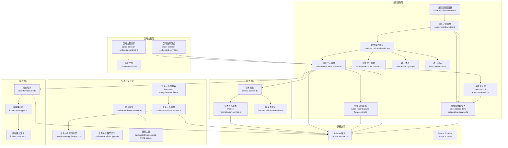
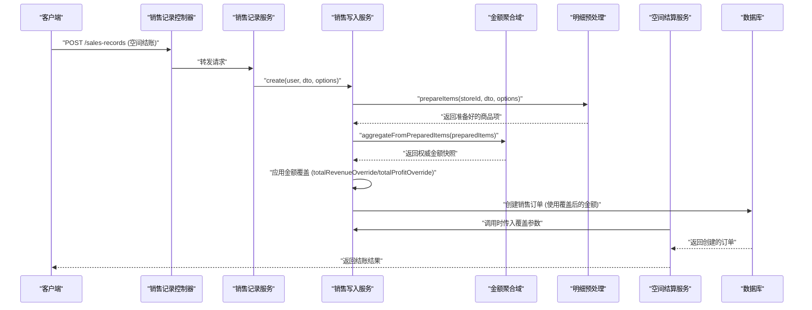
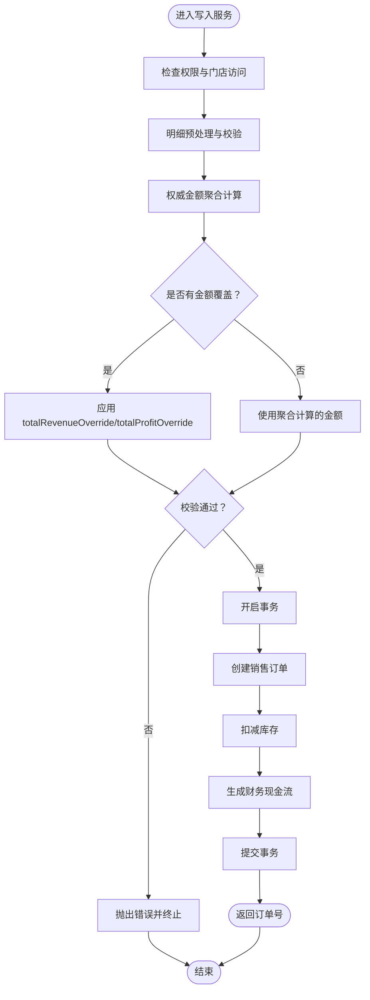
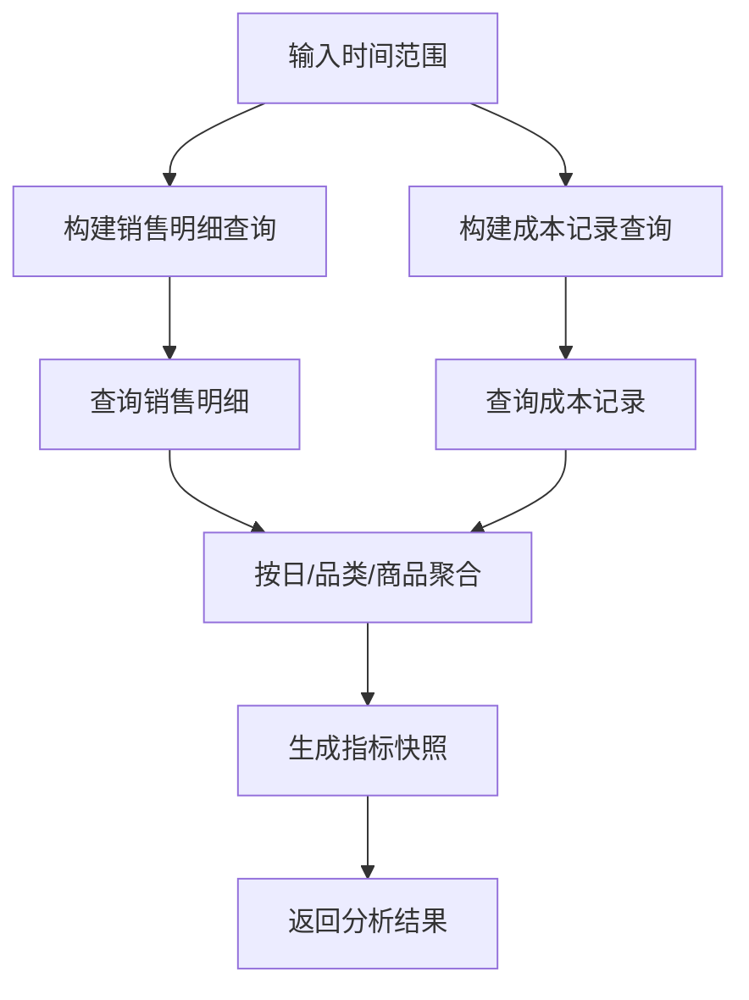
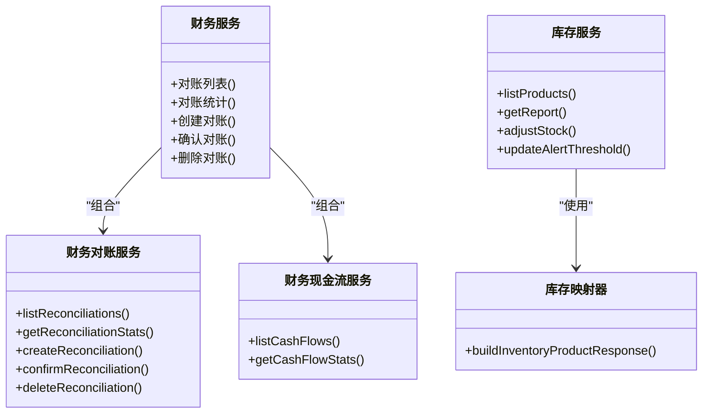
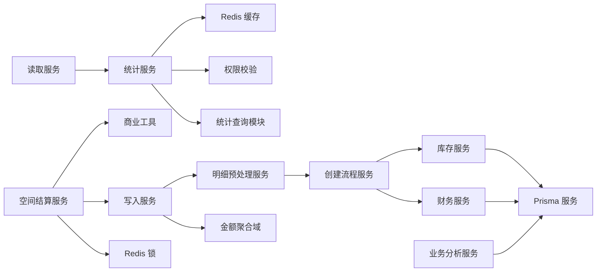

# 销售管理

<cite>
**本文引用的文件**
- [sales-record.controller.ts](file://src/purely-profit/operations/sales-record/sales-record.controller.ts)
- [sales-record.service.ts](file://src/purely-profit/operations/sales-record/sales-record.service.ts)
- [sales-record-read.service.ts](file://src/purely-profit/operations/sales-record/sales-record-read.service.ts)
- [sales-record-stats.service.ts](file://src/purely-profit/operations/sales-record/sales-record-stats.service.ts)
- [sales-record-query.ts](file://src/purely-profit/operations/sales-record/sales-record.query.ts)
- [sales-record.dto.ts](file://src/purely-profit/operations/sales-record/dto/sales-record.dto.ts)
- [sales-record-read.utils.ts](file://src/purely-profit/operations/sales-record/sales-record-read.utils.ts)
- [sales-record-report.service.ts](file://src/purely-profit/operations/sales-record/sales-record-report.service.ts)
- [sales-record-preview.service.ts](file://src/purely-profit/operations/sales-record/sales-record-preview.service.ts)
- [sales-record-write.service.ts](file://src/purely-profit/operations/sales-record/sales-record-write.service.ts)
- [sales-record-create-flow.service.ts](file://src/purely-profit/operations/sales-record/sales-record-create-flow.service.ts)
- [sales-record-item-preparation.service.ts](file://src/purely-profit/operations/sales-record/sales-record-item-preparation.service.ts)
- [sales-record-amounts.domain.ts](file://src/purely-profit/operations/sales-record/sales-record-amounts.domain.ts)
- [products.domain.ts](file://src/purely-profit/goods/products/products.domain.ts)
- [commerce.utils.ts](file://src/purely-profit/commerce/commerce.utils.ts)
- [space-session-settlement.service.ts](file://src/purely-profit/operations/spaces/space-session-settlement.service.ts)
- [space-session-settlement.shared.ts](file://src/purely-profit/operations/spaces/space-session-settlement.shared.ts)
- [business-analysis.controller.ts](file://src/purely-profit/dashboard/business-analysis/business-analysis.controller.ts)
- [business-analysis.service.ts](file://src/purely-profit/dashboard/business-analysis/business-analysis.service.ts)
- [business-analysis.query.ts](file://src/purely-profit/dashboard/business-analysis/business-analysis.query.ts)
- [business-analysis.types.ts](file://src/purely-profit/dashboard/business-analysis/business-analysis.types.ts)
- [dashboard-home.service.ts](file://src/purely-profit/dashboard/dashboard-home/dashboard-home.service.ts)
- [dashboard-home.sales-trend.utils.ts](file://src/purely-profit/dashboard/dashboard-home/dashboard-home.sales-trend.utils.ts)
- [finance.service.ts](file://src/purely-profit/finance/finance.service.ts)
- [finance-reconciliation.service.ts](file://src/purely-profit/finance/finance-reconciliation.service.ts)
- [finance-cash-flow.service.ts](file://src/purely-profit/finance/finance-cash-flow.service.ts)
- [inventory.service.ts](file://src/purely-profit/goods/inventory/inventory.service.ts)
- [inventory.mapper.ts](file://src/purely-profit/goods/inventory/inventory.mapper.ts)
- [inventory.types.ts](file://src/purely-profit/goods/inventory/inventory.types.ts)
- [prisma.service.ts](file://src/prisma/prisma.service.ts)
- [prisma.schema](file://prisma/schema.prisma)
</cite>

## 更新摘要
**变更内容**   
- **权威金额覆盖机制**：引入 totalRevenueOverride 和 totalProfitOverride 参数，支持空间结账等复杂场景下的金额覆盖
- **SalesRecordAmountsDomain 增强**：增强了 aggregateFromPreparedItems 方法，支持抵扣项排除选项和一致性验证
- **移除过期逻辑**：移除了 findPendingHandoverOperatorStaffId 和 findCurrentShiftOperatorStaffId 等过期的班次操作员解析逻辑
- **空间会话结账改进**：改进了空间会话结账时的抵扣项处理逻辑，确保预付款和续费抵扣的正确处理
- **利润计算强化**：进一步强化了后端作为唯一权威来源的地位，所有利润计算都在服务端完成

## 目录
1. [简介](#简介)
2. [项目结构](#项目结构)
3. [核心组件](#核心组件)
4. [架构总览](#架构总览)
5. [详细组件分析](#详细组件分析)
6. [依赖关系分析](#依赖关系分析)
7. [性能考量](#性能考量)
8. [故障排查指南](#故障排查指南)
9. [结论](#结论)
10. [附录](#附录)

## 简介
本文件系统性阐述销售管理功能，覆盖销售订单、销售记录、销售统计与分析、销售预测与报表、销售优化与监控、异常处理等能力，并说明与商品库存、财务模块的协同机制。内容基于代码库中的实际实现进行归纳总结，帮助开发者与运营人员快速理解与使用销售管理能力。

**重要更新** 系统已实施重大架构改进，引入权威金额覆盖机制，强化了 SalesRecordAmountsDomain 的金额聚合能力，移除了过期的班次操作员解析逻辑，并改进了空间会话结账时的抵扣项处理逻辑。

## 项目结构
销售管理相关代码主要分布在以下模块：
- 销售记录与订单：operations/sales-record
- 空间管理与结算：operations/spaces
- 销售分析与仪表盘：dashboard/business-analysis 与 dashboard/dashboard-home
- 财务协同：finance
- 库存协同：goods/inventory
- 数据访问：prisma



**图表来源**
- [sales-record.controller.ts:1-219](file://src/purely-profit/operations/sales-record/sales-record.controller.ts#L1-L219)
- [sales-record.service.ts:1-89](file://src/purely-profit/operations/sales-record/sales-record.service.ts#L1-L89)
- [sales-record-read.service.ts:1-71](file://src/purely-profit/operations/sales-record/sales-record-read.service.ts#L1-L71)
- [sales-record-stats.service.ts:1-146](file://src/purely-profit/operations/sales-record/sales-record-stats.service.ts#L1-L146)
- [sales-record-query.ts:1-182](file://src/purely-profit/operations/sales-record/sales-record.query.ts#L1-L182)
- [sales-record.dto.ts:390-465](file://src/purely-profit/operations/sales-record/dto/sales-record.dto.ts#L390-L465)
- [space-session-settlement.service.ts:1-200](file://src/purely-profit/operations/spaces/space-session-settlement.service.ts#L1-L200)
- [space-session-settlement.shared.ts:1-335](file://src/purely-profit/operations/spaces/space-session-settlement.shared.ts#L1-L335)
- [commerce.utils.ts:1-340](file://src/purely-profit/commerce/commerce.utils.ts#L1-L340)

**章节来源**
- [sales-record.controller.ts:1-219](file://src/purely-profit/operations/sales-record/sales-record.controller.ts#L1-L219)
- [sales-record.service.ts:1-89](file://src/purely-profit/operations/sales-record/sales-record.service.ts#L1-L89)
- [business-analysis.controller.ts:1-200](file://src/purely-profit/dashboard/business-analysis/business-analysis.controller.ts#L1-L200)
- [finance.service.ts:1-200](file://src/purely-profit/finance/finance.service.ts#L1-L200)
- [inventory.service.ts:1-200](file://src/purely-profit/goods/inventory/inventory.service.ts#L1-L200)
- [prisma.service.ts:1-200](file://src/prisma/prisma.service.ts#L1-L200)

## 核心组件
- 销售记录控制器：对外暴露销售记录的增删查改接口，负责参数校验与响应封装。
- 销售记录服务：协调读取、写入、统计等功能，提供统一入口。
- 销售读取服务：提供商品列表、订单列表、统计查询、报表查询等只读功能。
- **销售统计服务**：**新增** 实现 SalesRecordStatsService，提供实时销售统计查询能力。
- **统计查询模块**：**新增** 实现 aggregateOrderStats 函数，提供数据库级统计聚合。
- 写入服务：执行权限校验、明细预处理、**权威金额聚合与覆盖**、事务化创建与回滚。
- 创建流程服务：在单个事务中完成销售订单创建、库存扣减、财务现金流生成。
- 明细预处理服务：将前端传入的商品明细标准化、**后端强制计算利润与汇总**。
- **金额聚合域服务**：**统一的权威金额计算入口，支持覆盖机制和一致性验证**。
- 空间结算服务：**改进** 处理空间会话结账时的抵扣项逻辑，支持权威金额覆盖。
- 业务分析服务：聚合销售与成本数据，支持日维度、品类维度、排行榜等多维分析。
- 财务服务：提供对账、概览、现金流等财务能力，支撑销售结算闭环。
- 库存服务：提供库存查询、调整、告警阈值设置等能力，保障销售与库存一致性。

**重大更新** 引入了权威金额覆盖机制，支持空间结账等复杂场景下的金额覆盖；增强了 SalesRecordAmountsDomain 的金额聚合能力；移除了过期的班次操作员解析逻辑。

**章节来源**
- [sales-record.controller.ts:1-219](file://src/purely-profit/operations/sales-record/sales-record.controller.ts#L1-L219)
- [sales-record.service.ts:1-89](file://src/purely-profit/operations/sales-record/sales-record.service.ts#L1-L89)
- [sales-record-read.service.ts:1-71](file://src/purely-profit/operations/sales-record/sales-record-read.service.ts#L1-L71)
- [sales-record-stats.service.ts:1-146](file://src/purely-profit/operations/sales-record/sales-record-stats.service.ts#L1-L146)
- [sales-record-query.ts:1-182](file://src/purely-profit/operations/sales-record/sales-record.query.ts#L1-L182)
- [sales-record-write.service.ts:1-187](file://src/purely-profit/operations/sales-record/sales-record-write.service.ts#L1-L187)
- [sales-record-create-flow.service.ts:1-171](file://src/purely-profit/operations/sales-record/sales-record-create-flow.service.ts#L1-L171)
- [sales-record-item-preparation.service.ts:1-180](file://src/purely-profit/operations/sales-record/sales-record-item-preparation.service.ts#L1-L180)
- [sales-record-amounts.domain.ts:1-109](file://src/purely-profit/operations/sales-record/sales-record-amounts.domain.ts#L1-L109)
- [space-session-settlement.service.ts:1-200](file://src/purely-profit/operations/spaces/space-session-settlement.service.ts#L1-L200)
- [space-session-settlement.shared.ts:1-335](file://src/purely-profit/operations/spaces/space-session-settlement.shared.ts#L1-L335)
- [commerce.utils.ts:1-340](file://src/purely-profit/commerce/commerce.utils.ts#L1-L340)
- [business-analysis.service.ts:1-200](file://src/purely-profit/dashboard/business-analysis/business-analysis.service.ts#L1-L200)
- [finance.service.ts:1-200](file://src/purely-profit/finance/finance.service.ts#L1-L200)
- [inventory.service.ts:1-200](file://src/purely-profit/goods/inventory/inventory.service.ts#L1-L200)

## 架构总览
销售管理采用"控制器-服务-领域流程-外部模块协同"的分层架构。写入路径通过事务保证一致性，同时联动库存与财务模块，确保销售发生后的库存扣减与现金流入账同步完成。**新的架构引入了权威金额覆盖机制，支持复杂场景下的金额覆盖需求**。**新增了空间结算服务的改进，正确处理抵扣项逻辑**。



**图表来源**
- [sales-record.controller.ts:73-82](file://src/purely-profit/operations/sales-record/sales-record.controller.ts#L73-L82)
- [sales-record.service.ts:55-60](file://src/purely-profit/operations/sales-record/sales-record.service.ts#L55-L60)
- [sales-record-write.service.ts:33-101](file://src/purely-profit/operations/sales-record/sales-record-write.service.ts#L33-L101)
- [sales-record-item-preparation.service.ts:64-178](file://src/purely-profit/operations/sales-record/sales-record-item-preparation.service.ts#L64-L178)
- [sales-record-amounts.domain.ts:37-80](file://src/purely-profit/operations/sales-record/sales-record-amounts.domain.ts#L37-L80)
- [space-session-settlement.service.ts:127-137](file://src/purely-profit/operations/spaces/space-session-settlement.service.ts#L127-L137)

## 详细组件分析

### 销售记录模块
- 控制器职责：接收请求、参数校验、调用服务、返回响应。
- 服务编排：将读写分离，读取直接走只读服务，写入通过写入服务编排。
- **写入流程**：**增强** 权限校验、明细预处理、**权威金额聚合与覆盖**、事务化创建、失败回滚。
- 回滚策略：删除销售记录时，回滚库存扣减并删除对应财务现金流记录。

**重大更新** 写入流程现在包含权威金额覆盖步骤，支持空间结账等复杂场景下的金额覆盖，确保金额计算的准确性。



**图表来源**
- [sales-record-write.service.ts:33-101](file://src/purely-profit/operations/sales-record/sales-record-write.service.ts#L33-L101)
- [sales-record-create-flow.service.ts:1-171](file://src/purely-profit/operations/sales-record/sales-record-create-flow.service.ts#L1-L171)
- [sales-record-item-preparation.service.ts:64-178](file://src/purely-profit/operations/sales-record/sales-record-item-preparation.service.ts#L64-L178)
- [sales-record-amounts.domain.ts:37-80](file://src/purely-profit/operations/sales-record/sales-record-amounts.domain.ts#L37-L80)
- [inventory.service.ts:1-200](file://src/purely-profit/goods/inventory/inventory.service.ts#L1-L200)
- [finance.service.ts:1-200](file://src/purely-profit/finance/finance.service.ts#L1-L200)

**章节来源**
- [sales-record.controller.ts:1-219](file://src/purely-profit/operations/sales-record/sales-record.controller.ts#L1-L219)
- [sales-record.service.ts:1-89](file://src/purely-profit/operations/sales-record/sales-record.service.ts#L1-L89)
- [sales-record-write.service.ts:1-187](file://src/purely-profit/operations/sales-record/sales-record-write.service.ts#L1-L187)
- [sales-record-create-flow.service.ts:1-171](file://src/purely-profit/operations/sales-record/sales-record-create-flow.service.ts#L1-L171)

### 权威金额覆盖机制

**重大更新** 系统引入了权威金额覆盖机制，支持空间结账等复杂场景下的金额覆盖需求。

#### CreateSalesRecordOptions 扩展
**新增** totalRevenueOverride 和 totalProfitOverride 参数：

```typescript
export interface CreateSalesRecordOptions {
  skipInventoryValidationAndDeduction?: boolean;
  skipAccessCheck?: boolean;
  assignToCurrentShiftOperator?: boolean;
  transactionClient?: Prisma.TransactionClient;
  preserveCallerPrices?: boolean;
  /**
   * 覆盖 SaleOrder.totalRevenue（元）。
   * 空间结账等场景下，抵扣项（预付款/续费抵扣）在 SaleOrderItem 中以正数存储，
   * 但 totalRevenue 必须反映实际结算金额（消费 - 抵扣，可能为负数），
   * 因此需要使用结算层计算的权威值，而非从 items 重新聚合。
   */
  totalRevenueOverride?: number;
  /** 覆盖 SaleOrder.totalProfit（元），与 totalRevenueOverride 同理。 */
  totalProfitOverride?: number;
}
```

#### 写入服务中的覆盖逻辑
**增强** 写入服务现在支持金额覆盖：

```typescript
// 使用统一金额聚合域计算权威金额（确保与 preview 计算一致）
const amountsSnapshot =
  SalesRecordAmountsDomain.aggregateFromPreparedItems(preparedItems);
// 空间结账场景：抵扣项在 items 中以正数存储，聚合会多算，
// 使用结算层传入的权威值覆盖 totalRevenue / totalProfit。
const totalRevenue =
  options.totalRevenueOverride ?? amountsSnapshot.totalRevenue;
const totalProfit =
  options.totalProfitOverride ?? amountsSnapshot.totalProfit;
const totalQuantity = amountsSnapshot.totalQuantity;
```

#### 空间结算服务中的应用
**改进** 空间结算服务现在正确传递覆盖参数：

```typescript
const createdOrder = await this.createSessionSaleOrder(user, {
  transaction,
  storeId: params.session.storeId,
  checkoutAt: params.checkoutAt,
  paymentMethod: params.paymentMethod,
  note: params.note,
  items: params.settlement.orderItems,
  totalRevenue: params.settlement.totalRevenue, // 权威金额
  totalProfit: params.settlement.totalProfit,   // 权威金额
  totalQuantity: params.settlement.totalQuantity,
});
```

**章节来源**
- [sales-record-item-preparation.service.ts:39-58](file://src/purely-profit/operations/sales-record/sales-record-item-preparation.service.ts#L39-L58)
- [sales-record-write.service.ts:68-77](file://src/purely-profit/operations/sales-record/sales-record-write.service.ts#L68-L77)
- [space-session-settlement.service.ts:127-137](file://src/purely-profit/operations/spaces/space-session-settlement.service.ts#L127-L137)

### SalesRecordAmountsDomain 增强

**重大更新** SalesRecordAmountsDomain 的 aggregateFromPreparedItems 方法得到了显著增强。

#### 增强的聚合方法
**增强** 支持抵扣项排除选项：

```typescript
static aggregateFromPreparedItems(
  preparedItems: PreparedSalesItem[],
  options: { excludeDeductionItems?: boolean } = {},
): SalesRecordAmountsSnapshot {
  const shouldExcludeDeductions = options.excludeDeductionItems !== false;

  let totalRevenue = Money.zero();
  let totalProfit = Money.zero();
  let totalQuantity = 0;

  const items = preparedItems.map((item) => {
    const subtotal = item.salePrice.multiply(item.quantity);
    const profitSubtotal = item.profit.multiply(item.quantity);

    // 金额聚合逻辑：
    // - 如果不排除抵扣项，所有项都计入
    // - 如果排除抵扣项，只有 countsTowardTotalQuantity=true 的项才计入
    const shouldIncludeInAmounts = !shouldExcludeDeductions || item.countsTowardTotalQuantity;
    if (shouldIncludeInAmounts) {
      totalRevenue = totalRevenue.add(subtotal);
      totalProfit = totalProfit.add(profitSubtotal);
    }

    // 件数只计算 countsTowardTotalQuantity=true 的项
    if (item.countsTowardTotalQuantity) {
      totalQuantity += item.quantity;
    }

    return {
      salePrice: item.salePrice.toOutputYuan(),
      profit: item.profit.toOutputYuan(),
      quantity: item.quantity,
      subtotal: subtotal.toOutputYuan(),
      profitSubtotal: profitSubtotal.toOutputYuan(),
    };
  });

  return {
    items,
    totalRevenue: totalRevenue.toOutputYuan(),
    totalProfit: totalProfit.toOutputYuan(),
    totalQuantity,
  };
}
```

#### 一致性验证
**新增** 金额一致性验证方法：

```typescript
static assertConsistency(snapshot: SalesRecordAmountsSnapshot): void {
  // 验证 subtotal 汇总是否等于 totalRevenue
  const revenueSum = snapshot.items.reduce((sum, item) => sum + item.subtotal, 0);
  const revenueRounded = Math.round(revenueSum * 100) / 100;
  const totalRevenueRounded = Math.round(snapshot.totalRevenue * 100) / 100;

  if (Math.abs(revenueRounded - totalRevenueRounded) > 0.01) {
    throw new Error(
      `销售额汇总不一致: sum(subtotal)=${revenueRounded}, totalRevenue=${totalRevenueRounded}`,
    );
  }

  // 验证 profitSubtotal 汇总是否等于 totalProfit
  const profitSum = snapshot.items.reduce((sum, item) => sum + item.profitSubtotal, 0);
  const profitRounded = Math.round(profitSum * 100) / 100;
  const totalProfitRounded = Math.round(snapshot.totalProfit * 100) / 100;

  if (Math.abs(profitRounded - totalProfitRounded) > 0.01) {
    throw new Error(
      `利润汇总不一致: sum(profitSubtotal)=${profitRounded}, totalProfit=${totalProfitRounded}`,
    );
  }
}
```

**章节来源**
- [sales-record-amounts.domain.ts:37-80](file://src/purely-profit/operations/sales-record/sales-record-amounts.domain.ts#L37-L80)
- [sales-record-amounts.domain.ts:85-107](file://src/purely-profit/operations/sales-record/sales-record-amounts.domain.ts#L85-L107)

### 空间会话结账改进

**重大更新** 空间会话结账时的抵扣项处理逻辑得到了显著改进。

#### 抵扣项识别
**新增** 统一的抵扣项识别函数：

```typescript
export function isDeductionProductName(productName: string): boolean {
  return (
    productName === PREPAID_DEDUCTION_PRODUCT_NAME ||
    productName === '预付抵扣' || // 兼容历史数据
    productName === RENEW_DEDUCTION_PRODUCT_NAME
  );
}
```

#### 空间结算构建
**改进** 空间结算构建逻辑正确处理各种抵扣项：

```typescript
// renewRecords.amount 已由 mapRenewRecordRows 转为元
const renewDeductionMoney = renewRecords.reduce(
  (sum, record) => sum.add(Money.fromInputYuan(record.amount)),
  Money.zero(),
);
const renewDeductionYuan = renewDeductionMoney.toOutputYuan();
if (renewDeductionMoney.isPositive()) {
  orderItems.push({
    productId: 'SYS_RENEW_DEDUCTION',
    productName: '续费抵扣',
    categoryName: '场地费',
    salePrice: -renewDeductionYuan,
    profit: -renewDeductionYuan,
    quantity: 1,
    lineTotal: -renewDeductionYuan,
  });
}

const prepaidDeductionMoney = resolveSpaceSessionPrepaidDeductionMoney(session);
const prepaidDeductionYuan = prepaidDeductionMoney.toOutputYuan();
if (prepaidDeductionMoney.isPositive()) {
  orderItems.push({
    productId: 'SYS_PREPAID_DEDUCTION',
    productName: '预付款',
    categoryName: '场地费',
    salePrice: -prepaidDeductionYuan,
    profit: -prepaidDeductionYuan,
    quantity: 1,
    lineTotal: -prepaidDeductionYuan,
  });
}
```

#### 数据库存储处理
**改进** 数据库存储时正确处理抵扣项的正负值：

```typescript
// orderItems 中的 salePrice/profit 是元，DB 存储为分
// 抵扣项在结算中为负数，DB 中存正数（代表已收到的预付款/续费金额）
salePrice: isDeductionProductName(item.productName)
  ? Money.fromInputYuan(Math.abs(item.salePrice)).toDbCents()
  : Money.fromInputYuan(item.salePrice).toDbCents(),
profit: isDeductionProductName(item.productName)
  ? Money.fromInputYuan(Math.abs(item.profit)).toDbCents()
  : Money.fromInputYuan(item.profit).toDbCents(),
```

**章节来源**
- [commerce.utils.ts:37-43](file://src/purely-profit/commerce/commerce.utils.ts#L37-L43)
- [space-session-settlement.shared.ts:62-91](file://src/purely-profit/operations/spaces/space-session-settlement.shared.ts#L62-L91)
- [space-session-settlement.service.ts:149-156](file://src/purely-profit/operations/spaces/space-session-settlement.service.ts#L149-L156)

### 移除的过期逻辑

**重大更新** 移除了过期的班次操作员解析逻辑。

#### 简化的操作员解析
**简化** 写入服务中的操作员解析逻辑：

```typescript
private async resolveOperatorStaffId(
  user: AuthenticatedUser,
  storeId: number,
  _options: CreateSalesRecordOptions,
  _orderDate: Date,
): Promise<number | null> {
  const currentOperatorStaffId =
    await this.commerceAccessService.findOperatorStaffIdForStore(
      user,
      storeId,
    );

  // 系统用户（如自动结账调度）没有 membership，operatorStaffId 应为 null，
  // 使 SaleOrder.operatorNameSnapshot 也为 null，交班页兜底展示"空间自动结账"。
  // 交班页已不再按 operatorStaffId 过滤销售记录（按门店 + 时间范围查询），
  // 因此无需回退到班次员工。
  if (!user.currentMembership) {
    return null;
  }

  // 有 membership 的用户（主账号/店长/收银员）始终使用自身 staffId，
  // 确保本班销售记录中操作员显示为实际操作账号。
  return currentOperatorStaffId;
}
```

**章节来源**
- [sales-record-write.service.ts:151-174](file://src/purely-profit/operations/sales-record/sales-record-write.service.ts#L151-L174)

### 销售统计功能

**重大更新** 系统新增完善的销售统计功能，提供实时的汇总统计能力。

#### 销售统计服务
**新增** SalesRecordStatsService 提供实时销售统计查询能力：

```typescript
@Injectable()
export class SalesRecordStatsService {
  constructor(
    private readonly prisma: PrismaService,
    private readonly redisService: RedisService,
    private readonly commerceAccessService: CommerceAccessService,
    private readonly platformMembershipAccessService: PlatformMembershipAccessService,
  ) {}

  async getStats(
    user: AuthenticatedUser,
    query: SalesStatsQueryDto,
  ): Promise<SalesStatsResponseDto> {
    // 解析门店ID和权限校验
    const storeId = await this.commerceAccessService.resolveViewStoreId(
      user,
      query.storeId,
      'sales:view',
      '无权查看该门店销售统计',
    );

    // 构建缓存键
    const cacheKey = buildSalesStatsCacheKey(storeId, {
      scope: callerIsSubAccount ? 'sub_account' : 'owner',
      period: query.period,
      year: query.year,
      customDate: query.customDate !== undefined ? String(query.customDate) : undefined,
      rangeStartDate: query.rangeStartDate !== undefined ? String(query.rangeStartDate) : undefined,
      rangeEndDate: query.rangeEndDate !== undefined ? String(query.rangeEndDate) : undefined,
    });

    // 缓存获取或加载刷新
    return this.redisService.getOrLoadRefreshableJson({
      cacheKey,
      taskKey: buildCacheRefreshTaskKey(cacheKey),
      ttlSeconds: SALES_STATS_CACHE_TTL_SECONDS,
      refreshAfterMs: SALES_STATS_REFRESH_AFTER_MS,
      loadValue: () => this.buildStats(storeId, callerIsSubAccount, query),
      refreshValue: () => this.buildStats(storeId, false, query),
    });
  }

  private async buildStats(
    storeId: number,
    callerIsSubAccount: boolean,
    query: SalesStatsQueryDto,
  ): Promise<SalesStatsResponseDto> {
    // 构建时间范围
    const queryInput = toSalesRecordQueryInput(query);
    const currentRange = buildCurrentRange(queryInput);
    const previousRange = buildPreviousRange(queryInput, currentRange);
    
    // 平台会员权限限制
    const clampedCurrentRange = await this.platformMembershipAccessService.clampHistoryRange(
      storeId,
      currentRange,
      callerIsSubAccount,
    );
    const clampedPreviousRange = previousRange
      ? await this.platformMembershipAccessService.clampHistoryRange(
          storeId,
          previousRange,
          callerIsSubAccount,
        )
      : null;

    // 统计查询
    const [currentStats, previousStats] = await Promise.all([
      aggregateOrderStats(this.prisma, storeId, {
        start: clampedCurrentRange.start,
        end: clampedCurrentRange.end,
      }),
      clampedPreviousRange && !clampedPreviousRange.empty
        ? aggregateOrderStats(this.prisma, storeId, {
            start: clampedPreviousRange.start,
            end: clampedPreviousRange.end,
          })
        : Promise.resolve<SalesStatsAggregation>({
            totalRevenue: 0,
            totalProfit: 0,
            orderCount: 0,
          }),
    ]);

    // 计算平均客单价和环比
    return {
      totalRevenue: currentStats.totalRevenue,
      totalProfit: currentStats.totalProfit,
      orderCount: currentStats.orderCount,
      avgOrderValue:
        currentStats.orderCount > 0
          ? Money.fromInputYuan(currentStats.totalRevenue)
              .divide(currentStats.orderCount)
              .toOutputYuan()
          : 0,
      compareLastPeriod:
        clampedPreviousRange &&
        !clampedPreviousRange.empty &&
        previousStats.totalRevenue > 0
          ? calcPercentChangeWithFallback(
              currentStats.totalRevenue,
              previousStats.totalRevenue,
            )
          : null,
    };
  }
}
```

#### 统计查询模块
**新增** aggregateOrderStats 函数提供数据库级统计聚合：

```typescript
export async function aggregateOrderStats(
  prisma: PrismaService,
  storeId: number,
  range: SalesPeriodRange,
): Promise<SalesStatsAggregation> {
  // 从 sale_order_items 聚合，排除预付抵扣行，只算实际消费
  const result = await prisma.$queryRaw<
    [
      {
        revenue: Prisma.Decimal | null;
        profit: Prisma.Decimal | null;
        order_count: bigint;
      },
    ]
  >`
    SELECT
      COALESCE(SUM(soi.sale_price * soi.quantity), 0) AS revenue,
      COALESCE(SUM(soi.profit * soi.quantity), 0) AS profit,
      COUNT(DISTINCT so.id) AS order_count
    FROM sale_order_items soi
    INNER JOIN sale_orders so ON so.id = soi.order_id
    WHERE so.store_id = ${storeId}
      AND so.date >= ${new Date(range.start)}
      AND so.date <= ${new Date(range.end)}
      AND soi.product_name NOT IN ('预付抵扣', '续费抵扣')
  `;

  return {
    totalRevenue: Money.fromDbCents(Number(result[0]?.revenue ?? 0)).toOutputYuan(),
    totalProfit: Money.fromDbCents(Number(result[0]?.profit ?? 0)).toOutputYuan(),
    orderCount: Number(result[0]?.order_count ?? 0),
  };
}
```

#### 统计DTO定义
**新增** SalesStatsResponseDto 和 SalesStatsQueryDto 类型定义：

```typescript
export class SalesStatsResponseDto {
  @ApiProperty({ example: 1200.5, description: '当前筛选周期总营业额' })
  totalRevenue: number;

  @ApiProperty({ example: 320.2, description: '当前筛选周期总利润' })
  totalProfit: number;

  @ApiProperty({ example: 18, description: '当前筛选周期订单笔数' })
  orderCount: number;

  @ApiProperty({ example: 66.69, description: '平均客单价' })
  avgOrderValue: number;

  @ApiPropertyOptional({
    example: 12.5,
    description: '较上期营业额变化百分比；无对比数据时为 null',
  })
  compareLastPeriod: number | null;
}

export class SalesStatsQueryDto {
  @ApiProperty({ description: '门店ID' })
  storeId: number;

  @ApiProperty({ 
    enum: ['today', 'yesterday', 'week', 'last_week', 'month', 'last_month', 'quarter', 'year', 'all', 'custom_range', 'custom_month'], 
    description: '统计周期'
  })
  period: SalesPeriodType;

  @ApiPropertyOptional({ description: '年份（period=year时必填）' })
  year?: number;

  @ApiPropertyOptional({ description: '自定义日期（period=custom_month时必填）' })
  customDate?: number;

  @ApiPropertyOptional({ description: '自定义开始日期（period=custom_range时必填）' })
  rangeStartDate?: number;

  @ApiPropertyOptional({ description: '自定义结束日期（period=custom_range时必填）' })
  rangeEndDate?: number;
}
```

#### 统计接口
**新增** GET /sales-record/stats 接口：

```typescript
@Get('stats')
@RequirePermissions('sales:view')
@ApiOperation({ summary: '获取销售记录统计' })
@ApiOkResponse({ type: SalesStatsResponseDto })
getStats(
  @CurrentUser() user: AuthenticatedUser,
  @Query() query: SalesStatsQueryDto,
): Promise<SalesStatsResponseDto> {
  return this.salesRecordService.getStats(user, query);
}
```

**章节来源**
- [sales-record-stats.service.ts:1-146](file://src/purely-profit/operations/sales-record/sales-record-stats.service.ts#L1-L146)
- [sales-record-query.ts:20-52](file://src/purely-profit/operations/sales-record/sales-record.query.ts#L20-L52)
- [sales-record.dto.ts:390-408](file://src/purely-profit/operations/sales-record/dto/sales-record.dto.ts#L390-L408)
- [sales-record.controller.ts:73-82](file://src/purely-profit/operations/sales-record/sales-record.controller.ts#L73-L82)

### 利润计算逻辑重构

**重大更新** 系统实施了全面的利润计算逻辑重构，后端现在作为唯一的利润计算权威来源。

#### 商品利润推导函数
```typescript
// 根据售价与成本价推导单件利润
export function deriveProductProfit(
  price: Money,
  costPrice?: Money | null,
): Money {
  if (costPrice === undefined || costPrice === null) {
    return price; // 无成本价时，利润 = 售价
  }
  return price.subtract(costPrice); // 有成本价时，利润 = 售价 - 成本价
}
```

#### 明细预处理服务的关键变更
**重大更新** 手动录单场景下，利润计算逻辑已完全由后端控制：

```typescript
// ⚠️ 手动项利润由服务端从售价推导（无成本价时利润 = 售价），
//    前端传入的 profit 字段一律忽略，杜绝金额篡改风险。
const profit = deriveProductProfit(salePrice, null);
```

**章节来源**
- [products.domain.ts:12-30](file://src/purely-profit/goods/products/products.domain.ts#L12-L30)
- [sales-record-amounts.domain.ts:31-80](file://src/purely-profit/operations/sales-record/sales-record-amounts.domain.ts#L31-L80)
- [sales-record-item-preparation.service.ts:156-159](file://src/purely-profit/operations/sales-record/sales-record-item-preparation.service.ts#L156-L159)

### 业务分析与销售统计
- 查询构建：根据时间范围构建销售订单明细查询与成本记录查询。
- 聚合维度：日维度收入、品类维度收入/利润/销量、商品排行榜（利润/收入/销量）。
- 指标快照：当前周期与上一周期的销售与成本指标对比。
- 仪表盘集成：首页服务结合趋势工具输出销售趋势与关键指标。



**图表来源**
- [business-analysis.query.ts:1-120](file://src/purely-profit/dashboard/business-analysis/business-analysis.query.ts#L1-L120)
- [business-analysis.types.ts:1-120](file://src/purely-profit/dashboard/business-analysis/business-analysis.types.ts#L1-L120)
- [business-analysis.service.ts:1-200](file://src/purely-profit/dashboard/business-analysis/business-analysis.service.ts#L1-L200)
- [dashboard-home.service.ts:1-200](file://src/purely-profit/dashboard/dashboard-home/dashboard-home.service.ts#L1-L200)
- [dashboard-home.sales-trend.utils.ts:1-200](file://src/purely-profit/dashboard/dashboard-home/dashboard-home.sales-trend.utils.ts#L1-L200)

**章节来源**
- [business-analysis.controller.ts:1-200](file://src/purely-profit/dashboard/business-analysis/business-analysis.controller.ts#L1-L200)
- [business-analysis.service.ts:1-200](file://src/purely-profit/dashboard/business-analysis/business-analysis.service.ts#L1-L200)
- [business-analysis.query.ts:1-120](file://src/purely-profit/dashboard/business-analysis/business-analysis.query.ts#L1-L120)
- [business-analysis.types.ts:1-120](file://src/purely-profit/dashboard/business-analysis/business-analysis.types.ts#L1-L120)
- [dashboard-home.service.ts:1-200](file://src/purely-profit/dashboard/dashboard-home/dashboard-home.service.ts#L1-L200)
- [dashboard-home.sales-trend.utils.ts:1-200](file://src/purely-profit/dashboard/dashboard-home/dashboard-home.sales-trend.utils.ts#L1-L200)

### 财务与库存协同
- 对账与概览：提供对账记录的查询、统计与确认流程，支持差异金额计算与状态归一化。
- 现金流：按销售订单生成或回滚现金流记录，确保财务流水与销售事实一致。
- 库存调整：提供库存产品列表、告警阈值、调整记录查询与库存调整操作。

**新增** 财务数据完整性策略，所有业务金额都必须由后端计算以确保数据一致性。



**图表来源**
- [finance.service.ts:1-200](file://src/purely-profit/finance/finance.service.ts#L1-L200)
- [finance-reconciliation.service.ts:1-200](file://src/purely-profit/finance/finance-reconciliation.service.ts#L1-L200)
- [finance-cash-flow.service.ts:1-200](file://src/purely-profit/finance/finance-cash-flow.service.ts#L1-L200)
- [inventory.service.ts:1-200](file://src/purely-profit/goods/inventory/inventory.service.ts#L1-L200)
- [inventory.mapper.ts:1-120](file://src/purely-profit/goods/inventory/inventory.mapper.ts#L1-L120)

**章节来源**
- [finance.service.ts:1-200](file://src/purely-profit/finance/finance.service.ts#L1-L200)
- [finance-reconciliation.service.ts:1-200](file://src/purely-profit/finance/finance-reconciliation.service.ts#L1-L200)
- [finance-cash-flow.service.ts:1-200](file://src/purely-profit/finance/finance-cash-flow.service.ts#L1-L200)
- [inventory.service.ts:1-200](file://src/purely-profit/goods/inventory/inventory.service.ts#L1-L200)
- [inventory.mapper.ts:1-120](file://src/purely-profit/goods/inventory/inventory.mapper.ts#L1-L120)

## 依赖关系分析
- 写入服务依赖：权限校验、明细预处理、**权威金额聚合与覆盖**、事务化创建、库存与财务模块。
- 分析服务依赖：Prisma 查询构建、聚合算法、时间范围解析。
- **统计服务依赖**：**Redis 缓存、平台会员权限、统计查询模块**。
- 空间结算服务依赖：**商业工具、销售记录服务、Redis 锁机制**。
- 财务与库存依赖：Prisma 服务、领域模型、映射器。

**更新** 写入服务现在依赖金额聚合域服务，确保所有利润计算的一致性。**新增统计服务依赖 Redis 缓存和权限校验模块**。**新增空间结算服务依赖商业工具和锁机制**。



**图表来源**
- [sales-record-write.service.ts:1-187](file://src/purely-profit/operations/sales-record/sales-record-write.service.ts#L1-L187)
- [sales-record-item-preparation.service.ts:1-180](file://src/purely-profit/operations/sales-record/sales-record-item-preparation.service.ts#L1-L180)
- [sales-record-amounts.domain.ts:1-109](file://src/purely-profit/operations/sales-record/sales-record-amounts.domain.ts#L1-L109)
- [sales-record-create-flow.service.ts:1-171](file://src/purely-profit/operations/sales-record/sales-record-create-flow.service.ts#L1-L171)
- [sales-record-read.service.ts:1-71](file://src/purely-profit/operations/sales-record/sales-record-read.service.ts#L1-L71)
- [sales-record-stats.service.ts:1-146](file://src/purely-profit/operations/sales-record/sales-record-stats.service.ts#L1-L146)
- [space-session-settlement.service.ts:1-200](file://src/purely-profit/operations/spaces/space-session-settlement.service.ts#L1-L200)
- [commerce.utils.ts:1-340](file://src/purely-profit/commerce/commerce.utils.ts#L1-L340)
- [business-analysis.service.ts:1-200](file://src/purely-profit/dashboard/business-analysis/business-analysis.service.ts#L1-L200)
- [finance.service.ts:1-200](file://src/purely-profit/finance/finance.service.ts#L1-L200)
- [inventory.service.ts:1-200](file://src/purely-profit/goods/inventory/inventory.service.ts#L1-L200)
- [prisma.service.ts:1-200](file://src/prisma/prisma.service.ts#L1-L200)

**章节来源**
- [sales-record-write.service.ts:1-187](file://src/purely-profit/operations/sales-record/sales-record-write.service.ts#L1-L187)
- [sales-record-read.service.ts:1-71](file://src/purely-profit/operations/sales-record/sales-record-read.service.ts#L1-L71)
- [sales-record-stats.service.ts:1-146](file://src/purely-profit/operations/sales-record/sales-record-stats.service.ts#L1-L146)
- [space-session-settlement.service.ts:1-200](file://src/purely-profit/operations/spaces/space-session-settlement.service.ts#L1-L200)
- [commerce.utils.ts:1-340](file://src/purely-profit/commerce/commerce.utils.ts#L1-L340)
- [business-analysis.service.ts:1-200](file://src/purely-profit/dashboard/business-analysis/business-analysis.service.ts#L1-L200)
- [finance.service.ts:1-200](file://src/purely-profit/finance/finance.service.ts#L1-L200)
- [inventory.service.ts:1-200](file://src/purely-profit/goods/inventory/inventory.service.ts#L1-L200)
- [prisma.service.ts:1-200](file://src/prisma/prisma.service.ts#L1-L200)

## 性能考量
- 事务边界：创建流程在单一事务中完成，避免部分更新导致的数据不一致，但需关注长事务的锁竞争与超时风险。
- 查询索引：分析查询基于时间范围与门店 ID 的过滤，建议在订单日期与关联字段建立合适索引以提升聚合性能。
- 聚合规模：日维度与品类维度聚合可能产生大量中间结果，建议分页与缓存策略配合。
- 并发控制：库存扣减与财务入账应尽量减少跨行锁持有时间，必要时拆分更细的事务单元。
- **利润计算优化**：后端集中计算利润减少了前端计算开销，但增加了服务器端的计算负载，需要平衡性能与一致性。
- **统计查询优化**：**新增的统计功能通过 Redis 缓存和刷新机制提升查询性能，设置 60 秒 TTL 和 15 秒刷新间隔**。
- **空间结算锁机制**：**新增的 Redis 锁机制防止并发结账冲突，设置 30 秒超时时间**。

## 故障排查指南
- 权限不足：若出现无权访问门店或删除销售记录的错误，请检查用户角色与门店绑定关系。
- 订单不存在：删除销售记录前请确认订单存在且属于当前门店。
- 事务回滚：若创建失败，检查库存是否足够、商品是否存在；财务现金流是否重复生成。
- 对账异常：核对期初/期末余额、差异金额计算与状态流转是否符合预期。
- **利润计算异常**：检查商品成本价配置是否正确，确认利润推导逻辑是否符合业务规则。
- **统计查询异常**：**检查 Redis 缓存连接状态，确认统计查询权限，验证时间范围参数格式**。
- **空间结算异常**：**检查 Redis 锁状态，确认会话状态是否为 active，验证抵扣项计算逻辑**。
- **金额覆盖异常**：**检查 totalRevenueOverride 和 totalProfitOverride 参数是否正确传递，确认覆盖逻辑是否生效**。

**新增** 利润计算相关故障排查：
- 如果利润值为负数，检查商品成本价是否大于售价
- 如果利润计算结果与预期不符，检查商品目录中的成本价配置
- 如果前端显示的利润与实际存储的利润不一致，确认前端没有尝试修改利润值

**新增** 统计功能相关故障排查：
- **如果统计接口返回空数据，检查时间范围参数是否正确**
- **如果统计结果不准确，确认排除了预付抵扣行的影响**
- **如果平均客单价计算错误，检查订单数量是否为零的情况**

**新增** 空间结算相关故障排查：
- **如果结账失败，检查 Redis 锁是否被其他进程占用**
- **如果抵扣项计算错误，确认 isDeductionProductName 函数是否正确识别抵扣项**
- **如果金额覆盖不生效，检查 totalRevenueOverride 和 totalProfitOverride 参数是否正确传递**

**章节来源**
- [sales-record-write.service.ts:103-137](file://src/purely-profit/operations/sales-record/sales-record-write.service.ts#L103-L137)
- [sales-record-stats.service.ts:38-79](file://src/purely-profit/operations/sales-record/sales-record-stats.service.ts#L38-L79)
- [space-session-settlement.service.ts:288-327](file://src/purely-profit/operations/spaces/space-session-settlement.service.ts#L288-L327)
- [commerce.utils.ts:37-43](file://src/purely-profit/commerce/commerce.utils.ts#L37-L43)
- [finance-reconciliation.service.ts:1-200](file://src/purely-profit/finance/finance-reconciliation.service.ts#L1-L200)

## 结论
销售管理模块通过清晰的分层设计与事务化流程，实现了从订单创建到库存扣减与财务入账的闭环。**最新的架构改进引入了权威金额覆盖机制，进一步强化了后端作为唯一权威来源的地位，彻底杜绝了前端篡改利润值的风险**。**SalesRecordAmountsDomain 的增强提供了更强大的金额聚合能力，支持复杂的抵扣项处理**。**空间会话结账的改进确保了预付款和续费抵扣的正确处理**。**新增的销售统计功能提供了实时的汇总统计能力，包括总收入、总利润、订单数量和平均订单价值等关键指标，支持多种时间周期的统计查询**。业务分析与仪表盘提供了多维聚合与趋势洞察，财务与库存模块则保障了销售事实与财务、库存数据的一致性。建议在高并发场景下优化索引与事务粒度，并完善异常监控与重试策略。

**重要提示** 由于权威金额覆盖机制的引入，空间结账等复杂场景需要正确传递 totalRevenueOverride 和 totalProfitOverride 参数。**新增的统计功能需要前端正确传递时间范围参数，以获得准确的统计结果**。**移除了过期的班次操作员解析逻辑，简化了操作员归属逻辑**。

## 附录

### API 一览与示例路径
- 创建销售记录
  - 方法与路径：POST /sales-records
  - 请求体：参见 DTO 定义
  - 响应：订单号与编号
  - **重要更新**：支持 totalRevenueOverride 和 totalProfitOverride 参数用于金额覆盖
  - 示例路径：[sales-record.controller.ts:111-132](file://src/purely-profit/operations/sales-record/sales-record.controller.ts#L111-L132)，[sales-record.dto.ts:1-441](file://src/purely-profit/operations/sales-record/dto/sales-record.dto.ts#L1-L441)
- 删除销售记录
  - 方法与路径：DELETE /sales-records/:id
  - 行为：回滚库存与财务现金流
  - 示例路径：[sales-record-write.service.ts:122-132](file://src/purely-profit/operations/sales-record/sales-record-write.service.ts#L122-L132)
- **新增** 获取销售统计
  - 方法与路径：GET /sales-record/stats
  - 参数：storeId, period, year, customDate, rangeStartDate, rangeEndDate
  - 返回：totalRevenue, totalProfit, orderCount, avgOrderValue, compareLastPeriod
  - 示例路径：[sales-record.controller.ts:73-82](file://src/purely-profit/operations/sales-record/sales-record.controller.ts#L73-L82)，[sales-record-stats.service.ts:38-79](file://src/purely-profit/operations/sales-record/sales-record-stats.service.ts#L38-L79)
- 获取业务分析
  - 方法与路径：GET /business-analysis
  - 参数：时间范围、周期
  - 返回：日/品类/商品维度指标快照
  - 示例路径：[business-analysis.controller.ts:1-200](file://src/purely-profit/dashboard/business-analysis/business-analysis.controller.ts#L1-L200)，[business-analysis.query.ts:1-120](file://src/purely-profit/dashboard/business-analysis/business-analysis.query.ts#L1-L120)，[business-analysis.types.ts:1-120](file://src/purely-profit/dashboard/business-analysis/business-analysis.types.ts#L1-L120)
- 财务对账
  - 方法与路径：GET /finance/reconciliations, POST /finance/reconciliations, POST /finance/reconciliations/:id/confirm
  - 示例路径：[finance.service.ts:1-200](file://src/purely-profit/finance/finance.service.ts#L1-L200)，[finance-reconciliation.service.ts:1-200](file://src/purely-profit/finance/finance-reconciliation.service.ts#L1-L200)
- 库存查询与调整
  - 方法与路径：GET /inventory/products, POST /inventory/adjustments
  - 示例路径：[inventory.service.ts:1-200](file://src/purely-profit/goods/inventory/inventory.service.ts#L1-L200)，[inventory.types.ts:1-63](file://src/purely-profit/goods/inventory/inventory.types.ts#L1-L63)

### 数据结构说明
- 销售记录输入 DTO：包含门店 ID、商品明细、支付方式、计算模式等
  - **重要更新**：支持 totalRevenueOverride 和 totalProfitOverride 参数用于金额覆盖
  - 参考路径：[sales-record.dto.ts:34-71](file://src/purely-profit/operations/sales-record/dto/sales-record.dto.ts#L34-L71)
- **新增** 销售统计响应 DTO：包含总收入、总利润、订单数量、平均客单价、环比变化
  - 参考路径：[sales-record.dto.ts:390-408](file://src/purely-profit/operations/sales-record/dto/sales-record.dto.ts#L390-L408)
- **新增** 销售统计查询 DTO：包含时间范围、周期类型等查询参数
  - 参考路径：[sales-record.dto.ts:408-465](file://src/purely-profit/operations/sales-record/dto/sales-record.dto.ts#L408-L465)
- 业务分析类型：日维度收入映射、品类聚合、商品排行榜、成本桶等
  - 参考路径：[business-analysis.types.ts:1-120](file://src/purely-profit/dashboard/business-analysis/business-analysis.types.ts#L1-L120)
- 库存产品记录：包含名称、分类、价格、利润、成本价、单位、库存、告警阈值等
  - 参考路径：[inventory.types.ts:1-63](file://src/purely-profit/goods/inventory/inventory.types.ts#L1-L63)
- **新增** 销售记录金额聚合域：统一的权威金额计算接口，支持覆盖机制
  - 参考路径：[sales-record-amounts.domain.ts:1-109](file://src/purely-profit/operations/sales-record/sales-record-amounts.domain.ts#L1-L109)
- **新增** CreateSalesRecordOptions：包含金额覆盖参数的选项接口
  - 参考路径：[sales-record-item-preparation.service.ts:39-58](file://src/purely-profit/operations/sales-record/sales-record-item-preparation.service.ts#L39-L58)

### 权威金额覆盖机制详解

**重大更新** 系统引入了权威金额覆盖机制，支持空间结账等复杂场景下的金额覆盖需求。

#### 覆盖机制设计原则
1. **权威性**：覆盖参数来自上层业务逻辑的计算结果，确保金额准确性
2. **灵活性**：仅在必要时启用覆盖，默认情况下使用聚合计算结果
3. **一致性**：覆盖后的金额与底层商品明细保持一致性验证

#### 覆盖参数说明
- **totalRevenueOverride**：覆盖 SaleOrder.totalRevenue（元）
- **totalProfitOverride**：覆盖 SaleOrder.totalProfit（元）
- **使用场景**：空间结账、混合支付、复杂折扣等场景

#### 覆盖逻辑流程
1. 调用方准备基础商品明细和计算结果
2. 调用写入服务时传入覆盖参数
3. 写入服务先进行标准金额聚合
4. 如果有覆盖参数，使用覆盖值替代聚合结果
5. 使用最终金额创建销售订单

#### 空间结账中的应用
```typescript
// 空间结算服务计算权威金额
const settlement = buildSpaceSessionSettlement({
  session,
  checkoutAt,
  payload,
  items,
  renewRecords,
});

// 调用销售记录创建时传入覆盖参数
await salesRecordService.create(user, {
  storeId,
  items: settlement.orderItems,
  paymentMethod,
  note,
}, {
  totalRevenueOverride: settlement.totalRevenue,
  totalProfitOverride: settlement.totalProfit,
  transactionClient,
});
```

**章节来源**
- [sales-record-item-preparation.service.ts:39-58](file://src/purely-profit/operations/sales-record/sales-record-item-preparation.service.ts#L39-L58)
- [sales-record-write.service.ts:68-77](file://src/purely-profit/operations/sales-record/sales-record-write.service.ts#L68-L77)
- [space-session-settlement.shared.ts:13-128](file://src/purely-profit/operations/spaces/space-session-settlement.shared.ts#L13-L128)

### 空间会话结账改进详解

**重大更新** 空间会话结账时的抵扣项处理逻辑得到了显著改进。

#### 抵扣项类型
- **预付款抵扣**：productName = '预付款'，productId = 'SYS_PREPAID_DEDUCTION'
- **续费抵扣**：productName = '续费抵扣'，productId = 'SYS_RENEW_DEDUCTION'
- **历史兼容**：productName = '预付抵扣'（旧值）

#### 抵扣项处理规则
1. **识别阶段**：使用 isDeductionProductName 函数识别抵扣项
2. **计算阶段**：抵扣项金额为负数，表示减少应付金额
3. **存储阶段**：数据库中存储为正数，表示已收到的预付款/续费金额
4. **统计阶段**：非财务模块排除抵扣项，只统计实际消费

#### 改进的处理流程
```typescript
// 1. 识别抵扣项
const isDeduction = isDeductionProductName(item.productName);

// 2. 计算存储值
const storedSalePrice = isDeduction 
  ? Money.fromInputYuan(Math.abs(item.salePrice)).toDbCents()
  : Money.fromInputYuan(item.salePrice).toDbCents();

// 3. 计算统计值（排除抵扣项）
const shouldIncludeInStats = !isDeduction;
```

#### 测试用例验证
- 预付款抵扣：正确计算抵扣金额和最终应付金额
- 续费抵扣：正确处理多次续费的累计抵扣
- 混合消费：台位费 + 商品 + 续费抵扣 + 预付款的综合处理
- 边界情况：items 模式下不应扣减预付

**章节来源**
- [commerce.utils.ts:37-43](file://src/purely-profit/commerce/commerce.utils.ts#L37-L43)
- [space-session-settlement.service.ts:149-156](file://src/purely-profit/operations/spaces/space-session-settlement.service.ts#L149-L156)
- [space-session-settlement.shared.ts:62-91](file://src/purely-profit/operations/spaces/space-session-settlement.shared.ts#L62-L91)

### 利润计算规则详解

**重大更新** 系统实施了严格的利润计算规则，后端作为唯一权威来源：

#### 商品利润推导规则
1. **无成本价场景**：利润 = 售价（未录入成本则默认全为利润）
2. **有成本价场景**：利润 = 售价 - 成本价（允许负数，即亏本商品）
3. **前端传入的利润值一律被忽略**，杜绝金额篡改风险

#### 销售记录利润计算流程
1. 前端传入商品明细（包含 salePrice 和 profit 字段）
2. 后端预处理服务标准化商品明细
3. **金额聚合域服务统一计算权威利润值**
4. 创建流程服务使用权威利润值创建销售订单
5. 财务现金流记录使用权威利润值

#### 财务数据完整性策略
- 所有业务金额必须由后端计算
- 数据库层面增加金额约束检查
- 前后端数据一致性验证
- 审计日志记录所有金额变更

**章节来源**
- [products.domain.ts:12-30](file://src/purely-profit/goods/products/products.domain.ts#L12-L30)
- [sales-record-item-preparation.service.ts:156-159](file://src/purely-profit/operations/sales-record/sales-record-item-preparation.service.ts#L156-L159)
- [sales-record-amounts.domain.ts:31-80](file://src/purely-profit/operations/sales-record/sales-record-amounts.domain.ts#L31-L80)
- [sales-record-create-flow.service.ts:48-73](file://src/purely-profit/operations/sales-record/sales-record-create-flow.service.ts#L48-L73)

### 销售统计功能详解

**重大更新** 系统新增完善的销售统计功能，提供实时的汇总统计能力。

#### 统计指标说明
- **总收入（totalRevenue）**：当前筛选周期内所有实际消费订单的销售收入总和
- **总利润（totalProfit）**：当前筛选周期内所有实际消费订单的利润总和  
- **订单数量（orderCount）**：当前筛选周期内的有效订单笔数
- **平均客单价（avgOrderValue）**：总收入除以订单数量的平均值
- **环比变化（compareLastPeriod）**：与上一周期相比的营业额变化百分比

#### 时间周期支持
- **今日（today）**：当日销售统计
- **昨日（yesterday）**：昨日销售统计
- **本周（week）**：当周销售统计
- **上周（last_week）**：上周销售统计
- **本月（month）**：当月销售统计
- **上月（last_month）**：上月销售统计
- **本季度（quarter）**：当季度销售统计
- **本年（year）**：当年销售统计
- **自定义范围（custom_range）**：指定开始和结束日期范围
- **自定义月份（custom_month）**：指定年月进行统计
- **全部（all）**：历史以来的累计统计

#### 统计查询流程
1. 用户发起统计查询请求
2. 服务层解析时间范围和权限
3. 构建 Redis 缓存键并尝试缓存获取
4. 缓存未命中时执行数据库统计查询
5. 排除预付抵扣行，只统计实际消费订单
6. 计算平均客单价和环比变化
7. 返回统计结果并写入缓存

**章节来源**
- [sales-record-stats.service.ts:1-146](file://src/purely-profit/operations/sales-record/sales-record-stats.service.ts#L1-L146)
- [sales-record-query.ts:20-52](file://src/purely-profit/operations/sales-record/sales-record.query.ts#L20-L52)
- [sales-record.dto.ts:390-465](file://src/purely-profit/operations/sales-record/dto/sales-record.dto.ts#L390-L465)