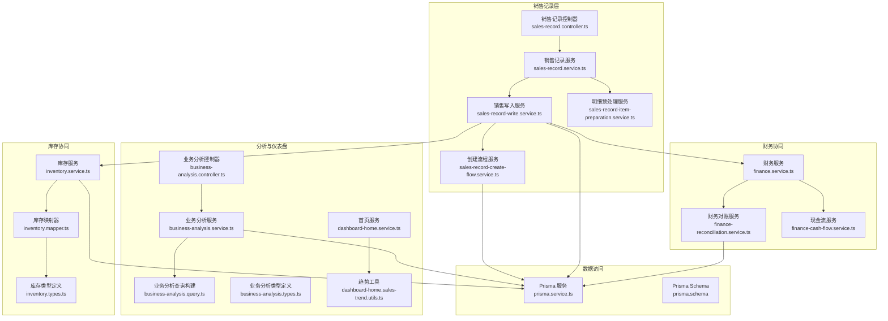
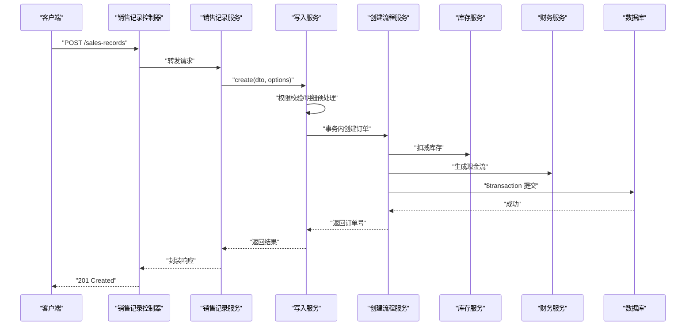
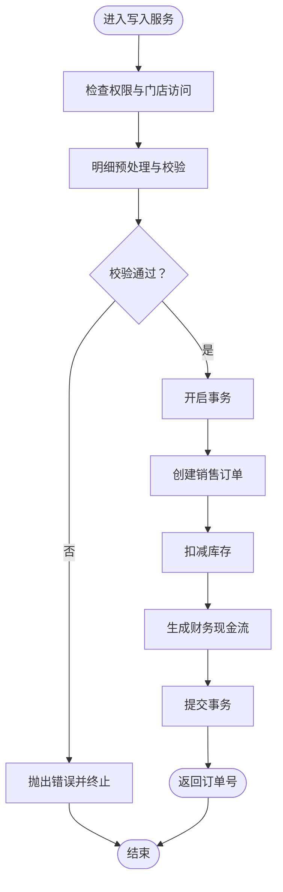
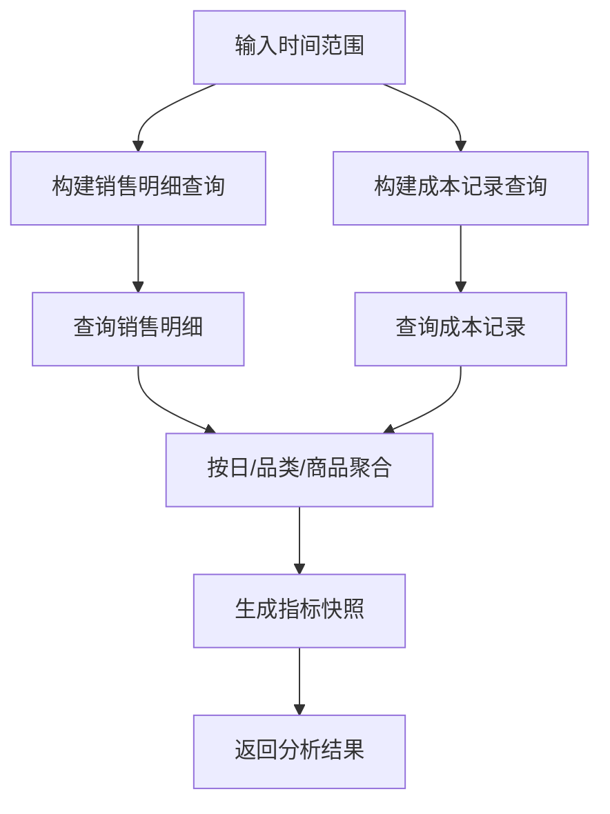
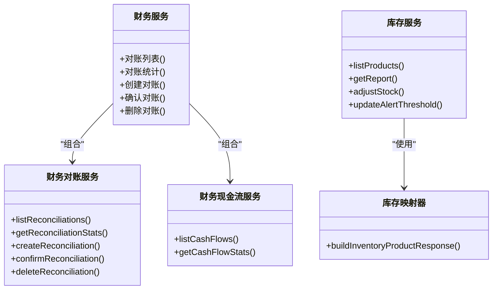
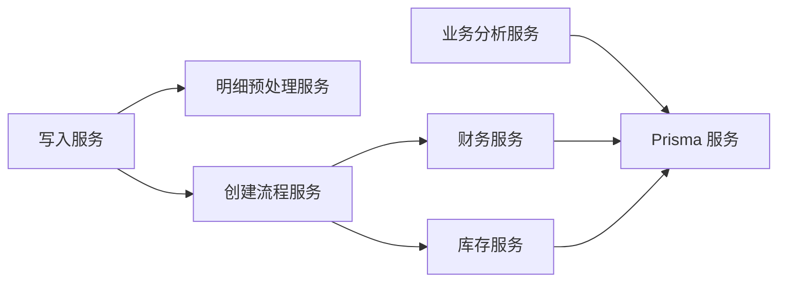

# 销售管理

<cite>
**本文引用的文件**
- [sales-record.controller.ts](file://src/purely-profit/operations/sales-record/sales-record.controller.ts)
- [sales-record.service.ts](file://src/purely-profit/operations/sales-record/sales-record.service.ts)
- [sales-record-write.service.ts](file://src/purely-profit/operations/sales-record/sales-record-write.service.ts)
- [sales-record-create-flow.service.ts](file://src/purely-profit/operations/sales-record/sales-record-create-flow.service.ts)
- [sales-record-item-preparation.service.ts](file://src/purely-profit/operations/sales-record/sales-record-item-preparation.service.ts)
- [sales-record.dto.ts](file://src/purely-profit/operations/sales-record/dto/sales-record.dto.ts)
- [sales-record.types.ts](file://src/purely-profit/operations/sales-record/types/sales-record.types.ts)
- [business-analysis.controller.ts](file://src/purely-profit/dashboard/business-analysis/business-analysis.controller.ts)
- [business-analysis.service.ts](file://src/purely-profit/dashboard/business-analysis/business-analysis.service.ts)
- [business-analysis.query.ts](file://src/purely-profit/dashboard/business-analysis/business-analysis.query.ts)
- [business-analysis.types.ts](file://src/purely-profit/dashboard/business-analysis/business-analysis.types.ts)
- [dashboard-home.service.ts](file://src/purely-profit/dashboard/dashboard-home/dashboard-home.service.ts)
- [dashboard-home.sales-trend.utils.ts](file://src/purely-profit/dashboard/dashboard-home/dashboard-home.sales-trend.utils.ts)
- [finance.service.ts](file://src/purely-profit/finance/finance.service.ts)
- [finance-reconciliation.service.ts](file://src/purely-profit/finance/finance-reconciliation.service.ts)
- [finance-cash-flow.service.ts](file://src/purely-profit/finance/finance-cash-flow.service.ts)
- [inventory.service.ts](file://src/purely-profit/goods/inventory/inventory.service.ts)
- [inventory.mapper.ts](file://src/purely-profit/goods/inventory/inventory.mapper.ts)
- [inventory.types.ts](file://src/purely-profit/goods/inventory/inventory.types.ts)
- [prisma.service.ts](file://src/prisma/prisma.service.ts)
- [prisma.schema](file://prisma/schema.prisma)
</cite>

## 目录
1. [简介](#简介)
2. [项目结构](#项目结构)
3. [核心组件](#核心组件)
4. [架构总览](#架构总览)
5. [详细组件分析](#详细组件分析)
6. [依赖关系分析](#依赖关系分析)
7. [性能考量](#性能考量)
8. [故障排查指南](#故障排查指南)
9. [结论](#结论)
10. [附录](#附录)

## 简介
本文件系统性阐述销售管理功能，覆盖销售订单、销售记录、销售统计与分析、销售预测与报表、销售优化与监控、异常处理等能力，并说明与商品库存、财务模块的协同机制。内容基于代码库中的实际实现进行归纳总结，帮助开发者与运营人员快速理解与使用销售管理能力。

## 项目结构
销售管理相关代码主要分布在以下模块：
- 销售记录与订单：operations/sales-record
- 销售分析与仪表盘：dashboard/business-analysis 与 dashboard/dashboard-home
- 财务协同：finance
- 库存协同：goods/inventory
- 数据访问：prisma

图表来源
- [sales-record.controller.ts:1-200](file://src/purely-profit/operations/sales-record/sales-record.controller.ts#L1-L200)
- [sales-record.service.ts:1-200](file://src/purely-profit/operations/sales-record/sales-record.service.ts#L1-L200)
- [sales-record-write.service.ts:1-300](file://src/purely-profit/operations/sales-record/sales-record-write.service.ts#L1-L300)
- [sales-record-create-flow.service.ts:1-200](file://src/purely-profit/operations/sales-record/sales-record-create-flow.service.ts#L1-L200)
- [business-analysis.controller.ts:1-200](file://src/purely-profit/dashboard/business-analysis/business-analysis.controller.ts#L1-L200)
- [business-analysis.service.ts:1-200](file://src/purely-profit/dashboard/business-analysis/business-analysis.service.ts#L1-L200)
- [business-analysis.query.ts:1-120](file://src/purely-profit/dashboard/business-analysis/business-analysis.query.ts#L1-L120)
- [finance.service.ts:1-200](file://src/purely-profit/finance/finance.service.ts#L1-L200)
- [finance-reconciliation.service.ts:1-200](file://src/purely-profit/finance/finance-reconciliation.service.ts#L1-L200)
- [finance-cash-flow.service.ts:1-200](file://src/purely-profit/finance/finance-cash-flow.service.ts#L1-L200)
- [inventory.service.ts:1-200](file://src/purely-profit/goods/inventory/inventory.service.ts#L1-L200)
- [inventory.mapper.ts:1-120](file://src/purely-profit/goods/inventory/inventory.mapper.ts#L1-L120)
- [prisma.service.ts:1-200](file://src/prisma/prisma.service.ts#L1-L200)
- [prisma.schema](file://prisma/schema.prisma)

章节来源
- [sales-record.controller.ts:1-200](file://src/purely-profit/operations/sales-record/sales-record.controller.ts#L1-L200)
- [sales-record.service.ts:1-200](file://src/purely-profit/operations/sales-record/sales-record.service.ts#L1-L200)
- [business-analysis.controller.ts:1-200](file://src/purely-profit/dashboard/business-analysis/business-analysis.controller.ts#L1-L200)
- [finance.service.ts:1-200](file://src/purely-profit/finance/finance.service.ts#L1-L200)
- [inventory.service.ts:1-200](file://src/purely-profit/goods/inventory/inventory.service.ts#L1-L200)
- [prisma.service.ts:1-200](file://src/prisma/prisma.service.ts#L1-L200)

## 核心组件
- 销售记录控制器：对外暴露销售记录的增删查改接口，负责参数校验与响应封装。
- 销售记录服务：协调写入服务与读取流程，提供统一入口。
- 写入服务：执行权限校验、明细预处理、事务化创建与回滚。
- 创建流程服务：在单个事务中完成销售订单创建、库存扣减、财务现金流生成。
- 明细预处理服务：将前端传入的商品明细标准化、计算利润与汇总。
- 业务分析服务：聚合销售与成本数据，支持日维度、品类维度、排行榜等多维分析。
- 财务服务：提供对账、概览、现金流等财务能力，支撑销售结算闭环。
- 库存服务：提供库存查询、调整、告警阈值设置等能力，保障销售与库存一致性。

章节来源
- [sales-record.controller.ts:1-200](file://src/purely-profit/operations/sales-record/sales-record.controller.ts#L1-L200)
- [sales-record.service.ts:1-200](file://src/purely-profit/operations/sales-record/sales-record.service.ts#L1-L200)
- [sales-record-write.service.ts:1-300](file://src/purely-profit/operations/sales-record/sales-record-write.service.ts#L1-L300)
- [sales-record-create-flow.service.ts:1-200](file://src/purely-profit/operations/sales-record/sales-record-create-flow.service.ts#L1-L200)
- [business-analysis.service.ts:1-200](file://src/purely-profit/dashboard/business-analysis/business-analysis.service.ts#L1-L200)
- [finance.service.ts:1-200](file://src/purely-profit/finance/finance.service.ts#L1-L200)
- [inventory.service.ts:1-200](file://src/purely-profit/goods/inventory/inventory.service.ts#L1-L200)

## 架构总览
销售管理采用“控制器-服务-领域流程-外部模块协同”的分层架构。写入路径通过事务保证一致性，同时联动库存与财务模块，确保销售发生后的库存扣减与现金流入账同步完成。

图表来源
- [sales-record.controller.ts:1-200](file://src/purely-profit/operations/sales-record/sales-record.controller.ts#L1-L200)
- [sales-record.service.ts:1-200](file://src/purely-profit/operations/sales-record/sales-record.service.ts#L1-L200)
- [sales-record-write.service.ts:1-300](file://src/purely-profit/operations/sales-record/sales-record-write.service.ts#L1-L300)
- [sales-record-create-flow.service.ts:1-200](file://src/purely-profit/operations/sales-record/sales-record-create-flow.service.ts#L1-L200)
- [inventory.service.ts:1-200](file://src/purely-profit/goods/inventory/inventory.service.ts#L1-L200)
- [finance.service.ts:1-200](file://src/purely-profit/finance/finance.service.ts#L1-L200)

## 详细组件分析

### 销售记录模块
- 控制器职责：接收请求、参数校验、调用服务、返回响应。
- 服务编排：将读写分离，读取直接走只读服务，写入通过写入服务编排。
- 写入流程：权限校验、明细预处理、事务化创建、失败回滚。
- 回滚策略：删除销售记录时，回滚库存扣减并删除对应财务现金流记录。

图表来源
- [sales-record-write.service.ts:1-300](file://src/purely-profit/operations/sales-record/sales-record-write.service.ts#L1-L300)
- [sales-record-create-flow.service.ts:1-200](file://src/purely-profit/operations/sales-record/sales-record-create-flow.service.ts#L1-L200)
- [inventory.service.ts:1-200](file://src/purely-profit/goods/inventory/inventory.service.ts#L1-L200)
- [finance.service.ts:1-200](file://src/purely-profit/finance/finance.service.ts#L1-L200)

章节来源
- [sales-record.controller.ts:1-200](file://src/purely-profit/operations/sales-record/sales-record.controller.ts#L1-L200)
- [sales-record.service.ts:1-200](file://src/purely-profit/operations/sales-record/sales-record.service.ts#L1-L200)
- [sales-record-write.service.ts:1-300](file://src/purely-profit/operations/sales-record/sales-record-write.service.ts#L1-L300)
- [sales-record-create-flow.service.ts:1-200](file://src/purely-profit/operations/sales-record/sales-record-create-flow.service.ts#L1-L200)

### 业务分析与销售统计
- 查询构建：根据时间范围构建销售订单明细查询与成本记录查询。
- 聚合维度：日维度收入、品类维度收入/利润/销量、商品排行榜（利润/收入/销量）。
- 指标快照：当前周期与上一周期的销售与成本指标对比。
- 仪表盘集成：首页服务结合趋势工具输出销售趋势与关键指标。

图表来源
- [business-analysis.query.ts:1-120](file://src/purely-profit/dashboard/business-analysis/business-analysis.query.ts#L1-L120)
- [business-analysis.types.ts:1-120](file://src/purely-profit/dashboard/business-analysis/business-analysis.types.ts#L1-L120)
- [business-analysis.service.ts:1-200](file://src/purely-profit/dashboard/business-analysis/business-analysis.service.ts#L1-L200)
- [dashboard-home.service.ts:1-200](file://src/purely-profit/dashboard/dashboard-home/dashboard-home.service.ts#L1-L200)
- [dashboard-home.sales-trend.utils.ts:1-200](file://src/purely-profit/dashboard/dashboard-home/dashboard-home.sales-trend.utils.ts#L1-L200)

章节来源
- [business-analysis.controller.ts:1-200](file://src/purely-profit/dashboard/business-analysis/business-analysis.controller.ts#L1-L200)
- [business-analysis.service.ts:1-200](file://src/purely-profit/dashboard/business-analysis/business-analysis.service.ts#L1-L200)
- [business-analysis.query.ts:1-120](file://src/purely-profit/dashboard/business-analysis/business-analysis.query.ts#L1-L120)
- [business-analysis.types.ts:1-120](file://src/purely-profit/dashboard/business-analysis/business-analysis.types.ts#L1-L120)
- [dashboard-home.service.ts:1-200](file://src/purely-profit/dashboard/dashboard-home/dashboard-home.service.ts#L1-L200)
- [dashboard-home.sales-trend.utils.ts:1-200](file://src/purely-profit/dashboard/dashboard-home/dashboard-home.sales-trend.utils.ts#L1-L200)

### 财务与库存协同
- 对账与概览：提供对账记录的查询、统计与确认流程，支持差异金额计算与状态归一化。
- 现金流：按销售订单生成或回滚现金流记录，确保财务流水与销售事实一致。
- 库存调整：提供库存产品列表、告警阈值、调整记录查询与库存调整操作。

图表来源
- [finance.service.ts:1-200](file://src/purely-profit/finance/finance.service.ts#L1-L200)
- [finance-reconciliation.service.ts:1-200](file://src/purely-profit/finance/finance-reconciliation.service.ts#L1-L200)
- [finance-cash-flow.service.ts:1-200](file://src/purely-profit/finance/finance-cash-flow.service.ts#L1-L200)
- [inventory.service.ts:1-200](file://src/purely-profit/goods/inventory/inventory.service.ts#L1-L200)
- [inventory.mapper.ts:1-120](file://src/purely-profit/goods/inventory/inventory.mapper.ts#L1-L120)

章节来源
- [finance.service.ts:1-200](file://src/purely-profit/finance/finance.service.ts#L1-L200)
- [finance-reconciliation.service.ts:1-200](file://src/purely-profit/finance/finance-reconciliation.service.ts#L1-L200)
- [finance-cash-flow.service.ts:1-200](file://src/purely-profit/finance/finance-cash-flow.service.ts#L1-L200)
- [inventory.service.ts:1-200](file://src/purely-profit/goods/inventory/inventory.service.ts#L1-L200)
- [inventory.mapper.ts:1-120](file://src/purely-profit/goods/inventory/inventory.mapper.ts#L1-L120)

## 依赖关系分析
- 写入服务依赖：权限校验、明细预处理、事务化创建、库存与财务模块。
- 分析服务依赖：Prisma 查询构建、聚合算法、时间范围解析。
- 财务与库存依赖：Prisma 服务、领域模型、映射器。

图表来源
- [sales-record-write.service.ts:1-300](file://src/purely-profit/operations/sales-record/sales-record-write.service.ts#L1-L300)
- [sales-record-create-flow.service.ts:1-200](file://src/purely-profit/operations/sales-record/sales-record-create-flow.service.ts#L1-L200)
- [business-analysis.service.ts:1-200](file://src/purely-profit/dashboard/business-analysis/business-analysis.service.ts#L1-L200)
- [finance.service.ts:1-200](file://src/purely-profit/finance/finance.service.ts#L1-L200)
- [inventory.service.ts:1-200](file://src/purely-profit/goods/inventory/inventory.service.ts#L1-L200)
- [prisma.service.ts:1-200](file://src/prisma/prisma.service.ts#L1-L200)

章节来源
- [sales-record-write.service.ts:1-300](file://src/purely-profit/operations/sales-record/sales-record-write.service.ts#L1-L300)
- [business-analysis.service.ts:1-200](file://src/purely-profit/dashboard/business-analysis/business-analysis.service.ts#L1-L200)
- [finance.service.ts:1-200](file://src/purely-profit/finance/finance.service.ts#L1-L200)
- [inventory.service.ts:1-200](file://src/purely-profit/goods/inventory/inventory.service.ts#L1-L200)
- [prisma.service.ts:1-200](file://src/prisma/prisma.service.ts#L1-L200)

## 性能考量
- 事务边界：创建流程在单一事务中完成，避免部分更新导致的数据不一致，但需关注长事务的锁竞争与超时风险。
- 查询索引：分析查询基于时间范围与门店 ID 的过滤，建议在订单日期与关联字段建立合适索引以提升聚合性能。
- 聚合规模：日维度与品类维度聚合可能产生大量中间结果，建议分页与缓存策略配合。
- 并发控制：库存扣减与财务入账应尽量减少跨行锁持有时间，必要时拆分更细的事务单元。

## 故障排查指南
- 权限不足：若出现无权访问门店或删除销售记录的错误，请检查用户角色与门店绑定关系。
- 订单不存在：删除销售记录前请确认订单存在且属于当前门店。
- 事务回滚：若创建失败，检查库存是否足够、商品是否存在；财务现金流是否重复生成。
- 对账异常：核对期初/期末余额、差异金额计算与状态流转是否符合预期。

章节来源
- [sales-record-write.service.ts:800-873](file://src/purely-profit/operations/sales-record/sales-record-write.service.ts#L800-L873)
- [finance-reconciliation.service.ts:1-200](file://src/purely-profit/finance/finance-reconciliation.service.ts#L1-L200)

## 结论
销售管理模块通过清晰的分层设计与事务化流程，实现了从订单创建到库存扣减与财务入账的闭环。业务分析与仪表盘提供了多维聚合与趋势洞察，财务与库存模块则保障了销售事实与财务、库存数据的一致性。建议在高并发场景下优化索引与事务粒度，并完善异常监控与重试策略。

## 附录

### API 一览与示例路径
- 创建销售记录
  - 方法与路径：POST /sales-records
  - 请求体：参见 DTO 定义
  - 响应：订单号与编号
  - 示例路径：[sales-record.controller.ts:1-200](file://src/purely-profit/operations/sales-record/sales-record.controller.ts#L1-L200)，[sales-record.dto.ts:1-200](file://src/purely-profit/operations/sales-record/dto/sales-record.dto.ts#L1-L200)
- 删除销售记录
  - 方法与路径：DELETE /sales-records/:id
  - 行为：回滚库存与财务现金流
  - 示例路径：[sales-record-write.service.ts:832-873](file://src/purely-profit/operations/sales-record/sales-record-write.service.ts#L832-L873)
- 获取业务分析
  - 方法与路径：GET /business-analysis
  - 参数：时间范围、周期
  - 返回：日/品类/商品维度指标快照
  - 示例路径：[business-analysis.controller.ts:1-200](file://src/purely-profit/dashboard/business-analysis/business-analysis.controller.ts#L1-L200)，[business-analysis.query.ts:1-120](file://src/purely-profit/dashboard/business-analysis/business-analysis.query.ts#L1-L120)，[business-analysis.types.ts:1-120](file://src/purely-profit/dashboard/business-analysis/business-analysis.types.ts#L1-L120)
- 财务对账
  - 方法与路径：GET /finance/reconciliations, POST /finance/reconciliations, POST /finance/reconciliations/:id/confirm
  - 示例路径：[finance.service.ts:1-200](file://src/purely-profit/finance/finance.service.ts#L1-L200)，[finance-reconciliation.service.ts:1-200](file://src/purely-profit/finance/finance-reconciliation.service.ts#L1-L200)
- 库存查询与调整
  - 方法与路径：GET /inventory/products, POST /inventory/adjustments
  - 示例路径：[inventory.service.ts:1-200](file://src/purely-profit/goods/inventory/inventory.service.ts#L1-L200)，[inventory.types.ts:1-63](file://src/purely-profit/goods/inventory/inventory.types.ts#L1-L63)

### 数据结构说明
- 销售记录输入 DTO：包含门店 ID、商品明细、支付方式、计算模式等
  - 参考路径：[sales-record.dto.ts:1-200](file://src/purely-profit/operations/sales-record/dto/sales-record.dto.ts#L1-L200)
- 业务分析类型：日维度收入映射、品类聚合、商品排行榜、成本桶等
  - 参考路径：[business-analysis.types.ts:1-120](file://src/purely-profit/dashboard/business-analysis/business-analysis.types.ts#L1-L120)
- 库存产品记录：包含名称、分类、价格、利润、成本价、单位、库存、告警阈值等
  - 参考路径：[inventory.types.ts:1-63](file://src/purely-profit/goods/inventory/inventory.types.ts#L1-L63)