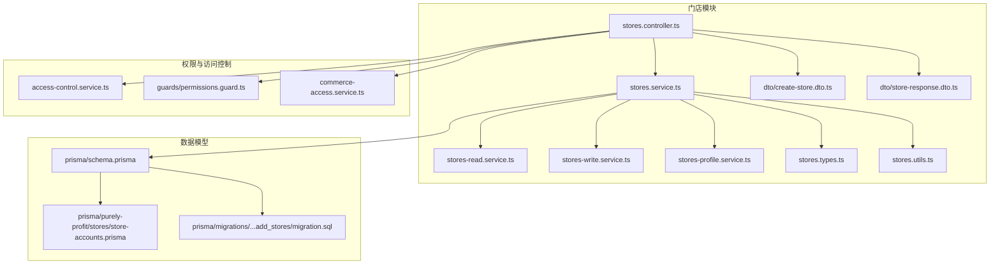
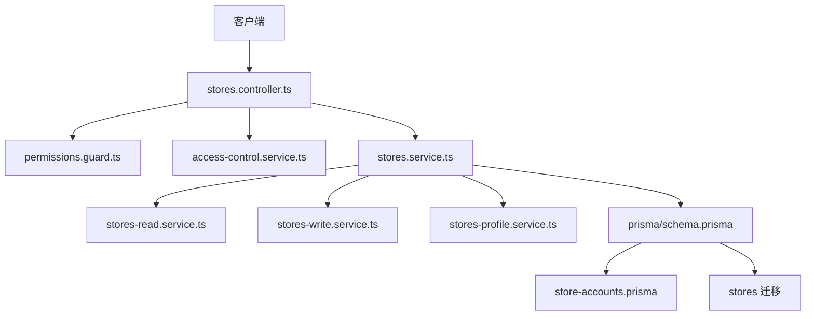
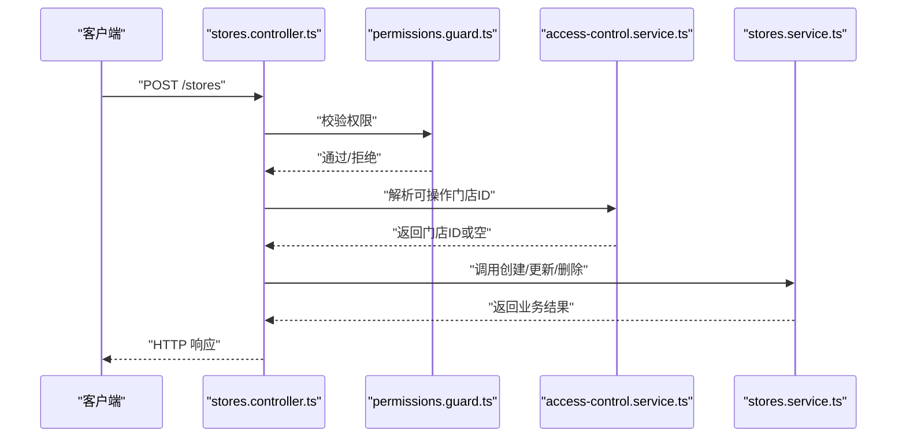
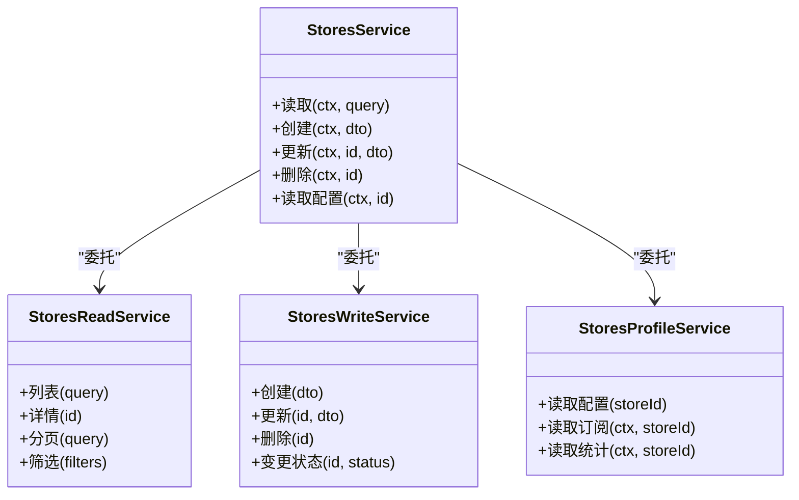
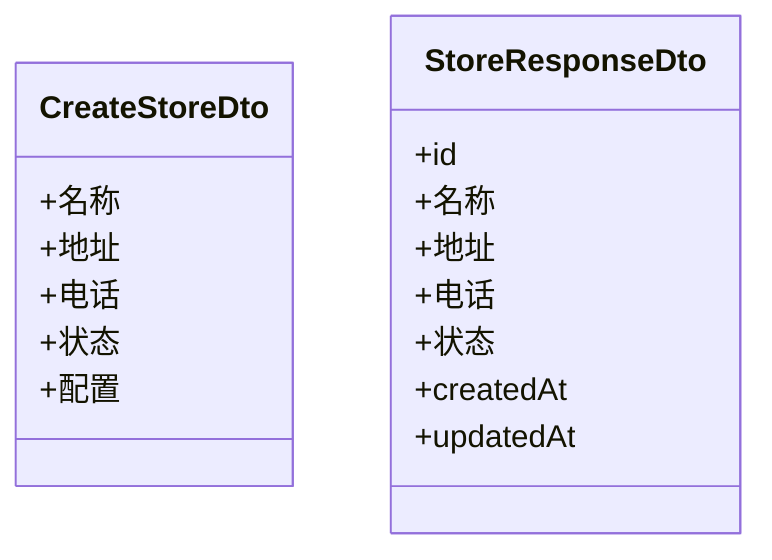
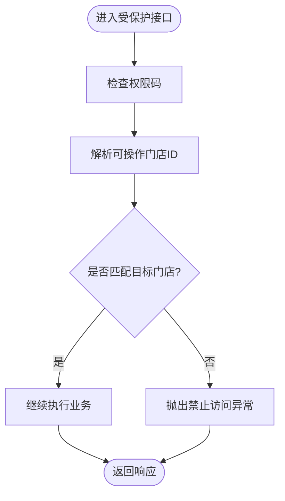
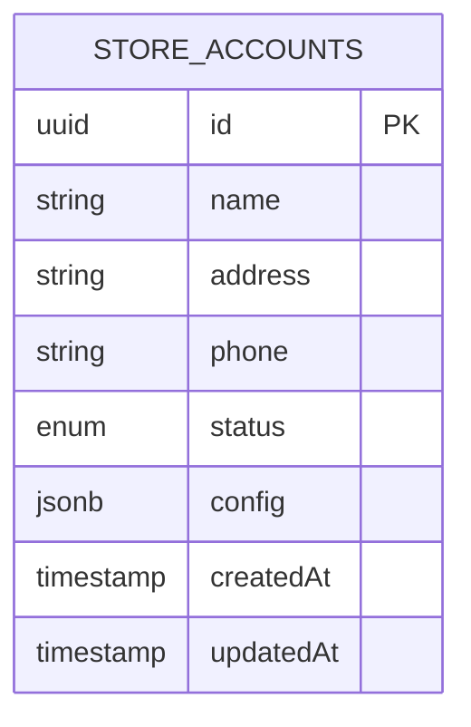
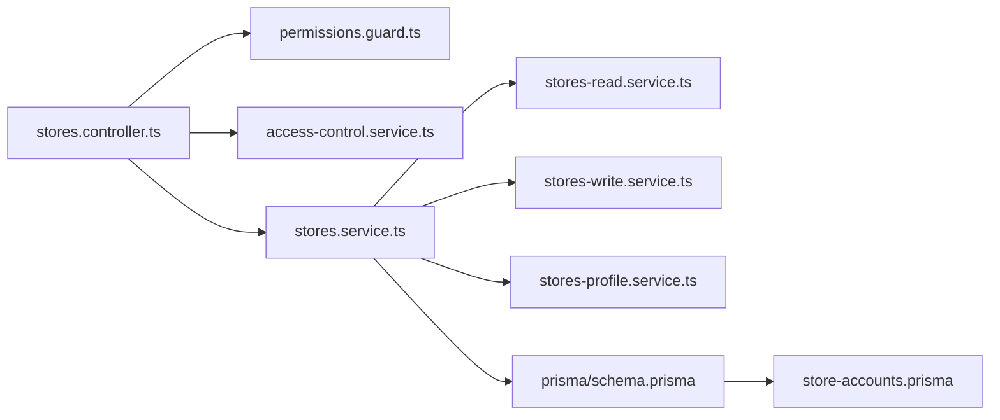

# 门店管理模块

<cite>
**本文档引用的文件**
- [stores.controller.ts](file://src/purely-profit/stores/stores.controller.ts)
- [stores.service.ts](file://src/purely-profit/stores/stores.service.ts)
- [stores-read.service.ts](file://src/purely-profit/stores/stores-read.service.ts)
- [stores-write.service.ts](file://src/purely-profit/stores/stores-write.service.ts)
- [stores-profile.service.ts](file://src/purely-profit/stores/stores-profile.service.ts)
- [stores.types.ts](file://src/purely-profit/stores/stores.types.ts)
- [stores.utils.ts](file://src/purely-profit/stores/stores.utils.ts)
- [create-store.dto.ts](file://src/purely-profit/stores/dto/create-store.dto.ts)
- [store-response.dto.ts](file://src/purely-profit/stores/dto/store-response.dto.ts)
- [access-control.service.ts](file://src/purely-profit/access-control/access-control.service.ts)
- [permissions.guard.ts](file://src/purely-profit/access-control/guards/permissions.guard.ts)
- [commerce-access.service.ts](file://src/purely-profit/commerce/commerce-access.service.ts)
- [store-accounts.prisma](file://prisma/purely-profit/stores/store-accounts.prisma)
- [schema.prisma](file://prisma/schema.prisma)
- [stores migration](file://prisma/migrations/20260512110000_add_stores/migration.sql)
</cite>

## 目录
1. [简介](#简介)
2. [项目结构](#项目结构)
3. [核心组件](#核心组件)
4. [架构总览](#架构总览)
5. [详细组件分析](#详细组件分析)
6. [依赖关系分析](#依赖关系分析)
7. [性能考虑](#性能考虑)
8. [故障排除指南](#故障排除指南)
9. [结论](#结论)
10. [附录](#附录)

## 简介
本文件系统性阐述门店管理模块的设计与实现，覆盖多门店架构、门店 CRUD 操作、配置管理、状态控制、权限控制、订阅管理与统计指标等核心能力。文档同时解释门店与员工、财务、商品等模块的数据交互关系，并提供 API 使用模式、错误处理机制与最佳实践。

## 项目结构
门店管理模块位于 `src/purely-profit/stores` 目录，采用分层设计：控制器负责接口暴露与参数校验；服务层拆分为读写分离与配置读取；类型定义与工具函数支撑业务逻辑；Prisma 定义与迁移文件确保数据模型一致性。

**图表来源**
- [stores.controller.ts:1-200](file://src/purely-profit/stores/stores.controller.ts#L1-L200)
- [stores.service.ts:1-300](file://src/purely-profit/stores/stores.service.ts#L1-L300)
- [stores-read.service.ts:1-200](file://src/purely-profit/stores/stores-read.service.ts#L1-L200)
- [stores-write.service.ts:1-200](file://src/purely-profit/stores/stores-write.service.ts#L1-L200)
- [stores-profile.service.ts:1-200](file://src/purely-profit/stores/stores-profile.service.ts#L1-L200)
- [access-control.service.ts:1-200](file://src/purely-profit/access-control/access-control.service.ts#L1-L200)
- [permissions.guard.ts:1-200](file://src/purely-profit/access-control/guards/permissions.guard.ts#L1-L200)
- [commerce-access.service.ts:1-200](file://src/purely-profit/commerce/commerce-access.service.ts#L1-L200)
- [schema.prisma:1-300](file://prisma/schema.prisma#L1-L300)
- [store-accounts.prisma:1-200](file://prisma/purely-profit/stores/store-accounts.prisma#L1-L200)
- [stores migration:1-200](file://prisma/migrations/20260512110000_add_stores/migration.sql#L1-L200)

**章节来源**
- [stores.controller.ts:1-200](file://src/purely-profit/stores/stores.controller.ts#L1-L200)
- [stores.service.ts:1-300](file://src/purely-profit/stores/stores.service.ts#L1-L300)
- [stores-read.service.ts:1-200](file://src/purely-profit/stores/stores-read.service.ts#L1-L200)
- [stores-write.service.ts:1-200](file://src/purely-profit/stores/stores-write.service.ts#L1-L200)
- [stores-profile.service.ts:1-200](file://src/purely-profit/stores/stores-profile.service.ts#L1-L200)
- [stores.types.ts:1-200](file://src/purely-profit/stores/stores.types.ts#L1-L200)
- [stores.utils.ts:1-200](file://src/purely-profit/stores/stores.utils.ts#L1-L200)
- [create-store.dto.ts:1-200](file://src/purely-profit/stores/dto/create-store.dto.ts#L1-L200)
- [store-response.dto.ts:1-200](file://src/purely-profit/stores/dto/store-response.dto.ts#L1-L200)
- [access-control.service.ts:1-200](file://src/purely-profit/access-control/access-control.service.ts#L1-L200)
- [permissions.guard.ts:1-200](file://src/purely-profit/access-control/guards/permissions.guard.ts#L1-L200)
- [commerce-access.service.ts:1-200](file://src/purely-profit/commerce/commerce-access.service.ts#L1-L200)
- [schema.prisma:1-300](file://prisma/schema.prisma#L1-L300)
- [store-accounts.prisma:1-200](file://prisma/purely-profit/stores/store-accounts.prisma#L1-L200)
- [stores migration:1-200](file://prisma/migrations/20260512110000_add_stores/migration.sql#L1-L200)

## 核心组件
- 控制器：负责接收请求、参数校验、调用服务并返回响应，集成权限守卫与访问控制。
- 服务层：
  - 读服务：查询门店列表、详情、分页与筛选。
  - 写服务：创建、更新、删除门店，维护状态与配置。
  - 配置服务：读取门店配置信息，支持订阅与统计维度。
- 类型与工具：统一门店领域类型、枚举与工具方法。
- DTO：输入输出数据结构，保证接口契约清晰。
- 权限与访问控制：基于权限码解析当前可操作门店，限制跨门店访问。

**章节来源**
- [stores.controller.ts:1-200](file://src/purely-profit/stores/stores.controller.ts#L1-L200)
- [stores.service.ts:1-300](file://src/purely-profit/stores/stores.service.ts#L1-L300)
- [stores-read.service.ts:1-200](file://src/purely-profit/stores/stores-read.service.ts#L1-L200)
- [stores-write.service.ts:1-200](file://src/purely-profit/stores/stores-write.service.ts#L1-L200)
- [stores-profile.service.ts:1-200](file://src/purely-profit/stores/stores-profile.service.ts#L1-L200)
- [stores.types.ts:1-200](file://src/purely-profit/stores/stores.types.ts#L1-L200)
- [stores.utils.ts:1-200](file://src/purely-profit/stores/stores.utils.ts#L1-L200)
- [create-store.dto.ts:1-200](file://src/purely-profit/stores/dto/create-store.dto.ts#L1-L200)
- [store-response.dto.ts:1-200](file://src/purely-profit/stores/dto/store-response.dto.ts#L1-L200)
- [access-control.service.ts:1-200](file://src/purely-profit/access-control/access-control.service.ts#L1-L200)
- [permissions.guard.ts:1-200](file://src/purely-profit/access-control/guards/permissions.guard.ts#L1-L200)
- [commerce-access.service.ts:1-200](file://src/purely-profit/commerce/commerce-access.service.ts#L1-L200)

## 架构总览
门店管理模块遵循“控制器-服务-数据访问”的分层架构，结合权限守卫与访问控制服务，确保用户仅能访问其具备权限的门店资源。服务层内部进一步拆分读写职责，提升可维护性与可测试性。

**图表来源**
- [stores.controller.ts:1-200](file://src/purely-profit/stores/stores.controller.ts#L1-L200)
- [permissions.guard.ts:1-200](file://src/purely-profit/access-control/guards/permissions.guard.ts#L1-L200)
- [access-control.service.ts:1-200](file://src/purely-profit/access-control/access-control.service.ts#L1-L200)
- [stores.service.ts:1-300](file://src/purely-profit/stores/stores.service.ts#L1-L300)
- [stores-read.service.ts:1-200](file://src/purely-profit/stores/stores-read.service.ts#L1-L200)
- [stores-write.service.ts:1-200](file://src/purely-profit/stores/stores-write.service.ts#L1-L200)
- [stores-profile.service.ts:1-200](file://src/purely-profit/stores/stores-profile.service.ts#L1-L200)
- [schema.prisma:1-300](file://prisma/schema.prisma#L1-L300)
- [store-accounts.prisma:1-200](file://prisma/purely-profit/stores/store-accounts.prisma#L1-L200)
- [stores migration:1-200](file://prisma/migrations/20260512110000_add_stores/migration.sql#L1-L200)

## 详细组件分析

### 控制器层
- 职责：接收 HTTP 请求，执行参数校验与 DTO 绑定，调用服务层完成业务处理，封装响应。
- 关键流程：鉴权 -> 解析可操作门店 -> 执行业务 -> 返回结果。
- 权限集成：通过权限守卫与访问控制服务解析当前用户对门店的操作权限。

**图表来源**
- [stores.controller.ts:1-200](file://src/purely-profit/stores/stores.controller.ts#L1-L200)
- [permissions.guard.ts:1-200](file://src/purely-profit/access-control/guards/permissions.guard.ts#L1-L200)
- [access-control.service.ts:1-200](file://src/purely-profit/access-control/access-control.service.ts#L1-L200)

**章节来源**
- [stores.controller.ts:1-200](file://src/purely-profit/stores/stores.controller.ts#L1-L200)
- [permissions.guard.ts:1-200](file://src/purely-profit/access-control/guards/permissions.guard.ts#L1-L200)
- [access-control.service.ts:1-200](file://src/purely-profit/access-control/access-control.service.ts#L1-L200)

### 服务层
- stores.service.ts：协调读写与配置服务，编排业务流程，处理跨服务调用。
- stores-read.service.ts：提供门店查询、分页、筛选、详情读取等只读能力。
- stores-write.service.ts：提供门店创建、更新、删除、状态变更等写入能力。
- stores-profile.service.ts：读取门店配置、订阅与统计相关属性。

**图表来源**
- [stores.service.ts:1-300](file://src/purely-profit/stores/stores.service.ts#L1-L300)
- [stores-read.service.ts:1-200](file://src/purely-profit/stores/stores-read.service.ts#L1-L200)
- [stores-write.service.ts:1-200](file://src/purely-profit/stores/stores-write.service.ts#L1-L200)
- [stores-profile.service.ts:1-200](file://src/purely-profit/stores/stores-profile.service.ts#L1-L200)

**章节来源**
- [stores.service.ts:1-300](file://src/purely-profit/stores/stores.service.ts#L1-L300)
- [stores-read.service.ts:1-200](file://src/purely-profit/stores/stores-read.service.ts#L1-L200)
- [stores-write.service.ts:1-200](file://src/purely-profit/stores/stores-write.service.ts#L1-L200)
- [stores-profile.service.ts:1-200](file://src/purely-profit/stores/stores-profile.service.ts#L1-L200)

### 数据传输对象（DTO）
- 创建门店 DTO：定义创建门店所需的字段与约束。
- 门店响应 DTO：定义对外返回的门店信息结构。

**图表来源**
- [create-store.dto.ts:1-200](file://src/purely-profit/stores/dto/create-store.dto.ts#L1-L200)
- [store-response.dto.ts:1-200](file://src/purely-profit/stores/dto/store-response.dto.ts#L1-L200)

**章节来源**
- [create-store.dto.ts:1-200](file://src/purely-profit/stores/dto/create-store.dto.ts#L1-L200)
- [store-response.dto.ts:1-200](file://src/purely-profit/stores/dto/store-response.dto.ts#L1-L200)

### 权限控制与访问策略
- 权限守卫：在控制器入口拦截请求，确保用户具备相应权限码。
- 访问控制服务：根据当前会话解析用户可操作的门店 ID，防止越权访问。
- 商业模块访问服务：提供统一的门店访问解析与断言方法，保障跨模块一致性。

**图表来源**
- [permissions.guard.ts:1-200](file://src/purely-profit/access-control/guards/permissions.guard.ts#L1-L200)
- [access-control.service.ts:1-200](file://src/purely-profit/access-control/access-control.service.ts#L1-L200)
- [commerce-access.service.ts:1-200](file://src/purely-profit/commerce/commerce-access.service.ts#L1-L200)

**章节来源**
- [permissions.guard.ts:1-200](file://src/purely-profit/access-control/guards/permissions.guard.ts#L1-L200)
- [access-control.service.ts:1-200](file://src/purely-profit/access-control/access-control.service.ts#L1-L200)
- [commerce-access.service.ts:1-200](file://src/purely-profit/commerce/commerce-access.service.ts#L1-L200)

### 数据模型与迁移
- Prisma Schema：定义全局数据模型与关系。
- 门店模型：在 store-accounts.prisma 中定义门店实体字段与索引。
- 迁移：stores 迁移文件创建门店表结构，包含关键字段与约束。

**图表来源**
- [schema.prisma:1-300](file://prisma/schema.prisma#L1-L300)
- [store-accounts.prisma:1-200](file://prisma/purely-profit/stores/store-accounts.prisma#L1-L200)
- [stores migration:1-200](file://prisma/migrations/20260512110000_add_stores/migration.sql#L1-L200)

**章节来源**
- [schema.prisma:1-300](file://prisma/schema.prisma#L1-L300)
- [store-accounts.prisma:1-200](file://prisma/purely-profit/stores/store-accounts.prisma#L1-L200)
- [stores migration:1-200](file://prisma/migrations/20260512110000_add_stores/migration.sql#L1-L200)

## 依赖关系分析
- 控制器依赖权限守卫与访问控制服务，确保安全边界。
- 服务层依赖 Prisma 数据模型，读写服务分别对接只读与写入逻辑。
- 配置服务依赖门店配置与订阅信息，支撑统计与运营分析。
- 与商品、财务、员工等模块通过访问控制与权限码进行解耦协作。

**图表来源**
- [stores.controller.ts:1-200](file://src/purely-profit/stores/stores.controller.ts#L1-L200)
- [permissions.guard.ts:1-200](file://src/purely-profit/access-control/guards/permissions.guard.ts#L1-L200)
- [access-control.service.ts:1-200](file://src/purely-profit/access-control/access-control.service.ts#L1-L200)
- [stores.service.ts:1-300](file://src/purely-profit/stores/stores.service.ts#L1-L300)
- [stores-read.service.ts:1-200](file://src/purely-profit/stores/stores-read.service.ts#L1-L200)
- [stores-write.service.ts:1-200](file://src/purely-profit/stores/stores-write.service.ts#L1-L200)
- [stores-profile.service.ts:1-200](file://src/purely-profit/stores/stores-profile.service.ts#L1-L200)
- [schema.prisma:1-300](file://prisma/schema.prisma#L1-L300)
- [store-accounts.prisma:1-200](file://prisma/purely-profit/stores/store-accounts.prisma#L1-L200)

**章节来源**
- [stores.controller.ts:1-200](file://src/purely-profit/stores/stores.controller.ts#L1-L200)
- [stores.service.ts:1-300](file://src/purely-profit/stores/stores.service.ts#L1-L300)
- [stores-read.service.ts:1-200](file://src/purely-profit/stores/stores-read.service.ts#L1-L200)
- [stores-write.service.ts:1-200](file://src/purely-profit/stores/stores-write.service.ts#L1-L200)
- [stores-profile.service.ts:1-200](file://src/purely-profit/stores/stores-profile.service.ts#L1-L200)
- [schema.prisma:1-300](file://prisma/schema.prisma#L1-L300)
- [store-accounts.prisma:1-200](file://prisma/purely-profit/stores/store-accounts.prisma#L1-L200)

## 性能考虑
- 查询优化：利用 Prisma 索引与分页查询，避免一次性加载大量门店数据。
- 缓存策略：对高频读取的门店配置与统计信息进行缓存预热与失效控制。
- 并发控制：在写操作中使用事务与锁，确保状态变更一致性。
- 日志与可观测性：结合运行时指标记录关键路径耗时，定位性能瓶颈。

## 故障排除指南
- 权限异常：当用户尝试访问无权限门店时，守卫将抛出禁止访问异常。请检查权限码与当前会话绑定的门店 ID。
- 参数校验失败：创建/更新接口若 DTO 不符合约束，将返回参数错误。请核对必填字段与格式。
- 数据不存在：读取或更新不存在的门店时，服务层将返回资源未找到。请确认门店 ID 正确性。
- 并发冲突：高并发场景下状态变更可能失败，请重试或引入幂等设计。

**章节来源**
- [permissions.guard.ts:1-200](file://src/purely-profit/access-control/guards/permissions.guard.ts#L1-L200)
- [access-control.service.ts:1-200](file://src/purely-profit/access-control/access-control.service.ts#L1-L200)
- [stores.controller.ts:1-200](file://src/purely-profit/stores/stores.controller.ts#L1-L200)

## 结论
门店管理模块通过清晰的分层设计与严格的权限控制，实现了多门店的统一管理与安全访问。结合配置与订阅能力，模块能够支撑复杂的运营场景。建议在生产环境中配合缓存、事务与可观测性方案，持续优化性能与稳定性。

## 附录

### API 接口示例（描述性）
- 创建门店
  - 方法与路径：POST /stores
  - 权限码：stores:create
  - 请求体：创建门店 DTO
  - 响应：门店响应 DTO
- 更新门店
  - 方法与路径：PUT /stores/{id}
  - 权限码：stores:update
  - 请求体：更新字段集合
  - 响应：门店响应 DTO
- 删除门店
  - 方法与路径：DELETE /stores/{id}
  - 权限码：stores:delete
  - 响应：空对象或成功标识
- 获取门店详情
  - 方法与路径：GET /stores/{id}
  - 权限码：stores:view
  - 响应：门店响应 DTO
- 列出门店（分页/筛选）
  - 方法与路径：GET /stores
  - 权限码：stores:list
  - 查询参数：分页与筛选条件
  - 响应：分页结果（含门店列表）

### 错误处理机制
- 权限不足：返回禁止访问异常。
- 参数错误：返回参数校验失败。
- 资源不存在：返回未找到。
- 并发冲突：返回冲突或重试提示。

### 最佳实践
- 使用权限守卫与访问控制服务统一校验门店访问。
- 对高频查询使用分页与索引，避免全量扫描。
- 写操作使用事务，确保状态一致性。
- 将配置与统计信息纳入缓存体系，降低数据库压力。
- 为关键接口添加日志与指标监控，便于问题定位与性能评估。