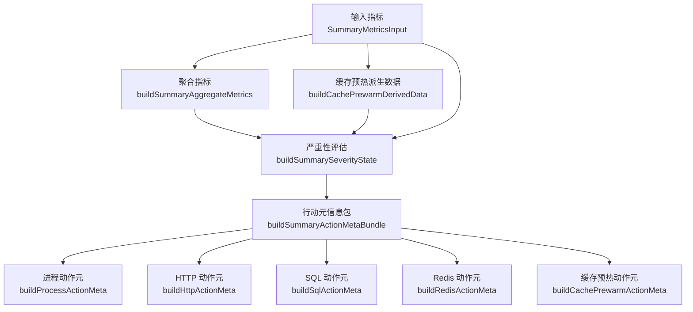
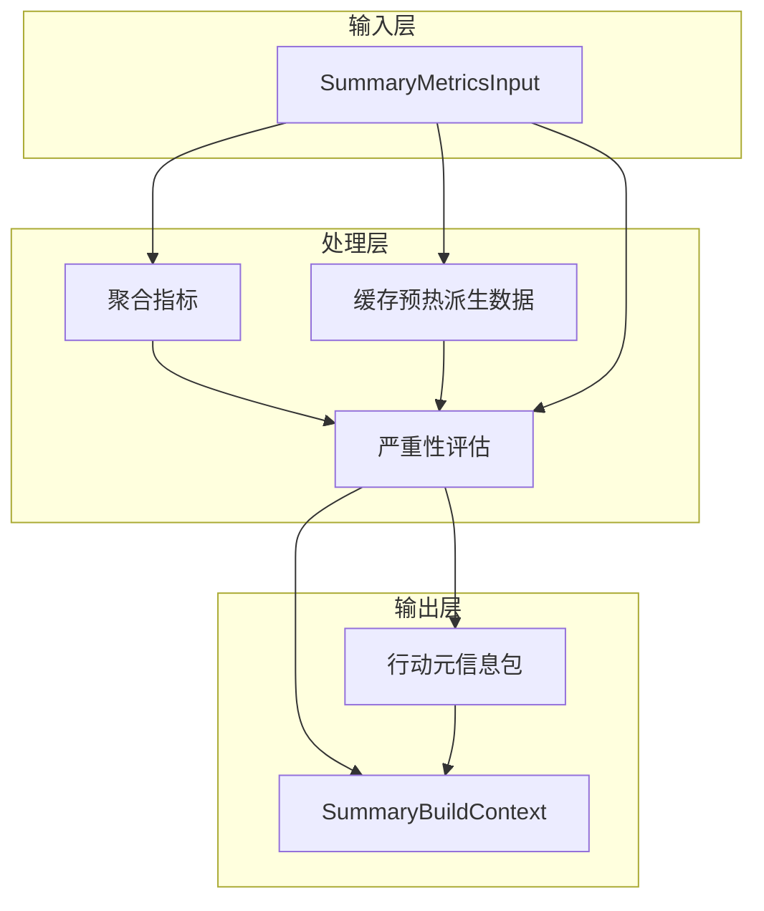
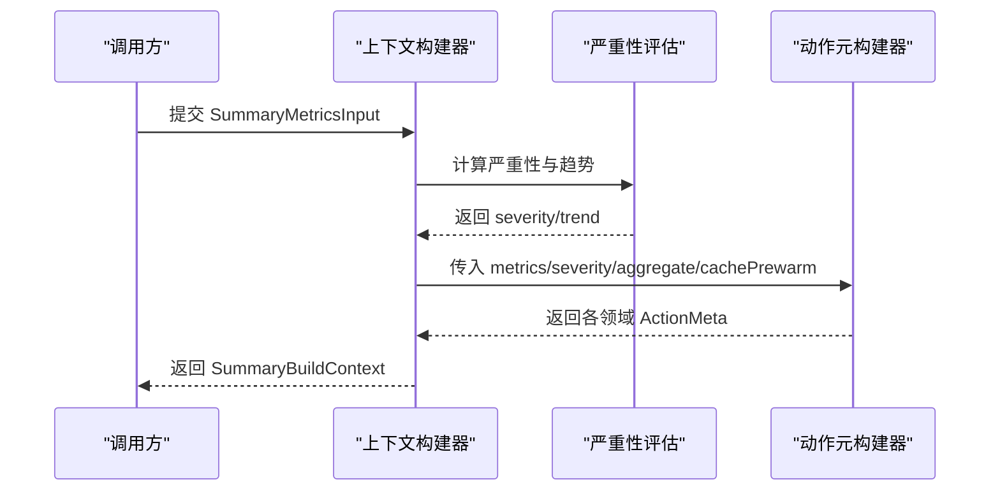
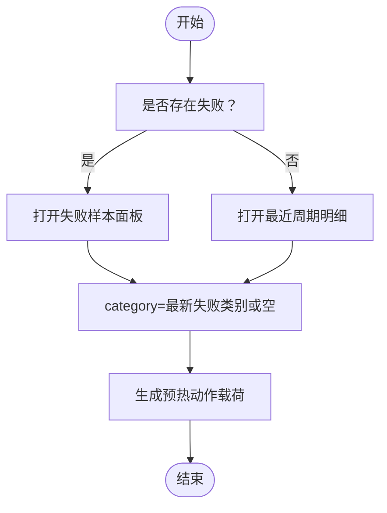
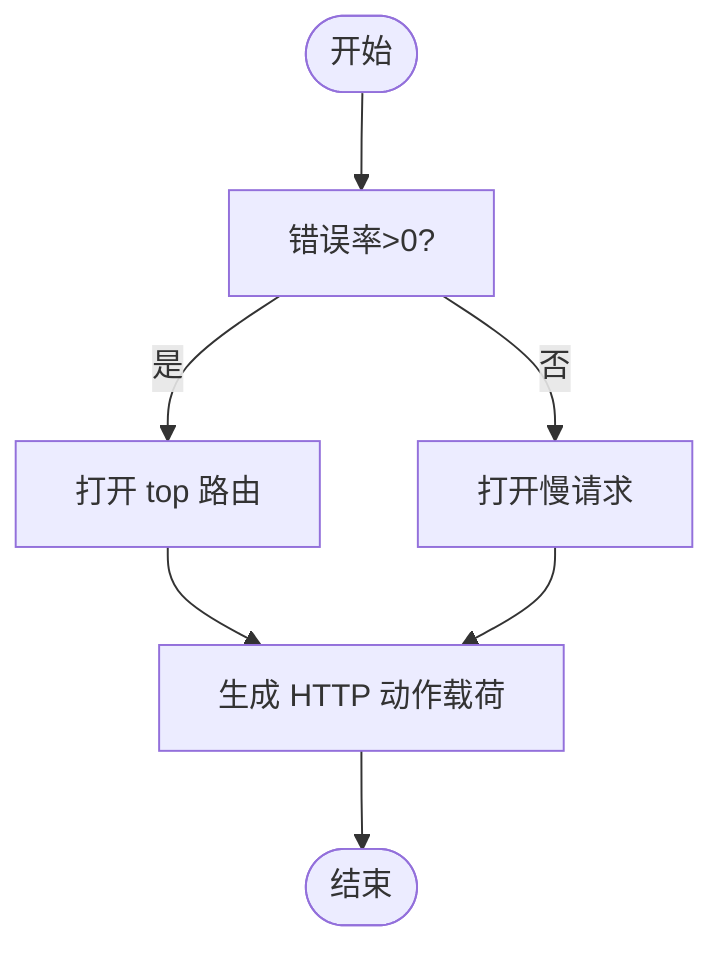
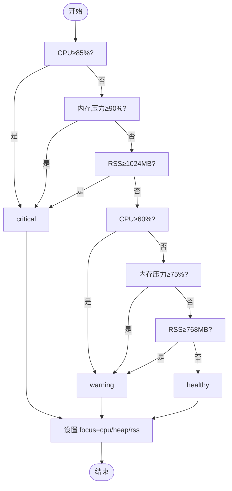
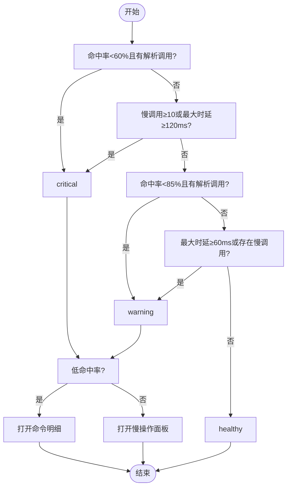
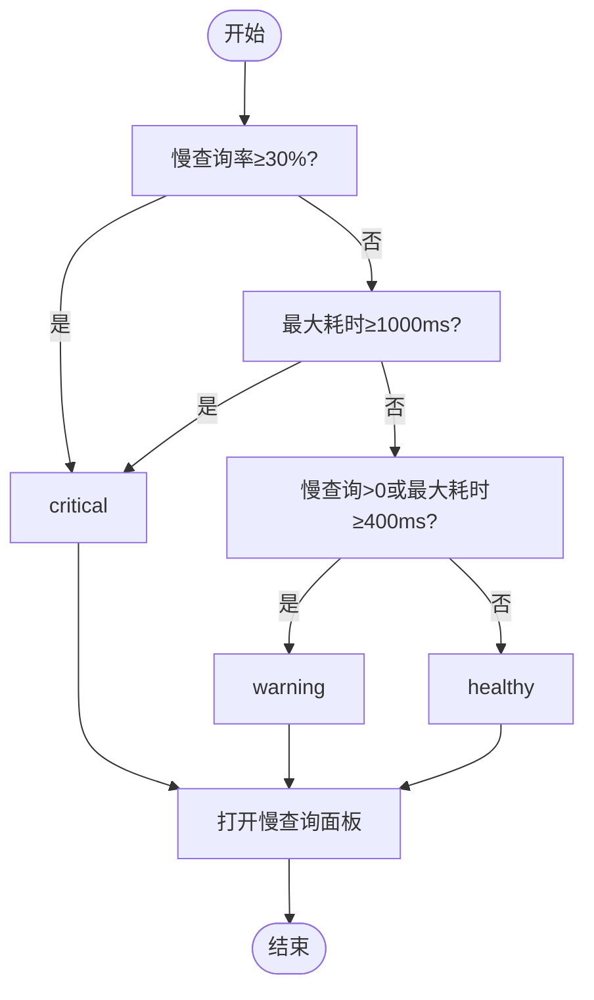
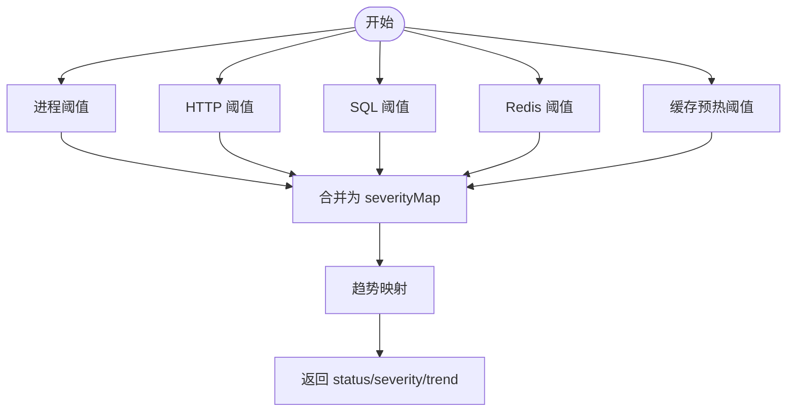
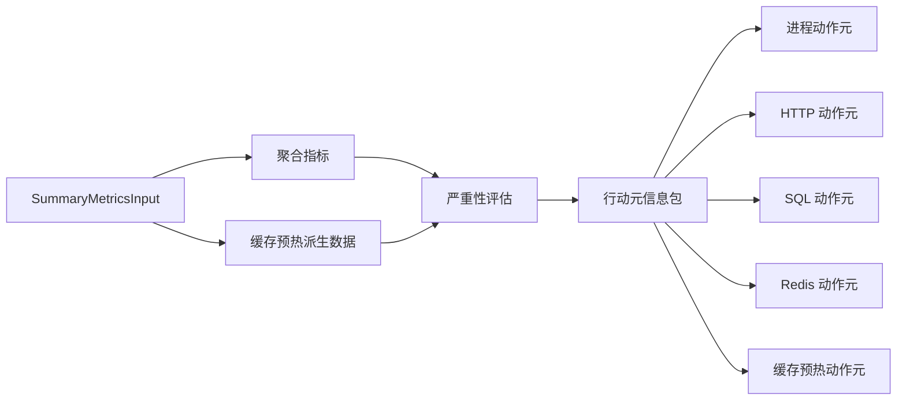

# 上下文分析模块

<cite>
**本文引用的文件**
- [runtime-metrics.summary-context.ts](file://src/observability/runtime-metrics.summary-context.ts)
- [runtime-metrics.summary-context-severity.ts](file://src/observability/runtime-metrics.summary-context-severity.ts)
- [runtime-metrics.summary-context-aggregates.ts](file://src/observability/runtime-metrics.summary-context-aggregates.ts)
- [runtime-metrics.summary-context-cache-prewarm.ts](file://src/observability/runtime-metrics.summary-context-cache-prewarm.ts)
- [runtime-metrics.summary-context-actions.ts](file://src/observability/runtime-metrics.summary-context-actions.ts)
- [runtime-metrics.summary-context-actions-cache-prewarm.ts](file://src/observability/runtime-metrics.summary-context-actions-cache-prewarm.ts)
- [runtime-metrics.summary-context-actions-http.ts](file://src/observability/runtime-metrics.summary-context-actions-http.ts)
- [runtime-metrics.summary-context-actions-process.ts](file://src/observability/runtime-metrics.summary-context-actions-process.ts)
- [runtime-metrics.summary-context-actions-redis.ts](file://src/observability/runtime-metrics.summary-context-actions-redis.ts)
- [runtime-metrics.summary-context-actions-sql.ts](file://src/observability/runtime-metrics.summary-context-actions-sql.ts)
- [metrics-summary.protocol.ts](file://src/observability/metrics-summary.protocol.ts)
- [runtime-metrics.summary-context.types.ts](file://src/observability/runtime-metrics.summary-context.types.ts)
- [runtime-metrics.summary-helpers.ts](file://src/observability/runtime-metrics.summary-helpers.ts)
</cite>

## 目录
1. [简介](#简介)
2. [项目结构](#项目结构)
3. [核心组件](#核心组件)
4. [架构总览](#架构总览)
5. [详细组件分析](#详细组件分析)
6. [依赖关系分析](#依赖关系分析)
7. [性能考量](#性能考量)
8. [故障排查指南](#故障排查指南)
9. [结论](#结论)
10. [附录](#附录)

## 简介
本模块面向运行时指标的“上下文分析”，目标是基于多源指标（进程、HTTP、SQL、Redis、缓存预热）构建统一的健康状态与趋势视图，并自动生成可执行的“行动元信息”（Action Meta），用于指导值班与根因定位。模块通过以下能力实现闭环：
- 动作上下文分析：按领域生成可点击的导航与操作参数
- 缓存预热分析：聚焦预热失败与热点分类，辅助容量与策略优化
- HTTP 请求分析：区分错误与慢请求，快速定位异常路由
- 进程监控分析：CPU/内存/RSS 综合评估，聚焦资源瓶颈
- Redis 分析：命中率与慢操作双维监控
- SQL 分析：慢查询与最大耗时驱动的分级
- 严重性评估算法：基于阈值与趋势映射的综合评分
- 聚合计算策略：跨域指标的标准化与聚合
- 性能基线对比机制：结合历史趋势与阈值进行动态判断

## 项目结构
上下文分析模块位于 observability 子目录，围绕“输入指标 → 聚合 → 严重性 → 行动元信息”的流水线组织代码，关键文件如下：

图表来源
- [runtime-metrics.summary-context.ts:1-37](file://src/observability/runtime-metrics.summary-context.ts#L1-L37)
- [runtime-metrics.summary-context-severity.ts:1-129](file://src/observability/runtime-metrics.summary-context-severity.ts#L1-L129)
- [runtime-metrics.summary-context-aggregates.ts](file://src/observability/runtime-metrics.summary-context-aggregates.ts)
- [runtime-metrics.summary-context-cache-prewarm.ts](file://src/observability/runtime-metrics.summary-context-cache-prewarm.ts)
- [runtime-metrics.summary-context-actions.ts:1-68](file://src/observability/runtime-metrics.summary-context-actions.ts#L1-L68)
- [runtime-metrics.summary-context-actions-process.ts:1-41](file://src/observability/runtime-metrics.summary-context-actions-process.ts#L1-L41)
- [runtime-metrics.summary-context-actions-http.ts:1-54](file://src/observability/runtime-metrics.summary-context-actions-http.ts#L1-L54)
- [runtime-metrics.summary-context-actions-sql.ts:1-37](file://src/observability/runtime-metrics.summary-context-actions-sql.ts#L1-L37)
- [runtime-metrics.summary-context-actions-redis.ts:1-50](file://src/observability/runtime-metrics.summary-context-actions-redis.ts#L1-L50)
- [runtime-metrics.summary-context-actions-cache-prewarm.ts:1-57](file://src/observability/runtime-metrics.summary-context-actions-cache-prewarm.ts#L1-L57)

章节来源
- [runtime-metrics.summary-context.ts:1-37](file://src/observability/runtime-metrics.summary-context.ts#L1-L37)

## 核心组件
- 上下文构建器：整合输入、聚合、严重性与行动元信息，输出统一上下文对象
- 聚合指标：对各领域指标进行标准化与汇总，形成跨域可比的聚合视图
- 严重性评估：基于阈值与趋势映射，输出每个领域的健康状态与整体状态
- 行动元信息：根据当前状态与领域特征，生成可直接触发的导航与参数

章节来源
- [runtime-metrics.summary-context.ts:10-36](file://src/observability/runtime-metrics.summary-context.ts#L10-L36)
- [runtime-metrics.summary-context-severity.ts:22-128](file://src/observability/runtime-metrics.summary-context-severity.ts#L22-L128)
- [runtime-metrics.summary-context-actions.ts:30-67](file://src/observability/runtime-metrics.summary-context-actions.ts#L30-L67)

## 架构总览
模块采用“分层+组合”的设计：上层负责组装，中层负责评估与聚合，底层负责具体领域的阈值与动作生成。

图表来源
- [runtime-metrics.summary-context.ts:10-36](file://src/observability/runtime-metrics.summary-context.ts#L10-L36)
- [runtime-metrics.summary-context-severity.ts:22-128](file://src/observability/runtime-metrics.summary-context-severity.ts#L22-L128)
- [runtime-metrics.summary-context-actions.ts:30-67](file://src/observability/runtime-metrics.summary-context-actions.ts#L30-L67)

## 详细组件分析

### 动作上下文分析
- 目标：为每个领域生成可点击的导航与参数，便于值班人员快速定位问题
- 关键点：
  - 进程：依据 CPU、堆内存压力与 RSS 切换焦点
  - HTTP：优先错误率，其次慢请求，自动选择 top 路由
  - SQL：聚焦慢查询与最大耗时
  - Redis：低命中率走命令明细，慢操作走慢操作面板
  - 缓存预热：失败样本优先，否则展示最近周期；同时标注最热类别与最新失败类别

图表来源
- [runtime-metrics.summary-context.ts:10-36](file://src/observability/runtime-metrics.summary-context.ts#L10-L36)
- [runtime-metrics.summary-context-actions.ts:30-67](file://src/observability/runtime-metrics.summary-context-actions.ts#L30-L67)

章节来源
- [runtime-metrics.summary-context-actions.ts:30-67](file://src/observability/runtime-metrics.summary-context-actions.ts#L30-L67)
- [runtime-metrics.summary-context-actions-process.ts:9-40](file://src/observability/runtime-metrics.summary-context-actions-process.ts#L9-L40)
- [runtime-metrics.summary-context-actions-http.ts:12-53](file://src/observability/runtime-metrics.summary-context-actions-http.ts#L12-L53)
- [runtime-metrics.summary-context-actions-sql.ts:12-36](file://src/observability/runtime-metrics.summary-context-actions-sql.ts#L12-L36)
- [runtime-metrics.summary-context-actions-redis.ts:12-49](file://src/observability/runtime-metrics.summary-context-actions-redis.ts#L12-L49)
- [runtime-metrics.summary-context-actions-cache-prewarm.ts:12-56](file://src/observability/runtime-metrics.summary-context-actions-cache-prewarm.ts#L12-L56)

### 缓存预热分析
- 派生数据：从原始指标中提取“最近周期”“最热类别（按 p95）”“最新失败类别”
- 严重性阈值：
  - 失败率 ≥ 5% 或最近周期失败计数 > 0 或最大耗时 ≥ 1500ms → critical
  - 无效计数 > 0 或最热类别 p95 ≥ 500ms → warning
- 行动元信息：
  - 若存在失败：打开失败样本面板
  - 否则：打开最近周期明细
  - 参数包含 section/tab/category

图表来源
- [runtime-metrics.summary-context-cache-prewarm.ts](file://src/observability/runtime-metrics.summary-context-cache-prewarm.ts)
- [runtime-metrics.summary-context-actions-cache-prewarm.ts:12-56](file://src/observability/runtime-metrics.summary-context-actions-cache-prewarm.ts#L12-L56)

章节来源
- [runtime-metrics.summary-context-cache-prewarm.ts](file://src/observability/runtime-metrics.summary-context-cache-prewarm.ts)
- [runtime-metrics.summary-context-actions-cache-prewarm.ts:12-56](file://src/observability/runtime-metrics.summary-context-actions-cache-prewarm.ts#L12-L56)

### HTTP 请求分析
- 严重性阈值：
  - 错误率 ≥ 10% 或最大时延 ≥ 1500ms 或慢请求率 ≥ 30% → critical
  - 错误率 > 0 或最大时延 ≥ 800ms 或慢请求率 ≥ 10% → warning
- 行动元信息：
  - 错误优先：打开 top 路由面板
  - 否则：打开慢请求面板
  - 参数包含 section/tab/route

图表来源
- [runtime-metrics.summary-context-severity.ts:61-73](file://src/observability/runtime-metrics.summary-context-severity.ts#L61-L73)
- [runtime-metrics.summary-context-actions-http.ts:12-53](file://src/observability/runtime-metrics.summary-context-actions-http.ts#L12-L53)

章节来源
- [runtime-metrics.summary-context-severity.ts:61-73](file://src/observability/runtime-metrics.summary-context-severity.ts#L61-L73)
- [runtime-metrics.summary-context-actions-http.ts:12-53](file://src/observability/runtime-metrics.summary-context-actions-http.ts#L12-L53)

### 进程监控分析
- 严重性阈值：
  - CPU ≥ 85% 或内存压力 ≥ 90% 或 RSS ≥ 1024MB → critical
  - CPU ≥ 60% 或内存压力 ≥ 75% 或 RSS ≥ 768MB → warning
- 行动元信息：
  - 自动选择焦点：CPU/CPU 使用高；Heap/内存压力高；RSS/其他
  - 参数包含 section/focus/severity

图表来源
- [runtime-metrics.summary-context-severity.ts:47-59](file://src/observability/runtime-metrics.summary-context-severity.ts#L47-L59)
- [runtime-metrics.summary-context-actions-process.ts:9-40](file://src/observability/runtime-metrics.summary-context-actions-process.ts#L9-L40)

章节来源
- [runtime-metrics.summary-context-severity.ts:47-59](file://src/observability/runtime-metrics.summary-context-severity.ts#L47-L59)
- [runtime-metrics.summary-context-actions-process.ts:9-40](file://src/observability/runtime-metrics.summary-context-actions-process.ts#L9-L40)

### Redis 分析
- 严重性阈值：
  - 命中率 < 60% 且有解析调用 → critical
  - 最大时延 ≥ 120ms 或慢调用 ≥ 10 → critical
  - 命中率 < 85% 且有解析调用 → warning
  - 最大时延 ≥ 60ms 或存在慢调用 → warning
- 行动元信息：
  - 低命中率：打开命令明细
  - 慢操作：打开慢操作面板
  - 参数包含 section/tab/command

图表来源
- [runtime-metrics.summary-context-severity.ts:81-93](file://src/observability/runtime-metrics.summary-context-severity.ts#L81-L93)
- [runtime-metrics.summary-context-actions-redis.ts:12-49](file://src/observability/runtime-metrics.summary-context-actions-redis.ts#L12-L49)

章节来源
- [runtime-metrics.summary-context-severity.ts:81-93](file://src/observability/runtime-metrics.summary-context-severity.ts#L81-L93)
- [runtime-metrics.summary-context-actions-redis.ts:12-49](file://src/observability/runtime-metrics.summary-context-actions-redis.ts#L12-L49)

### SQL 分析
- 严重性阈值：
  - 慢查询率 ≥ 30% 或最大耗时 ≥ 1000ms → critical
  - 存在慢查询或最大耗时 ≥ 400ms → warning
- 行动元信息：
  - 打开慢查询面板，参数包含 section/tab/operation

图表来源
- [runtime-metrics.summary-context-severity.ts:75-79](file://src/observability/runtime-metrics.summary-context-severity.ts#L75-L79)
- [runtime-metrics.summary-context-actions-sql.ts:12-36](file://src/observability/runtime-metrics.summary-context-actions-sql.ts#L12-L36)

章节来源
- [runtime-metrics.summary-context-severity.ts:75-79](file://src/observability/runtime-metrics.summary-context-severity.ts#L75-L79)
- [runtime-metrics.summary-context-actions-sql.ts:12-36](file://src/observability/runtime-metrics.summary-context-actions-sql.ts#L12-L36)

### 严重性评估算法
- 输入：各领域指标（CPU、内存压力、HTTP 错误/慢、SQL 慢、Redis 命中率/慢、缓存预热失败/慢）
- 输出：每个领域的健康状态（healthy/warning/critical）与整体状态（由各领域取最大）
- 趋势映射：基于严重性状态推导趋势（上升/下降/平稳）

图表来源
- [runtime-metrics.summary-context-severity.ts:22-128](file://src/observability/runtime-metrics.summary-context-severity.ts#L22-L128)
- [runtime-metrics.summary-helpers.ts](file://src/observability/runtime-metrics.summary-helpers.ts)

章节来源
- [runtime-metrics.summary-context-severity.ts:22-128](file://src/observability/runtime-metrics.summary-context-severity.ts#L22-L128)

### 聚合计算策略
- 聚合指标：将原始指标转换为可用于严重性评估与行动元信息的标准化值（如总体命中率、错误率、慢请求率等）
- 缓存预热派生数据：从时间序列中提取“最近周期”“最热类别（按 p95）”“最新失败类别”

章节来源
- [runtime-metrics.summary-context-aggregates.ts](file://src/observability/runtime-metrics.summary-context-aggregates.ts)
- [runtime-metrics.summary-context-cache-prewarm.ts](file://src/observability/runtime-metrics.summary-context-cache-prewarm.ts)

### 性能基线对比机制
- 基于历史趋势与阈值进行动态判断：当当前状态超过阈值且趋势为上升时，提升严重级别
- 通过趋势映射函数将严重性映射为趋势，辅助值班决策

章节来源
- [runtime-metrics.summary-context-severity.ts:115-121](file://src/observability/runtime-metrics.summary-context-severity.ts#L115-L121)
- [runtime-metrics.summary-helpers.ts](file://src/observability/runtime-metrics.summary-helpers.ts)

## 依赖关系分析
- 上下文构建器依赖聚合、派生数据与严重性评估
- 严重性评估依赖各领域阈值与趋势映射
- 行动元信息依赖严重性、聚合指标与派生数据

图表来源
- [runtime-metrics.summary-context.ts:1-37](file://src/observability/runtime-metrics.summary-context.ts#L1-L37)
- [runtime-metrics.summary-context-severity.ts:1-129](file://src/observability/runtime-metrics.summary-context-severity.ts#L1-L129)
- [runtime-metrics.summary-context-actions.ts:1-68](file://src/observability/runtime-metrics.summary-context-actions.ts#L1-L68)

章节来源
- [runtime-metrics.summary-context.ts:1-37](file://src/observability/runtime-metrics.summary-context.ts#L1-L37)
- [runtime-metrics.summary-context-severity.ts:1-129](file://src/observability/runtime-metrics.summary-context-severity.ts#L1-L129)
- [runtime-metrics.summary-context-actions.ts:1-68](file://src/observability/runtime-metrics.summary-context-actions.ts#L1-L68)

## 性能考量
- 阈值设计需结合业务基线与容量规划，避免误报与漏报
- 趋势映射应考虑短期波动与长期趋势，防止抖动导致的过度反应
- 行动元信息应尽量减少二次查询成本，优先使用已聚合数据
- 对热点类别的识别与告警应配合容量评估，避免局部过热引发全局风险

## 故障排查指南
- 进程类告警
  - 现象：CPU 飙升、内存压力大、RSS 异常
  - 排查：检查是否存在长尾任务、GC 抖动、连接泄漏
  - 参考路径：[进程动作元:9-40](file://src/observability/runtime-metrics.summary-context-actions-process.ts#L9-L40)
- HTTP 类告警
  - 现象：错误率升高或慢请求增多
  - 排查：定位 top 路由，检查上游依赖与限流策略
  - 参考路径：[HTTP 动作元:12-53](file://src/observability/runtime-metrics.summary-context-actions-http.ts#L12-L53)
- SQL 类告警
  - 现象：慢查询率上升或最大耗时异常
  - 排查：索引缺失、锁等待、跨库联结
  - 参考路径：[SQL 动作元:12-36](file://src/observability/runtime-metrics.summary-context-actions-sql.ts#L12-L36)
- Redis 类告警
  - 现象：命中率骤降或慢操作增多
  - 排查：Key 过期策略、碎片化、热点 Key
  - 参考路径：[Redis 动作元:12-49](file://src/observability/runtime-metrics.summary-context-actions-redis.ts#L12-L49)
- 缓存预热类告警
  - 现象：失败率上升或最热类别耗时过高
  - 排查：预热策略、数据源可用性、依赖服务 SLA
  - 参考路径：[缓存预热动作元:12-56](file://src/observability/runtime-metrics.summary-context-actions-cache-prewarm.ts#L12-L56)

章节来源
- [runtime-metrics.summary-context-actions-process.ts:9-40](file://src/observability/runtime-metrics.summary-context-actions-process.ts#L9-L40)
- [runtime-metrics.summary-context-actions-http.ts:12-53](file://src/observability/runtime-metrics.summary-context-actions-http.ts#L12-L53)
- [runtime-metrics.summary-context-actions-sql.ts:12-36](file://src/observability/runtime-metrics.summary-context-actions-sql.ts#L12-L36)
- [runtime-metrics.summary-context-actions-redis.ts:12-49](file://src/observability/runtime-metrics.summary-context-actions-redis.ts#L12-L49)
- [runtime-metrics.summary-context-actions-cache-prewarm.ts:12-56](file://src/observability/runtime-metrics.summary-context-actions-cache-prewarm.ts#L12-L56)

## 结论
该模块以“阈值 + 趋势 + 聚合 + 行动元信息”为核心，实现了对多维度运行时指标的统一上下文分析。通过明确的严重性评估与可执行的行动元信息，能够有效缩短定位时间、降低误报率，并为容量评估与性能优化提供数据支撑。

## 附录

### 分析指标定义与阈值配置
- 进程
  - CPU ≥ 85% 或 内存压力 ≥ 90% 或 RSS ≥ 1024MB → critical
  - CPU ≥ 60% 或 内存压力 ≥ 75% 或 RSS ≥ 768MB → warning
  - 焦点选择：CPU/Heap/RSS
- HTTP
  - 错误率 ≥ 10% 或 最大时延 ≥ 1500ms 或 慢请求率 ≥ 30% → critical
  - 错误率 > 0 或 最大时延 ≥ 800ms 或 慢请求率 ≥ 10% → warning
- SQL
  - 慢查询率 ≥ 30% 或 最大耗时 ≥ 1000ms → critical
  - 慢查询 > 0 或 最大耗时 ≥ 400ms → warning
- Redis
  - 命中率 < 60% 且有解析调用 → critical
  - 最大时延 ≥ 120ms 或 慢调用 ≥ 10 → critical
  - 命中率 < 85% 且有解析调用 → warning
  - 最大时延 ≥ 60ms 或 存在慢调用 → warning
- 缓存预热
  - 失败率 ≥ 5% 或 最近周期失败计数 > 0 或 最大耗时 ≥ 1500ms → critical
  - 无效计数 > 0 或 最热类别 p95 ≥ 500ms → warning

章节来源
- [runtime-metrics.summary-context-severity.ts:47-106](file://src/observability/runtime-metrics.summary-context-severity.ts#L47-L106)

### 异常检测规则
- 严重性状态映射：healthy → 无告警；warning → 需关注；critical → 立即处置
- 趋势映射：基于严重性状态推导趋势，辅助值班决策
- 行动元信息：自动填充 section/tab/参数，减少二次检索成本

章节来源
- [runtime-metrics.summary-context-severity.ts:115-121](file://src/observability/runtime-metrics.summary-context-severity.ts#L115-L121)
- [metrics-summary.protocol.ts](file://src/observability/metrics-summary.protocol.ts)
- [runtime-metrics.summary-context.types.ts](file://src/observability/runtime-metrics.summary-context.types.ts)

### 监控告警配置建议
- 为每个领域设定独立的阈值与窗口期，避免相互干扰
- 将严重性状态与趋势联动，减少误报
- 在行动元信息中嵌入责任人与团队信息，便于工单流转

### 根因分析方法
- 从 HTTP 入口到下游服务逐层回溯
- 结合进程资源与数据库慢查询定位系统瓶颈
- 利用 Redis 命中率与慢操作定位缓存问题
- 通过缓存预热失败与热点类别识别策略问题

### 性能优化建议
- 容量评估：基于 p95/p99 与峰值流量，预留 20%-30% 缓冲
- 趋势预测：利用历史趋势与回归分析，提前扩容或降载
- 优化策略：针对热点路由与慢查询制定专项优化计划