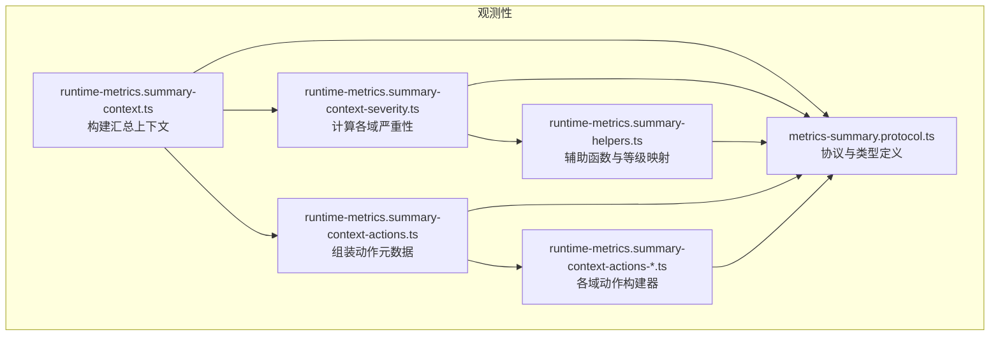
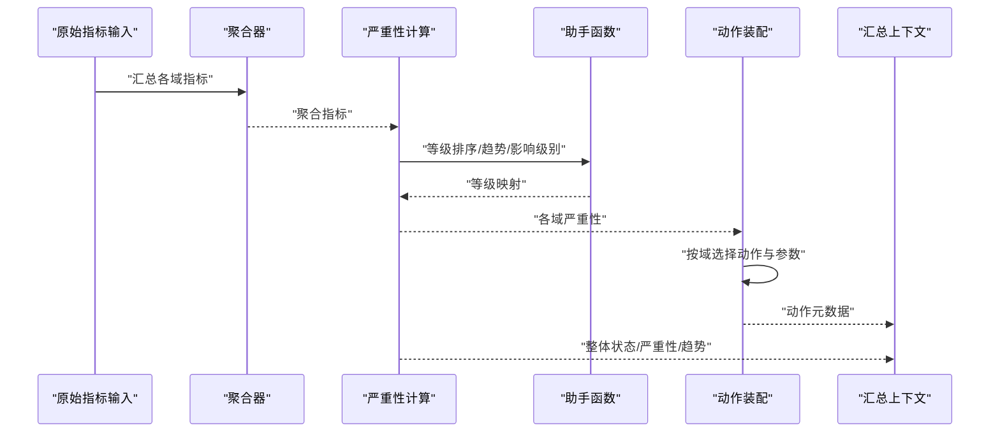
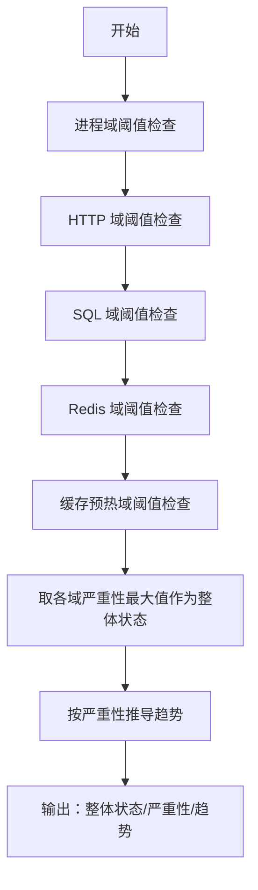
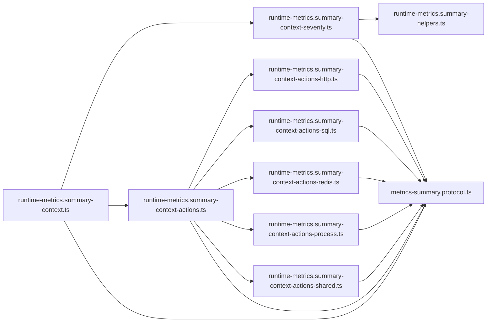

# 严重性评估

<cite>
**本文引用的文件**
- [runtime-metrics.summary-context-severity.ts](file://src/observability/runtime-metrics.summary-context-severity.ts)
- [metrics-summary.protocol.ts](file://src/observability/metrics-summary.protocol.ts)
- [runtime-metrics.summary-context.ts](file://src/observability/runtime-metrics.summary-context.ts)
- [runtime-metrics.summary-helpers.ts](file://src/observability/runtime-metrics.summary-helpers.ts)
- [runtime-metrics.summary-context-actions.ts](file://src/observability/runtime-metrics.summary-context-actions.ts)
- [runtime-metrics.summary-context-actions-http.ts](file://src/observability/runtime-metrics.summary-context-actions-http.ts)
- [runtime-metrics.summary-context-actions-sql.ts](file://src/observability/runtime-metrics.summary-context-actions-sql.ts)
- [runtime-metrics.summary-context-actions-redis.ts](file://src/observability/runtime-metrics.summary-context-actions-redis.ts)
- [runtime-metrics.summary-context-actions-process.ts](file://src/observability/runtime-metrics.summary-context-actions-process.ts)
- [runtime-metrics.summary-context-actions-shared.ts](file://src/observability/runtime-metrics.summary-context-actions-shared.ts)
</cite>

## 目录
1. [引言](#引言)
2. [项目结构](#项目结构)
3. [核心组件](#核心组件)
4. [架构总览](#架构总览)
5. [详细组件分析](#详细组件分析)
6. [依赖关系分析](#依赖关系分析)
7. [性能考量](#性能考量)
8. [故障排查指南](#故障排查指南)
9. [结论](#结论)
10. [附录](#附录)

## 引言
本技术文档聚焦于“严重性评估”子模块，系统化阐述运行时指标到严重性等级的映射机制、阈值判断逻辑、风险等级划分策略，以及与之配套的告警分级、影响范围、处置建议与应急响应支持。该模块以多域（进程、HTTP、SQL、Redis、缓存预热）指标为核心输入，通过明确的阈值规则与聚合指标计算，输出整体状态、严重性等级、趋势与可执行的操作元信息，支撑可观测性面板的自动化诊断与联动。

## 项目结构
严重性评估位于观测性子系统中，围绕“汇总上下文构建器”组织：先聚合原始指标，再计算各域严重性，最后生成动作元数据与综合视图。

图表来源
- [runtime-metrics.summary-context.ts:10-36](file://src/observability/runtime-metrics.summary-context.ts#L10-L36)
- [runtime-metrics.summary-context-severity.ts:22-128](file://src/observability/runtime-metrics.summary-context-severity.ts#L22-L128)
- [runtime-metrics.summary-helpers.ts:9-80](file://src/observability/runtime-metrics.summary-helpers.ts#L9-L80)
- [runtime-metrics.summary-context-actions.ts:30-67](file://src/observability/runtime-metrics.summary-context-actions.ts#L30-L67)
- [metrics-summary.protocol.ts:5-391](file://src/observability/metrics-summary.protocol.ts#L5-L391)

章节来源
- [runtime-metrics.summary-context.ts:1-37](file://src/observability/runtime-metrics.summary-context.ts#L1-L37)
- [metrics-summary.protocol.ts:1-391](file://src/observability/metrics-summary.protocol.ts#L1-L391)

## 核心组件
- 严重性状态计算器：根据进程、HTTP、SQL、Redis、缓存预热等域指标，判定健康、警告、严重等级，并汇总整体状态与趋势。
- 助手函数库：提供等级排序、趋势推导、影响级别与预计修复时间等通用能力。
- 动作元数据装配器：依据严重性与域特征，生成可点击的诊断动作（抽屉面板、路由跳转等），并标注责任人、影响范围与预期修复时效。
- 协议与类型：统一描述严重性等级、域、动作目标、影响范围、面板与标签页等，确保前后端一致。

章节来源
- [runtime-metrics.summary-context-severity.ts:16-128](file://src/observability/runtime-metrics.summary-context-severity.ts#L16-L128)
- [runtime-metrics.summary-helpers.ts:9-80](file://src/observability/runtime-metrics.summary-helpers.ts#L9-L80)
- [runtime-metrics.summary-context-actions.ts:14-67](file://src/observability/runtime-metrics.summary-context-actions.ts#L14-L67)
- [metrics-summary.protocol.ts:5-391](file://src/observability/metrics-summary.protocol.ts#L5-L391)

## 架构总览
下图展示从原始指标到严重性结果与可执行动作的完整流程。

图表来源
- [runtime-metrics.summary-context.ts:10-36](file://src/observability/runtime-metrics.summary-context.ts#L10-L36)
- [runtime-metrics.summary-context-severity.ts:22-128](file://src/observability/runtime-metrics.summary-context-severity.ts#L22-L128)
- [runtime-metrics.summary-helpers.ts:22-80](file://src/observability/runtime-metrics.summary-helpers.ts#L22-L80)
- [runtime-metrics.summary-context-actions.ts:30-67](file://src/observability/runtime-metrics.summary-context-actions.ts#L30-L67)

## 详细组件分析

### 严重性评分与阈值判断
- 多域阈值规则
  - 进程域：CPU 利用率、内存压力、RSS 内存达到不同阈值分别触发严重或警告。
  - HTTP 域：错误率、最大延迟、慢请求占比达到不同阈值分别触发严重或警告。
  - SQL 域：慢查询占比、最大延迟达到不同阈值分别触发严重或警告。
  - Redis 域：整体命中率、最大延迟、慢调用数达到不同阈值分别触发严重或警告。
  - 缓存预热域：失败率、最近周期失败计数、最大延迟、最热类别 P95 达到不同阈值分别触发严重或警告。
- 整体状态与趋势
  - 整体状态由各域严重性取最大等级决定；趋势根据等级映射为稳定/关注/恶化。
- 影响级别与预计修复时间
  - 严重性等级映射为低/中/高；严重等级附加“紧急”级别；预计修复时间按等级设定。

图表来源
- [runtime-metrics.summary-context-severity.ts:47-121](file://src/observability/runtime-metrics.summary-context-severity.ts#L47-L121)
- [runtime-metrics.summary-helpers.ts:22-66](file://src/observability/runtime-metrics.summary-helpers.ts#L22-L66)

章节来源
- [runtime-metrics.summary-context-severity.ts:22-128](file://src/observability/runtime-metrics.summary-context-severity.ts#L22-L128)
- [runtime-metrics.summary-helpers.ts:9-80](file://src/observability/runtime-metrics.summary-helpers.ts#L9-L80)

### 风险等级划分机制
- 等级定义
  - 健康：无任一域触发警告或严重。
  - 警告：任一域达到警告阈值。
  - 严重：任一域达到严重阈值。
- 等级排序与聚合
  - 使用等级序数值进行比较，取最大者作为整体状态。
- 趋势与影响级别
  - 严重对应“恶化/关注”，警告对应“关注/稳定”；影响级别与严重性映射，严重时可标记为“紧急”。

章节来源
- [metrics-summary.protocol.ts:5-13](file://src/observability/metrics-summary.protocol.ts#L5-L13)
- [runtime-metrics.summary-helpers.ts:9-28](file://src/observability/runtime-metrics.summary-helpers.ts#L9-L28)
- [runtime-metrics.summary-helpers.ts:30-66](file://src/observability/runtime-metrics.summary-helpers.ts#L30-L66)

### 评估指标权重与动态阈值
- 权重分配
  - 当前实现采用“域内阈值优先”的规则，未在代码中体现跨域加权聚合；整体状态由各域严重性取最大值决定。
- 动态阈值与自适应策略
  - 代码中未见基于历史分布或滑动窗口的动态阈值调整逻辑；当前阈值为固定阈值。
- 建议
  - 可引入滑动窗口统计与自适应阈值（如基于均值±标准差），并在协议层扩展阈值配置项，以便在运行时调整。

章节来源
- [runtime-metrics.summary-context-severity.ts:47-106](file://src/observability/runtime-metrics.summary-context-severity.ts#L47-L106)
- [metrics-summary.protocol.ts:185-391](file://src/observability/metrics-summary.protocol.ts#L185-L391)

### 评估规则配置与异常检测
- 规则配置
  - 各域阈值在严重性计算函数中硬编码；可在协议层新增“阈值配置对象”，由外部配置驱动。
- 异常检测模型
  - 代码未包含机器学习或统计模型；当前为基于阈值的规则引擎。可扩展为基于历史序列的异常检测（如孤立森林、变分自编码器）并纳入评估。

章节来源
- [runtime-metrics.summary-context-severity.ts:47-106](file://src/observability/runtime-metrics.summary-context-severity.ts#L47-L106)
- [metrics-summary.protocol.ts:185-391](file://src/observability/metrics-summary.protocol.ts#L185-L391)

### 多维度严重性分析与趋势预测
- 多维度分析
  - 进程、HTTP、SQL、Redis、缓存预热分别独立评估，便于定位根因。
- 趋势预测
  - 当前仅根据严重性等级推导趋势（稳定/关注/恶化），未包含时间序列预测。可引入简单线性趋势或滑动窗口变化率作为短期预测信号。

章节来源
- [runtime-metrics.summary-context-severity.ts:115-121](file://src/observability/runtime-metrics.summary-context-severity.ts#L115-L121)
- [runtime-metrics.summary-helpers.ts:30-40](file://src/observability/runtime-metrics.summary-helpers.ts#L30-L40)

### 预警机制与应急响应支持
- 预警分级
  - 严重性等级直接映射为低/中/高；严重时可标记“紧急”。
- 应急响应
  - 为各域生成可执行动作元数据，包括面板、标签页、参数与责任人，支持快速定位与处置。
- ETA 与影响范围
  - 预计修复时间按等级设定；影响范围按域与场景细化（实例、路由、数据库、缓存、缓存预热）。

章节来源
- [runtime-metrics.summary-helpers.ts:42-66](file://src/observability/runtime-metrics.summary-helpers.ts#L42-L66)
- [runtime-metrics.summary-context-actions-shared.ts:17-58](file://src/observability/runtime-metrics.summary-context-actions-shared.ts#L17-L58)
- [metrics-summary.protocol.ts:29-47](file://src/observability/metrics-summary.protocol.ts#L29-L47)

### 报告生成与可视化
- 概览卡片
  - 协议定义了各域卡片结构，包含严重性、趋势、建议、关键指标与诊断入口。
- 高亮与排序
  - 提供高亮项排序规则，按严重性、优先级、域与编码排序，便于呈现关键问题。

章节来源
- [metrics-summary.protocol.ts:205-391](file://src/observability/metrics-summary.protocol.ts#L205-L391)
- [runtime-metrics.summary-helpers.ts:68-80](file://src/observability/runtime-metrics.summary-helpers.ts#L68-L80)

## 依赖关系分析
- 组件耦合
  - 上下文构建器依赖严重性计算与动作装配；严重性计算依赖助手函数；动作装配依赖各域动作构建器与共享动作元数据构造器。
- 外部依赖
  - 协议文件提供类型与常量，保证前后端一致性；未发现循环依赖。

图表来源
- [runtime-metrics.summary-context.ts:1-37](file://src/observability/runtime-metrics.summary-context.ts#L1-L37)
- [runtime-metrics.summary-context-severity.ts:1-15](file://src/observability/runtime-metrics.summary-context-severity.ts#L1-L15)
- [runtime-metrics.summary-context-actions.ts:1-12](file://src/observability/runtime-metrics.summary-context-actions.ts#L1-L12)
- [runtime-metrics.summary-context-actions-http.ts:1-10](file://src/observability/runtime-metrics.summary-context-actions-http.ts#L1-L10)
- [runtime-metrics.summary-context-actions-sql.ts:1-10](file://src/observability/runtime-metrics.summary-context-actions-sql.ts#L1-L10)
- [runtime-metrics.summary-context-actions-redis.ts:1-10](file://src/observability/runtime-metrics.summary-context-actions-redis.ts#L1-L10)
- [runtime-metrics.summary-context-actions-process.ts:1-7](file://src/observability/runtime-metrics.summary-context-actions-process.ts#L1-L7)
- [runtime-metrics.summary-context-actions-shared.ts:1-11](file://src/observability/runtime-metrics.summary-context-actions-shared.ts#L1-L11)
- [metrics-summary.protocol.ts:1-10](file://src/observability/metrics-summary.protocol.ts#L1-L10)

章节来源
- [runtime-metrics.summary-context.ts:1-37](file://src/observability/runtime-metrics.summary-context.ts#L1-L37)
- [runtime-metrics.summary-context-actions.ts:1-68](file://src/observability/runtime-metrics.summary-context-actions.ts#L1-L68)

## 性能考量
- 计算复杂度
  - 严重性计算为常数时间复杂度，主要为阈值比较与一次最大值选择，开销极低。
- I/O 与缓存
  - 严重性计算不涉及外部 I/O；若后续接入动态阈值或异常检测模型，需评估模型推理与存储开销。
- 可扩展性
  - 当前实现易于扩展新域；建议将阈值与动作模板配置化，减少硬编码带来的维护成本。

## 故障排查指南
- 常见问题
  - 误报/漏报：检查阈值是否过严或过松；确认聚合指标口径与采样频率。
  - 动作不可用：核对动作目标与面板/标签页配置是否匹配；检查责任人与影响范围设置。
  - 趋势不符：确认严重性等级映射与趋势映射逻辑。
- 排查步骤
  - 逐域核验指标与阈值；验证整体状态是否由最高严重性域主导；检查动作元数据的参数与 payload 构造。

章节来源
- [runtime-metrics.summary-context-severity.ts:108-121](file://src/observability/runtime-metrics.summary-context-severity.ts#L108-L121)
- [runtime-metrics.summary-context-actions-shared.ts:17-58](file://src/observability/runtime-metrics.summary-context-actions-shared.ts#L17-L58)

## 结论
该严重性评估子模块以清晰的阈值规则与动作装配实现了从运行时指标到可执行诊断的闭环。整体设计具备良好的可读性与可扩展性，建议后续在以下方面演进：引入动态阈值与异常检测模型、完善配置化与版本化管理、增强趋势预测与报告能力，并在协议层沉淀更多可配置项以支持多租户与多环境差异化需求。

## 附录

### 严重性等级定义与映射
- 等级：健康、警告、严重
- 映射：严重性等级 → 趋势（严重=恶化，警告=关注，健康=稳定）
- 映射：严重性等级 → 影响级别（严重=高，警告=中，健康=低）

章节来源
- [metrics-summary.protocol.ts:5-13](file://src/observability/metrics-summary.protocol.ts#L5-L13)
- [runtime-metrics.summary-helpers.ts:30-54](file://src/observability/runtime-metrics.summary-helpers.ts#L30-L54)

### 配置参数与调优方法
- 阈值参数（示例来源路径）
  - 进程域：CPU 利用率、内存压力、RSS 内存阈值
    - [runtime-metrics.summary-context-severity.ts:47-59](file://src/observability/runtime-metrics.summary-context-severity.ts#L47-L59)
  - HTTP 域：错误率、最大延迟、慢请求占比阈值
    - [runtime-metrics.summary-context-severity.ts:61-73](file://src/observability/runtime-metrics.summary-context-severity.ts#L61-L73)
  - SQL 域：慢查询占比、最大延迟阈值
    - [runtime-metrics.summary-context-severity.ts:75-79](file://src/observability/runtime-metrics.summary-context-severity.ts#L75-L79)
  - Redis 域：命中率、最大延迟、慢调用数阈值
    - [runtime-metrics.summary-context-severity.ts:81-93](file://src/observability/runtime-metrics.summary-context-severity.ts#L81-L93)
  - 缓存预热域：失败率、最近周期失败计数、最大延迟、最热类别 P95 阈值
    - [runtime-metrics.summary-context-severity.ts:95-106](file://src/observability/runtime-metrics.summary-context-severity.ts#L95-L106)
- 调优建议
  - 基于历史数据统计设定阈值；结合业务高峰与低谷动态调整；对关键路由与慢操作建立基线对比。

章节来源
- [runtime-metrics.summary-context-severity.ts:47-106](file://src/observability/runtime-metrics.summary-context-severity.ts#L47-L106)

### 准确性验证手段
- 回归测试：针对典型阈值边界用例编写单元测试。
- A/B 对比：在灰度环境中对比不同阈值组合下的误报/漏报率。
- 专家评审：定期邀请运维与开发专家复盘真实事件，校准阈值与动作。

### 多维度分析与可视化
- 进程卡片：CPU 利用率、内存压力、RSS、建议与面板入口
  - [metrics-summary.protocol.ts:213-223](file://src/observability/metrics-summary.protocol.ts#L213-L223)
- HTTP 卡片：错误率、最大延迟、慢请求占比、顶部路由
  - [metrics-summary.protocol.ts:239-254](file://src/observability/metrics-summary.protocol.ts#L239-L254)
- SQL 卡片：慢查询率、最大延迟、慢查询操作
  - [metrics-summary.protocol.ts:262-275](file://src/observability/metrics-summary.protocol.ts#L262-L275)
- Redis 卡片：命中率、最大延迟、慢操作与命令
  - [metrics-summary.protocol.ts:290-303](file://src/observability/metrics-summary.protocol.ts#L290-L303)
- 缓存预热卡片：失败率、最大延迟、最近周期与最热类别
  - [metrics-summary.protocol.ts:354-374](file://src/observability/metrics-summary.protocol.ts#L354-L374)

### 告警分级与应急响应
- 动作元数据：面板、标签页、参数、责任人、影响范围、ETA、影响级别
  - [metrics-summary.protocol.ts:185-203](file://src/observability/metrics-summary.protocol.ts#L185-L203)
- 共享动作构造器：统一注入 owner、ownerType、responsibleTeam、impactScope、eta、impactLevel
  - [runtime-metrics.summary-context-actions-shared.ts:17-58](file://src/observability/runtime-metrics.summary-context-actions-shared.ts#L17-L58)