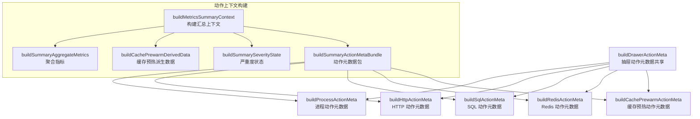
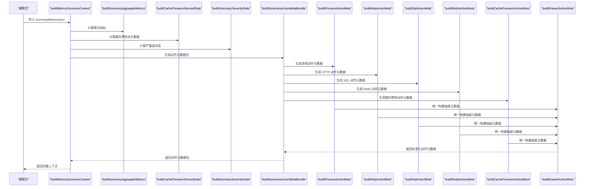
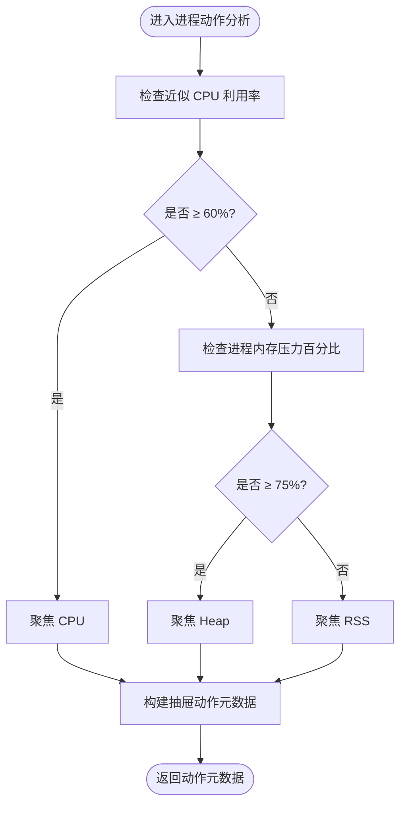
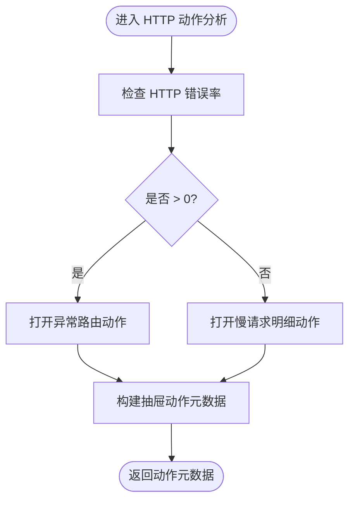
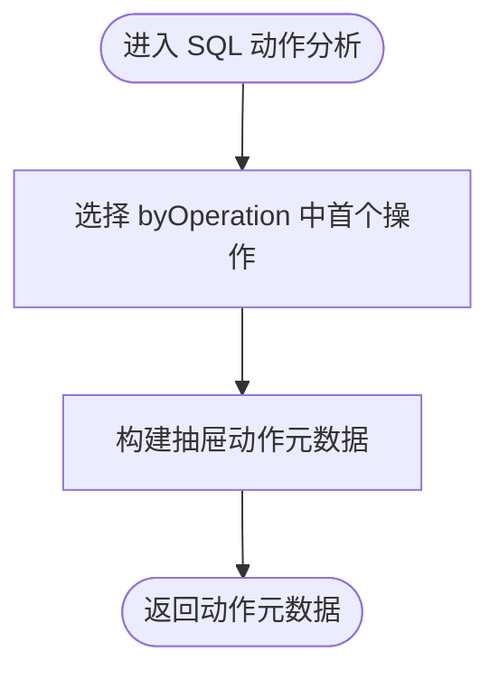
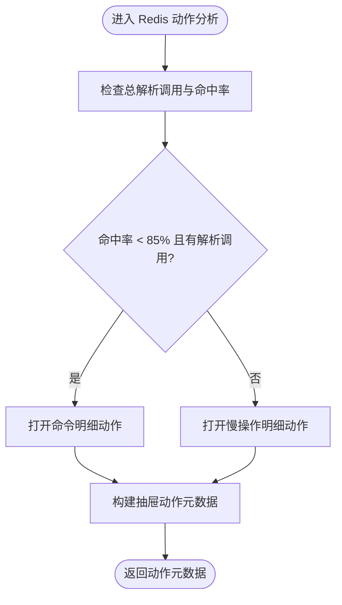
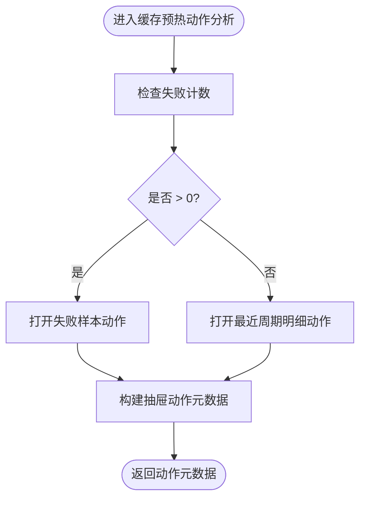
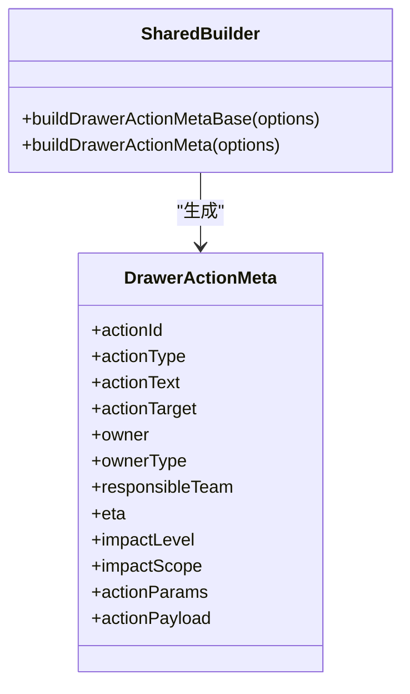
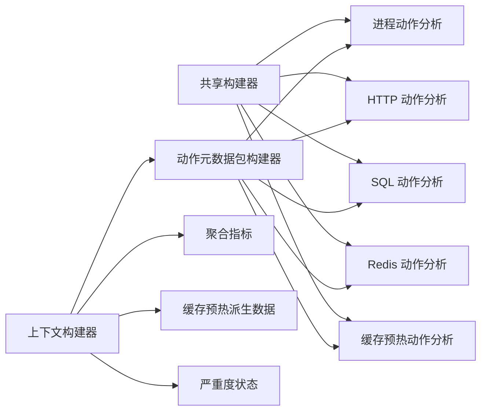

# 动作上下文分析

<cite>
**本文引用的文件**
- [runtime-metrics.summary-context.ts](file://src/observability/runtime-metrics.summary-context.ts)
- [runtime-metrics.summary-context-actions.ts](file://src/observability/runtime-metrics.summary-context-actions.ts)
- [runtime-metrics.summary-context-actions-http.ts](file://src/observability/runtime-metrics.summary-context-actions-http.ts)
- [runtime-metrics.summary-context-actions-process.ts](file://src/observability/runtime-metrics.summary-context-actions-process.ts)
- [runtime-metrics.summary-context-actions-sql.ts](file://src/observability/runtime-metrics.summary-context-actions-sql.ts)
- [runtime-metrics.summary-context-actions-redis.ts](file://src/observability/runtime-metrics.summary-context-actions-redis.ts)
- [runtime-metrics.summary-context-actions-cache-prewarm.ts](file://src/observability/runtime-metrics.summary-context-actions-cache-prewarm.ts)
- [runtime-metrics.summary-context-actions-shared.ts](file://src/observability/runtime-metrics.summary-context-actions-shared.ts)
</cite>

## 目录
1. [简介](#简介)
2. [项目结构](#项目结构)
3. [核心组件](#核心组件)
4. [架构总览](#架构总览)
5. [详细组件分析](#详细组件分析)
6. [依赖关系分析](#依赖关系分析)
7. [性能考量](#性能考量)
8. [故障排查指南](#故障排查指南)
9. [结论](#结论)
10. [附录](#附录)

## 简介
本文件系统性阐述“动作上下文分析”子模块的设计与实现，聚焦于对多种动作类型的上下文分析机制，包括：HTTP 请求、进程执行、SQL 查询、缓存预热以及 Redis 操作。文档覆盖动作分类标准、执行时间统计、资源消耗监控、异常检测算法、动作上下文数据结构、分析流程与性能指标计算方法，并提供动作级监控配置、告警规则与根因分析工具建议，以及多维度动作分析、趋势识别与性能基线对比能力。

## 项目结构
动作上下文分析位于可观测性（Observability）子系统中，围绕“汇总上下文构建器”组织各动作类型的动作元数据生成器，并通过共享的“抽屉式动作元数据构建器”统一输出标准化动作对象。整体采用按动作类型分层的模块化设计，便于扩展与维护。

图表来源
- [runtime-metrics.summary-context.ts:10-36](file://src/observability/runtime-metrics.summary-context.ts#L10-L36)
- [runtime-metrics.summary-context-actions.ts:30-67](file://src/observability/runtime-metrics.summary-context-actions.ts#L30-L67)

章节来源
- [runtime-metrics.summary-context.ts:1-37](file://src/observability/runtime-metrics.summary-context.ts#L1-L37)
- [runtime-metrics.summary-context-actions.ts:1-68](file://src/observability/runtime-metrics.summary-context-actions.ts#L1-L68)

## 核心组件
- 汇总上下文构建器：负责整合输入指标、聚合指标、缓存预热派生数据与严重度状态，产出完整的上下文对象，并注入各类动作元数据。
- 动作元数据包构建器：根据输入指标与聚合指标，为每类动作生成对应的“抽屉式动作元数据”，并携带可直接驱动前端交互的参数与载荷。
- 抽屉动作元数据共享构建器：提供统一的元数据模板，填充动作目标、责任人、影响范围、预计修复时间与影响等级等通用字段，并支持按严重度自动推导。

章节来源
- [runtime-metrics.summary-context.ts:10-36](file://src/observability/runtime-metrics.summary-context.ts#L10-L36)
- [runtime-metrics.summary-context-actions.ts:30-67](file://src/observability/runtime-metrics.summary-context-actions.ts#L30-L67)
- [runtime-metrics.summary-context-actions-shared.ts:29-79](file://src/observability/runtime-metrics.summary-context-actions-shared.ts#L29-L79)

## 架构总览
下图展示从输入指标到动作元数据的完整调用链路，体现各动作类型分析器的职责边界与共享组件的协作方式。

图表来源
- [runtime-metrics.summary-context.ts:10-36](file://src/observability/runtime-metrics.summary-context.ts#L10-L36)
- [runtime-metrics.summary-context-actions.ts:30-67](file://src/observability/runtime-metrics.summary-context-actions.ts#L30-L67)
- [runtime-metrics.summary-context-actions-process.ts:9-40](file://src/observability/runtime-metrics.summary-context-actions-process.ts#L9-L40)
- [runtime-metrics.summary-context-actions-http.ts:12-53](file://src/observability/runtime-metrics.summary-context-actions-http.ts#L12-L53)
- [runtime-metrics.summary-context-actions-sql.ts:12-36](file://src/observability/runtime-metrics.summary-context-actions-sql.ts#L12-L36)
- [runtime-metrics.summary-context-actions-redis.ts:12-49](file://src/observability/runtime-metrics.summary-context-actions-redis.ts#L12-L49)
- [runtime-metrics.summary-context-actions-cache-prewarm.ts:12-56](file://src/observability/runtime-metrics.summary-context-actions-cache-prewarm.ts#L12-L56)
- [runtime-metrics.summary-context-actions-shared.ts:29-79](file://src/observability/runtime-metrics.summary-context-actions-shared.ts#L29-L79)

## 详细组件分析

### 进程动作分析（CPU/内存/RSS）
- 动作分类与触发条件
  - 当近似 CPU 利用率 ≥ 60% 时，聚焦 CPU；当进程内存压力百分比 ≥ 75% 时，聚焦堆（heap）；否则聚焦常驻集（RSS）。
- 执行时间统计
  - 基于进程指标中的 CPU 利用率与内存压力进行阈值判断，不直接统计单次执行耗时，而是以“资源占用持续偏高”作为触发依据。
- 资源消耗监控
  - 关注近似 CPU 利用率、进程内存压力百分比、RSS 等关键指标，用于判定资源瓶颈类型。
- 异常检测算法
  - 三段式阈值判定：CPU 高占用优先级最高，其次内存压力，最后 RSS；结合严重度状态决定响应级别。
- 数据结构与流程
  - 输出动作元数据包含 section、focus（cpu/heap/rss）、severity 等参数，并通过共享构建器统一生成抽屉式动作对象。
- 性能指标计算方法
  - 近似 CPU 利用率与内存压力百分比由聚合指标提供；动作聚焦点基于阈值比较动态选择。

图表来源
- [runtime-metrics.summary-context-actions-process.ts:9-40](file://src/observability/runtime-metrics.summary-context-actions-process.ts#L9-L40)
- [runtime-metrics.summary-context-actions-shared.ts:29-79](file://src/observability/runtime-metrics.summary-context-actions-shared.ts#L29-L79)

章节来源
- [runtime-metrics.summary-context-actions-process.ts:1-41](file://src/observability/runtime-metrics.summary-context-actions-process.ts#L1-L41)
- [runtime-metrics.summary-context-actions-shared.ts:1-80](file://src/observability/runtime-metrics.summary-context-actions-shared.ts#L1-L80)

### HTTP 请求动作分析（错误率/慢请求）
- 动作分类与触发条件
  - 若 HTTP 错误率大于 0，则打开“异常路由”动作；否则打开“慢请求明细”动作。
- 执行时间统计
  - 以 topRoutes 中的路由作为参考，结合慢请求分析结果定位热点路径。
- 资源消耗监控
  - 通过 HTTP 错误率百分比参与严重度判定，间接反映上游或下游资源压力。
- 异常检测算法
  - 基于错误率阈值与慢请求排序，优先处理高风险路由。
- 数据结构与流程
  - 输出动作元数据包含 section、tab（topRoutes/slowRequests）、route 等参数；通过共享构建器统一生成抽屉式动作对象。

图表来源
- [runtime-metrics.summary-context-actions-http.ts:12-53](file://src/observability/runtime-metrics.summary-context-actions-http.ts#L12-L53)
- [runtime-metrics.summary-context-actions-shared.ts:29-79](file://src/observability/runtime-metrics.summary-context-actions-shared.ts#L29-L79)

章节来源
- [runtime-metrics.summary-context-actions-http.ts:1-54](file://src/observability/runtime-metrics.summary-context-actions-http.ts#L1-L54)

### SQL 查询动作分析（慢查询）
- 动作分类与触发条件
  - 基于 SQL 指标中的 byOperation 排序，选择首个操作作为动作焦点。
- 执行时间统计
  - 以 operation 为维度的慢查询排序结果作为触发依据。
- 资源消耗监控
  - 通过慢查询数量与耗时分布评估数据库负载。
- 异常检测算法
  - 以 operation 的慢查询占比与耗时作为异常判定依据。
- 数据结构与流程
  - 输出动作元数据包含 section、tab（slowQueries）、operation 等参数；通过共享构建器统一生成抽屉式动作对象。

图表来源
- [runtime-metrics.summary-context-actions-sql.ts:12-36](file://src/observability/runtime-metrics.summary-context-actions-sql.ts#L12-L36)
- [runtime-metrics.summary-context-actions-shared.ts:29-79](file://src/observability/runtime-metrics.summary-context-actions-shared.ts#L29-L79)

章节来源
- [runtime-metrics.summary-context-actions-sql.ts:1-37](file://src/observability/runtime-metrics.summary-context-actions-sql.ts#L1-L37)

### Redis 操作动作分析（命中率/慢操作）
- 动作分类与触发条件
  - 若 Redis 总解析调用数 > 0 且总体命中率 < 85%，则打开“命令明细（低命中率）”动作；否则打开“慢操作明细”动作。
- 执行时间统计
  - 以 commands 中的命令为焦点，结合慢操作排序结果定位热点命令。
- 资源消耗监控
  - 通过 totalRedisResolvedCalls 与 redisOverallHitRatePercent 参与严重度判定。
- 异常检测算法
  - 命中率阈值与慢操作排序共同决定动作类型与优先级。
- 数据结构与流程
  - 输出动作元数据包含 section、tab（commands/slowOperations）、command 等参数；通过共享构建器统一生成抽屉式动作对象。

图表来源
- [runtime-metrics.summary-context-actions-redis.ts:12-49](file://src/observability/runtime-metrics.summary-context-actions-redis.ts#L12-L49)
- [runtime-metrics.summary-context-actions-shared.ts:29-79](file://src/observability/runtime-metrics.summary-context-actions-shared.ts#L29-L79)

章节来源
- [runtime-metrics.summary-context-actions-redis.ts:1-50](file://src/observability/runtime-metrics.summary-context-actions-redis.ts#L1-L50)

### 缓存预热动作分析（失败样本/最近周期）
- 动作分类与触发条件
  - 若缓存预热失败计数 > 0，则打开“失败样本”动作；否则打开“最近周期明细”动作。
- 执行时间统计
  - 以 failedCount、invalidCount 与最近/最热类别为依据，定位问题周期与失败样本。
- 资源消耗监控
  - 通过 failedCount、invalidCount 与类别热度评估预热效果与稳定性。
- 异常检测算法
  - 失败计数优先级最高；若无失败则回退到类别热度与最新失败类别。
- 数据结构与流程
  - 输出动作元数据包含 section、tab（failedSamples/recentCycles）、category 等参数；通过共享构建器统一生成抽屉式动作对象。

图表来源
- [runtime-metrics.summary-context-actions-cache-prewarm.ts:12-56](file://src/observability/runtime-metrics.summary-context-actions-cache-prewarm.ts#L12-L56)
- [runtime-metrics.summary-context-actions-shared.ts:29-79](file://src/observability/runtime-metrics.summary-context-actions-shared.ts#L29-L79)

章节来源
- [runtime-metrics.summary-context-actions-cache-prewarm.ts:1-57](file://src/observability/runtime-metrics.summary-context-actions-cache-prewarm.ts#L1-L57)

### 抽屉动作元数据共享构建器
- 统一字段
  - 包含 actionId、actionType（抽屉）、actionText、actionTarget、owner、ownerType、responsibleTeam、eta、impactLevel、impactScope 等。
- 自动推导
  - 通过严重度映射自动推导 eta 与 impactLevel；通过动作 ID 映射获取默认目标页面。
- 可扩展性
  - 通过 buildPayload 将动作参数转换为具体载荷，便于不同动作类型复用同一构建流程。

图表来源
- [runtime-metrics.summary-context-actions-shared.ts:29-79](file://src/observability/runtime-metrics.summary-context-actions-shared.ts#L29-L79)

章节来源
- [runtime-metrics.summary-context-actions-shared.ts:1-80](file://src/observability/runtime-metrics.summary-context-actions-shared.ts#L1-L80)

## 依赖关系分析
- 组件耦合与内聚
  - 上下文构建器与动作元数据包构建器耦合度低，通过输入指标与聚合指标解耦；各动作分析器彼此独立，仅依赖共享构建器。
- 直接与间接依赖
  - 各动作分析器直接依赖共享构建器；动作元数据包构建器间接依赖聚合指标与缓存预热派生数据。
- 外部依赖与集成点
  - 与协议层（metrics-summary.protocol）保持一致的动作 ID、参数与载荷约定，确保前后端一致性。
- 接口契约
  - 共享构建器提供稳定的接口契约，保证不同动作类型在字段与行为上的一致性。

图表来源
- [runtime-metrics.summary-context.ts:10-36](file://src/observability/runtime-metrics.summary-context.ts#L10-L36)
- [runtime-metrics.summary-context-actions.ts:30-67](file://src/observability/runtime-metrics.summary-context-actions.ts#L30-L67)
- [runtime-metrics.summary-context-actions-shared.ts:29-79](file://src/observability/runtime-metrics.summary-context-actions-shared.ts#L29-L79)

章节来源
- [runtime-metrics.summary-context.ts:1-37](file://src/observability/runtime-metrics.summary-context.ts#L1-L37)
- [runtime-metrics.summary-context-actions.ts:1-68](file://src/observability/runtime-metrics.summary-context-actions.ts#L1-L68)

## 性能考量
- 时间复杂度
  - 各动作分析器均为 O(1) 复杂度，主要进行阈值比较与参数拼装，整体开销极低。
- 空间复杂度
  - 仅构造少量动作元数据对象，空间开销与输入规模无关。
- 可扩展性
  - 新增动作类型只需实现对应分析器与共享构建器，遵循现有契约即可无缝接入。
- 性能基线对比
  - 建议在聚合指标中引入历史基线与滑动窗口统计，以便在动作元数据中扩展“趋势对比”字段，辅助识别性能退化。

## 故障排查指南
- 常见问题定位
  - 进程动作：若聚焦 CPU，优先检查热点函数与并发；若聚焦 Heap，关注内存泄漏与 GC 压力；若聚焦 RSS，检查外部资源占用。
  - HTTP 动作：优先处理错误率高的路由；结合慢请求明细定位慢查询或上游依赖。
  - SQL 动作：优先处理高耗时 operation；结合索引与查询计划优化。
  - Redis 动作：低命中率场景检查键过期策略与预热策略；慢操作场景检查命令复杂度与网络延迟。
  - 缓存预热动作：失败样本优先级最高；关注最近失败类别与无效样本比例。
- 告警规则建议
  - 进程：CPU ≥ 60% 持续 5 分钟；内存压力 ≥ 75% 持续 5 分钟；RSS 异常增长。
  - HTTP：错误率 > 0 且持续上升；慢请求 P95 超过阈值。
  - SQL：慢查询占比超过阈值；operation 耗时异常升高。
  - Redis：命中率 < 85% 且解析调用 > 0；慢操作次数异常升高。
  - 缓存预热：失败计数 > 0；无效样本比例异常升高。
- 根因分析工具
  - 结合动作元数据中的 actionParams（如 route、operation、command、category）与 actionPayload，快速跳转到对应面板进行深度分析。

章节来源
- [runtime-metrics.summary-context-actions-process.ts:9-40](file://src/observability/runtime-metrics.summary-context-actions-process.ts#L9-L40)
- [runtime-metrics.summary-context-actions-http.ts:12-53](file://src/observability/runtime-metrics.summary-context-actions-http.ts#L12-L53)
- [runtime-metrics.summary-context-actions-sql.ts:12-36](file://src/observability/runtime-metrics.summary-context-actions-sql.ts#L12-L36)
- [runtime-metrics.summary-context-actions-redis.ts:12-49](file://src/observability/runtime-metrics.summary-context-actions-redis.ts#L12-L49)
- [runtime-metrics.summary-context-actions-cache-prewarm.ts:12-56](file://src/observability/runtime-metrics.summary-context-actions-cache-prewarm.ts#L12-L56)

## 结论
动作上下文分析子模块通过“上下文构建器 + 动作元数据包构建器 + 共享构建器”的三层架构，实现了对 HTTP、进程、SQL、Redis 与缓存预热五类动作的统一、可扩展与可复用的上下文分析。该设计在保证低开销的同时，提供了清晰的动作分类、完善的异常检测与根因定位能力，并为后续的趋势识别与性能基线对比奠定了坚实基础。

## 附录
- 动作上下文数据结构要点
  - 统一字段：actionId、actionType、actionText、actionTarget、owner、ownerType、responsibleTeam、eta、impactLevel、impactScope。
  - 动作参数：按动作类型定义，如 section、tab、route、operation、command、category、focus、severity 等。
  - 动作载荷：通过 buildPayload 将动作参数转换为具体载荷，驱动前端跳转与面板渲染。
- 动作级别监控配置建议
  - 在聚合指标中增加历史基线与滑动窗口统计，配合严重度状态与趋势信息，形成“当前状态 + 历史对比 + 趋势预测”的综合监控视图。
- 多维度动作分析与趋势识别
  - 可在共享构建器中扩展“趋势对比”字段，结合时间序列数据进行同比/环比分析，辅助识别周期性波动与异常拐点。