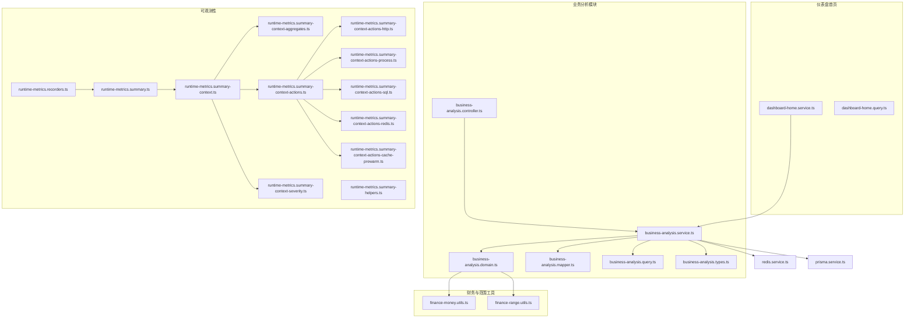
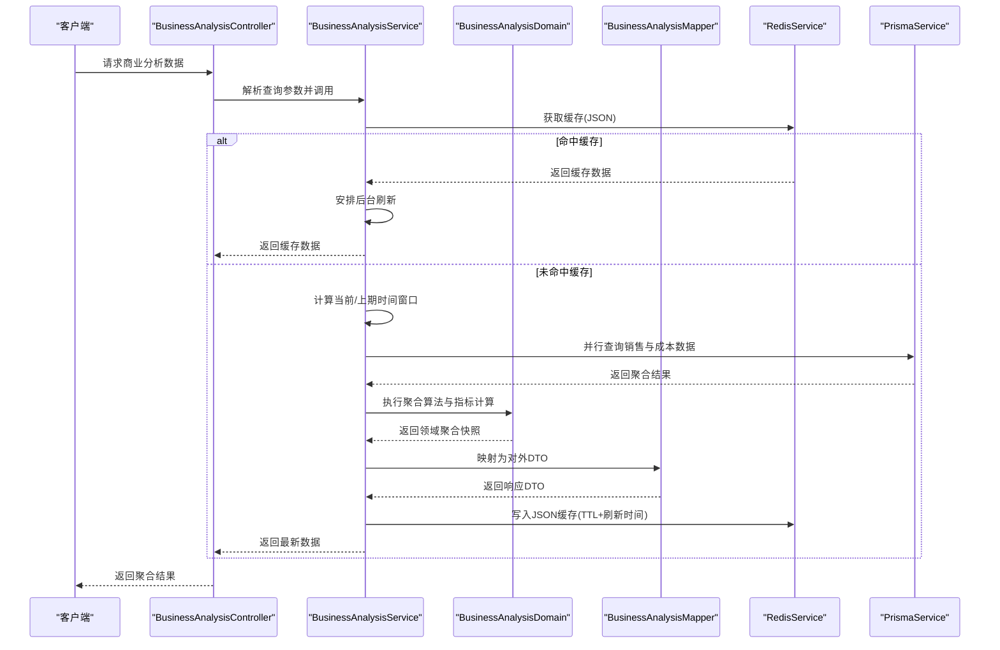
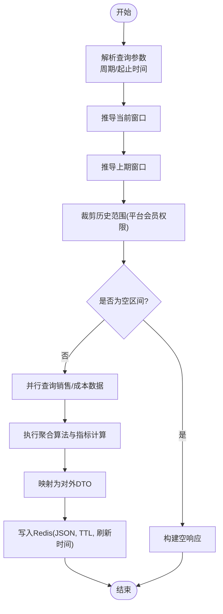
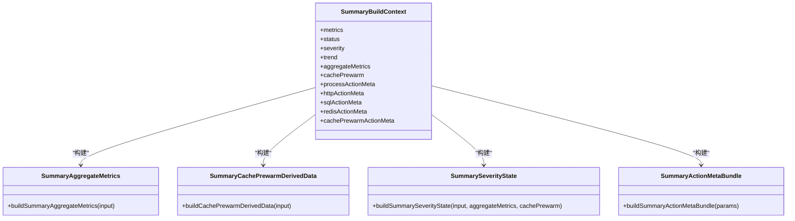
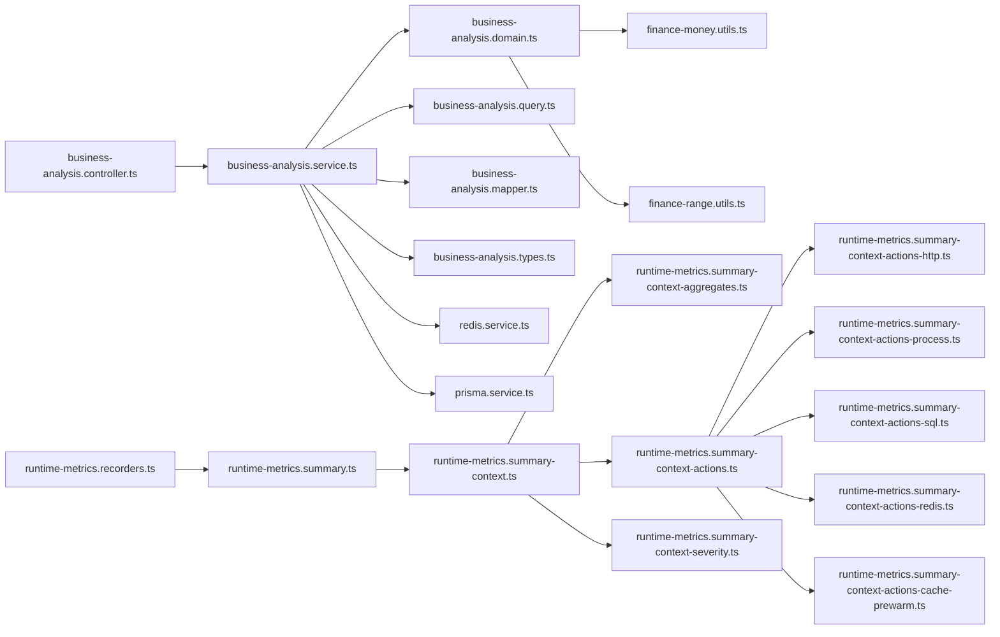

# 聚合分析

<cite>
**本文引用的文件**
- [business-analysis.service.ts](file://src/purely-profit/dashboard/business-analysis/business-analysis.service.ts)
- [business-analysis.domain.ts](file://src/purely-profit/dashboard/business-analysis/business-analysis.domain.ts)
- [business-analysis.mapper.ts](file://src/purely-profit/dashboard/business-analysis/business-analysis.mapper.ts)
- [business-analysis.query.ts](file://src/purely-profit/dashboard/business-analysis/business-analysis.query.ts)
- [business-analysis.types.ts](file://src/purely-profit/dashboard/business-analysis/business-analysis.types.ts)
- [business-analysis.controller.ts](file://src/purely-profit/dashboard/business-analysis/business-analysis.controller.ts)
- [dashboard-home.service.ts](file://src/purely-profit/dashboard/dashboard-home/dashboard-home.service.ts)
- [dashboard-home.query.ts](file://src/purely-profit/dashboard/dashboard-home/dashboard-home.query.ts)
- [finance-money.utils.ts](file://src/purely-profit/finance/finance-money.utils.ts)
- [finance-range.utils.ts](file://src/purely-profit/finance/finance-range.utils.ts)
- [runtime-metrics.summary.ts](file://src/observability/runtime-metrics.summary.ts)
- [runtime-metrics.summary-context.ts](file://src/observability/runtime-metrics.summary-context.ts)
- [runtime-metrics.summary-context-aggregates.ts](file://src/observability/runtime-metrics.summary-context-aggregates.ts)
- [runtime-metrics.summary-context-actions.ts](file://src/observability/runtime-metrics.summary-context-actions.ts)
- [runtime-metrics.summary-context-actions-process.ts](file://src/observability/runtime-metrics.summary-context-actions-process.ts)
- [runtime-metrics.summary-context-actions-http.ts](file://src/observability/runtime-metrics.summary-context-actions-http.ts)
- [runtime-metrics.summary-context-actions-sql.ts](file://src/observability/runtime-metrics.summary-context-actions-sql.ts)
- [runtime-metrics.summary-context-actions-redis.ts](file://src/observability/runtime-metrics.summary-context-actions-redis.ts)
- [runtime-metrics.summary-context-actions-cache-prewarm.ts](file://src/observability/runtime-metrics.summary-context-actions-cache-prewarm.ts)
- [runtime-metrics.summary-context-severity.ts](file://src/observability/runtime-metrics.summary-context-severity.ts)
- [runtime-metrics.summary-helpers.ts](file://src/observability/runtime-metrics.summary-helpers.ts)
- [runtime-metrics.recorders.ts](file://src/observability/runtime-metrics.recorders.ts)
- [redis.service.ts](file://src/redis/redis.service.ts)
- [prisma.service.ts](file://src/prisma/prisma.service.ts)
</cite>

## 目录
1. [引言](#引言)
2. [项目结构](#项目结构)
3. [核心组件](#核心组件)
4. [架构总览](#架构总览)
5. [详细组件分析](#详细组件分析)
6. [依赖关系分析](#依赖关系分析)
7. [性能考虑](#性能考虑)
8. [故障排查指南](#故障排查指南)
9. [结论](#结论)
10. [附录](#附录)

## 引言
本技术文档聚焦“聚合分析”子模块，系统性阐述数据聚合算法、统计计算方法与汇总报告生成机制。内容覆盖聚合粒度控制、时间窗口配置、数据分组策略、指标定义与计算公式、精度控制、配置选项、性能优化与内存使用技巧，并对实时聚合、批量聚合与历史数据聚合的实现方式进行对比说明，同时给出聚合结果的数据格式、导出能力与可视化支持建议。

## 项目结构
聚合分析位于业务仪表盘模块下，围绕“商业分析”服务展开，结合财务与会员体系数据进行跨域聚合，通过缓存与后台刷新保障性能与一致性；可观测性模块提供聚合上下文构建、严重度评估与动作元数据生成，支撑运行时摘要与告警。

图表来源
- [business-analysis.controller.ts](file://src/purely-profit/dashboard/business-analysis/business-analysis.controller.ts)
- [business-analysis.service.ts](file://src/purely-profit/dashboard/business-analysis/business-analysis.service.ts)
- [business-analysis.domain.ts](file://src/purely-profit/dashboard/business-analysis/business-analysis.domain.ts)
- [business-analysis.mapper.ts](file://src/purely-profit/dashboard/business-analysis/business-analysis.mapper.ts)
- [business-analysis.query.ts](file://src/purely-profit/dashboard/business-analysis/business-analysis.query.ts)
- [business-analysis.types.ts](file://src/purely-profit/dashboard/business-analysis/business-analysis.types.ts)
- [finance-money.utils.ts](file://src/purely-profit/finance/finance-money.utils.ts)
- [finance-range.utils.ts](file://src/purely-profit/finance/finance-range.utils.ts)
- [dashboard-home.service.ts](file://src/purely-profit/dashboard/dashboard-home/dashboard-home.service.ts)
- [dashboard-home.query.ts](file://src/purely-profit/dashboard/dashboard-home/dashboard-home.query.ts)
- [runtime-metrics.summary.ts](file://src/observability/runtime-metrics.summary.ts)
- [runtime-metrics.summary-context.ts](file://src/observability/runtime-metrics.summary-context.ts)
- [runtime-metrics.summary-context-aggregates.ts](file://src/observability/runtime-metrics.summary-context-aggregates.ts)
- [runtime-metrics.summary-context-actions.ts](file://src/observability/runtime-metrics.summary-context-actions.ts)
- [runtime-metrics.summary-context-actions-http.ts](file://src/observability/runtime-metrics.summary-context-actions-http.ts)
- [runtime-metrics.summary-context-actions-process.ts](file://src/observability/runtime-metrics.summary-context-actions-process.ts)
- [runtime-metrics.summary-context-actions-sql.ts](file://src/observability/runtime-metrics.summary-context-actions-sql.ts)
- [runtime-metrics.summary-context-actions-redis.ts](file://src/observability/runtime-metrics.summary-context-actions-redis.ts)
- [runtime-metrics.summary-context-actions-cache-prewarm.ts](file://src/observability/runtime-metrics.summary-context-actions-cache-prewarm.ts)
- [runtime-metrics.summary-context-severity.ts](file://src/observability/runtime-metrics.summary-context-severity.ts)
- [runtime-metrics.summary-helpers.ts](file://src/observability/runtime-metrics.summary-helpers.ts)
- [runtime-metrics.recorders.ts](file://src/observability/runtime-metrics.recorders.ts)
- [redis.service.ts](file://src/redis/redis.service.ts)
- [prisma.service.ts](file://src/prisma/prisma.service.ts)

章节来源
- [business-analysis.controller.ts](file://src/purely-profit/dashboard/business-analysis/business-analysis.controller.ts)
- [business-analysis.service.ts](file://src/purely-profit/dashboard/business-analysis/business-analysis.service.ts)
- [business-analysis.domain.ts](file://src/purely-profit/dashboard/business-analysis/business-analysis.domain.ts)
- [business-analysis.mapper.ts](file://src/purely-profit/dashboard/business-analysis/business-analysis.mapper.ts)
- [business-analysis.query.ts](file://src/purely-profit/dashboard/business-analysis/business-analysis.query.ts)
- [business-analysis.types.ts](file://src/purely-profit/dashboard/business-analysis/business-analysis.types.ts)
- [finance-money.utils.ts](file://src/purely-profit/finance/finance-money.utils.ts)
- [finance-range.utils.ts](file://src/purely-profit/finance/finance-range.utils.ts)
- [dashboard-home.service.ts](file://src/purely-profit/dashboard/dashboard-home/dashboard-home.service.ts)
- [dashboard-home.query.ts](file://src/purely-profit/dashboard/dashboard-home/dashboard-home.query.ts)
- [runtime-metrics.summary.ts](file://src/observability/runtime-metrics.summary.ts)
- [runtime-metrics.summary-context.ts](file://src/observability/runtime-metrics.summary-context.ts)
- [runtime-metrics.summary-context-aggregates.ts](file://src/observability/runtime-metrics.summary-context-aggregates.ts)
- [runtime-metrics.summary-context-actions.ts](file://src/observability/runtime-metrics.summary-context-actions.ts)
- [runtime-metrics.summary-context-actions-http.ts](file://src/observability/runtime-metrics.summary-context-actions-http.ts)
- [runtime-metrics.summary-context-actions-process.ts](file://src/observability/runtime-metrics.summary-context-actions-process.ts)
- [runtime-metrics.summary-context-actions-sql.ts](file://src/observability/runtime-metrics.summary-context-actions-sql.ts)
- [runtime-metrics.summary-context-actions-redis.ts](file://src/observability/runtime-metrics.summary-context-actions-redis.ts)
- [runtime-metrics.summary-context-actions-cache-prewarm.ts](file://src/observability/runtime-metrics.summary-context-actions-cache-prewarm.ts)
- [runtime-metrics.summary-context-severity.ts](file://src/observability/runtime-metrics.summary-context-severity.ts)
- [runtime-metrics.summary-helpers.ts](file://src/observability/runtime-metrics.summary-helpers.ts)
- [runtime-metrics.recorders.ts](file://src/observability/runtime-metrics.recorders.ts)
- [redis.service.ts](file://src/redis/redis.service.ts)
- [prisma.service.ts](file://src/prisma/prisma.service.ts)

## 核心组件
- 商业分析服务：负责聚合构建、缓存命中与后台刷新、历史范围裁剪与权限校验、并行查询与结果组装。
- 商业分析领域：封装聚合算法、指标计算（收入、成本、利润、利润率、同比变化等）与映射器。
- 查询与类型：定义查询输入、时间窗口解析、聚合输出类型与分组键。
- 映射器：将领域层聚合结果映射为对外 DTO，包含空响应构建、趋势与占比计算。
- 缓存与后台刷新：基于 Redis 的 JSON 缓存、TTL 与刷新调度，提升实时访问性能。
- 可观测性摘要：构建聚合上下文、聚合指标、严重度与动作元数据，记录各模块耗时分布。

章节来源
- [business-analysis.service.ts](file://src/purely-profit/dashboard/business-analysis/business-analysis.service.ts)
- [business-analysis.domain.ts](file://src/purely-profit/dashboard/business-analysis/business-analysis.domain.ts)
- [business-analysis.mapper.ts](file://src/purely-profit/dashboard/business-analysis/business-analysis.mapper.ts)
- [business-analysis.query.ts](file://src/purely-profit/dashboard/business-analysis/business-analysis.query.ts)
- [business-analysis.types.ts](file://src/purely-profit/dashboard/business-analysis/business-analysis.types.ts)
- [redis.service.ts](file://src/redis/redis.service.ts)

## 架构总览
聚合分析采用“控制器-服务-领域-查询-映射”的分层设计，结合财务与会员范围工具，完成跨表聚合与指标计算；通过 Redis 缓存与后台刷新实现高性能与低延迟；可观测性模块在聚合过程中注入上下文与动作元数据，形成可度量的摘要视图。

图表来源
- [business-analysis.controller.ts](file://src/purely-profit/dashboard/business-analysis/business-analysis.controller.ts)
- [business-analysis.service.ts](file://src/purely-profit/dashboard/business-analysis/business-analysis.service.ts)
- [business-analysis.domain.ts](file://src/purely-profit/dashboard/business-analysis/business-analysis.domain.ts)
- [business-analysis.mapper.ts](file://src/purely-profit/dashboard/business-analysis/business-analysis.mapper.ts)
- [redis.service.ts](file://src/redis/redis.service.ts)
- [prisma.service.ts](file://src/prisma/prisma.service.ts)

## 详细组件分析

### 时间窗口与聚合粒度
- 时间窗口解析：根据请求周期与起止时间推导当前与上期窗口，并进行历史范围裁剪以符合平台会员权限。
- 粒度控制：日级聚合为主，趋势序列长度限制与标签格式化由映射器处理；支持按类别、产品维度进行分组聚合。
- 范围裁剪：结合平台会员访问控制服务，确保子账户仅能访问授权的历史范围。

图表来源
- [business-analysis.service.ts](file://src/purely-profit/dashboard/business-analysis/business-analysis.service.ts)
- [business-analysis.query.ts](file://src/purely-profit/dashboard/business-analysis/business-analysis.query.ts)
- [business-analysis.mapper.ts](file://src/purely-profit/dashboard/business-analysis/business-analysis.mapper.ts)
- [finance-range.utils.ts](file://src/purely-profit/finance/finance-range.utils.ts)

章节来源
- [business-analysis.service.ts](file://src/purely-profit/dashboard/business-analysis/business-analysis.service.ts)
- [business-analysis.query.ts](file://src/purely-profit/dashboard/business-analysis/business-analysis.query.ts)
- [business-analysis.mapper.ts](file://src/purely-profit/dashboard/business-analysis/business-analysis.mapper.ts)
- [finance-range.utils.ts](file://src/purely-profit/finance/finance-range.utils.ts)

### 指标定义与计算公式
- 收入、成本、利润：基础聚合值，利润=收入-成本。
- 利润率：利润/收入×100，分母为0时返回0。
- 同比变化率：(本期-上期)/上期×100，上期为0时按约定处理。
- 占比：某类/某产品的收入或成本占总值的比例。
- 日趋势：按自然日聚合，输出日标签、收入、成本、利润。

章节来源
- [business-analysis.mapper.ts](file://src/purely-profit/dashboard/business-analysis/business-analysis.mapper.ts)
- [business-analysis.domain.ts](file://src/purely-profit/dashboard/business-analysis/business-analysis.domain.ts)
- [finance-money.utils.ts](file://src/purely-profit/finance/finance-money.utils.ts)

### 数据分组策略
- 类别份额：按商品类别分组，计算收入与成本占比。
- 成本构成：按成本桶键分组，支持成本率项展示。
- 排行榜：按产品维度聚合，输出销量/收入排行。
- 维度过滤：结合查询输入与权限裁剪，确保分组键合法且可聚合。

章节来源
- [business-analysis.types.ts](file://src/purely-profit/dashboard/business-analysis/business-analysis.types.ts)
- [business-analysis.query.ts](file://src/purely-profit/dashboard/business-analysis/business-analysis.query.ts)
- [business-analysis.domain.ts](file://src/purely-profit/dashboard/business-analysis/business-analysis.domain.ts)

### 缓存与后台刷新
- 缓存键：基于门店ID与查询参数生成，避免重复计算。
- 缓存结构：包含生成时间、刷新时间与聚合数据。
- TTL：统一缓存过期时间，平衡新鲜度与资源消耗。
- 后台刷新：当接近刷新时间时异步重新计算并更新缓存，保证后续请求的低延迟。

章节来源
- [business-analysis.service.ts](file://src/purely-profit/dashboard/business-analysis/business-analysis.service.ts)
- [redis.service.ts](file://src/redis/redis.service.ts)

### 可观测性摘要与聚合上下文
- 上下文构建：聚合指标、缓存预热派生数据、严重度状态与动作元数据。
- 动作元数据：HTTP、进程、SQL、Redis、缓存预热等动作的元信息聚合。
- 严重度与趋势：根据聚合结果与阈值判定健康状态、趋势与影响等级。
- 运行时记录：记录各模块耗时分布，便于性能分析与优化。

图表来源
- [runtime-metrics.summary-context.ts](file://src/observability/runtime-metrics.summary-context.ts)
- [runtime-metrics.summary-context-aggregates.ts](file://src/observability/runtime-metrics.summary-context-aggregates.ts)
- [runtime-metrics.summary-context-actions.ts](file://src/observability/runtime-metrics.summary-context-actions.ts)
- [runtime-metrics.summary-context-actions-process.ts](file://src/observability/runtime-metrics.summary-context-actions-process.ts)
- [runtime-metrics.summary-context-actions-http.ts](file://src/observability/runtime-metrics.summary-context-actions-http.ts)
- [runtime-metrics.summary-context-actions-sql.ts](file://src/observability/runtime-metrics.summary-context-actions-sql.ts)
- [runtime-metrics.summary-context-actions-redis.ts](file://src/observability/runtime-metrics.summary-context-actions-redis.ts)
- [runtime-metrics.summary-context-actions-cache-prewarm.ts](file://src/observability/runtime-metrics.summary-context-actions-cache-prewarm.ts)
- [runtime-metrics.summary-context-severity.ts](file://src/observability/runtime-metrics.summary-context-severity.ts)

章节来源
- [runtime-metrics.summary-context.ts](file://src/observability/runtime-metrics.summary-context.ts)
- [runtime-metrics.summary-context-aggregates.ts](file://src/observability/runtime-metrics.summary-context-aggregates.ts)
- [runtime-metrics.summary-context-actions.ts](file://src/observability/runtime-metrics.summary-context-actions.ts)
- [runtime-metrics.summary-context-actions-process.ts](file://src/observability/runtime-metrics.summary-context-actions-process.ts)
- [runtime-metrics.summary-context-actions-http.ts](file://src/observability/runtime-metrics.summary-context-actions-http.ts)
- [runtime-metrics.summary-context-actions-sql.ts](file://src/observability/runtime-metrics.summary-context-actions-sql.ts)
- [runtime-metrics.summary-context-actions-redis.ts](file://src/observability/runtime-metrics.summary-context-actions-redis.ts)
- [runtime-metrics.summary-context-actions-cache-prewarm.ts](file://src/observability/runtime-metrics.summary-context-actions-cache-prewarm.ts)
- [runtime-metrics.summary-context-severity.ts](file://src/observability/runtime-metrics.summary-context-severity.ts)
- [runtime-metrics.summary.ts](file://src/observability/runtime-metrics.summary.ts)
- [runtime-metrics.recorders.ts](file://src/observability/runtime-metrics.recorders.ts)

### 实时/批量/历史聚合实现差异
- 实时聚合：通过缓存命中与后台刷新机制，优先返回缓存，随后异步刷新，满足低延迟场景。
- 批量聚合：并行查询销售与成本数据，减少等待时间；聚合完成后写入缓存。
- 历史聚合：先进行历史范围裁剪与权限校验，再执行聚合，避免越权与无效查询。

章节来源
- [business-analysis.service.ts](file://src/purely-profit/dashboard/business-analysis/business-analysis.service.ts)
- [business-analysis.query.ts](file://src/purely-profit/dashboard/business-analysis/business-analysis.query.ts)

### 结果数据格式与导出/可视化
- 输出格式：包含英雄指标（收入、成本、利润、利润率、订单数）、日趋势、类别份额、成本率项、排行榜等。
- 导出：建议在控制器层扩展 CSV/Excel 导出接口，基于当前聚合结果进行格式化输出。
- 可视化：前端可直接消费 DTO 字段，日趋势用于折线图，类别份额与排行榜用于饼图/条形图。

章节来源
- [business-analysis.mapper.ts](file://src/purely-profit/dashboard/business-analysis/business-analysis.mapper.ts)
- [business-analysis.controller.ts](file://src/purely-profit/dashboard/business-analysis/business-analysis.controller.ts)

## 依赖关系分析
- 控制器依赖服务；服务依赖领域、查询、映射与缓存；领域依赖财务与范围工具；可观测性模块独立于业务逻辑但贯穿聚合过程。
- 外部依赖：Redis 用于缓存，Prisma 用于数据库访问。

图表来源
- [business-analysis.controller.ts](file://src/purely-profit/dashboard/business-analysis/business-analysis.controller.ts)
- [business-analysis.service.ts](file://src/purely-profit/dashboard/business-analysis/business-analysis.service.ts)
- [business-analysis.domain.ts](file://src/purely-profit/dashboard/business-analysis/business-analysis.domain.ts)
- [business-analysis.query.ts](file://src/purely-profit/dashboard/business-analysis/business-analysis.query.ts)
- [business-analysis.mapper.ts](file://src/purely-profit/dashboard/business-analysis/business-analysis.mapper.ts)
- [business-analysis.types.ts](file://src/purely-profit/dashboard/business-analysis/business-analysis.types.ts)
- [finance-money.utils.ts](file://src/purely-profit/finance/finance-money.utils.ts)
- [finance-range.utils.ts](file://src/purely-profit/finance/finance-range.utils.ts)
- [runtime-metrics.summary.ts](file://src/observability/runtime-metrics.summary.ts)
- [runtime-metrics.summary-context.ts](file://src/observability/runtime-metrics.summary-context.ts)
- [runtime-metrics.summary-context-aggregates.ts](file://src/observability/runtime-metrics.summary-context-aggregates.ts)
- [runtime-metrics.summary-context-actions.ts](file://src/observability/runtime-metrics.summary-context-actions.ts)
- [runtime-metrics.summary-context-actions-http.ts](file://src/observability/runtime-metrics.summary-context-actions-http.ts)
- [runtime-metrics.summary-context-actions-process.ts](file://src/observability/runtime-metrics.summary-context-actions-process.ts)
- [runtime-metrics.summary-context-actions-sql.ts](file://src/observability/runtime-metrics.summary-context-actions-sql.ts)
- [runtime-metrics.summary-context-actions-redis.ts](file://src/observability/runtime-metrics.summary-context-actions-redis.ts)
- [runtime-metrics.summary-context-actions-cache-prewarm.ts](file://src/observability/runtime-metrics.summary-context-actions-cache-prewarm.ts)
- [runtime-metrics.summary-context-severity.ts](file://src/observability/runtime-metrics.summary-context-severity.ts)
- [runtime-metrics.recorders.ts](file://src/observability/runtime-metrics.recorders.ts)
- [redis.service.ts](file://src/redis/redis.service.ts)
- [prisma.service.ts](file://src/prisma/prisma.service.ts)

章节来源
- [business-analysis.controller.ts](file://src/purely-profit/dashboard/business-analysis/business-analysis.controller.ts)
- [business-analysis.service.ts](file://src/purely-profit/dashboard/business-analysis/business-analysis.service.ts)
- [business-analysis.domain.ts](file://src/purely-profit/dashboard/business-analysis/business-analysis.domain.ts)
- [business-analysis.query.ts](file://src/purely-profit/dashboard/business-analysis/business-analysis.query.ts)
- [business-analysis.mapper.ts](file://src/purely-profit/dashboard/business-analysis/business-analysis.mapper.ts)
- [business-analysis.types.ts](file://src/purely-profit/dashboard/business-analysis/business-analysis.types.ts)
- [finance-money.utils.ts](file://src/purely-profit/finance/finance-money.utils.ts)
- [finance-range.utils.ts](file://src/purely-profit/finance/finance-range.utils.ts)
- [runtime-metrics.summary.ts](file://src/observability/runtime-metrics.summary.ts)
- [runtime-metrics.summary-context.ts](file://src/observability/runtime-metrics.summary-context.ts)
- [runtime-metrics.summary-context-aggregates.ts](file://src/observability/runtime-metrics.summary-context-aggregates.ts)
- [runtime-metrics.summary-context-actions.ts](file://src/observability/runtime-metrics.summary-context-actions.ts)
- [runtime-metrics.summary-context-actions-http.ts](file://src/observability/runtime-metrics.summary-context-actions-http.ts)
- [runtime-metrics.summary-context-actions-process.ts](file://src/observability/runtime-metrics.summary-context-actions-process.ts)
- [runtime-metrics.summary-context-actions-sql.ts](file://src/observability/runtime-metrics.summary-context-actions-sql.ts)
- [runtime-metrics.summary-context-actions-redis.ts](file://src/observability/runtime-metrics.summary-context-actions-redis.ts)
- [runtime-metrics.summary-context-actions-cache-prewarm.ts](file://src/observability/runtime-metrics.summary-context-actions-cache-prewarm.ts)
- [runtime-metrics.summary-context-severity.ts](file://src/observability/runtime-metrics.summary-context-severity.ts)
- [runtime-metrics.recorders.ts](file://src/observability/runtime-metrics.recorders.ts)
- [redis.service.ts](file://src/redis/redis.service.ts)
- [prisma.service.ts](file://src/prisma/prisma.service.ts)

## 性能考虑
- 并行查询：在服务层对销售与成本数据进行并行拉取，降低整体等待时间。
- 缓存策略：合理设置 TTL 与刷新时间，结合后台刷新避免热点失效导致的抖动。
- 内存优化：映射阶段按需构造 DTO，避免一次性加载过多中间结果；对趋势序列长度进行上限控制。
- 数据库访问：使用范围裁剪与权限过滤，减少无效扫描；必要时引入索引与物化视图。
- 可观测性：通过运行时记录与摘要上下文，定位慢点与高开销动作，指导进一步优化。

## 故障排查指南
- 缓存未命中：检查缓存键生成规则与查询参数一致性；确认 Redis 服务可用性。
- 权限问题：核对平台会员访问控制裁剪逻辑，确保子账户仅访问授权范围。
- 趋势异常：检查时间窗口解析与标签格式化逻辑，确认边界日期处理。
- 指标异常：核对利润率与同比变化的分母判断与精度控制，避免除零与舍入误差。

章节来源
- [business-analysis.service.ts](file://src/purely-profit/dashboard/business-analysis/business-analysis.service.ts)
- [business-analysis.mapper.ts](file://src/purely-profit/dashboard/business-analysis/business-analysis.mapper.ts)
- [finance-money.utils.ts](file://src/purely-profit/finance/finance-money.utils.ts)
- [finance-range.utils.ts](file://src/purely-profit/finance/finance-range.utils.ts)

## 结论
聚合分析模块通过清晰的分层设计与可观测性集成，实现了高效、可度量的商业数据分析能力。通过缓存与后台刷新、并行查询与范围裁剪，兼顾了实时性与准确性；通过严谨的指标定义与精度控制，确保了结果的稳定性与可解释性。建议在后续迭代中完善导出与可视化接口，并持续优化数据库访问与缓存策略。

## 附录
- 配置选项建议
  - 缓存 TTL：根据数据更新频率与查询压力设定，建议 5–15 分钟。
  - 刷新间隔：建议小于 TTL，预留后台刷新时间，避免热点失效。
  - 趋势天数上限：默认 90 天，可根据前端展示需求调整。
  - 精度控制：利润率与占比保留两位小数，同比变化保留两位小数。
- 性能优化策略
  - 使用并行查询与批量写入缓存。
  - 对热点时间段增加缓存预热。
  - 在数据库侧建立合适索引，优化范围查询。
- 内存使用优化
  - 控制趋势序列长度，避免大跨度历史数据一次性加载。
  - DTO 构造按需进行，避免中间对象堆积。
- 导出与可视化
  - 导出：在控制器层扩展 CSV/Excel 导出接口，支持全量与筛选导出。
  - 可视化：前端消费 DTO 字段，日趋势用于折线图，类别份额与排行榜用于饼图/条形图。