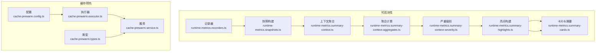
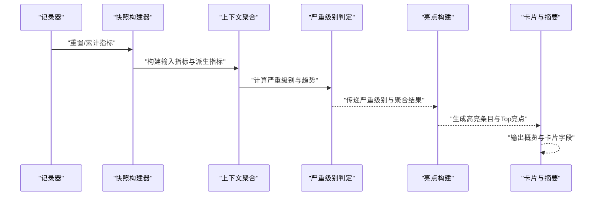
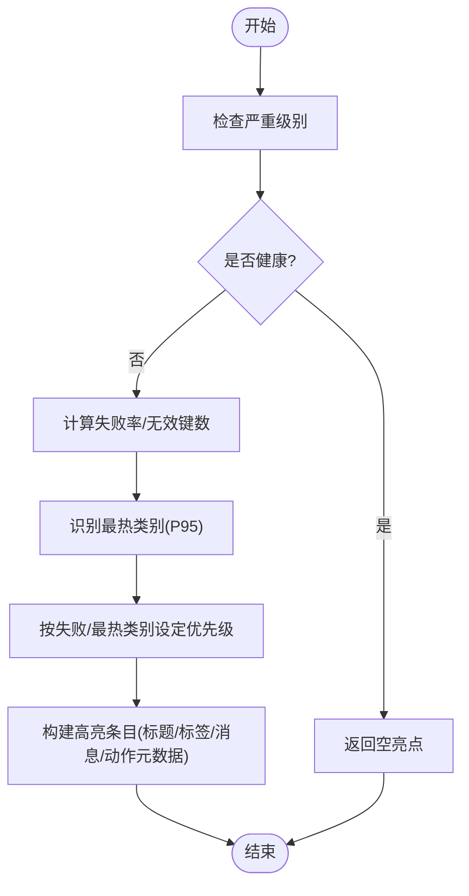
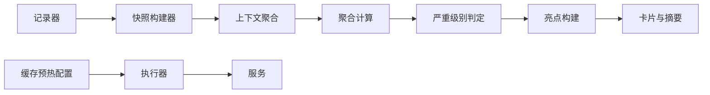

# 亮点追踪系统

<cite>
**本文引用的文件**
- [src/observability/runtime-metrics.summary-highlights.ts](file://src/observability/runtime-metrics.summary-highlights.ts)
- [src/observability/runtime-metrics.summary-highlights-cache-prewarm.ts](file://src/observability/runtime-metrics.summary-highlights-cache-prewarm.ts)
- [src/observability/runtime-metrics.summary-highlights-http.ts](file://src/observability/runtime-metrics.summary-highlights-http.ts)
- [src/observability/runtime-metrics.summary-highlights-process.ts](file://src/observability/runtime-metrics.summary-highlights-process.ts)
- [src/observability/runtime-metrics.summary-highlights-redis.ts](file://src/observability/runtime-metrics.summary-highlights-redis.ts)
- [src/observability/runtime-metrics.summary-highlights-sql.ts](file://src/observability/runtime-metrics.summary-highlights-sql.ts)
- [src/observability/runtime-metrics.summary-context-severity.ts](file://src/observability/runtime-metrics.summary-context-severity.ts)
- [src/observability/runtime-metrics.summary-context.ts](file://src/observability/runtime-metrics.summary-context.ts)
- [src/observability/runtime-metrics.summary.ts](file://src/observability/runtime-metrics.summary.ts)
- [src/observability/runtime-metrics.summary-cards.ts](file://src/observability/runtime-metrics.summary-cards.ts)
- [src/observability/runtime-metrics.summary-context-actions-cache-prewarm.ts](file://src/observability/runtime-metrics.summary-context-actions-cache-prewarm.ts)
- [src/observability/runtime-metrics.summary-context-actions-http.ts](file://src/observability/runtime-metrics.summary-context-actions-http.ts)
- [src/observability/runtime-metrics.summary-context-actions-process.ts](file://src/observability/runtime-metrics.summary-context-actions-process.ts)
- [src/observability/runtime-metrics.summary-context-actions-redis.ts](file://src/observability/runtime-metrics.summary-context-actions-redis.ts)
- [src/observability/runtime-metrics.summary-context-actions-sql.ts](file://src/observability/runtime-metrics.summary-context-actions-sql.ts)
- [src/observability/runtime-metrics.summary-context-actions-shared.ts](file://src/observability/runtime-metrics.summary-context-actions-shared.ts)
- [src/observability/runtime-metrics.summary-context-aggregates.ts](file://src/observability/runtime-metrics.summary-context-aggregates.ts)
- [src/observability/runtime-metrics.summary-context-cache-prewarm.ts](file://src/observability/runtime-metrics.summary-context-cache-prewarm.ts)
- [src/observability/runtime-metrics.summary-context.types.ts](file://src/observability/runtime-metrics.summary-context.types.ts)
- [src/observability/runtime-metrics.recorders.ts](file://src/observability/runtime-metrics.recorders.ts)
- [src/observability/runtime-metrics.snapshots.ts](file://src/observability/runtime-metrics.snapshots.ts)
- [src/observability/metrics-snapshot.protocol.ts](file://src/observability/metrics-snapshot.protocol.ts)
- [src/redis/cache-prewarm.service.ts](file://src/redis/cache-prewarm.service.ts)
- [src/redis/cache-prewarm.config.ts](file://src/redis/cache-prewarm.config.ts)
- [src/redis/cache-prewarm.executor.ts](file://src/redis/cache-prewarm.executor.ts)
- [src/redis/cache-prewarm.types.ts](file://src/redis/cache-prewarm.types.ts)
- [src/config/configuration.ts](file://src/config/configuration.ts)
</cite>

## 目录
1. [简介](#简介)
2. [项目结构](#项目结构)
3. [核心组件](#核心组件)
4. [架构总览](#架构总览)
5. [详细组件分析](#详细组件分析)
6. [依赖关系分析](#依赖关系分析)
7. [性能考量](#性能考量)
8. [故障排查指南](#故障排查指南)
9. [结论](#结论)
10. [附录](#附录)

## 简介
本文件为“亮点追踪系统”的技术文档，聚焦于以下能力：
- 亮点检测算法：基于运行时指标阈值与趋势的综合判定
- 缓存预热亮点分析：失败率、最慢类别、最近失败原因等
- HTTP 请求亮点监控：错误率、慢请求比例、最大耗时
- 进程亮点追踪：CPU 利用率、内存压力、RSS 阈值
- Redis 亮点分析：命中率、慢操作数量、最大耗时
- SQL 亮点检测：慢查询比例、慢查询样本、最大耗时
- 重要性评分与自动告警：严重级别映射、优先级计算、动作元数据
- 报告生成、趋势分析与性能对比：卡片化摘要、趋势标记、Top 亮点
- 异常行为识别与热点定位：按域聚合、按类别/命令聚合、最近样本
- 系统健康度评估：综合状态与趋势

## 项目结构
亮点追踪系统主要由“可观测性指标收集与汇总”和“缓存预热执行器”两部分构成：
- 观测层：记录器、快照构建、上下文聚合、严重级别判定、亮点构建、卡片与摘要输出
- 缓存预热层：配置、执行器、服务、类型定义

图表来源
- [src/observability/runtime-metrics.recorders.ts:1-35](file://src/observability/runtime-metrics.recorders.ts#L1-L35)
- [src/observability/runtime-metrics.snapshots.ts:103-136](file://src/observability/runtime-metrics.snapshots.ts#L103-L136)
- [src/observability/runtime-metrics.summary-context.ts](file://src/observability/runtime-metrics.summary-context.ts)
- [src/observability/runtime-metrics.summary-context-aggregates.ts](file://src/observability/runtime-metrics.summary-context-aggregates.ts)
- [src/observability/runtime-metrics.summary-context-severity.ts:47-128](file://src/observability/runtime-metrics.summary-context-severity.ts#L47-L128)
- [src/observability/runtime-metrics.summary-highlights.ts:10-20](file://src/observability/runtime-metrics.summary-highlights.ts#L10-L20)
- [src/observability/runtime-metrics.summary-cards.ts:313-341](file://src/observability/runtime-metrics.summary-cards.ts#L313-L341)
- [src/redis/cache-prewarm.config.ts](file://src/redis/cache-prewarm.config.ts)
- [src/redis/cache-prewarm.executor.ts](file://src/redis/cache-prewarm.executor.ts)
- [src/redis/cache-prewarm.service.ts](file://src/redis/cache-prewarm.service.ts)
- [src/redis/cache-prewarm.types.ts](file://src/redis/cache-prewarm.types.ts)

章节来源
- [src/observability/runtime-metrics.recorders.ts:1-35](file://src/observability/runtime-metrics.recorders.ts#L1-L35)
- [src/observability/runtime-metrics.snapshots.ts:103-136](file://src/observability/runtime-metrics.snapshots.ts#L103-L136)
- [src/observability/runtime-metrics.summary-context.ts](file://src/observability/runtime-metrics.summary-context.ts)
- [src/observability/runtime-metrics.summary-context-aggregates.ts](file://src/observability/runtime-metrics.summary-context-aggregates.ts)
- [src/observability/runtime-metrics.summary-context-severity.ts:47-128](file://src/observability/runtime-metrics.summary-context-severity.ts#L47-L128)
- [src/observability/runtime-metrics.summary-highlights.ts:10-20](file://src/observability/runtime-metrics.summary-highlights.ts#L10-L20)
- [src/observability/runtime-metrics.summary-cards.ts:313-341](file://src/observability/runtime-metrics.summary-cards.ts#L313-L341)
- [src/redis/cache-prewarm.config.ts](file://src/redis/cache-prewarm.config.ts)
- [src/redis/cache-prewarm.executor.ts](file://src/redis/cache-prewarm.executor.ts)
- [src/redis/cache-prewarm.service.ts](file://src/redis/cache-prewarm.service.ts)
- [src/redis/cache-prewarm.types.ts](file://src/redis/cache-prewarm.types.ts)

## 核心组件
- 运行时指标记录器：重置与累计 HTTP/SQL/Redis/进程指标，维护最近慢样本
- 快照构建器：从运行时状态计算平均/最大/命中率等派生指标，并保留最近慢样本
- 上下文聚合：将原始指标、聚合结果、严重级别、趋势打包为构建上下文
- 严重级别判定：基于阈值对各域（进程/HTTP/SQL/Redis/缓存预热）打分并确定综合状态
- 亮点构建：按域产出高亮条目，包含严重级别、优先级、标签、消息、动作元数据与观测时间
- 卡片与摘要：输出 Top 亮点、概览统计、各域卡片字段（如失败率、最大耗时、最近失败类别等）

章节来源
- [src/observability/runtime-metrics.recorders.ts:14-35](file://src/observability/runtime-metrics.recorders.ts#L14-L35)
- [src/observability/runtime-metrics.snapshots.ts:103-136](file://src/observability/runtime-metrics.snapshots.ts#L103-L136)
- [src/observability/runtime-metrics.summary-context.ts](file://src/observability/runtime-metrics.summary-context.ts)
- [src/observability/runtime-metrics.summary-context-severity.ts:47-128](file://src/observability/runtime-metrics.summary-context-severity.ts#L47-L128)
- [src/observability/runtime-metrics.summary-highlights.ts:10-20](file://src/observability/runtime-metrics.summary-highlights.ts#L10-L20)
- [src/observability/runtime-metrics.summary-cards.ts:313-341](file://src/observability/runtime-metrics.summary-cards.ts#L313-L341)

## 架构总览
亮点追踪系统采用“采集-聚合-判定-输出”的流水线式架构。数据流自记录器进入快照构建器，再进入上下文聚合与严重级别判定，最终由亮点构建器与卡片/摘要模块输出。

图表来源
- [src/observability/runtime-metrics.recorders.ts:14-35](file://src/observability/runtime-metrics.recorders.ts#L14-L35)
- [src/observability/runtime-metrics.snapshots.ts:103-136](file://src/observability/runtime-metrics.snapshots.ts#L103-L136)
- [src/observability/runtime-metrics.summary-context.ts](file://src/observability/runtime-metrics.summary-context.ts)
- [src/observability/runtime-metrics.summary-context-severity.ts:47-128](file://src/observability/runtime-metrics.summary-context-severity.ts#L47-L128)
- [src/observability/runtime-metrics.summary-highlights.ts:10-20](file://src/observability/runtime-metrics.summary-highlights.ts#L10-L20)
- [src/observability/runtime-metrics.summary-cards.ts:313-341](file://src/observability/runtime-metrics.summary-cards.ts#L313-L341)

## 详细组件分析

### 亮点检测算法与重要性评分
- 严重级别判定（阈值驱动）
  - 进程：CPU 利用率、内存压力、RSS 阈值
  - HTTP：错误率、慢请求比例、最大耗时
  - SQL：慢查询比例、最大耗时
  - Redis：命中率、慢操作数、最大耗时
  - 缓存预热：失败率、最近循环失败数、最慢类别 P95、慢周期阈值
- 重要性评分（优先级）
  - 各域根据严重级别与关键特征（如低命中率、慢操作数、慢查询比例）赋予不同优先级权重
  - 亮点标题、标签、消息与动作元数据随严重级别与特征动态生成
- 自动告警触发条件
  - 综合状态由各域严重级别决定；当任一域达到“警告/严重”，即触发相应告警
  - 动作元数据用于前端导航到对应诊断面板与标签页

章节来源
- [src/observability/runtime-metrics.summary-context-severity.ts:47-128](file://src/observability/runtime-metrics.summary-context-severity.ts#L47-L128)
- [src/observability/runtime-metrics.summary-highlights-process.ts](file://src/observability/runtime-metrics.summary-highlights-process.ts)
- [src/observability/runtime-metrics.summary-highlights-http.ts](file://src/observability/runtime-metrics.summary-highlights-http.ts)
- [src/observability/runtime-metrics.summary-highlights-sql.ts:1-36](file://src/observability/runtime-metrics.summary-highlights-sql.ts#L1-L36)
- [src/observability/runtime-metrics.summary-highlights-redis.ts:1-52](file://src/observability/runtime-metrics.summary-highlights-redis.ts#L1-L52)
- [src/observability/runtime-metrics.summary-highlights-cache-prewarm.ts](file://src/observability/runtime-metrics.summary-highlights-cache-prewarm.ts)

### 缓存预热亮点分析
- 关键指标
  - 总周期数、总键数、失败次数、无效键数、失败率百分比、平均/最大/最近一次耗时
  - 最热类别（按 P95 耗时）、最失败类别、最近失败类别、失败原因 Top-N
- 亮点生成
  - 失败率阈值、最近循环失败、最慢类别 P95 超阈值时产生高亮
  - 优先级依据失败情况与最慢类别 P95
  - 动作元数据引导至“失败样本”或“最近周期”面板
- 配置参数
  - 开关、周期间隔、初始延迟、批次大小、并发度、日志开关与采样频率、慢周期阈值

图表来源
- [src/observability/runtime-metrics.summary-highlights-cache-prewarm.ts](file://src/observability/runtime-metrics.summary-highlights-cache-prewarm.ts)
- [src/observability/runtime-metrics.summary-context-severity.ts:95-106](file://src/observability/runtime-metrics.summary-context-severity.ts#L95-L106)
- [src/redis/cache-prewarm.config.ts](file://src/redis/cache-prewarm.config.ts)
- [src/redis/cache-prewarm.service.ts](file://src/redis/cache-prewarm.service.ts)

章节来源
- [src/observability/runtime-metrics.summary-highlights-cache-prewarm.ts](file://src/observability/runtime-metrics.summary-highlights-cache-prewarm.ts)
- [src/observability/runtime-metrics.summary-context-severity.ts:95-106](file://src/observability/runtime-metrics.summary-context-severity.ts#L95-L106)
- [src/redis/cache-prewarm.config.ts](file://src/redis/cache-prewarm.config.ts)
- [src/redis/cache-prewarm.service.ts](file://src/redis/cache-prewarm.service.ts)

### HTTP 请求亮点监控
- 关键指标
  - 总请求数、错误请求数、平均/最大耗时、慢请求样本
- 亮点生成
  - 错误率、慢请求比例、最大耗时超过阈值时产生高亮
  - 优先级区分“严重/警告”
  - 动作元数据引导至“慢请求/错误详情”面板
- 阈值
  - 错误率、慢请求比例、最大耗时阈值在严重级别判定中使用

章节来源
- [src/observability/runtime-metrics.summary-highlights-http.ts](file://src/observability/runtime-metrics.summary-highlights-http.ts)
- [src/observability/runtime-metrics.summary-context-severity.ts:61-73](file://src/observability/runtime-metrics.summary-context-severity.ts#L61-L73)

### 进程亮点追踪
- 关键指标
  - CPU 利用率、内存压力、RSS（MB）
- 亮点生成
  - CPU/内存/RSS 超过阈值时产生高亮
  - 优先级区分“严重/警告”

章节来源
- [src/observability/runtime-metrics.summary-highlights-process.ts](file://src/observability/runtime-metrics.summary-highlights-process.ts)
- [src/observability/runtime-metrics.summary-context-severity.ts:47-59](file://src/observability/runtime-metrics.summary-context-severity.ts#L47-L59)

### Redis 亮点分析
- 关键指标
  - 总调用数、平均/最大耗时、命令维度统计、最近慢操作样本
  - 命中率（按命令维度与总体）
- 亮点生成
  - 总体命中率低于阈值或慢操作数较多时产生高亮
  - 低命中率与慢操作分别设置不同优先级与动作元数据
- 阈值
  - 命中率阈值、慢操作数阈值、最大耗时阈值

章节来源
- [src/observability/runtime-metrics.summary-highlights-redis.ts:1-52](file://src/observability/runtime-metrics.summary-highlights-redis.ts#L1-L52)
- [src/observability/runtime-metrics.summary-context-severity.ts:81-93](file://src/observability/runtime-metrics.summary-context-severity.ts#L81-L93)
- [src/observability/runtime-metrics.snapshots.ts:103-131](file://src/observability/runtime-metrics.snapshots.ts#L103-L131)

### SQL 亮点检测
- 关键指标
  - 总查询数、慢查询数、平均/最大耗时、最近慢查询样本
- 亮点生成
  - 慢查询比例或最大耗时超过阈值时产生高亮
  - 优先级区分“严重/警告”
- 阈值
  - 慢查询比例、最大耗时阈值

章节来源
- [src/observability/runtime-metrics.summary-highlights-sql.ts:1-36](file://src/observability/runtime-metrics.summary-highlights-sql.ts#L1-L36)
- [src/observability/runtime-metrics.summary-context-severity.ts:75-79](file://src/observability/runtime-metrics.summary-context-severity.ts#L75-L79)

### 报告生成、趋势分析与性能对比
- 报告生成
  - 概览字段：运行时、总请求数、总查询数、Redis 调用数、缓存预热周期数
  - 各域卡片字段：失败率、最大/平均耗时、最近观测时间、最热/最失败类别等
- 趋势分析
  - 基于严重级别映射生成趋势标记（上升/下降/稳定）
- 性能对比
  - 通过卡片字段中的最大/平均耗时进行跨域对比

章节来源
- [src/observability/runtime-metrics.summary-cards.ts:289-341](file://src/observability/runtime-metrics.summary-cards.ts#L289-L341)
- [src/observability/runtime-metrics.summary-context-severity.ts:115-121](file://src/observability/runtime-metrics.summary-context-severity.ts#L115-L121)

### 异常行为识别与热点问题定位
- 异常识别
  - 以阈值为基准的异常检测（错误率、慢请求比例、慢查询比例、命中率、慢操作数、最大耗时）
- 热点定位
  - 按域聚合：进程/HTTP/SQL/Redis/缓存预热
  - 按类别/命令聚合：缓存预热类别、Redis 命令
  - 最近样本：慢请求、慢查询、慢操作、失败样本

章节来源
- [src/observability/runtime-metrics.summary-context-aggregates.ts](file://src/observability/runtime-metrics.summary-context-aggregates.ts)
- [src/observability/runtime-metrics.summary-context-cache-prewarm.ts](file://src/observability/runtime-metrics.summary-context-cache-prewarm.ts)
- [src/observability/runtime-metrics.summary-context-actions-cache-prewarm.ts](file://src/observability/runtime-metrics.summary-context-actions-cache-prewarm.ts)
- [src/observability/runtime-metrics.summary-context-actions-redis.ts](file://src/observability/runtime-metrics.summary-context-actions-redis.ts)
- [src/observability/runtime-metrics.summary-context-actions-http.ts](file://src/observability/runtime-metrics.summary-context-actions-http.ts)
- [src/observability/runtime-metrics.summary-context-actions-process.ts](file://src/observability/runtime-metrics.summary-context-actions-process.ts)
- [src/observability/runtime-metrics.summary-context-actions-sql.ts](file://src/observability/runtime-metrics.summary-context-actions-sql.ts)
- [src/observability/metrics-snapshot.protocol.ts:57-112](file://src/observability/metrics-snapshot.protocol.ts#L57-L112)

## 依赖关系分析
- 组件耦合
  - 亮点构建器依赖上下文聚合结果与严重级别
  - 卡片与摘要依赖亮点排序后的 Top N
  - 缓存预热服务依赖配置与执行器
- 外部集成
  - Redis 命令维度统计与慢操作样本
  - SQL 操作维度统计与慢查询样本
- 可能的循环依赖
  - 当前模块间通过函数导出与协议类型解耦，未见直接循环导入

图表来源
- [src/observability/runtime-metrics.recorders.ts:14-35](file://src/observability/runtime-metrics.recorders.ts#L14-L35)
- [src/observability/runtime-metrics.snapshots.ts:103-136](file://src/observability/runtime-metrics.snapshots.ts#L103-L136)
- [src/observability/runtime-metrics.summary-context.ts](file://src/observability/runtime-metrics.summary-context.ts)
- [src/observability/runtime-metrics.summary-context-aggregates.ts](file://src/observability/runtime-metrics.summary-context-aggregates.ts)
- [src/observability/runtime-metrics.summary-context-severity.ts:47-128](file://src/observability/runtime-metrics.summary-context-severity.ts#L47-L128)
- [src/observability/runtime-metrics.summary-highlights.ts:10-20](file://src/observability/runtime-metrics.summary-highlights.ts#L10-L20)
- [src/observability/runtime-metrics.summary-cards.ts:313-341](file://src/observability/runtime-metrics.summary-cards.ts#L313-L341)
- [src/redis/cache-prewarm.config.ts](file://src/redis/cache-prewarm.config.ts)
- [src/redis/cache-prewarm.executor.ts](file://src/redis/cache-prewarm.executor.ts)
- [src/redis/cache-prewarm.service.ts](file://src/redis/cache-prewarm.service.ts)

章节来源
- [src/observability/runtime-metrics.summary-highlights.ts:10-20](file://src/observability/runtime-metrics.summary-highlights.ts#L10-L20)
- [src/redis/cache-prewarm.service.ts](file://src/redis/cache-prewarm.service.ts)

## 性能考量
- 指标计算复杂度
  - 快照构建对命令/操作维度做排序与派生指标计算，整体为 O(n log n)，n 为命令/操作种类数
- 内存占用
  - 最近慢样本数组与命令/操作维度映射需限制条目数量，避免内存膨胀
- 并发与批处理
  - 缓存预热支持并发与批次控制，有助于降低单次峰值负载
- 日志与采样
  - 慢 Redis 日志与缓存预热日志可按采样频率输出，平衡可观测性与性能

## 故障排查指南
- 通用步骤
  - 查看综合状态与严重级别，定位最高风险域
  - 根据动作元数据跳转到对应面板（慢请求/慢查询/慢操作/失败样本/最近周期）
  - 结合卡片字段（失败率、最大耗时、最热类别）进行根因分析
- 具体检索路径
  - HTTP：错误率与慢请求比例、最大耗时
  - SQL：慢查询比例、最大耗时、最近慢查询
  - Redis：命中率、慢操作数、最近慢操作、命令维度
  - 缓存预热：失败率、无效键数、最热类别、失败原因 Top-N
  - 进程：CPU 利用率、内存压力、RSS

章节来源
- [src/observability/runtime-metrics.summary-context-actions-shared.ts](file://src/observability/runtime-metrics.summary-context-actions-shared.ts)
- [src/observability/runtime-metrics.summary-context-actions-http.ts](file://src/observability/runtime-metrics.summary-context-actions-http.ts)
- [src/observability/runtime-metrics.summary-context-actions-sql.ts](file://src/observability/runtime-metrics.summary-context-actions-sql.ts)
- [src/observability/runtime-metrics.summary-context-actions-redis.ts](file://src/observability/runtime-metrics.summary-context-actions-redis.ts)
- [src/observability/runtime-metrics.summary-context-actions-cache-prewarm.ts](file://src/observability/runtime-metrics.summary-context-actions-cache-prewarm.ts)
- [src/observability/runtime-metrics.summary-context-actions-process.ts](file://src/observability/runtime-metrics.summary-context-actions-process.ts)

## 结论
亮点追踪系统通过阈值驱动的严重级别判定与优先级评分，实现了对进程、HTTP、SQL、Redis 与缓存预热的全栈监控。结合卡片化摘要与动作元数据，系统能够快速定位热点与异常，并提供可操作的诊断路径。建议在生产环境中合理设置阈值与采样策略，持续优化告警精度与响应效率。

## 附录

### 配置参数与检测阈值
- SQL
  - 慢查询阈值（毫秒）
- Redis
  - 慢 Redis 日志开关
  - 慢 Redis 阈值（毫秒）
- 缓存预热
  - 开关、周期间隔、初始延迟、批次大小、并发度、日志开关、采样频率、慢周期阈值（毫秒）
- 其他
  - 默认/最大分页大小

章节来源
- [src/config/configuration.ts:47-87](file://src/config/configuration.ts#L47-L87)

### 数据模型与快照协议要点
- SQL 快照：总查询数、平均/最大耗时、慢查询数、按操作维度统计、最近慢查询样本
- Redis 快照：总调用数、平均/最大耗时、命令维度统计、最近慢操作样本
- 缓存预热快照：周期耗时分布、慢键样本（类别、键、耗时、状态、失败原因）

章节来源
- [src/observability/metrics-snapshot.protocol.ts:57-112](file://src/observability/metrics-snapshot.protocol.ts#L57-L112)