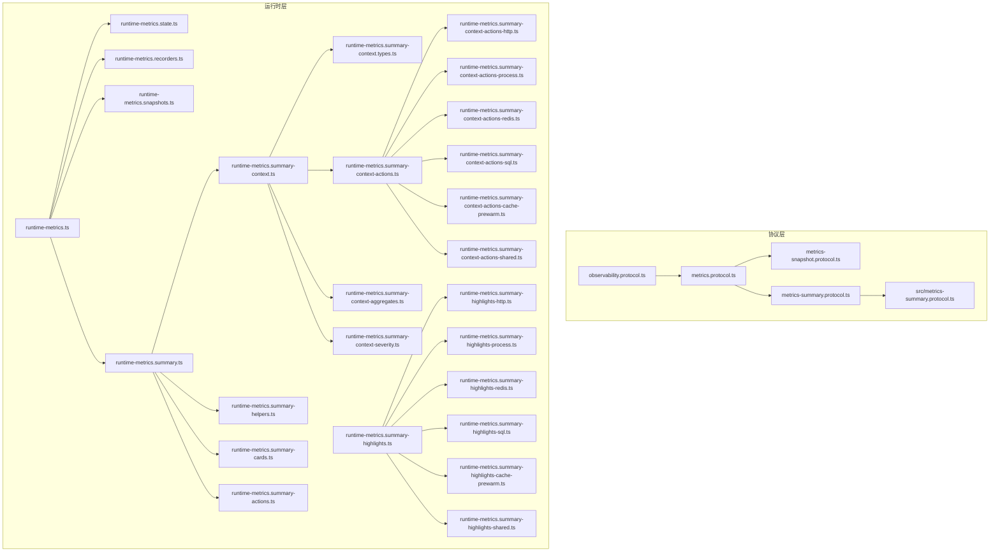
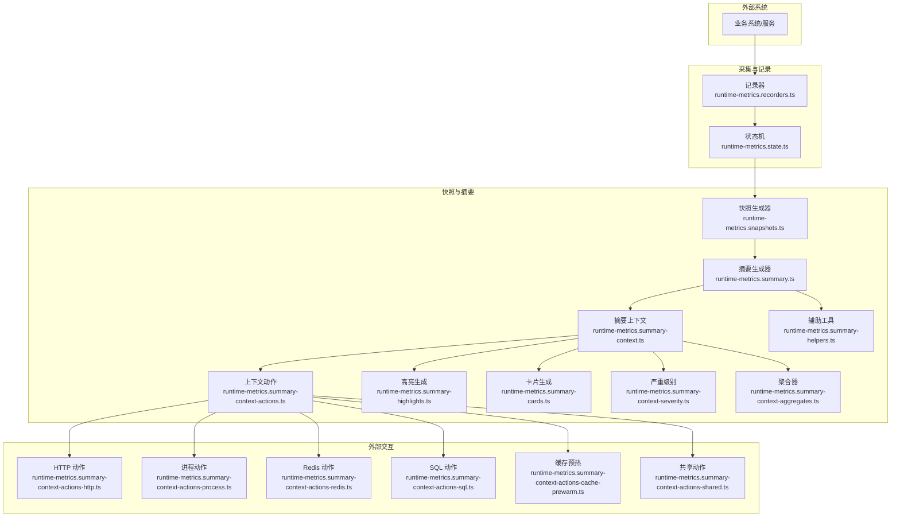
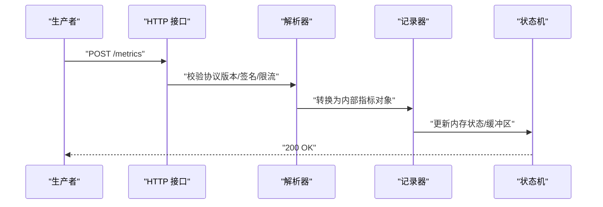
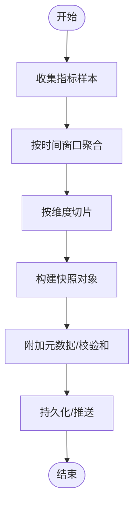
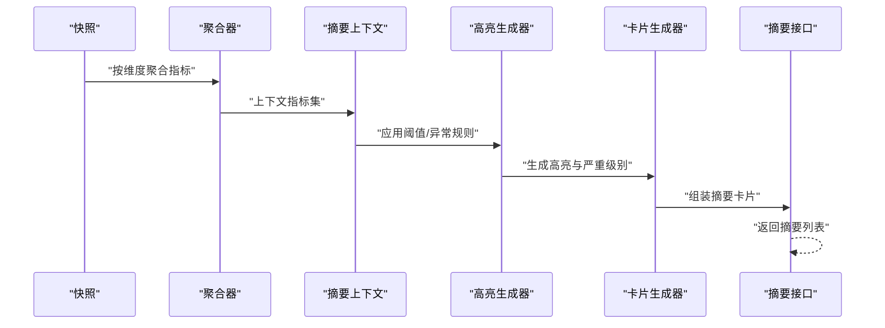
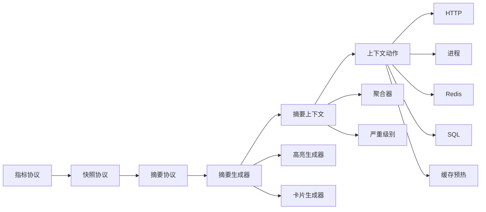

# 可观测性协议

<cite>
**本文引用的文件**
- [src/observability/index.ts](file://src/observability/index.ts)
- [src/observability/observability.protocol.ts](file://src/observability/observability.protocol.ts)
- [src/observability/metrics.protocol.ts](file://src/observability/metrics.protocol.ts)
- [src/observability/metrics-snapshot.protocol.ts](file://src/observability/metrics-snapshot.protocol.ts)
- [src/observability/metrics-summary.protocol.ts](file://src/observability/metrics-summary.protocol.ts)
- [src/observability/runtime-metrics.ts](file://src/observability/runtime-metrics.ts)
- [src/observability/runtime-metrics.state.ts](file://src/observability/runtime-metrics.state.ts)
- [src/observability/runtime-metrics.recorders.ts](file://src/observability/runtime-metrics.recorders.ts)
- [src/observability/runtime-metrics.snapshots.ts](file://src/observability/runtime-metrics.snapshots.ts)
- [src/observability/runtime-metrics.summary.ts](file://src/observability/runtime-metrics.summary.ts)
- [src/observability/runtime-metrics.summary-context.ts](file://src/observability/runtime-metrics.summary-context.ts)
- [src/observability/runtime-metrics.summary-context.types.ts](file://src/observability/runtime-metrics.summary-context.types.ts)
- [src/observability/runtime-metrics.summary-context-actions.ts](file://src/observability/runtime-metrics.summary-context-actions.ts)
- [src/observability/runtime-metrics.summary-context-actions-http.ts](file://src/observability/runtime-metrics.summary-context-actions-http.ts)
- [src/observability/runtime-metrics.summary-context-actions-process.ts](file://src/observability/runtime-metrics.summary-context-actions-process.ts)
- [src/observability/runtime-metrics.summary-context-actions-redis.ts](file://src/observability/runtime-metrics.summary-context-actions-redis.ts)
- [src/observability/runtime-metrics.summary-context-actions-sql.ts](file://src/observability/runtime-metrics.summary-context-actions-sql.ts)
- [src/observability/runtime-metrics.summary-context-actions-cache-prewarm.ts](file://src/observability/runtime-metrics.summary-context-actions-cache-prewarm.ts)
- [src/observability/runtime-metrics.summary-context-actions-shared.ts](file://src/observability/runtime-metrics.summary-context-actions-shared.ts)
- [src/observability/runtime-metrics.summary-context-aggregates.ts](file://src/observability/runtime-metrics.summary-context-aggregates.ts)
- [src/observability/runtime-metrics.summary-context-severity.ts](file://src/observability/runtime-metrics.summary-context-severity.ts)
- [src/observability/runtime-metrics.summary-helpers.ts](file://src/observability/runtime-metrics.summary-helpers.ts)
- [src/observability/runtime-metrics.summary-highlights.ts](file://src/observability/runtime-metrics.summary-highlights.ts)
- [src/observability/runtime-metrics.summary-highlights-http.ts](file://src/observability/runtime-metrics.summary-highlights-http.ts)
- [src/observability/runtime-metrics.summary-highlights-process.ts](file://src/observability/runtime-metrics.summary-highlights-process.ts)
- [src/observability/runtime-metrics.summary-highlights-redis.ts](file://src/observability/runtime-metrics.summary-highlights-redis.ts)
- [src/observability/runtime-metrics.summary-highlights-sql.ts](file://src/observability/runtime-metrics.summary-highlights-sql.ts)
- [src/observability/runtime-metrics.summary-highlights-cache-prewarm.ts](file://src/observability/runtime-metrics.summary-highlights-cache-prewarm.ts)
- [src/observability/runtime-metrics.summary-highlights-shared.ts](file://src/observability/runtime-metrics.summary-highlights-shared.ts)
- [src/observability/runtime-metrics.summary-cards.ts](file://src/observability/runtime-metrics.summary-cards.ts)
- [src/observability/runtime-metrics.summary-actions.ts](file://src/observability/runtime-metrics.summary-actions.ts)
- [src/metrics-summary.protocol.ts](file://src/metrics-summary.protocol.ts)
</cite>

## 目录
1. [引言](#引言)
2. [项目结构](#项目结构)
3. [核心组件](#核心组件)
4. [架构总览](#架构总览)
5. [详细组件分析](#详细组件分析)
6. [依赖关系分析](#依赖关系分析)
7. [性能考量](#性能考量)
8. [故障排查指南](#故障排查指南)
9. [结论](#结论)
10. [附录](#附录)

## 引言
本文件系统化梳理并阐述本仓库中的可观测性协议与运行时实现，覆盖指标协议、快照协议与摘要协议的定义规范、数据格式标准与通信接口设计；解释协议版本管理、向后兼容性与升级策略；提供使用示例、错误处理机制与调试建议；并总结跨系统集成、数据标准化与协议扩展的最佳实践。

## 项目结构
可观测性相关代码集中于 src/observability 目录，采用“协议定义 + 运行时实现”的分层组织方式：
- 协议层：定义指标、快照、摘要的数据模型与传输格式（如 observability.protocol.ts、metrics.protocol.ts、metrics-snapshot.protocol.ts、metrics-summary.protocol.ts）。
- 运行时层：围绕协议进行采集、聚合、缓存预热、HTTP/Redis/SQL 等上下文动作执行，以及摘要卡片与高亮生成等业务逻辑（如 runtime-metrics.*.ts 系列文件）。
- 入口与导出：通过 index.ts 汇总导出，便于上层模块按需引入。

图表来源
- [src/observability/index.ts](file://src/observability/index.ts)
- [src/observability/observability.protocol.ts](file://src/observability/observability.protocol.ts)
- [src/observability/metrics.protocol.ts](file://src/observability/metrics.protocol.ts)
- [src/observability/metrics-snapshot.protocol.ts](file://src/observability/metrics-snapshot.protocol.ts)
- [src/observability/metrics-summary.protocol.ts](file://src/observability/metrics-summary.protocol.ts)
- [src/observability/runtime-metrics.ts](file://src/observability/runtime-metrics.ts)
- [src/observability/runtime-metrics.summary.ts](file://src/observability/runtime-metrics.summary.ts)
- [src/observability/runtime-metrics.summary-context.ts](file://src/observability/runtime-metrics.summary-context.ts)
- [src/observability/runtime-metrics.summary-context-actions.ts](file://src/observability/runtime-metrics.summary-context-actions.ts)
- [src/observability/runtime-metrics.summary-context-actions-http.ts](file://src/observability/runtime-metrics.summary-context-actions-http.ts)
- [src/observability/runtime-metrics.summary-context-actions-process.ts](file://src/observability/runtime-metrics.summary-context-actions-process.ts)
- [src/observability/runtime-metrics.summary-context-actions-redis.ts](file://src/observability/runtime-metrics.summary-context-actions-redis.ts)
- [src/observability/runtime-metrics.summary-context-actions-sql.ts](file://src/observability/runtime-metrics.summary-context-actions-sql.ts)
- [src/observability/runtime-metrics.summary-context-actions-cache-prewarm.ts](file://src/observability/runtime-metrics.summary-context-actions-cache-prewarm.ts)
- [src/observability/runtime-metrics.summary-context-actions-shared.ts](file://src/observability/runtime-metrics.summary-context-actions-shared.ts)
- [src/observability/runtime-metrics.summary-context-aggregates.ts](file://src/observability/runtime-metrics.summary-context-aggregates.ts)
- [src/observability/runtime-metrics.summary-context-severity.ts](file://src/observability/runtime-metrics.summary-context-severity.ts)
- [src/observability/runtime-metrics.summary-helpers.ts](file://src/observability/runtime-metrics.summary-helpers.ts)
- [src/observability/runtime-metrics.summary-highlights.ts](file://src/observability/runtime-metrics.summary-highlights.ts)
- [src/observability/runtime-metrics.summary-highlights-http.ts](file://src/observability/runtime-metrics.summary-highlights-http.ts)
- [src/observability/runtime-metrics.summary-highlights-process.ts](file://src/observability/runtime-metrics.summary-highlights-process.ts)
- [src/observability/runtime-metrics.summary-highlights-redis.ts](file://src/observability/runtime-metrics.summary-highlights-redis.ts)
- [src/observability/runtime-metrics.summary-highlights-sql.ts](file://src/observability/runtime-metrics.summary-highlights-sql.ts)
- [src/observability/runtime-metrics.summary-highlights-cache-prewarm.ts](file://src/observability/runtime-metrics.summary-highlights-cache-prewarm.ts)
- [src/observability/runtime-metrics.summary-highlights-shared.ts](file://src/observability/runtime-metrics.summary-highlights-shared.ts)
- [src/observability/runtime-metrics.summary-cards.ts](file://src/observability/runtime-metrics.summary-cards.ts)
- [src/observability/runtime-metrics.summary-actions.ts](file://src/observability/runtime-metrics.summary-actions.ts)
- [src/metrics-summary.protocol.ts](file://src/metrics-summary.protocol.ts)

章节来源
- [src/observability/index.ts](file://src/observability/index.ts)
- [src/observability/observability.protocol.ts](file://src/observability/observability.protocol.ts)
- [src/observability/metrics.protocol.ts](file://src/observability/metrics.protocol.ts)
- [src/observability/metrics-snapshot.protocol.ts](file://src/observability/metrics-snapshot.protocol.ts)
- [src/observability/metrics-summary.protocol.ts](file://src/observability/metrics-summary.protocol.ts)
- [src/metrics-summary.protocol.ts](file://src/metrics-summary.protocol.ts)

## 核心组件
- 协议定义层
  - 观测性协议总纲：定义通用的观测数据结构、版本字段与序列化约定，作为上层指标/快照/摘要协议的基础契约。
  - 指标协议：定义指标项的命名空间、标签键值对、数值类型、时间戳与采样策略等。
  - 快照协议：定义快照对象的结构、快照粒度、聚合维度与持久化要求。
  - 摘要协议：定义摘要卡片、高亮、严重级别与上下文聚合的结构与生成规则。
- 运行时实现层
  - 指标采集器与记录器：负责从系统各处采集指标，写入内存状态或缓冲区。
  - 快照生成器：基于采集到的指标生成快照，并按策略落盘或推送。
  - 摘要生成器：在上下文中聚合指标，生成摘要卡片、高亮与严重级别。
  - 上下文动作执行器：封装 HTTP、进程、Redis、SQL 等外部交互的统一抽象，支持可插拔扩展。
  - 缓存预热器：在摘要生成前预热缓存，降低首次访问延迟。
  - 辅助工具：提供摘要生成的通用辅助函数与类型约束。

章节来源
- [src/observability/observability.protocol.ts](file://src/observability/observability.protocol.ts)
- [src/observability/metrics.protocol.ts](file://src/observability/metrics.protocol.ts)
- [src/observability/metrics-snapshot.protocol.ts](file://src/observability/metrics-snapshot.protocol.ts)
- [src/observability/metrics-summary.protocol.ts](file://src/observability/metrics-summary.protocol.ts)
- [src/observability/runtime-metrics.recorders.ts](file://src/observability/runtime-metrics.recorders.ts)
- [src/observability/runtime-metrics.snapshots.ts](file://src/observability/runtime-metrics.snapshots.ts)
- [src/observability/runtime-metrics.summary.ts](file://src/observability/runtime-metrics.summary.ts)
- [src/observability/runtime-metrics.summary-context.ts](file://src/observability/runtime-metrics.summary-context.ts)
- [src/observability/runtime-metrics.summary-context-actions.ts](file://src/observability/runtime-metrics.summary-context-actions.ts)
- [src/observability/runtime-metrics.summary-context-actions-http.ts](file://src/observability/runtime-metrics.summary-context-actions-http.ts)
- [src/observability/runtime-metrics.summary-context-actions-process.ts](file://src/observability/runtime-metrics.summary-context-actions-process.ts)
- [src/observability/runtime-metrics.summary-context-actions-redis.ts](file://src/observability/runtime-metrics.summary-context-actions-redis.ts)
- [src/observability/runtime-metrics.summary-context-actions-sql.ts](file://src/observability/runtime-metrics.summary-context-actions-sql.ts)
- [src/observability/runtime-metrics.summary-context-actions-cache-prewarm.ts](file://src/observability/runtime-metrics.summary-context-actions-cache-prewarm.ts)
- [src/observability/runtime-metrics.summary-context-actions-shared.ts](file://src/observability/runtime-metrics.summary-context-actions-shared.ts)
- [src/observability/runtime-metrics.summary-context-aggregates.ts](file://src/observability/runtime-metrics.summary-context-aggregates.ts)
- [src/observability/runtime-metrics.summary-context-severity.ts](file://src/observability/runtime-metrics.summary-context-severity.ts)
- [src/observability/runtime-metrics.summary-helpers.ts](file://src/observability/runtime-metrics.summary-helpers.ts)
- [src/observability/runtime-metrics.summary-highlights.ts](file://src/observability/runtime-metrics.summary-highlights.ts)
- [src/observability/runtime-metrics.summary-highlights-http.ts](file://src/observability/runtime-metrics.summary-highlights-http.ts)
- [src/observability/runtime-metrics.summary-highlights-process.ts](file://src/observability/runtime-metrics.summary-highlights-process.ts)
- [src/observability/runtime-metrics.summary-highlights-redis.ts](file://src/observability/runtime-metrics.summary-highlights-redis.ts)
- [src/observability/runtime-metrics.summary-highlights-sql.ts](file://src/observability/runtime-metrics.summary-highlights-sql.ts)
- [src/observability/runtime-metrics.summary-highlights-cache-prewarm.ts](file://src/observability/runtime-metrics.summary-highlights-cache-prewarm.ts)
- [src/observability/runtime-metrics.summary-highlights-shared.ts](file://src/observability/runtime-metrics.summary-highlights-shared.ts)
- [src/observability/runtime-metrics.summary-cards.ts](file://src/observability/runtime-metrics.summary-cards.ts)
- [src/observability/runtime-metrics.summary-actions.ts](file://src/observability/runtime-metrics.summary-actions.ts)

## 架构总览
可观测性协议与运行时的整体交互如下：

图表来源
- [src/observability/runtime-metrics.recorders.ts](file://src/observability/runtime-metrics.recorders.ts)
- [src/observability/runtime-metrics.state.ts](file://src/observability/runtime-metrics.state.ts)
- [src/observability/runtime-metrics.snapshots.ts](file://src/observability/runtime-metrics.snapshots.ts)
- [src/observability/runtime-metrics.summary.ts](file://src/observability/runtime-metrics.summary.ts)
- [src/observability/runtime-metrics.summary-context.ts](file://src/observability/runtime-metrics.summary-context.ts)
- [src/observability/runtime-metrics.summary-context-actions.ts](file://src/observability/runtime-metrics.summary-context-actions.ts)
- [src/observability/runtime-metrics.summary-context-actions-http.ts](file://src/observability/runtime-metrics.summary-context-actions-http.ts)
- [src/observability/runtime-metrics.summary-context-actions-process.ts](file://src/observability/runtime-metrics.summary-context-actions-process.ts)
- [src/observability/runtime-metrics.summary-context-actions-redis.ts](file://src/observability/runtime-metrics.summary-context-actions-redis.ts)
- [src/observability/runtime-metrics.summary-context-actions-sql.ts](file://src/observability/runtime-metrics.summary-context-actions-sql.ts)
- [src/observability/runtime-metrics.summary-context-actions-cache-prewarm.ts](file://src/observability/runtime-metrics.summary-context-actions-cache-prewarm.ts)
- [src/observability/runtime-metrics.summary-context-actions-shared.ts](file://src/observability/runtime-metrics.summary-context-actions-shared.ts)
- [src/observability/runtime-metrics.summary-context-aggregates.ts](file://src/observability/runtime-metrics.summary-context-aggregates.ts)
- [src/observability/runtime-metrics.summary-context-severity.ts](file://src/observability/runtime-metrics.summary-context-severity.ts)
- [src/observability/runtime-metrics.summary-helpers.ts](file://src/observability/runtime-metrics.summary-helpers.ts)
- [src/observability/runtime-metrics.summary-highlights.ts](file://src/observability/runtime-metrics.summary-highlights.ts)
- [src/observability/runtime-metrics.summary-cards.ts](file://src/observability/runtime-metrics.summary-cards.ts)

## 详细组件分析

### 指标协议（Metrics Protocol）
- 数据模型与字段
  - 指标名称与命名空间：用于唯一标识指标类别与来源。
  - 标签键值对：用于多维过滤与聚合，键名需标准化，值需限定类型与长度。
  - 数值类型与精度：整数/浮点数，保留必要的小数位以平衡精度与存储。
  - 时间戳：统一采用 UTC 时间，支持毫秒/秒级粒度。
  - 采样与批处理：支持批量上报，减少网络开销。
- 序列化与反序列化
  - JSON 或二进制格式，遵循协议版本号字段，确保向前兼容。
- 通信接口
  - HTTP 接口：POST /metrics，请求体为指标数组，响应 200 表示成功。
  - 内部通道：事件总线或队列，供内部模块消费与转发。

图表来源
- [src/observability/metrics.protocol.ts](file://src/observability/metrics.protocol.ts)
- [src/observability/runtime-metrics.recorders.ts](file://src/observability/runtime-metrics.recorders.ts)
- [src/observability/runtime-metrics.state.ts](file://src/observability/runtime-metrics.state.ts)

章节来源
- [src/observability/metrics.protocol.ts](file://src/observability/metrics.protocol.ts)
- [src/observability/runtime-metrics.recorders.ts](file://src/observability/runtime-metrics.recorders.ts)
- [src/observability/runtime-metrics.state.ts](file://src/observability/runtime-metrics.state.ts)

### 快照协议（Snapshot Protocol）
- 数据模型与字段
  - 快照标识：唯一 ID，便于关联与回溯。
  - 聚合维度：按时间窗口、业务域、标签组合进行聚合。
  - 指标集合：包含多个指标的聚合结果（均值、最大值、最小值、总数等）。
  - 元数据：包含生成时间、版本、来源、校验和等。
- 生成流程
  - 基于指标协议的采样结果，按配置的时间窗口与维度生成快照。
  - 支持增量快照与全量快照两种模式。
- 存储与传输
  - 存储：本地磁盘或对象存储，支持压缩与分片。
  - 传输：内部 RPC 或消息队列，带重试与幂等保证。

图表来源
- [src/observability/metrics-snapshot.protocol.ts](file://src/observability/metrics-snapshot.protocol.ts)
- [src/observability/runtime-metrics.snapshots.ts](file://src/observability/runtime-metrics.snapshots.ts)

章节来源
- [src/observability/metrics-snapshot.protocol.ts](file://src/observability/metrics-snapshot.protocol.ts)
- [src/observability/runtime-metrics.snapshots.ts](file://src/observability/runtime-metrics.snapshots.ts)

### 摘要协议（Summary Protocol）
- 数据模型与字段
  - 摘要卡片：包含标题、描述、数值、趋势、阈值与状态。
  - 高亮：基于阈值或异常检测触发的告警提示。
  - 严重级别：低/中/高/致命，用于排序与通知策略。
  - 上下文聚合：按业务域、门店、时段等维度聚合指标。
- 生成流程
  - 从快照中抽取关键指标，计算趋势与对比。
  - 应用阈值规则与异常检测算法，生成高亮与严重级别。
  - 组装为卡片列表，支持分页与筛选。
- 通信接口
  - HTTP 接口：GET /summaries，查询参数包括时间范围、维度、严重级别等。
  - 实时推送：WebSocket 或 Server-Sent Events，用于仪表盘实时刷新。

图表来源
- [src/observability/metrics-summary.protocol.ts](file://src/observability/metrics-summary.protocol.ts)
- [src/observability/runtime-metrics.summary.ts](file://src/observability/runtime-metrics.summary.ts)
- [src/observability/runtime-metrics.summary-context.ts](file://src/observability/runtime-metrics.summary-context.ts)
- [src/observability/runtime-metrics.summary-context-aggregates.ts](file://src/observability/runtime-metrics.summary-context-aggregates.ts)
- [src/observability/runtime-metrics.summary-context-severity.ts](file://src/observability/runtime-metrics.summary-context-severity.ts)
- [src/observability/runtime-metrics.summary-helpers.ts](file://src/observability/runtime-metrics.summary-helpers.ts)
- [src/observability/runtime-metrics.summary-highlights.ts](file://src/observability/runtime-metrics.summary-highlights.ts)
- [src/observability/runtime-metrics.summary-cards.ts](file://src/observability/runtime-metrics.summary-cards.ts)

章节来源
- [src/observability/metrics-summary.protocol.ts](file://src/observability/metrics-summary.protocol.ts)
- [src/observability/runtime-metrics.summary.ts](file://src/observability/runtime-metrics.summary.ts)
- [src/observability/runtime-metrics.summary-context.ts](file://src/observability/runtime-metrics.summary-context.ts)
- [src/observability/runtime-metrics.summary-context-aggregates.ts](file://src/observability/runtime-metrics.summary-context-aggregates.ts)
- [src/observability/runtime-metrics.summary-context-severity.ts](file://src/observability/runtime-metrics.summary-context-severity.ts)
- [src/observability/runtime-metrics.summary-helpers.ts](file://src/observability/runtime-metrics.summary-helpers.ts)
- [src/observability/runtime-metrics.summary-highlights.ts](file://src/observability/runtime-metrics.summary-highlights.ts)
- [src/observability/runtime-metrics.summary-cards.ts](file://src/observability/runtime-metrics.summary-cards.ts)

### 协议版本管理、向后兼容与升级策略
- 版本字段
  - 在协议头中加入版本号字段，支持主/次/修订号。
- 向后兼容
  - 新增字段默认可选，旧客户端忽略未知字段。
  - 删除字段仅标记废弃，保留一段时间再移除。
- 升级策略
  - 渐进式发布：先在灰度环境启用新版本，观察指标与日志后再全量切换。
  - 回滚预案：新版本异常时快速回退到上一个稳定版本。
  - 兼容层：提供协议转换器，自动将旧格式映射到新格式。

章节来源
- [src/observability/observability.protocol.ts](file://src/observability/observability.protocol.ts)
- [src/observability/metrics.protocol.ts](file://src/observability/metrics.protocol.ts)
- [src/observability/metrics-snapshot.protocol.ts](file://src/observability/metrics-snapshot.protocol.ts)
- [src/observability/metrics-summary.protocol.ts](file://src/observability/metrics-summary.protocol.ts)

### 使用示例（路径指引）
- 指标上报
  - HTTP 接口：POST /metrics，请求体为指标数组，参考 [指标协议](file://src/observability/metrics.protocol.ts) 的字段定义与 [记录器](file://src/observability/runtime-metrics.recorders.ts) 的实现。
- 快照生成
  - 通过 [快照生成器](file://src/observability/runtime-metrics.snapshots.ts) 读取指标样本并生成快照对象，参考 [快照协议](file://src/observability/metrics-snapshot.protocol.ts)。
- 摘要查询
  - 通过摘要接口 GET /summaries 查询摘要卡片，参考 [摘要协议](file://src/observability/metrics-summary.protocol.ts) 与 [摘要生成器](file://src/observability/runtime-metrics.summary.ts)。

章节来源
- [src/observability/metrics.protocol.ts](file://src/observability/metrics.protocol.ts)
- [src/observability/runtime-metrics.recorders.ts](file://src/observability/runtime-metrics.recorders.ts)
- [src/observability/metrics-snapshot.protocol.ts](file://src/observability/metrics-snapshot.protocol.ts)
- [src/observability/runtime-metrics.snapshots.ts](file://src/observability/runtime-metrics.snapshots.ts)
- [src/observability/metrics-summary.protocol.ts](file://src/observability/metrics-summary.protocol.ts)
- [src/observability/runtime-metrics.summary.ts](file://src/observability/runtime-metrics.summary.ts)

### 错误处理机制
- 输入校验
  - 字段缺失、类型不匹配、超长标签、非法时间戳等均应拒绝并返回明确错误码。
- 外部依赖失败
  - HTTP/Redis/SQL 调用失败时，记录重试次数与退避策略，必要时降级为本地缓存。
- 幂等与去重
  - 对重复请求进行去重，避免重复写入与重复告警。
- 日志与追踪
  - 为每个请求分配唯一 ID，贯穿采集、快照、摘要与输出链路，便于定位问题。

章节来源
- [src/observability/runtime-metrics.summary-context-actions-http.ts](file://src/observability/runtime-metrics.summary-context-actions-http.ts)
- [src/observability/runtime-metrics.summary-context-actions-redis.ts](file://src/observability/runtime-metrics.summary-context-actions-redis.ts)
- [src/observability/runtime-metrics.summary-context-actions-sql.ts](file://src/observability/runtime-metrics.summary-context-actions-sql.ts)
- [src/observability/runtime-metrics.summary-context-actions-cache-prewarm.ts](file://src/observability/runtime-metrics.summary-context-actions-cache-prewarm.ts)

### 调试工具与最佳实践
- 调试工具
  - 单元测试：针对协议解析与摘要生成的关键路径编写测试。
  - 性能剖析：对快照与摘要生成的关键函数进行性能分析，识别瓶颈。
  - 日志审计：开启关键节点的日志，包括输入校验、聚合过程、外部调用与错误分支。
- 最佳实践
  - 数据标准化：统一标签键名大小写、枚举值与单位，避免歧义。
  - 跨系统集成：通过共享协议与公共类型库，确保上下游一致理解数据语义。
  - 扩展性：将外部动作抽象为可插拔模块，便于新增存储或监控系统。

章节来源
- [src/observability/runtime-metrics.summary-helpers.ts](file://src/observability/runtime-metrics.summary-helpers.ts)
- [src/observability/runtime-metrics.summary.ts](file://src/observability/runtime-metrics.summary.ts)

## 依赖关系分析
- 协议到实现的依赖
  - 指标协议 → 快照协议 → 摘要协议，形成自底向上的数据流转。
- 运行时模块间的耦合
  - 摘要生成器依赖上下文聚合器与严重级别判定器，高亮生成器依赖阈值规则与异常检测。
  - 上下文动作执行器被摘要上下文统一调度，支持 HTTP/进程/Redis/SQL 等多种后端。
- 外部依赖
  - HTTP 客户端/服务端、Redis 客户端、数据库驱动、缓存预热服务等。

图表来源
- [src/observability/metrics.protocol.ts](file://src/observability/metrics.protocol.ts)
- [src/observability/metrics-snapshot.protocol.ts](file://src/observability/metrics-snapshot.protocol.ts)
- [src/observability/metrics-summary.protocol.ts](file://src/observability/metrics-summary.protocol.ts)
- [src/observability/runtime-metrics.summary.ts](file://src/observability/runtime-metrics.summary.ts)
- [src/observability/runtime-metrics.summary-context.ts](file://src/observability/runtime-metrics.summary-context.ts)
- [src/observability/runtime-metrics.summary-context-actions.ts](file://src/observability/runtime-metrics.summary-context-actions.ts)
- [src/observability/runtime-metrics.summary-context-actions-http.ts](file://src/observability/runtime-metrics.summary-context-actions-http.ts)
- [src/observability/runtime-metrics.summary-context-actions-process.ts](file://src/observability/runtime-metrics.summary-context-actions-process.ts)
- [src/observability/runtime-metrics.summary-context-actions-redis.ts](file://src/observability/runtime-metrics.summary-context-actions-redis.ts)
- [src/observability/runtime-metrics.summary-context-actions-sql.ts](file://src/observability/runtime-metrics.summary-context-actions-sql.ts)
- [src/observability/runtime-metrics.summary-context-actions-cache-prewarm.ts](file://src/observability/runtime-metrics.summary-context-actions-cache-prewarm.ts)
- [src/observability/runtime-metrics.summary-context-aggregates.ts](file://src/observability/runtime-metrics.summary-context-aggregates.ts)
- [src/observability/runtime-metrics.summary-context-severity.ts](file://src/observability/runtime-metrics.summary-context-severity.ts)
- [src/observability/runtime-metrics.summary-highlights.ts](file://src/observability/runtime-metrics.summary-highlights.ts)
- [src/observability/runtime-metrics.summary-cards.ts](file://src/observability/runtime-metrics.summary-cards.ts)

章节来源
- [src/observability/metrics.protocol.ts](file://src/observability/metrics.protocol.ts)
- [src/observability/metrics-snapshot.protocol.ts](file://src/observability/metrics-snapshot.protocol.ts)
- [src/observability/metrics-summary.protocol.ts](file://src/observability/metrics-summary.protocol.ts)
- [src/observability/runtime-metrics.summary.ts](file://src/observability/runtime-metrics.summary.ts)
- [src/observability/runtime-metrics.summary-context.ts](file://src/observability/runtime-metrics.summary-context.ts)
- [src/observability/runtime-metrics.summary-context-actions.ts](file://src/observability/runtime-metrics.summary-context-actions.ts)
- [src/observability/runtime-metrics.summary-context-actions-http.ts](file://src/observability/runtime-metrics.summary-context-actions-http.ts)
- [src/observability/runtime-metrics.summary-context-actions-process.ts](file://src/observability/runtime-metrics.summary-context-actions-process.ts)
- [src/observability/runtime-metrics.summary-context-actions-redis.ts](file://src/observability/runtime-metrics.summary-context-actions-redis.ts)
- [src/observability/runtime-metrics.summary-context-actions-sql.ts](file://src/observability/runtime-metrics.summary-context-actions-sql.ts)
- [src/observability/runtime-metrics.summary-context-actions-cache-prewarm.ts](file://src/observability/runtime-metrics.summary-context-actions-cache-prewarm.ts)
- [src/observability/runtime-metrics.summary-context-aggregates.ts](file://src/observability/runtime-metrics.summary-context-aggregates.ts)
- [src/observability/runtime-metrics.summary-context-severity.ts](file://src/observability/runtime-metrics.summary-context-severity.ts)
- [src/observability/runtime-metrics.summary-highlights.ts](file://src/observability/runtime-metrics.summary-highlights.ts)
- [src/observability/runtime-metrics.summary-cards.ts](file://src/observability/runtime-metrics.summary-cards.ts)

## 性能考量
- 指标采集
  - 批量上报与异步写入，避免阻塞主线程。
  - 采样率与滑动窗口，控制内存占用与计算复杂度。
- 快照生成
  - 分片聚合与并行计算，缩短生成时间。
  - 增量快照与缓存命中，减少重复计算。
- 摘要生成
  - 预聚合与索引优化，提升查询效率。
  - 高亮与严重级别的规则引擎尽量简单高效，避免热点路径阻塞。

## 故障排查指南
- 常见问题
  - 协议版本不匹配：检查请求头中的版本字段与服务端支持范围。
  - 指标缺失或类型错误：核对指标名称、标签键值与数值类型是否符合协议定义。
  - 快照为空：确认采集器是否正常工作、时间窗口设置是否合理。
  - 摘要无高亮：检查阈值配置与异常检测规则是否生效。
- 排查步骤
  - 查看请求日志与响应状态码，定位失败环节。
  - 使用单元测试验证协议解析与摘要生成逻辑。
  - 对关键函数添加性能探针，识别耗时热点。

章节来源
- [src/observability/observability.protocol.ts](file://src/observability/observability.protocol.ts)
- [src/observability/metrics.protocol.ts](file://src/observability/metrics.protocol.ts)
- [src/observability/metrics-snapshot.protocol.ts](file://src/observability/metrics-snapshot.protocol.ts)
- [src/observability/metrics-summary.protocol.ts](file://src/observability/metrics-summary.protocol.ts)
- [src/observability/runtime-metrics.summary.ts](file://src/observability/runtime-metrics.summary.ts)

## 结论
本可观测性协议体系以清晰的分层与严格的契约定义为基础，结合运行时的采集、快照与摘要生成能力，实现了从指标到卡片的完整闭环。通过版本管理与兼容策略，保障了系统的平滑演进；通过上下文动作与缓存预热，提升了性能与可用性。建议在实际落地中严格遵循协议定义，完善测试与监控，持续优化性能与稳定性。

## 附录
- 相关文件清单
  - 协议定义：observability.protocol.ts、metrics.protocol.ts、metrics-snapshot.protocol.ts、metrics-summary.protocol.ts、src/metrics-summary.protocol.ts
  - 运行时实现：runtime-metrics.ts、runtime-metrics.state.ts、runtime-metrics.recorders.ts、runtime-metrics.snapshots.ts、runtime-metrics.summary.ts、runtime-metrics.summary-context.ts、runtime-metrics.summary-context.types.ts、runtime-metrics.summary-context-actions.ts、runtime-metrics.summary-context-actions-http.ts、runtime-metrics.summary-context-actions-process.ts、runtime-metrics.summary-context-actions-redis.ts、runtime-metrics.summary-context-actions-sql.ts、runtime-metrics.summary-context-actions-cache-prewarm.ts、runtime-metrics.summary-context-actions-shared.ts、runtime-metrics.summary-context-aggregates.ts、runtime-metrics.summary-context-severity.ts、runtime-metrics.summary-helpers.ts、runtime-metrics.summary-highlights.ts、runtime-metrics.summary-highlights-http.ts、runtime-metrics.summary-highlights-process.ts、runtime-metrics.summary-highlights-redis.ts、runtime-metrics.summary-highlights-sql.ts、runtime-metrics.summary-highlights-cache-prewarm.ts、runtime-metrics.summary-highlights-shared.ts、runtime-metrics.summary-cards.ts、runtime-metrics.summary-actions.ts

章节来源
- [src/observability/index.ts](file://src/observability/index.ts)
- [src/observability/observability.protocol.ts](file://src/observability/observability.protocol.ts)
- [src/observability/metrics.protocol.ts](file://src/observability/metrics.protocol.ts)
- [src/observability/metrics-snapshot.protocol.ts](file://src/observability/metrics-snapshot.protocol.ts)
- [src/observability/metrics-summary.protocol.ts](file://src/observability/metrics-summary.protocol.ts)
- [src/metrics-summary.protocol.ts](file://src/metrics-summary.protocol.ts)
- [src/observability/runtime-metrics.ts](file://src/observability/runtime-metrics.ts)
- [src/observability/runtime-metrics.state.ts](file://src/observability/runtime-metrics.state.ts)
- [src/observability/runtime-metrics.recorders.ts](file://src/observability/runtime-metrics.recorders.ts)
- [src/observability/runtime-metrics.snapshots.ts](file://src/observability/runtime-metrics.snapshots.ts)
- [src/observability/runtime-metrics.summary.ts](file://src/observability/runtime-metrics.summary.ts)
- [src/observability/runtime-metrics.summary-context.ts](file://src/observability/runtime-metrics.summary-context.ts)
- [src/observability/runtime-metrics.summary-context.types.ts](file://src/observability/runtime-metrics.summary-context.types.ts)
- [src/observability/runtime-metrics.summary-context-actions.ts](file://src/observability/runtime-metrics.summary-context-actions.ts)
- [src/observability/runtime-metrics.summary-context-actions-http.ts](file://src/observability/runtime-metrics.summary-context-actions-http.ts)
- [src/observability/runtime-metrics.summary-context-actions-process.ts](file://src/observability/runtime-metrics.summary-context-actions-process.ts)
- [src/observability/runtime-metrics.summary-context-actions-redis.ts](file://src/observability/runtime-metrics.summary-context-actions-redis.ts)
- [src/observability/runtime-metrics.summary-context-actions-sql.ts](file://src/observability/runtime-metrics.summary-context-actions-sql.ts)
- [src/observability/runtime-metrics.summary-context-actions-cache-prewarm.ts](file://src/observability/runtime-metrics.summary-context-actions-cache-prewarm.ts)
- [src/observability/runtime-metrics.summary-context-actions-shared.ts](file://src/observability/runtime-metrics.summary-context-actions-shared.ts)
- [src/observability/runtime-metrics.summary-context-aggregates.ts](file://src/observability/runtime-metrics.summary-context-aggregates.ts)
- [src/observability/runtime-metrics.summary-context-severity.ts](file://src/observability/runtime-metrics.summary-context-severity.ts)
- [src/observability/runtime-metrics.summary-helpers.ts](file://src/observability/runtime-metrics.summary-helpers.ts)
- [src/observability/runtime-metrics.summary-highlights.ts](file://src/observability/runtime-metrics.summary-highlights.ts)
- [src/observability/runtime-metrics.summary-highlights-http.ts](file://src/observability/runtime-metrics.summary-highlights-http.ts)
- [src/observability/runtime-metrics.summary-highlights-process.ts](file://src/observability/runtime-metrics.summary-highlights-process.ts)
- [src/observability/runtime-metrics.summary-highlights-redis.ts](file://src/observability/runtime-metrics.summary-highlights-redis.ts)
- [src/observability/runtime-metrics.summary-highlights-sql.ts](file://src/observability/runtime-metrics.summary-highlights-sql.ts)
- [src/observability/runtime-metrics.summary-highlights-cache-prewarm.ts](file://src/observability/runtime-metrics.summary-highlights-cache-prewarm.ts)
- [src/observability/runtime-metrics.summary-highlights-shared.ts](file://src/observability/runtime-metrics.summary-highlights-shared.ts)
- [src/observability/runtime-metrics.summary-cards.ts](file://src/observability/runtime-metrics.summary-cards.ts)
- [src/observability/runtime-metrics.summary-actions.ts](file://src/observability/runtime-metrics.summary-actions.ts)