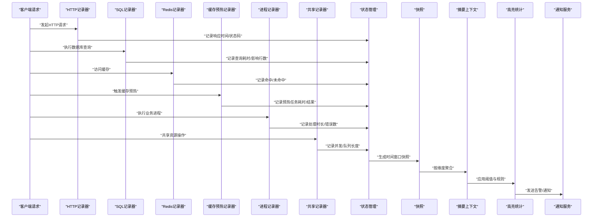
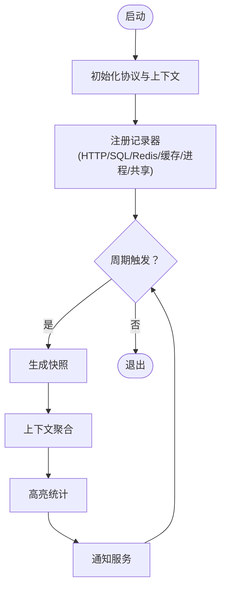
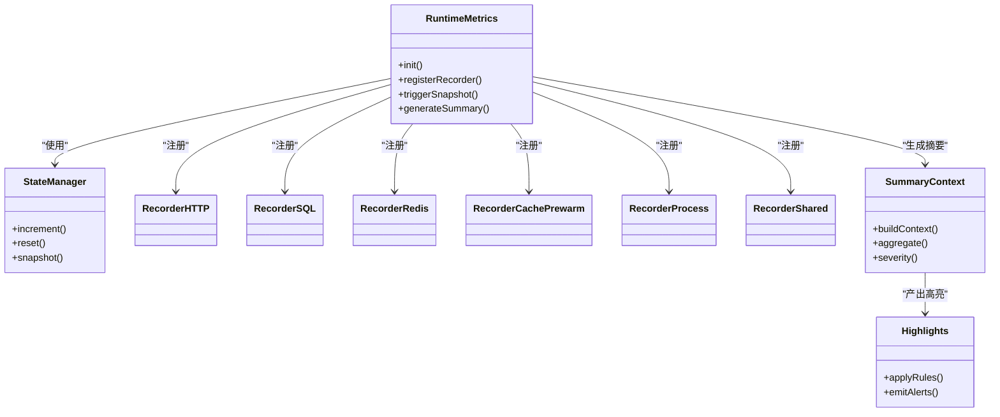
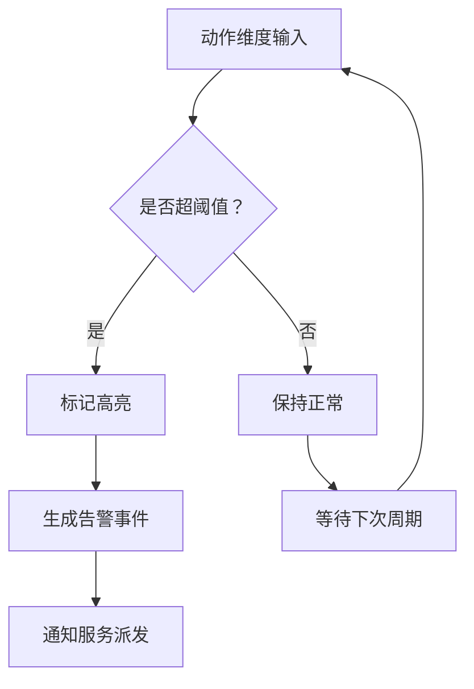
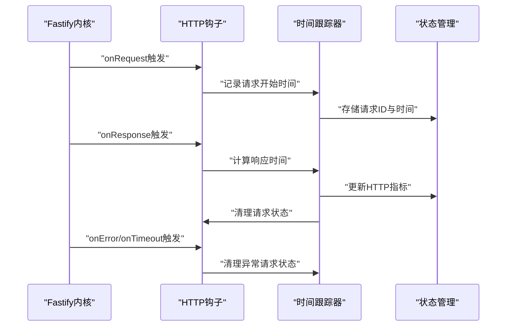
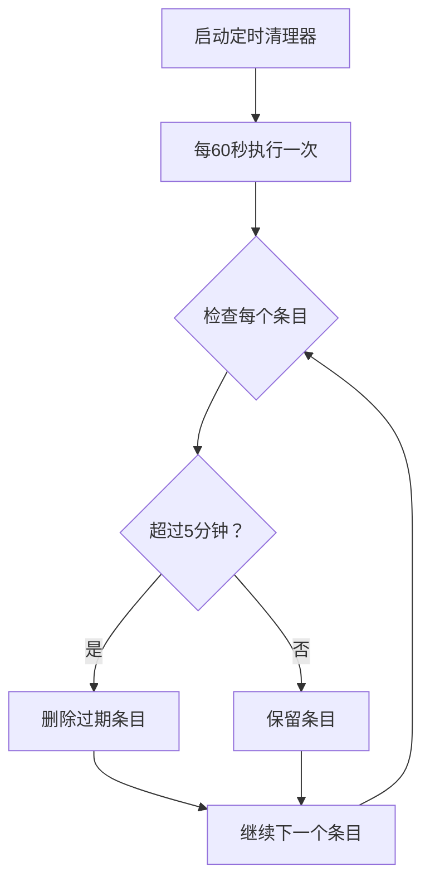
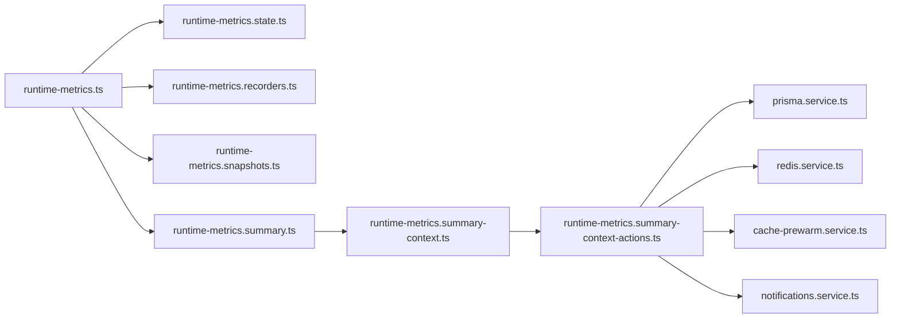

# 可观测性系统

<cite>
**本文档引用的文件**
- [src/observability/index.ts](file://src/observability/index.ts)
- [src/observability/runtime-metrics.ts](file://src/observability/runtime-metrics.ts)
- [src/observability/runtime-metrics.state.ts](file://src/observability/runtime-metrics.state.ts)
- [src/observability/runtime-metrics.recorders.ts](file://src/observability/runtime-metrics.recorders.ts)
- [src/observability/runtime-metrics.snapshots.ts](file://src/observability/runtime-metrics.snapshots.ts)
- [src/observability/runtime-metrics.summary.ts](file://src/observability/runtime-metrics.summary.ts)
- [src/observability/runtime-metrics.summary-context.ts](file://src/observability/runtime-metrics.summary-context.ts)
- [src/observability/runtime-metrics.summary-context.types.ts](file://src/observability/runtime-metrics.summary-context.types.ts)
- [src/observability/runtime-metrics.summary-context-actions.ts](file://src/observability/runtime-metrics.summary-context-actions.ts)
- [src/observability/runtime-metrics.summary-context-actions-http.ts](file://src/observability/runtime-metrics.summary-context-actions-http.ts)
- [src/observability/runtime-metrics.summary-context-actions-sql.ts](file://src/observability/runtime-metrics.summary-context-actions-sql.ts)
- [src/observability/runtime-metrics.summary-context-actions-redis.ts](file://src/observability/runtime-metrics.summary-context-actions-redis.ts)
- [src/observability/runtime-metrics.summary-context-actions-cache-prewarm.ts](file://src/observability/runtime-metrics.summary-context-actions-cache-prewarm.ts)
- [src/observability/runtime-metrics.summary-context-actions-process.ts](file://src/observability/runtime-metrics.summary-context-actions-process.ts)
- [src/observability/runtime-metrics.summary-context-actions-shared.ts](file://src/observability/runtime-metrics.summary-context-actions-shared.ts)
- [src/observability/runtime-metrics.summary-context-aggregates.ts](file://src/observability/runtime-metrics.summary-context-aggregates.ts)
- [src/observability/runtime-metrics.summary-context-severity.ts](file://src/observability/runtime-metrics.summary-context-severity.ts)
- [src/observability/runtime-metrics.summary-helpers.ts](file://src/observability/runtime-metrics.summary-helpers.ts)
- [src/observability/runtime-metrics.summary-highlights.ts](file://src/observability/runtime-metrics.summary-highlights.ts)
- [src/observability/runtime-metrics.summary-highlights-http.ts](file://src/observability/runtime-metrics.summary-highlights-http.ts)
- [src/observability/runtime-metrics.summary-highlights-sql.ts](file://src/observability/runtime-metrics.summary-highlights-sql.ts)
- [src/observability/runtime-metrics.summary-highlights-redis.ts](file://src/observability/runtime-metrics.summary-highlights-redis.ts)
- [src/observability/runtime-metrics.summary-highlights-cache-prewarm.ts](file://src/observability/runtime-metrics.summary-highlights-cache-prewarm.ts)
- [src/observability/runtime-metrics.summary-highlights-process.ts](file://src/observability/runtime-metrics.summary-highlights-process.ts)
- [src/observability/runtime-metrics.summary-highlights-shared.ts](file://src/observability/runtime-metrics.summary-highlights-shared.ts)
- [src/observability/metrics.protocol.ts](file://src/observability/metrics.protocol.ts)
- [src/observability/metrics-summary.protocol.ts](file://src/observability/metrics-summary.protocol.ts)
- [src/observability/metrics-snapshot.protocol.ts](file://src/observability/metrics-snapshot.protocol.ts)
- [src/observability/observability.protocol.ts](file://src/observability/observability.protocol.ts)
- [src/app.module.ts](file://src/app.module.ts)
- [src/main.ts](file://src/main.ts)
- [src/prisma/prisma.service.ts](file://src/prisma/prisma.service.ts)
- [src/redis/redis.service.ts](file://src/redis/redis.service.ts)
- [src/redis/cache-prewarm.service.ts](file://src/redis/cache-prewarm.service.ts)
- [src/redis/cache-prewarm.executor.ts](file://src/redis/cache-prewarm.executor.ts)
- [src/redis/cache-prewarm.types.ts](file://src/redis/cache-prewarm.types.ts)
- [src/redis/cache-prewarm.log.ts](file://src/redis/cache-prewarm.log.ts)
- [src/redis/cache-prewarm.error.ts](file://src/redis/cache-prewarm.error.ts)
- [src/redis/cache-keys.ts](file://src/redis/cache-keys.ts)
- [src/redis/cache-invalidator.service.ts](file://src/redis/cache-invalidator.service.ts)
- [src/redis/cache-prewarm.config.ts](file://src/redis/cache-prewarm.config.ts)
- [src/redis/cache-prewarm.utils.ts](file://src/redis/cache-prewarm.utils.ts)
- [src/notifications/notifications.service.ts](file://src/notifications/notifications.service.ts)
- [src/notifications/notifications.controller.ts](file://src/notifications/notifications.controller.ts)
- [src/notifications/notifications.types.ts](file://src/notifications/notifications.types.ts)
- [src/notifications/notifications.mapper.ts](file://src/notifications/notifications.mapper.ts)
- [src/notifications/notifications.query.ts](file://src/notifications/notifications.query.ts)
- [src/notifications/notifications-build.service.ts](file://src/notifications/notifications-build.service.ts)
- [src/notifications/notifications-read-state.service.ts](file://src/notifications/notifications-read-state.service.ts)
- [src/notifications/notifications-context.service.ts](file://src/notifications/notifications-context.service.ts)
- [src/notifications/notifications.constants.ts](file://src/notifications/notifications.constants.ts)
- [src/notifications/dto/notifications.dto.ts](file://src/notifications/dto/notifications.dto.ts)
- [src/config/configuration.ts](file://src/config/configuration.ts)
</cite>

## 更新摘要
**所做更改**
- 新增HTTP观察层性能优化章节，详细说明请求时间跟踪机制
- 添加自动清理过期条目和内存泄漏防护机制的实现细节
- 更新HTTP记录器功能描述，包含请求ID管理和状态清理
- 增强性能考量部分，涵盖内存管理与定时器优化

## 目录
1. [简介](#简介)
2. [项目结构](#项目结构)
3. [核心组件](#核心组件)
4. [架构总览](#架构总览)
5. [详细组件分析](#详细组件分析)
6. [HTTP观察层性能优化](#http观察层性能优化)
7. [依赖关系分析](#依赖关系分析)
8. [性能考量](#性能考量)
9. [故障排查指南](#故障排查指南)
10. [结论](#结论)
11. [附录](#附录)

## 简介
本文件为"可观测性系统"的技术文档，聚焦于性能监控架构设计、日志与追踪规范、慢查询追踪机制、系统健康检查、监控指标采集与分析流程，并提供配置示例、监控面板与告警规则建议、调试技巧、性能诊断方法与优化建议。该系统以运行时指标为核心，结合上下文聚合、高亮统计与快照能力，形成从采集到可视化的完整闭环。

**更新** 新增HTTP观察层性能优化章节，重点介绍请求时间跟踪、自动清理过期条目和内存泄漏防护机制的实现。

## 项目结构
可观测性相关代码集中于 src/observability 目录，围绕运行时指标（runtime-metrics）构建，包含状态管理、记录器、快照、摘要上下文与高亮统计等模块；同时与 Prisma 数据库服务、Redis 缓存服务以及通知模块存在集成点，用于指标持久化、缓存预热与事件通知。

```mermaid
graph TB
subgraph "可观测性子系统"
RM["runtime-metrics.ts"]
RS["runtime-metrics.state.ts"]
RR["runtime-metrics.recorders.ts"]
RSP["runtime-metrics.snapshots.ts"]
RMS["runtime-metrics.summary.ts"]
RC["runtime-metrics.summary-context.ts"]
RCT["runtime-metrics.summary-context.types.ts"]
RCA["runtime-metrics.summary-context-actions.ts"]
RCA_HTTP["runtime-metrics.summary-context-actions-http.ts"]
RCA_SQL["runtime-metrics.summary-context-actions-sql.ts"]
RCA_REDIS["runtime-metrics.summary-context-actions-redis.ts"]
RCA_CACHE["runtime-metrics.summary-context-actions-cache-prewarm.ts"]
RCA_PROC["runtime-metrics.summary-context-actions-process.ts"]
RCA_SHARED["runtime-metrics.summary-context-actions-shared.ts"]
RAGG["runtime-metrics.summary-context-aggregates.ts"]
RSEV["runtime-metrics.summary-context-severity.ts"]
RH["runtime-metrics.summary-helpers.ts"]
RHL["runtime-metrics.summary-highlights.ts"]
RHL_HTTP["runtime-metrics.summary-highlights-http.ts"]
RHL_SQL["runtime-metrics.summary-highlights-sql.ts"]
RHL_REDIS["runtime-metrics.summary-highlights-redis.ts"]
RHL_CACHE["runtime-metrics.summary-highlights-cache-prewarm.ts"]
RHL_PROC["runtime-metrics.summary-highlights-process.ts"]
RHL_SHARED["runtime-metrics.summary-highlights-shared.ts"]
MP["metrics.protocol.ts"]
MSP["metrics-summary.protocol.ts"]
MSPN["metrics-snapshot.protocol.ts"]
OP["observability.protocol.ts"]
end
subgraph "外部集成"
PRISMA["prisma.service.ts"]
REDIS["redis.service.ts"]
CACHE_PREWARM["cache-prewarm.service.ts"]
CACHE_EXEC["cache-prewarm.executor.ts"]
CACHE_TYPES["cache-prewarm.types.ts"]
CACHE_LOG["cache-prewarm.log.ts"]
CACHE_ERR["cache-prewarm.error.ts"]
CACHE_KEYS["cache-keys.ts"]
CACHE_INV["cache-invalidator.service.ts"]
CACHE_CONF["cache-prewarm.config.ts"]
CACHE_UTIL["cache-prewarm.utils.ts"]
NOTI["notifications.service.ts"]
end
RM --> RS
RM --> RR
RM --> RSP
RM --> RMS
RMS --> RC
RC --> RCA
RCA --> RCA_HTTP
RCA --> RCA_SQL
RCA --> RCA_REDIS
RCA --> RCA_CACHE
RCA --> RCA_PROC
RCA --> RCA_SHARED
RC --> RAGG
RC --> RSEV
RC --> RH
RMS --> RHL
RHL --> RHL_HTTP
RHL --> RHL_SQL
RHL --> RHL_REDIS
RHL --> RHL_CACHE
RHL --> RHL_PROC
RHL --> RHL_SHARED
RCA_HTTP --> PRISMA
RCA_SQL --> PRISMA
RCA_REDIS --> REDIS
RCA_CACHE --> CACHE_PREWARM
RCA_CACHE --> CACHE_EXEC
RCA_CACHE --> CACHE_TYPES
RCA_CACHE --> CACHE_LOG
RCA_CACHE --> CACHE_ERR
RCA_CACHE --> CACHE_KEYS
RCA_CACHE --> CACHE_INV
RCA_CACHE --> CACHE_CONF
RCA_CACHE --> CACHE_UTIL
RHL_HTTP --> NOTI
RHL_SQL --> NOTI
RHL_REDIS --> NOTI
RHL_CACHE --> NOTI
RHL_PROC --> NOTI
RHL_SHARED --> NOTI
```

**图示来源**
- [src/observability/runtime-metrics.ts:1-200](file://src/observability/runtime-metrics.ts#L1-L200)
- [src/observability/runtime-metrics.summary-context-actions-http.ts:1-200](file://src/observability/runtime-metrics.summary-context-actions-http.ts#L1-L200)
- [src/observability/runtime-metrics.summary-context-actions-sql.ts:1-200](file://src/observability/runtime-metrics.summary-context-actions-sql.ts#L1-L200)
- [src/observability/runtime-metrics.summary-context-actions-redis.ts:1-200](file://src/observability/runtime-metrics.summary-context-actions-redis.ts#L1-L200)
- [src/observability/runtime-metrics.summary-context-actions-cache-prewarm.ts:1-200](file://src/observability/runtime-metrics.summary-context-actions-cache-prewarm.ts#L1-L200)
- [src/observability/runtime-metrics.summary-context-actions-process.ts:1-200](file://src/observability/runtime-metrics.summary-context-actions-process.ts#L1-L200)
- [src/observability/runtime-metrics.summary-context-actions-shared.ts:1-200](file://src/observability/runtime-metrics.summary-context-actions-shared.ts#L1-L200)
- [src/redis/cache-prewarm.service.ts:1-200](file://src/redis/cache-prewarm.service.ts#L1-L200)
- [src/redis/cache-prewarm.executor.ts:1-200](file://src/redis/cache-prewarm.executor.ts#L1-L200)
- [src/redis/cache-prewarm.types.ts:1-200](file://src/redis/cache-prewarm.types.ts#L1-L200)
- [src/redis/cache-prewarm.log.ts:1-200](file://src/redis/cache-prewarm.log.ts#L1-L200)
- [src/redis/cache-prewarm.error.ts:1-200](file://src/redis/cache-prewarm.error.ts#L1-L200)
- [src/redis/cache-keys.ts:1-200](file://src/redis/cache-keys.ts#L1-L200)
- [src/redis/cache-invalidator.service.ts:1-200](file://src/redis/cache-invalidator.service.ts#L1-L200)
- [src/redis/cache-prewarm.config.ts:1-200](file://src/redis/cache-prewarm.config.ts#L1-L200)
- [src/redis/cache-prewarm.utils.ts:1-200](file://src/redis/cache-prewarm.utils.ts#L1-L200)
- [src/prisma/prisma.service.ts:1-200](file://src/prisma/prisma.service.ts#L1-L200)
- [src/redis/redis.service.ts:1-200](file://src/redis/redis.service.ts#L1-L200)
- [src/notifications/notifications.service.ts:1-200](file://src/notifications/notifications.service.ts#L1-L200)

**章节来源**
- [src/observability/index.ts:1-200](file://src/observability/index.ts#L1-L200)
- [src/observability/runtime-metrics.ts:1-200](file://src/observability/runtime-metrics.ts#L1-L200)
- [src/observability/runtime-metrics.summary.ts:1-200](file://src/observability/runtime-metrics.summary.ts#L1-L200)
- [src/observability/runtime-metrics.summary-context.ts:1-200](file://src/observability/runtime-metrics.summary-context.ts#L1-L200)
- [src/observability/runtime-metrics.summary-context-actions.ts:1-200](file://src/observability/runtime-metrics.summary-context-actions.ts#L1-L200)
- [src/redis/cache-prewarm.service.ts:1-200](file://src/redis/cache-prewarm.service.ts#L1-L200)
- [src/prisma/prisma.service.ts:1-200](file://src/prisma/prisma.service.ts#L1-L200)
- [src/redis/redis.service.ts:1-200](file://src/redis/redis.service.ts#L1-L200)
- [src/notifications/notifications.service.ts:1-200](file://src/notifications/notifications.service.ts#L1-L200)

## 核心组件
- 运行时指标主入口：负责初始化、注册记录器、触发快照与汇总计算，协调上下文与高亮统计。
- 状态管理：维护运行时指标的全局状态，支持并发安全的增量更新与重置。
- 记录器：封装对不同后端（HTTP、SQL、Redis、缓存预热、进程、共享）的指标记录逻辑。
- 快照：按时间窗口生成指标快照，便于离线分析与趋势对比。
- 摘要上下文：定义指标分类维度（如动作、聚合、严重度），并提供上下文构建与查询能力。
- 高亮统计：基于阈值与规则对异常进行高亮标记，驱动告警与通知。
- 协议层：定义指标、快照与摘要的数据结构与序列化格式，确保跨模块一致性。

**更新** 新增HTTP观察层性能优化组件，包括请求时间跟踪、自动清理机制和内存泄漏防护。

**章节来源**
- [src/observability/runtime-metrics.ts:1-200](file://src/observability/runtime-metrics.ts#L1-L200)
- [src/observability/runtime-metrics.state.ts:1-200](file://src/observability/runtime-metrics.state.ts#L1-L200)
- [src/observability/runtime-metrics.recorders.ts:1-200](file://src/observability/runtime-metrics.recorders.ts#L1-L200)
- [src/observability/runtime-metrics.snapshots.ts:1-200](file://src/observability/runtime-metrics.snapshots.ts#L1-L200)
- [src/observability/runtime-metrics.summary.ts:1-200](file://src/observability/runtime-metrics.summary.ts#L1-L200)
- [src/observability/runtime-metrics.summary-context.ts:1-200](file://src/observability/runtime-metrics.summary-context.ts#L1-L200)
- [src/observability/runtime-metrics.summary-context.types.ts:1-200](file://src/observability/runtime-metrics.summary-context.types.ts#L1-L200)
- [src/observability/runtime-metrics.summary-context-actions.ts:1-200](file://src/observability/runtime-metrics.summary-context-actions.ts#L1-L200)
- [src/observability/runtime-metrics.summary-helpers.ts:1-200](file://src/observability/runtime-metrics.summary-helpers.ts#L1-L200)
- [src/observability/runtime-metrics.summary-highlights.ts:1-200](file://src/observability/runtime-metrics.summary-highlights.ts#L1-L200)
- [src/observability/metrics.protocol.ts:1-200](file://src/observability/metrics.protocol.ts#L1-L200)
- [src/observability/metrics-summary.protocol.ts:1-200](file://src/observability/metrics-summary.protocol.ts#L1-L200)
- [src/observability/metrics-snapshot.protocol.ts:1-200](file://src/observability/metrics-snapshot.protocol.ts#L1-L200)
- [src/observability/observability.protocol.ts:1-200](file://src/observability/observability.protocol.ts#L1-L200)

## 架构总览
可观测性系统采用"采集-聚合-高亮-通知"的流水线式架构。HTTP、SQL、Redis、缓存预热、进程与共享等动作维度分别通过记录器采集指标，进入状态管理与快照模块；随后由摘要上下文进行维度化聚合与严重度评估，最终生成高亮统计并触达通知模块。

**图示来源**
- [src/observability/runtime-metrics.recorders.ts:1-200](file://src/observability/runtime-metrics.recorders.ts#L1-L200)
- [src/observability/runtime-metrics.state.ts:1-200](file://src/observability/runtime-metrics.state.ts#L1-L200)
- [src/observability/runtime-metrics.snapshots.ts:1-200](file://src/observability/runtime-metrics.snapshots.ts#L1-L200)
- [src/observability/runtime-metrics.summary-context.ts:1-200](file://src/observability/runtime-metrics.summary-context.ts#L1-L200)
- [src/observability/runtime-metrics.summary-highlights.ts:1-200](file://src/observability/runtime-metrics.summary-highlights.ts#L1-L200)
- [src/notifications/notifications.service.ts:1-200](file://src/notifications/notifications.service.ts#L1-L200)

## 详细组件分析

### 运行时指标主控（runtime-metrics）
- 职责：初始化可观测性子系统，注册各类记录器，调度快照与摘要生成，暴露查询接口。
- 关键流程：启动时加载协议定义与上下文配置；周期性触发快照；在汇总阶段调用上下文聚合与高亮统计。
- 并发模型：通过状态管理保证多路记录器并发写入的一致性与原子性。

**图示来源**
- [src/observability/runtime-metrics.ts:1-200](file://src/observability/runtime-metrics.ts#L1-L200)
- [src/observability/runtime-metrics.recorders.ts:1-200](file://src/observability/runtime-metrics.recorders.ts#L1-L200)
- [src/observability/runtime-metrics.summary.ts:1-200](file://src/observability/runtime-metrics.summary.ts#L1-L200)
- [src/observability/runtime-metrics.summary-context.ts:1-200](file://src/observability/runtime-metrics.summary-context.ts#L1-L200)
- [src/observability/runtime-metrics.summary-highlights.ts:1-200](file://src/observability/runtime-metrics.summary-highlights.ts#L1-L200)

**章节来源**
- [src/observability/runtime-metrics.ts:1-200](file://src/observability/runtime-metrics.ts#L1-L200)
- [src/observability/runtime-metrics.recorders.ts:1-200](file://src/observability/runtime-metrics.recorders.ts#L1-L200)

### 状态管理（runtime-metrics.state）
- 职责：维护全局指标状态，提供线程安全的增减、归零与合并能力；支持快照前的状态冻结与导出。
- 设计要点：使用不可变快照策略避免读写竞争；提供批量重置与增量累加接口。

**章节来源**
- [src/observability/runtime-metrics.state.ts:1-200](file://src/observability/runtime-metrics.state.ts#L1-L200)

### 记录器体系（runtime-metrics.recorders）
- 职责：封装对不同后端的指标采集逻辑，统一上报到状态管理。
- 维度覆盖：HTTP（响应时间、状态码）、SQL（查询耗时、影响行数、错误码）、Redis（命中率、命令耗时）、缓存预热（任务耗时、结果）、进程（处理时长、错误数）、共享（并发、队列长度）。
- 规范：所有记录器遵循统一的时间戳、标签与单位约定，确保后续聚合一致性。

**更新** HTTP记录器新增请求ID管理功能，支持精确的请求时间跟踪和状态清理。

**章节来源**
- [src/observability/runtime-metrics.recorders.ts:1-200](file://src/observability/runtime-metrics.recorders.ts#L1-L200)
- [src/observability/runtime-metrics.summary-context-actions-http.ts:1-200](file://src/observability/runtime-metrics.summary-context-actions-http.ts#L1-L200)
- [src/observability/runtime-metrics.summary-context-actions-sql.ts:1-200](file://src/observability/runtime-metrics.summary-context-actions-sql.ts#L1-L200)
- [src/observability/runtime-metrics.summary-context-actions-redis.ts:1-200](file://src/observability/runtime-metrics.summary-context-actions-redis.ts#L1-L200)
- [src/observability/runtime-metrics.summary-context-actions-cache-prewarm.ts:1-200](file://src/observability/runtime-metrics.summary-context-actions-cache-prewarm.ts#L1-L200)
- [src/observability/runtime-metrics.summary-context-actions-process.ts:1-200](file://src/observability/runtime-metrics.summary-context-actions-process.ts#L1-L200)
- [src/observability/runtime-metrics.summary-context-actions-shared.ts:1-200](file://src/observability/runtime-metrics.summary-context-actions-shared.ts#L1-L200)

### 快照与摘要（runtime-metrics.snapshots & runtime-metrics.summary）
- 快照：按固定时间窗口（如分钟级）冻结状态并输出结构化快照，便于趋势分析与回放。
- 摘要：在快照基础上按上下文维度进行聚合（如动作类型、严重度等级），并生成高亮统计。
- 上下文：定义动作、聚合、严重度等维度，支持动态扩展与规则化配置。

**图示来源**
- [src/observability/runtime-metrics.ts:1-200](file://src/observability/runtime-metrics.ts#L1-L200)
- [src/observability/runtime-metrics.state.ts:1-200](file://src/observability/runtime-metrics.state.ts#L1-L200)
- [src/observability/runtime-metrics.summary-context.ts:1-200](file://src/observability/runtime-metrics.summary-context.ts#L1-L200)
- [src/observability/runtime-metrics.summary.ts:1-200](file://src/observability/runtime-metrics.summary.ts#L1-L200)
- [src/observability/runtime-metrics.summary-highlights.ts:1-200](file://src/observability/runtime-metrics.summary-highlights.ts#L1-L200)

**章节来源**
- [src/observability/runtime-metrics.snapshots.ts:1-200](file://src/observability/runtime-metrics.snapshots.ts#L1-L200)
- [src/observability/runtime-metrics.summary.ts:1-200](file://src/observability/runtime-metrics.summary.ts#L1-L200)
- [src/observability/runtime-metrics.summary-context.ts:1-200](file://src/observability/runtime-metrics.summary-context.ts#L1-L200)
- [src/observability/runtime-metrics.summary-context-aggregates.ts:1-200](file://src/observability/runtime-metrics.summary-context-aggregates.ts#L1-L200)
- [src/observability/runtime-metrics.summary-context-severity.ts:1-200](file://src/observability/runtime-metrics.summary-context-severity.ts#L1-L200)
- [src/observability/runtime-metrics.summary-helpers.ts:1-200](file://src/observability/runtime-metrics.summary-helpers.ts#L1-L200)

### 动作维度与高亮统计
- 动作维度：HTTP、SQL、Redis、缓存预热、进程、共享，每类动作均配套独立的记录器与高亮规则。
- 高亮规则：基于阈值（如P95响应时间、错误率、缓存未命中率）与规则组合，自动标记异常区间。
- 通知联动：高亮触发后，通知服务根据上下文维度推送告警至指定渠道。

**图示来源**
- [src/observability/runtime-metrics.summary-context-actions-http.ts:1-200](file://src/observability/runtime-metrics.summary-context-actions-http.ts#L1-L200)
- [src/observability/runtime-metrics.summary-context-actions-sql.ts:1-200](file://src/observability/runtime-metrics.summary-context-actions-sql.ts#L1-L200)
- [src/observability/runtime-metrics.summary-context-actions-redis.ts:1-200](file://src/observability/runtime-metrics.summary-context-actions-redis.ts#L1-L200)
- [src/observability/runtime-metrics.summary-context-actions-cache-prewarm.ts:1-200](file://src/observability/runtime-metrics.summary-context-actions-cache-prewarm.ts#L1-L200)
- [src/observability/runtime-metrics.summary-context-actions-process.ts:1-200](file://src/observability/runtime-metrics.summary-context-actions-process.ts#L1-L200)
- [src/observability/runtime-metrics.summary-context-actions-shared.ts:1-200](file://src/observability/runtime-metrics.summary-context-actions-shared.ts#L1-L200)
- [src/observability/runtime-metrics.summary-highlights-http.ts:1-200](file://src/observability/runtime-metrics.summary-highlights-http.ts#L1-L200)
- [src/observability/runtime-metrics.summary-highlights-sql.ts:1-200](file://src/observability/runtime-metrics.summary-highlights-sql.ts#L1-L200)
- [src/observability/runtime-metrics.summary-highlights-redis.ts:1-200](file://src/observability/runtime-metrics.summary-highlights-redis.ts#L1-L200)
- [src/observability/runtime-metrics.summary-highlights-cache-prewarm.ts:1-200](file://src/observability/runtime-metrics.summary-highlights-cache-prewarm.ts#L1-L200)
- [src/observability/runtime-metrics.summary-highlights-process.ts:1-200](file://src/observability/runtime-metrics.summary-highlights-process.ts#L1-L200)
- [src/observability/runtime-metrics.summary-highlights-shared.ts:1-200](file://src/observability/runtime-metrics.summary-highlights-shared.ts#L1-L200)
- [src/notifications/notifications.service.ts:1-200](file://src/notifications/notifications.service.ts#L1-L200)

**章节来源**
- [src/observability/runtime-metrics.summary-context-actions.ts:1-200](file://src/observability/runtime-metrics.summary-context-actions.ts#L1-L200)
- [src/observability/runtime-metrics.summary-highlights.ts:1-200](file://src/observability/runtime-metrics.summary-highlights.ts#L1-L200)

### 协议与数据模型
- 指标协议：定义指标字段、时间戳、标签与单位，确保跨模块一致的序列化与反序列化。
- 快照协议：定义快照结构与版本控制，支持增量更新与回放。
- 摘要协议：定义摘要维度、聚合函数与严重度映射，支撑可视化与告警。

**章节来源**
- [src/observability/metrics.protocol.ts:1-200](file://src/observability/metrics.protocol.ts#L1-L200)
- [src/observability/metrics-snapshot.protocol.ts:1-200](file://src/observability/metrics-snapshot.protocol.ts#L1-L200)
- [src/observability/metrics-summary.protocol.ts:1-200](file://src/observability/metrics-summary.protocol.ts#L1-L200)
- [src/observability/observability.protocol.ts:1-200](file://src/observability/observability.protocol.ts#L1-L200)

## HTTP观察层性能优化

### 请求时间跟踪机制
HTTP观察层实现了精确的请求时间跟踪机制，通过Fastify钩子在请求生命周期的关键节点捕获时间信息：

- **请求开始跟踪**：在 `onRequest` 钩子中记录请求ID与开始时间
- **请求完成清理**：在 `onResponse` 钩子中计算响应时间并清理状态
- **异常处理**：在 `onError` 和 `onTimeout` 钩子中确保异常请求的状态清理

**图示来源**
- [src/main.ts:81-99](file://src/main.ts#L81-L99)

### 自动清理过期条目机制
系统实现了智能的内存管理机制，防止长时间运行导致的内存泄漏：

- **过期检测**：设置5分钟的最大条目存活时间
- **定期清理**：每60秒执行一次清理任务
- **内存保护**：使用 `unref()` 方法避免定时器阻止进程退出

**图示来源**
- [src/main.ts:69-78](file://src/main.ts#L69-L78)

### 内存泄漏防护机制
通过多重防护措施确保系统的长期稳定性：

- **请求ID唯一性**：使用请求对象的唯一ID作为Map键
- **状态清理策略**：在所有可能的请求结束场景清理状态
- **异常容错**：即使发生异常也能确保状态清理
- **定时器管理**：使用 `unref()` 避免定时器阻塞进程退出

**章节来源**
- [src/main.ts:59-99](file://src/main.ts#L59-L99)

## 依赖关系分析
- 内部耦合：运行时指标主控依赖状态管理与记录器；摘要上下文依赖动作维度与高亮统计；高亮统计依赖通知服务。
- 外部依赖：HTTP/SQL/Redis/缓存预热/进程/共享记录器分别依赖 Prisma、Redis、缓存预热执行器与通知服务。
- 风险点：记录器并发写入与状态冻结需严格同步；快照与汇总的时序一致性需通过时间窗口与版本号保障。

**图示来源**
- [src/observability/runtime-metrics.ts:1-200](file://src/observability/runtime-metrics.ts#L1-L200)
- [src/observability/runtime-metrics.summary.ts:1-200](file://src/observability/runtime-metrics.summary.ts#L1-L200)
- [src/observability/runtime-metrics.summary-context.ts:1-200](file://src/observability/runtime-metrics.summary-context.ts#L1-L200)
- [src/observability/runtime-metrics.summary-context-actions.ts:1-200](file://src/observability/runtime-metrics.summary-context-actions.ts#L1-L200)
- [src/prisma/prisma.service.ts:1-200](file://src/prisma/prisma.service.ts#L1-L200)
- [src/redis/redis.service.ts:1-200](file://src/redis/redis.service.ts#L1-L200)
- [src/redis/cache-prewarm.service.ts:1-200](file://src/redis/cache-prewarm.service.ts#L1-L200)
- [src/notifications/notifications.service.ts:1-200](file://src/notifications/notifications.service.ts#L1-L200)

**章节来源**
- [src/observability/runtime-metrics.ts:1-200](file://src/observability/runtime-metrics.ts#L1-L200)
- [src/observability/runtime-metrics.summary.ts:1-200](file://src/observability/runtime-metrics.summary.ts#L1-L200)
- [src/observability/runtime-metrics.summary-context.ts:1-200](file://src/observability/runtime-metrics.summary-context.ts#L1-L200)
- [src/observability/runtime-metrics.summary-context-actions.ts:1-200](file://src/observability/runtime-metrics.summary-context-actions.ts#L1-L200)
- [src/prisma/prisma.service.ts:1-200](file://src/prisma/prisma.service.ts#L1-L200)
- [src/redis/redis.service.ts:1-200](file://src/redis/redis.service.ts#L1-L200)
- [src/redis/cache-prewarm.service.ts:1-200](file://src/redis/cache-prewarm.service.ts#L1-L200)
- [src/notifications/notifications.service.ts:1-200](file://src/notifications/notifications.service.ts#L1-L200)

## 性能考量
- 采样与降噪：对高频动作（如HTTP）采用分位数采样与滑动窗口，降低存储与计算压力。
- 并发写入：状态管理采用无锁或细粒度锁策略，避免热点指标导致的阻塞。
- 快照批处理：快照生成与汇总计算尽量批量执行，减少I/O与序列化开销。
- 缓存预热：通过缓存预热记录器监控预热任务耗时与成功率，及时发现缓存层瓶颈。
- SQL优化：结合慢查询高亮与索引迁移脚本，持续优化关键查询路径。
- Redis优化：监控命中率与命令耗时，合理设置过期策略与内存淘汰策略。
- **HTTP性能优化**：通过精确的请求时间跟踪和自动清理机制，确保HTTP观察层的高性能运行。

**更新** 新增HTTP观察层性能优化考量，包括请求时间跟踪精度、内存管理效率和定时器优化策略。

## 故障排查指南
- 健康检查：通过运行时指标主控暴露健康端点，返回系统状态、最近快照时间与关键高亮统计。
- 日志规范：记录器在异常情况下输出带标签的日志，包含时间戳、动作类型、目标后端与错误详情。
- 慢查询追踪：启用SQL高亮统计，结合Prisma服务的查询日志与索引迁移脚本定位慢查询。
- 缓存问题：通过缓存预热记录器与缓存预热执行器日志，定位预热失败与缓存未命中原因。
- 通知链路：验证高亮统计到通知服务的通道，确保告警消息正确派发。
- **HTTP观察层故障排查**：检查请求时间跟踪是否正常、内存清理定时器是否运行、请求状态是否正确清理。

**更新** 新增HTTP观察层故障排查指导，涵盖请求时间跟踪、内存管理和状态清理等方面。

**章节来源**
- [src/observability/runtime-metrics.ts:1-200](file://src/observability/runtime-metrics.ts#L1-L200)
- [src/observability/runtime-metrics.summary-highlights.ts:1-200](file://src/observability/runtime-metrics.summary-highlights.ts#L1-L200)
- [src/redis/cache-prewarm.log.ts:1-200](file://src/redis/cache-prewarm.log.ts#L1-L200)
- [src/redis/cache-prewarm.error.ts:1-200](file://src/redis/cache-prewarm.error.ts#L1-L200)
- [src/notifications/notifications.service.ts:1-200](file://src/notifications/notifications.service.ts#L1-L200)

## 结论
该可观测性系统以运行时指标为核心，通过统一的记录器、状态管理、快照与摘要上下文，实现了对HTTP、SQL、Redis、缓存预热、进程与共享等多维动作的统一监控与高亮告警。配合Prisma与Redis的集成，能够有效支撑性能监控、慢查询追踪与系统健康检查。

**更新** HTTP观察层的性能优化显著提升了系统的稳定性和可靠性，通过精确的请求时间跟踪、智能的内存管理和高效的定时器机制，确保了HTTP观察层在高并发场景下的优异表现。建议在生产环境中结合分位数采样、批量处理与缓存预热策略，持续优化指标采集与分析效率。

## 附录

### 配置示例（概念性）
- 指标采集周期：建议分钟级窗口，兼顾实时性与成本。
- 阈值规则：HTTP P95响应时间、SQL慢查询数量、Redis未命中率、缓存预热失败率等。
- 快照保留：近7天快照用于趋势分析，近30天用于回归对比。
- 通知策略：高亮统计触发后，按严重度分级推送至不同渠道。
- **HTTP观察层配置**：请求时间跟踪精度、内存清理间隔、过期条目阈值等参数调优。

**更新** 新增HTTP观察层配置参数说明，包括请求时间跟踪精度、内存清理频率和过期条目管理策略。

### 监控面板设置（概念性）
- 面板维度：按动作类型（HTTP/SQL/Redis/缓存/进程/共享）拆分图表。
- 指标选择：响应时间分布、错误率、吞吐量、缓存命中率、慢查询TopN。
- 时间范围：默认最近1小时，支持快速切换至最近24小时与最近7天。
- **HTTP观察层监控**：请求时间分布、内存使用情况、清理任务执行状态等。

**更新** 新增HTTP观察层监控指标，包括请求时间分布、内存使用监控和清理任务状态。

### 告警规则配置（概念性）
- 规则模板：动作类型+阈值+持续时间+严重度。
- 示例：HTTP P95>500ms持续3分钟；SQL慢查询>10条/分钟；Redis未命中率>5%；缓存预热失败>1次/小时。
- 通知渠道：邮件、IM群组、值班系统。
- **HTTP观察层告警**：请求超时、内存泄漏风险、清理任务异常等。

**更新** 新增HTTP观察层告警规则，涵盖请求超时、内存泄漏风险和清理任务异常等场景。

### 调试技巧
- 使用最小化上下文：仅启用关键动作维度，快速定位问题。
- 对比快照：对比相邻快照的高亮变化，缩小问题时间窗。
- 分层排查：先看HTTP/进程/共享等上层动作，再深入到SQL/Redis/缓存预热等底层动作。
- **HTTP观察层调试**：检查请求时间跟踪准确性、内存清理效果、状态清理完整性。

**更新** 新增HTTP观察层调试技巧，包括请求时间跟踪验证、内存清理效果检查和状态清理完整性验证。

### 性能优化建议
- 指标稀疏化：对低价值指标采用降采样或只在异常时上报。
- 批量汇总：将多个维度的聚合合并为一次计算，减少重复扫描。
- 存储压缩：对历史快照采用压缩编码，降低磁盘占用。
- 网络优化：将通知服务与可观测性系统部署在同一可用区，缩短网络延迟。
- **HTTP观察层优化**：优化请求时间跟踪精度、调整内存清理频率、改进定时器性能。

**更新** 新增HTTP观察层性能优化建议，包括请求时间跟踪精度优化、内存清理频率调整和定时器性能改进。