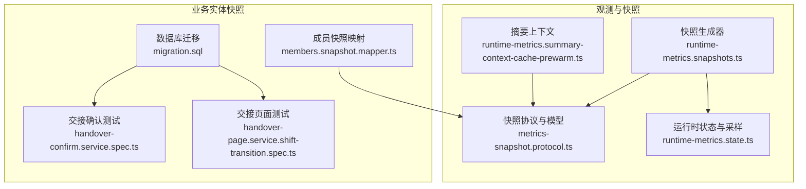
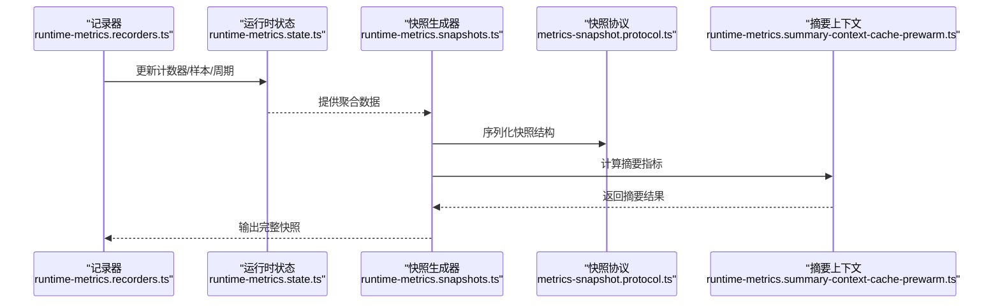
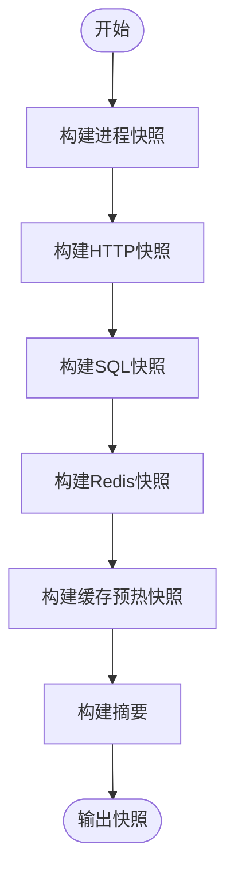
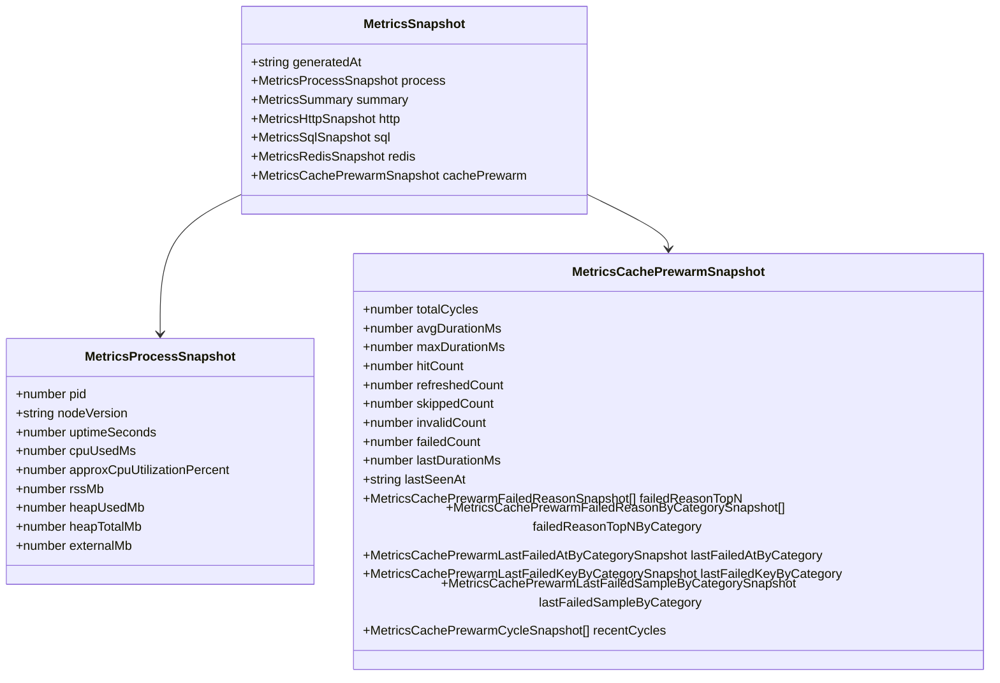
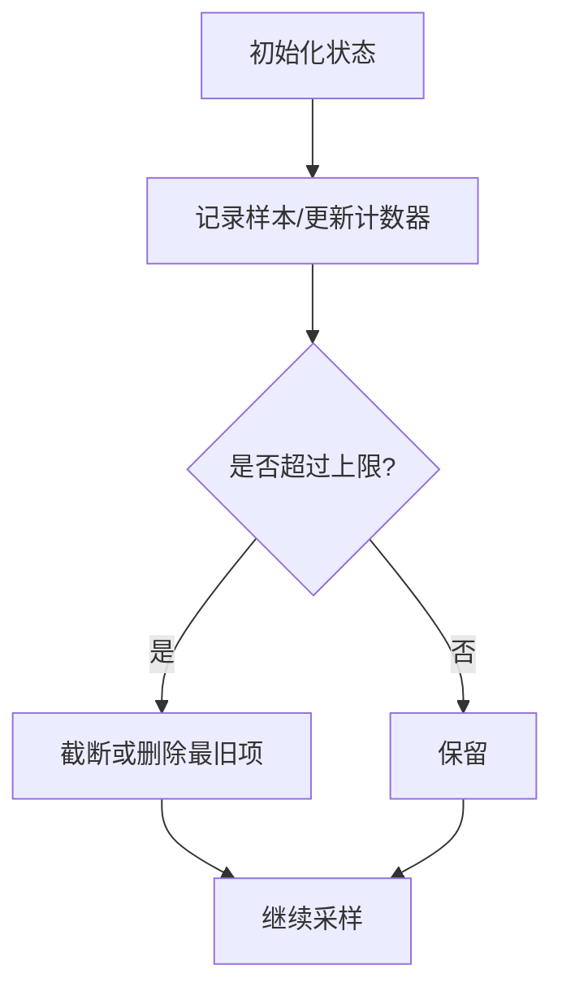
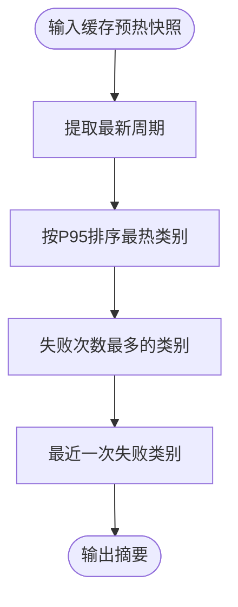
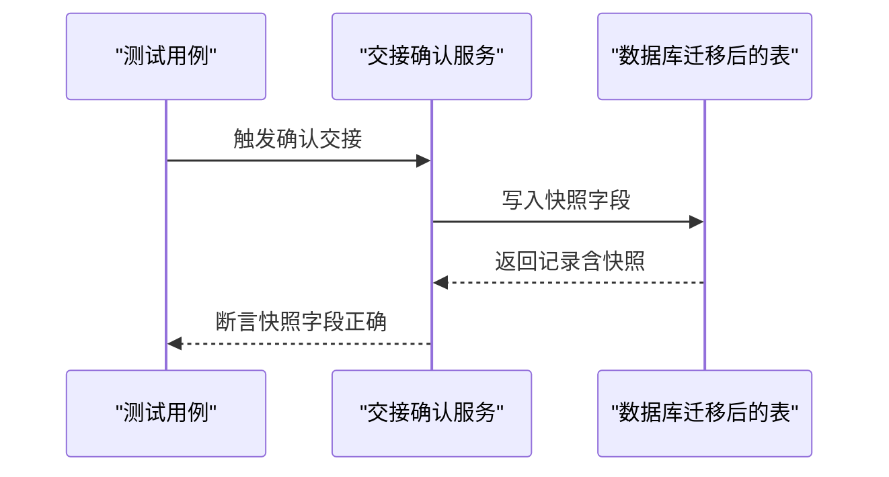

# 快照管理系统

<cite>
**本文引用的文件**
- [src/observability/runtime-metrics.snapshots.ts](file://src/observability/runtime-metrics.snapshots.ts)
- [src/observability/metrics-snapshot.protocol.ts](file://src/observability/metrics-snapshot.protocol.ts)
- [src/observability/runtime-metrics.state.ts](file://src/observability/runtime-metrics.state.ts)
- [src/observability/runtime-metrics.summary-context-cache-prewarm.ts](file://src/observability/runtime-metrics.summary-context-cache-prewarm.ts)
- [prisma/migrations/20260605183000_add_handover_record_shift_snapshots/migration.sql](file://prisma/migrations/20260605183000_add_handover_record_shift_snapshots/migration.sql)
- [src/purely-profit/operations/handover/handover-confirm.service.spec.ts](file://src/purely-profit/operations/handover/handover-confirm.service.spec.ts)
- [src/purely-profit/operations/handover/handover-page.service.shift-transition.spec.ts](file://src/purely-profit/operations/handover/handover-page.service.shift-transition.spec.ts)
- [src/purely-profit/member/members/members.snapshot.mapper.ts](file://src/purely-profit/member/members/members.snapshot.mapper.ts)
</cite>

## 目录
1. [引言](#引言)
2. [项目结构](#项目结构)
3. [核心组件](#核心组件)
4. [架构总览](#架构总览)
5. [详细组件分析](#详细组件分析)
6. [依赖关系分析](#依赖关系分析)
7. [性能考量](#性能考量)
8. [故障排查指南](#故障排查指南)
9. [结论](#结论)
10. [附录](#附录)

## 引言
本技术文档围绕“快照管理系统”展开，重点解释系统状态快照的采集时机、存储格式与生命周期管理；详述快照数据结构、检索优化策略与配置参数；并结合实际代码路径，给出回放、历史对比与变更追踪的实现思路。系统当前以运行时指标快照为核心能力，并在业务实体（如交接记录）中引入“快照字段”以保留历史状态，从而支撑回溯与审计。

## 项目结构
快照系统主要由以下模块构成：
- 运行时指标快照：负责进程、HTTP、SQL、Redis、缓存预热等维度的快照生成与汇总。
- 协议与数据模型：定义各类快照的数据结构与序列化规范。
- 状态与采样：维护运行时统计状态、样本上限与采样策略。
- 业务实体快照：在数据库表中新增快照字段，用于持久化关键业务状态。
- 摘要上下文：基于快照构建摘要信息，辅助诊断与告警。



图表来源
- [src/observability/runtime-metrics.snapshots.ts:326-350](file://src/observability/runtime-metrics.snapshots.ts#L326-L350)
- [src/observability/metrics-snapshot.protocol.ts:1-198](file://src/observability/metrics-snapshot.protocol.ts#L1-L198)
- [src/observability/runtime-metrics.state.ts:149-224](file://src/observability/runtime-metrics.state.ts#L149-L224)
- [src/observability/runtime-metrics.summary-context-cache-prewarm.ts:16-30](file://src/observability/runtime-metrics.summary-context-cache-prewarm.ts#L16-L30)
- [prisma/migrations/20260605183000_add_handover_record_shift_snapshots/migration.sql:1-8](file://prisma/migrations/20260605183000_add_handover_record_shift_snapshots/migration.sql#L1-L8)
- [src/purely-profit/operations/handover/handover-confirm.service.spec.ts:220-291](file://src/purely-profit/operations/handover/handover-confirm.service.spec.ts#L220-L291)
- [src/purely-profit/operations/handover/handover-page.service.shift-transition.spec.ts:306-329](file://src/purely-profit/operations/handover/handover-page.service.shift-transition.spec.ts#L306-L329)
- [src/purely-profit/member/members/members.snapshot.mapper.ts](file://src/purely-profit/member/members/members.snapshot.mapper.ts)

章节来源
- [src/observability/runtime-metrics.snapshots.ts:1-366](file://src/observability/runtime-metrics.snapshots.ts#L1-L366)
- [src/observability/metrics-snapshot.protocol.ts:1-198](file://src/observability/metrics-snapshot.protocol.ts#L1-L198)
- [src/observability/runtime-metrics.state.ts:1-256](file://src/observability/runtime-metrics.state.ts#L1-L256)
- [src/observability/runtime-metrics.summary-context-cache-prewarm.ts:1-30](file://src/observability/runtime-metrics.summary-context-cache-prewarm.ts#L1-L30)
- [prisma/migrations/20260605183000_add_handover_record_shift_snapshots/migration.sql:1-8](file://prisma/migrations/20260605183000_add_handover_record_shift_snapshots/migration.sql#L1-L8)
- [src/purely-profit/operations/handover/handover-confirm.service.spec.ts:220-291](file://src/purely-profit/operations/handover/handover-confirm.service.spec.ts#L220-L291)
- [src/purely-profit/operations/handover/handover-page.service.shift-transition.spec.ts:306-329](file://src/purely-profit/operations/handover/handover-page.service.shift-transition.spec.ts#L306-L329)
- [src/purely-profit/member/members/members.snapshot.mapper.ts](file://src/purely-profit/member/members/members.snapshot.mapper.ts)

## 核心组件
- 快照生成器：从运行时状态聚合生成完整快照，包含进程、HTTP、SQL、Redis、缓存预热等维度，并输出摘要。
- 快照协议与模型：定义各维度快照的数据结构，包括路由、慢查询、慢操作、缓存预热周期与失败原因等。
- 运行时状态与采样：维护计数器、最大值、样本队列与最近周期列表，限制内存占用并保证可观测性。
- 摘要上下文：基于快照计算摘要指标，如最热类别、最新失败类别等，便于快速定位问题。
- 业务实体快照：通过数据库迁移在业务表中增加快照字段，持久化关键状态以便回放与审计。

章节来源
- [src/observability/runtime-metrics.snapshots.ts:326-350](file://src/observability/runtime-metrics.snapshots.ts#L326-L350)
- [src/observability/metrics-snapshot.protocol.ts:9-198](file://src/observability/metrics-snapshot.protocol.ts#L9-L198)
- [src/observability/runtime-metrics.state.ts:149-256](file://src/observability/runtime-metrics.state.ts#L149-L256)
- [src/observability/runtime-metrics.summary-context-cache-prewarm.ts:16-30](file://src/observability/runtime-metrics.summary-context-cache-prewarm.ts#L16-L30)
- [prisma/migrations/20260605183000_add_handover_record_shift_snapshots/migration.sql:1-8](file://prisma/migrations/20260605183000_add_handover_record_shift_snapshots/migration.sql#L1-L8)

## 架构总览
下图展示快照系统的整体交互：采样层（状态与采样）向生成器提供原始数据，生成器构建快照与摘要，业务实体快照通过数据库迁移与测试用例验证。



图表来源
- [src/observability/runtime-metrics.state.ts:149-224](file://src/observability/runtime-metrics.state.ts#L149-L224)
- [src/observability/runtime-metrics.snapshots.ts:326-350](file://src/observability/runtime-metrics.snapshots.ts#L326-L350)
- [src/observability/metrics-snapshot.protocol.ts:1-198](file://src/observability/metrics-snapshot.protocol.ts#L1-L198)
- [src/observability/runtime-metrics.summary-context-cache-prewarm.ts:16-30](file://src/observability/runtime-metrics.summary-context-cache-prewarm.ts#L16-L30)

## 详细组件分析

### 组件A：运行时指标快照生成器
- 职责：从运行时状态聚合生成进程、HTTP、SQL、Redis、缓存预热等维度的快照，并输出摘要。
- 关键流程：
  - 进程快照：计算启动时长、CPU 使用量、内存占用等。
  - HTTP 快照：统计请求总量、错误率、慢请求、路由级指标。
  - SQL 快照：统计查询总量、平均耗时、慢查询、按操作分类。
  - Redis 快照：统计调用总量、命中率、慢操作、命令级指标。
  - 缓存预热快照：统计周期次数、失败原因 TopN、按类别统计、最近周期详情。
- 输出：完整快照对象，包含生成时间、进程信息、摘要与各子系统快照。



图表来源
- [src/observability/runtime-metrics.snapshots.ts:20-42](file://src/observability/runtime-metrics.snapshots.ts#L20-L42)
- [src/observability/runtime-metrics.snapshots.ts:44-75](file://src/observability/runtime-metrics.snapshots.ts#L44-L75)
- [src/observability/runtime-metrics.snapshots.ts:77-101](file://src/observability/runtime-metrics.snapshots.ts#L77-L101)
- [src/observability/runtime-metrics.snapshots.ts:103-131](file://src/observability/runtime-metrics.snapshots.ts#L103-L131)
- [src/observability/runtime-metrics.snapshots.ts:291-324](file://src/observability/runtime-metrics.snapshots.ts#L291-L324)
- [src/observability/runtime-metrics.snapshots.ts:326-350](file://src/observability/runtime-metrics.snapshots.ts#L326-L350)

章节来源
- [src/observability/runtime-metrics.snapshots.ts:20-350](file://src/observability/runtime-metrics.snapshots.ts#L20-L350)

### 组件B：快照协议与数据模型
- 定义了各维度快照的数据结构，包括：
  - 进程快照：进程 ID、版本、运行时长、CPU 使用、内存占用等。
  - HTTP 快照：总请求数、错误数、平均耗时、慢请求、路由 TopN。
  - SQL 快照：查询总数、平均耗时、慢查询、按操作分类、最近慢查询。
  - Redis 快照：调用总数、平均耗时、慢操作、命令级指标、命中率。
  - 缓存预热快照：周期统计、失败原因 TopN、按类别统计、最近周期详情、慢键样本。
- 作用：统一快照格式，便于序列化、传输与前端展示。



图表来源
- [src/observability/metrics-snapshot.protocol.ts:1-198](file://src/observability/metrics-snapshot.protocol.ts#L1-L198)

章节来源
- [src/observability/metrics-snapshot.protocol.ts:1-198](file://src/observability/metrics-snapshot.protocol.ts#L1-L198)

### 组件C：运行时状态与采样
- 状态结构：包含 HTTP、SQL、Redis、缓存预热等子系统计数器与样本集合。
- 采样策略：
  - 最大样本数限制：超过阈值时截断，避免内存膨胀。
  - 路由指标上限：超过阈值时删除最旧条目，维持热点路由可见性。
  - 数值四舍五入：对平均值、百分比等进行精度控制，提升可读性。
- 作用：在高吞吐场景下保持低开销与稳定内存占用。



图表来源
- [src/observability/runtime-metrics.state.ts:226-242](file://src/observability/runtime-metrics.state.ts#L226-L242)
- [src/observability/runtime-metrics.state.ts:177-181](file://src/observability/runtime-metrics.state.ts#L177-L181)

章节来源
- [src/observability/runtime-metrics.state.ts:149-256](file://src/observability/runtime-metrics.state.ts#L149-L256)

### 组件D：摘要上下文（缓存预热）
- 基于缓存预热快照计算摘要指标，如最新周期、按 P95 排序的最热类别、失败最多的类别、最新失败类别等。
- 作用：帮助运维快速定位问题根因与热点区域。



图表来源
- [src/observability/runtime-metrics.summary-context-cache-prewarm.ts:16-30](file://src/observability/runtime-metrics.summary-context-cache-prewarm.ts#L16-L30)

章节来源
- [src/observability/runtime-metrics.summary-context-cache-prewarm.ts:1-30](file://src/observability/runtime-metrics.summary-context-cache-prewarm.ts#L1-L30)

### 组件E：业务实体快照（交接记录）
- 数据库迁移：为交接记录表新增快照字段，保存班次 ID、员工姓名、班次类型、名称与起止时间等。
- 测试验证：通过单元测试确保在自定义班次场景下正确写入与查询快照字段。
- 作用：在业务层面保留历史状态，支持回放与审计。



图表来源
- [prisma/migrations/20260605183000_add_handover_record_shift_snapshots/migration.sql:1-8](file://prisma/migrations/20260605183000_add_handover_record_shift_snapshots/migration.sql#L1-L8)
- [src/purely-profit/operations/handover/handover-confirm.service.spec.ts:220-291](file://src/purely-profit/operations/handover/handover-confirm.service.spec.ts#L220-L291)
- [src/purely-profit/operations/handover/handover-page.service.shift-transition.spec.ts:306-329](file://src/purely-profit/operations/handover/handover-page.service.shift-transition.spec.ts#L306-L329)

章节来源
- [prisma/migrations/20260605183000_add_handover_record_shift_snapshots/migration.sql:1-8](file://prisma/migrations/20260605183000_add_handover_record_shift_snapshots/migration.sql#L1-L8)
- [src/purely-profit/operations/handover/handover-confirm.service.spec.ts:220-291](file://src/purely-profit/operations/handover/handover-confirm.service.spec.ts#L220-L291)
- [src/purely-profit/operations/handover/handover-page.service.shift-transition.spec.ts:306-329](file://src/purely-profit/operations/handover/handover-page.service.shift-transition.spec.ts#L306-L329)

### 组件F：成员快照映射
- 作用：将成员相关数据转换为快照格式，便于后续检索与对比分析。
- 适用场景：会员权益、积分、平台会员等状态的历史回放与对比。

章节来源
- [src/purely-profit/member/members/members.snapshot.mapper.ts](file://src/purely-profit/member/members/members.snapshot.mapper.ts)

## 依赖关系分析
- 快照生成器依赖运行时状态与协议模型，输出统一快照对象。
- 摘要上下文依赖快照生成器输出，进一步提炼关键指标。
- 业务实体快照通过数据库迁移与测试用例保障正确性与一致性。

```mermaid
graph LR
State["runtime-metrics.state.ts"] --> Snap["runtime-metrics.snapshots.ts"]
Proto["metrics-snapshot.protocol.ts"] <- --> Snap
SumCtx["runtime-metrics.summary-context-cache-prewarm.ts"] --> Snap
DBMig["migration.sql"] --> Spec["handover-* tests"]
MemberSnap["members.snapshot.mapper.ts"] --> Proto
```

图表来源
- [src/observability/runtime-metrics.state.ts:149-224](file://src/observability/runtime-metrics.state.ts#L149-L224)
- [src/observability/runtime-metrics.snapshots.ts:326-350](file://src/observability/runtime-metrics.snapshots.ts#L326-L350)
- [src/observability/metrics-snapshot.protocol.ts:1-198](file://src/observability/metrics-snapshot.protocol.ts#L1-L198)
- [src/observability/runtime-metrics.summary-context-cache-prewarm.ts:16-30](file://src/observability/runtime-metrics.summary-context-cache-prewarm.ts#L16-L30)
- [prisma/migrations/20260605183000_add_handover_record_shift_snapshots/migration.sql:1-8](file://prisma/migrations/20260605183000_add_handover_record_shift_snapshots/migration.sql#L1-L8)
- [src/purely-profit/operations/handover/handover-confirm.service.spec.ts:220-291](file://src/purely-profit/operations/handover/handover-confirm.service.spec.ts#L220-L291)
- [src/purely-profit/member/members/members.snapshot.mapper.ts](file://src/purely-profit/member/members/members.snapshot.mapper.ts)

## 性能考量
- 内存管理
  - 限制样本数量与路由指标数量，避免无限增长导致内存压力。
  - 对数值进行四舍五入，减少序列化体积与前端渲染开销。
- I/O 与序列化
  - 快照生成采用聚合计算，避免逐条遍历全量数据。
  - 协议模型统一结构，便于压缩与传输。
- 采样与窗口
  - 通过“最近周期”与“慢键样本”窗口控制数据规模，仅保留关键信息。
- 缓存预热优化
  - 按类别统计失败原因与耗时分布，指导预热策略调整。

章节来源
- [src/observability/runtime-metrics.state.ts:226-256](file://src/observability/runtime-metrics.state.ts#L226-L256)
- [src/observability/runtime-metrics.snapshots.ts:133-169](file://src/observability/runtime-metrics.snapshots.ts#L133-L169)
- [src/observability/metrics-snapshot.protocol.ts:95-133](file://src/observability/metrics-snapshot.protocol.ts#L95-L133)

## 故障排查指南
- 缓存预热失败定位
  - 查看失败原因 TopN 与按类别统计，定位高频失败标签与原因。
  - 检查最近失败样本，获取失败键、耗时与捕获时间。
- 慢请求与慢查询
  - 结合 HTTP 与 SQL 的慢请求/慢查询列表，定位瓶颈接口与慢 SQL。
- Redis 命令异常
  - 关注慢操作与命中率变化，识别过期/重建异常。
- 回放与审计
  - 利用业务实体快照字段回放历史状态，核对交接、权限等关键节点。

章节来源
- [src/observability/runtime-metrics.snapshots.ts:133-169](file://src/observability/runtime-metrics.snapshots.ts#L133-L169)
- [src/observability/metrics-snapshot.protocol.ts:105-168](file://src/observability/metrics-snapshot.protocol.ts#L105-L168)
- [prisma/migrations/20260605183000_add_handover_record_shift_snapshots/migration.sql:1-8](file://prisma/migrations/20260605183000_add_handover_record_shift_snapshots/migration.sql#L1-L8)

## 结论
本快照管理系统以运行时指标为核心，辅以业务实体快照，形成“实时观测+历史回放”的闭环。通过严格的采样与内存控制策略，在保证可观测性的同时将性能影响降至最低。建议在生产环境中结合摘要上下文与失败原因分析，持续优化缓存预热与慢查询治理，进一步提升稳定性与可维护性。

## 附录
- 快照采集时机
  - 运行时指标：按需轮询或定时生成，生成器在每次请求后或周期结束时产出快照。
  - 业务实体：在关键业务动作发生时（如交接确认）写入快照字段。
- 存储格式
  - JSON 结构，遵循快照协议模型，包含生成时间、进程信息、摘要与各子系统快照。
- 生命周期管理
  - 样本与周期列表受上限控制，自动截断或删除最旧项，确保长期稳定运行。
- 配置参数
  - 样本上限、路由指标上限、失败原因 TopN 数量等，见运行时状态常量定义。
- 清理规则
  - 超出上限时截断或删除最旧项；缓存预热周期按窗口保留最近 N 个周期。
- 回放与对比
  - 通过业务实体快照字段与成员快照映射，支持历史状态回放与变更追踪。

章节来源
- [src/observability/runtime-metrics.state.ts:177-181](file://src/observability/runtime-metrics.state.ts#L177-L181)
- [src/observability/runtime-metrics.state.ts:226-242](file://src/observability/runtime-metrics.state.ts#L226-L242)
- [src/observability/metrics-snapshot.protocol.ts:1-198](file://src/observability/metrics-snapshot.protocol.ts#L1-L198)
- [prisma/migrations/20260605183000_add_handover_record_shift_snapshots/migration.sql:1-8](file://prisma/migrations/20260605183000_add_handover_record_shift_snapshots/migration.sql#L1-L8)
- [src/purely-profit/member/members/members.snapshot.mapper.ts](file://src/purely-profit/member/members/members.snapshot.mapper.ts)