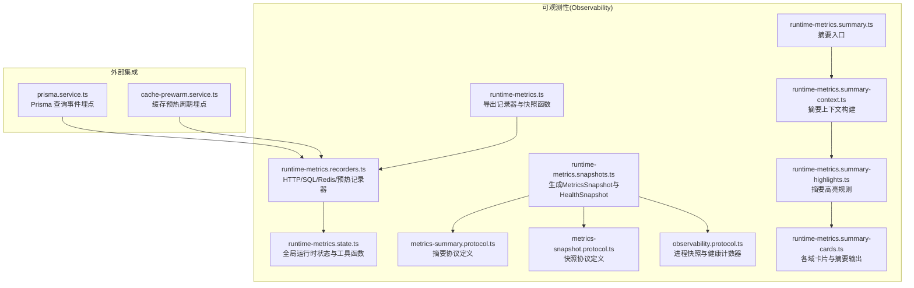
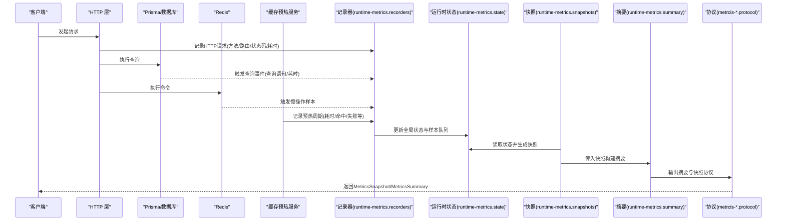
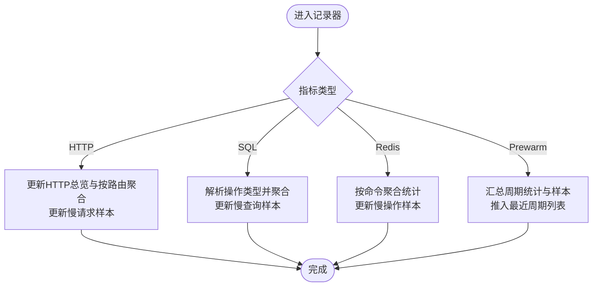
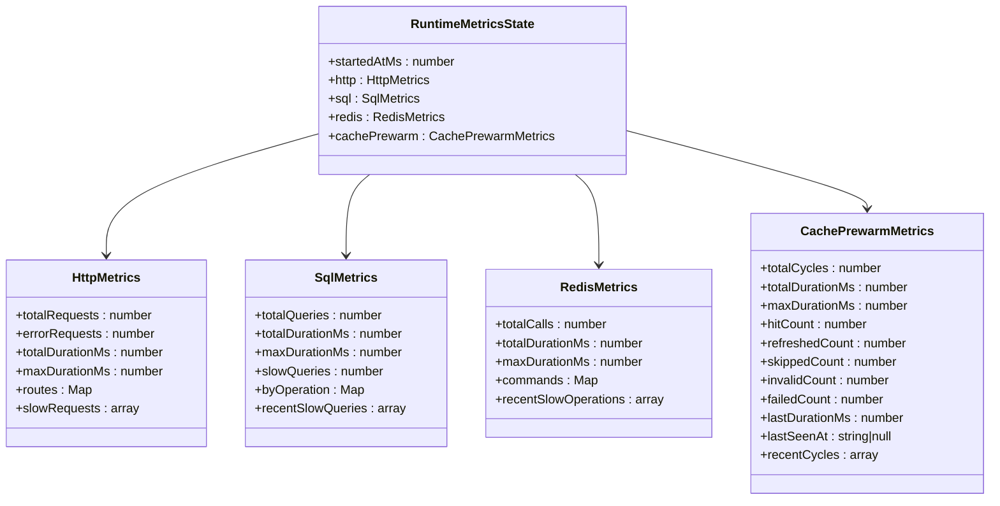
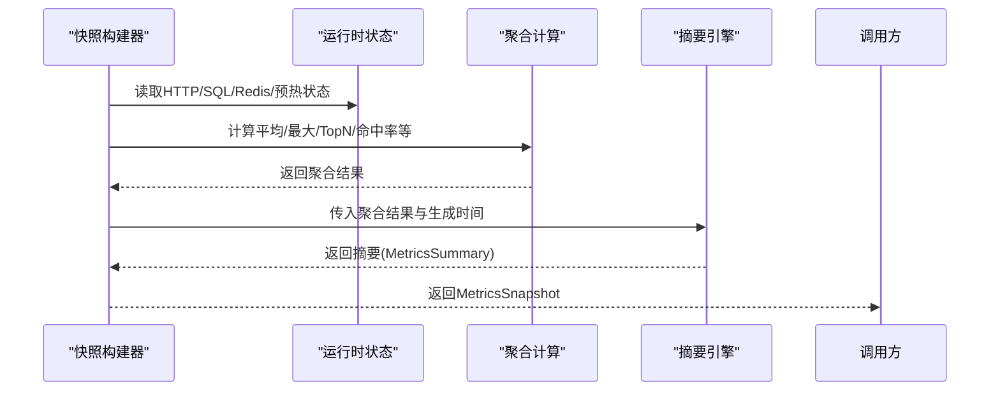
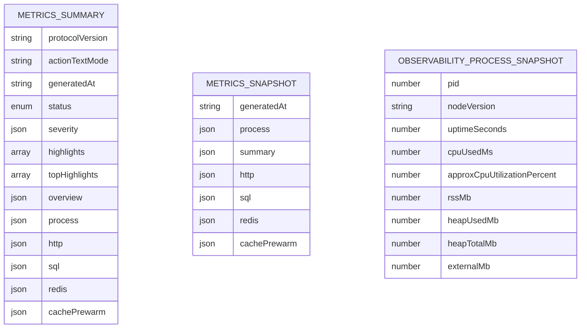
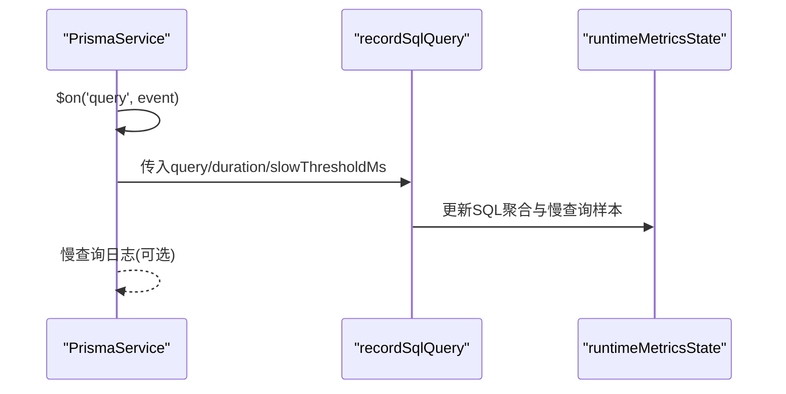
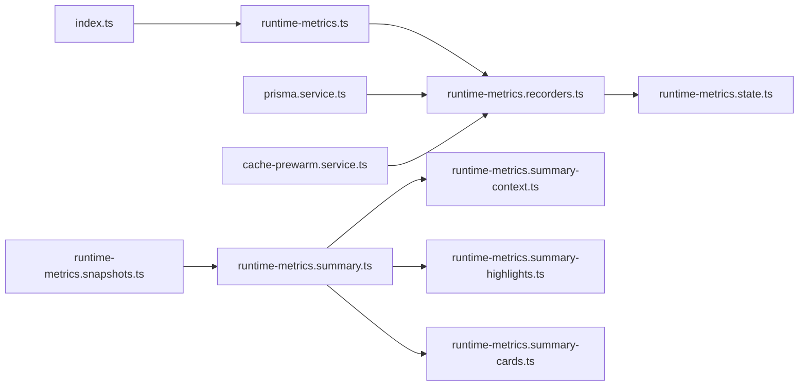

# 性能监控架构

<cite>
**本文引用的文件**
- [src/observability/index.ts](file://src/observability/index.ts)
- [src/observability/runtime-metrics.ts](file://src/observability/runtime-metrics.ts)
- [src/observability/metrics.protocol.ts](file://src/observability/metrics.protocol.ts)
- [src/observability/runtime-metrics.state.ts](file://src/observability/runtime-metrics.state.ts)
- [src/observability/runtime-metrics.recorders.ts](file://src/observability/runtime-metrics.recorders.ts)
- [src/observability/metrics-summary.protocol.ts](file://src/observability/metrics-summary.protocol.ts)
- [src/observability/metrics-snapshot.protocol.ts](file://src/observability/metrics-snapshot.protocol.ts)
- [src/observability/observability.protocol.ts](file://src/observability/observability.protocol.ts)
- [src/observability/runtime-metrics.snapshots.ts](file://src/observability/runtime-metrics.snapshots.ts)
- [src/observability/runtime-metrics.summary.ts](file://src/observability/runtime-metrics.summary.ts)
- [src/observability/runtime-metrics.summary-context.ts](file://src/observability/runtime-metrics.summary-context.ts)
- [src/observability/runtime-metrics.summary-highlights.ts](file://src/observability/runtime-metrics.summary-highlights.ts)
- [src/observability/runtime-metrics.summary-cards.ts](file://src/observability/runtime-metrics.summary-cards.ts)
- [src/redis/cache-prewarm.service.ts](file://src/redis/cache-prewarm.service.ts)
- [src/prisma/prisma.service.ts](file://src/prisma/prisma.service.ts)
</cite>

## 目录
1. [引言](#引言)
2. [项目结构](#项目结构)
3. [核心组件](#核心组件)
4. [架构总览](#架构总览)
5. [组件详解](#组件详解)
6. [依赖关系分析](#依赖关系分析)
7. [性能考量](#性能考量)
8. [故障排查指南](#故障排查指南)
9. [结论](#结论)
10. [附录](#附录)

## 引言
本技术文档面向“性能监控架构”，系统性阐述运行时指标收集体系的设计原理、指标记录器工作机制、状态管理实现方式，以及指标协议、数据采集与存储策略。文档同时提供配置示例、性能基准参考、监控面板集成方案、瓶颈识别方法、资源优化建议、容量规划指导，以及高并发场景下的监控策略与故障恢复机制。

## 项目结构
本仓库在 observability 子模块内实现了统一的运行时指标采集、快照生成与摘要聚合能力；在 Redis 缓存预热与 Prisma 数据库访问处埋点记录关键指标；通过协议层定义了快照与摘要的数据结构，便于与前端监控面板对接。

图表来源
- [src/observability/runtime-metrics.ts:1-12](file://src/observability/runtime-metrics.ts#L1-L12)
- [src/observability/runtime-metrics.recorders.ts:1-341](file://src/observability/runtime-metrics.recorders.ts#L1-L341)
- [src/observability/runtime-metrics.state.ts:1-256](file://src/observability/runtime-metrics.state.ts#L1-L256)
- [src/observability/runtime-metrics.snapshots.ts:1-366](file://src/observability/runtime-metrics.snapshots.ts#L1-L366)
- [src/observability/metrics-summary.protocol.ts:1-391](file://src/observability/metrics-summary.protocol.ts#L1-L391)
- [src/observability/metrics-snapshot.protocol.ts:1-198](file://src/observability/metrics-snapshot.protocol.ts#L1-L198)
- [src/observability/observability.protocol.ts:1-27](file://src/observability/observability.protocol.ts#L1-L27)
- [src/observability/runtime-metrics.summary.ts:1-26](file://src/observability/runtime-metrics.summary.ts#L1-L26)
- [src/observability/runtime-metrics.summary-context.ts:1-37](file://src/observability/runtime-metrics.summary-context.ts#L1-L37)
- [src/observability/runtime-metrics.summary-highlights.ts:1-21](file://src/observability/runtime-metrics.summary-highlights.ts#L1-L21)
- [src/observability/runtime-metrics.summary-cards.ts:1-342](file://src/observability/runtime-metrics.summary-cards.ts#L1-L342)
- [src/prisma/prisma.service.ts:1-64](file://src/prisma/prisma.service.ts#L1-L64)
- [src/redis/cache-prewarm.service.ts:1-165](file://src/redis/cache-prewarm.service.ts#L1-L165)

章节来源
- [src/observability/index.ts:1-4](file://src/observability/index.ts#L1-L4)
- [src/observability/runtime-metrics.ts:1-12](file://src/observability/runtime-metrics.ts#L1-L12)

## 核心组件
- 指标记录器：提供 HTTP 请求、SQL 查询、Redis 操作、缓存预热周期的记录接口，写入全局运行时状态。
- 全局运行时状态：集中维护各类指标计数、慢请求/慢查询/慢操作样本、最近周期等，含容量控制与采样上限。
- 快照生成器：将运行时状态转换为可序列化的快照（MetricsSnapshot）与健康快照（HealthSnapshot），并嵌入摘要（MetricsSummary）。
- 摘要引擎：基于上下文、严重度判定、高亮规则与卡片模板，输出标准化摘要协议。
- 协议层：定义快照与摘要的数据结构，确保前后端一致的交互契约。

章节来源
- [src/observability/runtime-metrics.recorders.ts:1-341](file://src/observability/runtime-metrics.recorders.ts#L1-L341)
- [src/observability/runtime-metrics.state.ts:1-256](file://src/observability/runtime-metrics.state.ts#L1-L256)
- [src/observability/runtime-metrics.snapshots.ts:1-366](file://src/observability/runtime-metrics.snapshots.ts#L1-L366)
- [src/observability/metrics-summary.protocol.ts:1-391](file://src/observability/metrics-summary.protocol.ts#L1-L391)
- [src/observability/metrics-snapshot.protocol.ts:1-198](file://src/observability/metrics-snapshot.protocol.ts#L1-L198)
- [src/observability/observability.protocol.ts:1-27](file://src/observability/observability.protocol.ts#L1-L27)
- [src/observability/runtime-metrics.summary.ts:1-26](file://src/observability/runtime-metrics.summary.ts#L1-L26)

## 架构总览
下图展示了从外部调用到最终输出摘要的整体流程：应用在关键路径埋点，记录器更新全局状态；快照生成器将状态转为快照与摘要；协议层保证结构化输出；前端监控面板消费快照与摘要进行可视化。

图表来源
- [src/observability/runtime-metrics.recorders.ts:50-114](file://src/observability/runtime-metrics.recorders.ts#L50-L114)
- [src/observability/runtime-metrics.recorders.ts:116-152](file://src/observability/runtime-metrics.recorders.ts#L116-L152)
- [src/observability/runtime-metrics.recorders.ts:154-210](file://src/observability/runtime-metrics.recorders.ts#L154-L210)
- [src/observability/runtime-metrics.recorders.ts:212-340](file://src/observability/runtime-metrics.recorders.ts#L212-L340)
- [src/observability/runtime-metrics.state.ts:149-224](file://src/observability/runtime-metrics.state.ts#L149-L224)
- [src/observability/runtime-metrics.snapshots.ts:326-350](file://src/observability/runtime-metrics.snapshots.ts#L326-L350)
- [src/observability/runtime-metrics.summary.ts:13-25](file://src/observability/runtime-metrics.summary.ts#L13-L25)
- [src/observability/metrics-summary.protocol.ts:376-390](file://src/observability/metrics-summary.protocol.ts#L376-L390)
- [src/observability/metrics-snapshot.protocol.ts:189-197](file://src/observability/metrics-snapshot.protocol.ts#L189-L197)

## 组件详解

### 运行时指标记录器
- HTTP 请求记录：统计总量、错误量、最大耗时、慢请求数与样本，按“方法+路由”维度聚合。
- SQL 查询记录：按首词解析操作类型，统计总量、慢查询数与样本，支持慢查询日志输出。
- Redis 操作记录：按命令聚合调用次数、命中/未命中、慢调用与样本。
- 缓存预热周期记录：记录周期耗时、命中/刷新/跳过/失效/失败数量、失败原因TopN、最热类别分位数与慢Key样本。

图表来源
- [src/observability/runtime-metrics.recorders.ts:50-114](file://src/observability/runtime-metrics.recorders.ts#L50-L114)
- [src/observability/runtime-metrics.recorders.ts:116-152](file://src/observability/runtime-metrics.recorders.ts#L116-L152)
- [src/observability/runtime-metrics.recorders.ts:154-210](file://src/observability/runtime-metrics.recorders.ts#L154-L210)
- [src/observability/runtime-metrics.recorders.ts:212-340](file://src/observability/runtime-metrics.recorders.ts#L212-L340)

章节来源
- [src/observability/runtime-metrics.recorders.ts:1-341](file://src/observability/runtime-metrics.recorders.ts#L1-L341)

### 全局运行时状态与容量控制
- 状态结构：包含 HTTP、SQL、Redis、缓存预热四域的计数器、聚合映射与样本队列。
- 容量控制：路由指标上限、样本上限、失败原因TopN上限、高亮TopN上限；提供队列裁剪与映射条目限制工具函数。
- 工具函数：四舍五入、SQL空白规范化、操作类型解析、时间戳格式化等。

图表来源
- [src/observability/runtime-metrics.state.ts:149-224](file://src/observability/runtime-metrics.state.ts#L149-L224)

章节来源
- [src/observability/runtime-metrics.state.ts:1-256](file://src/observability/runtime-metrics.state.ts#L1-L256)

### 快照与摘要生成
- 快照生成：计算进程资源、HTTP/SQL/Redis/预热的聚合指标与TopN样本，输出 MetricsSnapshot 与 HealthSnapshot。
- 摘要生成：构建上下文（聚合、严重度、动作元信息），汇总高亮，生成卡片与摘要对象，遵循协议版本与字段约束。

图表来源
- [src/observability/runtime-metrics.snapshots.ts:326-350](file://src/observability/runtime-metrics.snapshots.ts#L326-L350)
- [src/observability/runtime-metrics.summary.ts:13-25](file://src/observability/runtime-metrics.summary.ts#L13-L25)
- [src/observability/runtime-metrics.summary-context.ts:10-36](file://src/observability/runtime-metrics.summary-context.ts#L10-L36)
- [src/observability/runtime-metrics.summary-highlights.ts:10-20](file://src/observability/runtime-metrics.summary-highlights.ts#L10-L20)
- [src/observability/runtime-metrics.summary-cards.ts:313-341](file://src/observability/runtime-metrics.summary-cards.ts#L313-L341)

章节来源
- [src/observability/runtime-metrics.snapshots.ts:1-366](file://src/observability/runtime-metrics.snapshots.ts#L1-L366)
- [src/observability/runtime-metrics.summary.ts:1-26](file://src/observability/runtime-metrics.summary.ts#L1-L26)
- [src/observability/runtime-metrics.summary-context.ts:1-37](file://src/observability/runtime-metrics.summary-context.ts#L1-L37)
- [src/observability/runtime-metrics.summary-highlights.ts:1-21](file://src/observability/runtime-metrics.summary-highlights.ts#L1-L21)
- [src/observability/runtime-metrics.summary-cards.ts:1-342](file://src/observability/runtime-metrics.summary-cards.ts#L1-L342)

### 指标协议与数据模型
- 摘要协议：定义摘要版本、域、严重度、趋势、动作元信息、高亮、卡片字段与概览。
- 快照协议：定义进程、HTTP、SQL、Redis、缓存预热的快照结构，用于前后端一致传输。
- 观测协议：定义进程快照与健康计数器结构。

图表来源
- [src/observability/metrics-summary.protocol.ts:376-390](file://src/observability/metrics-summary.protocol.ts#L376-L390)
- [src/observability/metrics-snapshot.protocol.ts:189-197](file://src/observability/metrics-snapshot.protocol.ts#L189-L197)
- [src/observability/observability.protocol.ts:1-27](file://src/observability/observability.protocol.ts#L1-L27)

章节来源
- [src/observability/metrics-summary.protocol.ts:1-391](file://src/observability/metrics-summary.protocol.ts#L1-L391)
- [src/observability/metrics-snapshot.protocol.ts:1-198](file://src/observability/metrics-snapshot.protocol.ts#L1-L198)
- [src/observability/observability.protocol.ts:1-27](file://src/observability/observability.protocol.ts#L1-L27)

### 外部集成与埋点
- Prisma 集成：监听查询事件，调用 SQL 记录器并按阈值输出慢查询日志。
- 缓存预热：定时扫描键空间、并发预热、记录周期统计与慢Key样本，供摘要与面板诊断使用。

图表来源
- [src/prisma/prisma.service.ts:37-53](file://src/prisma/prisma.service.ts#L37-L53)
- [src/observability/runtime-metrics.recorders.ts:116-152](file://src/observability/runtime-metrics.recorders.ts#L116-L152)

章节来源
- [src/prisma/prisma.service.ts:1-64](file://src/prisma/prisma.service.ts#L1-L64)
- [src/redis/cache-prewarm.service.ts:1-165](file://src/redis/cache-prewarm.service.ts#L1-L165)

## 依赖关系分析
- 导出入口：index.ts 将协议、记录器与快照统一导出，便于上层模块按需引入。
- 记录器依赖状态：记录器直接写入全局状态，受容量控制与采样上限约束。
- 快照依赖摘要：快照生成器调用摘要构建器，摘要由上下文、高亮与卡片组成。
- 外部依赖：Prisma 与 Redis 作为外部系统，通过事件回调触发记录器。

图表来源
- [src/observability/index.ts:1-4](file://src/observability/index.ts#L1-L4)
- [src/observability/runtime-metrics.ts:1-12](file://src/observability/runtime-metrics.ts#L1-L12)
- [src/observability/runtime-metrics.recorders.ts:1-12](file://src/observability/runtime-metrics.recorders.ts#L1-L12)
- [src/observability/runtime-metrics.state.ts:1-12](file://src/observability/runtime-metrics.state.ts#L1-L12)
- [src/observability/runtime-metrics.snapshots.ts:1-3](file://src/observability/runtime-metrics.snapshots.ts#L1-L3)
- [src/observability/runtime-metrics.summary.ts:1-11](file://src/observability/runtime-metrics.summary.ts#L1-L11)
- [src/prisma/prisma.service.ts:6-6](file://src/prisma/prisma.service.ts#L6-L6)
- [src/redis/cache-prewarm.service.ts:3-3](file://src/redis/cache-prewarm.service.ts#L3-L3)

章节来源
- [src/observability/index.ts:1-4](file://src/observability/index.ts#L1-L4)
- [src/observability/runtime-metrics.ts:1-12](file://src/observability/runtime-metrics.ts#L1-L12)

## 性能考量
- 内存与CPU开销：记录器与快照构建均为纯内存计算，避免额外IO；注意样本上限与映射条目上限以控制内存增长。
- 采样与聚合：慢请求/慢查询/慢操作均采用固定长度样本队列，避免无限增长；按方法/路由、操作类型、命令维度聚合，减少冗余。
- I/O 与日志：慢查询日志仅在超过阈值时输出，降低I/O压力；Redis慢操作样本同样受控。
- 并发与批处理：缓存预热支持并发与批次，平衡吞吐与资源占用；可通过配置调整批量大小与并发度。
- 摘要复杂度：摘要构建为线性复杂度，主要瓶颈在TopN排序与聚合计算，建议在高频场景下调低TopN规模或采样频率。

## 故障排查指南
- HTTP 异常定位：查看 HTTP 卡片的错误率、慢请求占比与 Top 路由，结合慢请求样本定位具体接口。
- SQL 慢查询定位：查看 SQL 卡片的慢查询率、最大耗时与按操作类型的 TopN，结合慢查询样本与查询预览定位热点SQL。
- Redis 命中率与慢操作：查看 Redis 卡片的总体命中率、慢操作数与Top命令，结合慢操作样本定位热点命令。
- 缓存预热问题：查看缓存预热卡片的失败率、无效Key数、最热类别P95与失败原因TopN，结合最近周期与慢Key样本定位失败根因。
- 健康快照：通过 HealthSnapshot 获取进程资源与计数器快照，辅助判断实例健康状况。

章节来源
- [src/observability/runtime-metrics.summary-cards.ts:102-146](file://src/observability/runtime-metrics.summary-cards.ts#L102-L146)
- [src/observability/runtime-metrics.summary-cards.ts:149-189](file://src/observability/runtime-metrics.summary-cards.ts#L149-L189)
- [src/observability/runtime-metrics.summary-cards.ts:192-245](file://src/observability/runtime-metrics.summary-cards.ts#L192-L245)
- [src/observability/runtime-metrics.summary-cards.ts:248-311](file://src/observability/runtime-metrics.summary-cards.ts#L248-L311)
- [src/observability/runtime-metrics.snapshots.ts:352-365](file://src/observability/runtime-metrics.snapshots.ts#L352-L365)

## 结论
该性能监控架构以轻量、可扩展为核心设计目标：通过统一的记录器与协议，将HTTP、SQL、Redis与缓存预热的关键指标纳入统一状态；快照与摘要生成器提供标准化输出，便于前端监控面板集成。配合容量控制与采样策略，可在高并发场景下保持低开销与高可用。

## 附录

### 配置示例（节选）
- 缓存预热开关与参数
  - app.cachePrewarmEnabled: 是否启用
  - app.cachePrewarmIntervalMs: 预热间隔毫秒
  - app.cachePrewarmInitialDelayMs: 初始延迟毫秒
  - app.cachePrewarmBatchSize: 批量大小
  - app.cachePrewarmConcurrency: 并发度
  - app.cachePrewarmLogEnabled: 是否输出周期日志
  - app.cachePrewarmLogSampleEvery: 日志采样间隔
  - app.cachePrewarmSlowCycleThresholdMs: 慢周期阈值
- 慢查询日志
  - app.slowQueryLogEnabled: 是否输出慢查询日志
  - app.slowQueryThresholdMs: 慢查询阈值
- 数据库连接池
  - database.url: 连接字符串
  - database.poolMax: 最大连接数
  - database.poolIdleTimeoutMs: 空闲超时
  - database.poolConnectionTimeoutMs: 连接超时

章节来源
- [src/redis/cache-prewarm.service.ts:42-63](file://src/redis/cache-prewarm.service.ts#L42-L63)
- [src/prisma/prisma.service.ts:13-35](file://src/prisma/prisma.service.ts#L13-L35)

### 监控面板集成方案
- 接口：暴露快照与摘要的HTTP端点，返回 MetricsSnapshot 与 MetricsSummary。
- 面板：根据协议字段渲染卡片与表格，支持点击动作打开对应诊断面板与标签页。
- 实时性：建议每秒或每5秒拉取一次快照，结合摘要高亮进行告警联动。

章节来源
- [src/observability/metrics-snapshot.protocol.ts:189-197](file://src/observability/metrics-snapshot.protocol.ts#L189-L197)
- [src/observability/metrics-summary.protocol.ts:376-390](file://src/observability/metrics-summary.protocol.ts#L376-L390)

### 性能基准参考（示例）
- HTTP：慢请求阈值建议 500–1000ms；Top 路由取前20。
- SQL：慢查询阈值建议 50–150ms；按操作类型TopN取前10。
- Redis：慢操作阈值建议 10–50ms；总体命中率低于85%视为异常。
- 缓存预热：周期阈值建议 1000–2000ms；失败率高于5%视为异常。

章节来源
- [src/observability/runtime-metrics.recorders.ts:50-114](file://src/observability/runtime-metrics.recorders.ts#L50-L114)
- [src/observability/runtime-metrics.recorders.ts:116-152](file://src/observability/runtime-metrics.recorders.ts#L116-L152)
- [src/observability/runtime-metrics.recorders.ts:154-210](file://src/observability/runtime-metrics.recorders.ts#L154-L210)
- [src/redis/cache-prewarm.service.ts:60-63](file://src/redis/cache-prewarm.service.ts#L60-L63)

### 高并发场景策略
- 限流与降采样：在高峰期降低样本长度与TopN规模，或提高阈值。
- 分片与分区：按租户/门店维度拆分快照与摘要，降低单实例负载。
- 异步与缓冲：将慢查询日志与周期日志异步输出，避免阻塞主流程。

### 故障恢复机制
- 预热失败：记录失败原因与最后失败Key，周期性重试与告警。
- 数据库抖动：动态提升慢查询阈值，待稳定后恢复。
- Redis 热点：临时降级或增加缓存副本，优化键空间与过期策略。