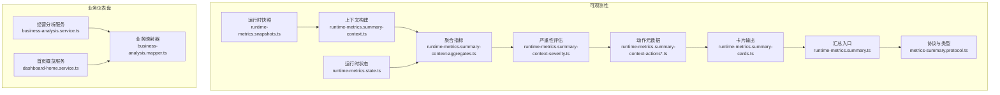
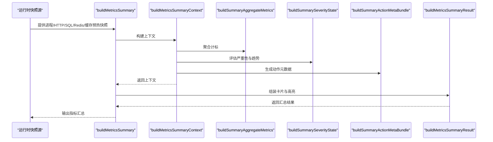
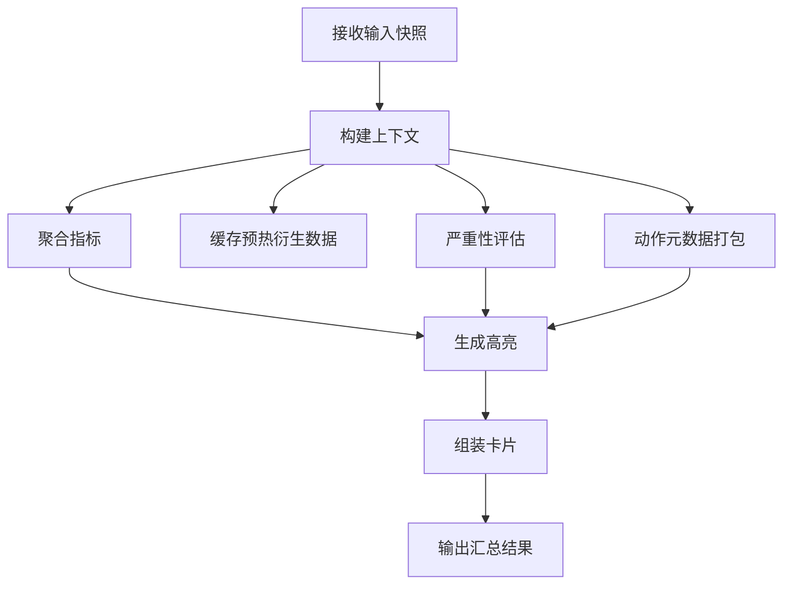
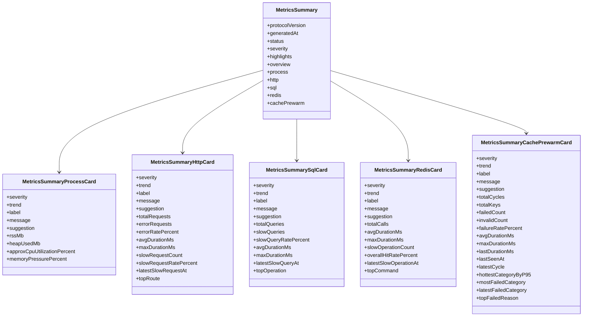
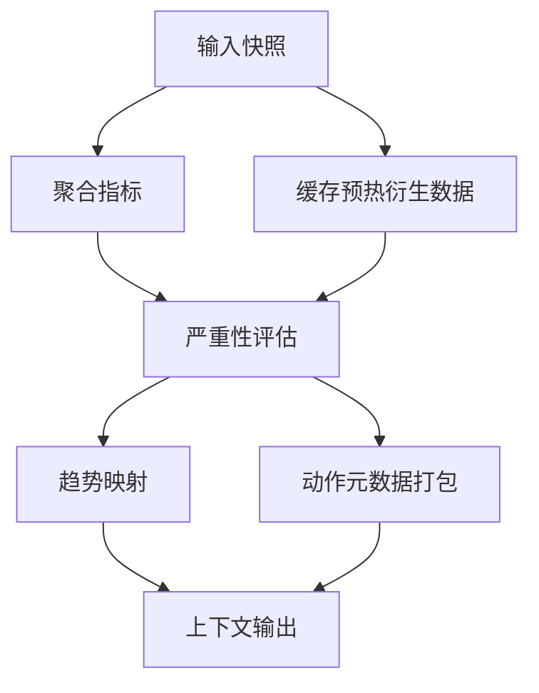
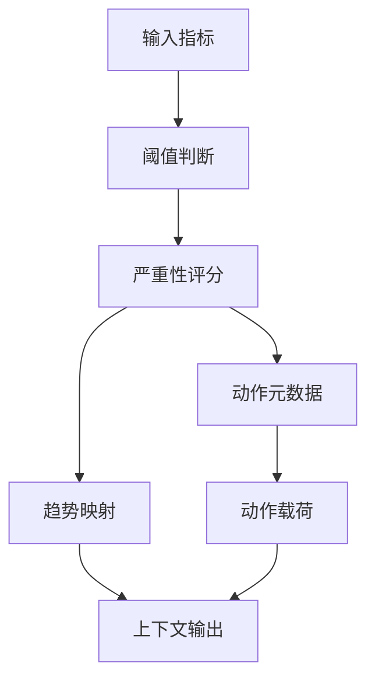
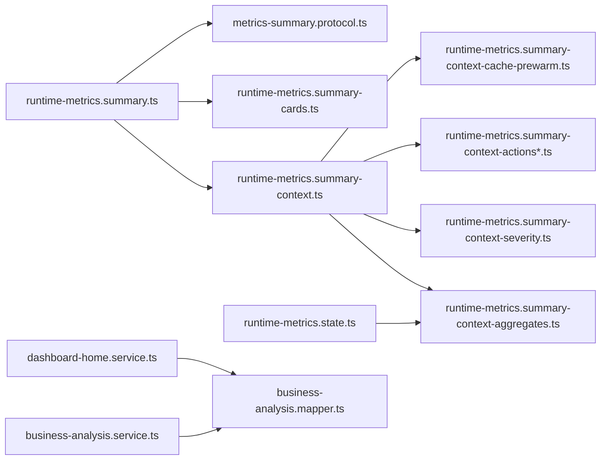

# 指标汇总系统

<cite>
**本文引用的文件**
- [src/observability/runtime-metrics.summary.ts](file://src/observability/runtime-metrics.summary.ts)
- [src/observability/runtime-metrics.summary-context.ts](file://src/observability/runtime-metrics.summary-context.ts)
- [src/observability/runtime-metrics.summary-context-severity.ts](file://src/observability/runtime-metrics.summary-context-severity.ts)
- [src/observability/runtime-metrics.summary-context-aggregates.ts](file://src/observability/runtime-metrics.summary-context-aggregates.ts)
- [src/observability/runtime-metrics.summary-context-actions.ts](file://src/observability/runtime-metrics.summary-context-actions.ts)
- [src/observability/runtime-metrics.summary-context-actions-process.ts](file://src/observability/runtime-metrics.summary-context-actions-process.ts)
- [src/observability/runtime-metrics.summary-context-actions-shared.ts](file://src/observability/runtime-metrics.summary-context-actions-shared.ts)
- [src/observability/runtime-metrics.summary-context-cache-prewarm.ts](file://src/observability/runtime-metrics.summary-context-cache-prewarm.ts)
- [src/observability/runtime-metrics.summary-context-types.ts](file://src/observability/runtime-metrics.summary-context-types.ts)
- [src/observability/runtime-metrics.summary-helpers.ts](file://src/observability/runtime-metrics.summary-helpers.ts)
- [src/observability/runtime-metrics.summary-actions.ts](file://src/observability/runtime-metrics.summary-actions.ts)
- [src/observability/runtime-metrics.summary-cards.ts](file://src/observability/runtime-metrics.summary-cards.ts)
- [src/observability/metrics-summary.protocol.ts](file://src/observability/metrics-summary.protocol.ts)
- [src/observability/runtime-metrics.state.ts](file://src/observability/runtime-metrics.state.ts)
- [src/observability/runtime-metrics.snapshots.ts](file://src/observability/runtime-metrics.snapshots.ts)
- [src/purely-profit/dashboard/business-analysis/business-analysis.service.ts](file://src/purely-profit/dashboard/business-analysis/business-analysis.service.ts)
- [src/purely-profit/dashboard/business-analysis/business-analysis.mapper.ts](file://src/purely-profit/dashboard/business-analysis/business-analysis.mapper.ts)
- [src/purely-profit/dashboard/dashboard-home/dashboard-home.service.ts](file://src/purely-profit/dashboard/dashboard-home/dashboard-home.service.ts)
- [src/purely-profit/dashboard/dashboard-home/dashboard-home.utils.ts](file://src/purely-profit/dashboard/dashboard-home/dashboard-home.utils.ts)
- [src/purely-profit/dashboard/profit-detail/profit-detail.utils.spec.ts](file://src/purely-profit/dashboard/profit-detail/profit-detail.utils.spec.ts)
</cite>

## 目录
1. [简介](#简介)
2. [项目结构](#项目结构)
3. [核心组件](#核心组件)
4. [架构总览](#架构总览)
5. [详细组件分析](#详细组件分析)
6. [依赖关系分析](#依赖关系分析)
7. [性能考量](#性能考量)
8. [故障排查指南](#故障排查指南)
9. [结论](#结论)
10. [附录](#附录)

## 简介
本文件为“指标汇总系统”的全面技术文档，聚焦以下目标：
- 指标摘要生成算法：从多源运行时快照构建综合健康状态、趋势与高亮建议。
- 卡片式展示组件设计原理：按域（进程、HTTP、SQL、Redis、缓存预热）输出可操作的卡片信息。
- 上下文分析模块实现机制：聚合指标、计算严重性、推导趋势、生成动作元数据。
- 动作跟踪、严重性评估与聚合计算流程：明确阈值规则、趋势映射与动作载荷构造。
- 指标计算公式、数据处理管道与结果缓存策略：覆盖百分比、命中率、失败率等指标与缓存 TTL/刷新策略。
- 可视化配置示例、自定义指标模板与报表生成方案：基于协议与类型定义扩展。
- 大数据量处理优化、实时性保证与准确性校验机制：结合缓存预热、后台刷新与采样统计。

## 项目结构
本系统围绕“可观测性指标汇总”与“业务仪表盘”两条主线组织：
- 运行时指标汇总：收集进程、HTTP、SQL、Redis、缓存预热等快照，通过上下文构建器聚合、评估严重性、生成高亮与卡片。
- 业务分析与首页概览：对销售、成本、收入等业务指标进行聚合与对比，并采用 Redis 缓存提升响应速度。

图表来源
- [src/observability/runtime-metrics.summary.ts:1-26](file://src/observability/runtime-metrics.summary.ts#L1-L26)
- [src/observability/runtime-metrics.summary-context.ts:1-37](file://src/observability/runtime-metrics.summary-context.ts#L1-L37)
- [src/observability/runtime-metrics.summary-context-aggregates.ts:1-64](file://src/observability/runtime-metrics.summary-context-aggregates.ts#L1-L64)
- [src/observability/runtime-metrics.summary-context-severity.ts:1-129](file://src/observability/runtime-metrics.summary-context-severity.ts#L1-L129)
- [src/observability/runtime-metrics.summary-context-actions.ts](file://src/observability/runtime-metrics.summary-context-actions.ts)
- [src/observability/runtime-metrics.summary-cards.ts:1-69](file://src/observability/runtime-metrics.summary-cards.ts#L1-L69)
- [src/observability/metrics-summary.protocol.ts:1-391](file://src/observability/metrics-summary.protocol.ts#L1-L391)
- [src/observability/runtime-metrics.state.ts:71-119](file://src/observability/runtime-metrics.state.ts#L71-L119)
- [src/purely-profit/dashboard/business-analysis/business-analysis.service.ts:1-212](file://src/purely-profit/dashboard/business-analysis/business-analysis.service.ts#L1-L212)
- [src/purely-profit/dashboard/business-analysis/business-analysis.mapper.ts:1-61](file://src/purely-profit/dashboard/business-analysis/business-analysis.mapper.ts#L1-L61)
- [src/purely-profit/dashboard/dashboard-home/dashboard-home.service.ts:1-144](file://src/purely-profit/dashboard/dashboard-home/dashboard-home.service.ts#L1-L144)

章节来源
- [src/observability/runtime-metrics.summary.ts:1-26](file://src/observability/runtime-metrics.summary.ts#L1-L26)
- [src/observability/runtime-metrics.summary-context.ts:1-37](file://src/observability/runtime-metrics.summary-context.ts#L1-L37)
- [src/purely-profit/dashboard/business-analysis/business-analysis.service.ts:1-212](file://src/purely-profit/dashboard/business-analysis/business-analysis.service.ts#L1-L212)

## 核心组件
- 汇总入口与流水线
  - 入口函数接收多域快照，依次构建上下文、生成高亮、最终输出汇总结果。
  - 关键路径：runtime-metrics.summary.ts → runtime-metrics.summary-context.ts → runtime-metrics.summary-cards.ts。
- 上下文构建器
  - 聚合指标、缓存预热衍生指标、严重性状态与动作元数据打包。
  - 输入：SummaryMetricsInput；输出：SummaryBuildContext。
- 聚合指标
  - 计算 HTTP/SQL/Redis/缓存预热总体指标，如慢请求数、慢查询数、命中率、失败率等。
- 严重性评估
  - 基于阈值规则对各域打分，形成健康状态与趋势映射。
- 动作元数据
  - 为每个域生成可点击的动作元数据，包括目标面板、标签页、参数与载荷。
- 协议与类型
  - 定义域、严重性、趋势、动作类型、卡片结构与汇总结果的完整契约。

章节来源
- [src/observability/runtime-metrics.summary.ts:1-26](file://src/observability/runtime-metrics.summary.ts#L1-L26)
- [src/observability/runtime-metrics.summary-context.ts:1-37](file://src/observability/runtime-metrics.summary-context.ts#L1-L37)
- [src/observability/runtime-metrics.summary-context-aggregates.ts:1-64](file://src/observability/runtime-metrics.summary-context-aggregates.ts#L1-L64)
- [src/observability/runtime-metrics.summary-context-severity.ts:1-129](file://src/observability/runtime-metrics.summary-context-severity.ts#L1-L129)
- [src/observability/runtime-metrics.summary-context-actions.ts](file://src/observability/runtime-metrics.summary-context-actions.ts)
- [src/observability/runtime-metrics.summary-cards.ts:1-69](file://src/observability/runtime-metrics.summary-cards.ts#L1-L69)
- [src/observability/metrics-summary.protocol.ts:1-391](file://src/observability/metrics-summary.protocol.ts#L1-L391)

## 架构总览
下图展示指标汇总从输入到输出的关键交互：

图表来源
- [src/observability/runtime-metrics.summary.ts:13-25](file://src/observability/runtime-metrics.summary.ts#L13-L25)
- [src/observability/runtime-metrics.summary-context.ts:10-36](file://src/observability/runtime-metrics.summary-context.ts#L10-L36)
- [src/observability/runtime-metrics.summary-context-aggregates.ts:8-63](file://src/observability/runtime-metrics.summary-context-aggregates.ts#L8-L63)
- [src/observability/runtime-metrics.summary-context-severity.ts:22-128](file://src/observability/runtime-metrics.summary-context-severity.ts#L22-L128)
- [src/observability/runtime-metrics.summary-cards.ts:60-69](file://src/observability/runtime-metrics.summary-cards.ts#L60-L69)

## 详细组件分析

### 指标摘要生成算法
- 输入：包含生成时间戳与各域快照的 SummaryMetricsInput。
- 流程：
  1) 构建上下文：聚合指标、缓存预热衍生数据、严重性状态、动作元数据。
  2) 生成高亮：根据严重性与优先级排序，形成 Top 高亮列表。
  3) 组装卡片：按域输出卡片，包含严重性、趋势、消息、建议与动作元数据。
- 输出：MetricsSummary，包含协议版本、生成时间、整体状态、域级严重性、高亮、概览与各域卡片。

图表来源
- [src/observability/runtime-metrics.summary.ts:13-25](file://src/observability/runtime-metrics.summary.ts#L13-L25)
- [src/observability/runtime-metrics.summary-context.ts:10-36](file://src/observability/runtime-metrics.summary-context.ts#L10-L36)
- [src/observability/runtime-metrics.summary-context-aggregates.ts:8-63](file://src/observability/runtime-metrics.summary-context-aggregates.ts#L8-L63)
- [src/observability/runtime-metrics.summary-context-severity.ts:22-128](file://src/observability/runtime-metrics.summary-context-severity.ts#L22-L128)
- [src/observability/runtime-metrics.summary-cards.ts:60-69](file://src/observability/runtime-metrics.summary-cards.ts#L60-L69)

章节来源
- [src/observability/runtime-metrics.summary.ts:1-26](file://src/observability/runtime-metrics.summary.ts#L1-L26)
- [src/observability/runtime-metrics.summary-context.ts:1-37](file://src/observability/runtime-metrics.summary-context.ts#L1-L37)

### 卡片式展示组件设计原理
- 设计要点：
  - 每个域（进程、HTTP、SQL、Redis、缓存预热）输出独立卡片，包含严重性、趋势、标签、消息、建议与动作元数据。
  - 动作元数据统一格式，便于前端路由到对应诊断面板与标签页。
- 数据来源：
  - 上下文中的聚合指标、严重性状态、动作元数据与缓存预热衍生数据。
- 类型契约：
  - 协议文件定义了各域卡片的数据结构与字段约束。

图表来源
- [src/observability/metrics-summary.protocol.ts:213-391](file://src/observability/metrics-summary.protocol.ts#L213-L391)

章节来源
- [src/observability/runtime-metrics.summary-cards.ts:1-69](file://src/observability/runtime-metrics.summary-cards.ts#L1-L69)
- [src/observability/metrics-summary.protocol.ts:1-391](file://src/observability/metrics-summary.protocol.ts#L1-L391)

### 上下文分析模块实现机制
- 聚合计标
  - 对 HTTP/Redis/缓存预热进行全局聚合，计算慢请求/慢调用总数、命中/未命中总数、失败/无效键总数等。
  - 计算各类百分比指标：错误率、慢请求率、慢查询率、命中率、失败率。
- 缓存预热衍生数据
  - 基于最近周期采样，提取最热类别、失败原因分布、最后失败键与样本等。
- 严重性状态
  - 依据阈值规则对各域打分，形成整体状态与趋势映射。
- 动作元数据
  - 为每个域生成动作 ID、目标面板、标签页、参数与载荷，支持不同严重性与焦点。

图表来源
- [src/observability/runtime-metrics.summary-context-aggregates.ts:8-63](file://src/observability/runtime-metrics.summary-context-aggregates.ts#L8-L63)
- [src/observability/runtime-metrics.summary-context-cache-prewarm.ts:78-117](file://src/observability/runtime-metrics.summary-context-cache-prewarm.ts#L78-L117)
- [src/observability/runtime-metrics.summary-context-severity.ts:22-128](file://src/observability/runtime-metrics.summary-context-severity.ts#L22-L128)
- [src/observability/runtime-metrics.summary-context-actions.ts](file://src/observability/runtime-metrics.summary-context-actions.ts)

章节来源
- [src/observability/runtime-metrics.summary-context-aggregates.ts:1-64](file://src/observability/runtime-metrics.summary-context-aggregates.ts#L1-L64)
- [src/observability/runtime-metrics.summary-context-cache-prewarm.ts:78-117](file://src/observability/runtime-metrics.summary-context-cache-prewarm.ts#L78-L117)
- [src/observability/runtime-metrics.summary-context-severity.ts:1-129](file://src/observability/runtime-metrics.summary-context-severity.ts#L1-L129)
- [src/observability/runtime-metrics.summary-context-actions.ts](file://src/observability/runtime-metrics.summary-context-actions.ts)

### 动作跟踪、严重性评估与聚合计算流程
- 严重性评估（阈值规则）
  - 进程：CPU 利用率、内存压力、RSS 阈值分级。
  - HTTP：错误率、最大延迟、慢请求率分级。
  - SQL：慢查询率、最大延迟分级。
  - Redis：命中率、最大延迟、慢调用数分级。
  - 缓存预热：失败率、最近周期失败数、最大延迟分级。
- 趋势映射
  - 基于严重性映射稳定/关注/恶化。
- 聚合计算
  - 使用运行时状态中的采样集合进行全局求和与百分比计算。
- 动作载荷
  - 根据域与焦点（CPU/堆/RSS、错误/延迟、慢查询、低命中/慢操作、失败样本/最近周期）构造面板与标签页。

图表来源
- [src/observability/runtime-metrics.summary-context-severity.ts:47-106](file://src/observability/runtime-metrics.summary-context-severity.ts#L47-L106)
- [src/observability/runtime-metrics.summary-helpers.ts:30-40](file://src/observability/runtime-metrics.summary-helpers.ts#L30-L40)
- [src/observability/runtime-metrics.summary-context-aggregates.ts:36-61](file://src/observability/runtime-metrics.summary-context-aggregates.ts#L36-L61)
- [src/observability/runtime-metrics.summary-actions.ts:9-92](file://src/observability/runtime-metrics.summary-actions.ts#L9-L92)

章节来源
- [src/observability/runtime-metrics.summary-context-severity.ts:1-129](file://src/observability/runtime-metrics.summary-context-severity.ts#L1-L129)
- [src/observability/runtime-metrics.summary-helpers.ts:1-80](file://src/observability/runtime-metrics.summary-helpers.ts#L1-L80)
- [src/observability/runtime-metrics.summary-context-aggregates.ts:1-64](file://src/observability/runtime-metrics.summary-context-aggregates.ts#L1-L64)
- [src/observability/runtime-metrics.summary-actions.ts:1-93](file://src/observability/runtime-metrics.summary-actions.ts#L1-L93)

### 指标计算公式与数据处理管道
- 百分比类指标
  - 错误率/慢请求率/慢查询率/命中率/失败率：分子/分母 × 100，保留合理精度。
- 内存压力
  - 堆压力百分比 = 已用堆 / 总堆 × 100。
- 缓存预热
  - 总键数 = 命中 + 刷新 + 跳过 + 无效 + 失败；失败率 = 失败数 / 总键数。
- 数据处理管道
  - 从运行时状态采样集合汇总，再计算派生指标，最后进入严重性评估与动作元数据生成。

章节来源
- [src/observability/runtime-metrics.summary-context-aggregates.ts:36-61](file://src/observability/runtime-metrics.summary-context-aggregates.ts#L36-L61)
- [src/observability/runtime-metrics.state.ts:71-119](file://src/observability/runtime-metrics.state.ts#L71-L119)
- [src/observability/runtime-metrics.summary-helpers.ts:15-20](file://src/observability/runtime-metrics.summary-helpers.ts#L15-L20)

### 结果缓存策略
- 业务分析缓存
  - 缓存键：基于门店与查询范围生成；命中则异步调度刷新任务，确保低延迟返回。
  - TTL：默认 120 秒；刷新间隔：30 秒。
- 首页概览缓存
  - 缓存键：基于门店与周期生成；TTL：30 秒。
- 缓存预热监控
  - 采样最近周期的慢键与失败原因，用于生成高亮与诊断建议。

章节来源
- [src/purely-profit/dashboard/business-analysis/business-analysis.service.ts:76-142](file://src/purely-profit/dashboard/business-analysis/business-analysis.service.ts#L76-L142)
- [src/purely-profit/dashboard/dashboard-home/dashboard-home.service.ts:55-99](file://src/purely-profit/dashboard/dashboard-home/dashboard-home.service.ts#L55-L99)
- [src/observability/runtime-metrics.snapshots.ts:236-289](file://src/observability/runtime-metrics.snapshots.ts#L236-L289)

### 可视化配置示例、自定义指标模板与报表生成方案
- 可视化配置示例
  - 基于协议中的卡片结构与动作载荷，前端可直接渲染各域卡片并绑定点击事件到对应面板。
- 自定义指标模板
  - 在协议中扩展域、动作类型或卡片字段，保持向后兼容与版本控制。
- 报表生成方案
  - 业务分析服务支持导出模式，绕过缓存直接生成报表数据。

章节来源
- [src/observability/metrics-summary.protocol.ts:1-391](file://src/observability/metrics-summary.protocol.ts#L1-L391)
- [src/purely-profit/dashboard/business-analysis/business-analysis.service.ts:68-74](file://src/purely-profit/dashboard/business-analysis/business-analysis.service.ts#L68-L74)

## 依赖关系分析
- 组件耦合
  - 汇总入口仅依赖上下文构建器与高亮生成器，保持高内聚低耦合。
  - 上下文构建器依赖聚合、严重性、动作与缓存预热衍生模块，形成清晰职责边界。
- 外部依赖
  - 运行时状态提供采样集合；Redis 用于业务分析与首页概览缓存；Prisma 用于业务数据查询。

图表来源
- [src/observability/runtime-metrics.summary.ts:1-26](file://src/observability/runtime-metrics.summary.ts#L1-L26)
- [src/observability/runtime-metrics.summary-context.ts:1-37](file://src/observability/runtime-metrics.summary-context.ts#L1-L37)
- [src/observability/runtime-metrics.summary-context-aggregates.ts:1-64](file://src/observability/runtime-metrics.summary-context-aggregates.ts#L1-L64)
- [src/observability/runtime-metrics.summary-context-severity.ts:1-129](file://src/observability/runtime-metrics.summary-context-severity.ts#L1-L129)
- [src/observability/runtime-metrics.summary-context-actions.ts](file://src/observability/runtime-metrics.summary-context-actions.ts)
- [src/observability/runtime-metrics.summary-context-cache-prewarm.ts:78-117](file://src/observability/runtime-metrics.summary-context-cache-prewarm.ts#L78-L117)
- [src/observability/runtime-metrics.summary-cards.ts:1-69](file://src/observability/runtime-metrics.summary-cards.ts#L1-L69)
- [src/observability/metrics-summary.protocol.ts:1-391](file://src/observability/metrics-summary.protocol.ts#L1-L391)
- [src/observability/runtime-metrics.state.ts:71-119](file://src/observability/runtime-metrics.state.ts#L71-L119)
- [src/purely-profit/dashboard/business-analysis/business-analysis.service.ts:1-212](file://src/purely-profit/dashboard/business-analysis/business-analysis.service.ts#L1-L212)
- [src/purely-profit/dashboard/business-analysis/business-analysis.mapper.ts:1-61](file://src/purely-profit/dashboard/business-analysis/business-analysis.mapper.ts#L1-L61)
- [src/purely-profit/dashboard/dashboard-home/dashboard-home.service.ts:1-144](file://src/purely-profit/dashboard/dashboard-home/dashboard-home.service.ts#L1-L144)

章节来源
- [src/observability/runtime-metrics.summary.ts:1-26](file://src/observability/runtime-metrics.summary.ts#L1-L26)
- [src/observability/runtime-metrics.summary-context.ts:1-37](file://src/observability/runtime-metrics.summary-context.ts#L1-L37)

## 性能考量
- 大数据量处理优化
  - 使用运行时状态中的采样集合进行全局聚合，避免全量扫描。
  - 缓存预热慢键采样与失败原因统计，减少全量分析开销。
- 实时性保证
  - 业务分析与首页概览采用短 TTL 与后台刷新，降低首字节延迟。
  - 缓存预热周期采样与 P95 统计，快速定位热点与失败原因。
- 准确性校验机制
  - 通过协议版本与动作文本模式控制输出一致性。
  - 严重性评估采用阈值规则与趋势映射，确保状态判定稳定。

## 故障排查指南
- 缓存预热失败定位
  - 查看最近失败键与样本，结合错误标签与失败原因进行根因分析。
- 高亮优先级排序
  - 依据严重性等级、优先级、域与代码排序，优先处理高危问题。
- 动作直达诊断
  - 根据动作载荷自动跳转到对应面板与标签页，快速定位问题。

章节来源
- [src/observability/runtime-metrics.summary-helpers.ts:68-79](file://src/observability/runtime-metrics.summary-helpers.ts#L68-L79)
- [src/observability/runtime-metrics.summary-context-cache-prewarm.ts:78-117](file://src/observability/runtime-metrics.summary-context-cache-prewarm.ts#L78-L117)
- [src/observability/runtime-metrics.summary-actions.ts:74-92](file://src/observability/runtime-metrics.summary-actions.ts#L74-L92)

## 结论
本系统通过“运行时快照 → 上下文构建 → 严重性评估 → 动作元数据 → 卡片输出”的流水线，实现了对多域指标的统一汇总与可视化呈现。配合业务分析与首页概览的缓存策略，兼顾实时性与准确性。协议化的类型定义与动作载荷设计，为扩展自定义指标模板与报表生成提供了清晰路径。

## 附录
- 时间范围工具与测试参考
  - 业务分析与首页概览的时间范围构建与归一化逻辑，以及相关单元测试用例。

章节来源
- [src/purely-profit/dashboard/business-analysis/business-analysis.mapper.ts:27-61](file://src/purely-profit/dashboard/business-analysis/business-analysis.mapper.ts#L27-L61)
- [src/purely-profit/dashboard/dashboard-home/dashboard-home.utils.ts:1-8](file://src/purely-profit/dashboard/dashboard-home/dashboard-home.utils.ts#L1-L8)
- [src/purely-profit/dashboard/profit-detail/profit-detail.utils.spec.ts:50-96](file://src/purely-profit/dashboard/profit-detail/profit-detail.utils.spec.ts#L50-L96)