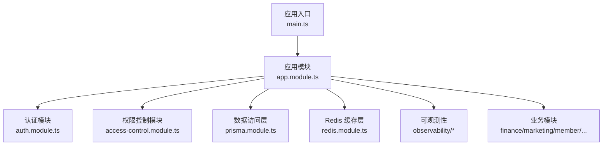
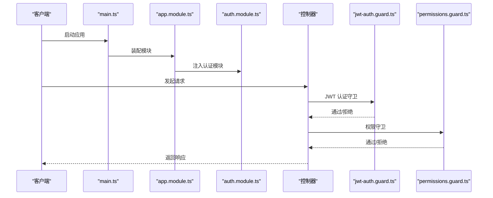
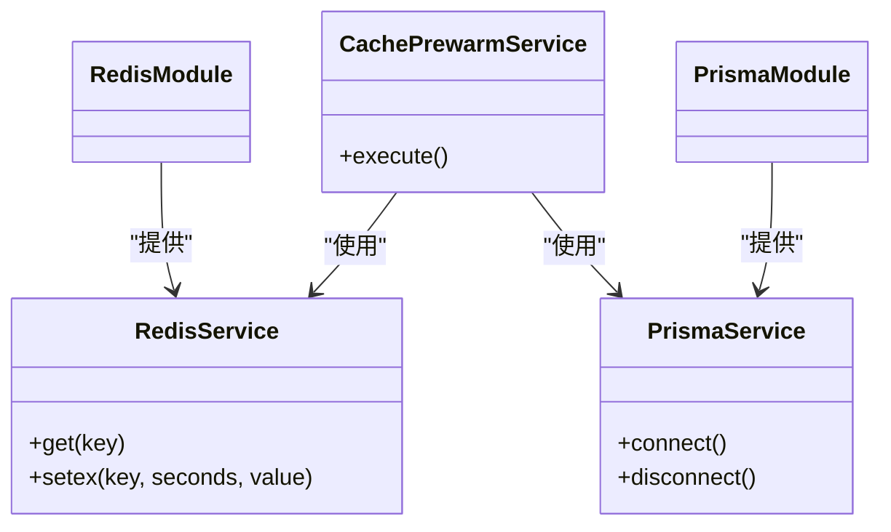
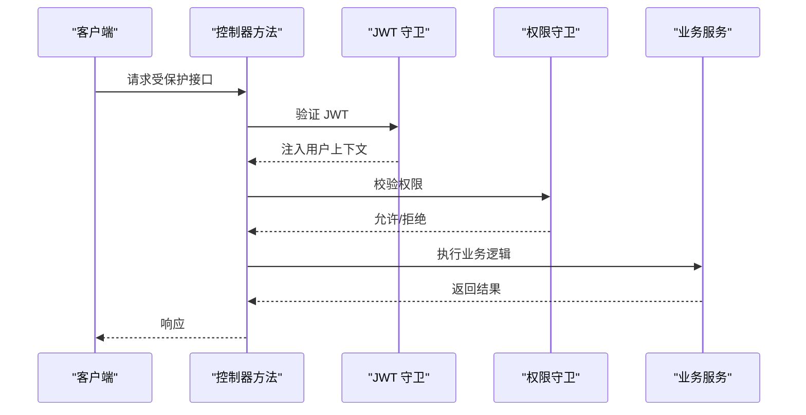
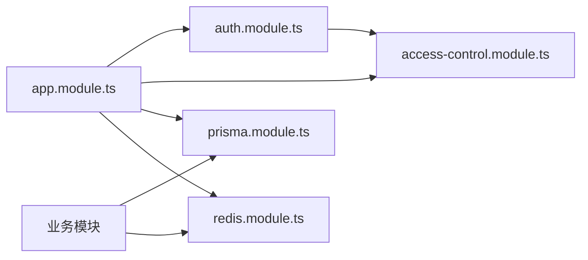

# 代码规范

<cite>
**本文引用的文件**
- [eslint.config.mjs](file://eslint.config.mjs)
- [.prettierrc](file://.prettierrc)
- [tsconfig.json](file://tsconfig.json)
- [tsconfig.build.json](file://tsconfig.build.json)
- [package.json](file://package.json)
- [src/app.module.ts](file://src/app.module.ts)
- [src/prisma/prisma.module.ts](file://src/prisma/prisma.module.ts)
- [src/prisma/prisma.service.ts](file://src/prisma/prisma.service.ts)
- [src/auth/auth.module.ts](file://src/auth/auth.module.ts)
- [src/auth/guards/jwt-auth.guard.ts](file://src/auth/guards/jwt-auth.guard.ts)
- [src/auth/strategies/jwt.strategy.ts](file://src/auth/strategies/jwt.strategy.ts)
- [src/auth/current-user.decorator.ts](file://src/auth/current-user.decorator.ts)
- [src/access-control/access-control.module.ts](file://src/access-control/access-control.module.ts)
- [src/access-control/guards/permissions.guard.ts](file://src/access-control/guards/permissions.guard.ts)
- [src/access-control/decorators/require-permissions.decorator.ts](file://src/access-control/decorators/require-permissions.decorator.ts)
- [src/access-control/decorators/block-sub-account.decorator.ts](file://src/access-control/decorators/block-sub-account.decorator.ts)
- [src/config/configuration.ts](file://src/config/configuration.ts)
- [src/redis/redis.module.ts](file://src/redis/redis.module.ts)
- [src/redis/redis.service.ts](file://src/redis/redis.service.ts)
- [src/redis/cache-prewarm.service.ts](file://src/redis/cache-prewarm.service.ts)
- [src/observability/runtime-metrics.ts](file://src/observability/runtime-metrics.ts)
- [src/observability/runtime-metrics.summary.ts](file://src/observability/runtime-metrics.summary.ts)
- [src/observability/runtime-metrics.summary-context.ts](file://src/observability/runtime-metrics.summary-context.ts)
- [src/observability/runtime-metrics.summary-context-actions.ts](file://src/observability/runtime-metrics.summary-context-actions.ts)
- [src/observability/runtime-metrics.summary-context-actions-http.ts](file://src/observability/runtime-metrics.summary-context-actions-http.ts)
- [src/observability/runtime-metrics.summary-context-actions-redis.ts](file://src/observability/runtime-metrics.summary-context-actions-redis.ts)
- [src/observability/runtime-metrics.summary-context-actions-sql.ts](file://src/observability/runtime-metrics.summary-context-actions-sql.ts)
- [src/observability/runtime-metrics.summary-context-actions-cache-prewarm.ts](file://src/observability/runtime-metrics.summary-context-actions-cache-prewarm.ts)
- [src/observability/runtime-metrics.summary-context-actions-shared.ts](file://src/observability/runtime-metrics.summary-context-actions-shared.ts)
- [src/observability/runtime-metrics.summary-context-actions-process.ts](file://src/observability/runtime-metrics.summary-context-actions-process.ts)
- [src/observability/runtime-metrics.summary-context-actions-ts](file://src/observability/runtime-metrics.summary-context-actions-ts)
- [src/observability/runtime-metrics.summary-context-aggregates.ts](file://src/observability/runtime-metrics.summary-context-aggregates.ts)
- [src/observability/runtime-metrics.summary-context-cache-prewarm.ts](file://src/observability/runtime-metrics.summary-context-cache-prewarm.ts)
- [src/observability/runtime-metrics.summary-context-severity.ts](file://src/observability/runtime-metrics.summary-context-severity.ts)
- [src/observability/runtime-metrics.summary-highlights.ts](file://src/observability/runtime-metrics.summary-highlights.ts)
- [src/observability/runtime-metrics.summary-highlights-http.ts](file://src/observability/runtime-metrics.summary-highlights-http.ts)
- [src/observability/runtime-metrics.summary-highlights-redis.ts](file://src/observability/runtime-metrics.summary-highlights-redis.ts)
- [src/observability/runtime-metrics.summary-highlights-sql.ts](file://src/observability/runtime-metrics.summary-highlights-sql.ts)
- [src/observability/runtime-metrics.summary-highlights-process.ts](file://src/observability/runtime-metrics.summary-highlights-process.ts)
- [src/observability/runtime-metrics.summary-highlights-shared.ts](file://src/observability/runtime-metrics.summary-highlights-shared.ts)
- [src/observability/runtime-metrics.summary-highlights-cache-prewarm.ts](file://src/observability/runtime-metrics.summary-highlights-cache-prewarm.ts)
- [src/observability/runtime-metrics.summary-helpers.ts](file://src/observability/runtime-metrics.summary-helpers.ts)
- [src/observability/runtime-metrics.summary.ts](file://src/observability/runtime-metrics.summary.ts)
- [src/observability/runtime-metrics.recorders.ts](file://src/observability/runtime-metrics.recorders.ts)
- [src/observability/runtime-metrics.snapshots.ts](file://src/observability/runtime-metrics.snapshots.ts)
- [src/observability/runtime-metrics.state.ts](file://src/observability/runtime-metrics.state.ts)
- [src/observability/metrics.protocol.ts](file://src/observability/metrics.protocol.ts)
- [src/observability/observability.protocol.ts](file://src/observability/observability.protocol.ts)
- [src/observability/metrics-summary.protocol.ts](file://src/observability/metrics-summary.protocol.ts)
- [src/observability/metrics-snapshot.protocol.ts](file://src/observability/metrics-snapshot.protocol.ts)
</cite>

## 目录
1. [简介](#简介)
2. [项目结构](#项目结构)
3. [核心组件](#核心组件)
4. [架构总览](#架构总览)
5. [详细组件分析](#详细组件分析)
6. [依赖关系分析](#依赖关系分析)
7. [性能考量](#性能考量)
8. [故障排查指南](#故障排查指南)
9. [结论](#结论)
10. [附录](#附录)

## 简介
本文件为 purelyprofit-server 的代码规范与最佳实践指南，覆盖以下方面：
- ESLint 与 Prettier 的配置与规则目的
- TypeScript 编译选项与类型安全策略
- 命名约定与代码风格标准
- NestJS 特定编码规范（模块、控制器、服务、守卫、装饰器）
- 依赖注入最佳实践与模块组织
- IDE 配置与自动格式化建议
- 可观测性与缓存预热等工程化实践

本规范旨在统一团队开发风格，提升可维护性与可读性，并通过工具链自动化保障质量。

## 项目结构
后端采用 NestJS 模块化架构，按业务域划分功能模块，核心入口为应用模块与主程序入口；同时包含可观测性、Redis 缓存、Prisma 数据访问层以及认证与权限控制模块。

图表来源
- [src/main.ts](file://src/main.ts)
- [src/app.module.ts](file://src/app.module.ts)
- [src/auth/auth.module.ts](file://src/auth/auth.module.ts)
- [src/access-control/access-control.module.ts](file://src/access-control/access-control.module.ts)
- [src/prisma/prisma.module.ts](file://src/prisma/prisma.module.ts)
- [src/redis/redis.module.ts](file://src/redis/redis.module.ts)

章节来源
- [src/main.ts](file://src/main.ts)
- [src/app.module.ts](file://src/app.module.ts)

## 核心组件
- ESLint 配置：集中式配置文件，定义规则集与插件，确保跨文件一致性。
- Prettier 配置：统一缩进、引号、尾逗号等格式化行为。
- TypeScript 配置：严格类型检查、路径映射、输出目标与模块解析策略。
- NestJS 模块与装饰器：模块边界清晰、依赖注入显式声明、守卫与装饰器职责单一。
- 可观测性：指标聚合、快照与上下文动作分类，支持 HTTP/Redis/SQL/进程等维度。

章节来源
- [eslint.config.mjs](file://eslint.config.mjs)
- [.prettierrc](file://.prettierrc)
- [tsconfig.json](file://tsconfig.json)
- [tsconfig.build.json](file://tsconfig.build.json)
- [src/observability/runtime-metrics.summary.ts](file://src/observability/runtime-metrics.summary.ts)

## 架构总览
下图展示了应用启动到模块装配的关键流程，以及认证与权限控制在请求生命周期中的位置。

图表来源
- [src/main.ts](file://src/main.ts)
- [src/app.module.ts](file://src/app.module.ts)
- [src/auth/auth.module.ts](file://src/auth/auth.module.ts)
- [src/auth/guards/jwt-auth.guard.ts](file://src/auth/guards/jwt-auth.guard.ts)
- [src/access-control/guards/permissions.guard.ts](file://src/access-control/guards/permissions.guard.ts)

## 详细组件分析

### ESLint 规则与目的
- 规则集与插件：集中式配置文件定义规则集与插件，确保跨文件一致性。
- 目的：避免潜在运行时错误、统一风格、减少代码异味、提升可读性与可维护性。
- 适用场景：所有 TypeScript 文件与 NestJS 控制器、服务、守卫、装饰器等。

章节来源
- [eslint.config.mjs](file://eslint.config.mjs)

### Prettier 规则与目的
- 统一格式化：缩进、引号、尾逗号、行宽等。
- 目的：消除团队成员间风格分歧，保证提交一致性。
- 适用场景：所有源码与配置文件。

章节来源
- [.prettierrc](file://.prettierrc)

### TypeScript 编译选项与类型安全
- 严格模式：启用严格空检查、严格函数类型等，降低运行时风险。
- 路径映射：使用别名简化导入路径，提升可读性。
- 输出目标：ESNext/Node 运行时兼容性。
- 模块解析：NodeNext，与 NestJS 生态匹配。
- 构建配置：区分开发与构建时的 tsconfig，确保测试与生产环境一致。

章节来源
- [tsconfig.json](file://tsconfig.json)
- [tsconfig.build.json](file://tsconfig.build.json)

### 命名约定与代码风格
- 文件与类：PascalCase；DTO 使用 DTO 后缀；模块使用 Module 后缀。
- 接口与类型：I前缀或语义化名词；枚举使用复数或状态词。
- 变量与函数：camelCase；常量全大写蛇形；私有成员下划线前缀。
- 导入：相对路径优先；同级模块使用相对路径；跨层使用别名。
- 注释：接口与复杂逻辑添加注释；导出项保持清晰文档。

章节来源
- [src/auth/dto/login.dto.ts](file://src/auth/dto/login.dto.ts)
- [src/auth/auth.service.ts](file://src/auth/auth.service.ts)
- [src/access-control/access-control.service.ts](file://src/access-control/access-control.service.ts)

### NestJS 特定编码规范
- 模块边界：每个业务域独立模块，明确导出与导入，避免循环依赖。
- 控制器：职责单一，仅处理路由与参数校验；业务逻辑下沉至服务。
- 服务：无状态或最小状态，依赖注入显式声明；避免在构造函数中执行重逻辑。
- 守卫：认证与授权分离；守卫职责单一，避免在守卫中做业务判断。
- 装饰器：自定义装饰器用于提取上下文信息，如当前用户、请求 ID 等。

章节来源
- [src/app.module.ts](file://src/app.module.ts)
- [src/auth/auth.module.ts](file://src/auth/auth.module.ts)
- [src/access-control/access-control.module.ts](file://src/access-control/access-control.module.ts)
- [src/auth/current-user.decorator.ts](file://src/auth/current-user.decorator.ts)

### 依赖注入最佳实践
- 显式注入：构造函数注入服务，便于测试与替换。
- 单一职责：服务内部不直接操作数据库或缓存，通过抽象接口隔离。
- 模块化：将共享服务放入公共模块并导出，避免重复实例化。
- 循环依赖规避：拆分模块或使用延迟注入。

图表来源
- [src/prisma/prisma.service.ts](file://src/prisma/prisma.service.ts)
- [src/redis/redis.service.ts](file://src/redis/redis.service.ts)
- [src/redis/cache-prewarm.service.ts](file://src/redis/cache-prewarm.service.ts)
- [src/prisma/prisma.module.ts](file://src/prisma/prisma.module.ts)
- [src/redis/redis.module.ts](file://src/redis/redis.module.ts)

章节来源
- [src/prisma/prisma.module.ts](file://src/prisma/prisma.module.ts)
- [src/redis/redis.module.ts](file://src/redis/redis.module.ts)
- [src/redis/cache-prewarm.service.ts](file://src/redis/cache-prewarm.service.ts)

### 认证与权限控制规范
- 认证：JWT 守卫负责令牌验证与用户上下文注入。
- 授权：权限守卫基于能力矩阵进行细粒度控制。
- 装饰器：@CurrentUser 提取用户信息；@RequirePermissions 标注所需权限；@BlockSubAccount 阻止子账户访问特定资源。

图表来源
- [src/auth/guards/jwt-auth.guard.ts](file://src/auth/guards/jwt-auth.guard.ts)
- [src/access-control/guards/permissions.guard.ts](file://src/access-control/guards/permissions.guard.ts)
- [src/auth/current-user.decorator.ts](file://src/auth/current-user.decorator.ts)
- [src/access-control/decorators/require-permissions.decorator.ts](file://src/access-control/decorators/require-permissions.decorator.ts)
- [src/access-control/decorators/block-sub-account.decorator.ts](file://src/access-control/decorators/block-sub-account.decorator.ts)

章节来源
- [src/auth/auth.module.ts](file://src/auth/auth.module.ts)
- [src/access-control/access-control.module.ts](file://src/access-control/access-control.module.ts)

### 可观测性与缓存预热
- 指标体系：按上下文与动作维度聚合指标，支持 HTTP、Redis、SQL、进程等。
- 快照与摘要：对高价值指标生成快照与摘要，便于监控面板展示。
- 缓存预热：在启动阶段预热热点键，降低冷启动延迟。

```mermaid
flowchart TD
Start(["应用启动"]) --> LoadConfig["加载配置<br/>configuration.ts"]
LoadConfig --> InitRedis["初始化 Redis"]
InitRedis --> PreWarm["缓存预热"]
PreWarm --> RunMetrics["启动指标记录器"]
RunMetrics --> Snapshot["生成快照"]
Snapshot --> Summary["汇总摘要"]
Summary --> End(["运行中"])
```

图表来源
- [src/config/configuration.ts](file://src/config/configuration.ts)
- [src/redis/cache-prewarm.service.ts](file://src/redis/cache-prewarm.service.ts)
- [src/observability/runtime-metrics.recorders.ts](file://src/observability/runtime-metrics.recorders.ts)
- [src/observability/runtime-metrics.snapshots.ts](file://src/observability/runtime-metrics.snapshots.ts)
- [src/observability/runtime-metrics.summary.ts](file://src/observability/runtime-metrics.summary.ts)

章节来源
- [src/observability/runtime-metrics.ts](file://src/observability/runtime-metrics.ts)
- [src/observability/runtime-metrics.summary.ts](file://src/observability/runtime-metrics.summary.ts)
- [src/observability/runtime-metrics.summary-context.ts](file://src/observability/runtime-metrics.summary-context.ts)
- [src/observability/runtime-metrics.summary-context-actions.ts](file://src/observability/runtime-metrics.summary-context-actions.ts)
- [src/observability/runtime-metrics.summary-context-actions-http.ts](file://src/observability/runtime-metrics.summary-context-actions-http.ts)
- [src/observability/runtime-metrics.summary-context-actions-redis.ts](file://src/observability/runtime-metrics.summary-context-actions-redis.ts)
- [src/observability/runtime-metrics.summary-context-actions-sql.ts](file://src/observability/runtime-metrics.summary-context-actions-sql.ts)
- [src/observability/runtime-metrics.summary-context-actions-cache-prewarm.ts](file://src/observability/runtime-metrics.summary-context-actions-cache-prewarm.ts)
- [src/observability/runtime-metrics.summary-context-actions-shared.ts](file://src/observability/runtime-metrics.summary-context-actions-shared.ts)
- [src/observability/runtime-metrics.summary-context-actions-process.ts](file://src/observability/runtime-metrics.summary-context-actions-process.ts)
- [src/observability/runtime-metrics.summary-context-aggregates.ts](file://src/observability/runtime-metrics.summary-context-aggregates.ts)
- [src/observability/runtime-metrics.summary-context-cache-prewarm.ts](file://src/observability/runtime-metrics.summary-context-cache-prewarm.ts)
- [src/observability/runtime-metrics.summary-context-severity.ts](file://src/observability/runtime-metrics.summary-context-severity.ts)
- [src/observability/runtime-metrics.summary-highlights.ts](file://src/observability/runtime-metrics.summary-highlights.ts)
- [src/observability/runtime-metrics.summary-highlights-http.ts](file://src/observability/runtime-metrics.summary-highlights-http.ts)
- [src/observability/runtime-metrics.summary-highlights-redis.ts](file://src/observability/runtime-metrics.summary-highlights-redis.ts)
- [src/observability/runtime-metrics.summary-highlights-sql.ts](file://src/observability/runtime-metrics.summary-highlights-sql.ts)
- [src/observability/runtime-metrics.summary-highlights-process.ts](file://src/observability/runtime-metrics.summary-highlights-process.ts)
- [src/observability/runtime-metrics.summary-highlights-shared.ts](file://src/observability/runtime-metrics.summary-highlights-shared.ts)
- [src/observability/runtime-metrics.summary-highlights-cache-prewarm.ts](file://src/observability/runtime-metrics.summary-highlights-cache-prewarm.ts)
- [src/observability/runtime-metrics.summary-helpers.ts](file://src/observability/runtime-metrics.summary-helpers.ts)

## 依赖关系分析
- 模块耦合：业务模块依赖认证与权限控制模块；数据访问层与缓存层被各业务模块复用。
- 外部依赖：Prisma、Redis、NestJS 生态；通过 package.json 管理版本与脚本。
- 循环依赖：通过模块拆分与延迟注入避免；严格限制跨层访问。

图表来源
- [src/app.module.ts](file://src/app.module.ts)
- [src/auth/auth.module.ts](file://src/auth/auth.module.ts)
- [src/access-control/access-control.module.ts](file://src/access-control/access-control.module.ts)
- [src/prisma/prisma.module.ts](file://src/prisma/prisma.module.ts)
- [src/redis/redis.module.ts](file://src/redis/redis.module.ts)

章节来源
- [package.json](file://package.json)

## 性能考量
- 缓存预热：在启动阶段预热热点键，降低首次访问延迟。
- 指标聚合：按上下文与动作维度聚合，避免高频写入导致的性能瓶颈。
- 查询优化：结合索引与分页查询，避免一次性加载大量数据。
- 并发控制：合理使用锁与队列，避免竞争条件。

## 故障排查指南
- 认证失败：检查 JWT 守卫是否正确注入用户上下文；确认令牌签名与过期时间。
- 权限拒绝：核对权限守卫配置与用户能力矩阵；确认装饰器标注是否正确。
- 缓存异常：检查 Redis 连接与键空间；确认预热任务执行情况。
- 指标缺失：核对记录器与快照生成逻辑；确认摘要聚合是否正常。

章节来源
- [src/auth/guards/jwt-auth.guard.ts](file://src/auth/guards/jwt-auth.guard.ts)
- [src/access-control/guards/permissions.guard.ts](file://src/access-control/guards/permissions.guard.ts)
- [src/redis/cache-prewarm.service.ts](file://src/redis/cache-prewarm.service.ts)
- [src/observability/runtime-metrics.recorders.ts](file://src/observability/runtime-metrics.recorders.ts)

## 结论
通过统一的 ESLint/Prettier 配置、严格的 TypeScript 编译选项、清晰的 NestJS 模块与装饰器规范、以及完善的可观测性与缓存预热机制，团队可以显著提升代码质量与系统稳定性。建议在本地与 CI 中强制执行格式化与静态检查，确保持续一致的开发体验。

## 附录
- IDE 配置建议
  - VSCode：安装 ESLint 与 Prettier 插件，启用保存时格式化。
  - 设置默认 formatter 为 Prettier，lint 工具为 ESLint。
  - 在工作区设置中启用“Editor: Format On Save”和“Editor: Code Actions On Save”，选择“source.fixAll.eslint”。
- 自动格式化设置
  - 通过 pre-commit 钩子或 CI 步骤执行格式化与 lint，防止问题进入分支。
  - 对于 NestJS 项目，建议在提交前运行构建检查与单元测试，确保变更不影响模块装配与依赖注入。