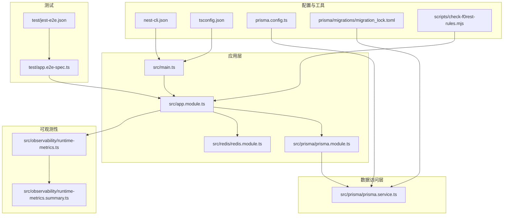
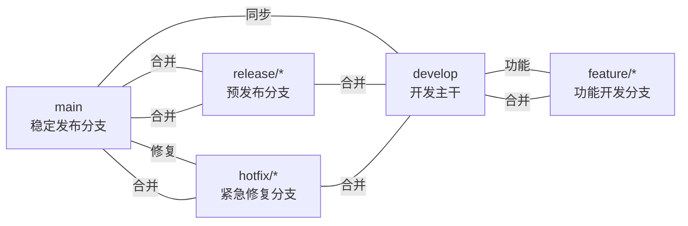
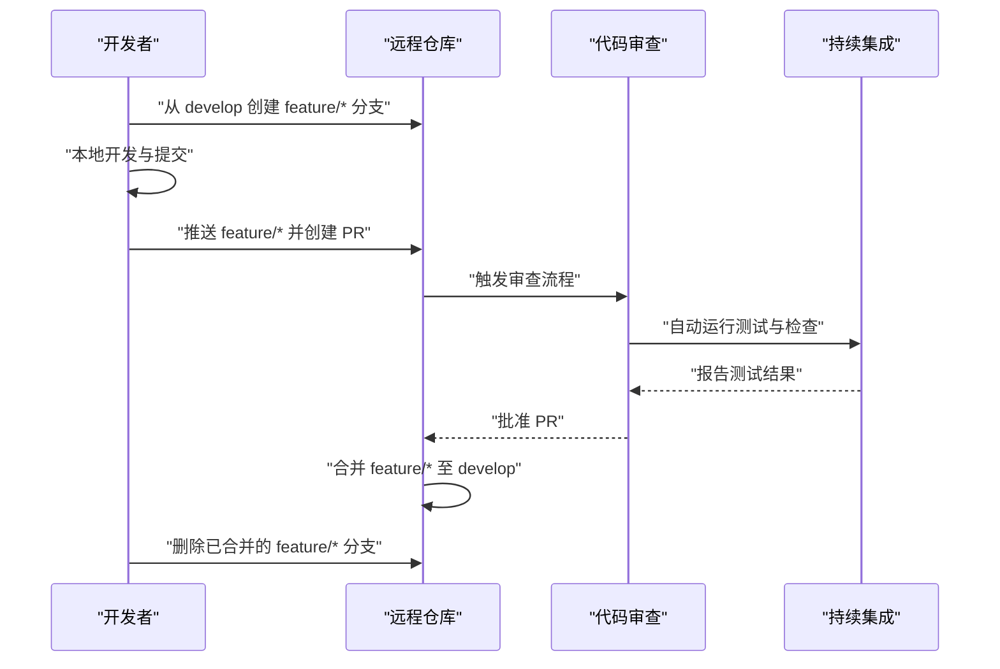
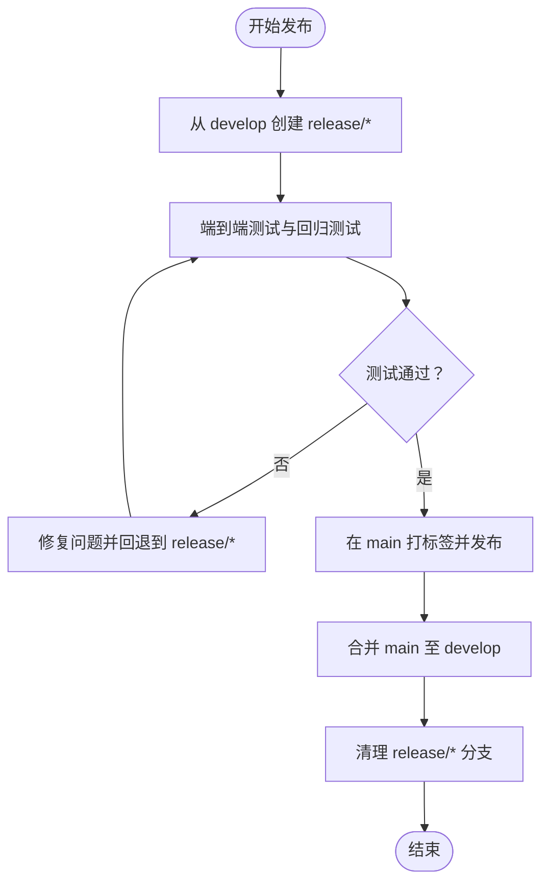
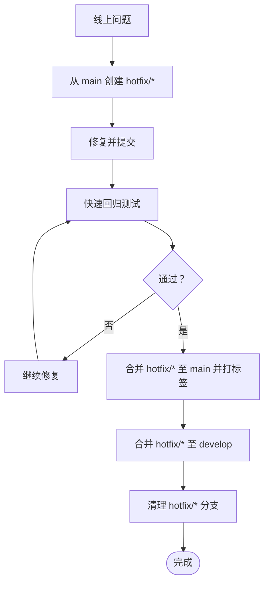
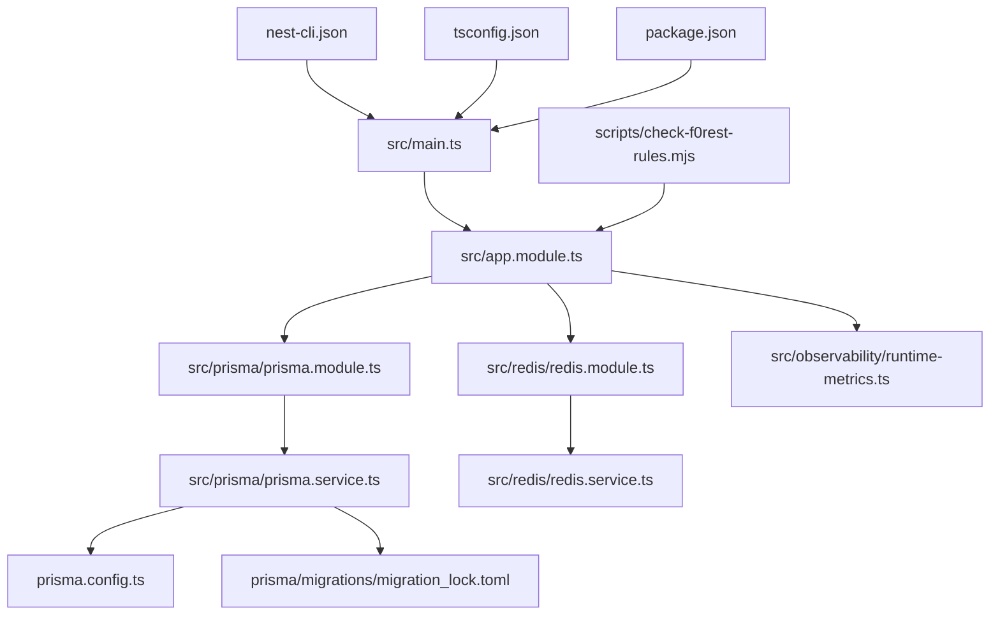

# 分支管理策略

<cite>
**本文引用的文件**
- [README.md](file://README.md)
- [package.json](file://package.json)
- [nest-cli.json](file://nest-cli.json)
- [tsconfig.json](file://tsconfig.json)
- [prisma.config.ts](file://prisma.config.ts)
- [prisma/migrations/migration_lock.toml](file://prisma/migrations/migration_lock.toml)
- [scripts/check-f0rest-rules.mjs](file://scripts/check-f0rest-rules.mjs)
- [src/main.ts](file://src/main.ts)
- [src/app.module.ts](file://src/app.module.ts)
- [src/prisma/prisma.module.ts](file://src/prisma/prisma.module.ts)
- [src/prisma/prisma.service.ts](file://src/prisma/prisma.service.ts)
- [src/observability/runtime-metrics.ts](file://src/observability/runtime-metrics.ts)
- [src/observability/runtime-metrics.summary.ts](file://src/observability/runtime-metrics.summary.ts)
- [src/redis/redis.module.ts](file://src/redis/redis.module.ts)
- [src/redis/redis.service.ts](file://src/redis/redis.service.ts)
- [test/app.e2e-spec.ts](file://test/app.e2e-spec.ts)
- [test/jest-e2e.json](file://test/jest-e2e.json)
</cite>

## 目录
1. [引言](#引言)
2. [项目结构](#项目结构)
3. [核心组件](#核心组件)
4. [架构总览](#架构总览)
5. [详细组件分析](#详细组件分析)
6. [依赖分析](#依赖分析)
7. [性能考虑](#性能考虑)
8. [故障排除指南](#故障排除指南)
9. [结论](#结论)
10. [附录](#附录)

## 引言
本文件为 purelyprofit-server 建立一套完整的 Git 分支管理策略，覆盖主要分支类型（main、develop、feature、hotfix、release）、命名规范与合并策略；明确功能分支的创建与合并流程、版本发布流程、热修复处理方式；给出分支保护规则、CI/CD 集成建议、冲突解决机制，并总结最佳实践与常见问题解决方案。该策略以项目现有代码结构、构建脚本与数据库迁移配置为基础制定，确保开发效率与发布质量。

## 项目结构
该项目采用 NestJS 框架，使用 Prisma 管理数据库模式与迁移，测试框架为 Jest。整体结构清晰，模块化程度高，便于基于分支策略进行功能迭代与版本发布。

**图表来源**
- [src/main.ts:1-200](file://src/main.ts#L1-L200)
- [src/app.module.ts:1-200](file://src/app.module.ts#L1-L200)
- [src/prisma/prisma.module.ts:1-200](file://src/prisma/prisma.module.ts#L1-L200)
- [src/prisma/prisma.service.ts:1-200](file://src/prisma/prisma.service.ts#L1-L200)
- [src/observability/runtime-metrics.ts:1-200](file://src/observability/runtime-metrics.ts#L1-L200)
- [src/observability/runtime-metrics.summary.ts:1-200](file://src/observability/runtime-metrics.summary.ts#L1-L200)
- [nest-cli.json:1-9](file://nest-cli.json#L1-L9)
- [tsconfig.json:1-26](file://tsconfig.json#L1-L26)
- [prisma.config.ts:1-15](file://prisma.config.ts#L1-L15)
- [prisma/migrations/migration_lock.toml:1-200](file://prisma/migrations/migration_lock.toml#L1-L200)
- [scripts/check-f0rest-rules.mjs:1-200](file://scripts/check-f0rest-rules.mjs#L1-L200)
- [test/app.e2e-spec.ts:1-200](file://test/app.e2e-spec.ts#L1-L200)
- [test/jest-e2e.json:1-200](file://test/jest-e2e.json#L1-L200)

**章节来源**
- [README.md:1-99](file://README.md#L1-L99)
- [package.json:1-105](file://package.json#L1-L105)
- [nest-cli.json:1-9](file://nest-cli.json#L1-L9)
- [tsconfig.json:1-26](file://tsconfig.json#L1-L26)
- [prisma.config.ts:1-15](file://prisma.config.ts#L1-L15)

## 核心组件
- 应用入口与模块装配：应用启动由入口文件负责，主模块集中注册 Prisma、Redis、可观测性等子系统模块。
- 数据库与迁移：通过 Prisma 配置文件指定 schema 与迁移目录，迁移锁文件用于保证迁移执行顺序与一致性。
- 构建与测试：Nest CLI 配置与 TypeScript 编译选项定义了编译目标与严格性设置；Jest 配置支持单元与端到端测试。
- 质量检查：自定义规则检查脚本可集成到 CI 流程中，保障代码风格与安全基线。

**章节来源**
- [src/main.ts:1-200](file://src/main.ts#L1-L200)
- [src/app.module.ts:1-200](file://src/app.module.ts#L1-L200)
- [src/prisma/prisma.module.ts:1-200](file://src/prisma/prisma.module.ts#L1-L200)
- [src/prisma/prisma.service.ts:1-200](file://src/prisma/prisma.service.ts#L1-L200)
- [prisma.config.ts:1-15](file://prisma.config.ts#L1-L15)
- [prisma/migrations/migration_lock.toml:1-200](file://prisma/migrations/migration_lock.toml#L1-L200)
- [nest-cli.json:1-9](file://nest-cli.json#L1-L9)
- [tsconfig.json:1-26](file://tsconfig.json#L1-L26)
- [package.json:1-105](file://package.json#L1-L105)
- [scripts/check-f0rest-rules.mjs:1-200](file://scripts/check-f0rest-rules.mjs#L1-L200)

## 架构总览
下图展示分支策略在实际工程中的落地：feature 分支从 develop 创建并合并回 develop；release 分支从 develop 创建，合并至 main 并打标签；hotfix 从 main 创建，同时合并回 main 与 develop。

[此图为概念性分支关系示意，不直接映射具体源码文件，故无“图表来源”标注]

## 详细组件分析

### 主要分支类型与职责
- main：仅保留可发布版本，每次发布后打上语义化标签，作为生产环境唯一可信源。
- develop：日常开发主干，集成各功能分支，保持可构建与可测试状态。
- feature/*：新功能开发，从 develop 切出，完成后合并回 develop。
- release/*：准备发布的预发布分支，进行最终回归测试与小修复，合并至 main 并打标签。
- hotfix/*：线上紧急修复，从 main 切出，修复后同时合并回 main 与 develop。

[本节为通用策略说明，未直接分析具体文件，故无“章节来源”]

### 分支命名规范
- feature：feature/模块名/任务描述（如 feature/marketing/promotion-engine）
- release：release/主版本号.次版本号（如 release/1.2）
- hotfix：hotfix/修复主题（如 hotfix/security-patch）

[本节为通用策略说明，未直接分析具体文件，故无“章节来源”]

### 合并策略
- feature → develop：squash 合并，保持提交历史整洁；或允许快进合并视团队偏好。
- develop → release：不允许直接推送，必须通过 Pull Request 审查与测试。
- release → main：必须打标签并进行最终验证；随后合并回 develop。
- hotfix → main：必须打标签；随后立即合并回 develop。

[本节为通用策略说明，未直接分析具体文件，故无“章节来源”]

### 功能分支创建与合并流程

[此图为概念性流程示意，不直接映射具体源码文件，故无“图表来源”]

### 版本发布流程

[此图为概念性流程示意，不直接映射具体源码文件，故无“图表来源”]

### 热修复处理方式

[此图为概念性流程示意，不直接映射具体源码文件，故无“图表来源”]

### 分支保护规则（建议）
- main
  - 必须启用“保护分支”，禁止直接推送
  - 强制开启“要求拉取请求”与“需要审查”
  - 强制执行 CI 检查（构建、测试、静态检查）
  - 启用“必需状态检查”，仅允许快进合并或要求 PR 合并
- develop
  - 允许受控推送（通过 PR）
  - 强制 CI 与代码质量检查
  - 限制可推送到特定维护者
- feature/*、release/*、hotfix/*
  - 可按需开启 PR 与 CI
  - 建议在合并前完成审查与测试

[本节为通用策略说明，未直接分析具体文件，故无“章节来源”]

### CI/CD 集成配置（建议）
- 构建阶段
  - 使用 Nest CLI 与 TypeScript 编译配置进行构建
  - 运行单元测试与端到端测试
- 质量检查
  - 运行 ESLint 与 Prettier
  - 执行自定义规则检查脚本
- 数据库迁移
  - 在 CI 中执行 Prisma 迁移命令，确保数据库模式一致
  - 使用迁移锁文件避免并发冲突
- 发布阶段
  - 对 main 打标签并触发发布流程
  - 将镜像或制品推送到制品库或部署平台

**章节来源**
- [package.json:8-30](file://package.json#L8-L30)
- [prisma.config.ts:1-15](file://prisma.config.ts#L1-L15)
- [prisma/migrations/migration_lock.toml:1-200](file://prisma/migrations/migration_lock.toml#L1-L200)
- [scripts/check-f0rest-rules.mjs:1-200](file://scripts/check-f0rest-rules.mjs#L1-L200)

### 冲突解决机制
- 频繁从 develop 同步更新，减少长周期分支导致的分歧
- 使用小步提交与清晰的提交信息，便于冲突定位与解决
- 对于数据库迁移冲突，优先通过迁移锁与迁移命令协调，避免手动修改迁移文件
- 代码冲突通过 PR 审查解决，必要时进行面对面讨论或临时会议

[本节为通用策略说明，未直接分析具体文件，故无“章节来源”]

## 依赖分析
- 模块耦合
  - 应用入口依赖主模块装配，主模块再组织 Prisma、Redis、可观测性等子系统
  - Prisma 服务依赖 Prisma 模块与配置，受迁移锁与迁移命令约束
- 外部依赖
  - 构建与测试依赖 Nest CLI、TypeScript、Jest
  - 数据库依赖 Prisma 与 PostgreSQL
  - 质量检查依赖 ESLint、Prettier 与自定义规则脚本

**图表来源**
- [src/main.ts:1-200](file://src/main.ts#L1-L200)
- [src/app.module.ts:1-200](file://src/app.module.ts#L1-L200)
- [src/prisma/prisma.module.ts:1-200](file://src/prisma/prisma.module.ts#L1-L200)
- [src/prisma/prisma.service.ts:1-200](file://src/prisma/prisma.service.ts#L1-L200)
- [src/redis/redis.module.ts:1-200](file://src/redis/redis.module.ts#L1-L200)
- [src/redis/redis.service.ts:1-200](file://src/redis/redis.service.ts#L1-L200)
- [prisma.config.ts:1-15](file://prisma.config.ts#L1-L15)
- [prisma/migrations/migration_lock.toml:1-200](file://prisma/migrations/migration_lock.toml#L1-L200)
- [nest-cli.json:1-9](file://nest-cli.json#L1-L9)
- [tsconfig.json:1-26](file://tsconfig.json#L1-L26)
- [package.json:1-105](file://package.json#L1-L105)
- [scripts/check-f0rest-rules.mjs:1-200](file://scripts/check-f0rest-rules.mjs#L1-L200)

**章节来源**
- [src/main.ts:1-200](file://src/main.ts#L1-L200)
- [src/app.module.ts:1-200](file://src/app.module.ts#L1-L200)
- [src/prisma/prisma.module.ts:1-200](file://src/prisma/prisma.module.ts#L1-L200)
- [src/prisma/prisma.service.ts:1-200](file://src/prisma/prisma.service.ts#L1-L200)
- [prisma.config.ts:1-15](file://prisma.config.ts#L1-L15)
- [prisma/migrations/migration_lock.toml:1-200](file://prisma/migrations/migration_lock.toml#L1-L200)
- [nest-cli.json:1-9](file://nest-cli.json#L1-L9)
- [tsconfig.json:1-26](file://tsconfig.json#L1-L26)
- [package.json:1-105](file://package.json#L1-L105)

## 性能考虑
- 分支粒度控制：feature 分支应尽量短小，减少长周期分支带来的合并成本
- CI 并行化：将构建、测试、静态检查拆分为并行任务，缩短流水线时间
- 数据库迁移：在 CI 中预执行迁移命令，避免运行时迁移导致的冷启动延迟
- 缓存与预热：结合 Redis 模块与缓存预热服务，优化启动与查询性能

[本节为通用指导，未直接分析具体文件，故无“章节来源”]

## 故障排除指南
- 构建失败
  - 检查 Nest CLI 与 TypeScript 配置是否匹配
  - 确认依赖安装与版本兼容性
- 测试失败
  - 查看单元测试与端到端测试日志，定位失败用例
  - 确保测试环境变量与数据库连接正确
- 数据库迁移异常
  - 使用迁移命令检查状态与差异
  - 确认迁移锁文件未被意外修改
- 代码质量检查失败
  - 运行 ESLint 与 Prettier 自动修复
  - 执行自定义规则检查脚本，修正违规项

**章节来源**
- [package.json:8-30](file://package.json#L8-L30)
- [prisma.config.ts:1-15](file://prisma.config.ts#L1-L15)
- [prisma/migrations/migration_lock.toml:1-200](file://prisma/migrations/migration_lock.toml#L1-L200)
- [scripts/check-f0rest-rules.mjs:1-200](file://scripts/check-f0rest-rules.mjs#L1-L200)
- [test/jest-e2e.json:1-200](file://test/jest-e2e.json#L1-L200)

## 结论
通过实施上述分支管理策略，可以有效提升团队协作效率、降低合并风险、确保发布质量。建议在团队内统一培训并定期回顾策略执行效果，根据项目演进持续优化。

## 附录
- 关键配置参考路径
  - 构建与测试：[package.json:8-30](file://package.json#L8-L30)
  - Nest CLI 配置：[nest-cli.json:1-9](file://nest-cli.json#L1-L9)
  - TypeScript 编译选项：[tsconfig.json:1-26](file://tsconfig.json#L1-L26)
  - Prisma 配置与迁移：[prisma.config.ts:1-15](file://prisma.config.ts#L1-L15)，[prisma/migrations/migration_lock.toml:1-200](file://prisma/migrations/migration_lock.toml#L1-L200)
  - 质量检查脚本：[scripts/check-f0rest-rules.mjs:1-200](file://scripts/check-f0rest-rules.mjs#L1-L200)
  - 应用入口与模块：[src/main.ts:1-200](file://src/main.ts#L1-L200)，[src/app.module.ts:1-200](file://src/app.module.ts#L1-L200)
  - 数据访问层：[src/prisma/prisma.module.ts:1-200](file://src/prisma/prisma.module.ts#L1-L200)，[src/prisma/prisma.service.ts:1-200](file://src/prisma/prisma.service.ts#L1-L200)
  - 观测性：[src/observability/runtime-metrics.ts:1-200](file://src/observability/runtime-metrics.ts#L1-L200)，[src/observability/runtime-metrics.summary.ts:1-200](file://src/observability/runtime-metrics.summary.ts#L1-L200)
  - Redis 模块：[src/redis/redis.module.ts:1-200](file://src/redis/redis.module.ts#L1-L200)，[src/redis/redis.service.ts:1-200](file://src/redis/redis.service.ts#L1-L200)
  - 端到端测试：[test/app.e2e-spec.ts:1-200](file://test/app.e2e-spec.ts#L1-L200)，[test/jest-e2e.json:1-200](file://test/jest-e2e.json#L1-L200)