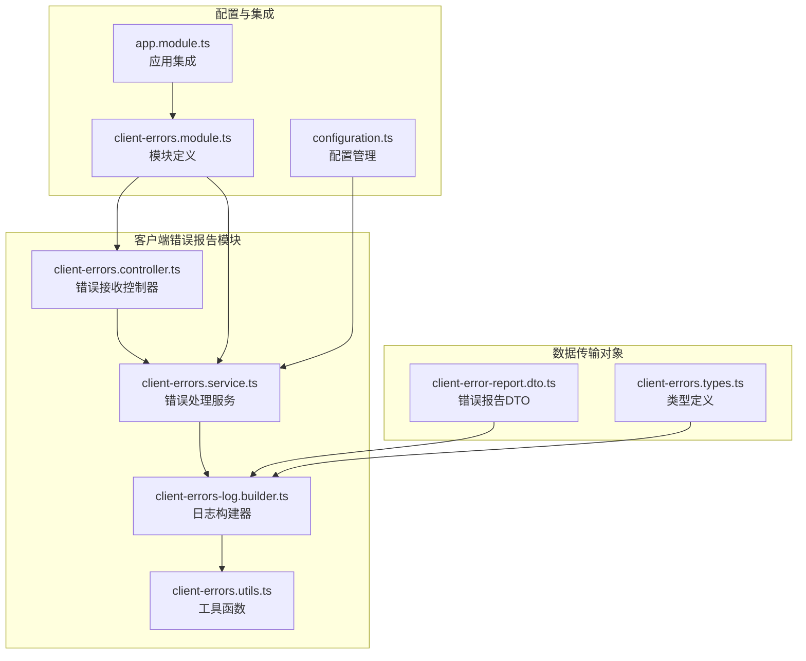
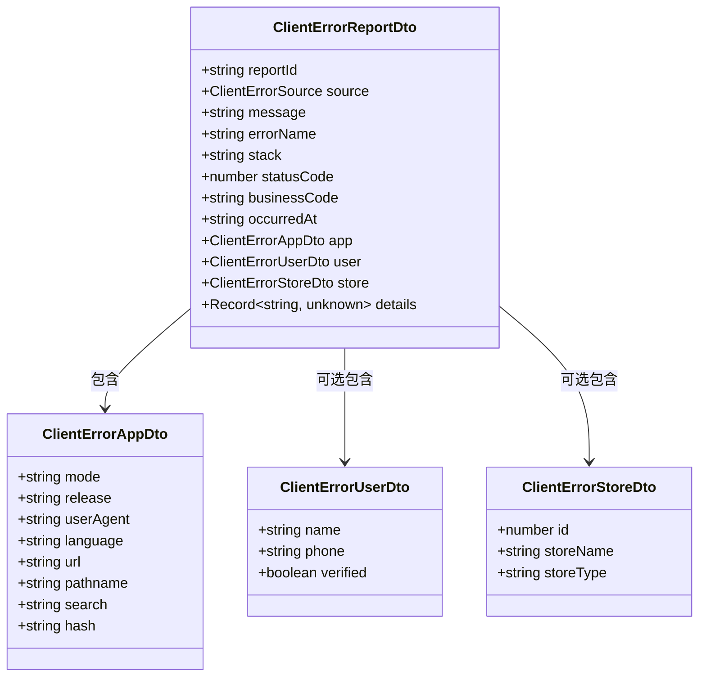
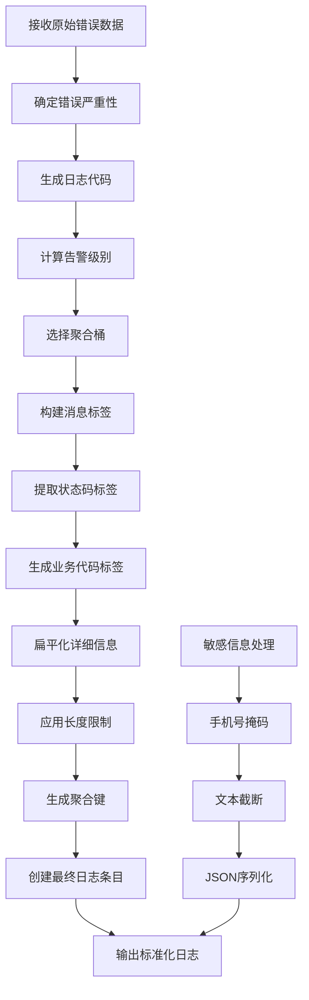
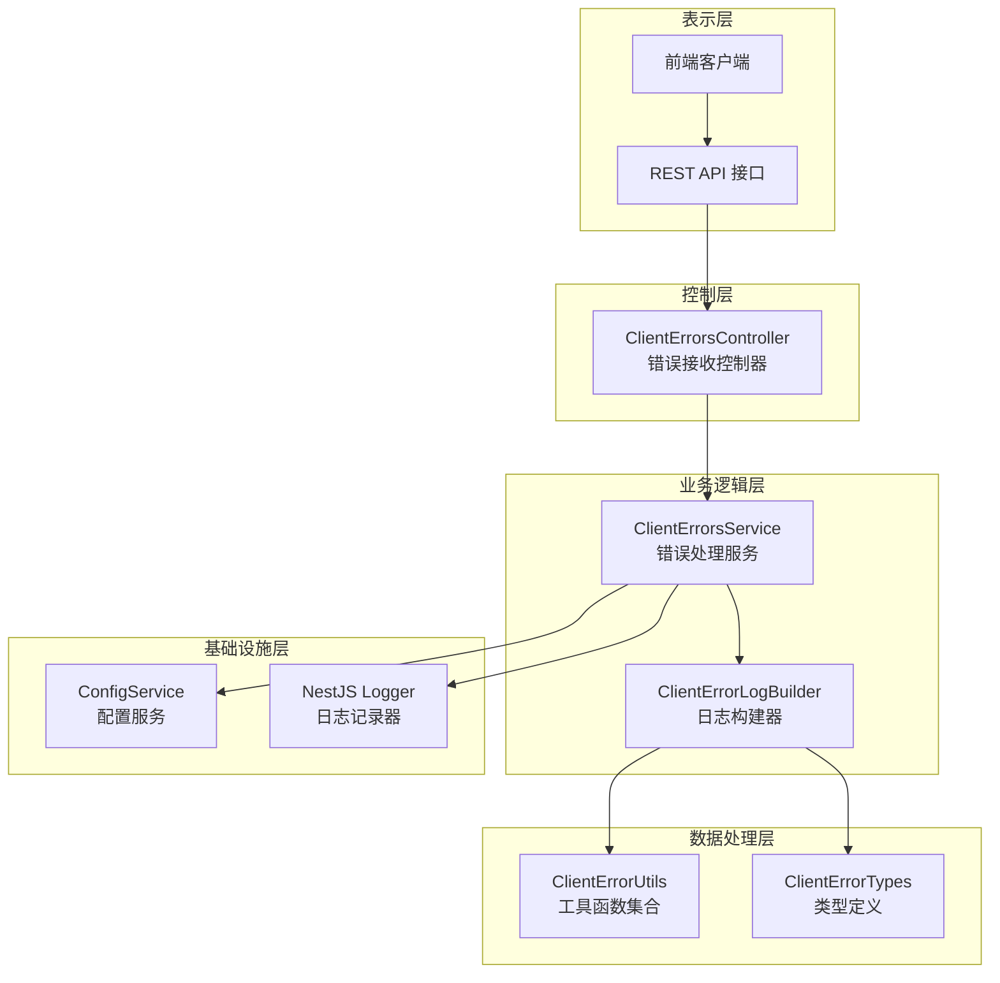
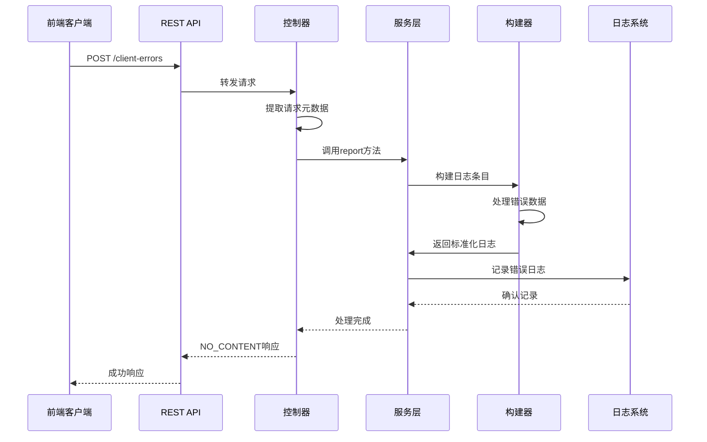
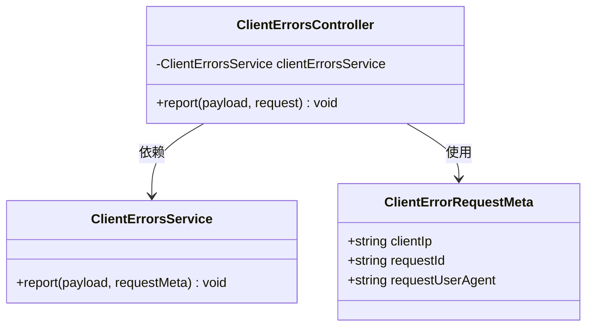
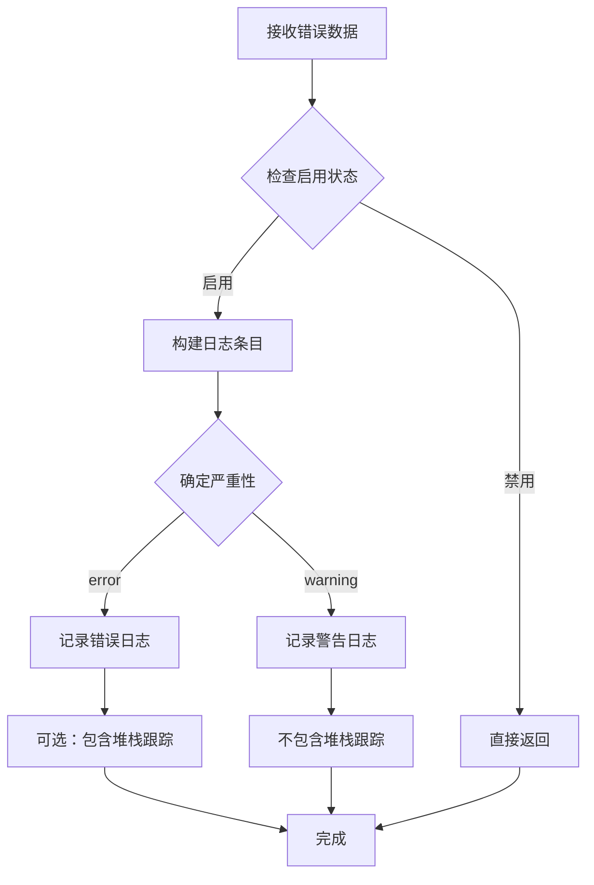
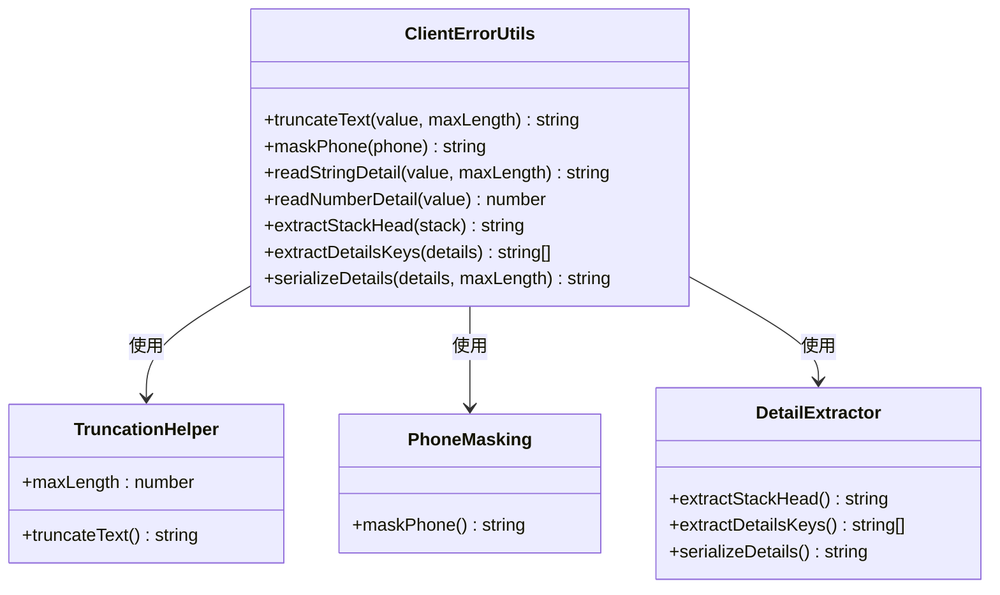
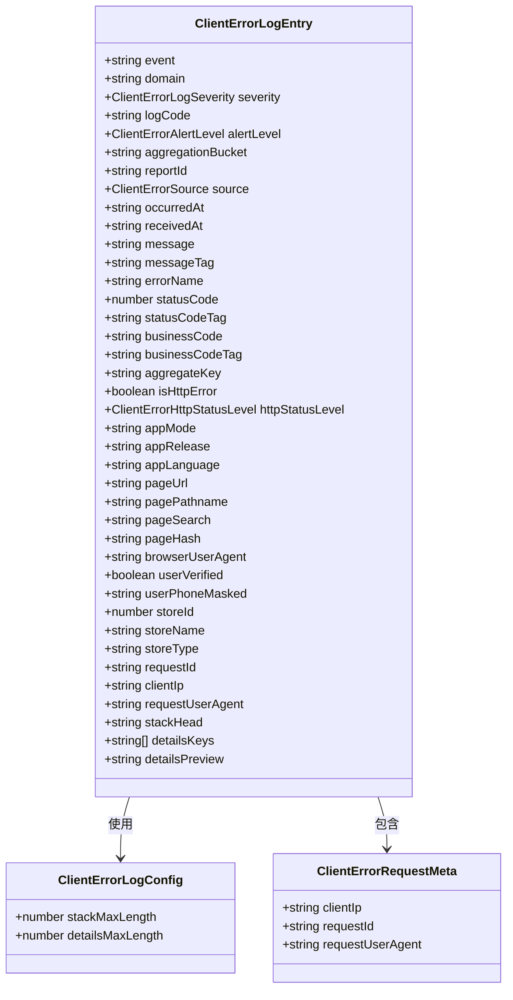
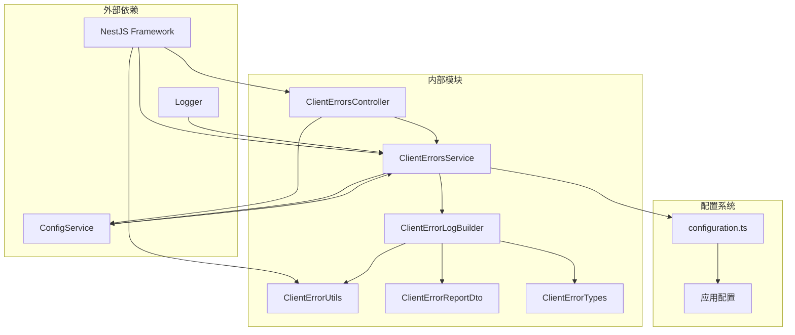

# 客户端错误报告系统

<cite>
**本文档引用的文件**
- [client-errors.controller.ts](file://src/purely-profit/client-errors/client-errors.controller.ts)
- [client-errors.service.ts](file://src/purely-profit/client-errors/client-errors.service.ts)
- [client-errors-log.builder.ts](file://src/purely-profit/client-errors/client-errors-log.builder.ts)
- [client-error-report.dto.ts](file://src/purely-profit/client-errors/dto/client-error-report.dto.ts)
- [client-errors.types.ts](file://src/purely-profit/client-errors/client-errors.types.ts)
- [client-errors.utils.ts](file://src/purely-profit/client-errors/client-errors.utils.ts)
- [client-errors.module.ts](file://src/purely-profit/client-errors/client-errors.module.ts)
- [configuration.ts](file://src/config/configuration.ts)
- [app.module.ts](file://src/app.module.ts)
</cite>

## 目录
1. [简介](#简介)
2. [项目结构](#项目结构)
3. [核心组件](#核心组件)
4. [架构概览](#架构概览)
5. [详细组件分析](#详细组件分析)
6. [依赖关系分析](#依赖关系分析)
7. [性能考虑](#性能考虑)
8. [故障排除指南](#故障排除指南)
9. [结论](#结论)

## 简介

客户端错误报告系统是一个完整的前端错误监控解决方案，专门设计用于收集、处理和分析来自客户端应用的错误信息。该系统能够捕获各种类型的客户端错误，包括HTTP错误、窗口错误、未处理的Promise拒绝以及React渲染错误，并将其标准化为统一的日志格式。

系统的核心功能包括：
- 多源错误收集：支持HTTP错误、窗口错误、未处理Promise拒绝、React渲染错误
- 智能严重性分级：根据错误类型和状态码自动确定告警级别
- 数据标准化：将不同格式的错误信息转换为统一的日志结构
- 敏感信息保护：自动屏蔽手机号等敏感信息
- 聚合分析：基于错误特征进行智能分组和统计

## 项目结构

客户端错误报告系统采用NestJS模块化架构，主要包含以下核心文件：

**图表来源**
- [client-errors.controller.ts:1-50](file://src/purely-profit/client-errors/client-errors.controller.ts#L1-L50)
- [client-errors.service.ts:1-70](file://src/purely-profit/client-errors/client-errors.service.ts#L1-L70)
- [client-errors-log.builder.ts:1-259](file://src/purely-profit/client-errors/client-errors-log.builder.ts#L1-L259)

**章节来源**
- [client-errors.controller.ts:1-50](file://src/purely-profit/client-errors/client-errors.controller.ts#L1-L50)
- [client-errors.service.ts:1-70](file://src/purely-profit/client-errors/client-errors.service.ts#L1-L70)
- [client-errors.module.ts:1-10](file://src/purely-profit/client-errors/client-errors.module.ts#L1-L10)

## 核心组件

### 错误报告DTO（数据传输对象）

错误报告DTO定义了客户端错误的标准数据结构，确保前后端数据格式的一致性：

**图表来源**
- [client-error-report.dto.ts:101-189](file://src/purely-profit/client-errors/dto/client-error-report.dto.ts#L101-L189)
- [client-error-report.dto.ts:23-99](file://src/purely-profit/client-errors/dto/client-error-report.dto.ts#L23-L99)

### 错误日志构建器

日志构建器负责将原始错误数据转换为标准化的日志格式，包含复杂的逻辑处理：

**图表来源**
- [client-errors-log.builder.ts:38-106](file://src/purely-profit/client-errors/client-errors-log.builder.ts#L38-L106)
- [client-errors-log.builder.ts:108-202](file://src/purely-profit/client-errors/client-errors-log.builder.ts#L108-L202)

**章节来源**
- [client-error-report.dto.ts:1-190](file://src/purely-profit/client-errors/dto/client-error-report.dto.ts#L1-L190)
- [client-errors-log.builder.ts:1-259](file://src/purely-profit/client-errors/client-errors-log.builder.ts#L1-L259)

## 架构概览

客户端错误报告系统采用分层架构设计，确保职责分离和代码可维护性：

**图表来源**
- [client-errors.controller.ts:24-48](file://src/purely-profit/client-errors/client-errors.controller.ts#L24-L48)
- [client-errors.service.ts:7-25](file://src/purely-profit/client-errors/client-errors.service.ts#L7-L25)
- [client-errors-log.builder.ts:1-36](file://src/purely-profit/client-errors/client-errors-log.builder.ts#L1-L36)

系统的工作流程如下：

**图表来源**
- [client-errors.controller.ts:29-48](file://src/purely-profit/client-errors/client-errors.controller.ts#L29-L48)
- [client-errors.service.ts:27-56](file://src/purely-profit/client-errors/client-errors.service.ts#L27-L56)

## 详细组件分析

### 控制器组件

控制器作为系统的入口点，负责接收前端发送的错误报告并进行初步处理：

**图表来源**
- [client-errors.controller.ts:26-48](file://src/purely-profit/client-errors/client-errors.controller.ts#L26-L48)
- [client-errors.types.ts:3-7](file://src/purely-profit/client-errors/client-errors.types.ts#L3-L7)

控制器的主要职责包括：
1. **请求头解析**：从HTTP请求中提取必要的元数据
2. **参数验证**：确保请求头格式正确（兼容数组形式）
3. **服务调用**：将处理后的数据传递给服务层

**章节来源**
- [client-errors.controller.ts:1-50](file://src/purely-profit/client-errors/client-errors.controller.ts#L1-L50)

### 服务组件

服务层是系统的核心处理逻辑，负责错误数据的深度处理和日志记录：

**图表来源**
- [client-errors.service.ts:27-56](file://src/purely-profit/client-errors/client-errors.service.ts#L27-L56)

服务组件的关键特性：
1. **配置驱动**：通过配置服务动态控制行为
2. **长度限制**：防止过长数据影响系统性能
3. **条件记录**：根据严重性选择合适的日志级别

**章节来源**
- [client-errors.service.ts:1-70](file://src/purely-profit/client-errors/client-errors.service.ts#L1-L70)

### 工具函数组件

工具函数提供了一系列辅助功能，支持数据处理和格式化：

**图表来源**
- [client-errors.utils.ts:1-89](file://src/purely-profit/client-errors/client-errors.utils.ts#L1-L89)

这些工具函数提供了以下核心功能：
1. **文本截断**：确保日志数据在合理范围内
2. **敏感信息掩码**：保护用户隐私信息
3. **数据提取**：从复杂结构中提取有用信息
4. **格式化**：将数据转换为适合存储和查询的格式

**章节来源**
- [client-errors.utils.ts:1-89](file://src/purely-profit/client-errors/client-errors.utils.ts#L1-L89)

### 类型定义组件

类型定义确保了系统的类型安全性和代码可维护性：

**图表来源**
- [client-errors.types.ts:22-67](file://src/purely-profit/client-errors/client-errors.types.ts#L22-L67)
- [client-errors.types.ts:64-67](file://src/purely-profit/client-errors/client-errors.types.ts#L64-L67)

**章节来源**
- [client-errors.types.ts:1-68](file://src/purely-profit/client-errors/client-errors.types.ts#L1-L68)

## 依赖关系分析

系统采用松耦合的设计，各组件之间的依赖关系清晰明确：

**图表来源**
- [client-errors.controller.ts:1-12](file://src/purely-profit/client-errors/client-errors.controller.ts#L1-L12)
- [client-errors.service.ts:1-5](file://src/purely-profit/client-errors/client-errors.service.ts#L1-L5)
- [configuration.ts:99-108](file://src/config/configuration.ts#L99-L108)

**章节来源**
- [client-errors.controller.ts:1-50](file://src/purely-profit/client-errors/client-errors.controller.ts#L1-L50)
- [client-errors.service.ts:1-70](file://src/purely-profit/client-errors/client-errors.service.ts#L1-L70)
- [configuration.ts:1-163](file://src/config/configuration.ts#L1-L163)

## 性能考虑

客户端错误报告系统在设计时充分考虑了性能优化：

### 内存使用优化
- **延迟处理**：仅在启用状态下才进行日志处理
- **长度限制**：通过配置参数控制日志大小
- **对象复用**：避免不必要的对象创建

### 网络性能
- **无响应体**：使用HTTP 204状态码，减少响应开销
- **快速处理**：异步处理错误报告，不影响正常业务流程

### 存储效率
- **数据压缩**：自动截断过长文本
- **敏感信息处理**：保护隐私信息的同时保持数据可用性
- **索引友好**：标准化的数据结构便于后续分析

## 故障排除指南

### 常见问题及解决方案

**问题1：错误报告未被记录**
- 检查配置项 `APP_CLIENT_ERROR_LOG_ENABLED`
- 确认服务启用了错误日志功能
- 验证日志级别设置

**问题2：日志数据被截断**
- 调整 `APP_CLIENT_ERROR_STACK_MAX_LENGTH`
- 调整 `APP_CLIENT_ERROR_DETAILS_MAX_LENGTH`
- 检查数据库字段长度限制

**问题3：敏感信息未被正确处理**
- 验证手机号格式
- 检查掩码算法逻辑
- 确认数据传输过程中的编码

**问题4：错误分类不准确**
- 检查HTTP状态码范围
- 验证错误源类型识别
- 确认告警级别的判定逻辑

**章节来源**
- [client-errors.service.ts:58-68](file://src/purely-profit/client-errors/client-errors.service.ts#L58-L68)
- [configuration.ts:99-108](file://src/config/configuration.ts#L99-L108)

## 结论

客户端错误报告系统是一个设计精良的监控解决方案，具有以下显著特点：

### 技术优势
- **模块化设计**：清晰的职责分离和依赖关系
- **类型安全**：完整的TypeScript类型定义
- **配置灵活**：支持运行时参数调整
- **性能优化**：高效的内存和网络使用

### 功能特色
- **多源支持**：覆盖所有主要的客户端错误场景
- **智能处理**：自动分类、聚合和标准化
- **隐私保护**：内置敏感信息处理机制
- **扩展性强**：易于添加新的错误类型和处理逻辑

### 最佳实践建议
1. **合理配置**：根据实际需求调整日志级别和长度限制
2. **监控集成**：与现有的监控系统集成，实现统一告警
3. **数据分析**：建立定期分析机制，识别潜在问题趋势
4. **性能监控**：持续监控系统的性能指标，及时发现异常

该系统为前端错误监控提供了一个完整、可靠且易于使用的解决方案，能够有效提升系统的可观测性和稳定性。