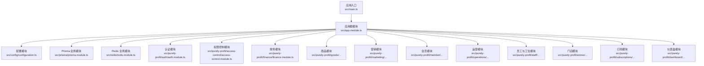
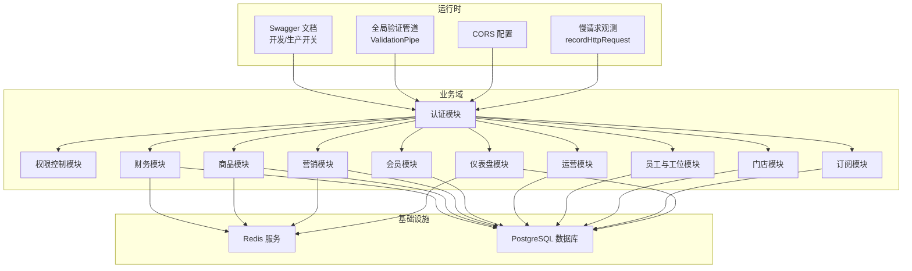
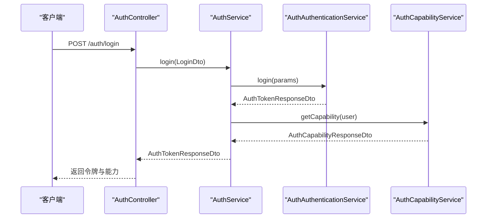
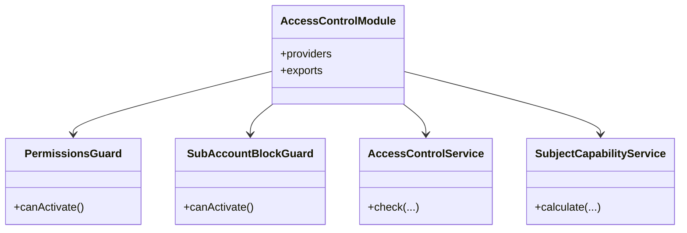
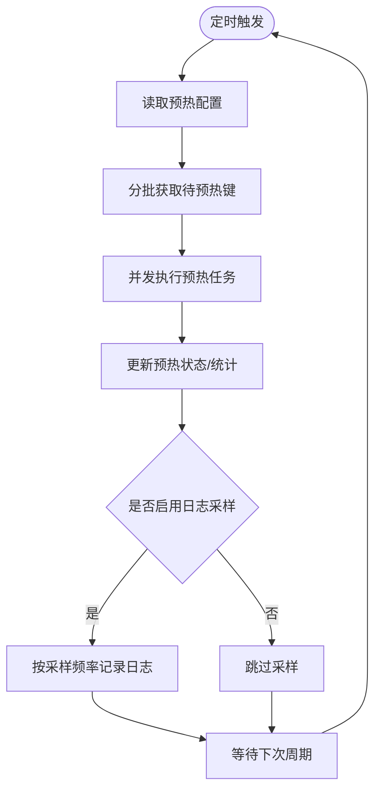
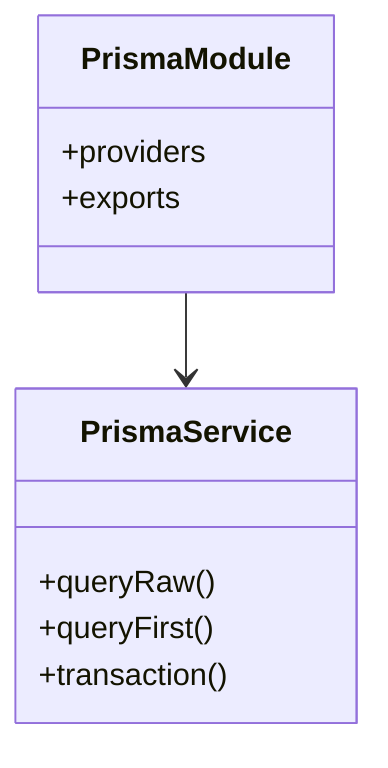
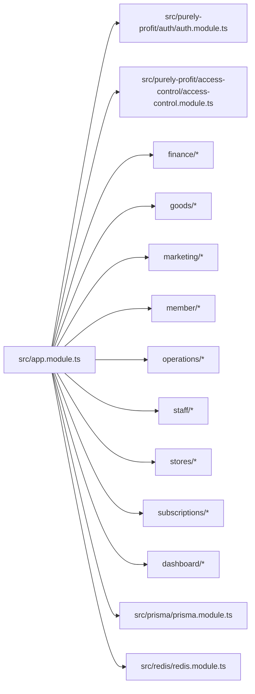

# 开发指南

<cite>
**本文引用的文件**
- [README.md](file://README.md)
- [package.json](file://package.json)
- [eslint.config.mjs](file://eslint.config.mjs)
- [.prettierrc](file://.prettierrc)
- [nest-cli.json](file://nest-cli.json)
- [src/config/configuration.ts](file://src/config/configuration.ts)
- [src/app.module.ts](file://src/app.module.ts)
- [src/main.ts](file://src/main.ts)
- [prisma/schema.prisma](file://prisma/schema.prisma)
- [scripts/check-f0rest-rules.mjs](file://scripts/check-f0rest-rules.mjs)
- [src/purely-profit/auth/auth.module.ts](file://src/purely-profit/auth/auth.module.ts)
- [src/purely-profit/auth/auth.service.ts](file://src/purely-profit/auth/auth.service.ts)
- [src/purely-profit/access-control/access-control.module.ts](file://src/purely-profit/access-control/access-control.module.ts)
- [src/redis/redis.module.ts](file://src/redis/redis.module.ts)
- [src/prisma/prisma.module.ts](file://src/prisma/prisma.module.ts)
</cite>

## 目录
1. [简介](#简介)
2. [项目结构](#项目结构)
3. [核心组件](#核心组件)
4. [架构总览](#架构总览)
5. [详细组件分析](#详细组件分析)
6. [依赖关系分析](#依赖关系分析)
7. [性能与可扩展性](#性能与可扩展性)
8. [调试与排错指南](#调试与排错指南)
9. [团队协作与规范](#团队协作与规范)
10. [结论](#结论)
11. [附录](#附录)

## 简介
本指南面向“purelyprofit-server”项目的开发者，系统化阐述代码规范、提交规范、分支管理策略、IDE 配置、调试技巧、代码审查流程、新模块开发指导原则与最佳实践、性能优化与并发处理要点，以及团队协作与文档维护要求。目标是帮助团队成员快速上手、保持一致的工程实践，并持续提升交付质量与效率。

## 项目结构
项目采用 NestJS 11 + Fastify + Prisma 的企业级后端架构，模块化清晰，按业务域划分（如 auth、finance、goods、marketing、member、operations、staff、stores、subscriptions、dashboard 等），并通过全局模块统一注入 Redis 与数据库服务。

图表来源
- [src/app.module.ts:1-83](file://src/app.module.ts#L1-L83)
- [src/main.ts:121-209](file://src/main.ts#L121-L209)
- [src/config/configuration.ts:8-139](file://src/config/configuration.ts#L8-L139)
- [src/prisma/prisma.module.ts:1-10](file://src/prisma/prisma.module.ts#L1-L10)
- [src/redis/redis.module.ts:1-16](file://src/redis/redis.module.ts#L1-L16)
- [src/purely-profit/auth/auth.module.ts:1-56](file://src/purely-profit/auth/auth.module.ts#L1-L56)
- [src/purely-profit/access-control/access-control.module.ts:1-23](file://src/purely-profit/access-control/access-control.module.ts#L1-L23)

章节来源
- [src/app.module.ts:1-83](file://src/app.module.ts#L1-L83)
- [src/main.ts:121-209](file://src/main.ts#L121-L209)
- [src/config/configuration.ts:8-139](file://src/config/configuration.ts#L8-L139)
- [prisma/schema.prisma:1-13](file://prisma/schema.prisma#L1-L13)

## 核心组件
- 应用引导与运行时配置
  - 入口函数负责创建 Nest 应用、设置 Fastify 适配器、启用 CORS、注册全局验证管道、Swagger 文档、端口回退与慢请求观测。
  - 关键参数来自配置模块，支持日志、超时、Keep-Alive、HTTP 体限制、Swagger 开关、慢请求阈值等。
- 配置中心
  - 统一从环境变量解析并导出应用、数据库、Redis、JWT、鉴权验证码有效期等配置。
- 数据库与缓存
  - Prisma 全局模块提供类型安全的数据库访问；Redis 全局模块提供缓存、失效与预热能力。
- 认证与权限
  - 认证模块基于 Passport/JWT，提供登录、注册、改密、忘记密码、头像与实名认证、能力查询等；权限控制模块提供守卫与主体能力计算。

章节来源
- [src/main.ts:121-209](file://src/main.ts#L121-L209)
- [src/config/configuration.ts:8-139](file://src/config/configuration.ts#L8-L139)
- [src/prisma/prisma.module.ts:1-10](file://src/prisma/prisma.module.ts#L1-L10)
- [src/redis/redis.module.ts:1-16](file://src/redis/redis.module.ts#L1-L16)
- [src/purely-profit/auth/auth.module.ts:1-56](file://src/purely-profit/auth/auth.module.ts#L1-L56)
- [src/purely-profit/access-control/access-control.module.ts:1-23](file://src/purely-profit/access-control/access-control.module.ts#L1-L23)

## 架构总览
系统以 Fastify 为 HTTP 引擎，NestJS 提供模块化与依赖注入，Prisma 负责数据持久化，Redis 提供缓存与预热。Swagger 在开发环境默认开启，生产环境可关闭。全局验证管道确保 DTO 校验与白名单过滤。

图表来源
- [src/main.ts:166-179](file://src/main.ts#L166-L179)
- [src/main.ts:146-152](file://src/main.ts#L146-L152)
- [src/main.ts:157-158](file://src/main.ts#L157-L158)
- [src/main.ts:160-164](file://src/main.ts#L160-L164)
- [src/app.module.ts:1-83](file://src/app.module.ts#L1-L83)
- [src/redis/redis.module.ts:1-16](file://src/redis/redis.module.ts#L1-L16)
- [src/prisma/prisma.module.ts:1-10](file://src/prisma/prisma.module.ts#L1-L10)

## 详细组件分析

### 认证模块（Auth）
- 设计要点
  - 采用 JWT + Passport 策略，分离鉴权、账号、会话、能力、短信、验证码等服务，职责单一。
  - 控制器仅负责路由与 DTO 映射，业务逻辑下沉至服务层。
- 关键流程（登录）

图表来源
- [src/purely-profit/auth/auth.service.ts:56-63](file://src/purely-profit/auth/auth.service.ts#L56-L63)
- [src/purely-profit/auth/auth.module.ts:21-56](file://src/purely-profit/auth/auth.module.ts#L21-L56)

章节来源
- [src/purely-profit/auth/auth.module.ts:1-56](file://src/purely-profit/auth/auth.module.ts#L1-L56)
- [src/purely-profit/auth/auth.service.ts:1-129](file://src/purely-profit/auth/auth.service.ts#L1-L129)

### 权限控制模块（Access Control）
- 设计要点
  - 全局模块，提供权限守卫与主体能力服务，贯穿各业务模块。
- 关系图

图表来源
- [src/purely-profit/access-control/access-control.module.ts:1-23](file://src/purely-profit/access-control/access-control.module.ts#L1-L23)

章节来源
- [src/purely-profit/access-control/access-control.module.ts:1-23](file://src/purely-profit/access-control/access-control.module.ts#L1-L23)

### 缓存与预热（Redis）
- 设计要点
  - Redis 全局模块导出 RedisService、CacheInvalidatorService、CachePrewarmService。
  - 支持缓存预热配置（间隔、初始延迟、批大小、并发度、慢周期阈值）。
- 流程图（缓存预热）

图表来源
- [src/redis/redis.module.ts:1-16](file://src/redis/redis.module.ts#L1-L16)
- [src/config/configuration.ts:59-86](file://src/config/configuration.ts#L59-L86)

章节来源
- [src/redis/redis.module.ts:1-16](file://src/redis/redis.module.ts#L1-L16)
- [src/config/configuration.ts:59-86](file://src/config/configuration.ts#L59-L86)

### 数据库（Prisma）
- 设计要点
  - Prisma 全局模块提供 PrismaService，业务模块通过服务访问数据库。
  - schema 将基础配置与领域模型分离，便于维护。
- 关系图

图表来源
- [src/prisma/prisma.module.ts:1-10](file://src/prisma/prisma.module.ts#L1-L10)
- [prisma/schema.prisma:1-13](file://prisma/schema.prisma#L1-L13)

章节来源
- [src/prisma/prisma.module.ts:1-10](file://src/prisma/prisma.module.ts#L1-L10)
- [prisma/schema.prisma:1-13](file://prisma/schema.prisma#L1-L13)

## 依赖关系分析
- 模块耦合
  - AppModule 作为根模块，集中导入所有业务模块与基础设施模块。
  - 认证模块与权限模块被广泛依赖；财务、商品、营销、会员、运营等模块均依赖数据库与缓存。
- 外部依赖
  - Fastify、Prisma、ioredis、class-validator、class-transformer、bcryptjs、passport-jwt 等。
- 运行脚本与工具链
  - ESLint + Prettier、Jest 单元/集成测试、Prisma 迁移与差异生成、自定义规则校验脚本。

图表来源
- [src/app.module.ts:1-83](file://src/app.module.ts#L1-L83)

章节来源
- [src/app.module.ts:1-83](file://src/app.module.ts#L1-L83)
- [package.json:31-86](file://package.json#L31-L86)

## 性能与可扩展性
- HTTP 层优化
  - 合理设置 Keep-Alive 与请求超时，避免长连接资源浪费与慢请求影响吞吐。
  - 慢请求观测与日志阈值可配置，默认开发环境开启，生产环境可关闭。
- 数据库与缓存
  - 使用 Prisma 查询构建器与索引设计，避免 N+1；结合 Redis 缓存热点数据与聚合结果。
  - 启用缓存预热，合理配置批次与并发度，降低冷启动抖动。
- 并发与可观测性
  - 使用 Fastify 的高性能事件钩子进行请求观测；必要时引入分布式追踪与指标上报。
- 部署与弹性
  - 端口回退策略避免启动冲突；容器化部署时结合健康检查与水平扩展。

章节来源
- [src/main.ts:136-144](file://src/main.ts#L136-L144)
- [src/main.ts:160-164](file://src/main.ts#L160-L164)
- [src/config/configuration.ts:19-50](file://src/config/configuration.ts#L19-L50)
- [src/config/configuration.ts:59-86](file://src/config/configuration.ts#L59-L86)

## 调试与排错指南
- 启动与端口
  - 若默认端口被占用，系统将自动尝试后续端口；可通过配置关闭自动偏移或调整最大偏移量。
- 日志与观测
  - 开启慢请求日志可定位慢接口；结合 Swagger 文档核对请求路径与参数。
- 数据库与迁移
  - 使用 Prisma 提供的迁移命令检查状态、生成差异 SQL、重置影子库等。
- 规则校验
  - 自定义规则脚本可拦截不合规写法（如直接读取环境变量、Controller 直接依赖缓存/数据库、使用 .then 链式调用等）。

章节来源
- [src/main.ts:87-119](file://src/main.ts#L87-L119)
- [src/main.ts:166-179](file://src/main.ts#L166-L179)
- [package.json:15-22](file://package.json#L15-L22)
- [scripts/check-f0rest-rules.mjs:1-130](file://scripts/check-f0rest-rules.mjs#L1-L130)

## 团队协作与规范

### 代码规范
- ESLint + Prettier
  - 使用 TypeScript ESLint 推荐配置与 Prettier 推荐集成，确保风格一致。
  - 测试文件放宽部分严格规则，但业务代码仍需遵循强类型约束。
- 规则校验脚本
  - 通过自定义脚本强制执行团队规范，包括：
    - Rule 4：Controller 禁止直接依赖 Prisma/Redis、禁止在控制器处理密码哈希。
    - Rule 5：DTO 必须使用 class-validator 与 Swagger 注解；Controller 必须补充 Api 注解。
    - Rule 6：业务代码禁止直接读取 process.env。
    - Rule 7：后端异步统一使用 async/await。
    - Rule 8：禁止在业务文件中直接 new Redis()。
    - Rule 10：单文件不超过 400 行（可强制）。

章节来源
- [eslint.config.mjs:1-48](file://eslint.config.mjs#L1-L48)
- [.prettierrc:1-5](file://.prettierrc#L1-L5)
- [scripts/check-f0rest-rules.mjs:1-130](file://scripts/check-f0rest-rules.mjs#L1-L130)

### 提交规范
- 建议采用约定式提交（如 feat、fix、docs、refactor、test、chore），配合变更集描述与关联 Issue。
- 提交前执行：
  - 代码格式化与 ESLint 检查
  - 单元测试与关键集成测试
  - 规则校验脚本
- 变更日志
  - 按模块维度维护变更摘要，便于发布与回溯。

### 分支管理策略
- 主干保护
  - master/main 仅允许通过 Pull Request 合并，且需通过 CI 与代码审查。
- 分支命名
  - 功能分支：feature/模块名/简述
  - 修复分支：fix/模块名/简述
  - 热修复：hotfix/版本号/简述
- 合并与清理
  - 合并后删除分支，保持仓库整洁；大版本合并建议使用 squash 合并。

### 代码审查流程
- 触发条件
  - 所有功能与修复 PR 必须通过至少一名 reviewer 同意。
- 审查清单
  - 是否满足需求与边界条件
  - 是否遵循模块分层与依赖边界（Controller 不直接依赖 Prisma/Redis）
  - DTO 是否具备完整校验与注解
  - 是否存在潜在性能问题（慢查询、缓存缺失、N+1）
  - 是否有充分测试覆盖
  - 是否通过规则校验脚本
- 工具与自动化
  - CI 中集成 ESLint、Jest、规则校验脚本与 Prisma 迁移检查。

### 新模块开发指导原则
- 分层与职责
  - 控制器：仅处理路由、DTO 映射与异常包装。
  - 服务：封装业务逻辑与跨领域协调。
  - 数据访问：通过 PrismaService；缓存通过 RedisService。
- DTO 与校验
  - 所有输入输出 DTO 使用 class-validator 与 Swagger 注解。
- 配置与环境
  - 通过配置中心读取环境变量，避免直接访问 process.env。
- 缓存与预热
  - 对热点数据与聚合结果使用缓存；必要时实现预热策略。
- 测试
  - 单测覆盖核心业务分支；关键流程补充 E2E 测试。
- 文档
  - Swagger 文档与模块内注释同步更新。

### 常见陷阱与规避
- 直接依赖底层基础设施：避免在 Controller/Service 中直接 new Prisma/Redis 客户端。
- 异步风格不一致：统一使用 async/await，避免 .then/.catch 链式调用。
- DTO 缺失校验：确保每个 DTO 字段都有对应校验装饰器与注解。
- 环境变量滥用：统一通过配置中心读取，避免散落的 process.env。
- 文件过大：单文件超过 400 行应拆分，保持高内聚低耦合。

章节来源
- [scripts/check-f0rest-rules.mjs:44-115](file://scripts/check-f0rest-rules.mjs#L44-L115)
- [src/purely-profit/auth/auth.module.ts:21-56](file://src/purely-profit/auth/auth.module.ts#L21-L56)
- [src/purely-profit/auth/auth.service.ts:29-36](file://src/purely-profit/auth/auth.service.ts#L29-L36)

## 结论
本指南提供了从架构理解、模块实践到团队协作的全栈开发指引。建议团队在日常开发中坚持“分层清晰、依赖可控、可观测可测试”的原则，配合规则校验与 CI，持续提升系统稳定性与交付效率。

## 附录

### IDE 配置建议
- VS Code
  - 插件：ESLint、Prettier、TypeScript Importer、DotENV、Prisma
  - 设置：editor.formatOnSave、editor.codeActionsOnSave、typescript.preferences.importModuleSpecifier
- IntelliJ/WebStorm
  - 启用 ESLint、Prettier、TypeScript 编译器集成

### 调试技巧
- 启动调试模式：使用调试脚本启动应用，断点定位服务层与控制器。
- 观测慢请求：开启慢请求日志，结合 Swagger 定位问题接口。
- 数据库调试：使用 Prisma Studio 或 psql 查看数据状态与索引。

### 性能优化清单
- HTTP：合理设置超时与 Keep-Alive，减少空闲连接。
- 缓存：热点数据预热、聚合结果缓存、失效策略。
- 数据库：索引优化、批量操作、避免 N+1。
- 并发：控制并发度与批大小，避免缓存击穿。

### 文档维护与知识分享
- 文档同步：代码变更时同步更新 Swagger 与模块注释。
- 知识库：沉淀常见问题、排查步骤与最佳实践，定期回顾与分享。