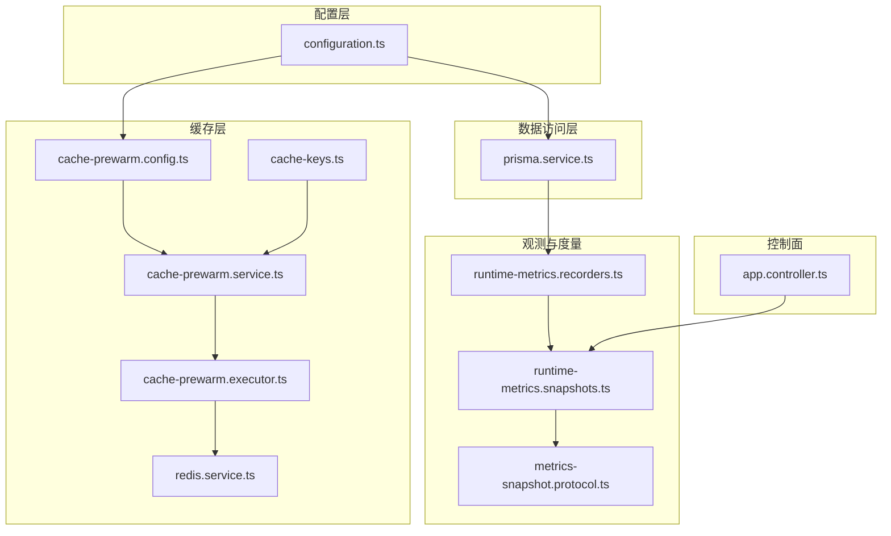
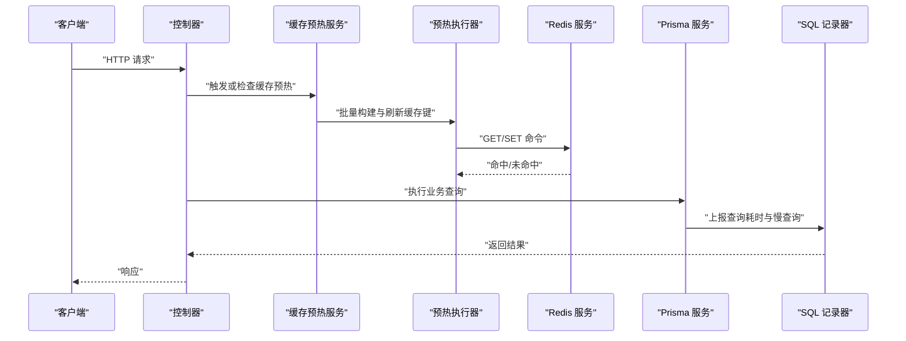
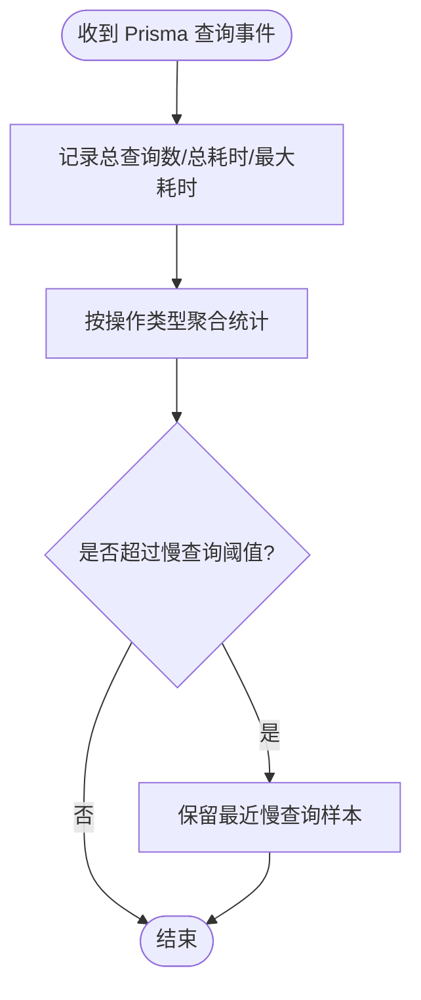
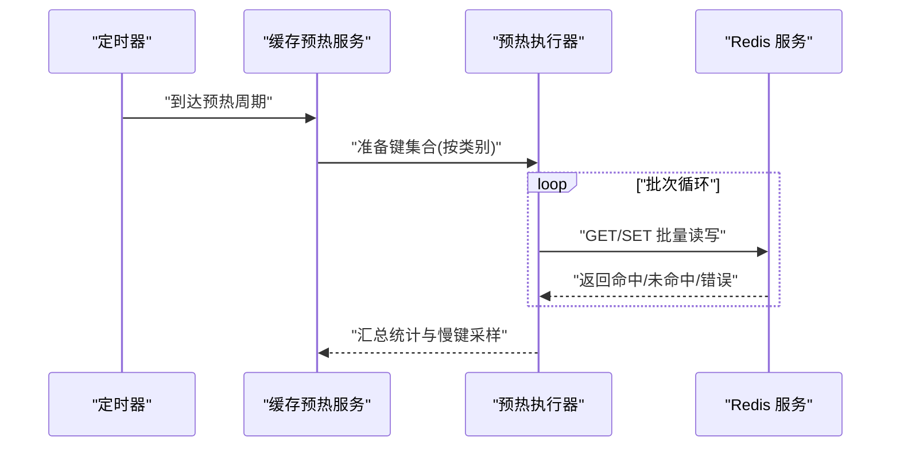
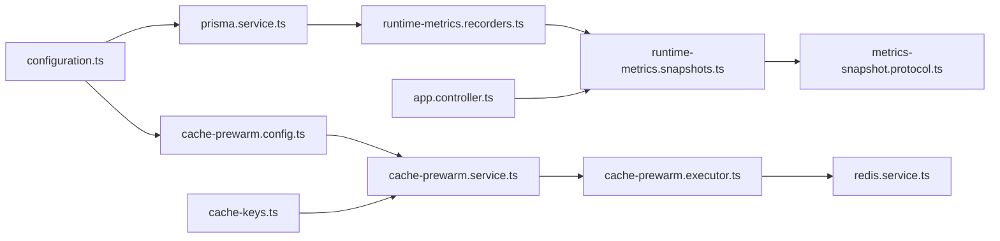

# 性能优化

<cite>
**本文引用的文件**
- [src/config/configuration.ts](file://src/config/configuration.ts)
- [src/prisma/prisma.service.ts](file://src/prisma/prisma.service.ts)
- [src/observability/runtime-metrics.recorders.ts](file://src/observability/runtime-metrics.recorders.ts)
- [src/observability/runtime-metrics.snapshots.ts](file://src/observability/runtime-metrics.snapshots.ts)
- [src/observability/metrics-snapshot.protocol.ts](file://src/observability/metrics-snapshot.protocol.ts)
- [src/redis/cache-prewarm.service.ts](file://src/redis/cache-prewarm.service.ts)
- [src/redis/cache-prewarm.config.ts](file://src/redis/cache-prewarm.config.ts)
- [src/redis/cache-prewarm.executor.ts](file://src/redis/cache-prewarm.executor.ts)
- [src/redis/redis.service.ts](file://src/redis/redis.service.ts)
- [src/redis/cache-keys.ts](file://src/redis/cache-keys.ts)
- [src/app.controller.ts](file://src/app.controller.ts)
</cite>

## 目录
1. [简介](#简介)
2. [项目结构](#项目结构)
3. [核心组件](#核心组件)
4. [架构总览](#架构总览)
5. [详细组件分析](#详细组件分析)
6. [依赖关系分析](#依赖关系分析)
7. [性能考量](#性能考量)
8. [故障排查指南](#故障排查指南)
9. [结论](#结论)
10. [附录](#附录)

## 简介
本指南聚焦于 purelyprofit-server 的性能优化实践，覆盖数据库查询优化、缓存策略优化（含 Redis 预热）、内存使用与并发处理优化，并提供慢查询识别与优化技巧、索引设计与查询计划分析方法、性能监控指标与基准测试建议、瓶颈识别技术以及代码层面的异步与资源管理最佳实践。文档中的所有分析均基于仓库中已存在的配置、观测与实现文件。

## 项目结构
该项目采用 NestJS 架构，按功能域划分模块，核心性能相关能力集中在以下位置：
- 配置层：应用运行参数（如慢查询阈值、缓存预热开关与批大小等）集中于配置文件
- 数据访问层：Prisma 服务监听查询事件并记录 SQL 指标
- 观测与度量：运行时指标状态、快照生成与摘要面板联动
- 缓存层：Redis 服务与缓存预热执行器、配置与日志工具
- 控制器：对外暴露性能相关接口与诊断信息

图表来源
- [src/config/configuration.ts:47-87](file://src/config/configuration.ts#L47-L87)
- [src/prisma/prisma.service.ts:32-63](file://src/prisma/prisma.service.ts#L32-L63)
- [src/observability/runtime-metrics.recorders.ts:112-152](file://src/observability/runtime-metrics.recorders.ts#L112-L152)
- [src/observability/runtime-metrics.snapshots.ts:77-136](file://src/observability/runtime-metrics.snapshots.ts#L77-L136)
- [src/observability/metrics-snapshot.protocol.ts:57-112](file://src/observability/metrics-snapshot.protocol.ts#L57-L112)
- [src/redis/cache-prewarm.service.ts](file://src/redis/cache-prewarm.service.ts)
- [src/redis/cache-prewarm.config.ts](file://src/redis/cache-prewarm.config.ts)
- [src/redis/cache-prewarm.executor.ts](file://src/redis/cache-prewarm.executor.ts)
- [src/redis/redis.service.ts](file://src/redis/redis.service.ts)
- [src/redis/cache-keys.ts](file://src/redis/cache-keys.ts)
- [src/app.controller.ts](file://src/app.controller.ts)

章节来源
- [src/config/configuration.ts:47-87](file://src/config/configuration.ts#L47-L87)
- [src/prisma/prisma.service.ts:32-63](file://src/prisma/prisma.service.ts#L32-L63)
- [src/observability/runtime-metrics.recorders.ts:112-152](file://src/observability/runtime-metrics.recorders.ts#L112-L152)
- [src/observability/runtime-metrics.snapshots.ts:77-136](file://src/observability/runtime-metrics.snapshots.ts#L77-L136)
- [src/observability/metrics-snapshot.protocol.ts:57-112](file://src/observability/metrics-snapshot.protocol.ts#L57-L112)
- [src/redis/cache-prewarm.service.ts](file://src/redis/cache-prewarm.service.ts)
- [src/redis/cache-prewarm.config.ts](file://src/redis/cache-prewarm.config.ts)
- [src/redis/cache-prewarm.executor.ts](file://src/redis/cache-prewarm.executor.ts)
- [src/redis/redis.service.ts](file://src/redis/redis.service.ts)
- [src/redis/cache-keys.ts](file://src/redis/cache-keys.ts)
- [src/app.controller.ts](file://src/app.controller.ts)

## 核心组件
- 应用配置与阈值
  - 慢查询阈值、慢 Redis 日志阈值、分页默认与最大尺寸、缓存预热开关与批大小、并发度、采样频率、慢周期阈值等
- Prisma 查询监听与 SQL 指标
  - 记录查询次数、总耗时、最大耗时、按操作聚合、慢查询样本
- 运行时指标快照与协议
  - SQL/Redis/缓存预热指标快照结构与最近慢查询/慢操作列表
- Redis 缓存预热
  - 预热配置、执行器、服务与键空间管理
- 控制器与诊断
  - 对外暴露性能相关接口与诊断信息

章节来源
- [src/config/configuration.ts:47-87](file://src/config/configuration.ts#L47-L87)
- [src/prisma/prisma.service.ts:32-63](file://src/prisma/prisma.service.ts#L32-L63)
- [src/observability/runtime-metrics.recorders.ts:112-152](file://src/observability/runtime-metrics.recorders.ts#L112-L152)
- [src/observability/runtime-metrics.snapshots.ts:77-136](file://src/observability/runtime-metrics.snapshots.ts#L77-L136)
- [src/observability/metrics-snapshot.protocol.ts:57-112](file://src/observability/metrics-snapshot.protocol.ts#L57-L112)
- [src/redis/cache-prewarm.service.ts](file://src/redis/cache-prewarm.service.ts)
- [src/redis/cache-prewarm.config.ts](file://src/redis/cache-prewarm.config.ts)
- [src/redis/cache-prewarm.executor.ts](file://src/redis/cache-prewarm.executor.ts)
- [src/redis/redis.service.ts](file://src/redis/redis.service.ts)
- [src/redis/cache-keys.ts](file://src/redis/cache-keys.ts)
- [src/app.controller.ts](file://src/app.controller.ts)

## 架构总览
下图展示了从请求到数据库与 Redis 的关键路径，以及性能观测如何贯穿其中：

图表来源
- [src/redis/cache-prewarm.service.ts](file://src/redis/cache-prewarm.service.ts)
- [src/redis/cache-prewarm.executor.ts](file://src/redis/cache-prewarm.executor.ts)
- [src/redis/redis.service.ts](file://src/redis/redis.service.ts)
- [src/prisma/prisma.service.ts:32-63](file://src/prisma/prisma.service.ts#L32-L63)
- [src/observability/runtime-metrics.recorders.ts:112-152](file://src/observability/runtime-metrics.recorders.ts#L112-L152)
- [src/app.controller.ts](file://src/app.controller.ts)

## 详细组件分析

### 数据库查询优化（Prisma + SQL 指标）
- 监听与记录
  - Prisma 在 query 事件中捕获 SQL 语句与耗时，并调用记录器进行统计与慢查询判定
  - 记录器按“操作类型”聚合查询次数与总耗时，并在超过阈值时保留最近慢查询样本
- 指标快照
  - 快照提供总查询数、平均/最大耗时、按操作聚合的耗时分布、最近慢查询列表
- 优化要点
  - 使用统一的慢查询阈值配置，结合快照中的“按操作聚合”定位热点
  - 结合 schema 与迁移文件中的索引设计，确保高频过滤/排序字段具备合适索引
  - 将复杂查询拆分为可缓存的子查询，减少重复扫描

图表来源
- [src/prisma/prisma.service.ts:32-63](file://src/prisma/prisma.service.ts#L32-L63)
- [src/observability/runtime-metrics.recorders.ts:112-152](file://src/observability/runtime-metrics.recorders.ts#L112-L152)
- [src/observability/runtime-metrics.snapshots.ts:77-101](file://src/observability/runtime-metrics.snapshots.ts#L77-L101)

章节来源
- [src/prisma/prisma.service.ts:32-63](file://src/prisma/prisma.service.ts#L32-L63)
- [src/observability/runtime-metrics.recorders.ts:112-152](file://src/observability/runtime-metrics.recorders.ts#L112-L152)
- [src/observability/runtime-metrics.snapshots.ts:77-101](file://src/observability/runtime-metrics.snapshots.ts#L77-L101)
- [src/observability/metrics-snapshot.protocol.ts:57-64](file://src/observability/metrics-snapshot.protocol.ts#L57-L64)

### 缓存策略优化（Redis + 缓存预热）
- 配置与阈值
  - 缓存预热开关、间隔、初始延迟、批次大小、并发度、慢周期阈值、日志采样频率等
- 预热执行
  - 批量构建目标键集合，按类别（仪表盘、业务分析、财务概览）分发任务，记录每轮命中/失效/失败数量与耗时分布
  - 对慢键进行采样并归因失败原因，支持按类别查看最慢键与失败原因
- 优化要点
  - 合理设置批次大小与并发度，避免对 Redis 造成瞬时压力峰值
  - 针对高热度键优先预热，结合命中率与最近慢操作列表动态调整
  - 失败键按错误标签与失败原因聚合，便于快速定位系统性问题

图表来源
- [src/config/configuration.ts:59-87](file://src/config/configuration.ts#L59-L87)
- [src/redis/cache-prewarm.service.ts](file://src/redis/cache-prewarm.service.ts)
- [src/redis/cache-prewarm.executor.ts](file://src/redis/cache-prewarm.executor.ts)
- [src/redis/redis.service.ts](file://src/redis/redis.service.ts)
- [src/observability/runtime-metrics.recorders.ts:212-248](file://src/observability/runtime-metrics.recorders.ts#L212-L248)
- [src/observability/runtime-metrics.snapshots.ts:103-136](file://src/observability/runtime-metrics.snapshots.ts#L103-L136)

章节来源
- [src/config/configuration.ts:59-87](file://src/config/configuration.ts#L59-L87)
- [src/redis/cache-prewarm.service.ts](file://src/redis/cache-prewarm.service.ts)
- [src/redis/cache-prewarm.executor.ts](file://src/redis/cache-prewarm.executor.ts)
- [src/redis/redis.service.ts](file://src/redis/redis.service.ts)
- [src/observability/runtime-metrics.recorders.ts:212-248](file://src/observability/runtime-metrics.recorders.ts#L212-L248)
- [src/observability/runtime-metrics.snapshots.ts:103-136](file://src/observability/runtime-metrics.snapshots.ts#L103-L136)

### 内存使用优化
- 指标采集
  - 快照中提供 Redis 命令维度的命中率、慢调用占比、最近慢操作列表；SQL 维度提供慢查询计数与按操作聚合耗时
- 优化建议
  - 关注慢调用与低命中率命令，优先优化热点键与过期策略
  - 对 SQL 聚合快照中的高耗时操作进行索引与查询计划优化
  - 控制慢查询与慢 Redis 采样频率，避免过多日志开销

章节来源
- [src/observability/runtime-metrics.snapshots.ts:103-136](file://src/observability/runtime-metrics.snapshots.ts#L103-L136)
- [src/observability/runtime-metrics.snapshots.ts:77-101](file://src/observability/runtime-metrics.snapshots.ts#L77-L101)
- [src/observability/metrics-snapshot.protocol.ts:66-93](file://src/observability/metrics-snapshot.protocol.ts#L66-L93)

### 并发处理优化
- 缓存预热并发
  - 通过并发度与批次大小控制预热吞吐与资源占用，结合慢周期阈值限制单次预热的最大耗时
- SQL 并发
  - 通过慢查询阈值与采样频率平衡可观测性与性能影响
- 优化建议
  - 动态调节并发度以匹配 Redis 与数据库的承载能力
  - 对高延迟操作进行限流或降级，保障关键路径稳定

章节来源
- [src/config/configuration.ts:69-87](file://src/config/configuration.ts#L69-L87)
- [src/observability/runtime-metrics.recorders.ts:112-152](file://src/observability/runtime-metrics.recorders.ts#L112-L152)

### 慢查询识别与优化技巧
- 识别
  - SQL 快照中的“最近慢查询”列表与“按操作聚合耗时”帮助定位热点
  - 结合 schema 与迁移文件中的索引设计，确认过滤/排序字段是否具备索引
- 优化
  - 减少全表扫描：为 WHERE、JOIN、ORDER BY 字段建立合适索引
  - 避免函数包裹列：尽量让索引列直接参与比较
  - 使用 EXPLAIN/ANALYZE 分析查询计划，关注回表次数与行数估计
  - 将复杂聚合拆分为可缓存的中间结果，降低实时计算压力

章节来源
- [src/observability/runtime-metrics.snapshots.ts:77-101](file://src/observability/runtime-metrics.snapshots.ts#L77-L101)
- [src/observability/metrics-snapshot.protocol.ts:57-64](file://src/observability/metrics-snapshot.protocol.ts#L57-L64)

### Redis 缓存预热策略
- 策略
  - 按类别（仪表盘、业务分析、财务概览）分发预热任务，记录每类耗时分布与失败原因
  - 对慢键进行采样并按错误标签聚合，便于快速定位系统性问题
- 优化
  - 优先预热高热度键，结合命中率与最近慢操作列表动态调整
  - 控制批次大小与并发度，避免瞬时压力峰值
  - 对失败键进行分类统计，修复共性问题（如键结构变更、权限不足）

章节来源
- [src/redis/cache-prewarm.service.ts](file://src/redis/cache-prewarm.service.ts)
- [src/redis/cache-prewarm.executor.ts](file://src/redis/cache-prewarm.executor.ts)
- [src/redis/cache-keys.ts](file://src/redis/cache-keys.ts)
- [src/observability/runtime-metrics.recorders.ts:212-248](file://src/observability/runtime-metrics.recorders.ts#L212-L248)
- [src/observability/runtime-metrics.snapshots.ts:103-136](file://src/observability/runtime-metrics.snapshots.ts#L103-L136)

### 数据库索引设计与查询计划分析
- 索引设计
  - 参考迁移文件中的索引创建语句，确保高频过滤/排序字段具备索引
- 查询计划
  - 使用 EXPLAIN/ANALYZE 分析查询计划，关注回表次数、行数估计与索引选择
  - 结合慢查询快照定位高耗时操作，针对性补充或调整索引

章节来源
- [prisma/migrations/.../add_performance_indexes/migration.sql](file://prisma/migrations/20260513130000_add_performance_indexes/migration.sql)
- [prisma/migrations/.../add_list_filter_indexes/migration.sql](file://prisma/migrations/20260513143000_add_list_filter_indexes/migration.sql)

### 性能监控指标与诊断
- 指标
  - SQL：总查询数、平均/最大耗时、慢查询数、按操作聚合耗时、最近慢查询
  - Redis：总调用数、平均/最大耗时、各命令命中率与慢调用、最近慢操作
  - 缓存预热：总周期数、总耗时、命中/失效/失败计数、慢键采样与失败原因分布
- 诊断
  - 通过摘要面板联动定位低命中率命令与慢操作
  - 利用“最近慢查询/慢操作”列表与“按操作聚合耗时”快速定位热点

章节来源
- [src/observability/metrics-snapshot.protocol.ts:57-112](file://src/observability/metrics-snapshot.protocol.ts#L57-L112)
- [src/observability/runtime-metrics.snapshots.ts:77-136](file://src/observability/runtime-metrics.snapshots.ts#L77-L136)
- [src/observability/runtime-metrics.summary-actions.ts:61-92](file://src/observability/runtime-metrics.summary-actions.ts#L61-L92)

### 基准测试与瓶颈识别
- 建议方法
  - 使用压测工具对关键路径（查询+预热）施加负载，观察慢查询与慢 Redis 指标变化
  - 逐步提升并发与数据规模，识别数据库与 Redis 的瓶颈点
- 瓶颈识别
  - 若慢查询数显著上升且平均耗时增加，优先检查索引与查询计划
  - 若 Redis 命中率下降且慢调用增多，优先检查键结构与过期策略

章节来源
- [src/config/configuration.ts:47-87](file://src/config/configuration.ts#L47-L87)
- [src/observability/runtime-metrics.recorders.ts:112-152](file://src/observability/runtime-metrics.recorders.ts#L112-L152)

### 代码层面优化技巧
- 异步处理
  - 缓存预热采用批量与并发策略，避免阻塞主请求线程
- 资源管理
  - 合理设置批次大小与并发度，结合慢周期阈值限制单次操作的资源占用
  - 对慢键采样与失败原因聚合，减少无效日志输出

章节来源
- [src/config/configuration.ts:69-87](file://src/config/configuration.ts#L69-L87)
- [src/redis/cache-prewarm.executor.ts](file://src/redis/cache-prewarm.executor.ts)
- [src/observability/runtime-metrics.recorders.ts:212-248](file://src/observability/runtime-metrics.recorders.ts#L212-L248)

## 依赖关系分析
- 配置驱动行为
  - configuration.ts 中的阈值与开关直接影响 Prisma 监听与缓存预热策略
- 观测贯穿链路
  - Prisma 事件 → 记录器 → 快照 → 协议定义 → 控制器展示
- 缓存预热闭环
  - 配置 → 预热服务 → 执行器 → Redis → 统计与采样

图表来源
- [src/config/configuration.ts:47-87](file://src/config/configuration.ts#L47-L87)
- [src/prisma/prisma.service.ts:32-63](file://src/prisma/prisma.service.ts#L32-L63)
- [src/observability/runtime-metrics.recorders.ts:112-152](file://src/observability/runtime-metrics.recorders.ts#L112-L152)
- [src/observability/runtime-metrics.snapshots.ts:77-136](file://src/observability/runtime-metrics.snapshots.ts#L77-L136)
- [src/observability/metrics-snapshot.protocol.ts:57-112](file://src/observability/metrics-snapshot.protocol.ts#L57-L112)
- [src/redis/cache-prewarm.config.ts](file://src/redis/cache-prewarm.config.ts)
- [src/redis/cache-prewarm.service.ts](file://src/redis/cache-prewarm.service.ts)
- [src/redis/cache-prewarm.executor.ts](file://src/redis/cache-prewarm.executor.ts)
- [src/redis/redis.service.ts](file://src/redis/redis.service.ts)
- [src/redis/cache-keys.ts](file://src/redis/cache-keys.ts)
- [src/app.controller.ts](file://src/app.controller.ts)

章节来源
- [src/config/configuration.ts:47-87](file://src/config/configuration.ts#L47-L87)
- [src/prisma/prisma.service.ts:32-63](file://src/prisma/prisma.service.ts#L32-L63)
- [src/observability/runtime-metrics.recorders.ts:112-152](file://src/observability/runtime-metrics.recorders.ts#L112-L152)
- [src/observability/runtime-metrics.snapshots.ts:77-136](file://src/observability/runtime-metrics.snapshots.ts#L77-L136)
- [src/observability/metrics-snapshot.protocol.ts:57-112](file://src/observability/metrics-snapshot.protocol.ts#L57-L112)
- [src/redis/cache-prewarm.config.ts](file://src/redis/cache-prewarm.config.ts)
- [src/redis/cache-prewarm.service.ts](file://src/redis/cache-prewarm.service.ts)
- [src/redis/cache-prewarm.executor.ts](file://src/redis/cache-prewarm.executor.ts)
- [src/redis/redis.service.ts](file://src/redis/redis.service.ts)
- [src/redis/cache-keys.ts](file://src/redis/cache-keys.ts)
- [src/app.controller.ts](file://src/app.controller.ts)

## 性能考量
- 阈值与采样
  - 合理设置慢查询与慢 Redis 阈值，避免过度采样导致额外开销
- 批量与并发
  - 通过批次大小与并发度平衡吞吐与资源占用，结合慢周期阈值限制单次操作耗时
- 热点治理
  - 优先优化高耗时操作与低命中率命令，配合缓存预热与索引优化
- 可观测性
  - 利用快照与摘要面板联动，持续跟踪关键指标变化趋势

## 故障排查指南
- 慢查询定位
  - 查看 SQL 快照中的“最近慢查询”与“按操作聚合耗时”，结合 EXPLAIN/ANALYZE 分析
- Redis 低命中率
  - 查看 Redis 快照中的“命中率”与“慢调用”，定位低效命令与键结构问题
- 缓存预热失败
  - 查看预热快照中的“失败计数/失败原因分布”，按类别与错误标签定位问题

章节来源
- [src/observability/runtime-metrics.snapshots.ts:77-136](file://src/observability/runtime-metrics.snapshots.ts#L77-L136)
- [src/observability/runtime-metrics.summary-actions.ts:61-92](file://src/observability/runtime-metrics.summary-actions.ts#L61-L92)
- [src/observability/runtime-metrics.recorders.ts:212-248](file://src/observability/runtime-metrics.recorders.ts#L212-L248)

## 结论
本指南基于仓库现有配置与观测实现，提供了数据库查询、Redis 缓存与缓存预热、内存与并发处理的优化路径。建议以阈值与采样为基础，结合 SQL 与 Redis 快照持续监控，针对热点与低效环节进行索引与查询计划优化、键结构与过期策略调整，并通过合理的批量与并发策略保障系统稳定性与吞吐。

## 附录
- 关键实现参考路径
  - 配置与阈值：[src/config/configuration.ts:47-87](file://src/config/configuration.ts#L47-L87)
  - SQL 监听与记录：[src/prisma/prisma.service.ts:32-63](file://src/prisma/prisma.service.ts#L32-L63)、[src/observability/runtime-metrics.recorders.ts:112-152](file://src/observability/runtime-metrics.recorders.ts#L112-L152)
  - 指标快照与协议：[src/observability/runtime-metrics.snapshots.ts:77-136](file://src/observability/runtime-metrics.snapshots.ts#L77-L136)、[src/observability/metrics-snapshot.protocol.ts:57-112](file://src/observability/metrics-snapshot.protocol.ts#L57-L112)
  - 缓存预热：[src/redis/cache-prewarm.service.ts](file://src/redis/cache-prewarm.service.ts)、[src/redis/cache-prewarm.config.ts](file://src/redis/cache-prewarm.config.ts)、[src/redis/cache-prewarm.executor.ts](file://src/redis/cache-prewarm.executor.ts)、[src/redis/redis.service.ts](file://src/redis/redis.service.ts)、[src/redis/cache-keys.ts](file://src/redis/cache-keys.ts)
  - 控制器与诊断：[src/app.controller.ts](file://src/app.controller.ts)