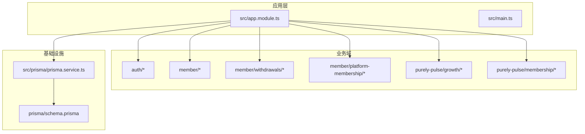
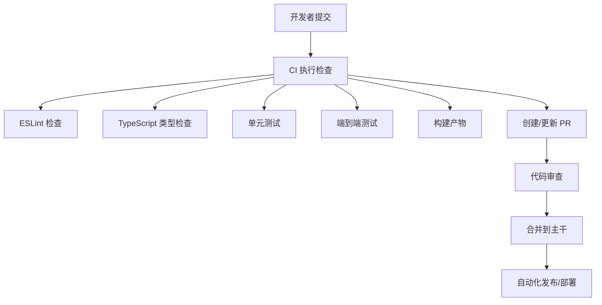
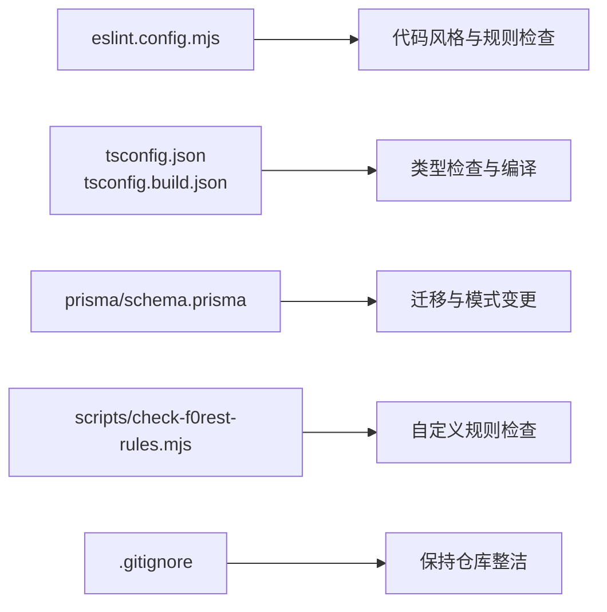

# 提交规范

<cite>
**本文引用的文件**
- [README.md](file://README.md)
- [package.json](file://package.json)
- [eslint.config.mjs](file://eslint.config.mjs)
- [prisma.config.ts](file://prisma.config.ts)
- [tsconfig.json](file://tsconfig.json)
- [tsconfig.build.json](file://tsconfig.build.json)
- [.gitignore](file://.gitignore)
- [scripts/check-f0rest-rules.mjs](file://scripts/check-f0rest-rules.mjs)
- [src/app.module.ts](file://src/app.module.ts)
- [src/main.ts](file://src/main.ts)
- [src/purely-profit/auth/auth.controller.ts](file://src/purely-profit/auth/auth.controller.ts)
- [src/purely-profit/member/platform-membership/platform-membership.controller.ts](file://src/purely-profit/member/platform-membership/platform-membership.controller.ts)
- [src/purely-profit/member/withdrawals/withdrawals.controller.ts](file://src/purely-profit/member/withdrawals/withdrawals.controller.ts)
- [src/purely-pulse/growth/growth.controller.ts](file://src/purely-pulse/growth/growth.controller.ts)
- [src/purely-pulse/membership/dto/pulse-membership-admin-members.request.dto.js](file://src/purely-pulse/membership/dto/pulse-membership-admin-members.request.dto.js)
- [dist/src/purely-profit/member/platform-membership/platform-membership.controller.js](file://dist/src/purely-profit/member/platform-membership/platform-membership.controller.js)
- [dist/src/purely-profit/member/withdrawals/withdrawals.controller.js](file://dist/src/purely-profit/member/withdrawals/withdrawals.controller.js)
- [src/prisma/prisma.service.ts](file://src/prisma/prisma.service.ts)
- [prisma/schema.prisma](file://prisma/schema.prisma)
</cite>

## 目录
1. [引言](#引言)
2. [项目结构](#项目结构)
3. [核心组件](#核心组件)
4. [架构总览](#架构总览)
5. [详细组件分析](#详细组件分析)
6. [依赖分析](#依赖分析)
7. [性能考虑](#性能考虑)
8. [故障排查指南](#故障排查指南)
9. [结论](#结论)
10. [附录](#附录)

## 引言
本文件为 purelyprofit-server 的 Git 提交规范与流程指南，旨在统一团队在版本控制上的沟通方式，确保提交信息清晰、可追溯，并为后续自动化检查、发布与回溯提供基础。内容覆盖提交信息格式、类型与 Scope 规范、描述编写标准、PR 创建与审查流程、以及与现有代码质量工具的集成建议。

## 项目结构
该项目采用 NestJS 框架，模块化组织业务域，配合 Prisma 进行数据库建模与迁移管理。整体结构如下图所示：

图表来源
- [src/app.module.ts](file://src/app.module.ts)
- [src/main.ts](file://src/main.ts)
- [src/prisma/prisma.service.ts](file://src/prisma/prisma.service.ts)
- [prisma/schema.prisma](file://prisma/schema.prisma)

章节来源
- [src/app.module.ts](file://src/app.module.ts)
- [src/main.ts](file://src/main.ts)
- [prisma/schema.prisma](file://prisma/schema.prisma)

## 核心组件
- 提交信息格式
  - 类型（type）：feat、fix、docs、style、refactor、test、chore 等
  - Scope：限定影响范围（如 auth、member.withdrawals、finance.account）
  - 标题：简洁明确地概括变更
  - 描述：必要时补充动机、影响面与风险提示
  - 关联：可选引用 Issue 或 PR 编号
- 提交信息模板
  - 格式建议：type(scope): 标题
  - 示例：feat(auth): 新增登录接口；fix(member.withdrawals): 修复重复提交校验
- Scope 规范
  - 使用点号分隔层级（如 member.withdrawals），避免过宽或过窄
  - 避免使用“全局”“通用”等模糊 Scope
- 描述编写标准
  - 使用祈使句，避免“我/我们做了...”
  - 说明变更动机、影响范围与潜在风险
  - 必要时附上测试要点或回归清单
- 合并请求（PR）流程
  - 分支策略：从 develop 切出功能分支，完成后合并回 develop
  - PR 描述：简述变更目的、改动范围、测试情况与注意事项
  - 代码审查：至少一名维护者通过，无阻塞式问题
  - 自动化检查：通过 ESLint、单元测试、E2E 测试与构建检查
- 自动化检查配置
  - ESLint：统一代码风格与规则
  - TypeScript：严格类型检查
  - Prisma：模式变更需配套迁移
  - 脚本：可扩展自定义规则检查（如 scripts/check-f0rest-rules.mjs）

章节来源
- [eslint.config.mjs](file://eslint.config.mjs)
- [tsconfig.json](file://tsconfig.json)
- [tsconfig.build.json](file://tsconfig.build.json)
- [prisma.config.ts](file://prisma.config.ts)
- [scripts/check-f0rest-rules.mjs](file://scripts/check-f0rest-rules.mjs)

## 架构总览
下图展示提交信息在开发到部署链路中的作用与关联：

图表来源
- [eslint.config.mjs](file://eslint.config.mjs)
- [tsconfig.json](file://tsconfig.json)
- [tsconfig.build.json](file://tsconfig.build.json)
- [README.md](file://README.md)

## 详细组件分析

### 提交信息类型与 Scope 规范
- 类型（type）
  - feat：新增功能
  - fix：修复缺陷
  - docs：仅文档变更
  - style：不影响逻辑的样式/格式调整
  - refactor：重构但不改变行为
  - test：新增或调整测试
  - chore：构建过程或辅助工具变动
- Scope
  - 建议使用模块/子系统作为 Scope，如 auth、member.withdrawals、marketing.products、finance.account
  - 对于跨模块变更，优先拆分为多个提交，或使用更精确的 Scope
- 标题与描述
  - 标题应简洁明确，避免冗长
  - 描述用于补充背景、影响与风险，便于回溯与审查

章节来源
- [src/purely-profit/auth/auth.controller.ts](file://src/purely-profit/auth/auth.controller.ts)
- [src/purely-profit/member/platform-membership/platform-membership.controller.ts](file://src/purely-profit/member/platform-membership/platform-membership.controller.ts)
- [src/purely-profit/member/withdrawals/withdrawals.controller.ts](file://src/purely-profit/member/withdrawals/withdrawals.controller.ts)
- [src/purely-pulse/growth/growth.controller.ts](file://src/purely-pulse/growth/growth.controller.ts)

### 提交信息模板与示例
- 模板
  - type(scope): 标题
  - 可选：描述（空行+动机/影响/风险）
  - 可选：关联（Closes/Fixes: #编号）
- 示例
  - feat(auth): 新增登录接口
  - fix(member.withdrawals): 修复重复提交校验
  - refactor(finance.account): 优化查询参数处理
  - docs(prisma): 更新模型注释
  - test(marketing.products): 补充促销商品边界用例
  - chore(eslint): 升级规则集并修复违规

章节来源
- [src/purely-profit/member/platform-membership/platform-membership.controller.ts](file://src/purely-profit/member/platform-membership/platform-membership.controller.ts)
- [src/purely-profit/member/withdrawals/withdrawals.controller.ts](file://src/purely-profit/member/withdrawals/withdrawals.controller.ts)
- [src/purely-pulse/membership/dto/pulse-membership-admin-members.request.dto.js](file://src/purely-pulse/membership/dto/pulse-membership-admin-members.request.dto.js)
- [dist/src/purely-profit/member/platform-membership/platform-membership.controller.js](file://dist/src/purely-profit/member/platform-membership/platform-membership.controller.js)
- [dist/src/purely-profit/member/withdrawals/withdrawals.controller.js](file://dist/src/purely-profit/member/withdrawals/withdrawals.controller.js)

### PR 创建流程与代码审查要求
- 分支策略
  - 功能分支从 develop 切出，命名建议：feature/模块-任务或 hotfix/模块-问题
- PR 描述
  - 明确变更目的、涉及模块与影响范围
  - 列举关键测试点与回归验证
  - 如有破坏性变更，需特别标注
- 审查要求
  - 至少一名维护者批准
  - 无阻塞式问题必须修复后再合入
- 自动化检查
  - 通过 ESLint、TypeScript 类型检查、单元测试与 E2E 测试
  - 构建产物无告警

章节来源
- [README.md](file://README.md)
- [eslint.config.mjs](file://eslint.config.mjs)
- [tsconfig.json](file://tsconfig.json)
- [tsconfig.build.json](file://tsconfig.build.json)

### 数据库与模式变更的提交策略
- Prisma 模式变更
  - 先修改 schema.prisma，再生成迁移并提交
  - 迁移文件名遵循时间戳前缀约定，保持顺序可追踪
- 迁移执行
  - 在部署环境执行迁移脚本，确保生产一致性
- 提交信息
  - 使用 docs(prisma) 或 refactor(prisma) 记录模式与迁移变更

章节来源
- [prisma/schema.prisma](file://prisma/schema.prisma)
- [prisma.config.ts](file://prisma.config.ts)
- [src/prisma/prisma.service.ts](file://src/prisma/prisma.service.ts)

## 依赖分析
- 工具链依赖
  - ESLint：统一代码风格与静态检查
  - TypeScript：严格类型检查与编译
  - Prisma：数据库建模与迁移
  - 脚本：自定义规则检查（如 scripts/check-f0rest-rules.mjs）
- 代码质量与构建
  - 通过 tsconfig 与 tsconfig.build.json 控制编译与检查范围
  - .gitignore 排除构建产物与临时文件，避免污染仓库

图表来源
- [eslint.config.mjs](file://eslint.config.mjs)
- [tsconfig.json](file://tsconfig.json)
- [tsconfig.build.json](file://tsconfig.build.json)
- [prisma/schema.prisma](file://prisma/schema.prisma)
- [scripts/check-f0rest-rules.mjs](file://scripts/check-f0rest-rules.mjs)
- [.gitignore](file://.gitignore)

章节来源
- [eslint.config.mjs](file://eslint.config.mjs)
- [tsconfig.json](file://tsconfig.json)
- [tsconfig.build.json](file://tsconfig.build.json)
- [prisma/schema.prisma](file://prisma/schema.prisma)
- [scripts/check-f0rest-rules.mjs](file://scripts/check-f0rest-rules.mjs)
- [.gitignore](file://.gitignore)

## 性能考虑
- 提交粒度
  - 小步提交，聚焦单一变更，便于审查与回滚
- Scope 精准性
  - 使用更具体的 Scope，减少无关影响面
- 描述完整性
  - 充分描述变更动机与影响，降低后续排查成本

## 故障排查指南
- 提交信息不规范
  - 症状：CI 失败或审查被退回
  - 处理：根据模板修正类型、Scope 与描述
- 未通过 ESLint/类型检查
  - 症状：本地或 CI 报错
  - 处理：修复规则违规与类型错误
- 数据库迁移问题
  - 症状：迁移失败或数据不一致
  - 处理：检查 schema.prisma 与迁移文件，确保顺序正确

章节来源
- [eslint.config.mjs](file://eslint.config.mjs)
- [tsconfig.json](file://tsconfig.json)
- [prisma/schema.prisma](file://prisma/schema.prisma)

## 结论
通过统一的提交信息规范与 PR 流程，结合现有 ESLint、TypeScript 与 Prisma 工具链，可以显著提升代码质量、可追溯性与协作效率。建议团队在日常开发中严格执行规范，并持续完善自动化检查与脚本能力。

## 附录
- 提交信息模板（参考）
  - type(scope): 标题
  - （空行）
  - 动机/影响/风险说明
  - （空行）
  - Closes/Fixes: #编号
- 常用 Scope 参考
  - auth、commerce、dashboard、finance.*、goods.*、marketing.*、member.*、notifications、operations.*、staff.*、stores、subscriptions、purely-pulse.*、prisma