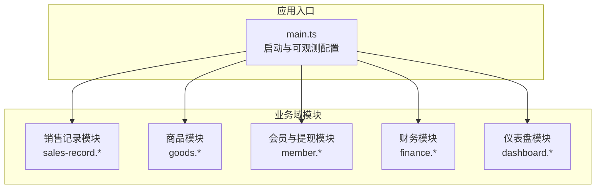
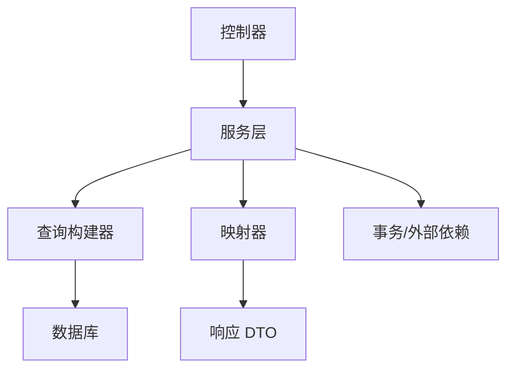
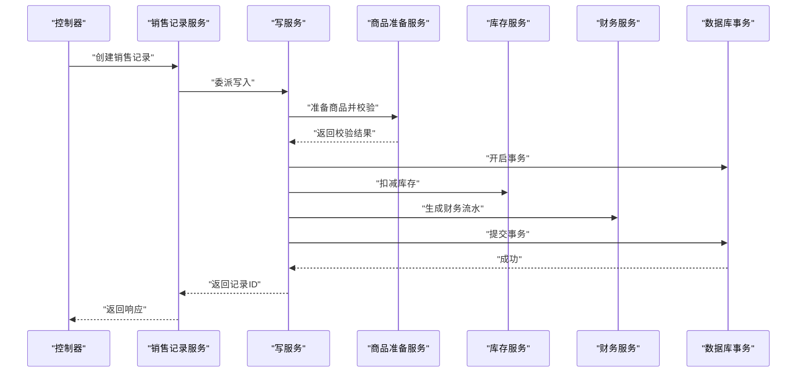
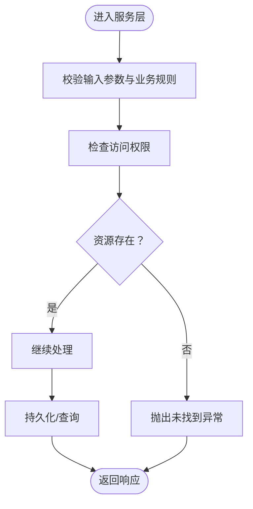
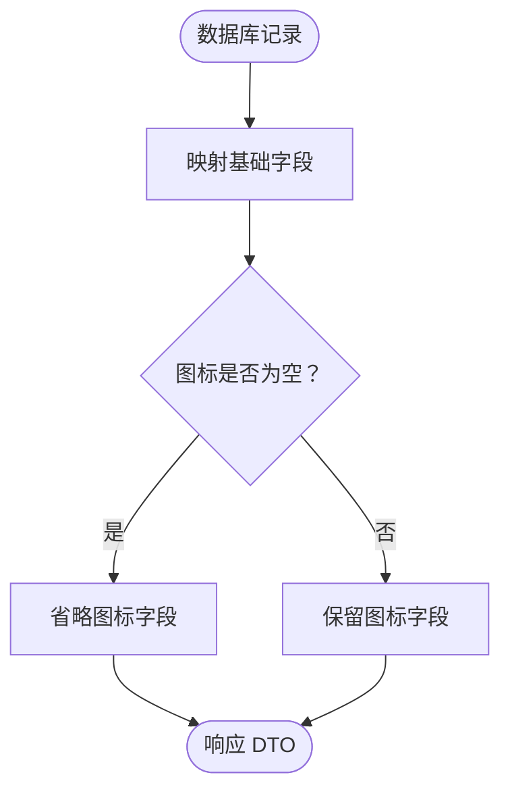
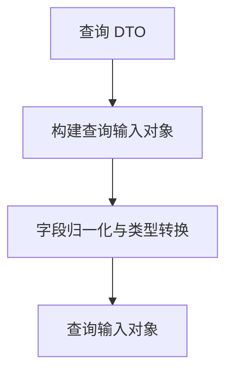
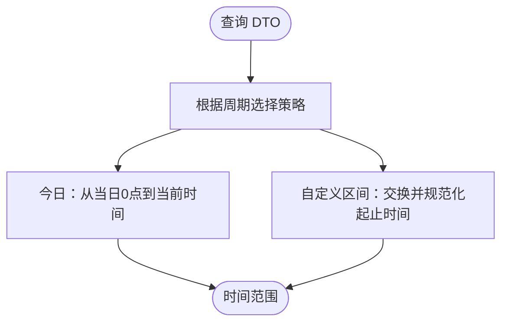
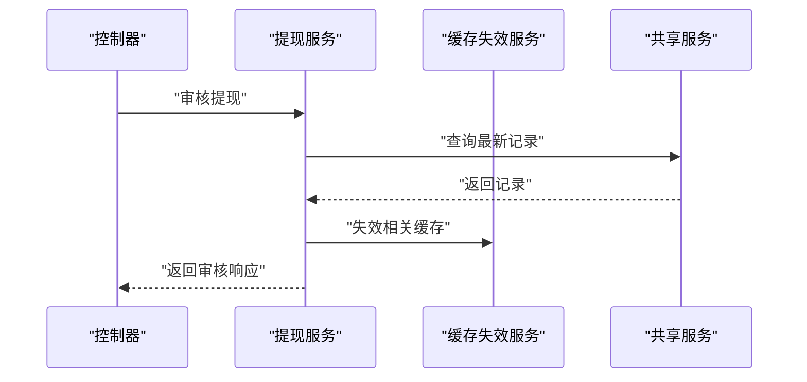
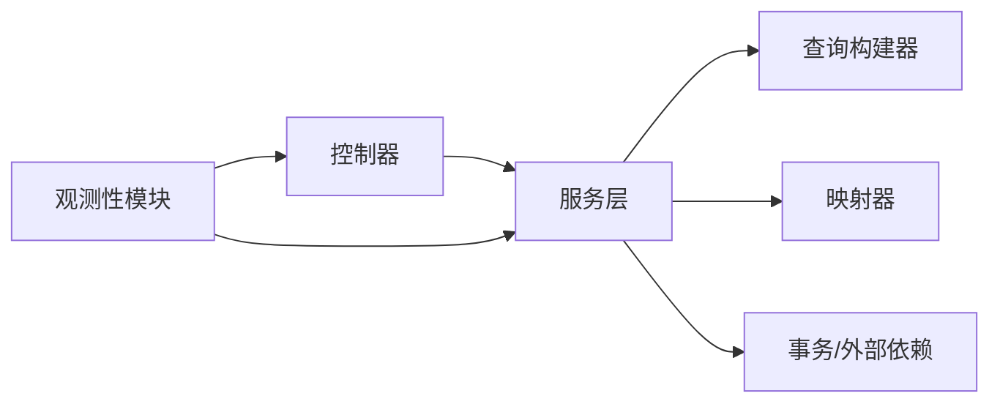

# 业务逻辑实现

<cite>
**本文引用的文件**
- [src/main.ts](file://src/main.ts)
- [src/purely-profit/operations/sales-record/sales-record.service.ts](file://src/purely-profit/operations/sales-record/sales-record.service.ts)
- [src/purely-profit/operations/sales-record/sales-record-write.service.spec.ts](file://src/purely-profit/operations/sales-record/sales-record-write.service.spec.ts)
- [src/purely-profit/operations/sales-record/sales-record-item-preparation.service.spec.ts](file://src/purely-profit/operations/sales-record/sales-record-item-preparation.service.spec.ts)
- [src/purely-profit/goods/products/products.service.ts](file://src/purely-profit/goods/products/products.service.ts)
- [src/purely-profit/goods/products/products.service.spec.ts](file://src/purely-profit/goods/products/products.service.spec.ts)
- [src/purely-profit/goods/categories/categories.mapper.spec.ts](file://src/purely-profit/goods/categories/categories.mapper.spec.ts)
- [src/purely-profit/dashboard/dashboard-home/dashboard-home.query-input.utils.ts](file://src/purely-profit/dashboard/dashboard-home/dashboard-home.query-input.utils.ts)
- [src/purely-profit/dashboard/profit-detail/profit-detail.utils.spec.ts](file://src/purely-profit/dashboard/profit-detail/profit-detail.utils.spec.ts)
- [src/purely-profit/member/withdrawals/withdrawals.service.ts](file://src/purely-profit/member/withdrawals/withdrawals.service.ts)
- [src/observability/runtime-metrics.summary-context-severity.ts](file://src/observability/runtime-metrics.summary-context-severity.ts)
</cite>

## 目录
1. [引言](#引言)
2. [项目结构](#项目结构)
3. [核心组件](#核心组件)
4. [架构总览](#架构总览)
5. [详细组件分析](#详细组件分析)
6. [依赖关系分析](#依赖关系分析)
7. [性能考量](#性能考量)
8. [故障排查指南](#故障排查指南)
9. [结论](#结论)
10. [附录](#附录)

## 引言
本文件聚焦于服务层复杂业务逻辑的实现与最佳实践，涵盖数据验证、业务规则执行、事务处理、DTO 使用模式、查询构建器编写方法、映射器实现技巧，并通过具体业务场景（创建、更新、删除、查询）给出可复用的实现思路与图示。同时总结错误处理策略、异常管理与日志记录实践，帮助开发者在保证正确性的同时提升系统稳定性与可维护性。

## 项目结构
本项目采用模块化分层设计：控制器负责请求入口与参数校验，服务层承载核心业务逻辑，查询与映射器分别承担数据查询与结果转换职责。整体通过 NestJS 框架组织，结合 Prisma 进行数据库访问，Fastify 提供高性能 HTTP 适配。

图表来源
- [src/main.ts:1-53](file://src/main.ts#L1-L53)
- [src/purely-profit/operations/sales-record/sales-record.service.ts](file://src/purely-profit/operations/sales-record/sales-record.service.ts)
- [src/purely-profit/goods/products/products.service.ts](file://src/purely-profit/goods/products/products.service.ts)
- [src/purely-profit/member/withdrawals/withdrawals.service.ts](file://src/purely-profit/member/withdrawals/withdrawals.service.ts)
- [src/purely-profit/finance/finance.service.ts](file://src/purely-profit/finance/finance.service.ts)
- [src/purely-profit/dashboard/dashboard-home/dashboard-home.query-input.utils.ts](file://src/purely-profit/dashboard/dashboard-home/dashboard-home.query-input.utils.ts)

章节来源
- [src/main.ts:1-53](file://src/main.ts#L1-L53)

## 核心组件
- 服务层（Service）
  - 聚合领域规则、调用查询与映射器、协调外部依赖（如缓存失效、财务流水），并在必要时开启事务以确保一致性。
  - 示例：销售记录服务将“创建/删除”等写操作委托给写服务，读统计与报表委托给读服务；商品服务在创建/查询前进行访问控制与参数校验。
- 查询构建器（Query Builder）
  - 将 DTO 中的筛选条件映射为数据库查询条件，支持分页、排序、范围过滤等。
  - 示例：仪表盘 Home 查询输入工具将 DTO 字段归一化为内部查询输入对象。
- 映射器（Mapper）
  - 将数据库记录映射为响应 DTO，处理空值、时间戳转换、字段裁剪等。
  - 示例：分类映射器对空图标字段进行省略处理。
- DTO 使用模式
  - 请求 DTO 用于输入校验与参数归一化；响应 DTO 用于输出契约稳定与字段裁剪。
  - 示例：商品服务在 detail/create/list 等场景中严格区分输入/输出 DTO 并进行边界校验。

章节来源
- [src/purely-profit/operations/sales-record/sales-record.service.ts](file://src/purely-profit/operations/sales-record/sales-record.service.ts)
- [src/purely-profit/goods/products/products.service.ts](file://src/purely-profit/goods/products/products.service.ts)
- [src/purely-profit/goods/categories/categories.mapper.spec.ts](file://src/purely-profit/goods/categories/categories.mapper.spec.ts)
- [src/purely-profit/dashboard/dashboard-home/dashboard-home.query-input.utils.ts](file://src/purely-profit/dashboard/dashboard-home/dashboard-home.query-input.utils.ts)

## 架构总览
服务层通过“读/写分离”的方式组织业务流程：读服务专注统计与报表，写服务专注事务性变更。控制器仅做参数校验与路由转发，服务层负责业务规则与跨模块协作。

图表来源
- [src/purely-profit/operations/sales-record/sales-record.service.ts](file://src/purely-profit/operations/sales-record/sales-record.service.ts)
- [src/purely-profit/goods/products/products.service.ts](file://src/purely-profit/goods/products/products.service.ts)

## 详细组件分析

### 销售记录模块（创建/删除流程与事务）
销售记录模块体现了典型的“写服务 + 事务 + 外部联动”模式：创建时准备商品、扣减库存、生成财务流水；删除时回滚库存与流水并删除主记录。测试用例展示了异常路径与事务回滚行为。

图表来源
- [src/purely-profit/operations/sales-record/sales-record.service.ts](file://src/purely-profit/operations/sales-record/sales-record.service.ts)
- [src/purely-profit/operations/sales-record/sales-record-write.service.spec.ts](file://src/purely-profit/operations/sales-record/sales-record-write.service.spec.ts)
- [src/purely-profit/operations/sales-record/sales-record-item-preparation.service.spec.ts](file://src/purely-profit/operations/sales-record/sales-record-item-preparation.service.spec.ts)

章节来源
- [src/purely-profit/operations/sales-record/sales-record.service.ts](file://src/purely-profit/operations/sales-record/sales-record.service.ts)
- [src/purely-profit/operations/sales-record/sales-record-write.service.spec.ts:808-873](file://src/purely-profit/operations/sales-record/sales-record-write.service.spec.ts#L808-L873)
- [src/purely-profit/operations/sales-record/sales-record-item-preparation.service.spec.ts:210-279](file://src/purely-profit/operations/sales-record/sales-record-item-preparation.service.spec.ts#L210-L279)

### 商品模块（参数校验与访问控制）
商品模块在服务层集中执行参数校验与访问控制，确保业务规则在进入持久层之前被严格执行。测试用例覆盖了“商品不存在”“价格非法”等边界情况。

图表来源
- [src/purely-profit/goods/products/products.service.ts](file://src/purely-profit/goods/products/products.service.ts)
- [src/purely-profit/goods/products/products.service.spec.ts:587-609](file://src/purely-profit/goods/products/products.service.spec.ts#L587-L609)

章节来源
- [src/purely-profit/goods/products/products.service.ts](file://src/purely-profit/goods/products/products.service.ts)
- [src/purely-profit/goods/products/products.service.spec.ts:366-417](file://src/purely-profit/goods/products/products.service.spec.ts#L366-L417)
- [src/purely-profit/goods/products/products.service.spec.ts:587-609](file://src/purely-profit/goods/products/products.service.spec.ts#L587-L609)

### 分类映射器（字段裁剪与空值处理）
分类映射器演示了响应 DTO 的字段裁剪策略：当图标为空时省略该字段，避免冗余输出，同时统一时间戳为毫秒级整数。

图表来源
- [src/purely-profit/goods/categories/categories.mapper.spec.ts:1-41](file://src/purely-profit/goods/categories/categories.mapper.spec.ts#L1-L41)

章节来源
- [src/purely-profit/goods/categories/categories.mapper.spec.ts:1-41](file://src/purely-profit/goods/categories/categories.mapper.spec.ts#L1-L41)

### 仪表盘查询输入工具（DTO 到查询输入的归一化）
仪表盘 Home 查询输入工具将 DTO 中的必要字段复制到内部查询输入对象，确保后续查询构建器只依赖已归一化的输入。

图表来源
- [src/purely-profit/dashboard/dashboard-home/dashboard-home.query-input.utils.ts:1-11](file://src/purely-profit/dashboard/dashboard-home/dashboard-home.query-input.utils.ts#L1-L11)

章节来源
- [src/purely-profit/dashboard/dashboard-home/dashboard-home.query-input.utils.ts:1-11](file://src/purely-profit/dashboard/dashboard-home/dashboard-home.query-input.utils.ts#L1-L11)

### 利润明细工具（时间范围与字段选择）
利润明细工具包含时间范围构建与查询字段选择逻辑，确保不同周期（如今日、自定义区间）的起止时间被正确归一化。

图表来源
- [src/purely-profit/dashboard/profit-detail/profit-detail.utils.spec.ts:50-96](file://src/purely-profit/dashboard/profit-detail/profit-detail.utils.spec.ts#L50-L96)

章节来源
- [src/purely-profit/dashboard/profit-detail/profit-detail.utils.spec.ts:50-96](file://src/purely-profit/dashboard/profit-detail/profit-detail.utils.spec.ts#L50-L96)

### 提现模块（缓存失效与审核响应构建）
提现模块在审核完成后触发缓存失效，并基于最新记录构建审核响应，确保前端数据一致性。

图表来源
- [src/purely-profit/member/withdrawals/withdrawals.service.ts:352-375](file://src/purely-profit/member/withdrawals/withdrawals.service.ts#L352-L375)

章节来源
- [src/purely-profit/member/withdrawals/withdrawals.service.ts:352-375](file://src/purely-profit/member/withdrawals/withdrawals.service.ts#L352-L375)

## 依赖关系分析
- 控制器依赖服务层；服务层依赖查询构建器与映射器；写服务通常依赖事务执行器以保证一致性。
- 观测性模块贯穿应用，提供运行时指标与严重级别评估，辅助定位性能瓶颈与异常。

图表来源
- [src/purely-profit/operations/sales-record/sales-record.service.ts](file://src/purely-profit/operations/sales-record/sales-record.service.ts)
- [src/purely-profit/goods/products/products.service.ts](file://src/purely-profit/goods/products/products.service.ts)
- [src/observability/runtime-metrics.summary-context-severity.ts:47-93](file://src/observability/runtime-metrics.summary-context-severity.ts#L47-L93)

章节来源
- [src/observability/runtime-metrics.summary-context-severity.ts:47-93](file://src/observability/runtime-metrics.summary-context-severity.ts#L47-L93)

## 性能考量
- 事务最小化：将耗时的外部调用（如库存扣减、财务流水）置于单个事务内，减少锁竞争与不一致风险。
- 缓存预热与失效：在关键状态变更后主动失效相关缓存，避免陈旧数据影响用户体验。
- 查询输入归一化：将 DTO 字段映射为稳定的查询输入对象，便于后续优化与扩展。
- 观测性阈值：通过 CPU、内存、HTTP 延迟、SQL 慢查询、Redis 命中率等指标评估系统健康度，及时预警。

## 故障排查指南
- 参数校验失败
  - 现象：请求被拒绝，抛出参数非法异常。
  - 排查：确认 DTO 字段是否符合约束；检查服务层参数校验逻辑。
  - 参考：商品服务对价格等字段的校验。
- 访问权限不足
  - 现象：抛出权限相关异常。
  - 排查：核对用户角色与目标资源的授权关系；确认访问控制服务调用链。
- 资源不存在
  - 现象：抛出未找到异常。
  - 排查：确认资源 ID 是否正确；检查读服务的查询条件。
- 事务回滚
  - 现象：创建/删除失败且数据库状态未改变。
  - 排查：查看写服务中的事务包裹与异常传播路径；确认外部依赖是否抛出异常导致回滚。
- 缓存不一致
  - 现象：前端显示过期数据。
  - 排查：确认是否在状态变更后调用了缓存失效；检查缓存键空间与失效范围。

章节来源
- [src/purely-profit/goods/products/products.service.spec.ts:587-609](file://src/purely-profit/goods/products/products.service.spec.ts#L587-L609)
- [src/purely-profit/operations/sales-record/sales-record-write.service.spec.ts:808-873](file://src/purely-profit/operations/sales-record/sales-record-write.service.spec.ts#L808-L873)
- [src/purely-profit/member/withdrawals/withdrawals.service.ts:352-375](file://src/purely-profit/member/withdrawals/withdrawals.service.ts#L352-L375)

## 结论
通过将业务规则下沉至服务层、明确 DTO 使用边界、规范查询构建与映射流程，并在关键路径引入事务与缓存一致性策略，系统在复杂业务场景下仍能保持高可靠与高可维护性。建议持续完善观测性指标与告警策略，以实现对性能与异常的早期发现与快速恢复。

## 附录
- 快速参考
  - 创建：准备数据 → 校验与权限 → 事务执行 → 外部联动 → 返回响应
  - 更新：读取 → 校验 → 权限 → 事务 → 缓存失效 → 返回
  - 删除：读取 → 权限 → 事务回滚（库存/流水）→ 删除主记录 → 返回
  - 查询：DTO → 归一化 → 查询构建器 → 映射器 → 响应 DTO