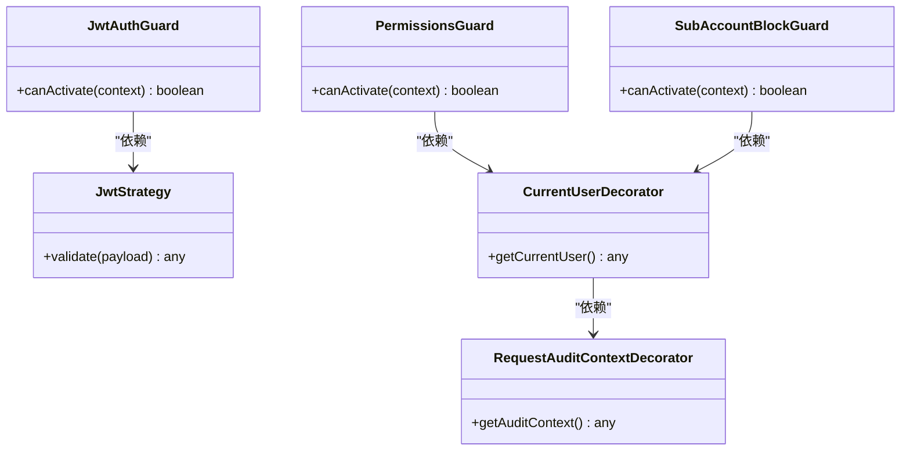
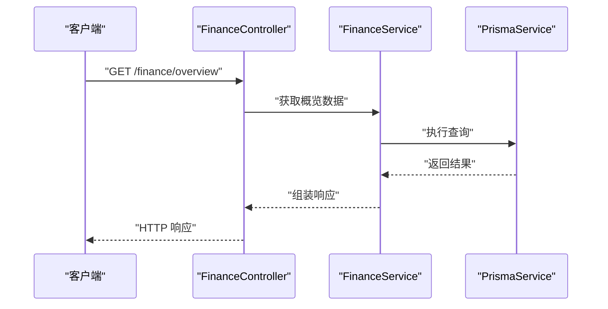
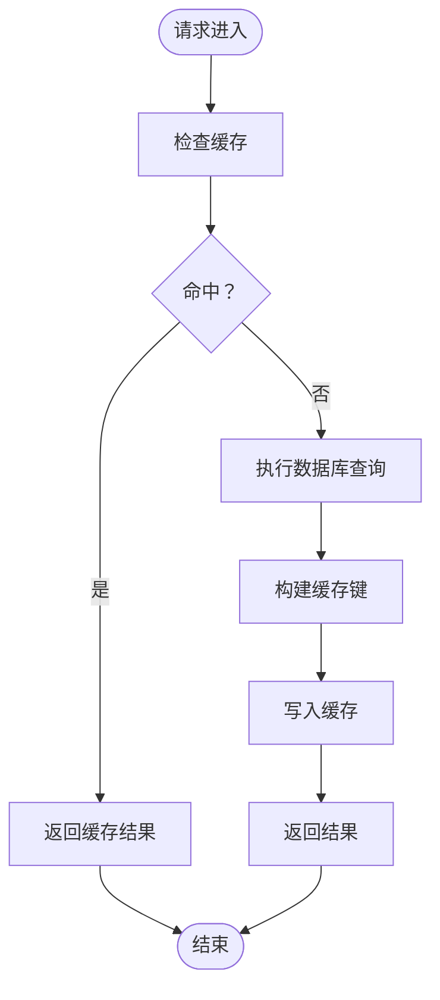
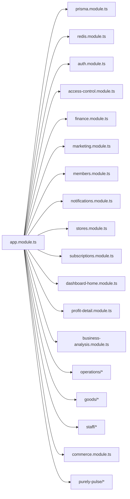

# 依赖注入配置

<cite>
**本文引用的文件**
- [src/app.module.ts](file://src/app.module.ts)
- [src/prisma/prisma.module.ts](file://src/prisma/prisma.module.ts)
- [src/purely-profit/auth/auth.module.ts](file://src/purely-profit/auth/auth.module.ts)
- [src/purely-profit/access-control/access-control.module.ts](file://src/purely-profit/access-control/access-control.module.ts)
- [src/purely-profit/finance/finance.module.ts](file://src/purely-profit/finance/finance.module.ts)
- [src/purely-profit/marketing/marketing.module.ts](file://src/purely-profit/marketing/marketing.module.ts)
- [src/purely-profit/member/members/members.module.ts](file://src/purely-profit/member/members/members.module.ts)
- [src/purely-profit/notifications/notifications.module.ts](file://src/purely-profit/notifications/notifications.module.ts)
- [src/purely-profit/stores/stores.module.ts](file://src/purely-profit/stores/stores.module.ts)
- [src/purely-profit/subscriptions/subscriptions.module.ts](file://src/purely-profit/subscriptions/subscriptions.module.ts)
- [src/purely-profit/dashboard/dashboard-home/dashboard-home.module.ts](file://src/purely-profit/dashboard/dashboard-home/dashboard-home.module.ts)
- [src/purely-profit/dashboard/profit-detail/profit-detail.module.ts](file://src/purely-profit/dashboard/profit-detail/profit-detail.module.ts)
- [src/purely-profit/dashboard/business-analysis/business-analysis.module.ts](file://src/purely-profit/dashboard/business-analysis/business-analysis.module.ts)
- [src/purely-profit/operations/handover/handover.module.ts](file://src/purely-profit/operations/handover/handover.module.ts)
- [src/purely-profit/operations/sales-record/sales-record.module.ts](file://src/purely-profit/operations/sales-record/sales-record.module.ts)
- [src/purely-profit/operations/spaces/spaces.module.ts](file://src/purely-profit/operations/spaces/spaces.module.ts)
- [src/purely-profit/operations/costs/costs.module.ts](file://src/purely-profit/operations/costs/costs.module.ts)
- [src/purely-profit/operations/purchases/purchases.module.ts](file://src/purely-profit/operations/purchases/purchases.module.ts)
- [src/purely-profit/goods/categories/categories.module.ts](file://src/purely-profit/goods/categories/categories.module.ts)
- [src/purely-profit/goods/inventory/inventory.module.ts](file://src/purely-profit/goods/inventory/inventory.module.ts)
- [src/purely-profit/goods/products/products.module.ts](file://src/purely-profit/goods/products/products.module.ts)
- [src/purely-profit/staff/employees/employees.module.ts](file://src/purely-profit/staff/employees/employees.module.ts)
- [src/purely-profit/staff/seats/staff.module.ts](file://src/purely-profit/staff/seats/staff.module.ts)
- [src/purely-profit/commerce/commerce.module.ts](file://src/purely-profit/commerce/commerce.module.ts)
- [src/purely-pulse/session/session.module.ts](file://src/purely-pulse/session/session.module.ts)
- [src/purely-pulse/membership/membership.module.ts](file://src/purely-pulse/membership/membership.module.ts)
- [src/purely-pulse/growth/growth.module.ts](file://src/purely-pulse/growth/growth.module.ts)
- [src/purely-pulse/dashboard/dashboard.module.ts](file://src/purely-pulse/dashboard/dashboard.module.ts)
- [src/purely-pulse/dev-mode/pulse-dev-mode.module.ts](file://src/purely-pulse/dev-mode/pulse-dev-mode.module.ts)
- [src/purely-pulse/membership-settings/membership-settings.module.ts](file://src/purely-pulse/membership-settings/membership-settings.module.ts)
- [src/purely-pulse/onboarding/onboarding.module.ts](file://src/purely-pulse/onboarding/onboarding.module.ts)
- [src/purely-pulse/pulse-store-context.module.ts](file://src/purely-pulse/pulse-store-context.module.ts)
- [src/redis/redis.module.ts](file://src/redis/redis.module.ts)
- [src/redis/redis.service.ts](file://src/redis/redis.service.ts)
- [src/redis/cache-prewarm.service.ts](file://src/redis/cache-prewarm.service.ts)
- [src/redis/cache-invalidator.service.ts](file://src/redis/cache-invalidator.service.ts)
- [src/purely-profit/auth/guards/jwt-auth.guard.ts](file://src/purely-profit/auth/guards/jwt-auth.guard.ts)
- [src/purely-profit/access-control/guards/permissions.guard.ts](file://src/purely-profit/access-control/guards/permissions.guard.ts)
- [src/purely-profit/access-control/guards/sub-account-block.guard.ts](file://src/purely-profit/access-control/guards/sub-account-block.guard.ts)
- [src/purely-profit/auth/strategies/jwt.strategy.ts](file://src/purely-profit/auth/strategies/jwt.strategy.ts)
- [src/purely-profit/auth/current-user.decorator.ts](file://src/purely-profit/auth/current-user.decorator.ts)
- [src/purely-profit/auth/request-audit-context.decorator.ts](file://src/purely-profit/auth/request-audit-context.decorator.ts)
</cite>

## 目录
1. [简介](#简介)
2. [项目结构](#项目结构)
3. [核心组件](#核心组件)
4. [架构总览](#架构总览)
5. [详细组件分析](#详细组件分析)
6. [依赖关系分析](#依赖关系分析)
7. [性能考量](#性能考量)
8. [故障排查指南](#故障排查指南)
9. [结论](#结论)
10. [附录](#附录)

## 简介
本文件系统性梳理 purelyprofit-server 中基于 NestJS 的依赖注入（DI）配置与实践，重点覆盖以下方面：
- 在模块中正确配置 providers、controllers、guards、interceptors 等组件的注入方式
- 全局模块与共享模块的设计原则与落地
- 新模块中依赖关系的正确设置范式
- 循环依赖的识别与规避策略
- 常见问题与解决方案

通过阅读本仓库中的模块文件与服务文件，可以清晰看到 DI 的典型用法：以 @Module 装饰器声明模块边界，通过 imports 导入其他模块，通过 providers 提供可注入实例，通过 exports 暴露给其他模块使用，通过 controllers 挂载控制器。

## 项目结构
purelyprofit-server 采用按领域分层的模块化组织方式，每个功能域（如 auth、finance、marketing、member 等）均对应独立的模块文件，便于职责分离与 DI 边界清晰。

```mermaid
graph TB
Root["根模块<br/>app.module.ts"] --> Prisma["数据访问模块<br/>prisma.module.ts"]
Root --> Auth["认证模块<br/>auth.module.ts"]
Root --> AccessControl["权限控制模块<br/>access-control.module.ts"]
Root --> Finance["财务模块<br/>finance.module.ts"]
Root --> Marketing["营销模块<br/>marketing.module.ts"]
Root --> Member["会员模块<br/>members.module.ts"]
Root --> Notifications["通知模块<br/>notifications.module.ts"]
Root --> Stores["门店模块<br/>stores.module.ts"]
Root --> Subscriptions["订阅模块<br/>subscriptions.module.ts"]
Root --> DashboardHome["首页看板模块<br/>dashboard-home.module.ts"]
Root --> ProfitDetail["利润明细模块<br/>profit-detail.module.ts"]
Root --> BusinessAnalysis["业务分析模块<br/>business-analysis.module.ts"]
Root --> Operations["运营模块组<br/>handover/sales-record/spaces/costs/purchases..."]
Root --> Goods["商品模块组<br/>categories/inventory/products"]
Root --> Staff["员工模块组<br/>employees/seats"]
Root --> Commerce["商业分析模块<br/>commerce.module.ts"]
Root --> PulseSession["Pulse 会话模块<br/>session.module.ts"]
Root --> PulseMembership["Pulse 会员模块<br/>membership.module.ts"]
Root --> PulseGrowth["Pulse 成长模块<br/>growth.module.ts"]
Root --> PulseDashboard["Pulse 看板模块<br/>dashboard.module.ts"]
Root --> PulseDevMode["Pulse 开发模式模块<br/>pulse-dev-mode.module.ts"]
Root --> PulseMembershipSettings["Pulse 会员设置模块<br/>membership-settings.module.ts"]
Root --> PulseOnboarding["Pulse 引导模块<br/>onboarding.module.ts"]
Root --> PulseStoreContext["Pulse 门店上下文模块<br/>pulse-store-context.module.ts"]
Root --> Redis["Redis 缓存模块<br/>redis.module.ts"]
```

图表来源
- [src/app.module.ts](file://src/app.module.ts)
- [src/prisma/prisma.module.ts](file://src/prisma/prisma.module.ts)
- [src/purely-profit/auth/auth.module.ts](file://src/purely-profit/auth/auth.module.ts)
- [src/purely-profit/access-control/access-control.module.ts](file://src/purely-profit/access-control/access-control.module.ts)
- [src/purely-profit/finance/finance.module.ts](file://src/purely-profit/finance/finance.module.ts)
- [src/purely-profit/marketing/marketing.module.ts](file://src/purely-profit/marketing/marketing.module.ts)
- [src/purely-profit/member/members/members.module.ts](file://src/purely-profit/member/members/members.module.ts)
- [src/purely-profit/notifications/notifications.module.ts](file://src/purely-profit/notifications/notifications.module.ts)
- [src/purely-profit/stores/stores.module.ts](file://src/purely-profit/stores/stores.module.ts)
- [src/purely-profit/subscriptions/subscriptions.module.ts](file://src/purely-profit/subscriptions/subscriptions.module.ts)
- [src/purely-profit/dashboard/dashboard-home/dashboard-home.module.ts](file://src/purely-profit/dashboard/dashboard-home/dashboard-home.module.ts)
- [src/purely-profit/dashboard/profit-detail/profit-detail.module.ts](file://src/purely-profit/dashboard/profit-detail/profit-detail.module.ts)
- [src/purely-profit/dashboard/business-analysis/business-analysis.module.ts](file://src/purely-profit/dashboard/business-analysis/business-analysis.module.ts)
- [src/purely-profit/operations/handover/handover.module.ts](file://src/purely-profit/operations/handover/handover.module.ts)
- [src/purely-profit/operations/sales-record/sales-record.module.ts](file://src/purely-profit/operations/sales-record/sales-record.module.ts)
- [src/purely-profit/operations/spaces/spaces.module.ts](file://src/purely-profit/operations/spaces/spaces.module.ts)
- [src/purely-profit/operations/costs/costs.module.ts](file://src/purely-profit/operations/costs/costs.module.ts)
- [src/purely-profit/operations/purchases/purchases.module.ts](file://src/purely-profit/operations/purchases/purchases.module.ts)
- [src/purely-profit/goods/categories/categories.module.ts](file://src/purely-profit/goods/categories/categories.module.ts)
- [src/purely-profit/goods/inventory/inventory.module.ts](file://src/purely-profit/goods/inventory/inventory.module.ts)
- [src/purely-profit/goods/products/products.module.ts](file://src/purely-profit/goods/products/products.module.ts)
- [src/purely-profit/staff/employees/employees.module.ts](file://src/purely-profit/staff/employees/employees.module.ts)
- [src/purely-profit/staff/seats/staff.module.ts](file://src/purely-profit/staff/seats/staff.module.ts)
- [src/purely-profit/commerce/commerce.module.ts](file://src/purely-profit/commerce/commerce.module.ts)
- [src/purely-pulse/session/session.module.ts](file://src/purely-pulse/session/session.module.ts)
- [src/purely-pulse/membership/membership.module.ts](file://src/purely-pulse/membership/membership.module.ts)
- [src/purely-pulse/growth/growth.module.ts](file://src/purely-pulse/growth/growth.module.ts)
- [src/purely-pulse/dashboard/dashboard.module.ts](file://src/purely-pulse/dashboard/dashboard.module.ts)
- [src/purely-pulse/dev-mode/pulse-dev-mode.module.ts](file://src/purely-pulse/dev-mode/pulse-dev-mode.module.ts)
- [src/purely-pulse/membership-settings/membership-settings.module.ts](file://src/purely-pulse/membership-settings/membership-settings.module.ts)
- [src/purely-pulse/onboarding/onboarding.module.ts](file://src/purely-pulse/onboarding/onboarding.module.ts)
- [src/purely-pulse/pulse-store-context.module.ts](file://src/purely-pulse/pulse-store-context.module.ts)
- [src/redis/redis.module.ts](file://src/redis/redis.module.ts)

章节来源
- [src/app.module.ts](file://src/app.module.ts)
- [src/prisma/prisma.module.ts](file://src/prisma/prisma.module.ts)

## 核心组件
- 根模块与引导：应用入口模块负责导入所有子模块，形成统一的 DI 容器树。
- 数据访问层：Prisma 模块提供数据库连接与服务，作为各业务模块的基础设施。
- 认证与授权：Auth 模块与 Access Control 模块分别提供鉴权守卫、策略与权限守卫等。
- 业务域模块：Finance、Marketing、Member、Goods、Operations、Staff、Commerce 等模块各自封装领域能力。
- Pulse 子域：纯 PULSE 功能域模块（session、membership、growth、dashboard、dev-mode、membership-settings、onboarding、pulse-store-context）与主业务并行存在。
- 缓存与预热：Redis 模块提供缓存服务与失效器，并支持缓存预热。

章节来源
- [src/app.module.ts](file://src/app.module.ts)
- [src/prisma/prisma.module.ts](file://src/prisma/prisma.module.ts)
- [src/purely-profit/auth/auth.module.ts](file://src/purely-profit/auth/auth.module.ts)
- [src/purely-profit/access-control/access-control.module.ts](file://src/purely-profit/access-control/access-control.module.ts)
- [src/purely-pulse/session/session.module.ts](file://src/purely-pulse/session/session.module.ts)
- [src/purely-pulse/membership/membership.module.ts](file://src/purely-pulse/membership/membership.module.ts)
- [src/purely-pulse/growth/growth.module.ts](file://src/purely-pulse/growth/growth.module.ts)
- [src/purely-pulse/dashboard/dashboard.module.ts](file://src/purely-pulse/dashboard/dashboard.module.ts)
- [src/purely-pulse/dev-mode/pulse-dev-mode.module.ts](file://src/purely-pulse/dev-mode/pulse-dev-mode.module.ts)
- [src/purely-pulse/membership-settings/membership-settings.module.ts](file://src/purely-pulse/membership-settings/membership-settings.module.ts)
- [src/purely-pulse/onboarding/onboarding.module.ts](file://src/purely-pulse/onboarding/onboarding.module.ts)
- [src/purely-pulse/pulse-store-context.module.ts](file://src/purely-pulse/pulse-store-context.module.ts)
- [src/redis/redis.module.ts](file://src/redis/redis.module.ts)

## 架构总览
下图展示了依赖注入容器的层次结构与模块间的关系，以及关键组件的注入点。

```mermaid
graph TB
subgraph "应用层"
AppModule["根模块<br/>app.module.ts"]
end
subgraph "基础设施层"
PrismaModule["数据访问模块<br/>prisma.module.ts"]
RedisModule["缓存模块<br/>redis.module.ts"]
end
subgraph "业务域模块"
AuthModule["认证模块<br/>auth.module.ts"]
AccessControlModule["权限控制模块<br/>access-control.module.ts"]
FinanceModule["财务模块<br/>finance.module.ts"]
MarketingModule["营销模块<br/>marketing.module.ts"]
MemberModule["会员模块<br/>members.module.ts"]
NotificationsModule["通知模块<br/>notifications.module.ts"]
StoresModule["门店模块<br/>stores.module.ts"]
SubscriptionsModule["订阅模块<br/>subscriptions.module.ts"]
DashboardHomeModule["首页看板模块<br/>dashboard-home.module.ts"]
ProfitDetailModule["利润明细模块<br/>profit-detail.module.ts"]
BusinessAnalysisModule["业务分析模块<br/>business-analysis.module.ts"]
OperationsModules["运营模块组<br/>handover/sales-record/spaces/costs/purchases"]
GoodsModules["商品模块组<br/>categories/inventory/products"]
StaffModules["员工模块组<br/>employees/seats"]
CommerceModule["商业分析模块<br/>commerce.module.ts"]
end
subgraph "PULSE 子域"
PulseSessionModule["PULSE 会话模块<br/>session.module.ts"]
PulseMembershipModule["PULSE 会员模块<br/>membership.module.ts"]
PulseGrowthModule["PULSE 成长模块<br/>growth.module.ts"]
PulseDashboardModule["PULSE 看板模块<br/>dashboard.module.ts"]
PulseDevModeModule["PULSE 开发模式模块<br/>pulse-dev-mode.module.ts"]
PulseMembershipSettingsModule["PULSE 会员设置模块<br/>membership-settings.module.ts"]
PulseOnboardingModule["PULSE 引导模块<br/>onboarding.module.ts"]
PulseStoreContextModule["PULSE 门店上下文模块<br/>pulse-store-context.module.ts"]
end
AppModule --> PrismaModule
AppModule --> RedisModule
AppModule --> AuthModule
AppModule --> AccessControlModule
AppModule --> FinanceModule
AppModule --> MarketingModule
AppModule --> MemberModule
AppModule --> NotificationsModule
AppModule --> StoresModule
AppModule --> SubscriptionsModule
AppModule --> DashboardHomeModule
AppModule --> ProfitDetailModule
AppModule --> BusinessAnalysisModule
AppModule --> OperationsModules
AppModule --> GoodsModules
AppModule --> StaffModules
AppModule --> CommerceModule
AppModule --> PulseSessionModule
AppModule --> PulseMembershipModule
AppModule --> PulseGrowthModule
AppModule --> PulseDashboardModule
AppModule --> PulseDevModeModule
AppModule --> PulseMembershipSettingsModule
AppModule --> PulseOnboardingModule
AppModule --> PulseStoreContextModule
```

图表来源
- [src/app.module.ts](file://src/app.module.ts)
- [src/prisma/prisma.module.ts](file://src/prisma/prisma.module.ts)
- [src/redis/redis.module.ts](file://src/redis/redis.module.ts)
- [src/purely-profit/auth/auth.module.ts](file://src/purely-profit/auth/auth.module.ts)
- [src/purely-profit/access-control/access-control.module.ts](file://src/purely-profit/access-control/access-control.module.ts)
- [src/purely-profit/finance/finance.module.ts](file://src/purely-profit/finance/finance.module.ts)
- [src/purely-profit/marketing/marketing.module.ts](file://src/purely-profit/marketing/marketing.module.ts)
- [src/purely-profit/member/members/members.module.ts](file://src/purely-profit/member/members/members.module.ts)
- [src/purely-profit/notifications/notifications.module.ts](file://src/purely-profit/notifications/notifications.module.ts)
- [src/purely-profit/stores/stores.module.ts](file://src/purely-profit/stores/stores.module.ts)
- [src/purely-profit/subscriptions/subscriptions.module.ts](file://src/purely-profit/subscriptions/subscriptions.module.ts)
- [src/purely-profit/dashboard/dashboard-home/dashboard-home.module.ts](file://src/purely-profit/dashboard/dashboard-home/dashboard-home.module.ts)
- [src/purely-profit/dashboard/profit-detail/profit-detail.module.ts](file://src/purely-profit/dashboard/profit-detail/profit-detail.module.ts)
- [src/purely-profit/dashboard/business-analysis/business-analysis.module.ts](file://src/purely-profit/dashboard/business-analysis/business-analysis.module.ts)
- [src/purely-profit/operations/handover/handover.module.ts](file://src/purely-profit/operations/handover/handover.module.ts)
- [src/purely-profit/operations/sales-record/sales-record.module.ts](file://src/purely-profit/operations/sales-record/sales-record.module.ts)
- [src/purely-profit/operations/spaces/spaces.module.ts](file://src/purely-profit/operations/spaces/spaces.module.ts)
- [src/purely-profit/operations/costs/costs.module.ts](file://src/purely-profit/operations/costs/costs.module.ts)
- [src/purely-profit/operations/purchases/purchases.module.ts](file://src/purely-profit/operations/purchases/purchases.module.ts)
- [src/purely-profit/goods/categories/categories.module.ts](file://src/purely-profit/goods/categories/categories.module.ts)
- [src/purely-profit/goods/inventory/inventory.module.ts](file://src/purely-profit/goods/inventory/inventory.module.ts)
- [src/purely-profit/goods/products/products.module.ts](file://src/purely-profit/goods/products/products.module.ts)
- [src/purely-profit/staff/employees/employees.module.ts](file://src/purely-profit/staff/employees/employees.module.ts)
- [src/purely-profit/staff/seats/staff.module.ts](file://src/purely-profit/staff/seats/staff.module.ts)
- [src/purely-profit/commerce/commerce.module.ts](file://src/purely-profit/commerce/commerce.module.ts)
- [src/purely-pulse/session/session.module.ts](file://src/purely-pulse/session/session.module.ts)
- [src/purely-pulse/membership/membership.module.ts](file://src/purely-pulse/membership/membership.module.ts)
- [src/purely-pulse/growth/growth.module.ts](file://src/purely-pulse/growth/growth.module.ts)
- [src/purely-pulse/dashboard/dashboard.module.ts](file://src/purely-pulse/dashboard/dashboard.module.ts)
- [src/purely-pulse/dev-mode/pulse-dev-mode.module.ts](file://src/purely-pulse/dev-mode/pulse-dev-mode.module.ts)
- [src/purely-pulse/membership-settings/membership-settings.module.ts](file://src/purely-pulse/membership-settings/membership-settings.module.ts)
- [src/purely-pulse/onboarding/onboarding.module.ts](file://src/purely-pulse/onboarding/onboarding.module.ts)
- [src/purely-pulse/pulse-store-context.module.ts](file://src/purely-pulse/pulse-store-context.module.ts)

## 详细组件分析

### 根模块与模块树
- 根模块通过 imports 将所有子模块纳入 DI 容器，形成统一的依赖注入树。
- 根模块通常不定义大量 providers，而是作为聚合入口，确保各子模块按需暴露所需服务。

章节来源
- [src/app.module.ts](file://src/app.module.ts)

### 数据访问层（Prisma）
- Prisma 模块提供数据库连接与服务，作为各业务模块的基础设施被广泛复用。
- 通过在根模块中导入该模块，所有业务模块均可直接或间接使用 Prisma 服务。

章节来源
- [src/prisma/prisma.module.ts](file://src/prisma/prisma.module.ts)

### 认证与授权模块
- 认证模块提供 JWT 鉴权守卫与策略，用于保护路由与资源访问。
- 权限控制模块提供细粒度权限守卫与装饰器，结合业务能力进行访问控制。
- 这些守卫与策略通过 providers 注册为可注入实例，并在控制器或路由上使用。

图表来源
- [src/purely-profit/auth/guards/jwt-auth.guard.ts](file://src/purely-profit/auth/guards/jwt-auth.guard.ts)
- [src/purely-profit/access-control/guards/permissions.guard.ts](file://src/purely-profit/access-control/guards/permissions.guard.ts)
- [src/purely-profit/access-control/guards/sub-account-block.guard.ts](file://src/purely-profit/access-control/guards/sub-account-block.guard.ts)
- [src/purely-profit/auth/strategies/jwt.strategy.ts](file://src/purely-profit/auth/strategies/jwt.strategy.ts)
- [src/purely-profit/auth/current-user.decorator.ts](file://src/purely-profit/auth/current-user.decorator.ts)
- [src/purely-profit/auth/request-audit-context.decorator.ts](file://src/purely-profit/auth/request-audit-context.decorator.ts)

章节来源
- [src/purely-profit/auth/auth.module.ts](file://src/purely-profit/auth/auth.module.ts)
- [src/purely-profit/access-control/access-control.module.ts](file://src/purely-profit/access-control/access-control.module.ts)
- [src/purely-profit/auth/guards/jwt-auth.guard.ts](file://src/purely-profit/auth/guards/jwt-auth.guard.ts)
- [src/purely-profit/access-control/guards/permissions.guard.ts](file://src/purely-profit/access-control/guards/permissions.guard.ts)
- [src/purely-profit/access-control/guards/sub-account-block.guard.ts](file://src/purely-profit/access-control/guards/sub-account-block.guard.ts)
- [src/purely-profit/auth/strategies/jwt.strategy.ts](file://src/purely-profit/auth/strategies/jwt.strategy.ts)
- [src/purely-profit/auth/current-user.decorator.ts](file://src/purely-profit/auth/current-user.decorator.ts)
- [src/purely-profit/auth/request-audit-context.decorator.ts](file://src/purely-profit/auth/request-audit-context.decorator.ts)

### 业务域模块（以财务为例）
- 财务模块通过 imports 导入必要的基础设施与共享模块，通过 providers 提供财务领域的服务与查询对象。
- 控制器仅负责请求处理与响应，具体业务逻辑委托给服务层，体现清晰的分层与依赖倒置。

图表来源
- [src/purely-profit/finance/finance.module.ts](file://src/purely-profit/finance/finance.module.ts)
- [src/purely-profit/finance/finance.controller.ts](file://src/purely-profit/finance/finance.controller.ts)
- [src/purely-profit/finance/finance.service.ts](file://src/purely-profit/finance/finance.service.ts)
- [src/prisma/prisma.service.ts](file://src/prisma/prisma.service.ts)

章节来源
- [src/purely-profit/finance/finance.module.ts](file://src/purely-profit/finance/finance.module.ts)
- [src/purely-profit/finance/finance.controller.ts](file://src/purely-profit/finance/finance.controller.ts)
- [src/purely-profit/finance/finance.service.ts](file://src/purely-profit/finance/finance.service.ts)
- [src/prisma/prisma.service.ts](file://src/prisma/prisma.service.ts)

### 缓存与预热（Redis）
- Redis 模块提供缓存服务与失效器，支持缓存预热执行器与日志记录。
- 通过在根模块导入该模块，业务模块可按需注入缓存服务与预热器，提升查询性能与一致性。

图表来源
- [src/redis/redis.module.ts](file://src/redis/redis.module.ts)
- [src/redis/redis.service.ts](file://src/redis/redis.service.ts)
- [src/redis/cache-prewarm.service.ts](file://src/redis/cache-prewarm.service.ts)
- [src/redis/cache-invalidator.service.ts](file://src/redis/cache-invalidator.service.ts)

章节来源
- [src/redis/redis.module.ts](file://src/redis/redis.module.ts)
- [src/redis/redis.service.ts](file://src/redis/redis.service.ts)
- [src/redis/cache-prewarm.service.ts](file://src/redis/cache-prewarm.service.ts)
- [src/redis/cache-invalidator.service.ts](file://src/redis/cache-invalidator.service.ts)

### 新模块依赖注入配置范式
- 在新建模块时，遵循“最小暴露、最大复用”的原则：仅将需要对外提供的服务通过 exports 暴露。
- 使用 imports 导入其他模块，确保依赖链路清晰，避免循环依赖。
- 在 providers 中注册服务与工具类，在 controllers 中注入服务完成业务编排。

章节来源
- [src/purely-profit/auth/auth.module.ts](file://src/purely-profit/auth/auth.module.ts)
- [src/purely-profit/access-control/access-control.module.ts](file://src/purely-profit/access-control/access-control.module.ts)
- [src/purely-profit/finance/finance.module.ts](file://src/purely-profit/finance/finance.module.ts)
- [src/purely-profit/marketing/marketing.module.ts](file://src/purely-profit/marketing/marketing.module.ts)
- [src/purely-profit/member/members/members.module.ts](file://src/purely-profit/member/members/members.module.ts)
- [src/purely-profit/notifications/notifications.module.ts](file://src/purely-profit/notifications/notifications.module.ts)
- [src/purely-profit/stores/stores.module.ts](file://src/purely-profit/stores/stores.module.ts)
- [src/purely-profit/subscriptions/subscriptions.module.ts](file://src/purely-profit/subscriptions/subscriptions.module.ts)
- [src/purely-profit/dashboard/dashboard-home/dashboard-home.module.ts](file://src/purely-profit/dashboard/dashboard-home/dashboard-home.module.ts)
- [src/purely-profit/dashboard/profit-detail/profit-detail.module.ts](file://src/purely-profit/dashboard/profit-detail/profit-detail.module.ts)
- [src/purely-profit/dashboard/business-analysis/business-analysis.module.ts](file://src/purely-profit/dashboard/business-analysis/business-analysis.module.ts)
- [src/purely-profit/operations/handover/handover.module.ts](file://src/purely-profit/operations/handover/handover.module.ts)
- [src/purely-profit/operations/sales-record/sales-record.module.ts](file://src/purely-profit/operations/sales-record/sales-record.module.ts)
- [src/purely-profit/operations/spaces/spaces.module.ts](file://src/purely-profit/operations/spaces/spaces.module.ts)
- [src/purely-profit/operations/costs/costs.module.ts](file://src/purely-profit/operations/costs/costs.module.ts)
- [src/purely-profit/operations/purchases/purchases.module.ts](file://src/purely-profit/operations/purchases/purchases.module.ts)
- [src/purely-profit/goods/categories/categories.module.ts](file://src/purely-profit/goods/categories/categories.module.ts)
- [src/purely-profit/goods/inventory/inventory.module.ts](file://src/purely-profit/goods/inventory/inventory.module.ts)
- [src/purely-profit/goods/products/products.module.ts](file://src/purely-profit/goods/products/products.module.ts)
- [src/purely-profit/staff/employees/employees.module.ts](file://src/purely-profit/staff/employees/employees.module.ts)
- [src/purely-profit/staff/seats/staff.module.ts](file://src/purely-profit/staff/seats/staff.module.ts)
- [src/purely-profit/commerce/commerce.module.ts](file://src/purely-profit/commerce/commerce.module.ts)
- [src/purely-pulse/session/session.module.ts](file://src/purely-pulse/session/session.module.ts)
- [src/purely-pulse/membership/membership.module.ts](file://src/purely-pulse/membership/membership.module.ts)
- [src/purely-pulse/growth/growth.module.ts](file://src/purely-pulse/growth/growth.module.ts)
- [src/purely-pulse/dashboard/dashboard.module.ts](file://src/purely-pulse/dashboard/dashboard.module.ts)
- [src/purely-pulse/dev-mode/pulse-dev-mode.module.ts](file://src/purely-pulse/dev-mode/pulse-dev-mode.module.ts)
- [src/purely-pulse/membership-settings/membership-settings.module.ts](file://src/purely-pulse/membership-settings/membership-settings.module.ts)
- [src/purely-pulse/onboarding/onboarding.module.ts](file://src/purely-pulse/onboarding/onboarding.module.ts)
- [src/purely-pulse/pulse-store-context.module.ts](file://src/purely-pulse/pulse-store-context.module.ts)
- [src/redis/redis.module.ts](file://src/redis/redis.module.ts)

## 依赖关系分析
- 模块耦合：根模块对各业务模块为单向依赖；业务模块之间尽量通过共享模块或服务接口解耦。
- 服务暴露：模块通过 exports 显式暴露所需服务，避免过度暴露导致的紧耦合。
- 基础设施复用：Prisma 与 Redis 模块在根模块导入后，被广泛复用，降低重复配置成本。

图表来源
- [src/app.module.ts](file://src/app.module.ts)
- [src/prisma/prisma.module.ts](file://src/prisma/prisma.module.ts)
- [src/redis/redis.module.ts](file://src/redis/redis.module.ts)
- [src/purely-profit/auth/auth.module.ts](file://src/purely-profit/auth/auth.module.ts)
- [src/purely-profit/access-control/access-control.module.ts](file://src/purely-profit/access-control/access-control.module.ts)
- [src/purely-profit/finance/finance.module.ts](file://src/purely-profit/finance/finance.module.ts)
- [src/purely-profit/marketing/marketing.module.ts](file://src/purely-profit/marketing/marketing.module.ts)
- [src/purely-profit/member/members/members.module.ts](file://src/purely-profit/member/members/members.module.ts)
- [src/purely-profit/notifications/notifications.module.ts](file://src/purely-profit/notifications/notifications.module.ts)
- [src/purely-profit/stores/stores.module.ts](file://src/purely-profit/stores/stores.module.ts)
- [src/purely-profit/subscriptions/subscriptions.module.ts](file://src/purely-profit/subscriptions/subscriptions.module.ts)
- [src/purely-profit/dashboard/dashboard-home/dashboard-home.module.ts](file://src/purely-profit/dashboard/dashboard-home/dashboard-home.module.ts)
- [src/purely-profit/dashboard/profit-detail/profit-detail.module.ts](file://src/purely-profit/dashboard/profit-detail/profit-detail.module.ts)
- [src/purely-profit/dashboard/business-analysis/business-analysis.module.ts](file://src/purely-profit/dashboard/business-analysis/business-analysis.module.ts)
- [src/purely-profit/operations/handover/handover.module.ts](file://src/purely-profit/operations/handover/handover.module.ts)
- [src/purely-profit/operations/sales-record/sales-record.module.ts](file://src/purely-profit/operations/sales-record/sales-record.module.ts)
- [src/purely-profit/operations/spaces/spaces.module.ts](file://src/purely-profit/operations/spaces/spaces.module.ts)
- [src/purely-profit/operations/costs/costs.module.ts](file://src/purely-profit/operations/costs/costs.module.ts)
- [src/purely-profit/operations/purchases/purchases.module.ts](file://src/purely-profit/operations/purchases/purchases.module.ts)
- [src/purely-profit/goods/categories/categories.module.ts](file://src/purely-profit/goods/categories/categories.module.ts)
- [src/purely-profit/goods/inventory/inventory.module.ts](file://src/purely-profit/goods/inventory/inventory.module.ts)
- [src/purely-profit/goods/products/products.module.ts](file://src/purely-profit/goods/products/products.module.ts)
- [src/purely-profit/staff/employees/employees.module.ts](file://src/purely-profit/staff/employees/employees.module.ts)
- [src/purely-profit/staff/seats/staff.module.ts](file://src/purely-profit/staff/seats/staff.module.ts)
- [src/purely-profit/commerce/commerce.module.ts](file://src/purely-profit/commerce/commerce.module.ts)
- [src/purely-pulse/session/session.module.ts](file://src/purely-pulse/session/session.module.ts)
- [src/purely-pulse/membership/membership.module.ts](file://src/purely-pulse/membership/membership.module.ts)
- [src/purely-pulse/growth/growth.module.ts](file://src/purely-pulse/growth/growth.module.ts)
- [src/purely-pulse/dashboard/dashboard.module.ts](file://src/purely-pulse/dashboard/dashboard.module.ts)
- [src/purely-pulse/dev-mode/pulse-dev-mode.module.ts](file://src/purely-pulse/dev-mode/pulse-dev-mode.module.ts)
- [src/purely-pulse/membership-settings/membership-settings.module.ts](file://src/purely-pulse/membership-settings/membership-settings.module.ts)
- [src/purely-pulse/onboarding/onboarding.module.ts](file://src/purely-pulse/onboarding/onboarding.module.ts)
- [src/purely-pulse/pulse-store-context.module.ts](file://src/purely-pulse/pulse-store-context.module.ts)

章节来源
- [src/app.module.ts](file://src/app.module.ts)

## 性能考量
- 缓存优先：通过 Redis 模块与缓存预热机制减少数据库压力，提升热点数据访问性能。
- 查询优化：在服务层集中处理查询逻辑，避免控制器承担过多业务细节。
- 并发与超时：合理设置数据库与外部服务调用的超时与重试策略，避免阻塞请求线程。

## 故障排查指南
- 循环依赖
  - 症状：NestJS 启动时报错提示循环依赖。
  - 排查：检查模块 imports 与 providers 的相互引用，必要时拆分为共享模块或使用惰性导入。
  - 参考：根模块与业务模块的导入关系清晰，避免跨层双向依赖。
- 服务未注入
  - 症状：控制器或服务无法解析依赖。
  - 排查：确认依赖已在当前模块或父模块的 providers 中注册，或通过 imports 导入包含该服务的模块。
- 守卫不生效
  - 症状：JWT 或权限守卫未拦截非法请求。
  - 排查：确认守卫已正确注册到控制器或路由元数据中，且依赖的服务已注入成功。

章节来源
- [src/app.module.ts](file://src/app.module.ts)
- [src/purely-profit/auth/auth.module.ts](file://src/purely-profit/auth/auth.module.ts)
- [src/purely-profit/access-control/access-control.module.ts](file://src/purely-profit/access-control/access-control.module.ts)
- [src/redis/redis.module.ts](file://src/redis/redis.module.ts)

## 结论
本项目在 NestJS 依赖注入体系下，通过模块化设计实现了清晰的职责划分与依赖管理。根模块聚合各子模块，基础设施模块（Prisma、Redis）在顶层导入，业务域模块通过显式暴露服务实现松耦合。配合守卫、装饰器与服务层，形成了稳定、可扩展的 DI 生态。建议在新增模块时严格遵循“最小暴露、最大复用”原则，并注意避免循环依赖与过度耦合。

## 附录
- 全局模块与共享模块设计原则
  - 全局模块：通过 @Global() 标记的模块可在全局范围内使用，但应谨慎使用，避免污染全局命名空间。
  - 共享模块：通过 exports 暴露服务，其他模块只需 imports 即可使用，推荐优先采用此方式。
- 新模块配置清单
  - 在模块文件中声明 imports、providers、exports、controllers 字段，确保依赖链完整。
  - 将服务与工具类放入 providers，仅将必要接口放入 exports。
  - 在控制器中注入服务，避免在控制器中直接操作底层基础设施。