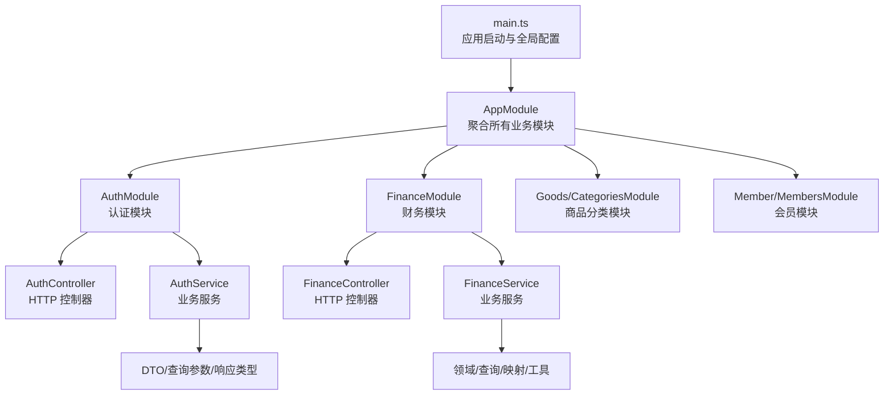
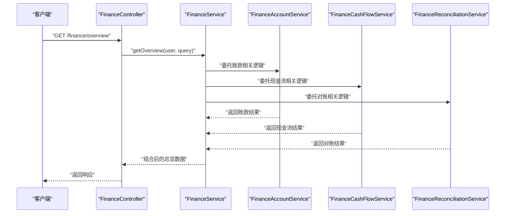
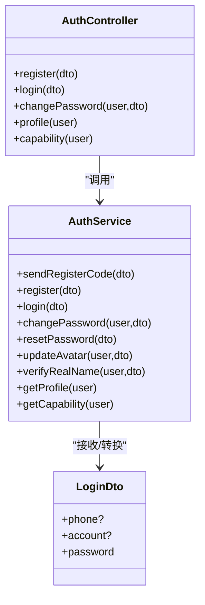
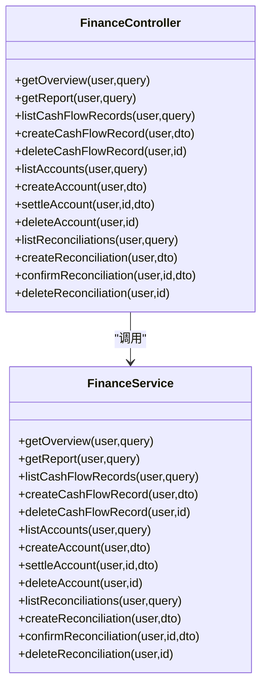
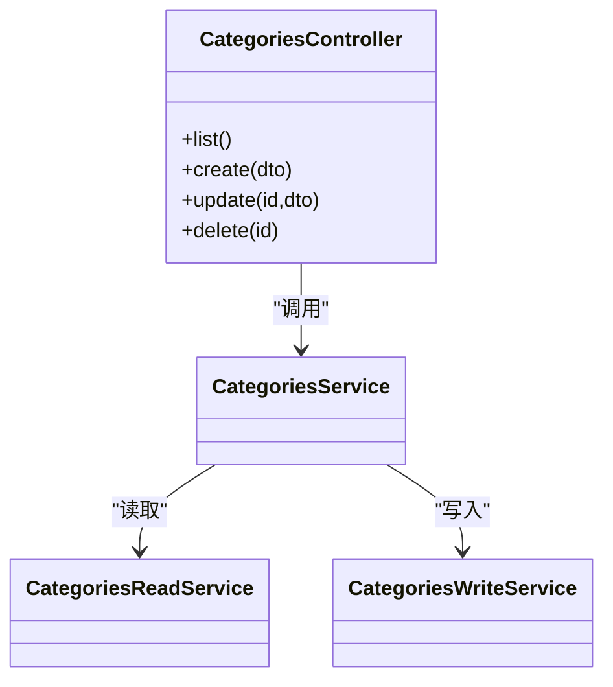
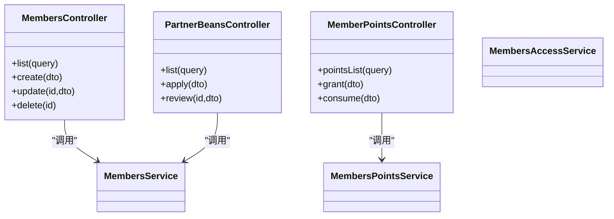
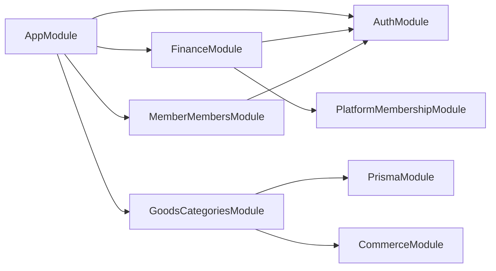
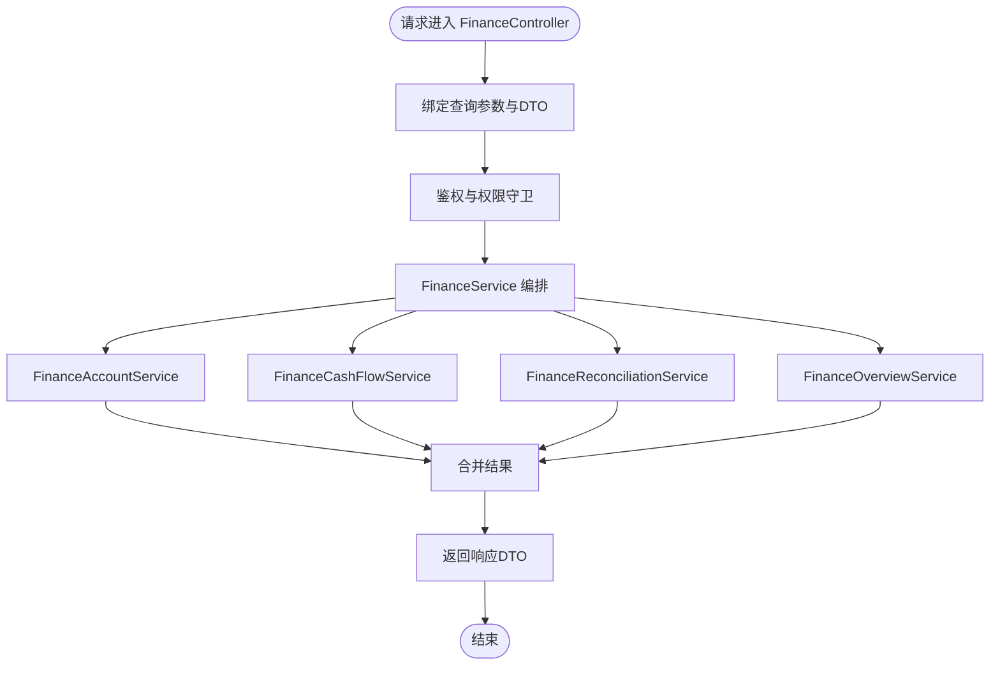

# 文件结构模式

<cite>
**本文引用的文件**
- [src/app.module.ts](file://src/app.module.ts)
- [src/main.ts](file://src/main.ts)
- [src/purely-profit/auth/auth.module.ts](file://src/purely-profit/auth/auth.module.ts)
- [src/purely-profit/auth/auth.controller.ts](file://src/purely-profit/auth/auth.controller.ts)
- [src/purely-profit/auth/auth.service.ts](file://src/purely-profit/auth/auth.service.ts)
- [src/purely-profit/auth/dto/login.dto.ts](file://src/purely-profit/auth/dto/login.dto.ts)
- [src/purely-profit/finance/finance.module.ts](file://src/purely-profit/finance/finance.module.ts)
- [src/purely-profit/finance/finance.controller.ts](file://src/purely-profit/finance/finance.controller.ts)
- [src/purely-profit/finance/finance.service.ts](file://src/purely-profit/finance/finance.service.ts)
- [src/purely-profit/goods/categories/categories.module.ts](file://src/purely-profit/goods/categories/categories.module.ts)
- [src/purely-profit/member/members/members.module.ts](file://src/purely-profit/member/members/members.module.ts)
- [README.md](file://README.md)
</cite>

## 目录
1. [引言](#引言)
2. [项目结构](#项目结构)
3. [核心组件](#核心组件)
4. [架构总览](#架构总览)
5. [详细组件分析](#详细组件分析)
6. [依赖分析](#依赖分析)
7. [性能考虑](#性能考虑)
8. [故障排查指南](#故障排查指南)
9. [结论](#结论)
10. [附录](#附录)

## 引言
本文件系统性阐述 purelyprofit-server 的标准文件结构模式，重点说明业务模块的典型目录组织与职责分工，涵盖 controller、service、dto、query、mapper、domain、types 等文件类型的定位与协作关系，并给出模块内文件组织原则、命名约定以及可维护性与可扩展性的最佳实践。同时，结合仓库中的真实模块（如 auth、finance、goods.categories、member.members），提供完整业务功能的文件结构布局示例与流程图。

## 项目结构
purelyprofit-server 基于 NestJS 构建，采用“按领域/模块”分层的目录组织方式，主入口在 src 下，模块化拆分清晰，便于扩展与维护。应用启动入口位于 main.ts，根模块 AppModule 聚合所有业务模块；各业务域（如 auth、finance、goods、marketing、member、operations 等）均以独立模块形式组织，模块内部遵循“controller/service/dto/query/mapper/domain/types”的职责划分。

图表来源
- [src/main.ts:121-208](file://src/main.ts#L121-L208)
- [src/app.module.ts:39-82](file://src/app.module.ts#L39-L82)
- [src/purely-profit/auth/auth.module.ts:21-55](file://src/purely-profit/auth/auth.module.ts#L21-L55)
- [src/purely-profit/finance/finance.module.ts:12-25](file://src/purely-profit/finance/finance.module.ts#L12-L25)
- [src/purely-profit/goods/categories/categories.module.ts:9-14](file://src/purely-profit/goods/categories/categories.module.ts#L9-L14)
- [src/purely-profit/member/members/members.module.ts:12-21](file://src/purely-profit/member/members/members.module.ts#L12-L21)

章节来源
- [src/main.ts:121-208](file://src/main.ts#L121-L208)
- [src/app.module.ts:39-82](file://src/app.module.ts#L39-L82)
- [README.md:24-58](file://README.md#L24-L58)

## 核心组件
- 应用入口与启动
  - main.ts 负责创建 Nest 应用实例、设置全局管道、CORS、Swagger 文档、端口监听与回退策略等。
  - app.module.ts 定义根模块，集中导入与装配所有业务模块，形成清晰的模块边界与依赖关系。
- 模块化组织
  - 每个业务域以 Module 形式封装，内部包含 controller、service、dto、query、mapper、domain、types 等文件，职责明确、边界清晰。
  - 模块间通过依赖注入与 exports 进行解耦，避免循环依赖，提升可测试性与可维护性。

章节来源
- [src/main.ts:121-208](file://src/main.ts#L121-L208)
- [src/app.module.ts:39-82](file://src/app.module.ts#L39-L82)

## 架构总览
下图展示了从请求进入应用到业务处理完成的整体流程，体现控制器、服务、DTO、鉴权与权限守卫之间的交互关系。

图表来源
- [src/purely-profit/finance/finance.controller.ts:57-69](file://src/purely-profit/finance/finance.controller.ts#L57-L69)
- [src/purely-profit/finance/finance.service.ts:50-55](file://src/purely-profit/finance/finance.service.ts#L50-L55)

## 详细组件分析

### 认证模块（auth）文件结构与职责
- controller 层
  - AuthController：负责对外暴露 HTTP 接口，使用 Swagger 注解标注接口语义，配合 JwtAuthGuard 与权限守卫进行访问控制。
- service 层
  - AuthService：作为门面服务，编排认证、验证码、个人资料、权限快照等子服务，实现业务编排与参数转换。
- dto 层
  - 登录 DTO（LoginDto）：定义输入校验规则与示例，确保请求体结构与约束一致。
- module 屃
  - AuthModule：注册 Passport、JWT、策略与守卫，导出 JwtAuthGuard 供其他模块复用。

图表来源
- [src/purely-profit/auth/auth.controller.ts:33-181](file://src/purely-profit/auth/auth.controller.ts#L33-L181)
- [src/purely-profit/auth/auth.service.ts:38-127](file://src/purely-profit/auth/auth.service.ts#L38-L127)
- [src/purely-profit/auth/dto/login.dto.ts:4-28](file://src/purely-profit/auth/dto/login.dto.ts#L4-L28)

章节来源
- [src/purely-profit/auth/auth.controller.ts:33-181](file://src/purely-profit/auth/auth.controller.ts#L33-L181)
- [src/purely-profit/auth/auth.service.ts:38-127](file://src/purely-profit/auth/auth.service.ts#L38-L127)
- [src/purely-profit/auth/dto/login.dto.ts:4-28](file://src/purely-profit/auth/dto/login.dto.ts#L4-L28)
- [src/purely-profit/auth/auth.module.ts:21-55](file://src/purely-profit/auth/auth.module.ts#L21-L55)

### 财务模块（finance）文件结构与职责
- controller 层
  - FinanceController：面向财务总览、报表、现金流、账款、对账等接口，统一使用鉴权与权限守卫。
- service 层
  - FinanceService：作为门面服务，委派给多个子服务（账户、现金流、对账、概览），实现复杂业务编排。
- module 层
  - FinanceModule：依赖 AuthModule 与平台会员模块，导出概览服务供其他模块使用。

图表来源
- [src/purely-profit/finance/finance.controller.ts:57-277](file://src/purely-profit/finance/finance.controller.ts#L57-L277)
- [src/purely-profit/finance/finance.service.ts:50-162](file://src/purely-profit/finance/finance.service.ts#L50-L162)

章节来源
- [src/purely-profit/finance/finance.controller.ts:57-277](file://src/purely-profit/finance/finance.controller.ts#L57-L277)
- [src/purely-profit/finance/finance.service.ts:50-162](file://src/purely-profit/finance/finance.service.ts#L50-L162)
- [src/purely-profit/finance/finance.module.ts:12-25](file://src/purely-profit/finance/finance.module.ts#L12-L25)

### 商品分类模块（goods.categories）文件结构与职责
- controller 层
  - CategoriesController：提供分类读写接口。
- service 层
  - CategoriesReadService / CategoriesWriteService / CategoriesService：分别承担只读、写入与综合服务职责。
- module 层
  - CategoriesModule：依赖 PrismaModule 与 CommerceModule，模块内职责清晰、边界明确。

图表来源
- [src/purely-profit/goods/categories/categories.module.ts:9-14](file://src/purely-profit/goods/categories/categories.module.ts#L9-L14)

章节来源
- [src/purely-profit/goods/categories/categories.module.ts:9-14](file://src/purely-profit/goods/categories/categories.module.ts#L9-L14)

### 会员模块（member.members）文件结构与职责
- controller 层
  - MembersController / MemberPointsController / PartnerBeansController：分别处理会员、积分与伙伴豆相关接口。
- service 层
  - MembersService / MembersAccessService / MembersPointsService：分别处理会员读写、访问控制与积分逻辑。
- module 层
  - MembersModule：依赖 AuthModule，模块内职责清晰，便于扩展。

图表来源
- [src/purely-profit/member/members/members.module.ts:12-21](file://src/purely-profit/member/members/members.module.ts#L12-L21)

章节来源
- [src/purely-profit/member/members/members.module.ts:12-21](file://src/purely-profit/member/members/members.module.ts#L12-L21)

## 依赖分析
- 模块间依赖
  - AppModule 统一导入与装配所有业务模块，形成清晰的依赖树。
  - 具体模块之间通过依赖注入与 exports 解耦，例如 AuthModule 导出 JwtAuthGuard，FinanceModule 依赖 AuthModule 与平台会员模块。
- 控制器与服务
  - 控制器仅负责路由与参数绑定，业务逻辑集中在服务层，便于单元测试与替换实现。
- DTO 与类型
  - DTO 用于输入输出契约定义，类型文件（如 types.ts）用于跨模块共享的领域类型与常量。

图表来源
- [src/app.module.ts:40-78](file://src/app.module.ts#L40-L78)
- [src/purely-profit/auth/auth.module.ts:22-36](file://src/purely-profit/auth/auth.module.ts#L22-L36)
- [src/purely-profit/finance/finance.module.ts:13-23](file://src/purely-profit/finance/finance.module.ts#L13-L23)
- [src/purely-profit/goods/categories/categories.module.ts:10](file://src/purely-profit/goods/categories/categories.module.ts#L10)
- [src/purely-profit/member/members/members.module.ts:13](file://src/purely-profit/member/members/members.module.ts#L13)

章节来源
- [src/app.module.ts:40-78](file://src/app.module.ts#L40-L78)
- [src/purely-profit/auth/auth.module.ts:22-36](file://src/purely-profit/auth/auth.module.ts#L22-L36)
- [src/purely-profit/finance/finance.module.ts:13-23](file://src/purely-profit/finance/finance.module.ts#L13-L23)
- [src/purely-profit/goods/categories/categories.module.ts:10](file://src/purely-profit/goods/categories/categories.module.ts#L10)
- [src/purely-profit/member/members/members.module.ts:13](file://src/purely-profit/member/members/members.module.ts#L13)

## 性能考虑
- 启动与运行时配置
  - main.ts 提供慢请求日志阈值、端口自动回退、CORS 与 Swagger 开关等配置项，便于在不同环境优化性能与可观测性。
- 模块化与依赖注入
  - 将复杂业务拆分为多个子服务，减少单体服务的耦合度，提升可测试性与部署灵活性。
- DTO 校验与全局管道
  - 使用 ValidationPipe 白名单与转换选项，降低无效请求对下游服务的影响，提高整体稳定性。

章节来源
- [src/main.ts:121-208](file://src/main.ts#L121-L208)

## 故障排查指南
- 启动失败与端口占用
  - main.ts 内置端口回退逻辑，若默认端口被占用会自动尝试下一个端口并在日志中提示。
- 请求慢与可观测性
  - 通过 HTTP 钩子记录请求开始时间与耗时，结合慢请求阈值输出告警日志，便于定位慢接口。
- Swagger 文档
  - 在非生产环境启用 Swagger，便于接口调试与联调；生产环境可通过配置关闭。

章节来源
- [src/main.ts:32-75](file://src/main.ts#L32-L75)
- [src/main.ts:166-179](file://src/main.ts#L166-L179)

## 结论
purelyprofit-server 的文件结构遵循“按领域模块化 + 分层职责”的设计原则，控制器仅负责接口与参数绑定，服务层承载业务编排与领域逻辑，DTO/类型文件定义契约，模块间通过依赖注入与守卫解耦。该模式保证了代码的可维护性与可扩展性，便于团队协作与长期演进。

## 附录

### 文件类型职责与命名约定
- controller
  - 职责：定义路由、参数绑定、鉴权与权限守卫、Swagger 注解。
  - 命名：模块名.controller.ts（如 finance.controller.ts）。
- service
  - 职责：业务编排、调用子服务、事务与一致性处理。
  - 命名：模块名.service.ts（如 finance.service.ts）。
- dto
  - 职责：输入/输出参数的结构与校验规则。
  - 命名：模块名.query.dto.ts、模块名.response.dto.ts、模块名.dto.ts（如 finance-account.query.dto.ts）。
- query
  - 职责：查询参数的结构与校验，通常与分页、过滤、排序相关。
  - 命名：模块名.query.ts（如 finance-account.query.ts）。
- mapper
  - 职责：领域对象与数据库实体之间的映射转换。
  - 命名：模块名.mapper.ts（如 finance.mapper.ts）。
- domain
  - 职责：领域模型、值对象、业务规则与不变式。
  - 命名：模块名.domain.ts（如 finance-account.domain.ts）。
- types
  - 职责：跨模块共享的类型定义、枚举、常量。
  - 命名：模块名.types.ts（如 finance.types.ts）。

### 模块内部文件组织原则
- 单一职责：每个模块聚焦一个业务域，避免交叉耦合。
- 明确边界：controller/service/dto/query/mapper/domain/types 各司其职，必要时通过 module 的 providers/exports 进行解耦。
- 可测试性：服务层尽量无状态、纯函数化，便于单元测试与替换实现。
- 可扩展性：新增功能优先在现有模块内拆分子服务，避免过度膨胀。

### 完整业务功能文件结构示例（以“财务总览”为例）
- controller：finance.controller.ts
- service：finance.service.ts
- 子服务：finance-account.service.ts、finance-cash-flow.service.ts、finance-reconciliation.service.ts、finance-overview.service.ts
- dto：finance-overview.query.dto.ts、finance-overview.response.dto.ts 等
- query：finance-overview.query.ts
- mapper：finance.mapper.ts
- domain：finance-account.domain.ts、finance-cash-flow.domain.ts、finance-reconciliation.domain.ts、finance-overview.domain.ts
- types：finance.types.ts

图表来源
- [src/purely-profit/finance/finance.controller.ts:57-69](file://src/purely-profit/finance/finance.controller.ts#L57-L69)
- [src/purely-profit/finance/finance.service.ts:50-55](file://src/purely-profit/finance/finance.service.ts#L50-L55)