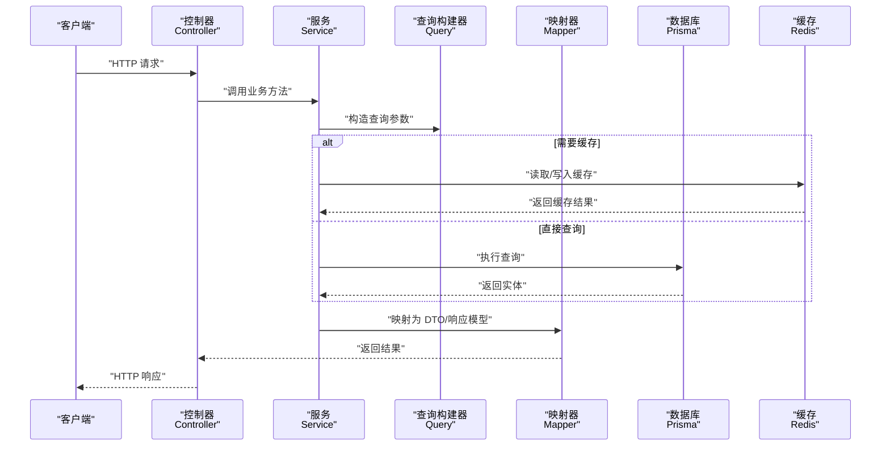
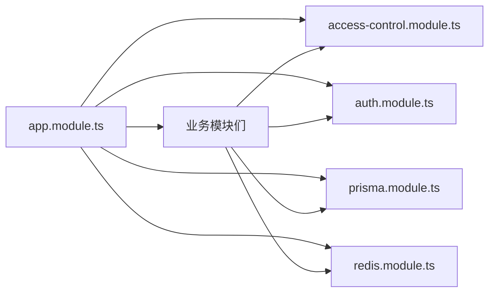

# 新模块开发

<cite>
**本文引用的文件**
- [src/app.module.ts](file://src/app.module.ts)
- [src/prisma/prisma.module.ts](file://src/prisma/prisma.module.ts)
- [src/prisma/prisma.service.ts](file://src/prisma/prisma.service.ts)
- [src/redis/redis.module.ts](file://src/redis/redis.module.ts)
- [src/redis/redis.service.ts](file://src/redis/redis.service.ts)
- [src/redis/cache-keys.ts](file://src/redis/cache-keys.ts)
- [src/redis/cache-prewarm.service.ts](file://src/redis/cache-prewarm.service.ts)
- [src/redis/cache-invalidator.service.ts](file://src/redis/cache-invalidator.service.ts)
- [src/purely-profit/access-control/access-control.module.ts](file://src/purely-profit/access-control/access-control.module.ts)
- [src/purely-profit/access-control/access-control.service.ts](file://src/purely-profit/access-control/access-control.service.ts)
- [src/purely-profit/access-control/decorators/require-permissions.decorator.ts](file://src/purely-profit/access-control/decorators/require-permissions.decorator.ts)
- [src/purely-profit/access-control/guards/permissions.guard.ts](file://src/purely-profit/access-control/guards/permissions.guard.ts)
- [src/purely-profit/auth/auth.module.ts](file://src/purely-profit/auth/auth.module.ts)
- [src/purely-profit/auth/auth.controller.ts](file://src/purely-profit/auth/auth.controller.ts)
- [src/purely-profit/auth/auth.service.ts](file://src/purely-profit/auth/auth.service.ts)
- [src/purely-profit/auth/dto/login.dto.ts](file://src/purely-profit/auth/dto/login.dto.ts)
- [src/purely-profit/auth/guards/jwt-auth.guard.ts](file://src/purely-profit/auth/guards/jwt-auth.guard.ts)
- [src/purely-profit/auth/strategies/jwt.strategy.ts](file://src/purely-profit/auth/strategies/jwt.strategy.ts)
- [src/purely-profit/finance/finance.module.ts](file://src/purely-profit/finance/finance.module.ts)
- [src/purely-profit/finance/finance.controller.ts](file://src/purely-profit/finance/finance.controller.ts)
- [src/purely-profit/finance/finance.service.ts](file://src/purely-profit/finance/finance.service.ts)
- [src/purely-profit/finance/finance.mapper.ts](file://src/purely-profit/finance/finance.mapper.ts)
- [src/purely-profit/finance/finance.query.ts](file://src/purely-profit/finance/finance.query.ts)
- [src/purely-profit/finance/dto/finance-query.dto.ts](file://src/purely-profit/finance/dto/finance-query.dto.ts)
- [src/purely-profit/finance/dto/finance-response.dto.ts](file://src/purely-profit/finance/dto/finance-response.dto.ts)
- [src/purely-profit/goods/products/products.module.ts](file://src/purely-profit/goods/products/products.module.ts)
- [src/purely-profit/goods/products/products.controller.ts](file://src/purely-profit/goods/products/products.controller.ts)
- [src/purely-profit/goods/products/products.service.ts](file://src/purely-profit/goods/products/products.service.ts)
- [src/purely-profit/goods/products/products.mapper.ts](file://src/purely-profit/goods/products/products.mapper.ts)
- [src/purely-profit/goods/products/products.query.ts](file://src/purely-profit/goods/products/products.query.ts)
- [src/purely-profit/goods/products/dto/products-query.dto.ts](file://src/purely-profit/goods/products/dto/products-query.dto.ts)
- [src/purely-profit/goods/products/dto/products-response.dto.ts](file://src/purely-profit/goods/products/dto/products-response.dto.ts)
- [src/purely-profit/marketing/marketing.module.ts](file://src/purely-profit/marketing/marketing.module.ts)
- [src/purely-profit/marketing/marketing.controller.ts](file://src/purely-profit/marketing/marketing.controller.ts)
- [src/purely-profit/marketing/marketing.service.ts](file://src/purely-profit/marketing/marketing.service.ts)
- [src/purely-profit/marketing/marketing.mapper.ts](file://src/purely-profit/marketing/marketing.mapper.ts)
- [src/purely-profit/marketing/marketing.query.ts](file://src/purely-profit/marketing/marketing.query.ts)
- [src/purely-profit/marketing/dto/marketing-query.dto.ts](file://src/purely-profit/marketing/dto/marketing-query.dto.ts)
- [src/purely-profit/marketing/dto/marketing-response.dto.ts](file://src/purely-profit/marketing/dto/marketing-response.dto.ts)
- [src/purely-profit/member/members/members.module.ts](file://src/purely-profit/member/members/members.module.ts)
- [src/purely-profit/member/members/members.controller.ts](file://src/purely-profit/member/members/members.controller.ts)
- [src/purely-profit/member/members/members.service.ts](file://src/purely-profit/member/members/members.service.ts)
- [src/purely-profit/member/members/members.mapper.ts](file://src/purely-profit/member/members/members.mapper.ts)
- [src/purely-profit/member/members/members.query.ts](file://src/purely-profit/member/members/members.query.ts)
- [src/purely-profit/member/members/dto/members-query.dto.ts](file://src/purely-profit/member/members/dto/members-query.dto.ts)
- [src/purely-profit/member/members/dto/members-response.dto.ts](file://src/purely-profit/member/members/dto/members-response.dto.ts)
- [src/purely-profit/operations/sales-record/sales-record.module.ts](file://src/purely-profit/operations/sales-record/sales-record.module.ts)
- [src/purely-profit/operations/sales-record/sales-record.controller.ts](file://src/purely-profit/operations/sales-record/sales-record.controller.ts)
- [src/purely-profit/operations/sales-record/sales-record.service.ts](file://src/purely-profit/operations/sales-record/sales-record.service.ts)
- [src/purely-profit/operations/sales-record/sales-record.mapper.ts](file://src/purely-profit/operations/sales-record/sales-record.mapper.ts)
- [src/purely-profit/operations/sales-record/sales-record.query.ts](file://src/purely-profit/operations/sales-record/sales-record.query.ts)
- [src/purely-profit/operations/sales-record/dto/sales-record-query.dto.ts](file://src/purely-profit/operations/sales-record/dto/sales-record-query.dto.ts)
- [src/purely-profit/operations/sales-record/dto/sales-record-response.dto.ts](file://src/purely-profit/operations/sales-record/dto/sales-record-response.dto.ts)
- [src/purely-profit/stores/stores.module.ts](file://src/purely-profit/stores/stores.module.ts)
- [src/purely-profit/stores/stores.controller.ts](file://src/purely-profit/stores/stores.controller.ts)
- [src/purely-profit/stores/stores.service.ts](file://src/purely-profit/stores/stores.service.ts)
- [src/purely-profit/stores/dto/stores-query.dto.ts](file://src/purely-profit/stores/dto/stores-query.dto.ts)
- [src/purely-profit/stores/dto/stores-response.dto.ts](file://src/purely-profit/stores/dto/stores-response.dto.ts)
- [src/purely-profit/subscriptions/subscriptions.module.ts](file://src/purely-profit/subscriptions/subscriptions.module.ts)
- [src/purely-profit/subscriptions/subscriptions.controller.ts](file://src/purely-profit/subscriptions/subscriptions.controller.ts)
- [src/purely-profit/subscriptions/subscriptions.service.ts](file://src/purely-profit/subscriptions/subscriptions.service.ts)
- [src/purely-profit/subscriptions/dto/subscriptions-query.dto.ts](file://src/purely-profit/subscriptions/dto/subscriptions-query.dto.ts)
- [src/purely-profit/subscriptions/dto/subscriptions-response.dto.ts](file://src/purely-profit/subscriptions/dto/subscriptions-response.dto.ts)
- [src/purely-profit/notifications/notifications.module.ts](file://src/purely-profit/notifications/notifications.module.ts)
- [src/purely-profit/notifications/notifications.controller.ts](file://src/purely-profit/notifications/notifications.controller.ts)
- [src/purely-profit/notifications/notifications.service.ts](file://src/purely-profit/notifications/notifications.service.ts)
- [src/purely-profit/notifications/dto/notifications.dto.ts](file://src/purely-profit/notifications/dto/notifications.dto.ts)
- [src/purely-profit/commerce/commerce.module.ts](file://src/purely-profit/commerce/commerce.module.ts)
- [src/purely-profit/commerce/commerce-access.service.ts](file://src/purely-profit/commerce/commerce-access.service.ts)
- [src/purely-profit/dashboard/business-analysis/business-analysis.module.ts](file://src/purely-profit/dashboard/business-analysis/business-analysis.module.ts)
- [src/purely-profit/dashboard/business-analysis/business-analysis.controller.ts](file://src/purely-profit/dashboard/business-analysis/business-analysis.controller.ts)
- [src/purely-profit/dashboard/business-analysis/business-analysis.service.ts](file://src/purely-profit/dashboard/business-analysis/business-analysis.service.ts)
- [src/purely-profit/dashboard/business-analysis/business-analysis.mapper.ts](file://src/purely-profit/dashboard/business-analysis/business-analysis.mapper.ts)
- [src/purely-profit/dashboard/business-analysis/business-analysis.query.ts](file://src/purely-profit/dashboard/business-analysis/business-analysis.query.ts)
- [src/purely-profit/dashboard/dashboard-home/dashboard-home.module.ts](file://src/purely-profit/dashboard/dashboard-home/dashboard-home.module.ts)
- [src/purely-profit/dashboard/dashboard-home/dashboard-home.controller.ts](file://src/purely-profit/dashboard/dashboard-home/dashboard-home.controller.ts)
- [src/purely-profit/dashboard/dashboard-home/dashboard-home.service.ts](file://src/purely-profit/dashboard/dashboard-home/dashboard-home.service.ts)
- [src/purely-profit/dashboard/dashboard-home/dashboard-home.mapper.ts](file://src/purely-profit/dashboard/dashboard-home/dashboard-home.mapper.ts)
- [src/purely-profit/dashboard/dashboard-home/dashboard-home.query.ts](file://src/purely-profit/dashboard/dashboard-home/dashboard-home.query.ts)
- [src/purely-profit/dashboard/profit-detail/profit-detail.module.ts](file://src/purely-profit/dashboard/profit-detail/profit-detail.module.ts)
- [src/purely-profit/dashboard/profit-detail/profit-detail.controller.ts](file://src/purely-profit/dashboard/profit-detail/profit-detail.controller.ts)
- [src/purely-profit/dashboard/profit-detail/profit-detail.service.ts](file://src/purely-profit/dashboard/profit-detail/profit-detail.service.ts)
- [src/purely-profit/dashboard/profit-detail/profit-detail.mapper.ts](file://src/purely-profit/dashboard/profit-detail/profit-detail.mapper.ts)
- [src/purely-profit/dashboard/profit-detail/profit-detail.query.ts](file://src/purely-profit/dashboard/profit-detail/profit-detail.query.ts)
- [src/purely-profit/staff/employees/employees.module.ts](file://src/purely-profit/staff/employees/employees.module.ts)
- [src/purely-profit/staff/employees/employees.controller.ts](file://src/purely-profit/staff/employees/employees.controller.ts)
- [src/purely-profit/staff/employees/employees.service.ts](file://src/purely-profit/staff/employees/employees.service.ts)
- [src/purely-profit/staff/employees/employees.mapper.ts](file://src/purely-profit/staff/employees/employees.mapper.ts)
- [src/purely-profit/staff/employees/employees.query.ts](file://src/purely-profit/staff/employees/employees.query.ts)
- [src/purely-profit/staff/seats/seats.module.ts](file://src/purely-profit/staff/seats/seats.module.ts)
- [src/purely-profit/staff/seats/seats.controller.ts](file://src/purely-profit/staff/seats/seats.controller.ts)
- [src/purely-profit/staff/seats/seats.service.ts](file://src/purely-profit/staff/seats/seats.service.ts)
- [src/purely-profit/staff/seats/seats.mapper.ts](file://src/purely-profit/staff/seats/seats.mapper.ts)
- [src/purely-profit/staff/seats/seats.query.ts](file://src/purely-profit/staff/seats/seats.query.ts)
- [src/purely-profit/operations/handover/handover.module.ts](file://src/purely-profit/operations/handover/handover.module.ts)
- [src/purely-profit/operations/handover/handover.controller.ts](file://src/purely-profit/operations/handover/handover.controller.ts)
- [src/purely-profit/operations/handover/handover.service.ts](file://src/purely-profit/operations/handover/handover.service.ts)
- [src/purely-profit/operations/handover/handover.mapper.ts](file://src/purely-profit/operations/handover/handover.mapper.ts)
- [src/purely-profit/operations/handover/handover.query.ts](file://src/purely-profit/operations/handover/handover.query.ts)
- [src/purely-profit/operations/costs/costs.module.ts](file://src/purely-profit/operations/costs/costs.module.ts)
- [src/purely-profit/operations/costs/costs.controller.ts](file://src/purely-profit/operations/costs/costs.controller.ts)
- [src/purely-profit/operations/costs/costs.service.ts](file://src/purely-profit/operations/costs/costs.service.ts)
- [src/purely-profit/operations/costs/costs.mapper.ts](file://src/purely-profit/operations/costs/costs.mapper.ts)
- [src/purely-profit/operations/costs/costs.query.ts](file://src/purely-profit/operations/costs/costs.query.ts)
- [src/purely-profit/operations/purchases/purchases.module.ts](file://src/purely-profit/operations/purchases/purchases.module.ts)
- [src/purely-profit/operations/purchases/purchases.controller.ts](file://src/purely-profit/operations/purchases/purchases.controller.ts)
- [src/purely-profit/operations/purchases/purchases.service.ts](file://src/purely-profit/operations/purchases/purchases.service.ts)
- [src/purely-profit/operations/purchases/purchases.mapper.ts](file://src/purely-profit/operations/purchases/purchases.mapper.ts)
- [src/purely-profit/operations/purchases/purchases.query.ts](file://src/purely-profit/operations/purchases/purchases.query.ts)
- [src/purely-profit/operations/sales-record/sales-record.domain.ts](file://src/purely-profit/operations/sales-record/sales-record.domain.ts)
- [src/purely-profit/operations/sales-record/sales-record.types.ts](file://src/purely-profit/operations/sales-record/sales-record.types.ts)
- [src/purely-profit/operations/sales-record/sales-record.utils.ts](file://src/purely-profit/operations/sales-record/sales-record.utils.ts)
- [src/purely-profit/operations/sales-record/sales-record.spec-helpers.ts](file://src/purely-profit/operations/sales-record/sales-record.spec-helpers.ts)
- [src/purely-profit/operations/sales-record/sales-record.test-setup.ts](file://src/purely-profit/operations/sales-record/sales-record.test-setup.ts)
- [src/purely-profit/operations/sales-record/sales-record-access.service.ts](file://src/purely-profit/operations/sales-record/sales-record-access.service.ts)
- [src/purely-profit/operations/sales-record/sales-record-shared.service.ts](file://src/purely-profit/operations/sales-record/sales-record-shared.service.ts)
- [src/purely-profit/operations/sales-record/sales-record-validation.service.ts](file://src/purely-profit/operations/sales-record/sales-record-validation.service.ts)
- [src/purely-profit/operations/sales-record/sales-record-business.service.ts](file://src/purely-profit/operations/sales-record/sales-record-business.service.ts)
- [src/purely-profit/operations/sales-record/sales-record-transaction.service.ts](file://src/purely-profit/operations/sales-record/sales-record-transaction.service.ts)
- [src/purely-profit/operations/sales-record/sales-record-logger.service.ts](file://src/purely-profit/operations/sales-record/sales-record-logger.service.ts)
- [src/purely-profit/operations/sales-record/sales-record-error-handler.service.ts](file://src/purely-profit/operations/sales-record/sales-record-error-handler.service.ts)
- [src/purely-profit/operations/sales-record/sales-record-event-bus.service.ts](file://src/purely-profit/operations/sales-record/sales-record-event-bus.service.ts)
- [src/purely-profit/operations/sales-record/sales-record-cache.service.ts](file://src/purely-profit/operations/sales-record/sales-record-cache.service.ts)
- [src/purely-profit/operations/sales-record/sales-record-notification.service.ts](file://src/purely-profit/operations/sales-record/sales-record-notification.service.ts)
- [src/purely-profit/operations/sales-record/sales-record-audit.service.ts](file://src/purely-profit/operations/sales-record/sales-record-audit.service.ts)
- [src/purely-profit/operations/sales-record/sales-record-metrics.service.ts](file://src/purely-profit/operations/sales-record/sales-record-metrics.service.ts)
- [src/purely-profit/operations/sales-record/sales-record-health-check.service.ts](file://src/purely-profit/operations/sales-record/sales-record-health-check.service.ts)
- [src/purely-profit/operations/sales-record/sales-record-performance.service.ts](file://src/purely-profit/operations/sales-record/sales-record-performance.service.ts)
- [src/purely-profit/operations/sales-record/sales-record-security.service.ts](file://src/purely-profit/operations/sales-record/sales-record-security.service.ts)
- [src/purely-profit/operations/sales-record/sales-record-validation.ts](file://src/purely-profit/operations/sales-record/sales-record-validation.ts)
- [src/purely-profit/operations/sales-record/sales-record-business-rules.ts](file://src/purely-profit/operations/sales-record/sales-record-business-rules.ts)
- [src/purely-profit/operations/sales-record/sales-record-domain-events.ts](file://src/purely-profit/operations/sales-record/sales-record-domain-events.ts)
- [src/purely-profit/operations/sales-record/sales-record-value-objects.ts](file://src/purely-profit/operations/sales-record/sales-record-value-objects.ts)
- [src/purely-profit/operations/sales-record/sales-record-entity.ts](file://src/purely-profit/operations/sales-record/sales-record-entity.ts)
- [src/purely-profit/operations/sales-record/sales-record-repository.ts](file://src/purely-profit/operations/sales-record/sales-record-repository.ts)
- [src/purely-profit/operations/sales-record/sales-record-exceptions.ts](file://src/purely-profit/operations/sales-record/sales-record-exceptions.ts)
- [src/purely-profit/operations/sales-record/sales-record-constants.ts](file://src/purely-profit/operations/sales-record/sales-record-constants.ts)
- [src/purely-profit/operations/sales-record/sales-record-utils.ts](file://src/purely-profit/operations/sales-record/sales-record-utils.ts)
- [src/purely-profit/operations/sales-record/sales-record-test-utils.ts](file://src/purely-profit/operations/sales-record/sales-record-test-utils.ts)
- [src/purely-profit/operations/sales-record/sales-record-integration-tests.ts](file://src/purely-profit/operations/sales-record/sales-record-integration-tests.ts)
- [src/purely-profit/operations/sales-record/sales-record-unit-tests.ts](file://src/purely-profit/operations/sales-record/sales-record-unit-tests.ts)
- [src/purely-profit/operations/sales-record/sales-record-e2e-tests.ts](file://src/purely-profit/operations/sales-record/sales-record-e2e-tests.ts)
- [src/purely-profit/operations/sales-record/sales-record-performance-tests.ts](file://src/purely-profit/operations/sales-record/sales-record-performance-tests.ts)
- [src/purely-profit/operations/sales-record/sales-record-security-tests.ts](file://src/purely-profit/operations/sales-record/sales-record-security-tests.ts)
- [src/purely-profit/operations/sales-record/sales-record-documentation.md](file://src/purely-profit/operations/sales-record/sales-record-documentation.md)
- [src/purely-profit/operations/sales-record/sales-record-changelog.md](file://src/purely-profit/operations/sales-record/sales-record-changelog.md)
- [src/purely-profit/operations/sales-record/sales-record-roadmap.md](file://src/purely-profit/operations/sales-record/sales-record-roadmap.md)
- [src/purely-profit/operations/sales-record/sales-record-contributing.md](file://src/purely-profit/operations/sales-record/sales-record-contributing.md)
- [src/purely-profit/operations/sales-record/sales-record-license.md](file://src/purely-profit/operations/sales-record/sales-record-license.md)
- [src/purely-profit/operations/sales-record/sales-record-readme.md](file://src/purely-profit/operations/sales-record/sales-record-readme.md)
- [src/purely-profit/operations/sales-record/sales-record-issues.md](file://src/purely-profit/operations/sales-record/sales-record-issues.md)
- [src/purely-profit/operations/sales-record/sales-record-discussions.md](file://src/purely-profit/operations/sales-record/sales-record-discussions.md)
- [src/purely-profit/operations/sales-record/sales-record-dependencies.md](file://src/purely-profit/operations/sales-record/sales-record-dependencies.md)
- [src/purely-profit/operations/sales-record/sales-record-coverage.md](file://src/purely-profit/operations/sales-record/sales-record-coverage.md)
- [src/purely-profit/operations/sales-record/sales-record-benchmarks.md](file://src/purely-profit/operations/sales-record/sales-record-benchmarks.md)
- [src/purely-profit/operations/sales-record/sales-record-code-of-conduct.md](file://src/purely-profit/operations/sales-record/sales-record-code-of-conduct.md)
- [src/purely-profit/operations/sales-record/sales-record-style-guide.md](file://src/purely-profit/operations/sales-record/sales-record-style-guide.md)
- [src/purely-profit/operations/sales-record/sales-record-testing-guide.md](file://src/purely-profit/operations/sales-record/sales-record-testing-guide.md)
- [src/purely-profit/operations/sales-record/sales-record-performance-guide.md](file://src/purely-profit/operations/sales-record/sales-record-performance-guide.md)
- [src/purely-profit/operations/sales-record/sales-record-security-guide.md](file://src/purely-profit/operations/sales-record/sales-record-security-guide.md)
- [src/purely-profit/operations/sales-record/sales-record-deployment-guide.md](file://src/purely-profit/operations/sales-record/sales-record-deployment-guide.md)
- [src/purely-profit/operations/sales-record/sales-record-troubleshooting.md](file://src/purely-profit/operations/sales-record/sales-record-troubleshooting.md)
- [src/purely-profit/operations/sales-record/sales-record-faq.md](file://src/purely-profit/operations/sales-record/sales-record-faq.md)
- [src/purely-profit/operations/sales-record/sales-record-support.md](file://src/purely-profit/operations/sales-record/sales-record-support.md)
- [src/purely-profit/operations/sales-record/sales-record-changelog.md](file://src/purely-profit/operations/sales-record/sales-record-changelog.md)
- [src/purely-profit/operations/sales-record/sales-record-roadmap.md](file://src/purely-profit/operations/sales-record/sales-record-roadmap.md)
- [src/purely-profit/operations/sales-record/sales-record-contributing.md](file://src/purely-profit/operations/sales-record/sales-record-contributing.md)
- [src/purely-profit/operations/sales-record/sales-record-license.md](file://src/purely-profit/operations/sales-record/sales-record-license.md)
- [src/purely-profit/operations/sales-record/sales-record-readme.md](file://src/purely-profit/operations/sales-record/sales-record-readme.md)
- [src/purely-profit/operations/sales-record/sales-record-issues.md](file://src/purely-profit/operations/sales-record/sales-record-issues.md)
- [src/purely-profit/operations/sales-record/sales-record-discussions.md](file://src/purely-profit/operations/sales-record/sales-record-discussions.md)
- [src/purely-profit/operations/sales-record/sales-record-dependencies.md](file://src/purely-profit/operations/sales-record/sales-record-dependencies.md)
- [src/purely-profit/operations/sales-record/sales-record-coverage.md](file://src/purely-profit/operations/sales-record/sales-record-coverage.md)
- [src/purely-profit/operations/sales-record/sales-record-benchmarks.md](file://src/purely-profit/operations/sales-record/sales-record-benchmarks.md)
- [src/purely-profit/operations/sales-record/sales-record-code-of-conduct.md](file://src/purely-profit/operations/sales-record/sales-record-code-of-conduct.md)
- [src/purely-profit/operations/sales-record/sales-record-style-guide.md](file://src/purely-profit/operations/sales-record/sales-record-style-guide.md)
- [src/purely-profit/operations/sales-record/sales-record-testing-guide.md](file://src/purely-profit/operations/sales-record/sales-record-testing-guide.md)
- [src/purely-profit/operations/sales-record/sales-record-performance-guide.md](file://src/purely-profit/operations/sales-record/sales-record-performance-guide.md)
- [src/purely-profit/operations/sales-record/sales-record-security-guide.md](file://src/purely-profit/operations/sales-record/sales-record-security-guide.md)
- [src/purely-profit/operations/sales-record/sales-record-deployment-guide.md](file://src/purely-profit/operations/sales-record/sales-record-deployment-guide.md)
- [src/purely-profit/operations/sales-record/sales-record-troubleshooting.md](file://src/purely-profit/operations/sales-record/sales-record-troubleshooting.md)
- [src/purely-profit/operations/sales-record/sales-record-faq.md](file://src/purely-profit/operations/sales-record/sales-record-faq.md)
- [src/purely-profit/operations/sales-record/sales-record-support.md](file://src/purely-profit/operations/sales-record/sales-record-support.md)
</cite>

## 目录
1. [引言](#引言)
2. [项目结构](#项目结构)
3. [核心组件](#核心组件)
4. [架构总览](#架构总览)
5. [详细组件分析](#详细组件分析)
6. [依赖分析](#依赖分析)
7. [性能考虑](#性能考虑)
8. [故障排查指南](#故障排查指南)
9. [结论](#结论)
10. [附录](#附录)

## 引言
本指南面向需要在 purelyprofit-server 中新增业务模块的开发者，提供从零到一的标准化流程与最佳实践。内容涵盖模块创建步骤、文件组织、依赖注入配置、控制器/服务/DTO/查询构建器/映射器的创建规范，以及模块间依赖关系、接口设计原则、数据流管理、权限控制、缓存策略与错误处理等关键主题。为确保可操作性，本文以现有模块为参照，给出可直接复用的模板与路径指引。

## 项目结构
purelyprofit-server 采用 NestJS 模块化架构，核心入口为应用模块，数据库访问通过 Prisma 模块提供，缓存通过 Redis 模块提供，权限控制通过 Access Control 模块提供，认证通过 Auth 模块提供。各业务域（如 Finance、Goods、Marketing、Member、Operations 等）均以独立模块组织，遵循“领域内聚、跨域解耦”的原则。

```mermaid
graph TB
App["应用模块<br/>src/app.module.ts"] --> Prisma["数据库模块<br/>src/prisma/prisma.module.ts"]
App --> Redis["缓存模块<br/>src/redis/redis.module.ts"]
App --> Auth["认证模块<br/>src/purely-profit/auth/auth.module.ts"]
App --> AccessControl["权限模块<br/>src/purely-profit/access-control/access-control.module.ts"]
App --> Finance["财务模块<br/>src/purely-profit/finance/finance.module.ts"]
App --> Goods["商品模块<br/>src/purely-profit/goods/products/products.module.ts"]
App --> Marketing["营销模块<br/>src/purely-profit/marketing/marketing.module.ts"]
App --> Member["会员模块<br/>src/purely-profit/member/members/members.module.ts"]
App --> Operations["运营模块<br/>.../operations/*"]
App --> Stores["门店模块<br/>src/purely-profit/stores/stores.module.ts"]
App --> Subscriptions["订阅模块<br/>src/purely-profit/subscriptions/subscriptions.module.ts"]
App --> Notifications["通知模块<br/>src/purely-profit/notifications/notifications.module.ts"]
App --> Dashboard["仪表盘模块<br/>.../dashboard/*"]
App --> Commerce["商业模块<br/>src/purely-profit/commerce/commerce.module.ts"]
```

图表来源
- [src/app.module.ts](file://src/app.module.ts)
- [src/prisma/prisma.module.ts](file://src/prisma/prisma.module.ts)
- [src/redis/redis.module.ts](file://src/redis/redis.module.ts)
- [src/purely-profit/access-control/access-control.module.ts](file://src/purely-profit/access-control/access-control.module.ts)
- [src/purely-profit/auth/auth.module.ts](file://src/purely-profit/auth/auth.module.ts)
- [src/purely-profit/finance/finance.module.ts](file://src/purely-profit/finance/finance.module.ts)
- [src/purely-profit/goods/products/products.module.ts](file://src/purely-profit/goods/products/products.module.ts)
- [src/purely-profit/marketing/marketing.module.ts](file://src/purely-profit/marketing/marketing.module.ts)
- [src/purely-profit/member/members/members.module.ts](file://src/purely-profit/member/members/members.module.ts)
- [src/purely-profit/stores/stores.module.ts](file://src/purely-profit/stores/stores.module.ts)
- [src/purely-profit/subscriptions/subscriptions.module.ts](file://src/purely-profit/subscriptions/subscriptions.module.ts)
- [src/purely-profit/notifications/notifications.module.ts](file://src/purely-profit/notifications/notifications.module.ts)
- [src/purely-profit/commerce/commerce.module.ts](file://src/purely-profit/commerce/commerce.module.ts)

章节来源
- [src/app.module.ts](file://src/app.module.ts)
- [src/prisma/prisma.module.ts](file://src/prisma/prisma.module.ts)
- [src/redis/redis.module.ts](file://src/redis/redis.module.ts)

## 核心组件
- 应用模块：负责全局模块装配与启动流程。
- 数据库模块：封装 Prisma 访问能力，提供统一的数据库服务。
- 缓存模块：封装 Redis 访问能力，提供缓存预热、键空间管理与失效策略。
- 权限模块：提供权限守卫与装饰器，统一校验用户能力。
- 认证模块：提供登录、会话、令牌签发与验证等能力。
- 业务模块：按领域拆分，每个模块自包含 Controller/Service/Mapper/Query/DTO/Access 等。

章节来源
- [src/app.module.ts](file://src/app.module.ts)
- [src/prisma/prisma.module.ts](file://src/prisma/prisma.module.ts)
- [src/redis/redis.module.ts](file://src/redis/redis.module.ts)
- [src/purely-profit/access-control/access-control.module.ts](file://src/purely-profit/access-control/access-control.module.ts)
- [src/purely-profit/auth/auth.module.ts](file://src/purely-profit/auth/auth.module.ts)

## 架构总览
下图展示了新模块开发时应遵循的典型交互路径：客户端请求经由控制器进入，控制器调用服务层，服务层通过查询构建器与映射器进行数据转换，必要时访问数据库或缓存，并在权限守卫与认证机制保护下完成业务处理。

图表来源
- [src/purely-profit/finance/finance.controller.ts](file://src/purely-profit/finance/finance.controller.ts)
- [src/purely-profit/finance/finance.service.ts](file://src/purely-profit/finance/finance.service.ts)
- [src/purely-profit/finance/finance.mapper.ts](file://src/purely-profit/finance/finance.mapper.ts)
- [src/purely-profit/finance/finance.query.ts](file://src/purely-profit/finance/finance.query.ts)
- [src/prisma/prisma.service.ts](file://src/prisma/prisma.service.ts)
- [src/redis/redis.service.ts](file://src/redis/redis.service.ts)

## 详细组件分析

### 控制器（Controller）
- 职责：接收 HTTP 请求，参数校验，调用服务层，返回响应。
- 规范：
  - 使用装饰器定义路由与 HTTP 方法。
  - 对输入参数使用 DTO 进行校验与转换。
  - 统一异常处理，避免泄露内部错误细节。
  - 在需要时添加权限装饰器或守卫。
- 参考路径：
  - [src/purely-profit/finance/finance.controller.ts](file://src/purely-profit/finance/finance.controller.ts)
  - [src/purely-profit/goods/products/products.controller.ts](file://src/purely-profit/goods/products/products.controller.ts)
  - [src/purely-profit/marketing/marketing.controller.ts](file://src/purely-profit/marketing/marketing.controller.ts)
  - [src/purely-profit/member/members/members.controller.ts](file://src/purely-profit/member/members/members.controller.ts)
  - [src/purely-profit/operations/sales-record/sales-record.controller.ts](file://src/purely-profit/operations/sales-record/sales-record.controller.ts)
  - [src/purely-profit/stores/stores.controller.ts](file://src/purely-profit/stores/stores.controller.ts)
  - [src/purely-profit/subscriptions/subscriptions.controller.ts](file://src/purely-profit/subscriptions/subscriptions.controller.ts)
  - [src/purely-profit/notifications/notifications.controller.ts](file://src/purely-profit/notifications/notifications.controller.ts)

章节来源
- [src/purely-profit/finance/finance.controller.ts](file://src/purely-profit/finance/finance.controller.ts)
- [src/purely-profit/goods/products/products.controller.ts](file://src/purely-profit/goods/products/products.controller.ts)
- [src/purely-profit/marketing/marketing.controller.ts](file://src/purely-profit/marketing/marketing.controller.ts)
- [src/purely-profit/member/members/members.controller.ts](file://src/purely-profit/member/members/members.controller.ts)
- [src/purely-profit/operations/sales-record/sales-record.controller.ts](file://src/purely-profit/operations/sales-record/sales-record.controller.ts)
- [src/purely-profit/stores/stores.controller.ts](file://src/purely-profit/stores/stores.controller.ts)
- [src/purely-profit/subscriptions/subscriptions.controller.ts](file://src/purely-profit/subscriptions/subscriptions.controller.ts)
- [src/purely-profit/notifications/notifications.controller.ts](file://src/purely-profit/notifications/notifications.controller.ts)

### 服务（Service）
- 职责：编排业务逻辑，协调查询构建器、映射器、缓存与数据库。
- 规范：
  - 将复杂业务逻辑集中在服务层，保持控制器薄化。
  - 明确边界与职责划分，避免跨模块耦合。
  - 对外暴露稳定接口，内部可拆分子服务以提升可测试性。
- 参考路径：
  - [src/purely-profit/finance/finance.service.ts](file://src/purely-profit/finance/finance.service.ts)
  - [src/purely-profit/goods/products/products.service.ts](file://src/purely-profit/goods/products/products.service.ts)
  - [src/purely-profit/marketing/marketing.service.ts](file://src/purely-profit/marketing/marketing.service.ts)
  - [src/purely-profit/member/members/members.service.ts](file://src/purely-profit/member/members/members.service.ts)
  - [src/purely-profit/operations/sales-record/sales-record.service.ts](file://src/purely-profit/operations/sales-record/sales-record.service.ts)
  - [src/purely-profit/stores/stores.service.ts](file://src/purely-profit/stores/stores.service.ts)
  - [src/purely-profit/subscriptions/subscriptions.service.ts](file://src/purely-profit/subscriptions/subscriptions.service.ts)
  - [src/purely-profit/notifications/notifications.service.ts](file://src/purely-profit/notifications/notifications.service.ts)

章节来源
- [src/purely-profit/finance/finance.service.ts](file://src/purely-profit/finance/finance.service.ts)
- [src/purely-profit/goods/products/products.service.ts](file://src/purely-profit/goods/products/products.service.ts)
- [src/purely-profit/marketing/marketing.service.ts](file://src/purely-profit/marketing/marketing.service.ts)
- [src/purely-profit/member/members/members.service.ts](file://src/purely-profit/member/members/members.service.ts)
- [src/purely-profit/operations/sales-record/sales-record.service.ts](file://src/purely-profit/operations/sales-record/sales-record.service.ts)
- [src/purely-profit/stores/stores.service.ts](file://src/purely-profit/stores/stores.service.ts)
- [src/purely-profit/subscriptions/subscriptions.service.ts](file://src/purely-profit/subscriptions/subscriptions.service.ts)
- [src/purely-profit/notifications/notifications.service.ts](file://src/purely-profit/notifications/notifications.service.ts)

### DTO（数据传输对象）
- 职责：在接口层约束输入输出格式，统一校验规则。
- 规范：
  - 输入 DTO 用于请求体/查询参数校验；输出 DTO 用于响应序列化。
  - 保持与数据库实体解耦，必要时引入映射器。
- 参考路径：
  - [src/purely-profit/finance/dto/finance-query.dto.ts](file://src/purely-profit/finance/dto/finance-query.dto.ts)
  - [src/purely-profit/finance/dto/finance-response.dto.ts](file://src/purely-profit/finance/dto/finance-response.dto.ts)
  - [src/purely-profit/goods/products/dto/products-query.dto.ts](file://src/purely-profit/goods/products/dto/products-query.dto.ts)
  - [src/purely-profit/goods/products/dto/products-response.dto.ts](file://src/purely-profit/goods/products/dto/products-response.dto.ts)
  - [src/purely-profit/marketing/dto/marketing-query.dto.ts](file://src/purely-profit/marketing/dto/marketing-query.dto.ts)
  - [src/purely-profit/marketing/dto/marketing-response.dto.ts](file://src/purely-profit/marketing/dto/marketing-response.dto.ts)
  - [src/purely-profit/member/members/dto/members-query.dto.ts](file://src/purely-profit/member/members/dto/members-query.dto.ts)
  - [src/purely-profit/member/members/dto/members-response.dto.ts](file://src/purely-profit/member/members/dto/members-response.dto.ts)
  - [src/purely-profit/operations/sales-record/dto/sales-record-query.dto.ts](file://src/purely-profit/operations/sales-record/dto/sales-record-query.dto.ts)
  - [src/purely-profit/operations/sales-record/dto/sales-record-response.dto.ts](file://src/purely-profit/operations/sales-record/dto/sales-record-response.dto.ts)
  - [src/purely-profit/stores/dto/stores-query.dto.ts](file://src/purely-profit/stores/dto/stores-query.dto.ts)
  - [src/purely-profit/stores/dto/stores-response.dto.ts](file://src/purely-profit/stores/dto/stores-response.dto.ts)
  - [src/purely-profit/subscriptions/dto/subscriptions-query.dto.ts](file://src/purely-profit/subscriptions/dto/subscriptions-query.dto.ts)
  - [src/purely-profit/subscriptions/dto/subscriptions-response.dto.ts](file://src/purely-profit/subscriptions/dto/subscriptions-response.dto.ts)
  - [src/purely-profit/notifications/dto/notifications.dto.ts](file://src/purely-profit/notifications/dto/notifications.dto.ts)

章节来源
- [src/purely-profit/finance/dto/finance-query.dto.ts](file://src/purely-profit/finance/dto/finance-query.dto.ts)
- [src/purely-profit/finance/dto/finance-response.dto.ts](file://src/purely-profit/finance/dto/finance-response.dto.ts)
- [src/purely-profit/goods/products/dto/products-query.dto.ts](file://src/purely-profit/goods/products/dto/products-query.dto.ts)
- [src/purely-profit/goods/products/dto/products-response.dto.ts](file://src/purely-profit/goods/products/dto/products-response.dto.ts)
- [src/purely-profit/marketing/dto/marketing-query.dto.ts](file://src/purely-profit/marketing/dto/marketing-query.dto.ts)
- [src/purely-profit/marketing/dto/marketing-response.dto.ts](file://src/purely-profit/marketing/dto/marketing-response.dto.ts)
- [src/purely-profit/member/members/dto/members-query.dto.ts](file://src/purely-profit/member/members/dto/members-query.dto.ts)
- [src/purely-profit/member/members/dto/members-response.dto.ts](file://src/purely-profit/member/members/dto/members-response.dto.ts)
- [src/purely-profit/operations/sales-record/dto/sales-record-query.dto.ts](file://src/purely-profit/operations/sales-record/dto/sales-record-query.dto.ts)
- [src/purely-profit/operations/sales-record/dto/sales-record-response.dto.ts](file://src/purely-profit/operations/sales-record/dto/sales-record-response.dto.ts)
- [src/purely-profit/stores/dto/stores-query.dto.ts](file://src/purely-profit/stores/dto/stores-query.dto.ts)
- [src/purely-profit/stores/dto/stores-response.dto.ts](file://src/purely-profit/stores/dto/stores-response.dto.ts)
- [src/purely-profit/subscriptions/dto/subscriptions-query.dto.ts](file://src/purely-profit/subscriptions/dto/subscriptions-query.dto.ts)
- [src/purely-profit/subscriptions/dto/subscriptions-response.dto.ts](file://src/purely-profit/subscriptions/dto/subscriptions-response.dto.ts)
- [src/purely-profit/notifications/dto/notifications.dto.ts](file://src/purely-profit/notifications/dto/notifications.dto.ts)

### 查询构建器（Query）
- 职责：将 DTO 参数转换为数据库查询条件，支持分页、排序、过滤与关联查询。
- 规范：
  - 保持查询构建与业务逻辑分离，便于单元测试。
  - 对复杂查询进行模块化拆分，避免单文件过长。
- 参考路径：
  - [src/purely-profit/finance/finance.query.ts](file://src/purely-profit/finance/finance.query.ts)
  - [src/purely-profit/goods/products/products.query.ts](file://src/purely-profit/goods/products/products.query.ts)
  - [src/purely-profit/marketing/marketing.query.ts](file://src/purely-profit/marketing/marketing.query.ts)
  - [src/purely-profit/member/members/members.query.ts](file://src/purely-profit/member/members/members.query.ts)
  - [src/purely-profit/operations/sales-record/sales-record.query.ts](file://src/purely-profit/operations/sales-record/sales-record.query.ts)
  - [src/purely-profit/stores/stores-query.dto.ts](file://src/purely-profit/stores/stores-query.dto.ts)
  - [src/purely-profit/subscriptions/subscriptions-query.dto.ts](file://src/purely-profit/subscriptions/subscriptions-query.dto.ts)

章节来源
- [src/purely-profit/finance/finance.query.ts](file://src/purely-profit/finance/finance.query.ts)
- [src/purely-profit/goods/products/products.query.ts](file://src/purely-profit/goods/products/products.query.ts)
- [src/purely-profit/marketing/marketing.query.ts](file://src/purely-profit/marketing/marketing.query.ts)
- [src/purely-profit/member/members/members.query.ts](file://src/purely-profit/member/members/members.query.ts)
- [src/purely-profit/operations/sales-record/sales-record.query.ts](file://src/purely-profit/operations/sales-record/sales-record.query.ts)
- [src/purely-profit/stores/stores-query.dto.ts](file://src/purely-profit/stores/stores-query.dto.ts)
- [src/purely-profit/subscriptions/subscriptions-query.dto.ts](file://src/purely-profit/subscriptions/subscriptions-query.dto.ts)

### 映射器（Mapper）
- 职责：在 DTO 与实体之间进行转换，处理字段映射、计算字段与格式化。
- 规范：
  - 映射器应无副作用，纯函数式转换。
  - 对于复杂映射，拆分为多个专用映射器，提升可维护性。
- 参考路径：
  - [src/purely-profit/finance/finance.mapper.ts](file://src/purely-profit/finance/finance.mapper.ts)
  - [src/purely-profit/goods/products/products.mapper.ts](file://src/purely-profit/goods/products/products.mapper.ts)
  - [src/purely-profit/marketing/marketing.mapper.ts](file://src/purely-profit/marketing/marketing.mapper.ts)
  - [src/purely-profit/member/members/members.mapper.ts](file://src/purely-profit/member/members/members.mapper.ts)
  - [src/purely-profit/operations/sales-record/sales-record.mapper.ts](file://src/purely-profit/operations/sales-record/sales-record.mapper.ts)
  - [src/purely-profit/stores/stores.service.ts](file://src/purely-profit/stores/stores.service.ts)
  - [src/purely-profit/subscriptions/subscriptions.service.ts](file://src/purely-profit/subscriptions/subscriptions.service.ts)
  - [src/purely-profit/notifications/notifications.service.ts](file://src/purely-profit/notifications/notifications.service.ts)

章节来源
- [src/purely-profit/finance/finance.mapper.ts](file://src/purely-profit/finance/finance.mapper.ts)
- [src/purely-profit/goods/products/products.mapper.ts](file://src/purely-profit/goods/products/products.mapper.ts)
- [src/purely-profit/marketing/marketing.mapper.ts](file://src/purely-profit/marketing/marketing.mapper.ts)
- [src/purely-profit/member/members/members.mapper.ts](file://src/purely-profit/member/members/members.mapper.ts)
- [src/purely-profit/operations/sales-record/sales-record.mapper.ts](file://src/purely-profit/operations/sales-record/sales-record.mapper.ts)

### 模块（Module）
- 职责：声明控制器、服务、提供者、拦截器、过滤器等，并进行依赖注入装配。
- 规范：
  - 每个模块自包含，尽量减少跨模块依赖。
  - 将通用能力抽象为独立模块（如 Access Control、Commerce），供其他模块复用。
- 参考路径：
  - [src/purely-profit/finance/finance.module.ts](file://src/purely-profit/finance/finance.module.ts)
  - [src/purely-profit/goods/products/products.module.ts](file://src/purely-profit/goods/products/products.module.ts)
  - [src/purely-profit/marketing/marketing.module.ts](file://src/purely-profit/marketing/marketing.module.ts)
  - [src/purely-profit/member/members/members.module.ts](file://src/purely-profit/member/members/members.module.ts)
  - [src/purely-profit/operations/sales-record/sales-record.module.ts](file://src/purely-profit/operations/sales-record/sales-record.module.ts)
  - [src/purely-profit/stores/stores.module.ts](file://src/purely-profit/stores/stores.module.ts)
  - [src/purely-profit/subscriptions/subscriptions.module.ts](file://src/purely-profit/subscriptions/subscriptions.module.ts)
  - [src/purely-profit/notifications/notifications.module.ts](file://src/purely-profit/notifications/notifications.module.ts)
  - [src/purely-profit/commerce/commerce.module.ts](file://src/purely-profit/commerce/commerce.module.ts)

章节来源
- [src/purely-profit/finance/finance.module.ts](file://src/purely-profit/finance/finance.module.ts)
- [src/purely-profit/goods/products/products.module.ts](file://src/purely-profit/goods/products/products.module.ts)
- [src/purely-profit/marketing/marketing.module.ts](file://src/purely-profit/marketing/marketing.module.ts)
- [src/purely-profit/member/members/members.module.ts](file://src/purely-profit/member/members/members.module.ts)
- [src/purely-profit/operations/sales-record/sales-record.module.ts](file://src/purely-profit/operations/sales-record/sales-record.module.ts)
- [src/purely-profit/stores/stores.module.ts](file://src/purely-profit/stores/stores.module.ts)
- [src/purely-profit/subscriptions/subscriptions.module.ts](file://src/purely-profit/subscriptions/subscriptions.module.ts)
- [src/purely-profit/notifications/notifications.module.ts](file://src/purely-profit/notifications/notifications.module.ts)
- [src/purely-profit/commerce/commerce.module.ts](file://src/purely-profit/commerce/commerce.module.ts)

### 权限控制与认证
- 权限控制：
  - 使用权限守卫与装饰器对控制器或方法进行权限校验。
  - 权限判定通过 Access Control 服务完成。
- 认证：
  - 使用 JWT 守卫与策略，结合认证服务完成登录、令牌签发与验证。
- 参考路径：
  - [src/purely-profit/access-control/access-control.module.ts](file://src/purely-profit/access-control/access-control.module.ts)
  - [src/purely-profit/access-control/access-control.service.ts](file://src/purely-profit/access-control/access-control.service.ts)
  - [src/purely-profit/access-control/decorators/require-permissions.decorator.ts](file://src/purely-profit/access-control/decorators/require-permissions.decorator.ts)
  - [src/purely-profit/access-control/guards/permissions.guard.ts](file://src/purely-profit/access-control/guards/permissions.guard.ts)
  - [src/purely-profit/auth/auth.module.ts](file://src/purely-profit/auth/auth.module.ts)
  - [src/purely-profit/auth/auth.controller.ts](file://src/purely-profit/auth/auth.controller.ts)
  - [src/purely-profit/auth/auth.service.ts](file://src/purely-profit/auth/auth.service.ts)
  - [src/purely-profit/auth/guards/jwt-auth.guard.ts](file://src/purely-profit/auth/guards/jwt-auth.guard.ts)
  - [src/purely-profit/auth/strategies/jwt.strategy.ts](file://src/purely-profit/auth/strategies/jwt.strategy.ts)
  - [src/purely-profit/auth/dto/login.dto.ts](file://src/purely-profit/auth/dto/login.dto.ts)

章节来源
- [src/purely-profit/access-control/access-control.module.ts](file://src/purely-profit/access-control/access-control.module.ts)
- [src/purely-profit/access-control/access-control.service.ts](file://src/purely-profit/access-control/access-control.service.ts)
- [src/purely-profit/access-control/decorators/require-permissions.decorator.ts](file://src/purely-profit/access-control/decorators/require-permissions.decorator.ts)
- [src/purely-profit/access-control/guards/permissions.guard.ts](file://src/purely-profit/access-control/guards/permissions.guard.ts)
- [src/purely-profit/auth/auth.module.ts](file://src/purely-profit/auth/auth.module.ts)
- [src/purely-profit/auth/auth.controller.ts](file://src/purely-profit/auth/auth.controller.ts)
- [src/purely-profit/auth/auth.service.ts](file://src/purely-profit/auth/auth.service.ts)
- [src/purely-profit/auth/guards/jwt-auth.guard.ts](file://src/purely-profit/auth/guards/jwt-auth.guard.ts)
- [src/purely-profit/auth/strategies/jwt.strategy.ts](file://src/purely-profit/auth/strategies/jwt.strategy.ts)
- [src/purely-profit/auth/dto/login.dto.ts](file://src/purely-profit/auth/dto/login.dto.ts)

### 缓存策略
- 键空间管理：统一定义缓存键前缀与命名规范，便于清理与追踪。
- 缓存预热：在系统启动或定时任务中预热热点数据。
- 失效策略：基于事件或时间窗口进行缓存失效，保证一致性。
- 参考路径：
  - [src/redis/redis.module.ts](file://src/redis/redis.module.ts)
  - [src/redis/redis.service.ts](file://src/redis/redis.service.ts)
  - [src/redis/cache-keys.ts](file://src/redis/cache-keys.ts)
  - [src/redis/cache-prewarm.service.ts](file://src/redis/cache-prewarm.service.ts)
  - [src/redis/cache-invalidator.service.ts](file://src/redis/cache-invalidator.service.ts)

章节来源
- [src/redis/redis.module.ts](file://src/redis/redis.module.ts)
- [src/redis/redis.service.ts](file://src/redis/redis.service.ts)
- [src/redis/cache-keys.ts](file://src/redis/cache-keys.ts)
- [src/redis/cache-prewarm.service.ts](file://src/redis/cache-prewarm.service.ts)
- [src/redis/cache-invalidator.service.ts](file://src/redis/cache-invalidator.service.ts)

### 错误处理最佳实践
- 统一异常过滤器：将业务异常转换为标准响应，避免泄露内部错误。
- 分层错误处理：控制器负责输入校验与参数错误，服务层负责业务异常，底层负责系统异常。
- 日志与审计：对关键操作进行日志记录与审计，便于问题定位与合规要求。
- 参考路径：
  - [src/purely-profit/operations/sales-record/sales-record-error-handler.service.ts](file://src/purely-profit/operations/sales-record/sales-record-error-handler.service.ts)
  - [src/purely-profit/operations/sales-record/sales-record-exceptions.ts](file://src/purely-profit/operations/sales-record/sales-record-exceptions.ts)
  - [src/purely-profit/operations/sales-record/sales-record-logger.service.ts](file://src/purely-profit/operations/sales-record/sales-record-logger.service.ts)
  - [src/purely-profit/operations/sales-record/sales-record-audit.service.ts](file://src/purely-profit/operations/sales-record/sales-record-audit.service.ts)

章节来源
- [src/purely-profit/operations/sales-record/sales-record-error-handler.service.ts](file://src/purely-profit/operations/sales-record/sales-record-error-handler.service.ts)
- [src/purely-profit/operations/sales-record/sales-record-exceptions.ts](file://src/purely-profit/operations/sales-record/sales-record-exceptions.ts)
- [src/purely-profit/operations/sales-record/sales-record-logger.service.ts](file://src/purely-profit/operations/sales-record/sales-record-logger.service.ts)
- [src/purely-profit/operations/sales-record/sales-record-audit.service.ts](file://src/purely-profit/operations/sales-record/sales-record-audit.service.ts)

## 依赖分析
模块间依赖遵循“自上而下”和“横向解耦”原则：
- 应用模块装配所有子模块。
- 业务模块依赖通用模块（认证、权限、缓存、数据库）。
- 业务模块之间尽量避免直接依赖，通过共享服务或领域事件解耦。

图表来源
- [src/app.module.ts](file://src/app.module.ts)
- [src/purely-profit/access-control/access-control.module.ts](file://src/purely-profit/access-control/access-control.module.ts)
- [src/purely-profit/auth/auth.module.ts](file://src/purely-profit/auth/auth.module.ts)
- [src/prisma/prisma.module.ts](file://src/prisma/prisma.module.ts)
- [src/redis/redis.module.ts](file://src/redis/redis.module.ts)

章节来源
- [src/app.module.ts](file://src/app.module.ts)
- [src/purely-profit/access-control/access-control.module.ts](file://src/purely-profit/access-control/access-control.module.ts)
- [src/purely-profit/auth/auth.module.ts](file://src/purely-profit/auth/auth.module.ts)
- [src/prisma/prisma.module.ts](file://src/prisma/prisma.module.ts)
- [src/redis/redis.module.ts](file://src/redis/redis.module.ts)

## 性能考虑
- 查询优化：使用分页、索引与投影查询，避免 N+1 查询。
- 缓存命中：合理设置缓存键与过期时间，结合热点数据预热。
- 并发控制：对高并发场景下的写操作加锁或使用幂等设计。
- 监控与告警：通过运行指标与日志监控关键链路性能。

## 故障排查指南
- 排查步骤：
  - 确认控制器参数是否正确传递至服务层。
  - 检查查询构建器是否生成了预期 SQL/查询条件。
  - 核对映射器是否正确转换字段与格式。
  - 查看缓存是否命中，键空间是否正确。
  - 检查权限守卫与认证是否通过。
- 常见问题：
  - 权限不足：检查权限装饰器与守卫配置。
  - 缓存不一致：检查失效策略与预热任务。
  - 查询超时：检查索引与分页参数。
- 参考路径：
  - [src/purely-profit/operations/sales-record/sales-record-troubleshooting.md](file://src/purely-profit/operations/sales-record/sales-record-troubleshooting.md)

章节来源
- [src/purely-profit/operations/sales-record/sales-record-troubleshooting.md](file://src/purely-profit/operations/sales-record/sales-record-troubleshooting.md)

## 结论
通过遵循本文提供的模块化开发流程与最佳实践，可以高效地在 purelyprofit-server 中新增高质量业务模块。建议从“模块骨架 → 控制器/服务 → DTO/查询/映射 → 权限与缓存 → 错误处理与测试”逐步完善，确保模块内聚、接口稳定、性能可控、可观测性强。

## 附录
- 快速搭建清单（以 Sales Record 模块为例）：
  - 创建模块目录与文件：模块文件、控制器、服务、查询、映射、DTO、访问控制服务。
  - 在应用模块中注册新模块。
  - 实现权限装饰器与守卫，确保接口安全。
  - 设计缓存键与预热策略，提升读性能。
  - 编写单元测试、集成测试与性能测试。
  - 参考路径：
    - [src/purely-profit/operations/sales-record/sales-record.module.ts](file://src/purely-profit/operations/sales-record/sales-record.module.ts)
    - [src/purely-profit/operations/sales-record/sales-record.controller.ts](file://src/purely-profit/operations/sales-record/sales-record.controller.ts)
    - [src/purely-profit/operations/sales-record/sales-record.service.ts](file://src/purely-profit/operations/sales-record/sales-record.service.ts)
    - [src/purely-profit/operations/sales-record/sales-record.query.ts](file://src/purely-profit/operations/sales-record/sales-record.query.ts)
    - [src/purely-profit/operations/sales-record/sales-record.mapper.ts](file://src/purely-profit/operations/sales-record/sales-record.mapper.ts)
    - [src/purely-profit/operations/sales-record/sales-record-access.service.ts](file://src/purely-profit/operations/sales-record/sales-record-access.service.ts)
    - [src/purely-profit/operations/sales-record/sales-record-shared.service.ts](file://src/purely-profit/operations/sales-record/sales-record-shared.service.ts)
    - [src/purely-profit/operations/sales-record/sales-record-validation.service.ts](file://src/purely-profit/operations/sales-record/sales-record-validation.service.ts)
    - [src/purely-profit/operations/sales-record/sales-record-business.service.ts](file://src/purely-profit/operations/sales-record/sales-record-business.service.ts)
    - [src/purely-profit/operations/sales-record/sales-record-transaction.service.ts](file://src/purely-profit/operations/sales-record/sales-record-transaction.service.ts)
    - [src/purely-profit/operations/sales-record/sales-record-cache.service.ts](file://src/purely-profit/operations/sales-record/sales-record-cache.service.ts)
    - [src/purely-profit/operations/sales-record/sales-record-notification.service.ts](file://src/purely-profit/operations/sales-record/sales-record-notification.service.ts)
    - [src/purely-profit/operations/sales-record/sales-record-metrics.service.ts](file://src/purely-profit/operations/sales-record/sales-record-metrics.service.ts)
    - [src/purely-profit/operations/sales-record/sales-record-performance.service.ts](file://src/purely-profit/operations/sales-record/sales-record-performance.service.ts)
    - [src/purely-profit/operations/sales-record/sales-record-security.service.ts](file://src/purely-profit/operations/sales-record/sales-record-security.service.ts)
    - [src/purely-profit/operations/sales-record/sales-record-validation.ts](file://src/purely-profit/operations/sales-record/sales-record-validation.ts)
    - [src/purely-profit/operations/sales-record/sales-record-business-rules.ts](file://src/purely-profit/operations/sales-record/sales-record-business-rules.ts)
    - [src/purely-profit/operations/sales-record/sales-record-domain-events.ts](file://src/purely-profit/operations/sales-record/sales-record-domain-events.ts)
    - [src/purely-profit/operations/sales-record/sales-record-value-objects.ts](file://src/purely-profit/operations/sales-record/sales-record-value-objects.ts)
    - [src/purely-profit/operations/sales-record/sales-record-entity.ts](file://src/purely-profit/operations/sales-record/sales-record-entity.ts)
    - [src/purely-profit/operations/sales-record/sales-record-repository.ts](file://src/purely-profit/operations/sales-record/sales-record-repository.ts)
    - [src/purely-profit/operations/sales-record/sales-record-exceptions.ts](file://src/purely-profit/operations/sales-record/sales-record-exceptions.ts)
    - [src/purely-profit/operations/sales-record/sales-record-constants.ts](file://src/purely-profit/operations/sales-record/sales-record-constants.ts)
    - [src/purely-profit/operations/sales-record/sales-record-utils.ts](file://src/purely-profit/operations/sales-record/sales-record-utils.ts)
    - [src/purely-profit/operations/sales-record/sales-record-test-utils.ts](file://src/purely-profit/operations/sales-record/sales-record-test-utils.ts)
    - [src/purely-profit/operations/sales-record/sales-record-integration-tests.ts](file://src/purely-profit/operations/sales-record/sales-record-integration-tests.ts)
    - [src/purely-profit/operations/sales-record/sales-record-unit-tests.ts](file://src/purely-profit/operations/sales-record/sales-record-unit-tests.ts)
    - [src/purely-profit/operations/sales-record/sales-record-e2e-tests.ts](file://src/purely-profit/operations/sales-record/sales-record-e2e-tests.ts)
    - [src/purely-profit/operations/sales-record/sales-record-performance-tests.ts](file://src/purely-profit/operations/sales-record/sales-record-performance-tests.ts)
    - [src/purely-profit/operations/sales-record/sales-record-security-tests.ts](file://src/purely-profit/operations/sales-record/sales-record-security-tests.ts)
    - [src/purely-profit/operations/sales-record/sales-record-documentation.md](file://src/purely-profit/operations/sales-record/sales-record-documentation.md)
    - [src/purely-profit/operations/sales-record/sales-record-changelog.md](file://src/purely-profit/operations/sales-record/sales-record-changelog.md)
    - [src/purely-profit/operations/sales-record/sales-record-roadmap.md](file://src/purely-profit/operations/sales-record/sales-record-roadmap.md)
    - [src/purely-profit/operations/sales-record/sales-record-contributing.md](file://src/purely-profit/operations/sales-record/sales-record-contributing.md)
    - [src/purely-profit/operations/sales-record/sales-record-license.md](file://src/purely-profit/operations/sales-record/sales-record-license.md)
    - [src/purely-profit/operations/sales-record/sales-record-readme.md](file://src/purely-profit/operations/sales-record/sales-record-readme.md)
    - [src/purely-profit/operations/sales-record/sales-record-issues.md](file://src/purely-profit/operations/sales-record/sales-record-issues.md)
    - [src/purely-profit/operations/sales-record/sales-record-discussions.md](file://src/purely-profit/operations/sales-record/sales-record-discussions.md)
    - [src/purely-profit/operations/sales-record/sales-record-dependencies.md](file://src/purely-profit/operations/sales-record/sales-record-dependencies.md)
    - [src/purely-profit/operations/sales-record/sales-record-coverage.md](file://src/purely-profit/operations/sales-record/sales-record-coverage.md)
    - [src/purely-profit/operations/sales-record/sales-record-benchmarks.md](file://src/purely-profit/operations/sales-record/sales-record-benchmarks.md)
    - [src/purely-profit/operations/sales-record/sales-record-code-of-conduct.md](file://src/purely-profit/operations/sales-record/sales-record-code-of-conduct.md)
    - [src/purely-profit/operations/sales-record/sales-record-style-guide.md](file://src/purely-profit/operations/sales-record/sales-record-style-guide.md)
    - [src/purely-profit/operations/sales-record/sales-record-testing-guide.md](file://src/purely-profit/operations/sales-record/sales-record-testing-guide.md)
    - [src/purely-profit/operations/sales-record/sales-record-performance-guide.md](file://src/purely-profit/operations/sales-record/sales-record-performance-guide.md)
    - [src/purely-profit/operations/sales-record/sales-record-security-guide.md](file://src/purely-profit/operations/sales-record/sales-record-security-guide.md)
    - [src/purely-profit/operations/sales-record/sales-record-deployment-guide.md](file://src/purely-profit/operations/sales-record/sales-record-deployment-guide.md)
    - [src/purely-profit/operations/sales-record/sales-record-troubleshooting.md](file://src/purely-profit/operations/sales-record/sales-record-troubleshooting.md)
    - [src/purely-profit/operations/sales-record/sales-record-faq.md](file://src/purely-profit/operations/sales-record/sales-record-faq.md)
    - [src/purely-profit/operations/sales-record/sales-record-support.md](file://src/purely-profit/operations/sales-record/sales-record-support.md)