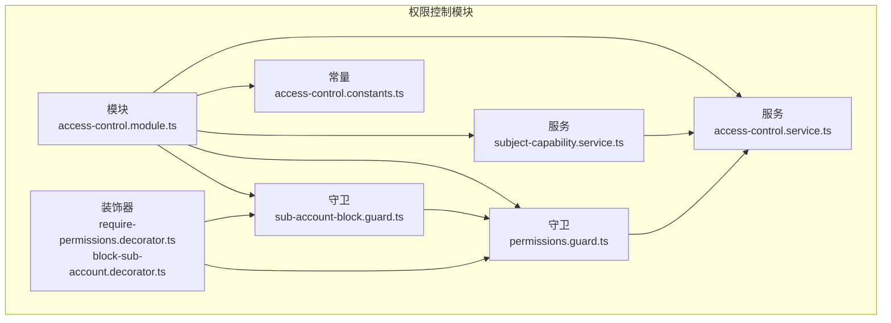
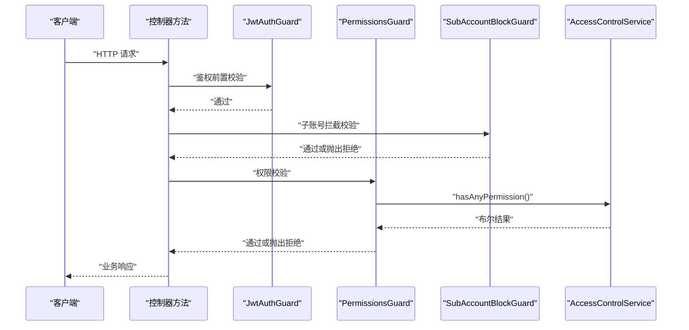
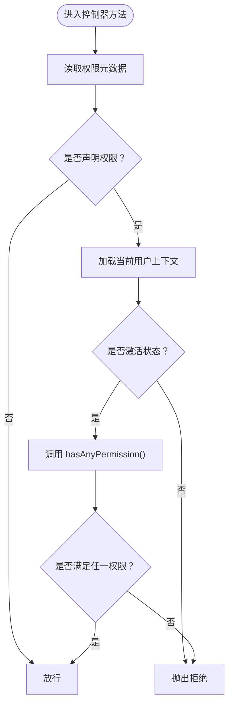
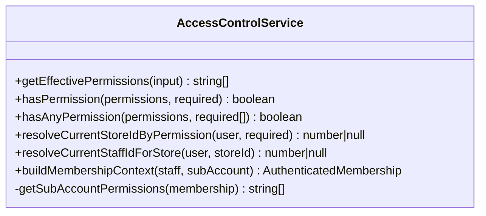
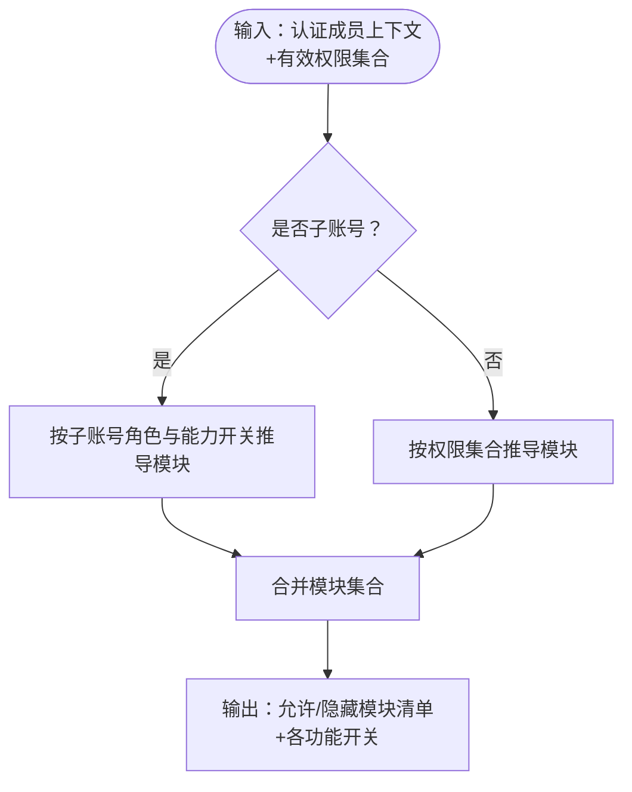
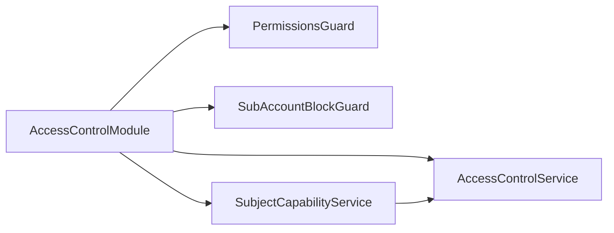

# 权限集成

<cite>
**本文引用的文件**
- [src/purely-profit/access-control/access-control.module.ts](file://src/purely-profit/access-control/access-control.module.ts)
- [src/purely-profit/access-control/access-control.service.ts](file://src/purely-profit/access-control/access-control.service.ts)
- [src/purely-profit/access-control/subject-capability.service.ts](file://src/purely-profit/access-control/subject-capability.service.ts)
- [src/purely-profit/access-control/access-control.constants.ts](file://src/purely-profit/access-control/access-control.constants.ts)
- [src/purely-profit/access-control/decorators/require-permissions.decorator.ts](file://src/purely-profit/access-control/decorators/require-permissions.decorator.ts)
- [src/purely-profit/access-control/decorators/block-sub-account.decorator.ts](file://src/purely-profit/access-control/decorators/block-sub-account.decorator.ts)
- [src/purely-profit/access-control/guards/permissions.guard.ts](file://src/purely-profit/access-control/guards/permissions.guard.ts)
- [src/purely-profit/access-control/guards/sub-account-block.guard.ts](file://src/purely-profit/access-control/guards/sub-account-block.guard.ts)
- [src/purely-profit/stores/stores.controller.ts](file://src/purely-profit/stores/stores.controller.ts)
- [src/purely-profit/finance/finance.controller.ts](file://src/purely-profit/finance/finance.controller.ts)
- [src/purely-profit/goods/categories/categories.controller.ts](file://src/purely-profit/goods/categories/categories.controller.ts)
</cite>

## 目录
1. [简介](#简介)
2. [项目结构](#项目结构)
3. [核心组件](#核心组件)
4. [架构总览](#架构总览)
5. [详细组件分析](#详细组件分析)
6. [依赖分析](#依赖分析)
7. [性能考虑](#性能考虑)
8. [故障排查指南](#故障排查指南)
9. [结论](#结论)
10. [附录](#附录)

## 简介
本指南面向在新模块中集成权限控制系统的需求，系统性讲解如何使用权限装饰器、守卫配置、权限验证实现，以及访问控制服务的调用方式。文档还解释权限级别与继承关系、子账号权限控制策略、角色权限管理最佳实践，并提供针对不同业务操作的权限设置范式与常见问题解决方案。

## 项目结构
权限控制模块位于 purely-profit/access-control 目录，采用“装饰器 + 守卫 + 服务”的分层设计：
- 装饰器：用于声明接口所需的权限集合与子账号禁入策略
- 守卫：在请求进入控制器前执行权限校验与子账号拦截
- 服务：负责计算有效权限、解析当前门店 ID、构建能力快照等

图表来源
- [src/purely-profit/access-control/access-control.module.ts:1-23](file://src/purely-profit/access-control/access-control.module.ts#L1-L23)
- [src/purely-profit/access-control/decorators/require-permissions.decorator.ts:1-8](file://src/purely-profit/access-control/decorators/require-permissions.decorator.ts#L1-L8)
- [src/purely-profit/access-control/decorators/block-sub-account.decorator.ts:1-17](file://src/purely-profit/access-control/decorators/block-sub-account.decorator.ts#L1-L17)
- [src/purely-profit/access-control/guards/permissions.guard.ts:1-55](file://src/purely-profit/access-control/guards/permissions.guard.ts#L1-L55)
- [src/purely-profit/access-control/guards/sub-account-block.guard.ts:1-48](file://src/purely-profit/access-control/guards/sub-account-block.guard.ts#L1-L48)
- [src/purely-profit/access-control/access-control.service.ts:1-243](file://src/purely-profit/access-control/access-control.service.ts#L1-L243)
- [src/purely-profit/access-control/subject-capability.service.ts:1-211](file://src/purely-profit/access-control/subject-capability.service.ts#L1-L211)
- [src/purely-profit/access-control/access-control.constants.ts:1-161](file://src/purely-profit/access-control/access-control.constants.ts#L1-L161)

章节来源
- [src/purely-profit/access-control/access-control.module.ts:1-23](file://src/purely-profit/access-control/access-control.module.ts#L1-L23)

## 核心组件
- 权限常量与默认角色权限
  - 权限码集合与通配符定义
  - 默认角色权限映射（所有者、店长、员工）
- 访问控制服务
  - 计算有效权限（含子账号）
  - 权限匹配（单个/任一）
  - 当前门店 ID 解析
  - 员工/子账号上下文构建
- 主体能力服务
  - 构建“首页模块可用性”快照
  - 按角色与权限推导可访问模块集合
- 装饰器
  - RequirePermissions：声明接口所需权限
  - BlockSubAccount：声明接口禁止子账号访问
- 守卫
  - PermissionsGuard：基于反射读取权限元数据并校验
  - SubAccountBlockGuard：拦截子账号访问特定接口

章节来源
- [src/purely-profit/access-control/access-control.constants.ts:1-161](file://src/purely-profit/access-control/access-control.constants.ts#L1-L161)
- [src/purely-profit/access-control/access-control.service.ts:122-243](file://src/purely-profit/access-control/access-control.service.ts#L122-L243)
- [src/purely-profit/access-control/subject-capability.service.ts:63-211](file://src/purely-profit/access-control/subject-capability.service.ts#L63-L211)
- [src/purely-profit/access-control/decorators/require-permissions.decorator.ts:1-8](file://src/purely-profit/access-control/decorators/require-permissions.decorator.ts#L1-L8)
- [src/purely-profit/access-control/decorators/block-sub-account.decorator.ts:1-17](file://src/purely-profit/access-control/decorators/block-sub-account.decorator.ts#L1-L17)
- [src/purely-profit/access-control/guards/permissions.guard.ts:12-55](file://src/purely-profit/access-control/guards/permissions.guard.ts#L12-L55)
- [src/purely-profit/access-control/guards/sub-account-block.guard.ts:13-48](file://src/purely-profit/access-control/guards/sub-account-block.guard.ts#L13-L48)

## 架构总览
权限控制在 NestJS 中通过全局模块注册守卫与服务，控制器通过装饰器声明权限与子账号限制，守卫在运行期进行校验。

图表来源
- [src/purely-profit/access-control/guards/permissions.guard.ts:19-53](file://src/purely-profit/access-control/guards/permissions.guard.ts#L19-L53)
- [src/purely-profit/access-control/guards/sub-account-block.guard.ts:17-46](file://src/purely-profit/access-control/guards/sub-account-block.guard.ts#L17-L46)
- [src/purely-profit/access-control/access-control.service.ts:135-152](file://src/purely-profit/access-control/access-control.service.ts#L135-L152)

## 详细组件分析

### 组件A：权限装饰器与守卫
- 装饰器 RequirePermissions
  - 作用：为控制器方法或类设置所需权限集合
  - 使用：在控制器方法上标注，支持多个权限码
- 装饰器 BlockSubAccount
  - 作用：标记接口禁止子账号访问；可选自定义提示消息
- 守卫 PermissionsGuard
  - 从反射读取权限元数据
  - 从请求用户上下文中读取当前成员会话
  - 调用 AccessControlService.hasAnyPermission 进行校验
- 守卫 SubAccountBlockGuard
  - 从反射读取子账号拦截元数据
  - 若当前身份为子账号则直接拒绝

图表来源
- [src/purely-profit/access-control/guards/permissions.guard.ts:19-53](file://src/purely-profit/access-control/guards/permissions.guard.ts#L19-L53)
- [src/purely-profit/access-control/access-control.service.ts:135-152](file://src/purely-profit/access-control/access-control.service.ts#L135-L152)

章节来源
- [src/purely-profit/access-control/decorators/require-permissions.decorator.ts:1-8](file://src/purely-profit/access-control/decorators/require-permissions.decorator.ts#L1-L8)
- [src/purely-profit/access-control/decorators/block-sub-account.decorator.ts:1-17](file://src/purely-profit/access-control/decorators/block-sub-account.decorator.ts#L1-L17)
- [src/purely-profit/access-control/guards/permissions.guard.ts:12-55](file://src/purely-profit/access-control/guards/permissions.guard.ts#L12-L55)
- [src/purely-profit/access-control/guards/sub-account-block.guard.ts:13-48](file://src/purely-profit/access-control/guards/sub-account-block.guard.ts#L13-L48)

### 组件B：访问控制服务（AccessControlService）
- 有效权限计算
  - 对于子账号：根据角色与状态过滤，支持“交接班”能力开关
  - 对于员工：合并默认角色权限与自定义权限，去重
- 权限匹配
  - 支持通配符与精确匹配
  - 支持任一权限满足
- 上下文构建
  - 将员工与子账号信息整合为统一的认证成员上下文
- 当前门店 ID 解析
  - 在具备权限的前提下，返回当前绑定门店 ID

图表来源
- [src/purely-profit/access-control/access-control.service.ts:122-243](file://src/purely-profit/access-control/access-control.service.ts#L122-L243)

章节来源
- [src/purely-profit/access-control/access-control.service.ts:122-243](file://src/purely-profit/access-control/access-control.service.ts#L122-L243)

### 组件C：主体能力服务（SubjectCapabilityService）
- 能力快照构建
  - 基于有效权限与身份类型，推导首页模块可用性
  - 支持子账号角色差异与“交接班”能力开关
- 模块可用性规则
  - 报表查看 → 商业分析
  - 财务/报表查看 → 财务中心
  - 多类查看权限 → 商品管理
  - 交接班查看 → 交接班管理
  - 营销查看 → 营销中心
  - 会员/合伙人查看 → 会员中心
  - 空间查看/增删改 → 空间管理
  - 员工查看 → 员工管理
  - 门店查看/更新 → 门店设置（子账号不开放）

图表来源
- [src/purely-profit/access-control/subject-capability.service.ts:67-167](file://src/purely-profit/access-control/subject-capability.service.ts#L67-L167)

章节来源
- [src/purely-profit/access-control/subject-capability.service.ts:63-211](file://src/purely-profit/access-control/subject-capability.service.ts#L63-L211)

### 组件D：权限常量与默认角色权限
- 权限码集合
  - 包含门店、员工、会员、营销、财务、成本、商品、供应商、采购、运营分录、销售、库存、空间、交接班等维度
- 默认角色权限
  - 所有者：通配符
  - 店长：较全面的日常管理权限
  - 员工：基础查看与部分操作权限
- 子账号角色权限
  - 收银员、店长、财务三类角色，分别预置权限集

章节来源
- [src/purely-profit/access-control/access-control.constants.ts:5-161](file://src/purely-profit/access-control/access-control.constants.ts#L5-L161)

### 组件E：控制器集成示例
- 通用模式
  - 控制器类级启用 JwtAuthGuard、PermissionsGuard、SubAccountBlockGuard
  - 方法级使用 RequirePermissions 声明所需权限
  - 需要子账号禁入的模块使用 BlockSubAccount
- 示例：门店模块
  - 类级启用子账号拦截
  - 获取当前门店/更新当前门店使用 store:view
  - 更新当前门店使用 store:update
- 示例：财务模块
  - 获取财务总览、报表、流水、账款等均使用 finance:view 或 report:view
- 示例：商品分类模块
  - 列表使用 goods:view
  - 新增使用 goods:create
  - 更新使用 goods:update
  - 删除使用 goods:delete

章节来源
- [src/purely-profit/stores/stores.controller.ts:20-81](file://src/purely-profit/stores/stores.controller.ts#L20-L81)
- [src/purely-profit/finance/finance.controller.ts:50-200](file://src/purely-profit/finance/finance.controller.ts#L50-L200)
- [src/purely-profit/goods/categories/categories.controller.ts:23-76](file://src/purely-profit/goods/categories/categories.controller.ts#L23-L76)

## 依赖分析
- 模块注册
  - AccessControlModule 全局导出守卫与服务，供各模块按需注入
- 控制器依赖
  - 控制器通过装饰器声明依赖守卫
  - 服务之间存在调用关系：SubjectCapabilityService 依赖 AccessControlService
- 反射与元数据
  - 守卫通过 Reflector 读取装饰器设置的权限与拦截标志

图表来源
- [src/purely-profit/access-control/access-control.module.ts:7-22](file://src/purely-profit/access-control/access-control.module.ts#L7-L22)

章节来源
- [src/purely-profit/access-control/access-control.module.ts:1-23](file://src/purely-profit/access-control/access-control.module.ts#L1-L23)

## 性能考虑
- 权限匹配复杂度
  - hasAnyPermission 为 O(n) 检索，n 为所需权限数量；建议在装饰器处尽量精简所需权限集合
- 有效权限缓存
  - 可在用户上下文构建阶段缓存有效权限，避免重复计算
- 能力快照复用
  - SubjectCapabilitySnapshot 可作为前端导航与功能开关的依据，减少重复权限判断
- 子账号权限过滤
  - 子账号权限在服务端一次性过滤，避免在多处重复判断

## 故障排查指南
- 403 拒绝：当前账号暂无门店权限
  - 触发场景：用户上下文不存在或未激活
  - 排查要点：确认登录态、当前成员会话状态
- 403 拒绝：当前账号缺少接口访问权限
  - 触发场景：未满足任一所需权限
  - 排查要点：核对装饰器声明的权限集合、用户实际权限（含默认角色与自定义权限）
- 子账号访问被拒
  - 触发场景：接口声明 BlockSubAccount 且当前身份为子账号
  - 排查要点：确认接口是否应开放给子账号；如需开放，移除 BlockSubAccount 或调整角色权限
- 门店设置不可见或不可用
  - 触发场景：子账号无法访问门店设置
  - 排查要点：该接口已通过 BlockSubAccount 明确限制子账号访问

章节来源
- [src/purely-profit/access-control/guards/permissions.guard.ts:39-50](file://src/purely-profit/access-control/guards/permissions.guard.ts#L39-L50)
- [src/purely-profit/access-control/guards/sub-account-block.guard.ts:41-43](file://src/purely-profit/access-control/guards/sub-account-block.guard.ts#L41-L43)

## 结论
通过装饰器声明权限、守卫集中校验、服务统一计算与快照构建，系统实现了清晰、可维护、可扩展的权限控制体系。新模块接入时，遵循“类级启用守卫 + 方法级声明权限 + 必要时启用子账号拦截”的模式，即可快速完成权限集成。

## 附录

### 新模块接入步骤
- 注册模块
  - 在应用模块中导入 AccessControlModule（或确保其被全局注册）
- 控制器层
  - 在控制器类上启用 JwtAuthGuard、PermissionsGuard、SubAccountBlockGuard
  - 在需要的控制器方法上使用 RequirePermissions 声明所需权限
  - 对仅主账号使用的接口使用 BlockSubAccount
- 服务层
  - 如需根据权限推导功能可用性，注入 SubjectCapabilityService 并调用 buildSnapshot
  - 如需解析当前门店 ID，使用 AccessControlService.resolveCurrentStoreIdByPermission

章节来源
- [src/purely-profit/access-control/access-control.module.ts:7-22](file://src/purely-profit/access-control/access-control.module.ts#L7-L22)
- [src/purely-profit/stores/stores.controller.ts:20-81](file://src/purely-profit/stores/stores.controller.ts#L20-L81)

### 权限级别与继承关系
- 默认角色权限
  - OWNER：通配符，拥有全部权限
  - MANAGER：日常管理权限集合
  - STAFF：基础查看与部分操作权限
- 子账号角色权限
  - cashier、finance、manager 三类角色，分别预置权限集
  - 可通过 canUseHandover 开关控制交接班相关权限
- 继承与覆盖
  - 自定义权限可叠加默认角色权限
  - 子账号权限由角色权限与状态共同决定

章节来源
- [src/purely-profit/access-control/access-control.constants.ts:101-161](file://src/purely-profit/access-control/access-control.constants.ts#L101-L161)
- [src/purely-profit/access-control/access-control.service.ts:113-120](file://src/purely-profit/access-control/access-control.service.ts#L113-L120)
- [src/purely-profit/access-control/access-control.service.ts:220-241](file://src/purely-profit/access-control/access-control.service.ts#L220-L241)

### 业务操作权限设置范式
- 门店
  - 获取/当前：store:view
  - 更新/当前：store:update
- 财务
  - 总览/报表/流水/账款：finance:view 或 report:view
- 商品分类
  - 列表：goods:view
  - 新增：goods:create
  - 更新：goods:update
  - 删除：goods:delete

章节来源
- [src/purely-profit/stores/stores.controller.ts:41-79](file://src/purely-profit/stores/stores.controller.ts#L41-L79)
- [src/purely-profit/finance/finance.controller.ts:57-200](file://src/purely-profit/finance/finance.controller.ts#L57-L200)
- [src/purely-profit/goods/categories/categories.controller.ts:30-74](file://src/purely-profit/goods/categories/categories.controller.ts#L30-L74)

### 子账号权限控制与最佳实践
- 子账号禁入
  - 对仅主账号使用的敏感接口（如门店设置）使用 BlockSubAccount
- 权限最小化
  - 为子账号角色分配最小必要权限，按需开启 canUseHandover
- 能力快照
  - 使用 SubjectCapabilityService 生成前端导航与功能开关，避免重复权限判断
- 错误提示
  - BlockSubAccount 支持传入自定义提示消息，提升用户体验

章节来源
- [src/purely-profit/access-control/decorators/block-sub-account.decorator.ts:10-16](file://src/purely-profit/access-control/decorators/block-sub-account.decorator.ts#L10-L16)
- [src/purely-profit/access-control/guards/sub-account-block.guard.ts:17-46](file://src/purely-profit/access-control/guards/sub-account-block.guard.ts#L17-L46)
- [src/purely-profit/access-control/subject-capability.service.ts:67-97](file://src/purely-profit/access-control/subject-capability.service.ts#L67-L97)