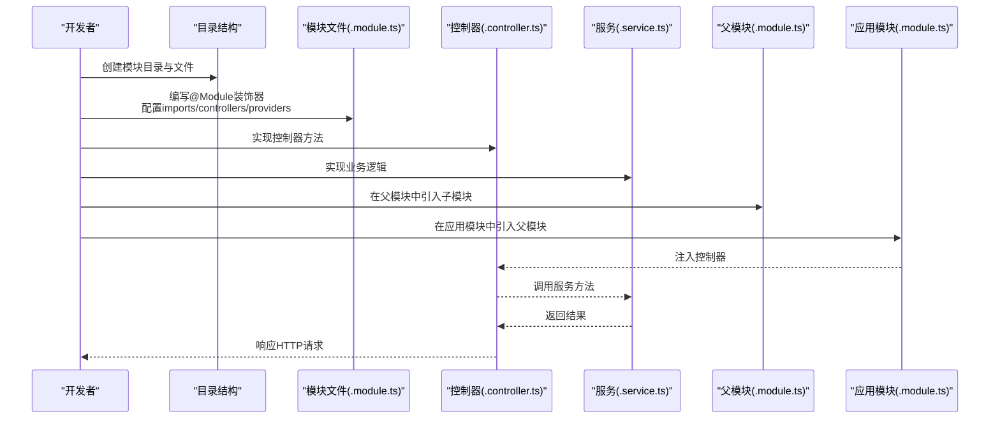
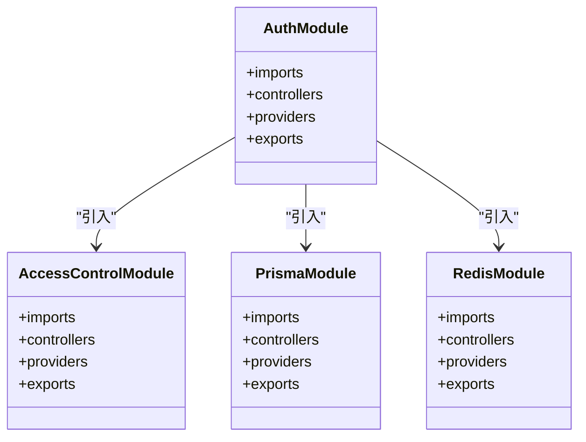
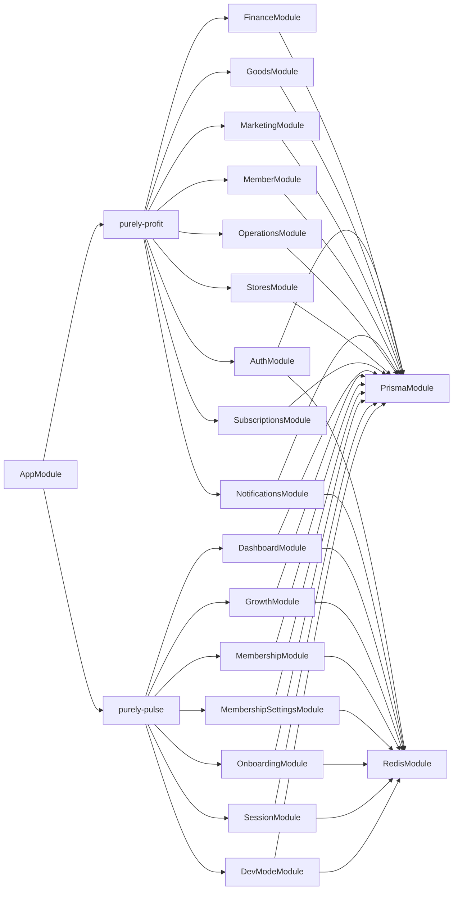

# 模块创建流程

<cite>
**本文引用的文件**
- [app.module.ts](file://src/app.module.ts)
- [access-control.module.ts](file://src/purely-profit/access-control/access-control.module.ts)
- [auth.module.ts](file://src/purely-profit/auth/auth.module.ts)
- [commerce.module.ts](file://src/purely-profit/commerce/commerce.module.ts)
- [finance.module.ts](file://src/purely-profit/finance/finance.module.ts)
- [marketing.module.ts](file://src/purely-profit/marketing/marketing.module.ts)
- [members.module.ts](file://src/purely-profit/member/members/members.module.ts)
- [platform-membership.module.ts](file://src/purely-profit/member/platform-membership/platform-membership.module.ts)
- [notifications.module.ts](file://src/purely-profit/notifications/notifications.module.ts)
- [redis.module.ts](file://src/redis/redis.module.ts)
- [prisma.module.ts](file://src/prisma/prisma.module.ts)
- [dashboard-home.module.ts](file://src/purely-profit/dashboard/dashboard-home/dashboard-home.module.ts)
- [business-analysis.module.ts](file://src/purely-profit/dashboard/business-analysis/business-analysis.module.ts)
- [profit-detail.module.ts](file://src/purely-profit/dashboard/profit-detail/profit-detail.module.ts)
- [categories.module.ts](file://src/purely-profit/goods/categories/categories.module.ts)
- [inventory.module.ts](file://src/purely-profit/goods/inventory/inventory.module.ts)
- [products.module.ts](file://src/purely-profit/goods/products/products.module.ts)
- [costs.module.ts](file://src/purely-profit/operations/costs/costs.module.ts)
- [handover.module.ts](file://src/purely-profit/operations/handover/handover.module.ts)
- [purchases.module.ts](file://src/purely-profit/operations/purchases/purchases.module.ts)
- [stores.module.ts](file://src/purely-profit/stores/stores.module.ts)
- [subscriptions.module.ts](file://src/purely-profit/subscriptions/subscriptions.module.ts)
- [pulse-store-context.module.ts](file://src/purely-pulse/pulse-store-context.module.ts)
- [dashboard.module.ts](file://src/purely-pulse/dashboard/dashboard.module.ts)
- [growth.module.ts](file://src/purely-pulse/growth/growth.module.ts)
- [membership.module.ts](file://src/purely-pulse/membership/membership.module.ts)
- [membership-settings.module.ts](file://src/purely-pulse/membership-settings/membership-settings.module.ts)
- [onboarding.module.ts](file://src/purely-pulse/onboarding/onboarding.module.ts)
- [session.module.ts](file://src/purely-pulse/session/session.module.ts)
- [dev-mode.module.ts](file://src/purely-pulse/dev-mode/pulse-dev-mode.module.ts)
</cite>

## 目录
1. [简介](#简介)
2. [项目结构](#项目结构)
3. [核心组件](#核心组件)
4. [架构总览](#架构总览)
5. [详细组件分析](#详细组件分析)
6. [依赖关系分析](#依赖关系分析)
7. [性能考虑](#性能考虑)
8. [故障排除指南](#故障排除指南)
9. [结论](#结论)
10. [附录](#附录)

## 简介
本文件面向从零开始在 NestJS 项目中创建新模块的开发者，系统性讲解模块创建的完整流程：从目录结构规划、模块文件生成到基础配置；详解 @Module 装饰器的关键配置项（imports、controllers、providers、exports）；给出最小化模块的创建步骤与导入导出配置；总结模块命名规范、文件组织原则与最佳实践。为便于理解，本文以仓库中现有模块为范例进行分析与归纳。

## 项目结构
该项目采用按业务域分层的模块组织方式，顶层模块负责聚合子模块，子模块再细分为功能子模块（如 goods、marketing、member 等）。每个业务域通常包含：
- 一个领域根模块（例如 goods.module.ts、marketing.module.ts）
- 多个功能子模块（如 categories.module.ts、inventory.module.ts、products.module.ts）
- 对应的控制器、服务、查询对象、映射器等

下图展示了顶层模块与主要业务域模块的关系：

```mermaid
graph TB
AppModule["AppModule<br/>src/app.module.ts"]
PP["purely-profit 子系统"]
PP_Pulse["purely-pulse 子系统"]
PP --> AC["AccessControlModule<br/>access-control.module.ts"]
PP --> Auth["AuthModule<br/>auth.module.ts"]
PP --> Comm["CommerceModule<br/>commerce.module.ts"]
PP --> Fin["FinanceModule<br/>finance.module.ts"]
PP --> Goods["GoodsModule<br/>goods.module.ts"]
PP --> Marketing["MarketingModule<br/>marketing.module.ts"]
PP --> Member["MemberModule<br/>member.module.ts"]
PP --> Noti["NotificationsModule<br/>notifications.module.ts"]
PP --> Ops["OperationsModule<br/>operations.module.ts"]
PP --> Stores["StoresModule<br/>stores.module.ts"]
PP --> Subs["SubscriptionsModule<br/>subscriptions.module.ts"]
PP_Pulse --> Dash["DashboardModule<br/>dashboard.module.ts"]
PP_Pulse --> Growth["GrowthModule<br/>growth.module.ts"]
PP_Pulse --> Mem["MembershipModule<br/>membership.module.ts"]
PP_Pulse --> MemSet["MembershipSettingsModule<br/>membership-settings.module.ts"]
PP_Pulse --> Onboard["OnboardingModule<br/>onboarding.module.ts"]
PP_Pulse --> Session["SessionModule<br/>session.module.ts"]
PP_Pulse --> DevMode["DevModeModule<br/>dev-mode.module.ts"]
AppModule --> PP
AppModule --> PP_Pulse
```

图表来源
- [app.module.ts](file://src/app.module.ts)
- [access-control.module.ts](file://src/purely-profit/access-control/access-control.module.ts)
- [auth.module.ts](file://src/purely-profit/auth/auth.module.ts)
- [commerce.module.ts](file://src/purely-profit/commerce/commerce.module.ts)
- [finance.module.ts](file://src/purely-profit/finance/finance.module.ts)
- [marketing.module.ts](file://src/purely-profit/marketing/marketing.module.ts)
- [members.module.ts](file://src/purely-profit/member/members/members.module.ts)
- [platform-membership.module.ts](file://src/purely-profit/member/platform-membership/platform-membership.module.ts)
- [notifications.module.ts](file://src/purely-profit/notifications/notifications.module.ts)
- [dashboard.module.ts](file://src/purely-pulse/dashboard/dashboard.module.ts)
- [growth.module.ts](file://src/purely-pulse/growth/growth.module.ts)
- [membership.module.ts](file://src/purely-pulse/membership/membership.module.ts)
- [membership-settings.module.ts](file://src/purely-pulse/membership-settings/membership-settings.module.ts)
- [onboarding.module.ts](file://src/purely-pulse/onboarding/onboarding.module.ts)
- [session.module.ts](file://src/purely-pulse/session/session.module.ts)
- [dev-mode.module.ts](file://src/purely-pulse/dev-mode/pulse-dev-mode.module.ts)

章节来源
- [app.module.ts](file://src/app.module.ts)

## 核心组件
本节聚焦模块创建的核心要素：@Module 装饰器的配置项与职责边界划分。通过分析现有模块，可以总结出以下通用模式：
- imports：引入其他模块或提供全局服务（如数据库、缓存、认证等）
- controllers：暴露 HTTP 接口
- providers：实现业务逻辑与数据访问
- exports：向其他模块导出可复用的服务或模块

下面以几个代表性模块为例，说明其 @Module 配置的侧重点与分工：

- 认证模块（auth.module.ts）：通常包含认证控制器与认证相关服务，可能引入访问控制模块与 Prisma 模块
- 商品模块（goods.module.ts）：作为上层聚合模块，导入 categories、inventory、products 等子模块
- 财务模块（finance.module.ts）：包含财务相关的控制器与服务，可能引入 Prisma 模块
- 通知模块（notifications.module.ts）：提供通知相关的控制器与服务
- Redis 模块（redis.module.ts）：提供缓存能力，供其他模块使用
- Prisma 模块（prisma.module.ts）：提供数据库连接与服务，供业务模块使用

章节来源
- [auth.module.ts](file://src/purely-profit/auth/auth.module.ts)
- [commerce.module.ts](file://src/purely-profit/commerce/commerce.module.ts)
- [finance.module.ts](file://src/purely-profit/finance/finance.module.ts)
- [marketing.module.ts](file://src/purely-profit/marketing/marketing.module.ts)
- [members.module.ts](file://src/purely-profit/member/members/members.module.ts)
- [platform-membership.module.ts](file://src/purely-profit/member/platform-membership/platform-membership.module.ts)
- [notifications.module.ts](file://src/purely-profit/notifications/notifications.module.ts)
- [redis.module.ts](file://src/redis/redis.module.ts)
- [prisma.module.ts](file://src/prisma/prisma.module.ts)

## 架构总览
下图展示了模块间的依赖关系与交互路径，帮助理解模块创建时的导入顺序与职责边界：

```mermaid
graph TB
subgraph "应用层"
AM["AppModule"]
end
subgraph "纯利润(purely-profit)"
AUTH["AuthModule"]
AC["AccessControlModule"]
FIN["FinanceModule"]
GOODS["GoodsModule"]
MARK["MarketingModule"]
MEMBER["MemberModule"]
NOTI["NotificationsModule"]
OPS["OperationsModule"]
STORES["StoresModule"]
SUBS["SubscriptionsModule"]
end
subgraph "纯脉(purely-pulse)"
DASH["DashboardModule"]
GROWTH["GrowthModule"]
MEM["MembershipModule"]
MSE["MembershipSettingsModule"]
ONB["OnboardingModule"]
SESS["SessionModule"]
DEV["DevModeModule"]
end
subgraph "基础设施"
PRISMA["PrismaModule"]
REDIS["RedisModule"]
end
AM --> AUTH
AM --> AC
AM --> FIN
AM --> GOODS
AM --> MARK
AM --> MEMBER
AM --> NOTI
AM --> OPS
AM --> STORES
AM --> SUBS
AM --> DASH
AM --> GROWTH
AM --> MEM
AM --> MSE
AM --> ONB
AM --> SESS
AM --> DEV
AUTH --> AC
AUTH --> PRISMA
FIN --> PRISMA
MEMBER --> PRISMA
NOTI --> PRISMA
OPS --> PRISMA
STORES --> PRISMA
SUBS --> PRISMA
DASH --> PRISMA
GROWTH --> PRISMA
MEM --> PRISMA
MSE --> PRISMA
ONB --> PRISMA
SESS --> PRISMA
DEV --> PRISMA
AUTH --> REDIS
NOTI --> REDIS
DASH --> REDIS
GROWTH --> REDIS
MEM --> REDIS
MSE --> REDIS
ONB --> REDIS
SESS --> REDIS
DEV --> REDIS
```

图表来源
- [app.module.ts](file://src/app.module.ts)
- [auth.module.ts](file://src/purely-profit/auth/auth.module.ts)
- [access-control.module.ts](file://src/purely-profit/access-control/access-control.module.ts)
- [finance.module.ts](file://src/purely-profit/finance/finance.module.ts)
- [marketing.module.ts](file://src/purely-profit/marketing/marketing.module.ts)
- [members.module.ts](file://src/purely-profit/member/members/members.module.ts)
- [platform-membership.module.ts](file://src/purely-profit/member/platform-membership/platform-membership.module.ts)
- [notifications.module.ts](file://src/purely-profit/notifications/notifications.module.ts)
- [goods.module.ts](file://src/purely-profit/goods/categories/categories.module.ts)
- [categories.module.ts](file://src/purely-profit/goods/categories/categories.module.ts)
- [inventory.module.ts](file://src/purely-profit/goods/inventory/inventory.module.ts)
- [products.module.ts](file://src/purely-profit/goods/products/products.module.ts)
- [costs.module.ts](file://src/purely-profit/operations/costs/costs.module.ts)
- [handover.module.ts](file://src/purely-profit/operations/handover/handover.module.ts)
- [purchases.module.ts](file://src/purely-profit/operations/purchases/purchases.module.ts)
- [stores.module.ts](file://src/purely-profit/stores/stores.module.ts)
- [subscriptions.module.ts](file://src/purely-profit/subscriptions/subscriptions.module.ts)
- [dashboard.module.ts](file://src/purely-pulse/dashboard/dashboard.module.ts)
- [growth.module.ts](file://src/purely-pulse/growth/growth.module.ts)
- [membership.module.ts](file://src/purely-pulse/membership/membership.module.ts)
- [membership-settings.module.ts](file://src/purely-pulse/membership-settings/membership-settings.module.ts)
- [onboarding.module.ts](file://src/purely-pulse/onboarding/onboarding.module.ts)
- [session.module.ts](file://src/purely-pulse/session/session.module.ts)
- [dev-mode.module.ts](file://src/purely-pulse/dev-mode/pulse-dev-mode.module.ts)
- [prisma.module.ts](file://src/prisma/prisma.module.ts)
- [redis.module.ts](file://src/redis/redis.module.ts)

## 详细组件分析

### 最小化模块创建步骤
以下流程适用于创建一个“最小化模块”，即仅包含模块文件与一个控制器/服务的基本骨架。该流程可直接迁移至新模块创建中。

- 步骤一：创建目录与文件
  - 在目标业务域下新建模块目录（例如 goods/products），并在其中创建模块文件（products.module.ts）
  - 同步创建控制器文件（products.controller.ts）与服务文件（products.service.ts）

- 步骤二：编写模块文件
  - 使用 @Module 装饰器声明模块
  - 在 imports 中引入需要的依赖模块（如 PrismaModule、RedisModule）
  - 在 controllers 中注册控制器
  - 在 providers 中注册服务
  - 如需对外提供能力，可在 exports 中导出服务或模块

- 步骤三：在父模块中聚合
  - 在上层聚合模块（如 goods.module.ts）中引入新建的子模块

- 步骤四：在应用模块中启用
  - 在应用入口模块（app.module.ts）中引入上层聚合模块

- 步骤五：验证与测试
  - 启动应用，访问控制器端点进行验证
  - 编写单元/集成测试覆盖关键逻辑

为便于对照，以下序列图展示了最小化模块从创建到可用的关键调用链：

图表来源
- [products.module.ts](file://src/purely-profit/goods/products/products.module.ts)
- [products.controller.ts](file://src/purely-profit/goods/products/products.controller.ts)
- [products.service.ts](file://src/purely-profit/goods/products/products.service.ts)
- [goods.module.ts](file://src/purely-profit/goods/goods.module.ts)
- [app.module.ts](file://src/app.module.ts)

章节来源
- [goods.module.ts](file://src/purely-profit/goods/goods.module.ts)
- [products.module.ts](file://src/purely-profit/goods/products/products.module.ts)

### 模块文件标准模板与配置要点
基于现有模块的实现，可抽象出模块文件的标准模板与配置要点：
- imports
  - 引入基础设施模块（如 PrismaModule、RedisModule）
  - 引入业务相关模块（如 AccessControlModule、AuthModule）
- controllers
  - 仅注册对外暴露的控制器
  - 控制器应尽量薄，将复杂逻辑下沉到服务
- providers
  - 注册领域服务与数据访问类
  - 将工具类、映射器、查询构建器等放入 providers
- exports
  - 仅导出需要被其他模块复用的能力
  - 避免过度导出导致模块耦合度上升

下图以认证模块为例，展示模块文件的典型结构与依赖关系：

图表来源
- [auth.module.ts](file://src/purely-profit/auth/auth.module.ts)
- [access-control.module.ts](file://src/purely-profit/access-control/access-control.module.ts)
- [prisma.module.ts](file://src/prisma/prisma.module.ts)
- [redis.module.ts](file://src/redis/redis.module.ts)

章节来源
- [auth.module.ts](file://src/purely-profit/auth/auth.module.ts)
- [access-control.module.ts](file://src/purely-profit/access-control/access-control.module.ts)
- [prisma.module.ts](file://src/prisma/prisma.module.ts)
- [redis.module.ts](file://src/redis/redis.module.ts)

### 典型模块类型与职责边界
- 聚合模块（如 goods.module.ts、marketing.module.ts）
  - 职责：整合子模块，统一对外接口
  - 配置：imports 中引入各子模块；controllers 中可暴露聚合控制器；providers 中可放置跨子模块共享的工具
- 功能模块（如 categories.module.ts、inventory.module.ts、products.module.ts）
  - 职责：实现具体业务能力
  - 配置：imports 中引入基础设施模块；controllers 中注册功能控制器；providers 中注册领域服务
- 基础设施模块（如 prisma.module.ts、redis.module.ts）
  - 职责：提供通用能力（数据库、缓存）
  - 配置：imports 中可引入第三方模块；providers 中注册服务；exports 中导出可复用能力

章节来源
- [goods.module.ts](file://src/purely-profit/goods/goods.module.ts)
- [categories.module.ts](file://src/purely-profit/goods/categories/categories.module.ts)
- [inventory.module.ts](file://src/purely-profit/goods/inventory/inventory.module.ts)
- [products.module.ts](file://src/purely-profit/goods/products/products.module.ts)
- [prisma.module.ts](file://src/prisma/prisma.module.ts)
- [redis.module.ts](file://src/redis/redis.module.ts)

### 导入导出配置最佳实践
- 仅在必要时导出模块或服务，避免“全量导出”
- 将跨模块共享的能力集中于聚合模块或基础设施模块
- 控制器尽量不导出，除非是跨模块复用的公共接口
- 通过模块间显式导入明确依赖关系，减少隐式耦合

章节来源
- [finance.module.ts](file://src/purely-profit/finance/finance.module.ts)
- [marketing.module.ts](file://src/purely-profit/marketing/marketing.module.ts)
- [notifications.module.ts](file://src/purely-profit/notifications/notifications.module.ts)

## 依赖关系分析
模块之间的依赖遵循“自顶向下”的聚合关系与“横向复用”的基础设施模式。下图展示了依赖关系的简化视图：

图表来源
- [app.module.ts](file://src/app.module.ts)
- [auth.module.ts](file://src/purely-profit/auth/auth.module.ts)
- [finance.module.ts](file://src/purely-profit/finance/finance.module.ts)
- [goods.module.ts](file://src/purely-profit/goods/goods.module.ts)
- [marketing.module.ts](file://src/purely-profit/marketing/marketing.module.ts)
- [members.module.ts](file://src/purely-profit/member/members/members.module.ts)
- [platform-membership.module.ts](file://src/purely-profit/member/platform-membership/platform-membership.module.ts)
- [notifications.module.ts](file://src/purely-profit/notifications/notifications.module.ts)
- [operations.module.ts](file://src/purely-profit/operations/operations.module.ts)
- [stores.module.ts](file://src/purely-profit/stores/stores.module.ts)
- [subscriptions.module.ts](file://src/purely-profit/subscriptions/subscriptions.module.ts)
- [dashboard.module.ts](file://src/purely-pulse/dashboard/dashboard.module.ts)
- [growth.module.ts](file://src/purely-pulse/growth/growth.module.ts)
- [membership.module.ts](file://src/purely-pulse/membership/membership.module.ts)
- [membership-settings.module.ts](file://src/purely-pulse/membership-settings/membership-settings.module.ts)
- [onboarding.module.ts](file://src/purely-pulse/onboarding/onboarding.module.ts)
- [session.module.ts](file://src/purely-pulse/session/session.module.ts)
- [dev-mode.module.ts](file://src/purely-pulse/dev-mode/pulse-dev-mode.module.ts)
- [prisma.module.ts](file://src/prisma/prisma.module.ts)
- [redis.module.ts](file://src/redis/redis.module.ts)

章节来源
- [app.module.ts](file://src/app.module.ts)
- [prisma.module.ts](file://src/prisma/prisma.module.ts)
- [redis.module.ts](file://src/redis/redis.module.ts)

## 性能考虑
- 模块拆分粒度
  - 过细的模块会增加注入成本与启动时间；过粗则降低内聚性与可测试性
  - 建议以“业务域”为单位进行模块划分，同时在域内按功能进一步细分
- 依赖深度
  - 控制模块间依赖层级，避免深层链路导致的循环依赖与加载延迟
- 提供者作用域
  - 将重型资源（如数据库连接、缓存客户端）置于单例作用域，避免重复初始化
- 懒加载策略
  - 对非核心模块采用惰性导入，缩短应用启动时间

## 故障排除指南
- 模块未生效
  - 检查是否已在父模块中引入子模块
  - 确认应用模块已引入父模块
- 注入失败
  - 检查 providers 是否正确注册
  - 确认 exports 是否导出了所需服务或模块
- 循环依赖
  - 通过引入接口或延迟注入解决循环依赖问题
- 控制器无法访问
  - 确认 controllers 列表中包含对应控制器
  - 检查路由前缀与路径是否正确

## 结论
模块创建的关键在于清晰的职责划分与合理的依赖管理。通过遵循“聚合模块 + 功能模块 + 基础设施模块”的三层结构，结合 imports/controllers/providers/exports 的合理配置，可以快速搭建可维护、可扩展的 NestJS 模块体系。建议在创建新模块时，先参考现有模块的实现模式，再根据具体业务场景进行调整与优化。

## 附录

### 模块命名规范与文件组织原则
- 命名规范
  - 模块文件使用 kebab-case（如 goods.module.ts）
  - 类名使用 PascalCase（如 GoodsModule）
- 文件组织
  - 每个功能模块包含 controller、service、mapper、query、dto 等文件
  - 聚合模块仅包含模块文件与必要的共享工具
- 最佳实践
  - 保持模块高内聚、低耦合
  - 明确导出范围，避免“全量导出”
  - 将跨模块共享的能力集中于基础设施模块