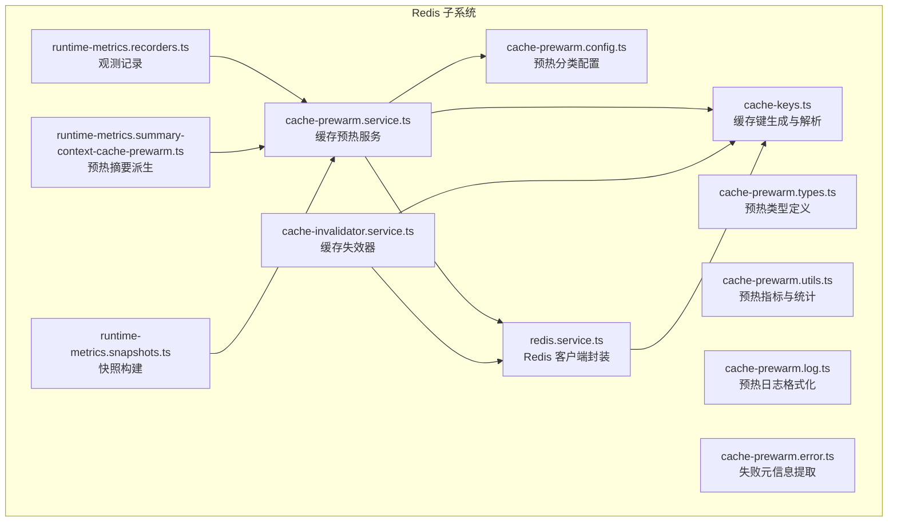
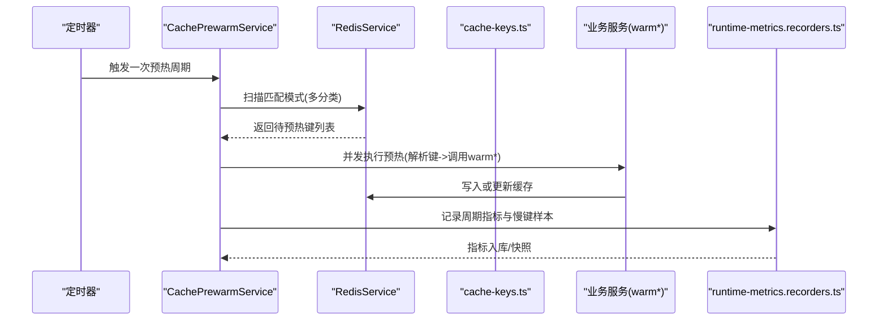
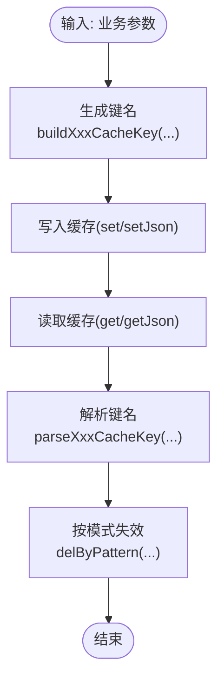
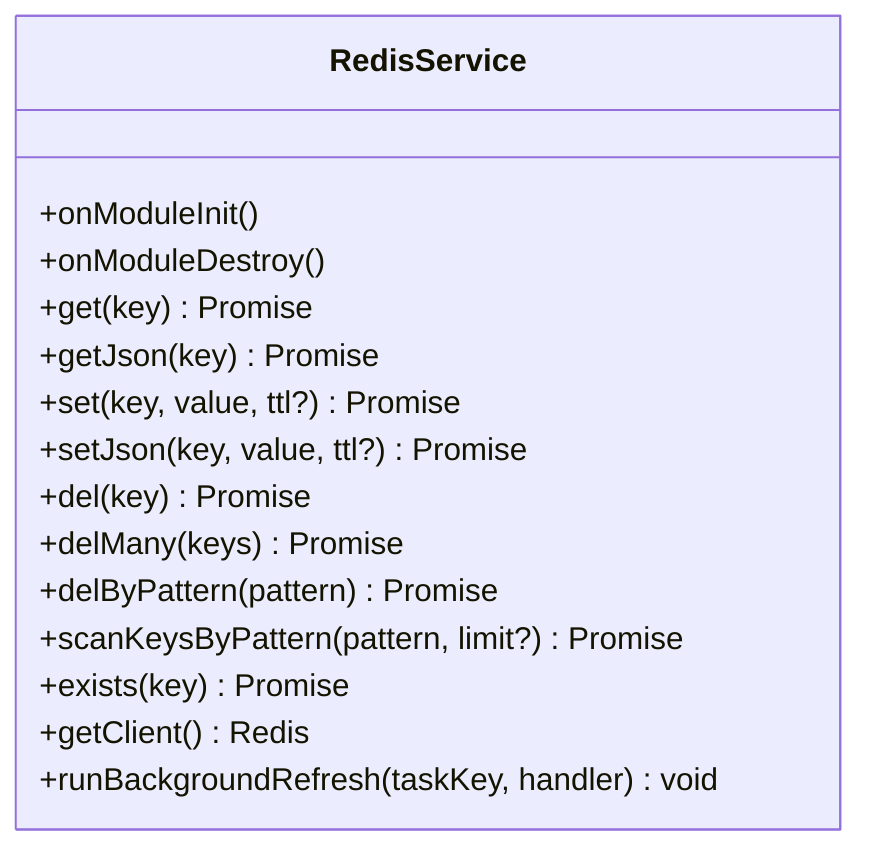
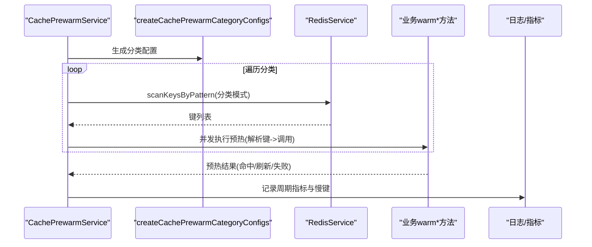
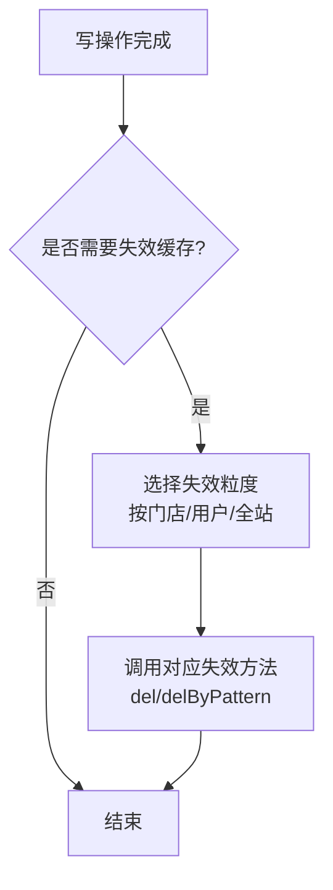
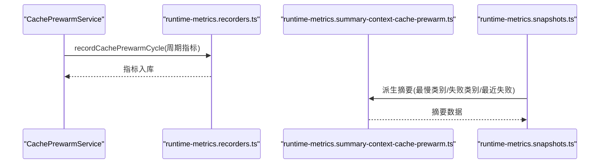
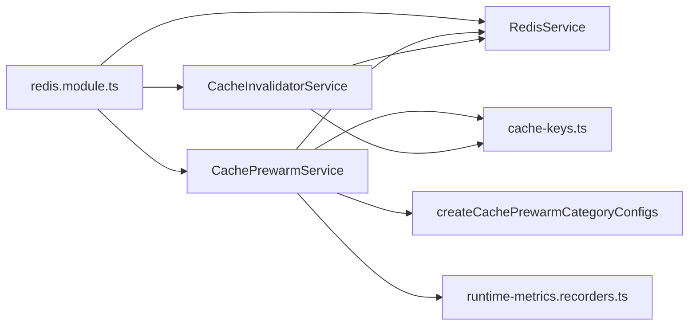

# 缓存策略实现

<cite>
**本文引用的文件**
- [src/redis/cache-keys.ts](file://src/redis/cache-keys.ts)
- [src/redis/cache-prewarm.service.ts](file://src/redis/cache-prewarm.service.ts)
- [src/redis/cache-invalidator.service.ts](file://src/redis/cache-invalidator.service.ts)
- [src/redis/redis.service.ts](file://src/redis/redis.service.ts)
- [src/redis/redis.module.ts](file://src/redis/redis.module.ts)
- [src/redis/cache-prewarm.config.ts](file://src/redis/cache-prewarm.config.ts)
- [src/redis/cache-prewarm.types.ts](file://src/redis/cache-prewarm.types.ts)
- [src/redis/cache-prewarm.utils.ts](file://src/redis/cache-prewarm.utils.ts)
- [src/redis/cache-prewarm.log.ts](file://src/redis/cache-prewarm.log.ts)
- [src/redis/cache-prewarm.error.ts](file://src/redis/cache-prewarm.error.ts)
- [src/observability/runtime-metrics.recorders.ts](file://src/observability/runtime-metrics.recorders.ts)
- [src/observability/runtime-metrics.summary-context-cache-prewarm.ts](file://src/observability/runtime-metrics.summary-context-cache-prewarm.ts)
- [src/observability/runtime-metrics.snapshots.ts](file://src/observability/runtime-metrics.snapshots.ts)
</cite>

## 目录
1. [简介](#简介)
2. [项目结构](#项目结构)
3. [核心组件](#核心组件)
4. [架构总览](#架构总览)
5. [详细组件分析](#详细组件分析)
6. [依赖关系分析](#依赖关系分析)
7. [性能考量](#性能考量)
8. [故障排查指南](#故障排查指南)
9. [结论](#结论)
10. [附录](#附录)

## 简介
本文件面向在新模块中集成 Redis 缓存系统的开发者，提供从缓存键规范、缓存预热到缓存失效的完整实现指南。内容涵盖：
- 缓存键命名与解析规范
- 缓存预热服务的使用方式与配置
- 缓存失效器的配置与调用
- 针对不同数据类型的缓存策略建议
- 性能优化、一致性保障与故障处理最佳实践

## 项目结构
Redis 缓存子系统位于 src/redis 目录，采用“键生成 + 服务封装 + 预热 + 失效 + 观测”的分层设计，并通过全局模块导出供各业务模块按需注入使用。

图表来源
- [src/redis/cache-keys.ts:1-226](file://src/redis/cache-keys.ts#L1-L226)
- [src/redis/redis.service.ts:1-167](file://src/redis/redis.service.ts#L1-L167)
- [src/redis/cache-invalidator.service.ts:1-90](file://src/redis/cache-invalidator.service.ts#L1-L90)
- [src/redis/cache-prewarm.service.ts:1-165](file://src/redis/cache-prewarm.service.ts#L1-L165)
- [src/redis/cache-prewarm.config.ts:1-75](file://src/redis/cache-prewarm.config.ts#L1-L75)
- [src/redis/cache-prewarm.types.ts:1-78](file://src/redis/cache-prewarm.types.ts#L1-L78)
- [src/redis/cache-prewarm.utils.ts:1-180](file://src/redis/cache-prewarm.utils.ts#L1-L180)
- [src/redis/cache-prewarm.log.ts:1-88](file://src/redis/cache-prewarm.log.ts#L1-L88)
- [src/redis/cache-prewarm.error.ts:1-51](file://src/redis/cache-prewarm.error.ts#L1-L51)
- [src/observability/runtime-metrics.recorders.ts:212-248](file://src/observability/runtime-metrics.recorders.ts#L212-L248)
- [src/observability/runtime-metrics.summary-context-cache-prewarm.ts:1-30](file://src/observability/runtime-metrics.summary-context-cache-prewarm.ts#L1-L30)
- [src/observability/runtime-metrics.snapshots.ts:291-324](file://src/observability/runtime-metrics.snapshots.ts#L291-L324)

章节来源
- [src/redis/redis.module.ts:1-16](file://src/redis/redis.module.ts#L1-L16)

## 核心组件
- 缓存键规范与解析：统一生成与解析缓存键，支持通配扫描与批量失效。
- Redis 服务封装：提供 get/set/del/scan 等常用操作，内置慢查询观测与背景刷新任务去重。
- 缓存预热服务：周期性扫描热点键并异步预热，支持并发控制与批次大小。
- 缓存失效器：按业务域粒度提供失效接口，支持按用户/门店/区域等维度清理。
- 观测与日志：记录预热周期指标、慢键采样、失败原因聚合，便于问题定位。

章节来源
- [src/redis/cache-keys.ts:1-226](file://src/redis/cache-keys.ts#L1-L226)
- [src/redis/redis.service.ts:1-167](file://src/redis/redis.service.ts#L1-L167)
- [src/redis/cache-prewarm.service.ts:1-165](file://src/redis/cache-prewarm.service.ts#L1-L165)
- [src/redis/cache-invalidator.service.ts:1-90](file://src/redis/cache-invalidator.service.ts#L1-L90)

## 架构总览
下图展示了缓存预热与失效在系统中的交互流程，以及与观测系统的联动。

图表来源
- [src/redis/cache-prewarm.service.ts:90-141](file://src/redis/cache-prewarm.service.ts#L90-L141)
- [src/redis/redis.service.ts:90-108](file://src/redis/redis.service.ts#L90-L108)
- [src/redis/cache-keys.ts:38-91](file://src/redis/cache-keys.ts#L38-L91)
- [src/observability/runtime-metrics.recorders.ts:212-248](file://src/observability/runtime-metrics.recorders.ts#L212-L248)

## 详细组件分析

### 缓存键规范与解析（cache-keys.ts）
- 设计原则
  - 命名空间前缀区分业务域（如 profit:/pulse:）。
  - 使用冒号分隔键段，包含实体标识（如 store:123）与查询参数（如 period:7d/start:1700000000/end:1701000000）。
  - 提供 build*/parse* 方法族，确保生成与解析一致。
  - 支持通配模式用于批量扫描与失效。
- 关键能力
  - 生成利润看板首页、业务分析、财务概览等键。
  - 生成 Pulse 相关键（会话引导、通知、看板）。
  - 解析键以恢复原始查询参数，用于预热时回放。
- 使用建议
  - 新增业务键时，遵循现有命名风格；为每个键提供对应的解析函数。
  - 对于可变参数（时间范围），务必纳入键名，避免缓存污染。

图表来源
- [src/redis/cache-keys.ts:42-91](file://src/redis/cache-keys.ts#L42-L91)
- [src/redis/redis.service.ts:52-69](file://src/redis/redis.service.ts#L52-L69)

章节来源
- [src/redis/cache-keys.ts:1-226](file://src/redis/cache-keys.ts#L1-L226)

### Redis 服务封装（redis.service.ts）
- 能力概览
  - 基础操作：get/getJson/set/setJson/del/delMany/delByPattern/exists/scanKeysByPattern。
  - 观测埋点：对命令执行耗时、命中/未命中进行记录，支持慢查询告警阈值。
  - 背景刷新：runBackgroundRefresh 去重，避免重复刷新相同任务。
- 最佳实践
  - 为写入操作提供 TTL，避免缓存无限期存在。
  - 对批量删除使用 delByPattern + 限制扫描数量，防止阻塞。
  - 利用 exists 与 getJson 的组合减少一次往返，提升吞吐。

图表来源
- [src/redis/redis.service.ts:1-167](file://src/redis/redis.service.ts#L1-L167)

章节来源
- [src/redis/redis.service.ts:1-167](file://src/redis/redis.service.ts#L1-L167)

### 缓存预热服务（cache-prewarm.service.ts）
- 运行机制
  - 可配置开关、初始延迟、周期间隔、批大小、并发度、日志采样与慢周期阈值。
  - 每个周期扫描多个分类的键模式，解析后并发调用对应业务服务的 warm* 方法。
  - 统计周期内命中、刷新、跳过、无效、失败数量与耗时分布，记录慢键样本。
- 关键配置项
  - app.cachePrewarmEnabled：是否启用
  - app.cachePrewarmInitialDelayMs：启动延时
  - app.cachePrewarmIntervalMs：周期间隔
  - app.cachePrewarmBatchSize：单次扫描上限
  - app.cachePrewarmConcurrency：并发数
  - app.cachePrewarmLogEnabled / app.cachePrewarmLogSampleEvery / app.cachePrewarmSlowCycleThresholdMs：日志与慢周期阈值
- 使用方式
  - 在业务模块中提供 warm* 方法（如 warmOverviewCache），由预热器通过解析键参数回放。
  - 通过 createCachePrewarmCategoryConfigs 注册分类与解析逻辑。

图表来源
- [src/redis/cache-prewarm.service.ts:90-141](file://src/redis/cache-prewarm.service.ts#L90-L141)
- [src/redis/cache-prewarm.config.ts:18-74](file://src/redis/cache-prewarm.config.ts#L18-L74)
- [src/redis/cache-prewarm.utils.ts:98-151](file://src/redis/cache-prewarm.utils.ts#L98-L151)
- [src/redis/cache-prewarm.log.ts:30-87](file://src/redis/cache-prewarm.log.ts#L30-L87)

章节来源
- [src/redis/cache-prewarm.service.ts:1-165](file://src/redis/cache-prewarm.service.ts#L1-L165)
- [src/redis/cache-prewarm.config.ts:1-75](file://src/redis/cache-prewarm.config.ts#L1-L75)
- [src/redis/cache-prewarm.types.ts:1-78](file://src/redis/cache-prewarm.types.ts#L1-L78)
- [src/redis/cache-prewarm.utils.ts:1-180](file://src/redis/cache-prewarm.utils.ts#L1-L180)
- [src/redis/cache-prewarm.log.ts:1-88](file://src/redis/cache-prewarm.log.ts#L1-L88)
- [src/redis/cache-prewarm.error.ts:1-51](file://src/redis/cache-prearm.error.ts#L1-L51)

### 缓存失效器（cache-invalidator.service.ts）
- 功能清单
  - 按业务域提供失效方法：利润看板首页、业务分析、财务概览、营销概览、Pulse 看板、会话通知、会话引导等。
  - 支持按门店、用户维度的批量失效。
  - 提供组合失效方法，如“仪表盘与会话”、“财务衍生”、“销售衍生”等。
- 使用建议
  - 在写操作成功后主动失效相关键，确保强一致。
  - 对高并发场景使用 Promise.all 并行清理，降低延迟。

图表来源
- [src/redis/cache-invalidator.service.ts:19-88](file://src/redis/cache-invalidator.service.ts#L19-L88)
- [src/redis/cache-keys.ts:42-91](file://src/redis/cache-keys.ts#L42-L91)

章节来源
- [src/redis/cache-invalidator.service.ts:1-90](file://src/redis/cache-invalidator.service.ts#L1-L90)

### 观测与日志（runtime-metrics.*）
- 预热周期指标记录：周期耗时、命中/刷新/跳过/无效/失败计数、各类别耗时分布、慢键采样。
- 快照与摘要：计算最近 N 次周期的统计量、最慢失败原因 Top-N、最近失败键等。
- 日志策略：周期性采样、慢周期告警、异常状态触发日志输出。

图表来源
- [src/observability/runtime-metrics.recorders.ts:212-248](file://src/observability/runtime-metrics.recorders.ts#L212-L248)
- [src/observability/runtime-metrics.summary-context-cache-prewarm.ts:16-30](file://src/observability/runtime-metrics.summary-context-cache-prewarm.ts#L16-L30)
- [src/observability/runtime-metrics.snapshots.ts:291-324](file://src/observability/runtime-metrics.snapshots.ts#L291-L324)

章节来源
- [src/observability/runtime-metrics.recorders.ts:212-248](file://src/observability/runtime-metrics.recorders.ts#L212-L248)
- [src/observability/runtime-metrics.summary-context-cache-prewarm.ts:1-30](file://src/observability/runtime-metrics.summary-context-cache-prewarm.ts#L1-L30)
- [src/observability/runtime-metrics.snapshots.ts:291-324](file://src/observability/runtime-metrics.snapshots.ts#L291-L324)

## 依赖关系分析
- 全局模块导出 RedisService、CacheInvalidatorService、CachePrewarmService，供业务模块按需注入。
- 预热器依赖业务模块提供的 warm* 方法，通过键解析回放查询参数。
- 观测系统与预热器解耦，通过统一的记录器接口上报指标。

图表来源
- [src/redis/redis.module.ts:9-15](file://src/redis/redis.module.ts#L9-L15)
- [src/redis/cache-prewarm.config.ts:18-74](file://src/redis/cache-prewarm.config.ts#L18-L74)
- [src/redis/cache-keys.ts:1-226](file://src/redis/cache-keys.ts#L1-L226)
- [src/observability/runtime-metrics.recorders.ts:212-248](file://src/observability/runtime-metrics.recorders.ts#L212-L248)

章节来源
- [src/redis/redis.module.ts:1-16](file://src/redis/redis.module.ts#L1-L16)

## 性能考量
- 预热策略
  - 分类扫描：按业务域划分扫描模式，避免全库扫描。
  - 并发与批大小：根据 Redis 命令吞吐与业务 warm* 耗时调整并发与批大小，平衡吞吐与资源占用。
  - 背景刷新：对热点键采用后台刷新，避免请求路径阻塞。
- 读写路径
  - 读路径：优先命中缓存，未命中再回源计算并写入，设置合理 TTL。
  - 写路径：先写数据库，再失效相关缓存，确保最终一致。
- 观测与限流
  - 通过慢查询阈值与日志采样及时发现异常。
  - 对高频键的预热周期进行限速，避免峰值抖动。

## 故障排查指南
- 预热失败定位
  - 查看周期日志中的慢键采样与最慢失败原因，结合错误标签与失败原因快速定位。
  - 使用快照中的最近失败键与失败原因 Top-N 辅助复盘。
- Redis 异常
  - 关注慢查询告警与连接状态，检查网络与内存占用。
  - 对批量删除使用 COUNT 限制，避免 SCAN 阻塞。
- 失效不生效
  - 确认键命名是否与扫描模式一致，解析函数是否正确。
  - 检查失效粒度是否覆盖到目标键（按门店/用户/全站）。

章节来源
- [src/redis/cache-prewarm.log.ts:30-87](file://src/redis/cache-prewarm.log.ts#L30-L87)
- [src/redis/cache-prewarm.error.ts:15-50](file://src/redis/cache-prearm.error.ts#L15-L50)
- [src/observability/runtime-metrics.snapshots.ts:291-324](file://src/observability/runtime-metrics.snapshots.ts#L291-L324)

## 结论
通过统一的键规范、完善的预热与失效机制、可观测的指标体系，系统实现了高效、可控且可维护的缓存策略。在新模块中集成时，建议严格遵循键命名与解析规范，合理配置预热参数，结合失效器在写路径上主动清理，配合观测系统持续优化性能与稳定性。

## 附录

### 新模块集成步骤
- 定义缓存键
  - 在 cache-keys.ts 中新增 build*/parse* 方法，提供扫描模式与解析逻辑。
- 实现预热入口
  - 在业务模块中提供 warm* 方法（如 warmOverviewCache），供预热器调用。
  - 在 cache-prewarm.config.ts 中注册分类配置，绑定解析函数与预热回调。
- 注入与使用
  - 在业务控制器/领域服务中注入 RedisService 与 CacheInvalidatorService。
  - 写操作成功后调用相应失效方法，确保缓存一致性。
- 配置与监控
  - 在配置中开启/调整预热开关、周期、并发、批大小与日志策略。
  - 通过观测系统关注周期耗时、失败率与慢键分布。

章节来源
- [src/redis/cache-keys.ts:42-91](file://src/redis/cache-keys.ts#L42-L91)
- [src/redis/cache-prewarm.config.ts:18-74](file://src/redis/cache-prewarm.config.ts#L18-L74)
- [src/redis/cache-invalidator.service.ts:19-88](file://src/redis/cache-invalidator.service.ts#L19-L88)
- [src/redis/redis.module.ts:9-15](file://src/redis/redis.module.ts#L9-L15)