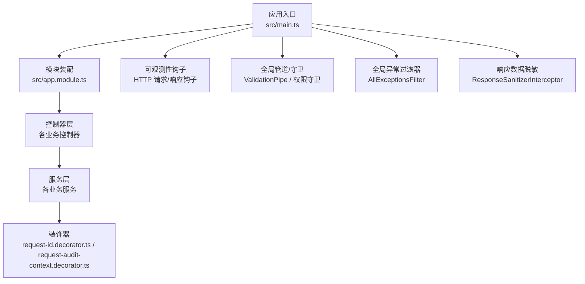
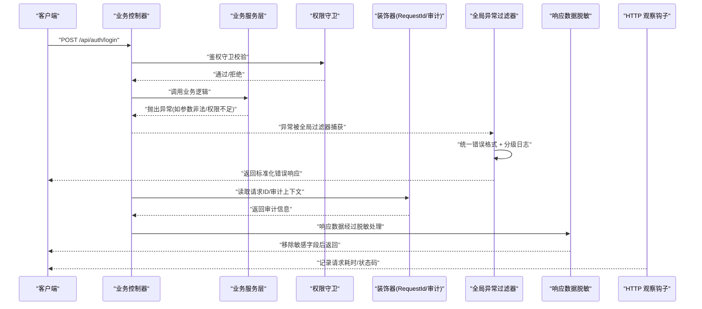
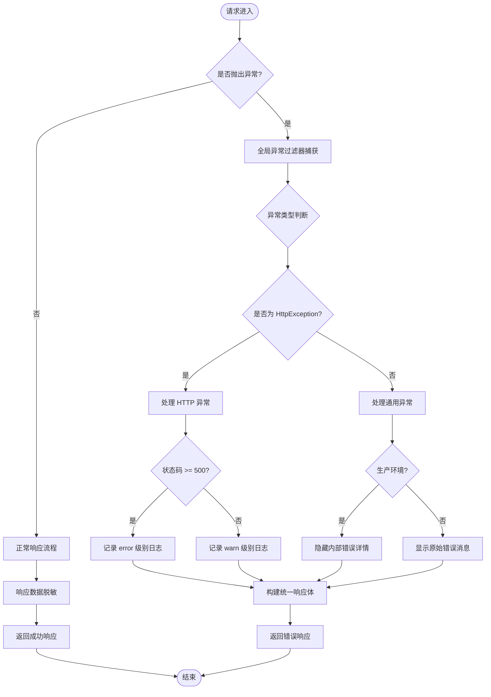
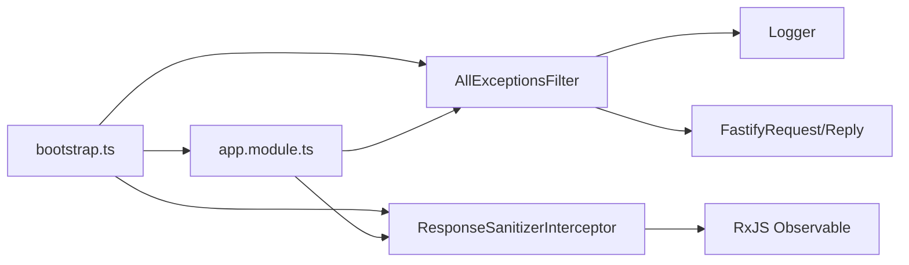

# 错误处理模式

<cite>
**本文引用的文件**
- [src/bootstrap/all-exceptions.filter.ts](file://src/bootstrap/all-exceptions.filter.ts)
- [src/bootstrap/all-exceptions.filter.spec.ts](file://src/bootstrap/all-exceptions.filter.spec.ts)
- [src/shared/response-sanitizer.interceptor.ts](file://src/shared/response-sanitizer.interceptor.ts)
- [src/shared/response-sanitizer.interceptor.spec.ts](file://src/shared/response-sanitizer.interceptor.spec.ts)
- [src/bootstrap/bootstrap.ts](file://src/bootstrap/bootstrap.ts)
- [src/app.module.ts](file://src/app.module.ts)
- [src/main.ts](file://src/main.ts)
- [src/purely-profit/auth/request-id.decorator.ts](file://src/purely-profit/auth/request-id.decorator.ts)
- [src/purely-profit/auth/request-audit-context.decorator.ts](file://src/purely-profit/auth/request-audit-context.decorator.ts)
- [src/bootstrap/http-observability.ts](file://src/bootstrap/http-observability.ts)
- [src/bootstrap/request-id.utils.ts](file://src/bootstrap/request-id.utils.ts)
</cite>

## 更新摘要
**变更内容**
- 新增全局异常过滤器 AllExceptionsFilter，实现统一的错误响应格式、请求ID追踪、生产环境信息脱敏、4xx/5xx分级日志记录等功能
- 新增响应数据脱敏拦截器 ResponseSanitizerInterceptor，防止敏感字段泄露
- 更新全局配置以集成新的错误处理组件
- 完善错误处理架构和最佳实践指南

## 目录
1. [简介](#简介)
2. [项目结构](#项目结构)
3. [核心组件](#核心组件)
4. [架构总览](#架构总览)
5. [详细组件分析](#详细组件分析)
6. [依赖关系分析](#依赖关系分析)
7. [性能考量](#性能考量)
8. [故障排查指南](#故障排查指南)
9. [结论](#结论)
10. [附录](#附录)

## 简介
本文件系统性梳理 purelyprofit-server 的错误处理模式，覆盖统一异常体系、HTTP 状态码使用规范、错误响应标准化、全局异常过滤器配置与使用、错误日志记录与恢复策略、以及用户体验优化最佳实践。文档以代码为依据，结合架构图与流程图，帮助开发者快速理解并正确应用错误处理机制。

**更新** 现已实现完整的全局异常过滤和数据脱敏机制，提供企业级的错误处理能力。

## 项目结构
从整体看，应用在启动阶段集中配置了全局管道、跨域、可观测性钩子等；控制器层负责对外暴露 API 并调用服务层；服务层内部通过抛出 Nest 标准异常或自定义异常进行错误传播；装饰器用于提取审计上下文与请求 ID，便于日志追踪与错误溯源。



图表来源
- [src/main.ts:1-10](file://src/main.ts#L1-L10)
- [src/app.module.ts:1-159](file://src/app.module.ts#L1-L159)
- [src/bootstrap/bootstrap.ts:159-314](file://src/bootstrap/bootstrap.ts#L159-L314)

章节来源
- [src/main.ts:1-10](file://src/main.ts#L1-L10)
- [src/app.module.ts:1-159](file://src/app.module.ts#L1-L159)

## 核心组件
- **全局异常过滤器**：AllExceptionsFilter 实现统一的错误响应格式，支持生产环境信息脱敏和分级日志记录
- **响应数据脱敏拦截器**：ResponseSanitizerInterceptor 自动移除敏感字段，防止密码、密钥等泄露
- **自定义异常与状态码**：广泛使用 Nest 的标准异常类型（如 BadRequestException、ForbiddenException、InternalServerErrorException），并配合 HttpStatus 指定 HTTP 状态码
- **错误响应标准化**：统一的响应体结构包含 statusCode、message、timestamp、path、requestId 等字段
- **请求追踪**：RequestAuditContext 与 RequestId 装饰器提供请求 ID、IP、User-Agent 等审计信息，支撑错误日志与问题定位

**更新** 新增的全局异常过滤器和数据脱敏拦截器构成了完整的错误处理基础设施。

章节来源
- [src/bootstrap/all-exceptions.filter.ts:1-109](file://src/bootstrap/all-exceptions.filter.ts#L1-L109)
- [src/shared/response-sanitizer.interceptor.ts:1-81](file://src/shared/response-sanitizer.interceptor.ts#L1-L81)
- [src/purely-profit/auth/request-id.decorator.ts:1-20](file://src/purely-profit/auth/request-id.decorator.ts#L1-L20)
- [src/purely-profit/auth/request-audit-context.decorator.ts:1-40](file://src/purely-profit/auth/request-audit-context.decorator.ts#L1-L40)

## 架构总览
下图展示了错误从"控制器 -> 服务层 -> 异常抛出 -> 全局过滤器 -> 统一响应"的完整路径，以及数据脱敏在响应流程中的作用。



图表来源
- [src/bootstrap/all-exceptions.filter.ts:27-108](file://src/bootstrap/all-exceptions.filter.ts#L27-L108)
- [src/shared/response-sanitizer.interceptor.ts:38-80](file://src/shared/response-sanitizer.interceptor.ts#L38-L80)
- [src/bootstrap/bootstrap.ts:215-216](file://src/bootstrap/bootstrap.ts#L215-L216)
- [src/app.module.ts:154-155](file://src/app.module.ts#L154-L155)

## 详细组件分析

### 全局异常过滤器 AllExceptionsFilter
全局异常过滤器是错误处理的核心组件，实现了以下关键功能：

#### 统一错误响应格式
所有异常都返回标准化的 JSON 响应体：
```json
{
  "statusCode": 400,
  "message": "参数错误",
  "timestamp": "2024-01-01T00:00:00.000Z",
  "path": "/api/test",
  "requestId": "req-123",
  "code": "VALIDATION_ERROR" // 可选，业务异常码
}
```

#### 生产环境信息脱敏
- **HttpException**：保留原始 statusCode 和 message
- **非 HttpException**：生产环境隐藏内部细节，仅返回通用错误消息"服务器内部错误，请稍后重试"
- **开发环境**：暴露原始错误消息便于调试

#### 分级日志记录
- **4xx 客户端错误**：记录 warn 级别日志
- **5xx 服务器错误**：记录 error 级别日志，包含完整堆栈信息
- **未处理异常**：记录 error 级别日志，包含完整堆栈信息

#### 业务异常码透传
支持从 HttpException 中透传业务异常码（如 VALIDATION_ERROR、PAYMENT_FAILED 等），前端可根据 statusCode 和业务 code 进行差异化处理。

**更新** 新增了生产环境安全脱敏和分级日志记录功能。

章节来源
- [src/bootstrap/all-exceptions.filter.ts:1-109](file://src/bootstrap/all-exceptions.filter.ts#L1-L109)
- [src/bootstrap/all-exceptions.filter.spec.ts:1-134](file://src/bootstrap/all-exceptions.filter.spec.ts#L1-L134)

### 响应数据脱敏拦截器 ResponseSanitizerInterceptor
响应数据脱敏拦截器提供了第二道安全防护，自动移除响应中的敏感字段：

#### 敏感字段黑名单
自动移除以下字段：
- `password`、`hashedPassword` - 密码相关
- `secret`、`secretKey` - 密钥相关  
- `privateKey` - 私钥
- `apiKey` - API 密钥
- `token` - 令牌（仅对嵌套对象中的 token 字段脱敏）

#### 特殊处理规则
- **保留顶层 token 字段**：access_token、refresh_token、expires_in 不受影响
- **递归处理**：自动处理嵌套对象和数组中的敏感字段
- **高性能设计**：仅在匹配到敏感字段时才执行删除操作

#### 与 ClassSerializerInterceptor 的区别
- 基于黑名单机制，不依赖 @Exclude() 装饰器
- 适用于 Prisma 返回的 plain object（非 class instance）
- 性能开销较低

**更新** 新增了响应数据脱敏功能，防止敏感信息泄露。

章节来源
- [src/shared/response-sanitizer.interceptor.ts:1-81](file://src/shared/response-sanitizer.interceptor.ts#L1-L81)
- [src/shared/response-sanitizer.interceptor.spec.ts:1-52](file://src/shared/response-sanitizer.interceptor.spec.ts#L1-L52)

### 统一异常与状态码使用
- **业务参数错误**：服务层在参数校验失败时抛出 BadRequestException，并在控制器中统一返回 400
- **权限不足**：权限守卫在无权访问时抛出 ForbiddenException，并在控制器中统一返回 403
- **内部错误**：装饰器在缺失请求 ID 或用户信息时抛出 InternalServerErrorException，并在控制器中统一返回 500
- **认证失败**：抛出 UnauthorizedException，返回 401

典型位置参考：
- [src/purely-profit/auth/request-id.decorator.ts:13-15](file://src/purely-profit/auth/request-id.decorator.ts#L13-L15)
- [src/purely-profit/auth/request-audit-context.decorator.ts:26-39](file://src/purely-profit/auth/request-audit-context.decorator.ts#L26-L39)

章节来源
- [src/purely-profit/auth/request-id.decorator.ts:1-20](file://src/purely-profit/auth/request-id.decorator.ts#L1-L20)
- [src/purely-profit/auth/request-audit-context.decorator.ts:1-40](file://src/purely-profit/auth/request-audit-context.decorator.ts#L1-L40)

### 全局异常过滤器配置与使用
全局异常过滤器已在应用启动时自动注册：

#### 启动配置
在 bootstrap.ts 中通过 `app.useGlobalFilters(new AllExceptionsFilter(isProduction))` 注册全局异常过滤器。

#### 模块配置
响应数据脱敏拦截器在 app.module.ts 中通过 `APP_INTERCEPTOR` 提供者注册为全局拦截器。

**更新** 全局异常过滤器和数据脱敏拦截器已完全集成到应用中。

章节来源
- [src/bootstrap/bootstrap.ts:215-216](file://src/bootstrap/bootstrap.ts#L215-L216)
- [src/app.module.ts:154-155](file://src/app.module.ts#L154-L155)

### 错误日志记录与审计
- **HTTP 观测钩子**：在 onResponse 钩子中记录请求耗时、路由、状态码与请求 ID，便于慢请求与错误定位
- **审计上下文**：通过 RequestAuditContext 装饰器读取 x-request-id、user-agent、ip 等信息，统一注入到日志与错误响应中
- **请求 ID**：通过 RequestId 装饰器确保每个请求具备唯一标识，便于跨服务链路追踪
- **分级日志**：根据 HTTP 状态码自动选择 warn/error 日志级别

参考位置：
- [src/bootstrap/http-observability.ts:16-37](file://src/bootstrap/http-observability.ts#L16-L37)
- [src/purely-profit/auth/request-audit-context.decorator.ts:26-39](file://src/purely-profit/auth/request-audit-context.decorator.ts#L26-L39)
- [src/bootstrap/request-id.utils.ts:4-10](file://src/bootstrap/request-id.utils.ts#L4-L10)

章节来源
- [src/bootstrap/http-observability.ts:1-39](file://src/bootstrap/http-observability.ts#L1-L39)
- [src/purely-profit/auth/request-audit-context.decorator.ts:1-40](file://src/purely-profit/auth/request-audit-context.decorator.ts#L1-L40)
- [src/bootstrap/request-id.utils.ts:1-11](file://src/bootstrap/request-id.utils.ts#L1-L11)

### 错误恢复策略与用户体验优化
- **参数校验前置**：通过 DTO 字段注解与 ValidationPipe 提前拦截无效输入，减少后续异常开销
- **统一错误文案**：对敏感操作返回通用提示，避免泄露内部细节
- **生产环境安全**：自动隐藏内部错误堆栈，仅返回友好的错误消息
- **缓存预热错误归因**：通过专门的错误处理将未知错误归类为 tag/message，便于监控与告警

**更新** 新增了生产环境安全保护和更完善的错误恢复策略。

章节来源
- [src/bootstrap/all-exceptions.filter.ts:70-81](file://src/bootstrap/all-exceptions.filter.ts#L70-L81)

### 复杂逻辑组件：错误处理流程图


图表来源
- [src/bootstrap/all-exceptions.filter.ts:39-107](file://src/bootstrap/all-exceptions.filter.ts#L39-L107)
- [src/shared/response-sanitizer.interceptor.ts:46-79](file://src/shared/response-sanitizer.interceptor.ts#L46-L79)

## 依赖关系分析
- **启动配置依赖**：bootstrap.ts 依赖 AppModule 进行模块装配，依赖 AllExceptionsFilter 和 ResponseSanitizerInterceptor 提供错误处理能力
- **全局配置**：app.module.ts 通过 APP_INTERCEPTOR 提供者注册全局拦截器
- **异常过滤器依赖**：AllExceptionsFilter 依赖 Logger 进行日志记录，依赖 FastifyRequest/FastifyReply 处理 HTTP 请求响应
- **数据脱敏依赖**：ResponseSanitizerInterceptor 基于 RxJS Observable 处理响应数据流



图表来源
- [src/bootstrap/bootstrap.ts:159-314](file://src/bootstrap/bootstrap.ts#L159-L314)
- [src/app.module.ts:142-156](file://src/app.module.ts#L142-L156)
- [src/bootstrap/all-exceptions.filter.ts:1-25](file://src/bootstrap/all-exceptions.filter.ts#L1-L25)
- [src/shared/response-sanitizer.interceptor.ts:1-44](file://src/shared/response-sanitizer.interceptor.ts#L1-L44)

章节来源
- [src/bootstrap/bootstrap.ts:159-314](file://src/bootstrap/bootstrap.ts#L159-L314)
- [src/app.module.ts:142-156](file://src/app.module.ts#L142-L156)

## 性能考量
- **使用 HTTP 观察钩子记录慢请求阈值**，结合日志告警，及时发现性能瓶颈
- **将参数校验前置到 ValidationPipe**，减少无效请求进入业务逻辑的成本
- **对高频错误（如权限不足）进行快速短路**，避免重复计算与数据库查询
- **响应数据脱敏采用懒加载策略**，仅在匹配到敏感字段时才执行删除操作，降低性能开销
- **全局异常过滤器避免重复日志记录**，确保每个异常只记录一次

## 故障排查指南
- **缺少请求 ID**：当 RequestId 装饰器抛出 500 时，检查网关/代理是否正确透传 x-request-id
- **权限错误**：若出现 403，请确认用户角色与接口权限映射，必要时查看权限守卫的错误文案
- **参数错误**：400 响应通常来自 ValidationPipe，检查 DTO 字段注解与前端入参
- **敏感字段泄露**：如果响应中包含 password、secret 等敏感字段，检查是否遗漏了 ResponseSanitizerInterceptor
- **生产环境错误信息过多**：确认 AllExceptionsFilter 的 isProduction 参数设置正确
- **日志级别异常**：检查 HTTP 状态码是否正确，4xx 应为 warn 级别，5xx 应为 error 级别

**更新** 新增了针对新组件的故障排查指导。

章节来源
- [src/purely-profit/auth/request-id.decorator.ts:13-15](file://src/purely-profit/auth/request-id.decorator.ts#L13-L15)
- [src/bootstrap/all-exceptions.filter.ts:58-81](file://src/bootstrap/all-exceptions.filter.ts#L58-L81)
- [src/shared/response-sanitizer.interceptor.ts:15-23](file://src/shared/response-sanitizer.interceptor.ts#L15-L23)

## 结论
purelyprofit-server 的错误处理现已形成完整的企业级解决方案：服务层通过标准异常表达业务语义，全局异常过滤器负责统一响应格式和安全脱敏，响应数据脱敏拦截器提供第二道安全防护，装饰器与可观测性钩子提供统一的日志与追踪能力。这套机制确保了系统在生产环境的安全性、可维护性和可观测性。

**更新** 新增的全局异常过滤器和数据脱敏拦截器显著提升了系统的错误处理能力和安全性。

## 附录
- **HTTP 状态码使用建议**
  - 400：参数校验失败、业务参数非法
  - 401：未认证或令牌无效
  - 403：权限不足
  - 404：资源不存在
  - 500：服务器内部错误

- **错误响应字段建议**
  - timestamp：错误发生时间
  - requestId：请求唯一标识
  - code：错误码（业务语义）
  - message：错误描述（面向用户）
  - path：请求路径与方法
  - stack（可选）：堆栈信息（仅开发环境）

- **敏感字段黑名单**
  - password、hashedPassword：密码相关字段
  - secret、secretKey：密钥相关字段
  - privateKey：私钥字段
  - apiKey：API 密钥字段
  - token：令牌字段（嵌套对象中）

- **全局配置项**
  - nodeEnv：运行环境（development/production）
  - app.logEnabled：日志开关
  - app.slowRequestLogEnabled：慢请求日志开关
  - app.slowRequestThresholdMs：慢请求阈值（毫秒）