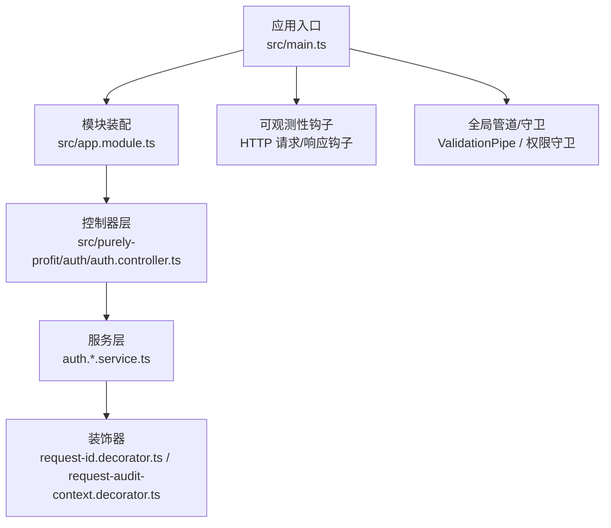
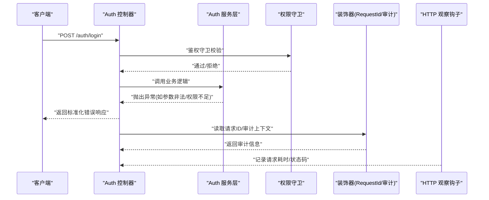
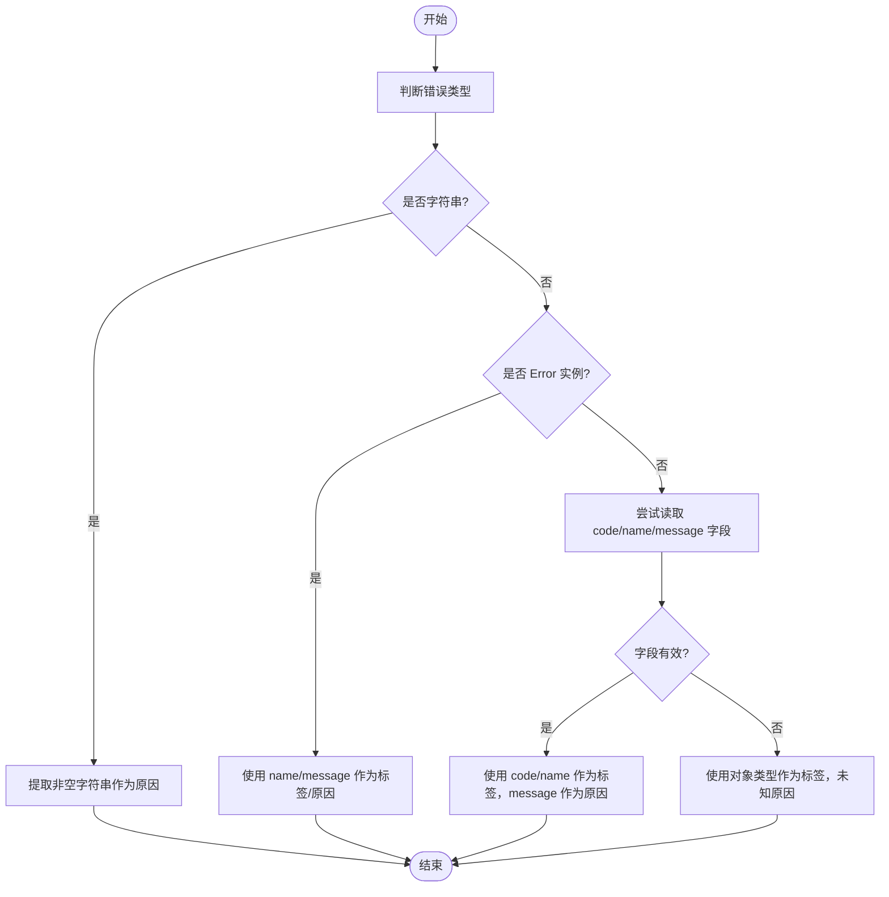
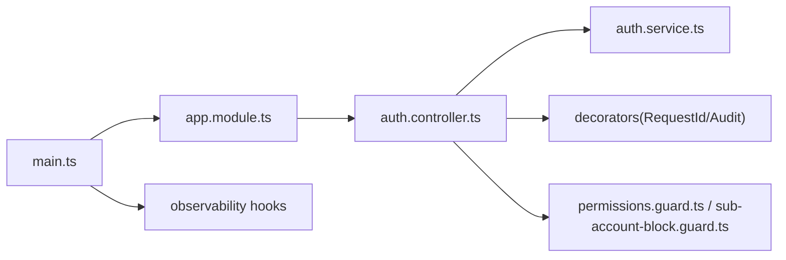

# 错误处理模式

<cite>
**本文引用的文件**
- [src/main.ts](file://src/main.ts)
- [src/app.module.ts](file://src/app.module.ts)
- [src/app.controller.ts](file://src/app.controller.ts)
- [src/purely-profit/auth/auth.controller.ts](file://src/purely-profit/auth/auth.controller.ts)
- [src/purely-profit/auth/request-id.decorator.ts](file://src/purely-profit/auth/request-id.decorator.ts)
- [src/purely-profit/auth/request-audit-context.decorator.ts](file://src/purely-profit/auth/request-audit-context.decorator.ts)
- [src/purely-profit/access-control/guards/sub-account-block.guard.ts](file://src/purely-profit/access-control/guards/sub-account-block.guard.ts)
- [src/purely-profit/access-control/guards/permissions.guard.ts](file://src/purely-profit/access-control/guards/permissions.guard.ts)
- [src/purely-profit/auth/auth-authentication.service.ts](file://src/purely-profit/auth/auth-authentication.service.ts)
- [src/purely-profit/auth/auth-password.service.ts](file://src/purely-profit/auth/auth-password.service.ts)
- [src/purely-profit/auth/auth.utils.ts](file://src/purely-profit/auth/auth.utils.ts)
- [src/redis/cache-prewarm.error.ts](file://src/redis/cache-prewarm.error.ts)
</cite>

## 目录
1. [简介](#简介)
2. [项目结构](#项目结构)
3. [核心组件](#核心组件)
4. [架构总览](#架构总览)
5. [详细组件分析](#详细组件分析)
6. [依赖关系分析](#依赖关系分析)
7. [性能考量](#性能考量)
8. [故障排查指南](#故障排查指南)
9. [结论](#结论)
10. [附录](#附录)

## 简介
本文件系统性梳理 purelyprofit-server 的错误处理模式，覆盖统一异常体系、HTTP 状态码使用规范、错误响应标准化、全局异常过滤器配置与使用、错误日志记录与恢复策略、以及用户体验优化最佳实践。文档以代码为依据，结合架构图与流程图，帮助开发者快速理解并正确应用错误处理机制。

## 项目结构
从整体看，应用在启动阶段集中配置了全局管道、跨域、可观测性钩子等；控制器层负责对外暴露 API 并调用服务层；服务层内部通过抛出 Nest 标准异常或自定义异常进行错误传播；装饰器用于提取审计上下文与请求 ID，便于日志追踪与错误溯源。

图表来源
- [src/main.ts:1-110](file://src/main.ts#L1-L110)
- [src/app.module.ts:1-83](file://src/app.module.ts#L1-L83)
- [src/purely-profit/auth/auth.controller.ts:1-182](file://src/purely-profit/auth/auth.controller.ts#L1-L182)

章节来源
- [src/main.ts:1-110](file://src/main.ts#L1-L110)
- [src/app.module.ts:1-83](file://src/app.module.ts#L1-L83)

## 核心组件
- 全局异常过滤与统一响应：当前仓库未发现显式的全局异常过滤器实现，但通过控制器与服务层抛出标准异常，结合装饰器与可观测性钩子，形成统一的错误传播与日志记录路径。
- 自定义异常与状态码：服务层与守卫中广泛使用 Nest 的标准异常类型（如 BadRequestException、ForbiddenException、InternalServerErrorException），并配合 HttpStatus 指定 HTTP 状态码。
- 错误响应标准化：控制器通过 Swagger 注解声明响应体类型，确保错误响应结构一致；同时通过装饰器注入审计上下文，便于统一日志格式。
- 请求追踪：RequestAuditContext 与 RequestId 装饰器提供请求 ID、IP、User-Agent 等审计信息，支撑错误日志与问题定位。

章节来源
- [src/purely-profit/auth/request-id.decorator.ts:1-17](file://src/purely-profit/auth/request-id.decorator.ts#L1-L17)
- [src/purely-profit/auth/request-audit-context.decorator.ts:1-39](file://src/purely-profit/auth/request-audit-context.decorator.ts#L1-L39)
- [src/purely-profit/access-control/guards/sub-account-block.guard.ts:1-60](file://src/purely-profit/access-control/guards/sub-account-block.guard.ts#L1-L60)
- [src/purely-profit/access-control/guards/permissions.guard.ts:1-60](file://src/purely-profit/access-control/guards/permissions.guard.ts#L1-L60)
- [src/purely-profit/auth/auth-authentication.service.ts:1-80](file://src/purely-profit/auth/auth-authentication.service.ts#L1-L80)
- [src/purely-profit/auth/auth-password.service.ts:1-100](file://src/purely-profit/auth/auth-password.service.ts#L1-L100)
- [src/purely-profit/auth/auth.utils.ts:150-165](file://src/purely-profit/auth/auth.utils.ts#L150-L165)

## 架构总览
下图展示了错误从“控制器 -> 服务层 -> 异常抛出 -> 日志记录”的典型路径，以及装饰器在其中的作用。

图表来源
- [src/purely-profit/auth/auth.controller.ts:1-182](file://src/purely-profit/auth/auth.controller.ts#L1-L182)
- [src/purely-profit/access-control/guards/permissions.guard.ts:1-60](file://src/purely-profit/access-control/guards/permissions.guard.ts#L1-L60)
- [src/purely-profit/auth/request-id.decorator.ts:1-17](file://src/purely-profit/auth/request-id.decorator.ts#L1-L17)
- [src/purely-profit/auth/request-audit-context.decorator.ts:1-39](file://src/purely-profit/auth/request-audit-context.decorator.ts#L1-L39)
- [src/main.ts:32-75](file://src/main.ts#L32-L75)

## 详细组件分析

### 统一异常与状态码使用
- 业务参数错误：服务层在参数校验失败时抛出 BadRequestException，并在控制器中统一返回 400。
- 权限不足：权限守卫在无权访问时抛出 ForbiddenException，并在控制器中统一返回 403。
- 内部错误：装饰器在缺失请求 ID 或用户信息时抛出 InternalServerErrorException，并在控制器中统一返回 500。
- 典型位置参考：
  - [src/purely-profit/auth/auth-authentication.service.ts:60-75](file://src/purely-profit/auth/auth-authentication.service.ts#L60-L75)
  - [src/purely-profit/auth/auth-password.service.ts:80-90](file://src/purely-profit/auth/auth-password.service.ts#L80-L90)
  - [src/purely-profit/access-control/guards/permissions.guard.ts:35-50](file://src/purely-profit/access-control/guards/permissions.guard.ts#L35-L50)
  - [src/purely-profit/auth/request-id.decorator.ts:10-15](file://src/purely-profit/auth/request-id.decorator.ts#L10-L15)
  - [src/purely-profit/auth/request-audit-context.decorator.ts:26-39](file://src/purely-profit/auth/request-audit-context.decorator.ts#L26-L39)

章节来源
- [src/purely-profit/auth/auth-authentication.service.ts:1-80](file://src/purely-profit/auth/auth-authentication.service.ts#L1-L80)
- [src/purely-profit/auth/auth-password.service.ts:1-100](file://src/purely-profit/auth/auth-password.service.ts#L1-L100)
- [src/purely-profit/access-control/guards/permissions.guard.ts:1-60](file://src/purely-profit/access-control/guards/permissions.guard.ts#L1-L60)
- [src/purely-profit/auth/request-id.decorator.ts:1-17](file://src/purely-profit/auth/request-id.decorator.ts#L1-L17)
- [src/purely-profit/auth/request-audit-context.decorator.ts:1-39](file://src/purely-profit/auth/request-audit-context.decorator.ts#L1-L39)

### 错误响应标准化
- 控制器通过 Swagger 注解声明响应体类型，保证错误响应结构一致，便于前端统一处理。
- 示例参考：
  - [src/purely-profit/auth/auth.controller.ts:33-54](file://src/purely-profit/auth/auth.controller.ts#L33-L54)
  - [src/purely-profit/auth/auth.controller.ts:56-65](file://src/purely-profit/auth/auth.controller.ts#L56-L65)
  - [src/app.controller.ts:11-32](file://src/app.controller.ts#L11-L32)

章节来源
- [src/purely-profit/auth/auth.controller.ts:1-182](file://src/purely-profit/auth/auth.controller.ts#L1-L182)
- [src/app.controller.ts:1-34](file://src/app.controller.ts#L1-L34)

### 全局异常过滤器配置与使用
- 当前仓库未发现显式的全局异常过滤器实现。建议采用以下方式补充：
  - 在应用启动时注册全局异常过滤器，拦截所有未捕获异常并输出统一格式的错误响应。
  - 对于 ValidationPipe 抛出的参数校验错误，统一映射为 400 响应。
  - 对于业务异常（如 ForbiddenException、BadRequestException），统一输出包含请求 ID、时间戳、错误码与消息的结构化 JSON。
- 参考位置：
  - [src/main.ts:1-110](file://src/main.ts#L1-L110)（应用启动与全局配置）

章节来源
- [src/main.ts:1-110](file://src/main.ts#L1-L110)

### 错误日志记录与审计
- HTTP 观测钩子：在 onRequest/onResponse 钩子中记录请求耗时、路由、状态码与请求 ID，便于慢请求与错误定位。
- 审计上下文：通过 RequestAuditContext 装饰器读取 x-request-id、user-agent、ip 等信息，统一注入到日志与错误响应中。
- 请求 ID：通过 RequestId 装饰器确保每个请求具备唯一标识，便于跨服务链路追踪。
- 参考位置：
  - [src/main.ts:32-75](file://src/main.ts#L32-L75)
  - [src/purely-profit/auth/request-audit-context.decorator.ts:26-39](file://src/purely-profit/auth/request-audit-context.decorator.ts#L26-L39)
  - [src/purely-profit/auth/request-id.decorator.ts:7-16](file://src/purely-profit/auth/request-id.decorator.ts#L7-L16)

章节来源
- [src/main.ts:32-75](file://src/main.ts#L32-L75)
- [src/purely-profit/auth/request-audit-context.decorator.ts:1-39](file://src/purely-profit/auth/request-audit-context.decorator.ts#L1-L39)
- [src/purely-profit/auth/request-id.decorator.ts:1-17](file://src/purely-profit/auth/request-id.decorator.ts#L1-L17)

### 错误恢复策略与用户体验优化
- 参数校验前置：通过 DTO 字段注解与 ValidationPipe 提前拦截无效输入，减少后续异常开销。
- 统一错误文案：对敏感操作（如密码修改、实名认证）返回通用提示，避免泄露内部细节。
- 缓存预热错误归因：通过 cache-prewarm.error.ts 将未知错误归类为 tag/message，便于监控与告警。
- 参考位置：
  - [src/redis/cache-prewarm.error.ts:15-50](file://src/redis/cache-prewarm.error.ts#L15-L50)
  - [src/purely-profit/auth/auth.utils.ts:150-165](file://src/purely-profit/auth/auth.utils.ts#L150-L165)

章节来源
- [src/redis/cache-prewarm.error.ts:1-51](file://src/redis/cache-prewarm.error.ts#L1-L51)
- [src/purely-profit/auth/auth.utils.ts:150-165](file://src/purely-profit/auth/auth.utils.ts#L150-L165)

### 复杂逻辑组件：缓存预热错误归因

图表来源
- [src/redis/cache-prewarm.error.ts:15-50](file://src/redis/cache-prewarm.error.ts#L15-L50)

## 依赖关系分析
- 启动配置依赖：main.ts 依赖 AppModule 进行模块装配，依赖 Observability 记录 HTTP 指标。
- 控制器依赖：AuthController 依赖 AuthService 与守卫，依赖装饰器获取审计上下文。
- 服务层依赖：auth-* 服务依赖 utils 与 DTO 校验，依赖异常类型进行错误传播。
- 权限守卫依赖：sub-account-block.guard 与 permissions.guard 依赖 ForbiddenException 进行权限控制。

图表来源
- [src/main.ts:1-110](file://src/main.ts#L1-L110)
- [src/app.module.ts:1-83](file://src/app.module.ts#L1-L83)
- [src/purely-profit/auth/auth.controller.ts:1-182](file://src/purely-profit/auth/auth.controller.ts#L1-L182)
- [src/purely-profit/access-control/guards/permissions.guard.ts:1-60](file://src/purely-profit/access-control/guards/permissions.guard.ts#L1-L60)
- [src/purely-profit/access-control/guards/sub-account-block.guard.ts:1-60](file://src/purely-profit/access-control/guards/sub-account-block.guard.ts#L1-L60)

章节来源
- [src/main.ts:1-110](file://src/main.ts#L1-L110)
- [src/app.module.ts:1-83](file://src/app.module.ts#L1-L83)
- [src/purely-profit/auth/auth.controller.ts:1-182](file://src/purely-profit/auth/auth.controller.ts#L1-L182)

## 性能考量
- 使用 HTTP 观察钩子记录慢请求阈值，结合日志告警，及时发现性能瓶颈。
- 将参数校验前置到 ValidationPipe，减少无效请求进入业务逻辑的成本。
- 对高频错误（如权限不足）进行快速短路，避免重复计算与数据库查询。

## 故障排查指南
- 缺少请求 ID：当 RequestId 装饰器抛出 500 时，检查网关/代理是否正确透传 x-request-id。
- 权限错误：若出现 403，请确认用户角色与接口权限映射，必要时查看权限守卫的错误文案。
- 参数错误：400 响应通常来自 ValidationPipe，检查 DTO 字段注解与前端入参。
- 缓存预热失败：通过 cache-prewarm.error.ts 的元数据定位具体失败原因，结合监控告警进行修复。

章节来源
- [src/purely-profit/auth/request-id.decorator.ts:10-15](file://src/purely-profit/auth/request-id.decorator.ts#L10-L15)
- [src/purely-profit/access-control/guards/permissions.guard.ts:35-50](file://src/purely-profit/access-control/guards/permissions.guard.ts#L35-L50)
- [src/redis/cache-prewarm.error.ts:15-50](file://src/redis/cache-prewarm.error.ts#L15-L50)

## 结论
purelyprofit-server 的错误处理以“异常即契约”为核心：服务层通过标准异常表达业务语义，控制器与守卫负责状态码与权限控制，装饰器与可观测性钩子提供统一的日志与追踪能力。建议尽快引入全局异常过滤器，以实现统一的错误响应格式与更完善的错误恢复策略，从而提升系统的稳定性与可维护性。

## 附录
- HTTP 状态码使用建议
  - 400：参数校验失败、业务参数非法
  - 401：未认证或令牌无效
  - 403：权限不足
  - 404：资源不存在
  - 500：服务器内部错误
- 错误响应字段建议
  - timestamp：错误发生时间
  - requestId：请求唯一标识
  - code：错误码（业务语义）
  - message：错误描述（面向用户）
  - path/method：请求路径与方法
  - stack（可选）：堆栈信息（仅开发环境）