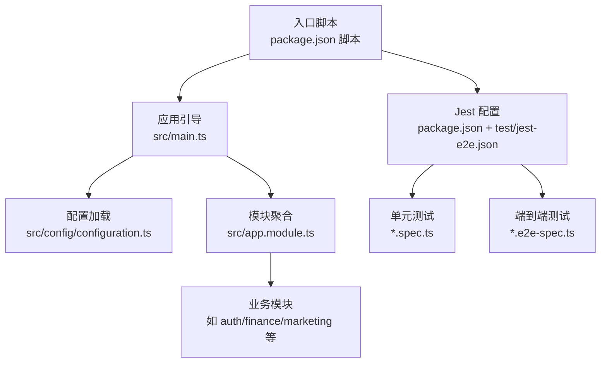
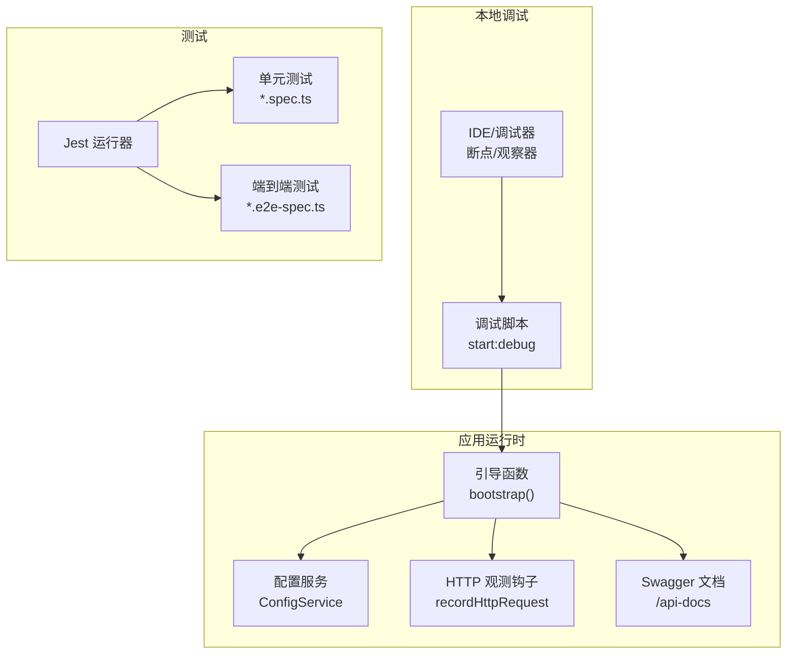
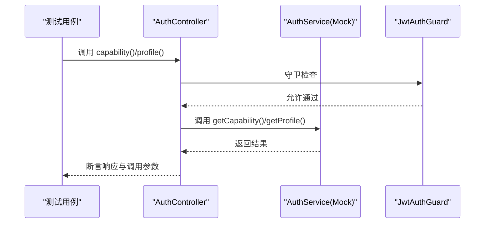
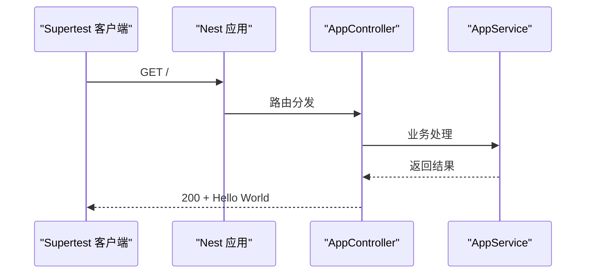
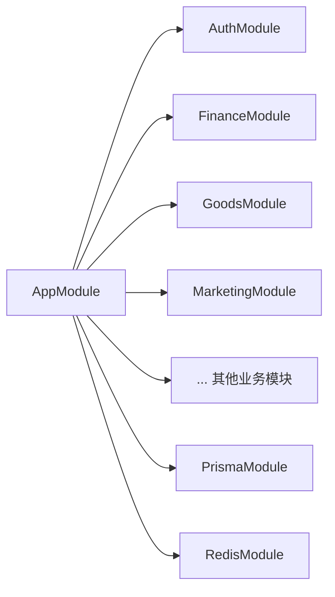

# 调试与测试

<cite>
**本文引用的文件**
- [package.json](file://package.json)
- [jest-e2e.json](file://test/jest-e2e.json)
- [main.ts](file://src/main.ts)
- [app.module.ts](file://src/app.module.ts)
- [configuration.ts](file://src/config/configuration.ts)
- [app.e2e-spec.ts](file://test/app.e2e-spec.ts)
- [auth.controller.spec.ts](file://src/purely-profit/auth/auth.controller.spec.ts)
- [eslint.config.mjs](file://eslint.config.mjs)
- [finance.spec-helpers.ts](file://src/purely-profit/finance/finance.spec-helpers.ts)
- [marketing.service.test-setup.ts](file://src/purely-profit/marketing/marketing.service.test-setup.ts)
- [runtime-metrics.recorders.ts](file://src/observability/runtime-metrics.recorders.ts)
- [runtime-metrics.summary-context-severity.ts](file://src/observability/runtime-metrics.summary-context-severity.ts)
- [check-f0rest-rules.mjs](file://scripts/check-f0rest-rules.mjs)
</cite>

## 目录
1. [简介](#简介)
2. [项目结构](#项目结构)
3. [核心组件](#核心组件)
4. [架构总览](#架构总览)
5. [详细组件分析](#详细组件分析)
6. [依赖分析](#依赖分析)
7. [性能考虑](#性能考虑)
8. [故障排查指南](#故障排查指南)
9. [结论](#结论)
10. [附录](#附录)

## 简介
本指南面向“purelyprofit-server”项目的开发者，提供从本地调试到各类测试（单元、集成、端到端）的完整开发与实践路径。内容涵盖：
- 本地调试环境配置、断点设置与日志输出策略
- 单元测试、集成测试与端到端测试的编写方法
- Jest 配置、测试工具函数与模拟对象的使用
- 测试覆盖率要求、测试数据准备与测试环境隔离最佳实践
- 性能测试、压力测试与安全测试的实施建议

## 项目结构
该项目采用 NestJS 架构，模块化组织业务域，测试文件以 .spec.ts 和 .e2e-spec.ts 命名，分别对应单元测试与端到端测试。

图示来源
- [package.json:8-30](file://package.json#L8-L30)
- [main.ts:121-204](file://src/main.ts#L121-L204)
- [configuration.ts:8-139](file://src/config/configuration.ts#L8-L139)
- [app.module.ts:39-82](file://src/app.module.ts#L39-L82)
- [jest-e2e.json:1-10](file://test/jest-e2e.json#L1-L10)

章节来源
- [package.json:8-30](file://package.json#L8-L30)
- [main.ts:121-204](file://src/main.ts#L121-L204)
- [app.module.ts:39-82](file://src/app.module.ts#L39-L82)
- [jest-e2e.json:1-10](file://test/jest-e2e.json#L1-L10)

## 核心组件
- 应用引导与配置
  - 引导流程负责加载配置、启用 CORS、注册 Swagger 文档、设置全局管道与前缀、端口回退与慢请求日志等。
  - 关键配置项包括 HTTP 超时、体限制、慢请求阈值、Swagger 开关、日志开关等。
- 模块聚合
  - AppModule 将所有业务模块与基础设施模块（Prisma、Redis）装配为应用容器。
- 测试框架与工具
  - Jest 作为测试运行器，支持 ts-jest 转换；E2E 使用独立配置覆盖根目录与正则匹配。
  - ESLint 针对 spec/e2e 文件放宽部分类型检查规则，便于测试编写。

章节来源
- [main.ts:121-204](file://src/main.ts#L121-L204)
- [configuration.ts:8-139](file://src/config/configuration.ts#L8-L139)
- [app.module.ts:39-82](file://src/app.module.ts#L39-L82)
- [package.json:87-103](file://package.json#L87-L103)
- [jest-e2e.json:1-10](file://test/jest-e2e.json#L1-L10)
- [eslint.config.mjs:41-46](file://eslint.config.mjs#L41-L46)

## 架构总览
下图展示调试与测试相关的系统交互：本地调试启动、配置注入、HTTP 观测钩子、慢请求日志与 Swagger 文档、以及测试运行器与模块容器的关系。

图示来源
- [main.ts:121-204](file://src/main.ts#L121-L204)
- [configuration.ts:8-139](file://src/config/configuration.ts#L8-L139)
- [package.json:13](file://package.json#L13)

## 详细组件分析

### 本地调试与断点设置
- 启动方式
  - 开发模式：使用脚本 start:dev 自动重启监听。
  - 调试模式：使用脚本 start:debug 启动调试模式，结合 IDE 断点进行单步调试。
- 断点建议位置
  - 入口引导：在 bootstrap() 函数内设置断点，观察配置加载、CORS、Swagger、慢请求阈值等初始化逻辑。
  - 控制器层：在具体控制器方法入口设置断点，验证鉴权守卫与 DTO 参数进入。
  - 服务层：在核心业务方法处设置断点，观察领域逻辑与外部依赖（Prisma/Redis）交互。
- 日志输出策略
  - 慢请求日志：当请求耗时达到阈值时，控制台会输出警告日志，便于定位慢接口。
  - HTTP 观测钩子：记录每个请求的 method、route、状态码、耗时与 requestId，便于链路追踪与性能分析。
  - Swagger 文档：在非生产环境默认开启，便于联调与接口验证。

章节来源
- [package.json:12-13](file://package.json#L12-L13)
- [main.ts:32-75](file://src/main.ts#L32-L75)
- [main.ts:160-164](file://src/main.ts#L160-L164)

### 单元测试（Unit Tests）
- 测试组织
  - 每个功能模块通常配套一个 controller.spec.ts 与 service.spec.ts，便于针对控制器与服务进行行为验证。
  - 示例：认证模块的 AuthController 通过 Mock AuthService 并覆盖 JwtAuthGuard，确保控制器行为可独立验证。
- 模拟对象与工具函数
  - 使用 Jest 提供的 Mock 机制，为依赖的服务与工具函数提供替身，避免真实外部依赖。
  - 工具函数：项目提供了多处测试辅助函数，例如金融模块的 createFinanceFacadeServiceMocks 与 createFinanceFacadeProviders，营销模块的 createMarketingServiceTestingContext 等，用于快速搭建测试上下文。
- 断言与覆盖率
  - 使用 expect 与 Jest 匹配器进行断言，覆盖控制器返回值、服务调用参数与次数等。
  - 覆盖率由 Jest 统一收集，配置中已启用覆盖率目录与收集范围。

图示来源
- [auth.controller.spec.ts:9-59](file://src/purely-profit/auth/auth.controller.spec.ts#L9-L59)

章节来源
- [auth.controller.spec.ts:1-187](file://src/purely-profit/auth/auth.controller.spec.ts#L1-L187)
- [finance.spec-helpers.ts:188-246](file://src/purely-profit/finance/finance.spec-helpers.ts#L188-L246)
- [marketing.service.test-setup.ts:201-245](file://src/purely-profit/marketing/marketing.service.test-setup.ts#L201-L245)
- [package.json:87-103](file://package.json#L87-L103)

### 集成测试（Integration Tests）
- 目标
  - 验证多个模块协作的行为，如控制器与服务、服务与数据库/缓存之间的交互。
- 实施要点
  - 使用 @nestjs/testing 的 Test.createTestingModule 构建最小化模块集合，按需提供 Mock 与真实依赖。
  - 对于需要真实数据库/缓存的场景，建议使用独立的测试数据库与测试 Redis，确保隔离性。
- 数据准备
  - 使用 Prisma Client 在测试前插入必要的种子数据，或在测试中通过事务/临时表隔离。
  - 对于缓存相关测试，使用 CacheInvalidator 的 Mock 替身，避免真实缓存污染。

章节来源
- [marketing.service.test-setup.ts:207-236](file://src/purely-profit/marketing/marketing.service.test-setup.ts#L207-L236)

### 端到端测试（E2E Tests）
- 目标
  - 验证从客户端到数据库的完整请求链路，确保路由、中间件、拦截器、守卫与异常处理均按预期工作。
- 配置与运行
  - 使用独立的 Jest 配置 jest-e2e.json，根目录为测试目录，正则匹配 .e2e-spec.ts 文件。
  - 通过 supertest 发起 HTTP 请求，断言状态码与响应体。
- 示例
  - app.e2e-spec.ts 展示了如何初始化 AppModule、启动应用并发起 GET / 请求。

图示来源
- [app.e2e-spec.ts:10-28](file://test/app.e2e-spec.ts#L10-L28)

章节来源
- [jest-e2e.json:1-10](file://test/jest-e2e.json#L1-L10)
- [app.e2e-spec.ts:1-30](file://test/app.e2e-spec.ts#L1-L30)

### 测试覆盖率要求与报告
- 覆盖率收集
  - Jest 已配置 collectCoverageFrom 与 coverageDirectory，确保对所有 .ts 文件进行覆盖率统计。
- 要求建议
  - 建议为关键模块（控制器、服务、领域逻辑）设定目标覆盖率（如 80%+），并定期审查未覆盖分支与异常路径。
  - 对 Mock 较多的模块，应关注“逻辑覆盖率”而非仅“语句覆盖率”，确保分支与异常路径被验证。

章节来源
- [package.json:98-102](file://package.json#L98-L102)

### 测试数据准备与环境隔离
- 环境隔离
  - 使用独立的测试数据库与测试 Redis，避免与开发/生产数据冲突。
  - 通过环境变量与配置文件区分不同环境，确保测试不会污染真实数据源。
- 数据准备
  - 在测试前清理或重建测试数据库，保证每次测试的初始状态一致。
  - 对于缓存相关测试，使用 Mock 缓存服务，或在测试结束后清空缓存。

章节来源
- [configuration.ts:99-117](file://src/config/configuration.ts#L99-L117)

## 依赖分析
- 模块耦合
  - AppModule 将各业务模块与基础设施模块聚合，形成清晰的依赖层次。
  - 控制器层不应直接依赖底层基础设施（如 PrismaService/RedisService），应下沉至服务层，降低耦合度。
- 外部依赖
  - Jest、ts-jest、supertest 为核心测试工具；ESLint 针对 spec/e2e 放宽规则，提升测试可维护性。

图示来源
- [app.module.ts:39-82](file://src/app.module.ts#L39-L82)

章节来源
- [app.module.ts:39-82](file://src/app.module.ts#L39-L82)
- [eslint.config.mjs:41-46](file://eslint.config.mjs#L41-L46)

## 性能考虑
- 慢请求检测
  - 应用内置 HTTP 观测钩子与慢请求阈值配置，超过阈值会在控制台输出警告日志，便于定位慢接口。
- 缓存预热观测
  - 运行时指标记录缓存预热周期的耗时、命中、刷新、跳过、失效与失败计数，并提供摘要高亮与严重级别判断，帮助识别缓存健康状况。
- 性能测试与压力测试建议
  - 使用压测工具（如 k6、Artillery）对关键接口进行并发与延迟测试，结合慢请求日志与运行时指标进行回归分析。
  - 对热点查询与缓存路径进行基准测试，持续监控慢查询与慢 Redis 调用的阈值与频率。

章节来源
- [main.ts:160-164](file://src/main.ts#L160-L164)
- [runtime-metrics.recorders.ts:212-281](file://src/observability/runtime-metrics.recorders.ts#L212-L281)
- [runtime-metrics.summary-context-severity.ts:47-93](file://src/observability/runtime-metrics.summary-context-severity.ts#L47-L93)

## 故障排查指南
- 常见问题
  - 端口占用：应用启动时若默认端口被占用，会自动尝试下一个端口；可通过日志确认实际监听端口。
  - 慢请求告警：当请求耗时超过阈值，控制台会输出慢请求日志，优先检查路由处理、数据库查询与缓存命中情况。
  - Swagger 不可见：在生产环境默认关闭 Swagger，可在配置中开启或通过环境变量调整。
- 代码规范与测试约束
  - 业务代码禁止直接读取 process.env，应通过 configuration.ts 映射后使用 ConfigService。
  - controller 禁止直接依赖 PrismaService/RedisService，密码处理与哈希应在服务层完成。
  - DTO 必须使用 class-validator 与 Swagger 注解完善字段校验与文档。

章节来源
- [main.ts:186-198](file://src/main.ts#L186-L198)
- [check-f0rest-rules.mjs:53-115](file://scripts/check-f0rest-rules.mjs#L53-L115)

## 结论
本指南提供了从本地调试到各类测试的系统化实践路径。通过合理的断点设置、日志策略与测试工具，可以高效地验证控制器、服务与跨模块协作的正确性；配合覆盖率与性能观测，能够持续提升代码质量与系统稳定性。

## 附录
- 调试命令
  - 开发模式：npm run start:dev
  - 调试模式：npm run start:debug
- 测试命令
  - 单元测试：npm run test
  - 单元测试（watch）：npm run test:watch
  - 覆盖率：npm run test:cov
  - 调试运行测试：npm run test:debug
  - 端到端测试：npm run test:e2e

章节来源
- [package.json:8-29](file://package.json#L8-L29)