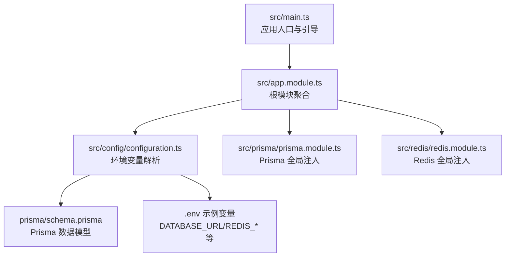
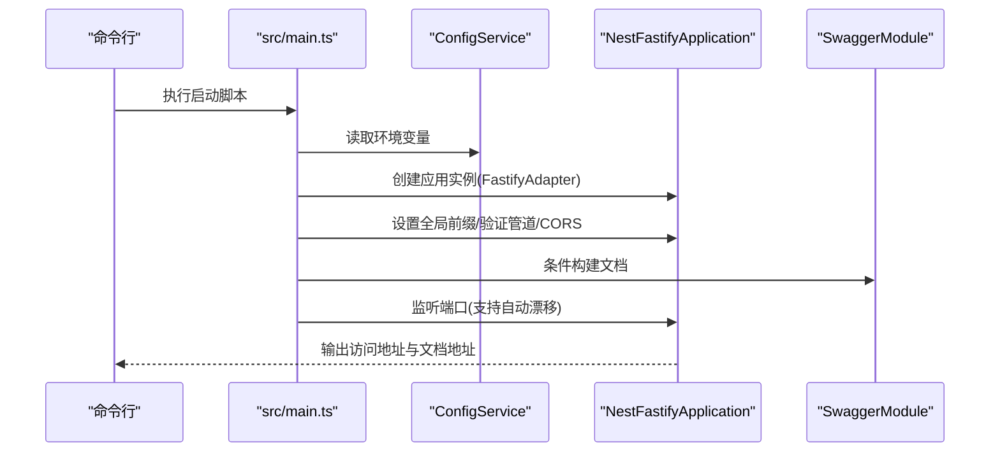
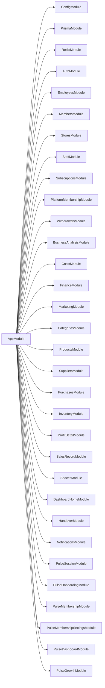

# 快速开始

<cite>
**本文引用的文件**
- [README.md](file://README.md)
- [package.json](file://package.json)
- [src/main.ts](file://src/main.ts)
- [src/app.module.ts](file://src/app.module.ts)
- [src/config/configuration.ts](file://src/config/configuration.ts)
- [prisma/schema.prisma](file://prisma/schema.prisma)
- [prisma.config.ts](file://prisma.config.ts)
- [scripts/seed-owner.mjs](file://scripts/seed-owner.mjs)
- [src/prisma/prisma.module.ts](file://src/prisma/prisma.module.ts)
- [src/redis/redis.module.ts](file://src/redis/redis.module.ts)
</cite>

## 目录
1. [简介](#简介)
2. [项目结构](#项目结构)
3. [核心组件](#核心组件)
4. [架构总览](#架构总览)
5. [详细组件分析](#详细组件分析)
6. [依赖关系分析](#依赖关系分析)
7. [性能注意事项](#性能注意事项)
8. [故障排除指南](#故障排除指南)
9. [结论](#结论)
10. [附录](#附录)

## 简介
本指南面向新开发者，帮助你在最短时间内完成 purelyprofit-server 的本地开发环境搭建与首次启动。内容涵盖环境要求、依赖安装、数据库与缓存配置、环境变量设置、基础运行命令以及常见问题排查。

## 项目结构
该项目基于 NestJS 11，采用 Fastify 适配器，使用 Prisma 作为 ORM，PostgreSQL 作为主数据库，Redis 用于缓存与会话相关能力。应用通过 ConfigModule 加载 .env 中的环境变量，并以模块化方式组织业务域。

**图表来源**
- [src/main.ts:121-204](file://src/main.ts#L121-L204)
- [src/app.module.ts:39-82](file://src/app.module.ts#L39-L82)
- [src/config/configuration.ts:8-138](file://src/config/configuration.ts#L8-L138)
- [prisma/schema.prisma:1-13](file://prisma/schema.prisma#L1-L13)

**章节来源**
- [src/app.module.ts:1-83](file://src/app.module.ts#L1-L83)
- [src/main.ts:121-204](file://src/main.ts#L121-L204)
- [src/config/configuration.ts:8-138](file://src/config/configuration.ts#L8-L138)

## 核心组件
- 应用引导与 HTTP 配置：在应用启动时读取环境变量，设置全局前缀、跨域、Swagger 文档、超时与限流等参数，并支持端口自动漂移。
- 配置系统：集中解析 .env 并导出 app、database、redis、jwt、auth、pulse 等分组配置。
- 数据层：Prisma 客户端通过全局模块注入，支持迁移与查询；Redis 通过全局模块注入，提供缓存预热与失效策略。
- 业务模块：根模块聚合了权限控制、认证、员工、会员、门店、订阅、财务、商品、营销、运营、空间、通知、Pulse 系列等子模块。

**章节来源**
- [src/main.ts:121-204](file://src/main.ts#L121-L204)
- [src/config/configuration.ts:8-138](file://src/config/configuration.ts#L8-L138)
- [src/prisma/prisma.module.ts:1-10](file://src/prisma/prisma.module.ts#L1-L10)
- [src/redis/redis.module.ts:1-16](file://src/redis/redis.module.ts#L1-L16)

## 架构总览
下图展示了应用启动的关键流程：读取配置 → 初始化 Fastify 适配器 → 注册全局管道与 CORS → 可选启用 Swagger → 绑定端口并输出访问日志。

**图表来源**
- [src/main.ts:121-204](file://src/main.ts#L121-L204)
- [src/app.module.ts:39-82](file://src/app.module.ts#L39-L82)

**章节来源**
- [src/main.ts:121-204](file://src/main.ts#L121-L204)

## 详细组件分析

### 环境变量与配置
- 关键变量包括：端口、运行环境、Swagger 开关、日志开关、HTTP 超时/保活/体限制、端口自动漂移策略、慢请求阈值、数据库连接池参数、Redis 主机/端口/密码/库、JWT 秘钥与过期时间、认证验证码有效期、Pulse 开发账号邮箱列表等。
- 配置默认值集中在配置函数中，便于在不同环境下快速切换。

**章节来源**
- [src/config/configuration.ts:8-138](file://src/config/configuration.ts#L8-L138)

### 数据库与迁移
- Prisma 使用 PostgreSQL 作为数据源，schema 文件定义了生成器与数据源类型。
- 项目提供多种迁移相关的脚本，包括状态检查、部署、差异对比、影子库重置等，便于在不同阶段进行数据库演进与校验。

**章节来源**
- [prisma/schema.prisma:1-13](file://prisma/schema.prisma#L1-L13)
- [package.json:15-21](file://package.json#L15-L21)

### 缓存与 Redis
- Redis 通过全局模块注入，提供缓存预热、失效与监控能力；应用配置中包含缓存预热的开关、周期、并发、批大小等参数。

**章节来源**
- [src/redis/redis.module.ts:1-16](file://src/redis/redis.module.ts#L1-L16)
- [src/config/configuration.ts:59-86](file://src/config/configuration.ts#L59-L86)

### 认证与会话
- JWT 作为认证载体，结合 Redis 版本号机制实现会话版本控制与令牌吊销；登录后签发带版本号的 JWT，后续可通过提升版本使旧令牌失效。

**章节来源**
- [src/purely-profit/auth/auth-session.service.ts:16-45](file://src/purely-profit/auth/auth-session.service.ts#L16-L45)

### 初始化数据脚本
- 提供一键初始化 Owner 账号、门店、员工与订阅的脚本，便于本地快速体验完整业务链路。

**章节来源**
- [scripts/seed-owner.mjs:54-121](file://scripts/seed-owner.mjs#L54-L121)

## 依赖关系分析
应用通过根模块聚合大量业务模块，形成清晰的领域划分；同时依赖 Prisma 与 Redis 两大基础设施模块。

**图表来源**
- [src/app.module.ts:39-82](file://src/app.module.ts#L39-L82)

**章节来源**
- [src/app.module.ts:1-83](file://src/app.module.ts#L1-L83)

## 性能注意事项
- HTTP 参数：合理设置请求超时、保活超时与请求体大小，避免资源浪费与攻击风险。
- 缓存预热：在生产或压测环境中开启缓存预热，降低冷启动与热点击穿带来的抖动。
- 慢请求/慢查询/慢 Redis：通过阈值配置与日志开关定位性能瓶颈。
- 端口自动漂移：开发环境可启用自动漂移，避免端口冲突影响开发效率。

[本节为通用建议，无需特定文件引用]

## 故障排除指南
- 端口占用
  - 现象：启动时报端口被占用错误。
  - 处理：确认 APP_PORT_AUTO_SHIFT_ENABLED 与 APP_PORT_AUTO_SHIFT_MAX_OFFSET 是否满足预期；或手动调整 PORT。
  - 参考
    - [src/main.ts:87-119](file://src/main.ts#L87-L119)
    - [src/config/configuration.ts:32-38](file://src/config/configuration.ts#L32-L38)
- 数据库连接失败
  - 现象：无法连接 PostgreSQL 或迁移报错。
  - 处理：检查 DATABASE_URL 是否正确；如需影子库校验，先执行影子库重置脚本；确保 Prisma 版本与驱动兼容。
  - 参考
    - [prisma.config.ts:9-14](file://prisma.config.ts#L9-L14)
    - [package.json:15-21](file://package.json#L15-L21)
- Redis 连接异常
  - 现象：缓存预热或会话相关功能不可用。
  - 处理：核对 REDIS_HOST/PORT/PASSWORD/DB；确认 Redis 服务可达且无认证问题。
  - 参考
    - [src/config/configuration.ts:112-117](file://src/config/configuration.ts#L112-L117)
    - [src/redis/redis.module.ts:1-16](file://src/redis/redis.module.ts#L1-L16)
- Swagger 文档未显示
  - 现象：访问 /api-docs 404 或未生效。
  - 处理：确认 APP_SWAGGER_ENABLED 与 NODE_ENV；生产环境默认关闭，开发环境默认开启。
  - 参考
    - [src/config/configuration.ts:14-16](file://src/config/configuration.ts#L14-L16)
    - [src/main.ts:166-179](file://src/main.ts#L166-L179)
- JWT 登录后立即失效
  - 现象：登录成功但很快被拒绝。
  - 处理：检查会话版本机制，确认是否因版本不匹配导致旧令牌被拒绝。
  - 参考
    - [src/purely-profit/auth/auth-session.service.ts:31-45](file://src/purely-profit/auth/auth-session.service.ts#L31-L45)

## 结论
按照本指南完成环境准备、数据库与缓存配置、环境变量设置与首次启动后，你将能够快速上手 purelyprofit-server 的开发工作。遇到问题时，优先参考“故障排除指南”中的对应条目，结合配置文件与脚本进行定位与修复。

## 附录

### 环境要求
- Node.js 与包管理器
  - 使用 pnpm 作为包管理器，确保安装依赖时遵循项目脚本。
  - 参考
    - [README.md:30-32](file://README.md#L30-L32)
    - [package.json:8-30](file://package.json#L8-L30)
- 数据库
  - PostgreSQL 作为主数据库，需准备可连接的数据库实例。
  - 参考
    - [prisma/schema.prisma:8-10](file://prisma/schema.prisma#L8-L10)
- 缓存
  - Redis 用于缓存与会话版本控制，需准备可连接的实例。
  - 参考
    - [src/config/configuration.ts:112-117](file://src/config/configuration.ts#L112-L117)

### 依赖安装步骤
- 安装项目依赖
  - 使用 pnpm 安装所有依赖。
  - 参考
    - [README.md:30-32](file://README.md#L30-L32)
- 安装 Prisma 相关工具（如需）
  - 参考
    - [package.json:77](file://package.json#L77)

### 数据库配置
- 设置 DATABASE_URL
  - 在 .env 中配置 DATABASE_URL，指向你的 PostgreSQL 实例。
  - 参考
    - [prisma.config.ts:10-13](file://prisma.config.ts#L10-L13)
    - [src/config/configuration.ts:99-110](file://src/config/configuration.ts#L99-L110)
- 执行迁移
  - 使用提供的脚本检查/部署/差异对比/漂移检测等。
  - 参考
    - [package.json:15-21](file://package.json#L15-L21)

### 缓存配置
- 设置 Redis 连接参数
  - 在 .env 中配置 REDIS_HOST/REDIS_PORT/REDIS_PASSWORD/REDIS_DB。
  - 参考
    - [src/config/configuration.ts:112-117](file://src/config/configuration.ts#L112-L117)

### 环境变量设置清单
- 应用层
  - PORT、NODE_ENV、APP_CORS_ORIGIN、APP_SWAGGER_ENABLED、APP_LOG_ENABLED、APP_HTTP_*、APP_PORT_AUTO_SHIFT_*、APP_SLOW_*、APP_DEFAULT_PAGE_SIZE、APP_MAX_PAGE_SIZE、APP_CACHE_PREWARM_*、APP_SPACE_AUTO_CHECKOUT_*。
  - 参考
    - [src/config/configuration.ts:8-97](file://src/config/configuration.ts#L8-L97)
- 数据库层
  - DATABASE_URL、DATABASE_POOL_MAX、DATABASE_POOL_IDLE_TIMEOUT_MS、DATABASE_POOL_CONNECTION_TIMEOUT_MS。
  - 参考
    - [src/config/configuration.ts:99-110](file://src/config/configuration.ts#L99-L110)
- 缓存层
  - REDIS_HOST、REDIS_PORT、REDIS_PASSWORD、REDIS_DB。
  - 参考
    - [src/config/configuration.ts:112-117](file://src/config/configuration.ts#L112-L117)
- 认证层
  - JWT_SECRET、JWT_EXPIRES_IN、AUTH_PASSWORD_RESET_CODE_TTL_SECONDS、AUTH_REGISTER_CODE_TTL_SECONDS。
  - 参考
    - [src/config/configuration.ts:119-133](file://src/config/configuration.ts#L119-L133)
- Pulse 开发账号
  - PULSE_DEV_ACCOUNT_EMAILS。
  - 参考
    - [src/config/configuration.ts:135-137](file://src/config/configuration.ts#L135-L137)

### 基本运行命令
- 开发模式
  - 启动应用并在代码变更时自动重启。
  - 参考
    - [README.md:37-41](file://README.md#L37-L41)
- 生产模式
  - 编译后以 Node 运行生产构建。
  - 参考
    - [README.md:43-44](file://README.md#L43-L44)
- 测试
  - 单元测试、E2E 测试与覆盖率。
  - 参考
    - [README.md:49-57](file://README.md#L49-L57)
- Prisma 相关
  - 迁移状态、部署、差异对比、影子库重置、漂移检测。
  - 参考
    - [package.json:15-21](file://package.json#L15-L21)

### 开发环境搭建完整流程
- 步骤 1：克隆仓库并安装依赖
  - 参考
    - [README.md:30-32](file://README.md#L30-L32)
- 步骤 2：准备数据库与 Redis
  - 配置 DATABASE_URL 与 Redis 连接参数。
  - 参考
    - [prisma.config.ts:10-13](file://prisma.config.ts#L10-L13)
    - [src/config/configuration.ts:99-117](file://src/config/configuration.ts#L99-L117)
- 步骤 3：执行数据库迁移
  - 参考
    - [package.json:15-21](file://package.json#L15-L21)
- 步骤 4：可选：初始化 Owner 账号与门店
  - 参考
    - [scripts/seed-owner.mjs:54-121](file://scripts/seed-owner.mjs#L54-L121)
- 步骤 5：启动应用
  - 参考
    - [README.md:37-41](file://README.md#L37-L41)
    - [src/main.ts:181-203](file://src/main.ts#L181-L203)