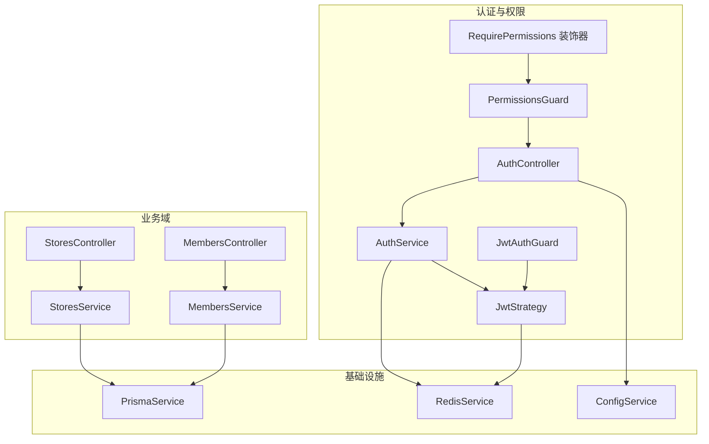
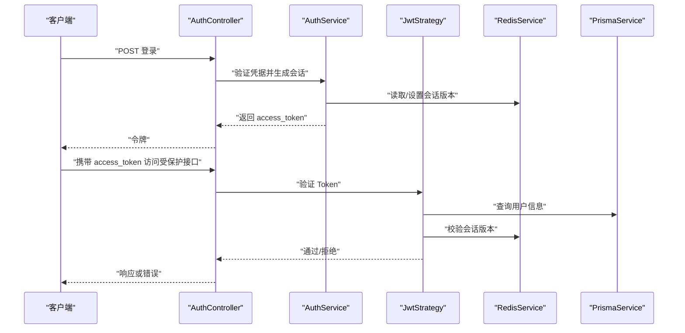
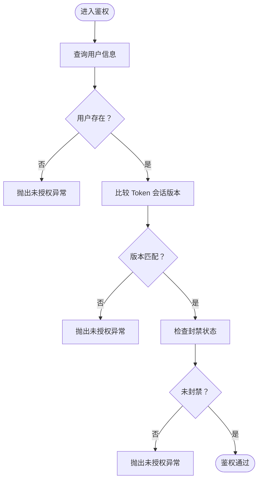
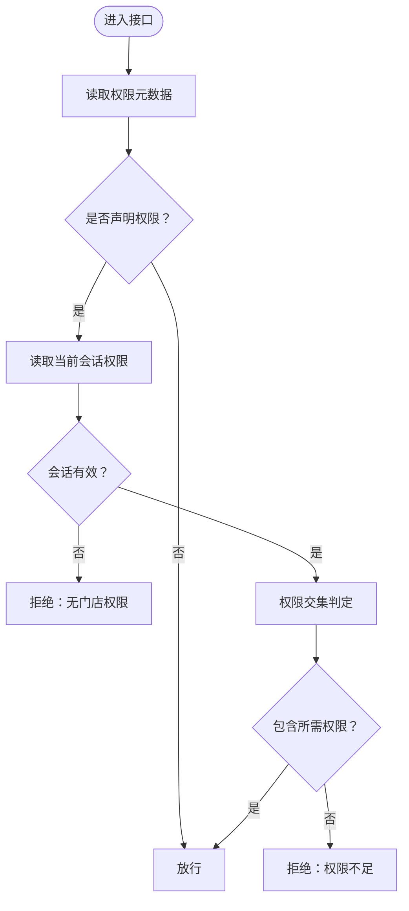
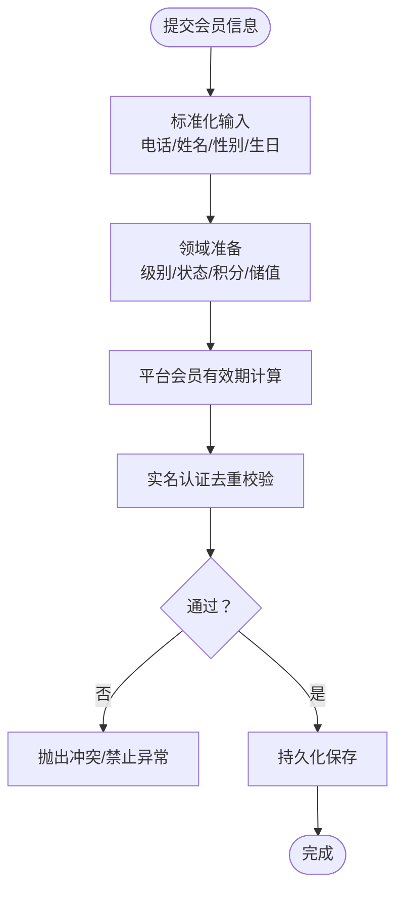
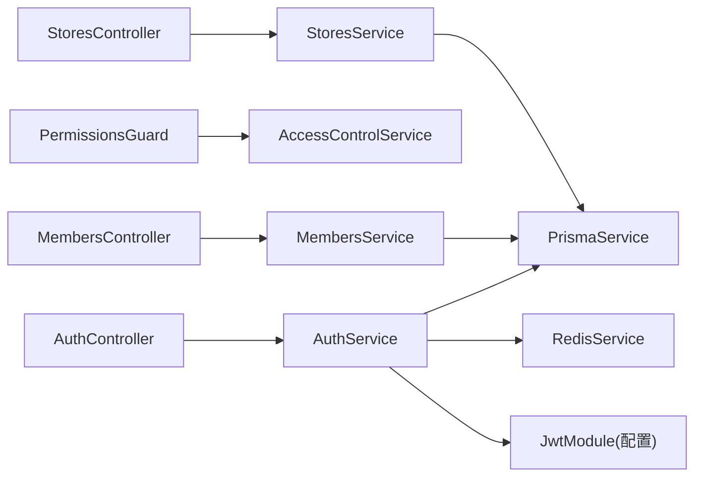

# 常见问题解决

<cite>
**本文引用的文件**
- [src/purely-profit/auth/strategies/jwt.strategy.ts](file://src/purely-profit/auth/strategies/jwt.strategy.ts)
- [src/purely-profit/auth/auth-session.service.ts](file://src/purely-profit/auth/auth-session.service.ts)
- [src/purely-profit/auth/auth.module.ts](file://src/purely-profit/auth/auth.module.ts)
- [src/purely-profit/access-control/guards/permissions.guard.ts](file://src/purely-profit/access-control/guards/permissions.guard.ts)
- [src/purely-profit/access-control/decorators/require-permissions.decorator.ts](file://src/purely-profit/access-control/decorators/require-permissions.decorator.ts)
- [src/purely-profit/access-control/access-control.module.ts](file://src/purely-profit/access-control/access-control.module.ts)
- [src/purely-profit/auth/auth.controller.ts](file://src/purely-profit/auth/auth.controller.ts)
- [src/purely-profit/auth/auth.service.ts](file://src/purely-profit/auth/auth.service.ts)
- [src/purely-profit/stores/stores.controller.ts](file://src/purely-profit/stores/stores.controller.ts)
- [src/purely-profit/stores/stores.service.ts](file://src/purely-profit/stores/stores.service.ts)
- [src/purely-profit/member/members/members.controller.ts](file://src/purely-profit/member/members/members.controller.ts)
- [src/purely-profit/member/members/members.service.ts](file://src/purely-profit/member/members/members.service.ts)
- [src/purely-profit/member/members/members.domain.ts](file://src/purely-profit/member/members/members.domain.ts)
- [src/purely-profit/member/platform-membership/membership-expiry.utils.ts](file://src/purely-profit/member/platform-membership/membership-expiry.utils.ts)
- [src/prisma/prisma.service.ts](file://src/prisma/prisma.service.ts)
- [src/config/configuration.ts](file://src/config/configuration.ts)
- [src/redis/redis.service.ts](file://src/redis/redis.service.ts)
- [src/app.module.ts](file://src/app.module.ts)
</cite>

## 目录
1. [简介](#简介)
2. [项目结构](#项目结构)
3. [核心组件](#核心组件)
4. [架构总览](#架构总览)
5. [详细组件分析](#详细组件分析)
6. [依赖关系分析](#依赖关系分析)
7. [性能考虑](#性能考虑)
8. [故障排除指南](#故障排除指南)
9. [结论](#结论)
10. [附录](#附录)

## 简介
本指南面向运维与技术支持人员，聚焦于 purelyprofit-server 在实际运行中可能遇到的常见业务问题：用户登录失败、权限拒绝、门店创建失败、会员注册异常等。文档从认证与权限、业务数据冲突、系统配置与基础设施三个维度给出诊断思路、复现步骤、日志分析方法与快速修复建议，并辅以可视化图示帮助定位问题根因。

## 项目结构
后端采用 NestJS 模块化组织，认证与权限控制集中在 auth 与 access-control 子模块；业务域按功能拆分（如 stores、member、marketing 等）。认证采用 JWT，权限通过装饰器与守卫组合实现；Redis 用于会话版本与缓存；Prisma 负责数据库访问。

图表来源
- [src/purely-profit/auth/auth.controller.ts](file://src/purely-profit/auth/auth.controller.ts)
- [src/purely-profit/auth/auth.service.ts](file://src/purely-profit/auth/auth.service.ts)
- [src/purely-profit/auth/strategies/jwt.strategy.ts](file://src/purely-profit/auth/strategies/jwt.strategy.ts)
- [src/purely-profit/access-control/guards/permissions.guard.ts](file://src/purely-profit/access-control/guards/permissions.guard.ts)
- [src/purely-profit/access-control/decorators/require-permissions.decorator.ts](file://src/purely-profit/access-control/decorators/require-permissions.decorator.ts)
- [src/purely-profit/stores/stores.controller.ts](file://src/purely-profit/stores/stores.controller.ts)
- [src/purely-profit/stores/stores.service.ts](file://src/purely-profit/stores/stores.service.ts)
- [src/purely-profit/member/members/members.controller.ts](file://src/purely-profit/member/members/members.controller.ts)
- [src/purely-profit/member/members/members.service.ts](file://src/purely-profit/member/members/members.service.ts)
- [src/prisma/prisma.service.ts](file://src/prisma/prisma.service.ts)
- [src/redis/redis.service.ts](file://src/redis/redis.service.ts)
- [src/config/configuration.ts](file://src/config/configuration.ts)

章节来源
- [src/app.module.ts](file://src/app.module.ts)
- [src/purely-profit/auth/auth.module.ts](file://src/purely-profit/auth/auth.module.ts)
- [src/purely-profit/access-control/access-control.module.ts](file://src/purely-profit/access-control/access-control.module.ts)

## 核心组件
- 认证与会话
  - JwtStrategy：校验 Token、检查会话版本、封禁状态、构建用户上下文。
  - AuthSessionService：签发 Token、提升会话版本、读取版本。
  - AuthController/AuthService：登录、注册、重置密码、实名认证等入口。
- 权限控制
  - PermissionsGuard：基于装饰器声明的权限码进行判定。
  - RequirePermissions 装饰器：在控制器/方法上声明所需权限。
- 业务服务
  - StoresService：门店创建、查询、更新等。
  - MembersService：会员创建、查询、积分/储值等。
- 基础设施
  - PrismaService：数据库访问。
  - RedisService：会话版本存储与缓存。
  - ConfigService：JWT 密钥、过期时间等配置。

章节来源
- [src/purely-profit/auth/strategies/jwt.strategy.ts:80-110](file://src/purely-profit/auth/strategies/jwt.strategy.ts#L80-L110)
- [src/purely-profit/auth/auth-session.service.ts:16-46](file://src/purely-profit/auth/auth-session.service.ts#L16-L46)
- [src/purely-profit/access-control/guards/permissions.guard.ts:19-53](file://src/purely-profit/access-control/guards/permissions.guard.ts#L19-L53)
- [src/purely-profit/access-control/decorators/require-permissions.decorator.ts:1-7](file://src/purely-profit/access-control/decorators/require-permissions.decorator.ts#L1-L7)
- [src/purely-profit/stores/stores.service.ts](file://src/purely-profit/stores/stores.service.ts)
- [src/purely-profit/member/members/members.service.ts](file://src/purely-profit/member/members/members.service.ts)
- [src/prisma/prisma.service.ts](file://src/prisma/prisma.service.ts)
- [src/redis/redis.service.ts](file://src/redis/redis.service.ts)
- [src/config/configuration.ts](file://src/config/configuration.ts)

## 架构总览
下图展示登录到权限校验的关键流程，以及与数据库、缓存的交互。

图表来源
- [src/purely-profit/auth/auth.controller.ts](file://src/purely-profit/auth/auth.controller.ts)
- [src/purely-profit/auth/auth.service.ts](file://src/purely-profit/auth/auth.service.ts)
- [src/purely-profit/auth/strategies/jwt.strategy.ts:80-110](file://src/purely-profit/auth/strategies/jwt.strategy.ts#L80-L110)
- [src/redis/redis.service.ts](file://src/redis/redis.service.ts)
- [src/prisma/prisma.service.ts](file://src/prisma/prisma.service.ts)

## 详细组件分析

### 认证与会话（Token 过期/会话失效）
- 关键点
  - 会话版本：每次强制登出或关键操作会提升版本，旧 Token 将被拒绝。
  - 用户存在性与封禁：策略会检查用户是否存在及是否被封禁。
  - JWT 配置：密钥与过期时间由配置服务提供。
- 常见症状
  - 提示“登录态已失效，请重新登录”。
  - 同一账号在多端登录导致旧 Token 失效。
- 诊断步骤
  - 检查 Redis 中用户会话版本键值是否递增。
  - 校验 ConfigService 中 jwt.secret 与 jwt.expiresIn。
  - 查看策略对用户状态与封禁标记的判断。
- 快速修复
  - 强制提升会话版本后引导用户重新登录。
  - 校正配置项后重启服务。

图表来源
- [src/purely-profit/auth/strategies/jwt.strategy.ts:80-110](file://src/purely-profit/auth/strategies/jwt.strategy.ts#L80-L110)
- [src/purely-profit/auth/auth-session.service.ts:31-46](file://src/purely-profit/auth/auth-session.service.ts#L31-L46)

章节来源
- [src/purely-profit/auth/strategies/jwt.strategy.ts:80-110](file://src/purely-profit/auth/strategies/jwt.strategy.ts#L80-L110)
- [src/purely-profit/auth/auth-session.service.ts:16-46](file://src/purely-profit/auth/auth-session.service.ts#L16-L46)
- [src/purely-profit/auth/auth.module.ts:21-55](file://src/purely-profit/auth/auth.module.ts#L21-L55)
- [src/config/configuration.ts](file://src/config/configuration.ts)

### 权限控制（权限不足/无门店权限）
- 关键点
  - RequirePermissions 装饰器声明所需权限码。
  - PermissionsGuard 读取当前门店会话的权限集合，进行交集判定。
  - 若当前会话无有效权限，直接拒绝。
- 常见症状
  - “当前账号暂无门店权限”或“当前账号缺少接口访问权限”。
- 诊断步骤
  - 确认控制器/方法是否标注了 RequirePermissions。
  - 检查请求上下文中 currentMembership 是否存在且激活。
  - 核对权限集合是否包含所需权限码。
- 快速修复
  - 为当前用户授予所需权限或切换到有权限的门店会话。

图表来源
- [src/purely-profit/access-control/guards/permissions.guard.ts:19-53](file://src/purely-profit/access-control/guards/permissions.guard.ts#L19-L53)
- [src/purely-profit/access-control/decorators/require-permissions.decorator.ts:1-7](file://src/purely-profit/access-control/decorators/require-permissions.decorator.ts#L1-L7)

章节来源
- [src/purely-profit/access-control/guards/permissions.guard.ts:19-53](file://src/purely-profit/access-control/guards/permissions.guard.ts#L19-L53)
- [src/purely-profit/access-control/decorators/require-permissions.decorator.ts:1-7](file://src/purely-profit/access-control/decorators/require-permissions.decorator.ts#L1-L7)
- [src/purely-profit/access-control/access-control.module.ts:1-22](file://src/purely-profit/access-control/access-control.module.ts#L1-L22)

### 门店创建（创建失败/重复提交）
- 关键点
  - StoresService 负责创建与写入逻辑，通常会进行幂等性与唯一性约束检查。
  - 数据库层约束（如唯一索引）可能导致插入冲突。
- 常见症状
  - 插入时报唯一约束冲突或业务规则不满足。
- 诊断步骤
  - 检查请求参数是否重复（如名称/编号）。
  - 查看数据库迁移与索引定义，确认冲突来源。
  - 审核 StoresService 的前置校验与事务边界。
- 快速修复
  - 更换唯一标识或清理重复数据后重试。
  - 优化幂等逻辑，避免并发重复提交。

章节来源
- [src/purely-profit/stores/stores.controller.ts](file://src/purely-profit/stores/stores.controller.ts)
- [src/purely-profit/stores/stores.service.ts](file://src/purely-profit/stores/stores.service.ts)

### 会员注册/变更（异常/冲突）
- 关键点
  - MembersService 负责会员创建与更新，包含输入规范化、状态与积分/储值字段处理。
  - 平台会员有效期工具用于计算到期时间与有效性。
  - 实名认证场景下同一身份证号不可绑定多个账号。
- 常见症状
  - 重复手机号/身份证冲突、状态非法、有效期计算异常。
- 诊断步骤
  - 核对输入字段标准化（电话、姓名、性别、生日等）。
  - 检查平台会员计划配置与有效期计算逻辑。
  - 审视实名认证时的去重校验。
- 快速修复
  - 规范化输入后再提交。
  - 校正会员计划配置或手动修正历史数据。

图表来源
- [src/purely-profit/member/members/members.domain.ts:55-105](file://src/purely-profit/member/members/members.domain.ts#L55-L105)
- [src/purely-profit/member/platform-membership/membership-expiry.utils.ts:8-49](file://src/purely-profit/member/platform-membership/membership-expiry.utils.ts#L8-L49)
- [src/purely-profit/auth/auth.service.ts](file://src/purely-profit/auth/auth.service.ts)

章节来源
- [src/purely-profit/member/members/members.domain.ts:55-105](file://src/purely-profit/member/members/members.domain.ts#L55-L105)
- [src/purely-profit/member/platform-membership/membership-expiry.utils.ts:8-49](file://src/purely-profit/member/platform-membership/membership-expiry.utils.ts#L8-L49)
- [src/purely-profit/auth/auth.service.ts](file://src/purely-profit/auth/auth.service.ts)

## 依赖关系分析
- 组件耦合
  - AuthController 依赖 AuthService；AuthService 依赖 Prisma/Redis/JWT。
  - PermissionsGuard 依赖 AccessControlService 与反射元数据。
  - 业务控制器依赖各自 Service，Service 依赖 Prisma。
- 外部依赖
  - Redis：会话版本与缓存。
  - 数据库：Prisma 管理连接与迁移。
  - 配置：JWT 密钥与过期时间。

图表来源
- [src/purely-profit/auth/auth.controller.ts](file://src/purely-profit/auth/auth.controller.ts)
- [src/purely-profit/auth/auth.service.ts](file://src/purely-profit/auth/auth.service.ts)
- [src/purely-profit/access-control/guards/permissions.guard.ts](file://src/purely-profit/access-control/guards/permissions.guard.ts)
- [src/purely-profit/stores/stores.controller.ts](file://src/purely-profit/stores/stores.controller.ts)
- [src/purely-profit/member/members/members.controller.ts](file://src/purely-profit/member/members/members.controller.ts)
- [src/prisma/prisma.service.ts](file://src/prisma/prisma.service.ts)
- [src/redis/redis.service.ts](file://src/redis/redis.service.ts)
- [src/purely-profit/auth/auth.module.ts:21-55](file://src/purely-profit/auth/auth.module.ts#L21-L55)

章节来源
- [src/purely-profit/auth/auth.module.ts:21-55](file://src/purely-profit/auth/auth.module.ts#L21-L55)
- [src/purely-profit/access-control/access-control.module.ts:1-22](file://src/purely-profit/access-control/access-control.module.ts#L1-L22)

## 性能考虑
- 缓存预热与热点键
  - 使用缓存预热服务减少冷启动与热点查询延迟。
- 会话版本与并发
  - 会话版本提升会触发旧 Token 失效，需避免频繁强制登出。
- 数据库索引
  - 确保高频查询字段建立合适索引，降低锁竞争。

[本节为通用指导，无需列出具体文件来源]

## 故障排除指南

### 一、认证相关问题

- 症状：登录后立即提示“登录态已失效，请重新登录”
  - 可能原因
    - 会话版本不匹配（多端登录或强制登出）。
    - JWT 密钥或过期时间配置错误。
  - 复现步骤
    - 使用同一账号在两处登录，旧 Token 即将失效。
    - 修改 jwt.secret 或 jwt.expiresIn 后重启服务。
  - 日志分析
    - 关注鉴权策略中的会话版本比较与封禁检查。
  - 快速修复
    - 引导用户重新登录；核对配置项并重启服务。

章节来源
- [src/purely-profit/auth/strategies/jwt.strategy.ts:80-110](file://src/purely-profit/auth/strategies/jwt.strategy.ts#L80-L110)
- [src/purely-profit/auth/auth-session.service.ts:31-46](file://src/purely-profit/auth/auth-session.service.ts#L31-L46)
- [src/purely-profit/auth/auth.module.ts:21-55](file://src/purely-profit/auth/auth.module.ts#L21-L55)

- 症状：Token 有效但接口返回“未授权”
  - 可能原因
    - 用户被封禁或账户状态异常。
  - 复现步骤
    - 对封禁用户发起请求。
  - 日志分析
    - 查看策略对封禁状态的判断分支。
  - 快速修复
    - 解封账户或更换正常账号。

章节来源
- [src/purely-profit/auth/strategies/jwt.strategy.ts:80-110](file://src/purely-profit/auth/strategies/jwt.strategy.ts#L80-L110)

- 症状：登录成功但无法访问受保护接口
  - 可能原因
    - 未正确设置 RequirePermissions 元数据或权限不足。
  - 复现步骤
    - 在控制器/方法上添加权限装饰器，使用无权限账号访问。
  - 日志分析
    - 检查 PermissionsGuard 的元数据读取与权限判定。
  - 快速修复
    - 授予所需权限或切换到有权限的门店会话。

章节来源
- [src/purely-profit/access-control/guards/permissions.guard.ts:19-53](file://src/purely-profit/access-control/guards/permissions.guard.ts#L19-L53)
- [src/purely-profit/access-control/decorators/require-permissions.decorator.ts:1-7](file://src/purely-profit/access-control/decorators/require-permissions.decorator.ts#L1-L7)

### 二、业务数据问题

- 症状：门店创建失败（唯一约束冲突）
  - 可能原因
    - 名称/编号重复；数据库唯一索引触发。
  - 复现步骤
    - 使用相同名称/编号重复提交。
  - 日志分析
    - 定位 StoresService 的写入路径与数据库约束。
  - 快速修复
    - 更换唯一标识或清理重复数据后重试。

章节来源
- [src/purely-profit/stores/stores.controller.ts](file://src/purely-profit/stores/stores.controller.ts)
- [src/purely-profit/stores/stores.service.ts](file://src/purely-profit/stores/stores.service.ts)

- 症状：会员注册/变更异常（重复身份证、状态非法）
  - 可能原因
    - 实名认证时同一身份证号绑定多个账号；状态转换不符合预期。
  - 复现步骤
    - 使用同一身份证号注册两个账号；提交非法状态。
  - 日志分析
    - 审核 MembersDomain 的输入规范化与状态映射。
  - 快速修复
    - 规范化输入；修正状态或联系人工处理。

章节来源
- [src/purely-profit/member/members/members.domain.ts:55-105](file://src/purely-profit/member/members/members.domain.ts#L55-L105)
- [src/purely-profit/auth/auth.service.ts](file://src/purely-profit/auth/auth.service.ts)

### 三、系统配置问题

- 症状：JWT 相关异常（签名无效/过期）
  - 可能原因
    - jwt.secret 不一致或 jwt.expiresIn 配置不当。
  - 复现步骤
    - 修改密钥后未重启或过期时间过短。
  - 日志分析
    - 查看 JwtModule 注册与配置加载。
  - 快速修复
    - 统一密钥并重启服务；调整过期时间至合理范围。

章节来源
- [src/purely-profit/auth/auth.module.ts:21-55](file://src/purely-profit/auth/auth.module.ts#L21-L55)
- [src/config/configuration.ts](file://src/config/configuration.ts)

- 症状：数据库连接失败
  - 可能原因
    - 数据库地址/凭据错误；网络不可达。
  - 复现步骤
    - 启动时连接超时或报错。
  - 日志分析
    - 定位 PrismaService 初始化与连接池。
  - 快速修复
    - 校正连接字符串与网络策略；确保可达性。

章节来源
- [src/prisma/prisma.service.ts](file://src/prisma/prisma.service.ts)

- 症状：Redis 连接失败或会话版本读取异常
  - 可能原因
    - Redis 地址/认证错误；网络隔离。
  - 复现步骤
    - 会话版本读取失败或 Token 校验异常。
  - 日志分析
    - 定位 RedisService 的读写路径。
  - 快速修复
    - 校正 Redis 配置与网络；恢复服务后重试。

章节来源
- [src/redis/redis.service.ts](file://src/redis/redis.service.ts)

## 结论
本指南围绕认证与权限、业务数据、系统配置三大类问题提供了可执行的诊断与修复路径。建议在生产环境中结合缓存预热、索引优化与监控告警，持续降低登录失败、权限拒绝与数据冲突的发生概率。

## 附录

### A. 常见错误码与含义
- 未授权（登录态失效/用户不存在/封禁）
- 禁止访问（无门店权限/权限不足）
- 冲突（重复身份证/重复门店标识）
- 参数错误（状态非法/必填缺失）

### B. 快速检查清单
- 认证
  - Redis 会话版本键是否存在且递增。
  - jwt.secret 与 jwt.expiresIn 配置一致且生效。
- 权限
  - 控制器/方法是否声明 RequirePermissions。
  - 当前会话权限集合是否包含所需权限。
- 业务
  - 输入字段是否标准化（电话/姓名/性别/生日）。
  - 重复标识是否清理干净。
- 基础设施
  - Prisma/Redis 连接是否可用。
  - 配置文件是否加载成功。