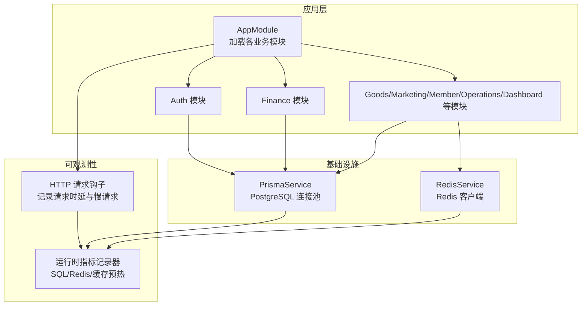
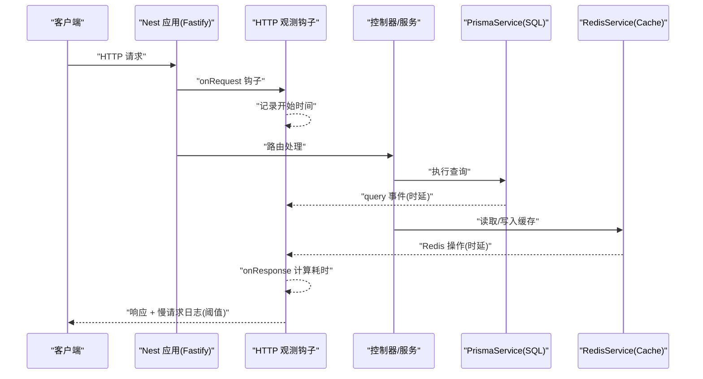
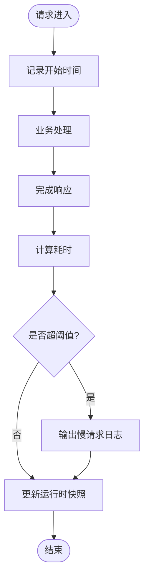
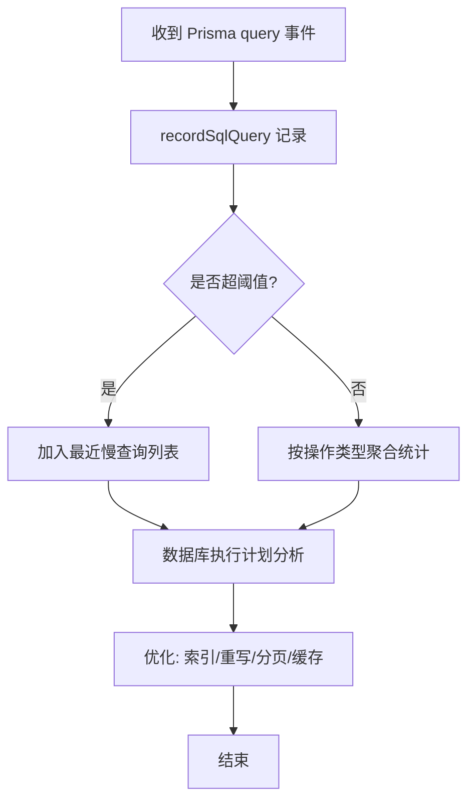
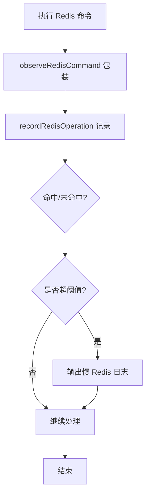
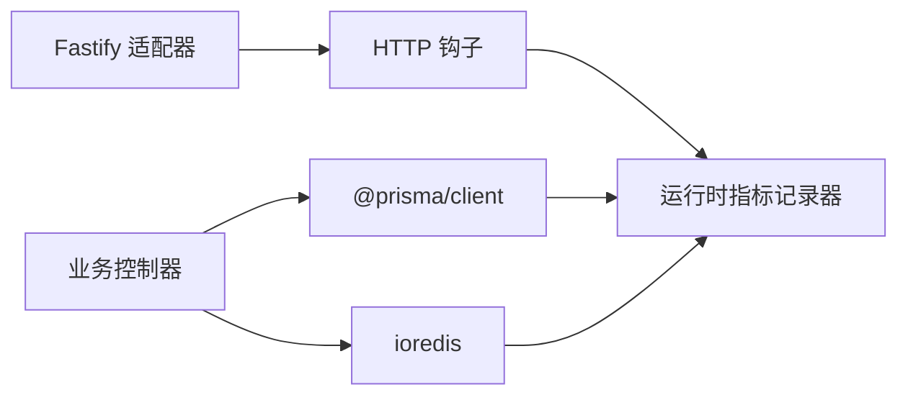

# 性能问题诊断

<cite>
**本文引用的文件**
- [README.md](file://README.md)
- [package.json](file://package.json)
- [src/main.ts](file://src/main.ts)
- [src/app.module.ts](file://src/app.module.ts)
- [src/observability/index.ts](file://src/observability/index.ts)
- [src/observability/runtime-metrics.ts](file://src/observability/runtime-metrics.ts)
- [src/observability/runtime-metrics.recorders.ts](file://src/observability/runtime-metrics.recorders.ts)
- [src/prisma/prisma.service.ts](file://src/prisma/prisma.service.ts)
- [src/redis/redis.service.ts](file://src/redis/redis.service.ts)
- [prisma/schema.prisma](file://prisma/schema.prisma)
</cite>

## 目录
1. [简介](#简介)
2. [项目结构](#项目结构)
3. [核心组件](#核心组件)
4. [架构总览](#架构总览)
5. [详细组件分析](#详细组件分析)
6. [依赖关系分析](#依赖关系分析)
7. [性能考量与优化建议](#性能考量与优化建议)
8. [故障排查指南](#故障排查指南)
9. [结论](#结论)
10. [附录](#附录)

## 简介
本指南面向 purelyprofit-server 的性能问题诊断与优化，聚焦以下关键场景：
- 数据库查询慢
- 缓存命中率低
- API 响应时间长
- 内存占用过高
- CPU 使用率异常

内容涵盖性能监控指标解读、慢查询分析工具使用、缓存与数据库优化策略、压力测试与基准测试方法、资源使用分析及可落地的优化方案。

## 项目结构
该项目基于 NestJS + Fastify，采用模块化设计，核心模块包括认证、财务、商品、营销、会员、运营、仪表盘等；同时内置可观测性（HTTP/SQL/Redis/缓存预热）与 Prisma + PostgreSQL、Redis 客户端集成。

图表来源
- [src/app.module.ts:39-78](file://src/app.module.ts#L39-L78)
- [src/main.ts:121-204](file://src/main.ts#L121-L204)
- [src/prisma/prisma.service.ts:8-63](file://src/prisma/prisma.service.ts#L8-L63)
- [src/redis/redis.service.ts:8-166](file://src/redis/redis.service.ts#L8-L166)
- [src/observability/runtime-metrics.recorders.ts:50-210](file://src/observability/runtime-metrics.recorders.ts#L50-L210)

章节来源
- [src/app.module.ts:1-83](file://src/app.module.ts#L1-L83)
- [src/main.ts:1-209](file://src/main.ts#L1-L209)
- [package.json:31-58](file://package.json#L31-L58)

## 核心组件
- 应用引导与 HTTP 观测
  - Fastify 适配器、全局校验管道、CORS、Swagger 文档、端口回退、HTTP 钩子记录请求时延与慢请求日志。
- 观测性与运行时指标
  - 统一记录 HTTP 请求、SQL 查询、Redis 操作、缓存预热周期与慢键样本，支持快照与摘要导出。
- 数据访问层
  - Prisma 客户端通过连接池访问 PostgreSQL，开启 query 事件以记录慢查询。
- 缓存层
  - Redis 客户端封装常用命令，统一记录慢操作并支持后台刷新任务。

章节来源
- [src/main.ts:32-75](file://src/main.ts#L32-L75)
- [src/observability/runtime-metrics.recorders.ts:14-48](file://src/observability/runtime-metrics.recorders.ts#L14-L48)
- [src/prisma/prisma.service.ts:37-53](file://src/prisma/prisma.service.ts#L37-L53)
- [src/redis/redis.service.ts:141-166](file://src/redis/redis.service.ts#L141-L166)

## 架构总览
下图展示从客户端请求到数据库/缓存的关键路径与观测点：

图表来源
- [src/main.ts:40-74](file://src/main.ts#L40-L74)
- [src/prisma/prisma.service.ts:37-53](file://src/prisma/prisma.service.ts#L37-L53)
- [src/redis/redis.service.ts:141-166](file://src/redis/redis.service.ts#L141-L166)
- [src/observability/runtime-metrics.recorders.ts:50-210](file://src/observability/runtime-metrics.recorders.ts#L50-L210)

## 详细组件分析

### HTTP 请求观测与慢请求定位
- 关键机制
  - onRequest/onResponse 钩子记录每个请求的起止时间，计算时延并调用记录器。
  - 支持慢请求阈值配置，超过阈值输出警告日志。
- 典型问题定位
  - 高 P95/P99 响应时间：结合慢请求列表与路由级统计，定位慢 endpoint。
  - 5xx 错误增多：关注错误请求数量占比，配合 requestId 追踪。
- 可视化流程

图表来源
- [src/main.ts:40-74](file://src/main.ts#L40-L74)
- [src/observability/runtime-metrics.recorders.ts:50-114](file://src/observability/runtime-metrics.recorders.ts#L50-L114)

章节来源
- [src/main.ts:160-164](file://src/main.ts#L160-L164)
- [src/observability/runtime-metrics.recorders.ts:50-114](file://src/observability/runtime-metrics.recorders.ts#L50-L114)

### SQL 查询观测与慢查询分析
- 关键机制
  - Prisma $on('query') 事件捕获 SQL 与耗时，调用记录器并按阈值输出慢查询日志。
  - 支持按操作类型聚合统计（如 SELECT/INSERT/UPDATE/DELETE），便于识别热点。
- 慢查询分析步骤
  - 查看慢查询计数与最近慢查询列表，确认是否存在重复或高成本查询。
  - 结合路由与服务调用栈，定位具体业务逻辑引发的 N+1 或全表扫描。
  - 使用数据库 EXPLAIN/ANALYZE 分析执行计划，补充索引或重写查询。
- 可视化流程

图表来源
- [src/prisma/prisma.service.ts:37-53](file://src/prisma/prisma.service.ts#L37-L53)
- [src/observability/runtime-metrics.recorders.ts:116-152](file://src/observability/runtime-metrics.recorders.ts#L116-L152)

章节来源
- [src/prisma/prisma.service.ts:27-31](file://src/prisma/prisma.service.ts#L27-L31)
- [src/observability/runtime-metrics.recorders.ts:116-152](file://src/observability/runtime-metrics.recorders.ts#L116-L152)

### Redis 缓存观测与慢操作定位
- 关键机制
  - 封装 GET/SET/DEL/SCAN 等命令，统一记录时延、命中/未命中状态与慢操作。
  - 提供后台刷新任务管理，避免缓存雪崩与抖动。
- 缓存问题定位
  - 命中率低：查看慢操作中 miss 占比，检查 key 设计与 TTL。
  - 热点 key 延迟：关注慢操作列表中的热点命令与 key。
  - 批量删除/扫描：注意 SCAN/COUNT 参数与批量 del 的影响。
- 可视化流程

图表来源
- [src/redis/redis.service.ts:141-166](file://src/redis/redis.service.ts#L141-L166)
- [src/observability/runtime-metrics.recorders.ts:154-210](file://src/observability/runtime-metrics.recorders.ts#L154-L210)

章节来源
- [src/redis/redis.service.ts:15-20](file://src/redis/redis.service.ts#L15-L20)
- [src/redis/redis.service.ts:125-139](file://src/redis/redis.service.ts#L125-L139)
- [src/observability/runtime-metrics.recorders.ts:154-210](file://src/observability/runtime-metrics.recorders.ts#L154-L210)

### 缓存预热观测与性能快照
- 关键机制
  - 记录缓存预热周期次数、总时长、最大时长、命中/刷新/跳过/失效/失败计数。
  - 支持按类别（仪表盘首页/业务分析/财务概览）统计慢键样本与耗时分布。
- 优化方向
  - 降低失败/跳过比例：完善 key 命中策略与过期策略。
  - 优化最慢键：针对慢键样本进行查询/序列化优化。
- 快照与摘要导出用于持续监控与回归对比。

章节来源
- [src/observability/runtime-metrics.recorders.ts:212-340](file://src/observability/runtime-metrics.recorders.ts#L212-L340)
- [src/observability/runtime-metrics.ts:8-11](file://src/observability/runtime-metrics.ts#L8-L11)

## 依赖关系分析
- 外部依赖
  - Fastify 作为 HTTP 服务器，具备高性能与较低 GC 压力。
  - Prisma + PostgreSQL，连接池参数可调优。
  - ioredis + Redis，支持后台刷新与批量操作。
- 内部耦合
  - 控制器/服务依赖 PrismaService/RedisService，统一通过记录器上报指标。
  - 观测性模块对业务透明，仅在关键路径埋点。

图表来源
- [src/main.ts:136-144](file://src/main.ts#L136-L144)
- [src/prisma/prisma.service.ts:32-35](file://src/prisma/prisma.service.ts#L32-L35)
- [src/redis/redis.service.ts:23-28](file://src/redis/redis.service.ts#L23-L28)
- [src/observability/runtime-metrics.recorders.ts:50-210](file://src/observability/runtime-metrics.recorders.ts#L50-L210)

章节来源
- [package.json:31-58](file://package.json#L31-L58)
- [src/app.module.ts:39-78](file://src/app.module.ts#L39-L78)

## 性能考量与优化建议

### 数据库查询优化
- 索引与执行计划
  - 使用 EXPLAIN/ANALYZE 分析慢查询，优先为高频过滤/排序字段建立索引。
  - 避免全表扫描与隐式转换，确保查询谓词走索引。
- 连接池与并发
  - 调整连接池上限与空闲超时，平衡并发与资源占用。
  - 对热点查询增加只读副本或缓存中间层。
- 查询模式
  - 消除 N+1 查询：使用 include/@@relation 预加载或批量查询。
  - 分页与限制：避免一次性返回大结果集。

章节来源
- [src/prisma/prisma.service.ts:15-25](file://src/prisma/prisma.service.ts#L15-L25)
- [prisma/schema.prisma:8-10](file://prisma/schema.prisma#L8-L10)

### 缓存命中率提升
- Key 设计与 TTL
  - 合理命名与层级结构，避免键空间碎片化。
  - 为热点数据设置更长 TTL，并启用后台刷新。
- 命中策略
  - 先查缓存，后查 DB；缓存未命中再回源并写回。
  - 对于批量读取，使用流水线/事务减少 RTT。
- 清理与扫描
  - 谨慎使用 SCAN/COUNT，必要时分批处理并设置上限。

章节来源
- [src/redis/redis.service.ts:35-88](file://src/redis/redis.service.ts#L35-L88)
- [src/redis/redis.service.ts:125-139](file://src/redis/redis.service.ts#L125-L139)

### API 响应时间优化
- 路由与中间件
  - 减少不必要的拦截器/守卫，合并鉴权与权限检查。
  - 启用压缩与合理的缓存头。
- 异步与并发
  - 并行化独立请求，合理拆分任务。
  - 控制并发度，避免阻塞事件循环。

章节来源
- [src/main.ts:146-152](file://src/main.ts#L146-L152)

### 内存与 CPU 使用优化
- 内存
  - 避免大对象深拷贝与闭包持有，及时释放临时变量。
  - 监控快照，识别内存泄漏与峰值波动。
- CPU
  - 识别热点算法与循环，使用更高效的数据结构。
  - 降低序列化/反序列化开销，必要时采用二进制协议。

章节来源
- [src/observability/runtime-metrics.recorders.ts:14-48](file://src/observability/runtime-metrics.recorders.ts#L14-L48)

### 压力测试与基准测试
- 方法论
  - 使用稳定流量与阶梯式负载，观察 P50/P95/P99 与错误率变化。
  - 分离数据库与缓存压力，评估隔离效果。
- 工具建议
  - HTTP 层：wrk/Artillery/JMeter。
  - 数据库层：pgbench/自定义脚本。
  - 缓存层：redis-benchmark。
- 输出指标
  - 吞吐、延迟分布、错误率、资源使用（CPU/内存/IO）。

章节来源
- [src/main.ts:160-164](file://src/main.ts#L160-L164)
- [src/prisma/prisma.service.ts:27-31](file://src/prisma/prisma.service.ts#L27-L31)
- [src/redis/redis.service.ts:15-20](file://src/redis/redis.service.ts#L15-L20)

### 性能基准测试
- 基准场景
  - 登录/查询/写入等核心路径的基线指标。
  - 不同数据规模下的扩展性表现。
- 回归对比
  - 将每次变更后的指标与基线对比，快速发现回归。

章节来源
- [src/observability/runtime-metrics.ts:8-11](file://src/observability/runtime-metrics.ts#L8-L11)

### 资源使用分析
- 指标采集
  - HTTP：总请求数、错误请求数、平均/最大时延、慢请求数。
  - SQL：总查询数、总时延、最大时延、慢查询数、按操作类型聚合。
  - Redis：总调用数、总时延、最大时延、按命令聚合、命中/未命中。
  - 缓存预热：周期数、总时延、最大时延、命中/刷新/跳过/失效/失败计数。
- 快照与摘要
  - 定期导出快照与摘要，形成趋势报告。

章节来源
- [src/observability/runtime-metrics.recorders.ts:14-48](file://src/observability/runtime-metrics.recorders.ts#L14-L48)
- [src/observability/runtime-metrics.ts:8-11](file://src/observability/runtime-metrics.ts#L8-L11)

## 故障排查指南

### 如何识别性能瓶颈
- 步骤一：确认指标来源
  - HTTP：检查慢请求日志与路由统计。
  - SQL：查看慢查询计数与最近慢查询列表。
  - Redis：查看慢操作与 miss 占比。
  - 缓存预热：查看失败/跳过比例与慢键样本。
- 步骤二：定位热点
  - 依据慢请求/慢查询/慢操作的“目标”与“标签”，锁定具体模块与方法。
- 步骤三：根因分析
  - 结合数据库执行计划与代码路径，判断是索引缺失、N+1、缓存策略不当还是并发竞争。

章节来源
- [src/main.ts:67-71](file://src/main.ts#L67-L71)
- [src/prisma/prisma.service.ts:44-52](file://src/prisma/prisma.service.ts#L44-L52)
- [src/redis/redis.service.ts:158-162](file://src/redis/redis.service.ts#L158-L162)
- [src/observability/runtime-metrics.recorders.ts:100-110](file://src/observability/runtime-metrics.recorders.ts#L100-L110)

### 常见问题与处置
- 数据库查询慢
  - 现象：慢查询计数上升、最大时延升高。
  - 处置：补充索引、重写查询、引入缓存、分页/限制。
- 缓存命中率低
  - 现象：慢操作 miss 占比高。
  - 处置：优化 key 命中策略、延长 TTL、后台刷新。
- API 响应时间长
  - 现象：慢请求数上升、P95/P99 显著。
  - 处置：合并请求、异步化、减少序列化、优化中间件。
- 内存占用过高
  - 现象：堆内存峰值升高、GC 压力增大。
  - 处置：避免大对象复制、及时释放资源、检查泄漏。
- CPU 使用率异常
  - 现象：CPU 占用飙升、延迟抖动。
  - 处置：定位热点算法、降载/限流、优化并发。

章节来源
- [src/observability/runtime-metrics.recorders.ts:116-152](file://src/observability/runtime-metrics.recorders.ts#L116-L152)
- [src/observability/runtime-metrics.recorders.ts:154-210](file://src/observability/runtime-metrics.recorders.ts#L154-L210)
- [src/observability/runtime-metrics.recorders.ts:212-340](file://src/observability/runtime-metrics.recorders.ts#L212-L340)

## 结论
通过统一的观测体系与明确的优化路径，可以系统性地定位并缓解性能瓶颈。建议将指标快照与摘要纳入日常运维，结合压力测试与基准测试形成闭环，持续改进系统稳定性与吞吐能力。

## 附录

### 性能监控指标速查
- HTTP
  - 总请求数、错误请求数、平均/最大时延、慢请求数、路由级统计
- SQL
  - 总查询数、总时延、最大时延、慢查询数、按操作类型聚合
- Redis
  - 总调用数、总时延、最大时延、按命令聚合、命中/未命中
- 缓存预热
  - 周期数、总时延、最大时延、命中/刷新/跳过/失效/失败计数、慢键样本

章节来源
- [src/observability/runtime-metrics.recorders.ts:14-48](file://src/observability/runtime-metrics.recorders.ts#L14-L48)
- [src/observability/runtime-metrics.recorders.ts:116-152](file://src/observability/runtime-metrics.recorders.ts#L116-L152)
- [src/observability/runtime-metrics.recorders.ts:154-210](file://src/observability/runtime-metrics.recorders.ts#L154-L210)
- [src/observability/runtime-metrics.recorders.ts:212-340](file://src/observability/runtime-metrics.recorders.ts#L212-L340)