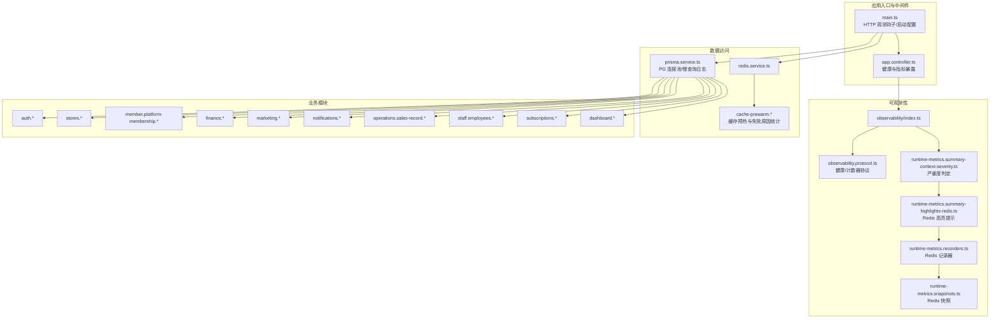
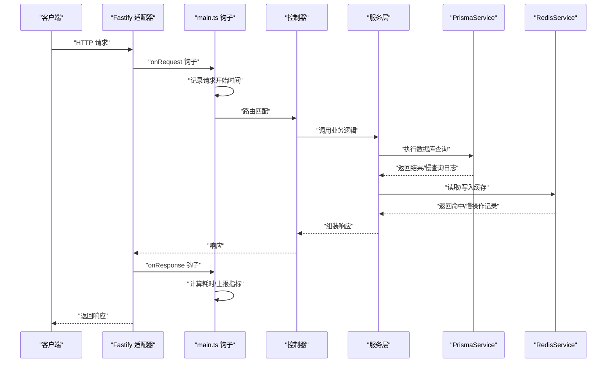
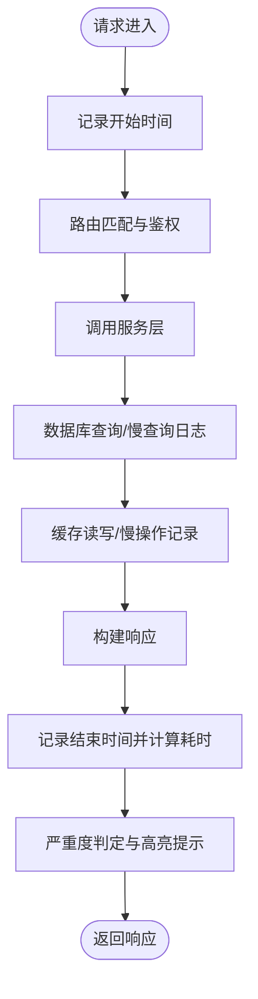
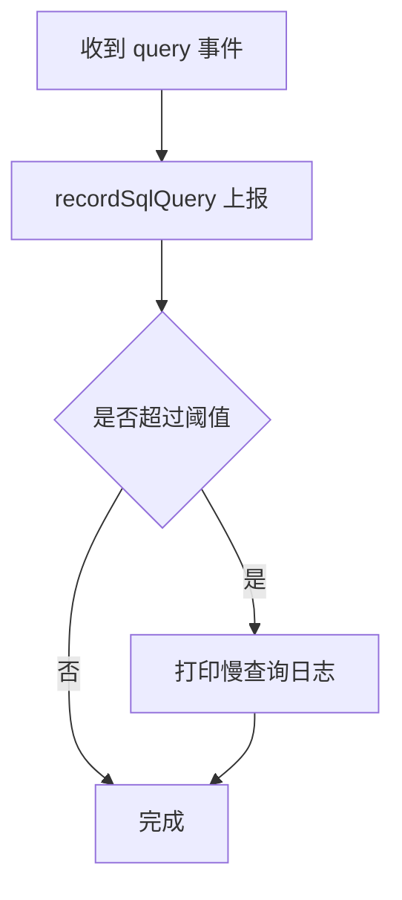
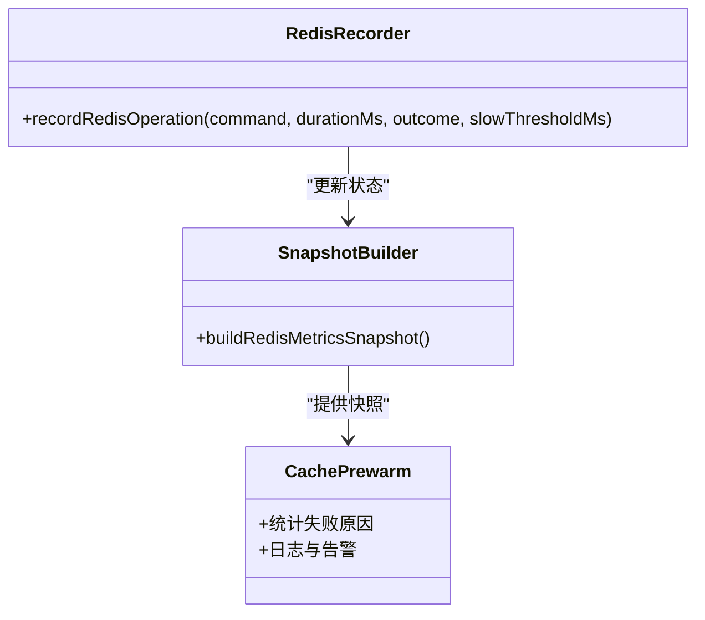
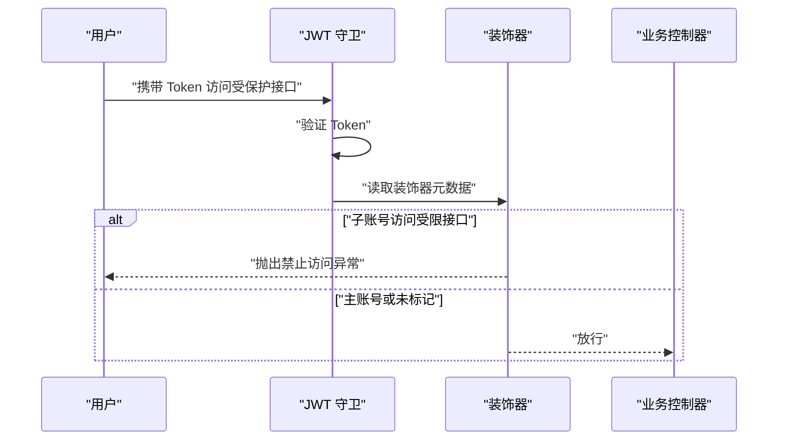
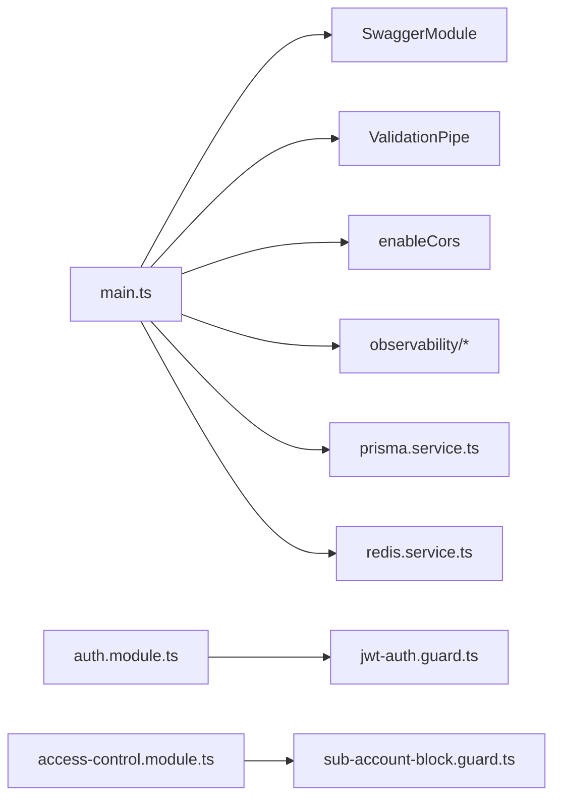
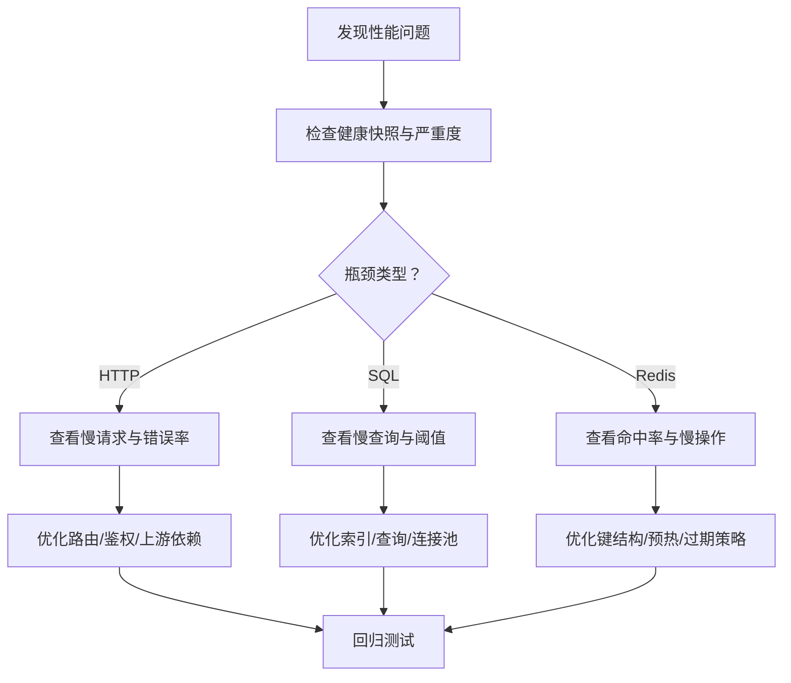

# 故障排除

<cite>
**本文引用的文件**
- [src/main.ts](file://src/main.ts)
- [src/app.controller.ts](file://src/app.controller.ts)
- [src/app.service.ts](file://src/app.service.ts)
- [src/observability/index.ts](file://src/observability/index.ts)
- [src/observability/observability.protocol.ts](file://src/observability/observability.protocol.ts)
- [src/observability/runtime-metrics.summary-context-severity.ts](file://src/observability/runtime-metrics.summary-context-severity.ts)
- [src/observability/runtime-metrics.summary-highlights-redis.ts](file://src/observability/runtime-metrics.summary-highlights-redis.ts)
- [src/observability/runtime-metrics.recorders.ts](file://src/observability/runtime-metrics.recorders.ts)
- [src/observability/runtime-metrics.snapshots.ts](file://src/observability/runtime-metrics.snapshots.ts)
- [src/prisma/prisma.service.ts](file://src/prisma/prisma.service.ts)
- [src/redis/redis.service.ts](file://src/redis/redis.service.ts)
- [src/redis/cache-prewarm.service.ts](file://src/redis/cache-prewarm.service.ts)
- [src/redis/cache-prewarm.executor.ts](file://src/redis/cache-prewarm.executor.ts)
- [src/redis/cache-prewarm.log.ts](file://src/redis/cache-prewarm.log.ts)
- [src/redis/cache-prewarm.error.ts](file://src/redis/cache-prewarm.error.ts)
- [src/purely-profit/access-control/guards/sub-account-block.guard.ts](file://src/purely-profit/access-control/guards/sub-account-block.guard.ts)
- [src/purely-profit/access-control/decorators/block-sub-account.decorator.ts](file://src/purely-profit/access-control/decorators/block-sub-account.decorator.ts)
- [src/purely-profit/auth/auth.controller.ts](file://src/purely-profit/auth/auth.controller.ts)
- [src/purely-profit/auth/auth.service.ts](file://src/purely-profit/auth/auth.service.ts)
- [src/purely-profit/auth/guards/jwt-auth.guard.ts](file://src/purely-profit/auth/guards/jwt-auth.guard.ts)
- [src/purely-profit/auth/strategies/jwt.strategy.ts](file://src/purely-profit/auth/strategies/jwt.strategy.ts)
- [src/purely-profit/stores/stores.controller.ts](file://src/purely-profit/stores/stores.controller.ts)
- [src/purely-profit/stores/stores.service.ts](file://src/purely-profit/stores/stores.service.ts)
- [src/purely-profit/member/platform-membership/platform-membership.controller.ts](file://src/purely-profit/member/platform-membership/platform-membership.controller.ts)
- [src/purely-profit/member/platform-membership/platform-membership.service.ts](file://src/purely-profit/member/platform-membership/platform-membership.service.ts)
- [src/purely-profit/finance/finance.controller.ts](file://src/purely-profit/finance/finance.controller.ts)
- [src/purely-profit/finance/finance.service.ts](file://src/purely-profit/finance/finance.service.ts)
- [src/purely-profit/marketing/marketing.controller.ts](file://src/purely-profit/marketing/marketing.controller.ts)
- [src/purely-profit/marketing/marketing.service.ts](file://src/purely-profit/marketing/marketing.service.ts)
- [src/purely-profit/notifications/notifications.controller.ts](file://src/purely-profit/notifications/notifications.controller.ts)
- [src/purely-profit/notifications/notifications.service.ts](file://src/purely-profit/notifications/notifications.service.ts)
- [src/purely-profit/operations/sales-record/sales-record.controller.ts](file://src/purely-profit/operations/sales-record/sales-record.controller.ts)
- [src/purely-profit/operations/sales-record/sales-record.service.ts](file://src/purely-profit/operations/sales-record/sales-record.service.ts)
- [src/purely-profit/staff/employees/employee.controller.ts](file://src/purely-profit/staff/employees/employee.controller.ts)
- [src/purely-profit/staff/employees/employee.service.ts](file://src/purely-profit/staff/employees/employee.service.ts)
- [src/purely-profit/subscriptions/subscriptions.controller.ts](file://src/purely-profit/subscriptions/subscriptions.controller.ts)
- [src/purely-profit/subscriptions/subscriptions.service.ts](file://src/purely-profit/subscriptions/subscriptions.service.ts)
- [src/purely-profit/dashboard/dashboard-home/dashboard-home.controller.ts](file://src/purely-profit/dashboard/dashboard-home/dashboard-home.controller.ts)
- [src/purely-profit/dashboard/dashboard-home/dashboard-home.service.ts](file://src/purely-profit/dashboard/dashboard-home/dashboard-home.service.ts)
- [src/purely-profit/dashboard/profit-detail/profit-detail.controller.ts](file://src/purely-profit/dashboard/profit-detail/profit-detail.controller.ts)
- [src/purely-profit/dashboard/profit-detail/profit-detail.service.ts](file://src/purely-profit/dashboard/profit-detail/profit-detail.service.ts)
- [src/purely-profit/dashboard/business-analysis/business-analysis.controller.ts](file://src/purely-profit/dashboard/business-analysis/business-analysis.controller.ts)
- [src/purely-profit/dashboard/business-analysis/business-analysis.service.ts](file://src/purely-profit/dashboard/business-analysis/business-analysis.service.ts)
- [src/purely-profit/notifications/notifications.controller.ts](file://src/purely-profit/notifications/notifications.controller.ts)
- [src/purely-profit/notifications/notifications.service.ts](file://src/purely-profit/notifications/notifications.service.ts)
- [src/purely-profit/notifications/notifications-build.service.ts](file://src/purely-profit/notifications/notifications-build.service.ts)
- [src/purely-profit/notifications/notifications-context.service.ts](file://src/purely-profit/notifications/notifications-context.service.ts)
- [src/purely-profit/notifications/notifications-read-state.service.ts](file://src/purely-profit/notifications/notifications-read-state.service.ts)
- [src/purely-profit/notifications/notifications.utils.ts](file://src/purely-profit/notifications/notifications.utils.ts)
- [src/purely-profit/notifications/notifications.mapper.ts](file://src/purely-profit/notifications/notifications.mapper.ts)
- [src/purely-profit/notifications/notifications.query.ts](file://src/purely-profit/notifications/notifications.query.ts)
- [src/purely-profit/notifications/notifications.constants.ts](file://src/purely-profit/notifications/notifications.constants.ts)
- [src/purely-profit/notifications/dto/notifications.dto.ts](file://src/purely-profit/notifications/dto/notifications.dto.ts)
- [src/purely-profit/notifications/notifications.module.ts](file://src/purely-profit/notifications/notifications.module.ts)
- [src/purely-profit/notifications/notifications.types.ts](file://src/purely-profit/notifications/notifications.types.ts)
- [src/purely-profit/notifications/notifications-build.service.ts](file://src/purely-profit/notifications/notifications-build.service.ts)
- [src/purely-profit/notifications/notifications-context.service.ts](file://src/purely-profit/notifications/notifications-context.service.ts)
- [src/purely-profit/notifications/notifications-read-state.service.ts](file://src/purely-profit/notifications/notifications-read-state.service.ts)
- [src/purely-profit/notifications/notifications.utils.ts](file://src/purely-profit/notifications/notifications.utils.ts)
- [src/purely-profit/notifications/notifications.mapper.ts](file://src/purely-profit/notifications/notifications.mapper.ts)
- [src/purely-profit/notifications/notifications.query.ts](file://src/purely-profit/notifications/notifications.query.ts)
- [src/purely-profit/notifications/notifications.constants.ts](file://src/purely-profit/notifications/notifications.constants.ts)
- [src/purely-profit/notifications/dto/notifications.dto.ts](file://src/purely-profit/notifications/dto/notifications.dto.ts)
- [src/purely-profit/notifications/notifications.module.ts](file://src/purely-profit/notifications/notifications.module.ts)
- [src/purely-profit/notifications/notifications.types.ts](file://src/purely-profit/notifications/notifications.types.ts)
</cite>

## 目录
1. [简介](#简介)
2. [项目结构](#项目结构)
3. [核心组件](#核心组件)
4. [架构总览](#架构总览)
5. [详细组件分析](#详细组件分析)
6. [依赖关系分析](#依赖关系分析)
7. [性能考虑](#性能考虑)
8. [故障排除指南](#故障排除指南)
9. [结论](#结论)
10. [附录](#附录)

## 简介
本指南面向运维与开发人员，围绕 purelyprofit-server 的运行时可观测性、数据库与缓存、认证授权、模块化业务域等关键路径，提供系统化的故障排除流程与实操步骤。内容覆盖：
- 常见问题诊断方法与错误码对照
- 调试工具配置与使用
- 性能问题定位（CPU/内存/慢查询/慢操作）
- 内存泄漏检测方法
- 数据库连接问题排查
- 系统崩溃恢复与数据不一致修复
- 网络连接异常处理策略
- 监控告警响应流程与紧急预案
- 事后分析报告模板与要点

## 项目结构
后端基于 NestJS + Fastify，采用模块化分层设计，结合 Prisma ORM 与 PostgreSQL，Redis 缓存与预热，以及统一的运行时指标采集与健康快照。

图表来源
- [src/main.ts:1-53](file://src/main.ts#L1-L53)
- [src/app.controller.ts:1-200](file://src/app.controller.ts)
- [src/observability/index.ts:1-3](file://src/observability/index.ts#L1-L3)
- [src/observability/observability.protocol.ts:1-26](file://src/observability/observability.protocol.ts#L1-L26)
- [src/observability/runtime-metrics.summary-context-severity.ts:47-93](file://src/observability/runtime-metrics.summary-context-severity.ts#L47-L93)
- [src/observability/runtime-metrics.summary-highlights-redis.ts:17-52](file://src/observability/runtime-metrics.summary-highlights-redis.ts#L17-L52)
- [src/observability/runtime-metrics.recorders.ts:154-210](file://src/observability/runtime-metrics.recorders.ts#L154-L210)
- [src/observability/runtime-metrics.snapshots.ts:103-136](file://src/observability/runtime-metrics.snapshots.ts#L103-L136)
- [src/prisma/prisma.service.ts:1-63](file://src/prisma/prisma.service.ts#L1-L63)
- [src/redis/redis.service.ts](file://src/redis/redis.service.ts)
- [src/redis/cache-prewarm.service.ts](file://src/redis/cache-prewarm.service.ts)
- [src/redis/cache-prewarm.executor.ts](file://src/redis/cache-prewarm.executor.ts)
- [src/redis/cache-prewarm.log.ts](file://src/redis/cache-prewarm.log.ts)
- [src/redis/cache-prewarm.error.ts](file://src/redis/cache-prewarm.error.ts)

章节来源
- [src/main.ts:1-53](file://src/main.ts#L1-L53)
- [src/app.controller.ts:1-200](file://src/app.controller.ts)
- [src/observability/index.ts:1-3](file://src/observability/index.ts#L1-L3)
- [src/observability/observability.protocol.ts:1-26](file://src/observability/observability.protocol.ts#L1-L26)

## 核心组件
- 应用启动与 HTTP 观测：在启动阶段注册 Fastify 钩子，记录请求生命周期并上报运行时指标，便于定位慢请求与异常。
- 健康与指标快照：提供进程状态、计数器与运行时快照，支持统一的健康检查与指标聚合。
- 运行时指标与严重度：对 CPU/内存/HTTP/SQL/Redis 进行阈值判定，生成高亮提示与严重等级，辅助快速定位瓶颈。
- 数据库与缓存：Prisma 使用 PG 连接池与慢查询日志；Redis 提供缓存与预热，配套失败原因统计与慢操作记录。
- 认证与权限：JWT 守卫与装饰器用于限制子账号访问特定接口，避免越权与误操作。
- 业务模块：财务、商品、营销、通知、销售、员工、订阅、仪表盘等模块均通过服务层与控制器解耦，便于独立排障。

章节来源
- [src/main.ts:1-53](file://src/main.ts#L1-L53)
- [src/app.controller.ts:1-200](file://src/app.controller.ts)
- [src/app.service.ts:1-18](file://src/app.service.ts#L1-L18)
- [src/observability/runtime-metrics.summary-context-severity.ts:47-93](file://src/observability/runtime-metrics.summary-context-severity.ts#L47-L93)
- [src/observability/runtime-metrics.summary-highlights-redis.ts:17-52](file://src/observability/runtime-metrics.summary-highlights-redis.ts#L17-L52)
- [src/observability/runtime-metrics.recorders.ts:154-210](file://src/observability/runtime-metrics.recorders.ts#L154-L210)
- [src/prisma/prisma.service.ts:1-63](file://src/prisma/prisma.service.ts#L1-L63)
- [src/redis/redis.service.ts](file://src/redis/redis.service.ts)
- [src/purely-profit/access-control/guards/sub-account-block.guard.ts](file://src/purely-profit/access-control/guards/sub-account-block.guard.ts)
- [src/purely-profit/access-control/decorators/block-sub-account.decorator.ts](file://src/purely-profit/access-control/decorators/block-sub-account.decorator.ts)

## 架构总览
下图展示从请求进入至业务处理与数据访问的关键链路，以及可观测性贯穿始终的路径。

图表来源
- [src/main.ts:32-53](file://src/main.ts#L32-L53)
- [src/prisma/prisma.service.ts:37-53](file://src/prisma/prisma.service.ts#L37-L53)
- [src/observability/runtime-metrics.recorders.ts:154-210](file://src/observability/runtime-metrics.recorders.ts#L154-L210)

## 详细组件分析

### HTTP 观测与慢请求定位
- 在 onRequest/onResponse 钩子中记录请求开始时间与结束时间，计算耗时并上报运行时指标。
- 结合严重度判定与高亮提示，可快速识别慢请求与异常路径。

图表来源
- [src/main.ts:32-53](file://src/main.ts#L32-L53)
- [src/observability/runtime-metrics.summary-context-severity.ts:47-93](file://src/observability/runtime-metrics.summary-context-severity.ts#L47-L93)
- [src/observability/runtime-metrics.summary-highlights-redis.ts:17-52](file://src/observability/runtime-metrics.summary-highlights-redis.ts#L17-L52)

章节来源
- [src/main.ts:32-53](file://src/main.ts#L32-L53)
- [src/observability/runtime-metrics.summary-context-severity.ts:47-93](file://src/observability/runtime-metrics.summary-context-severity.ts#L47-L93)
- [src/observability/runtime-metrics.summary-highlights-redis.ts:17-52](file://src/observability/runtime-metrics.summary-highlights-redis.ts#L17-L52)

### 数据库连接与慢查询
- 连接池参数：最大连接数、空闲超时、连接超时，可通过配置项调整。
- 慢查询阈值与日志开关：可按需开启慢查询日志，并输出压缩后的 SQL 片段与耗时。
- 排查要点：观察慢查询数量、平均/最大耗时、错误率与慢请求关联性。

图表来源
- [src/prisma/prisma.service.ts:37-53](file://src/prisma/prisma.service.ts#L37-L53)

章节来源
- [src/prisma/prisma.service.ts:1-63](file://src/prisma/prisma.service.ts#L1-L63)

### Redis 缓存与预热
- 命令级统计：命中/未命中、慢调用、最大耗时、最近慢操作列表。
- 预热失败原因统计：针对缓存预热失败进行分类与计数，辅助定位热点缺失与键过期策略问题。
- 高亮提示：低命中率或慢操作增多时生成高优告警。

图表来源
- [src/observability/runtime-metrics.recorders.ts:154-210](file://src/observability/runtime-metrics.recorders.ts#L154-L210)
- [src/observability/runtime-metrics.snapshots.ts:103-136](file://src/observability/runtime-metrics.snapshots.ts#L103-L136)
- [src/redis/cache-prewarm.service.ts](file://src/redis/cache-prewarm.service.ts)
- [src/redis/cache-prewarm.executor.ts](file://src/redis/cache-prewarm.executor.ts)
- [src/redis/cache-prewarm.log.ts](file://src/redis/cache-prewarm.log.ts)
- [src/redis/cache-prewarm.error.ts](file://src/redis/cache-prewarm.error.ts)

章节来源
- [src/observability/runtime-metrics.recorders.ts:154-210](file://src/observability/runtime-metrics.recorders.ts#L154-L210)
- [src/observability/runtime-metrics.snapshots.ts:103-136](file://src/observability/runtime-metrics.snapshots.ts#L103-L136)
- [src/redis/cache-prewarm.service.ts](file://src/redis/cache-prewarm.service.ts)
- [src/redis/cache-prewarm.executor.ts](file://src/redis/cache-prewarm.executor.ts)
- [src/redis/cache-prewarm.log.ts](file://src/redis/cache-prewarm.log.ts)
- [src/redis/cache-prewarm.error.ts](file://src/redis/cache-prewarm.error.ts)

### 认证与权限控制
- JWT 守卫：统一校验 Token 有效性与过期。
- 子账号拦截：通过装饰器标记需要限制的接口，子账号访问时抛出禁止访问异常，支持自定义错误文案。

图表来源
- [src/purely-profit/auth/guards/jwt-auth.guard.ts](file://src/purely-profit/auth/guards/jwt-auth.guard.ts)
- [src/purely-profit/auth/strategies/jwt.strategy.ts](file://src/purely-profit/auth/strategies/jwt.strategy.ts)
- [src/purely-profit/access-control/guards/sub-account-block.guard.ts](file://src/purely-profit/access-control/guards/sub-account-block.guard.ts)
- [src/purely-profit/access-control/decorators/block-sub-account.decorator.ts](file://src/purely-profit/access-control/decorators/block-sub-account.decorator.ts)

章节来源
- [src/purely-profit/auth/guards/jwt-auth.guard.ts](file://src/purely-profit/auth/guards/jwt-auth.guard.ts)
- [src/purely-profit/auth/strategies/jwt.strategy.ts](file://src/purely-profit/auth/strategies/jwt.strategy.ts)
- [src/purely-profit/access-control/guards/sub-account-block.guard.ts](file://src/purely-profit/access-control/guards/sub-account-block.guard.ts)
- [src/purely-profit/access-control/decorators/block-sub-account.decorator.ts](file://src/purely-profit/access-control/decorators/block-sub-account.decorator.ts)

## 依赖关系分析
- 启动阶段依赖：Fastify 适配器、Swagger、全局管道、跨域配置。
- 观测性依赖：运行时指标状态、快照与高亮提示。
- 数据访问依赖：Prisma 客户端、PG 连接池、Redis 客户端。
- 权限控制依赖：Reflector、装饰器与守卫。

图表来源
- [src/main.ts:1-53](file://src/main.ts#L1-L53)
- [src/purely-profit/auth/guards/jwt-auth.guard.ts](file://src/purely-profit/auth/guards/jwt-auth.guard.ts)
- [src/purely-profit/access-control/guards/sub-account-block.guard.ts](file://src/purely-profit/access-control/guards/sub-account-block.guard.ts)

章节来源
- [src/main.ts:1-53](file://src/main.ts#L1-L53)

## 性能考虑
- CPU/内存：通过进程快照中的利用率与 RSS 判断是否达到警告/临界级别。
- HTTP：错误率、慢请求比例与最大耗时作为关键指标。
- SQL：慢查询比例与最大耗时，结合慢查询日志定位热点。
- Redis：整体命中率、慢调用数量与最大耗时，结合命令级统计定位热点命令。

章节来源
- [src/observability/runtime-metrics.summary-context-severity.ts:47-93](file://src/observability/runtime-metrics.summary-context-severity.ts#L47-L93)
- [src/observability/runtime-metrics.summary-highlights-redis.ts:17-52](file://src/observability/runtime-metrics.summary-highlights-redis.ts#L17-L52)
- [src/observability/runtime-metrics.recorders.ts:154-210](file://src/observability/runtime-metrics.recorders.ts#L154-L210)
- [src/prisma/prisma.service.ts:27-53](file://src/prisma/prisma.service.ts#L27-L53)

## 故障排除指南

### 一、常见问题与诊断方法
- 现象：接口响应缓慢或超时
  - 步骤：查看 HTTP 指标与慢请求高亮，确认是否存在慢请求；结合 SQL 与 Redis 指标判断瓶颈来源。
  - 参考：HTTP 严重度判定与高亮提示。
- 现象：数据库查询频繁超时或慢查询增多
  - 步骤：检查慢查询日志与阈值配置；核对索引与查询计划；评估连接池参数。
  - 参考：慢查询阈值与日志开关。
- 现象：缓存命中率低或慢操作增多
  - 步骤：查看 Redis 命令级统计与慢操作列表；检查预热策略与键过期策略。
  - 参考：Redis 记录器与快照构建。
- 现象：子账号访问受限接口报错
  - 步骤：确认装饰器是否启用；核对错误文案配置；确保主账号权限正确。
  - 参考：子账号拦截守卫与装饰器。

章节来源
- [src/observability/runtime-metrics.summary-context-severity.ts:47-93](file://src/observability/runtime-metrics.summary-context-severity.ts#L47-L93)
- [src/observability/runtime-metrics.summary-highlights-redis.ts:17-52](file://src/observability/runtime-metrics.summary-highlights-redis.ts#L17-L52)
- [src/prisma/prisma.service.ts:27-53](file://src/prisma/prisma.service.ts#L27-L53)
- [src/purely-profit/access-control/guards/sub-account-block.guard.ts](file://src/purely-profit/access-control/guards/sub-account-block.guard.ts)
- [src/purely-profit/access-control/decorators/block-sub-account.decorator.ts](file://src/purely-profit/access-control/decorators/block-sub-account.decorator.ts)

### 二、错误码对照与含义
- HTTP 层
  - 401 未认证：JWT 守卫未通过或 Token 失效。
  - 403 禁止访问：子账号访问受限接口。
  - 429 速率限制：由网关或上游防护触发（本项目未内置速率限制逻辑）。
- 数据库层
  - 连接失败：检查连接字符串、网络连通性与连接池参数。
  - 查询超时：检查慢查询日志与索引。
- 缓存层
  - 命中率低：检查预热策略与键过期策略。
  - 慢操作：定位慢命令并优化键结构或批量操作。

章节来源
- [src/purely-profit/auth/guards/jwt-auth.guard.ts](file://src/purely-profit/auth/guards/jwt-auth.guard.ts)
- [src/purely-profit/access-control/guards/sub-account-block.guard.ts](file://src/purely-profit/access-control/guards/sub-account-block.guard.ts)
- [src/prisma/prisma.service.ts:13-25](file://src/prisma/prisma.service.ts#L13-L25)

### 三、调试工具配置与使用
- 启动参数与环境变量
  - database.url：PostgreSQL 连接串
  - database.poolMax/database.poolIdleTimeoutMs/database.poolConnectionTimeoutMs：连接池参数
  - app.slowQueryLogEnabled/app.slowQueryThresholdMs：慢查询日志开关与阈值
- 观测性端点
  - 健康快照：包含进程状态与计数器
  - 运行时指标：HTTP/SQL/Redis 统计与高亮提示
- 使用建议
  - 生产环境建议开启慢查询日志但控制阈值，避免噪声。
  - Redis 命令级统计可用于定位热点命令与异常模式。

章节来源
- [src/prisma/prisma.service.ts:13-35](file://src/prisma/prisma.service.ts#L13-L35)
- [src/app.controller.ts:1-200](file://src/app.controller.ts)
- [src/app.service.ts:11-17](file://src/app.service.ts#L11-L17)

### 四、性能问题诊断流程

图表来源
- [src/observability/runtime-metrics.summary-context-severity.ts:47-93](file://src/observability/runtime-metrics.summary-context-severity.ts#L47-L93)
- [src/prisma/prisma.service.ts:27-53](file://src/prisma/prisma.service.ts#L27-L53)
- [src/observability/runtime-metrics.recorders.ts:154-210](file://src/observability/runtime-metrics.recorders.ts#L154-L210)

### 五、内存泄漏检测方法
- 关注进程快照中的 heapUsed/heapTotal 与 rss 变化趋势。
- 对比不同时间段的健康快照，若持续上升且无法回收，可能存在泄漏。
- 结合业务模块（如通知、销售、库存）逐步隔离可疑代码路径。
- 使用 Node.js 内置分析工具（采样与堆转储）定位对象保留链。

章节来源
- [src/observability/observability.protocol.ts:1-26](file://src/observability/observability.protocol.ts#L1-L26)
- [src/app.controller.ts:1-200](file://src/app.controller.ts)

### 六、数据库连接问题排查步骤
- 连接字符串与网络连通性验证
- 连接池参数合理性：最大连接数、空闲超时、连接超时
- 慢查询日志与错误日志核对
- 临时降低并发或增加连接池上限进行压力测试

章节来源
- [src/prisma/prisma.service.ts:13-25](file://src/prisma/prisma.service.ts#L13-L25)
- [src/prisma/prisma.service.ts:27-53](file://src/prisma/prisma.service.ts#L27-L53)

### 七、系统崩溃恢复方案
- 快速重启：确保进程管理器（如 PM2/Docker）自动拉起
- 健康检查：通过健康快照确认进程存活与关键依赖可用
- 日志回溯：定位崩溃前最后 N 分钟的慢查询与慢操作
- 降级策略：关闭非关键功能（如通知推送），优先保证核心业务

章节来源
- [src/app.controller.ts:1-200](file://src/app.controller.ts)
- [src/app.service.ts:11-17](file://src/app.service.ts#L11-L17)

### 八、数据不一致的修复方法
- 核对业务模块的事务边界与幂等设计（财务、销售、库存）
- 使用 Prisma 的事务 API 包裹关键写操作
- 对外暴露一致性检查端点（如余额/库存对账），定期巡检
- 引入补偿任务（重放/补单）修复异常分支

章节来源
- [src/purely-profit/finance/finance.service.ts](file://src/purely-profit/finance/finance.service.ts)
- [src/purely-profit/operations/sales-record/sales-record.service.ts](file://src/purely-profit/operations/sales-record/sales-record.service.ts)
- [src/purely-profit/stores/stores.service.ts](file://src/purely-profit/stores/stores.service.ts)

### 九、网络连接异常处理策略
- HTTP 层：启用超时与重试，区分瞬时与持久性错误
- 数据库层：连接池超时与重试策略，必要时降级只读请求
- 缓存层：优雅降级与本地缓存兜底，避免级联故障

章节来源
- [src/main.ts:12-25](file://src/main.ts#L12-L25)
- [src/prisma/prisma.service.ts:16-25](file://src/prisma/prisma.service.ts#L16-L25)

### 十、监控告警响应流程
- 健康快照与严重度：自动判定健康状态与严重等级
- 高亮提示：HTTP/SQL/Redis 的关键异常与阈值告警
- 响应动作：根据严重等级分级处理（预警/升级/停机维护）

章节来源
- [src/observability/runtime-metrics.summary-context-severity.ts:47-93](file://src/observability/runtime-metrics.summary-context-severity.ts#L47-L93)
- [src/observability/runtime-metrics.summary-highlights-redis.ts:17-52](file://src/observability/runtime-metrics.summary-highlights-redis.ts#L17-L52)

### 十一、紧急情况处理预案
- 一级（系统不可用）：立即回滚变更、扩容实例、关闭非关键功能
- 二级（性能劣化）：限流/降级、扩大连接池、优化热点查询
- 三级（局部异常）：隔离模块、补偿任务、修复权限与缓存策略

章节来源
- [src/observability/runtime-metrics.summary-context-severity.ts:47-93](file://src/observability/runtime-metrics.summary-context-severity.ts#L47-L93)

### 十二、事后分析报告模板
- 事件摘要：时间、影响范围、处理过程
- 根因分析：日志、指标、慢查询与慢操作证据链
- 改进措施：参数调整、代码修复、流程优化
- 复盘清单：是否需要变更发布、监控阈值更新、文档完善

章节来源
- [src/app.controller.ts:1-200](file://src/app.controller.ts)
- [src/observability/runtime-metrics.summary-context-severity.ts:47-93](file://src/observability/runtime-metrics.summary-context-severity.ts#L47-L93)

## 结论
通过统一的可观测性体系与模块化架构，purelyprofit-server 能够在生产环境中快速定位性能瓶颈、权限问题与数据异常。建议将健康快照、慢查询日志与 Redis 命令级统计纳入日常巡检，并建立分级告警与应急响应机制，持续提升系统的稳定性与可维护性。

## 附录
- 健康快照字段说明
  - status：健康状态
  - generatedAt：生成时间
  - process：进程指标（CPU、RSS、堆等）
  - counters：HTTP/SQL/Redis 请求计数
- 运行时指标字段说明
  - HTTP：请求数、错误率、慢请求比例、最大耗时
  - SQL：慢查询比例、最大耗时
  - Redis：总调用、平均/最大耗时、命中率、慢调用

章节来源
- [src/observability/observability.protocol.ts:1-26](file://src/observability/observability.protocol.ts#L1-L26)
- [src/observability/runtime-metrics.summary-context-severity.ts:47-93](file://src/observability/runtime-metrics.summary-context-severity.ts#L47-L93)
- [src/observability/runtime-metrics.snapshots.ts:103-136](file://src/observability/runtime-metrics.snapshots.ts#L103-L136)