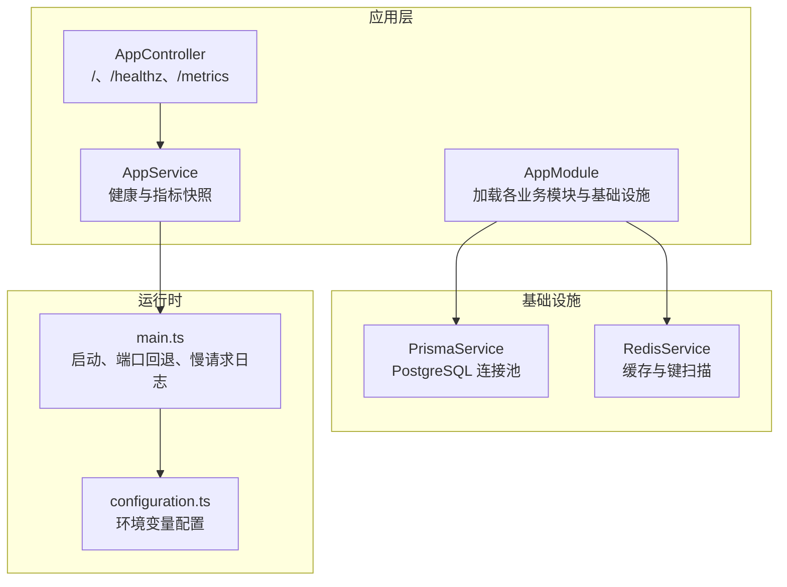
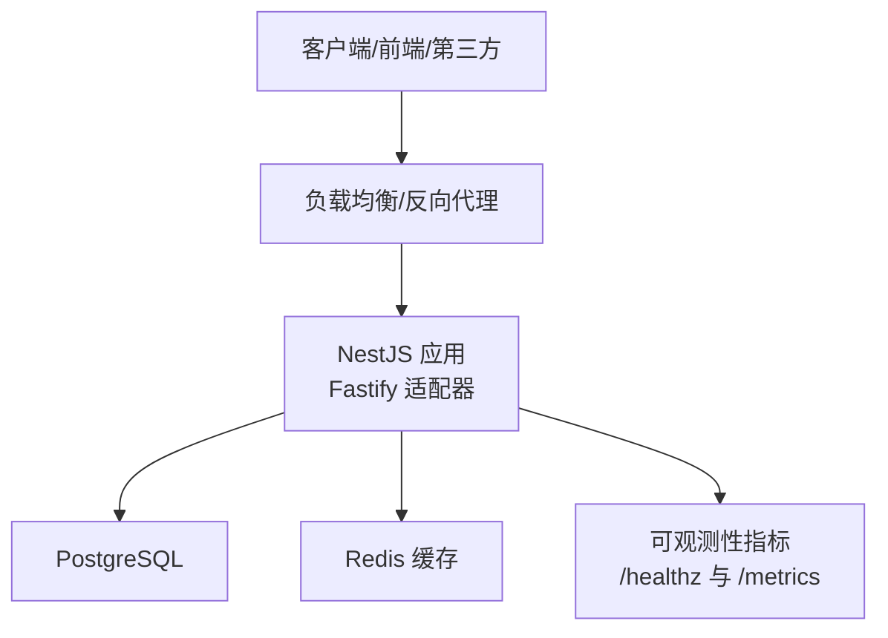
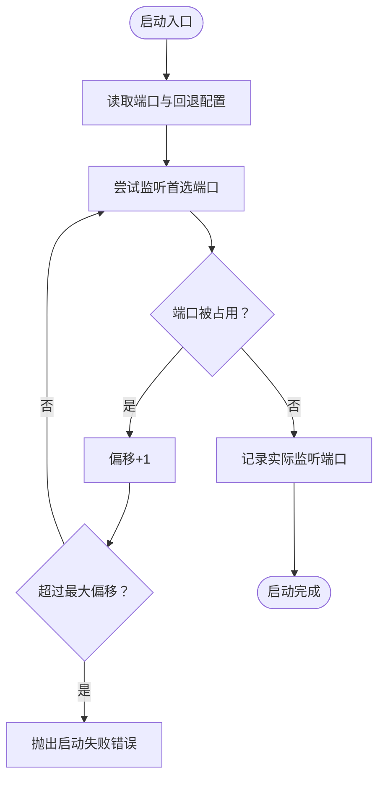
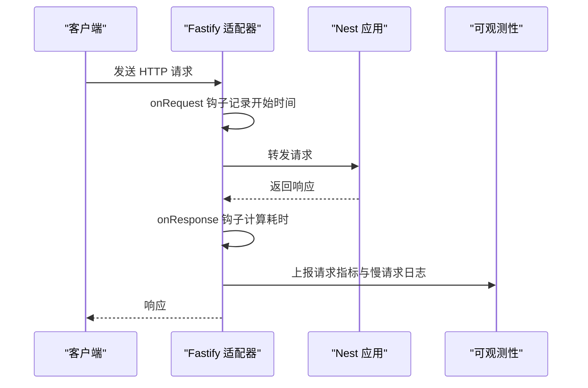
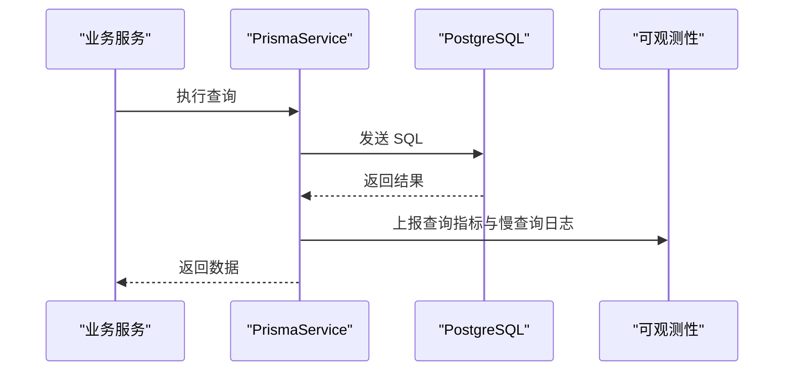
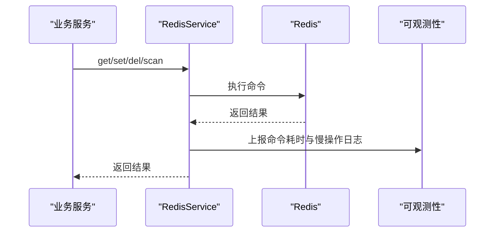
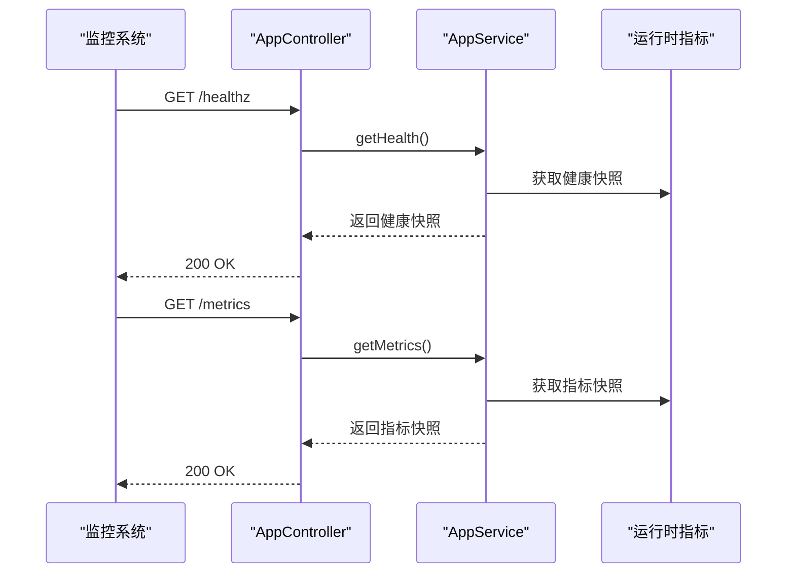
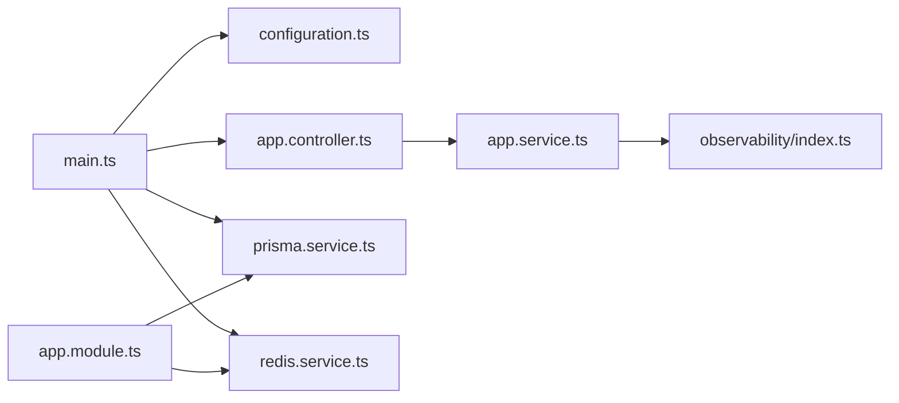

# 紧急情况处理

<cite>
**本文引用的文件**
- [README.md](file://README.md)
- [package.json](file://package.json)
- [src/main.ts](file://src/main.ts)
- [src/app.module.ts](file://src/app.module.ts)
- [src/config/configuration.ts](file://src/config/configuration.ts)
- [src/prisma/prisma.service.ts](file://src/prisma/prisma.service.ts)
- [src/redis/redis.service.ts](file://src/redis/redis.service.ts)
- [src/app.controller.ts](file://src/app.controller.ts)
- [src/app.service.ts](file://src/app.service.ts)
- [src/observability/index.ts](file://src/observability/index.ts)
- [prisma/migrations/migration_lock.toml](file://prisma/migrations/migration_lock.toml)
</cite>

## 目录
1. [简介](#简介)
2. [项目结构](#项目结构)
3. [核心组件](#核心组件)
4. [架构总览](#架构总览)
5. [详细组件分析](#详细组件分析)
6. [依赖关系分析](#依赖关系分析)
7. [性能考量](#性能考量)
8. [故障排查指南](#故障排查指南)
9. [结论](#结论)
10. [附录](#附录)

## 简介
本预案面向 purelyprofit-server 的生产运行，围绕系统崩溃、数据丢失、服务中断、安全漏洞等紧急情况，制定快速响应流程与恢复策略。预案覆盖故障分级、应急团队职责、沟通协调机制、恢复操作步骤、事后分析报告、灾难恢复与备份策略、系统降级方案、安全事件处理流程、紧急联系人清单、备用系统切换、业务连续性保障与客户通知机制。

## 项目结构
purelyprofit-server 是基于 NestJS 的后端应用，采用 Fastify 适配器，使用 Prisma 访问 PostgreSQL，使用 Redis 缓存，并内置可观测性指标采集与导出端点。应用通过环境变量驱动配置，包含大量业务模块（如营销、财务、商品、会员、空间运营等），并提供 Swagger 文档端点。

图表来源
- [src/app.module.ts:39-78](file://src/app.module.ts#L39-L78)
- [src/app.controller.ts:6-33](file://src/app.controller.ts#L6-L33)
- [src/app.service.ts:5-18](file://src/app.service.ts#L5-L18)
- [src/prisma/prisma.service.ts:8-64](file://src/prisma/prisma.service.ts#L8-L64)
- [src/redis/redis.service.ts:8-167](file://src/redis/redis.service.ts#L8-L167)
- [src/main.ts:121-204](file://src/main.ts#L121-L204)
- [src/config/configuration.ts:8-139](file://src/config/configuration.ts#L8-L139)

章节来源
- [README.md:24-99](file://README.md#L24-L99)
- [package.json:8-30](file://package.json#L8-L30)
- [src/app.module.ts:1-83](file://src/app.module.ts#L1-L83)
- [src/main.ts:121-204](file://src/main.ts#L121-L204)

## 核心组件
- 应用启动与配置
  - 启动入口负责创建 Nest 应用、设置全局管道、跨域、Swagger、全局前缀、端口回退与慢请求日志。
  - 配置由 ConfigModule 加载，支持多类阈值与开关项（HTTP、SQL、Redis、缓存预热、JWT、分页大小等）。
- 数据库与缓存
  - PrismaService 使用连接池访问 PostgreSQL，记录慢查询并输出告警日志。
  - RedisService 提供键值读写、JSON 序列化、批量删除、按模式扫描、后台刷新等能力，并记录慢操作。
- 可观测性
  - AppController 暴露健康检查与指标快照端点；AppService 调用运行时指标聚合方法。
  - main.ts 注入 HTTP 请求生命周期钩子，记录请求耗时与慢请求。
  - configuration.ts 提供慢请求/慢查询/慢 Redis 的阈值与开关。
- 模块组织
  - AppModule 统一导入认证、权限控制、财务、商品、营销、会员、空间、脉搏（Pulse）等模块，形成完整的业务域。

章节来源
- [src/main.ts:121-204](file://src/main.ts#L121-L204)
- [src/config/configuration.ts:8-139](file://src/config/configuration.ts#L8-L139)
- [src/prisma/prisma.service.ts:8-64](file://src/prisma/prisma.service.ts#L8-L64)
- [src/redis/redis.service.ts:8-167](file://src/redis/redis.service.ts#L8-L167)
- [src/app.controller.ts:6-33](file://src/app.controller.ts#L6-L33)
- [src/app.service.ts:5-18](file://src/app.service.ts#L5-L18)
- [src/app.module.ts:1-83](file://src/app.module.ts#L1-L83)

## 架构总览
下图展示生产运行的关键交互：客户端通过 API 网关/反向代理访问应用，应用经 Prisma 访问数据库，经 Redis 读写缓存，同时通过可观测性模块记录运行指标。

图表来源
- [src/main.ts:136-144](file://src/main.ts#L136-L144)
- [src/prisma/prisma.service.ts:20-26](file://src/prisma/prisma.service.ts#L20-L26)
- [src/redis/redis.service.ts:22-28](file://src/redis/redis.service.ts#L22-L28)
- [src/app.controller.ts:18-32](file://src/app.controller.ts#L18-L32)

## 详细组件分析

### 启动与端口回退流程
当首选端口被占用时，系统会自动尝试更高端口直至成功或达到最大偏移量。该流程具备容错与日志提示，有助于在部署冲突时快速恢复。

图表来源
- [src/main.ts:87-119](file://src/main.ts#L87-L119)
- [src/main.ts:186-192](file://src/main.ts#L186-L192)

章节来源
- [src/main.ts:87-119](file://src/main.ts#L87-L119)
- [src/main.ts:186-192](file://src/main.ts#L186-L192)

### HTTP 请求观测与慢请求告警
应用在 Fastify 层注入 onRequest/onResponse 钩子，计算请求耗时并记录到可观测性模块；当超过阈值时输出警告日志，便于快速定位慢请求。

图表来源
- [src/main.ts:32-75](file://src/main.ts#L32-L75)
- [src/app.controller.ts:18-32](file://src/app.controller.ts#L18-L32)

章节来源
- [src/main.ts:32-75](file://src/main.ts#L32-L75)
- [src/config/configuration.ts:39-56](file://src/config/configuration.ts#L39-L56)

### SQL 查询观测与慢查询告警
PrismaService 在查询事件中记录耗时与慢查询，超阈值时输出警告日志，便于识别慢 SQL 并优化。

图表来源
- [src/prisma/prisma.service.ts:37-53](file://src/prisma/prisma.service.ts#L37-L53)
- [src/config/configuration.ts:45-50](file://src/config/configuration.ts#L45-L50)

章节来源
- [src/prisma/prisma.service.ts:37-53](file://src/prisma/prisma.service.ts#L37-L53)
- [src/config/configuration.ts:45-50](file://src/config/configuration.ts#L45-L50)

### Redis 操作观测与慢操作告警
RedisService 对 GET/SET/DEL/SCAN 等命令进行耗时统计与慢操作告警，支持后台刷新任务与键扫描，便于缓存异常排查与预热。

图表来源
- [src/redis/redis.service.ts:141-165](file://src/redis/redis.service.ts#L141-L165)
- [src/config/configuration.ts:51-56](file://src/config/configuration.ts#L51-L56)

章节来源
- [src/redis/redis.service.ts:141-165](file://src/redis/redis.service.ts#L141-L165)
- [src/config/configuration.ts:51-56](file://src/config/configuration.ts#L51-L56)

### 健康检查与指标快照
AppController 暴露根路径、健康检查与指标快照端点，AppService 调用运行时指标聚合方法，用于外部监控系统拉取状态。

图表来源
- [src/app.controller.ts:18-32](file://src/app.controller.ts#L18-L32)
- [src/app.service.ts:11-17](file://src/app.service.ts#L11-L17)
- [src/observability/index.ts:1-4](file://src/observability/index.ts#L1-L4)

章节来源
- [src/app.controller.ts:18-32](file://src/app.controller.ts#L18-L32)
- [src/app.service.ts:11-17](file://src/app.service.ts#L11-L17)
- [src/observability/index.ts:1-4](file://src/observability/index.ts#L1-L4)

## 依赖关系分析
- 启动与配置
  - main.ts 依赖 ConfigService 读取运行参数，启用 CORS、Swagger、慢请求日志与端口回退。
  - configuration.ts 将环境变量映射为结构化配置，包括 HTTP/SQL/Redis 阈值与开关。
- 数据与缓存
  - PrismaService 依赖连接池访问 PostgreSQL，记录慢查询。
  - RedisService 依赖 ioredis 客户端，记录慢命令。
- 可观测性
  - AppController 与 AppService 依赖运行时指标聚合模块。
- 模块组织
  - AppModule 导入认证、权限、财务、商品、营销、会员、空间、脉搏等模块，构成完整业务域。

图表来源
- [src/main.ts:121-204](file://src/main.ts#L121-L204)
- [src/config/configuration.ts:8-139](file://src/config/configuration.ts#L8-L139)
- [src/app.controller.ts:6-33](file://src/app.controller.ts#L6-L33)
- [src/app.service.ts:5-18](file://src/app.service.ts#L5-L18)
- [src/observability/index.ts:1-4](file://src/observability/index.ts#L1-L4)
- [src/prisma/prisma.service.ts:8-64](file://src/prisma/prisma.service.ts#L8-L64)
- [src/redis/redis.service.ts:8-167](file://src/redis/redis.service.ts#L8-L167)
- [src/app.module.ts:39-78](file://src/app.module.ts#L39-L78)

章节来源
- [src/main.ts:121-204](file://src/main.ts#L121-L204)
- [src/config/configuration.ts:8-139](file://src/config/configuration.ts#L8-L139)
- [src/app.module.ts:39-78](file://src/app.module.ts#L39-L78)

## 性能考量
- 端口回退：在端口冲突时自动偏移，避免启动失败。
- 慢请求/慢查询/慢 Redis：通过阈值与日志告警，辅助定位性能瓶颈。
- 连接池与超时：数据库连接池与 HTTP 超时可配置，降低资源占用与请求堆积风险。
- 缓存预热：支持缓存预热任务与并发控制，提升热点命中率。

章节来源
- [src/main.ts:87-119](file://src/main.ts#L87-L119)
- [src/config/configuration.ts:39-56](file://src/config/configuration.ts#L39-L56)
- [src/config/configuration.ts:99-110](file://src/config/configuration.ts#L99-L110)
- [src/prisma/prisma.service.ts:20-25](file://src/prisma/prisma.service.ts#L20-L25)
- [src/redis/redis.service.ts:125-139](file://src/redis/redis.service.ts#L125-L139)

## 故障排查指南

### 系统崩溃（进程退出/无法启动）
- 现象
  - 服务无法启动或启动后立即退出。
- 排查要点
  - 检查端口占用与回退日志，确认最终监听端口。
  - 查看慢请求/慢查询/慢 Redis 日志，定位异常阶段。
  - 检查数据库连接字符串与连接池配置。
  - 检查 Redis 主机、端口、密码与数据库索引。
- 处置步骤
  - 修复端口冲突或调整首选端口与偏移上限。
  - 优化慢查询与慢命令，必要时增加索引或缓存。
  - 重启服务并观察健康检查与指标快照。

章节来源
- [src/main.ts:87-119](file://src/main.ts#L87-L119)
- [src/main.ts:160-164](file://src/main.ts#L160-L164)
- [src/config/configuration.ts:39-56](file://src/config/configuration.ts#L39-L56)
- [src/config/configuration.ts:99-110](file://src/config/configuration.ts#L99-L110)
- [src/prisma/prisma.service.ts:20-25](file://src/prisma/prisma.service.ts#L20-L25)
- [src/redis/redis.service.ts:22-28](file://src/redis/redis.service.ts#L22-L28)

### 数据丢失/数据库异常
- 现象
  - 写入失败、查询异常、迁移失败或数据不一致。
- 排查要点
  - 检查慢查询日志与数据库连接池状态。
  - 核对 Prisma 连接字符串与连接超时配置。
  - 确认迁移锁文件与迁移状态。
- 处置步骤
  - 临时降级写入路径，优先保证读取可用。
  - 执行数据库备份与一致性校验。
  - 修复慢查询与连接问题后重试。

章节来源
- [src/prisma/prisma.service.ts:37-53](file://src/prisma/prisma.service.ts#L37-L53)
- [src/config/configuration.ts:45-50](file://src/config/configuration.ts#L45-L50)
- [prisma/migrations/migration_lock.toml:1-3](file://prisma/migrations/migration_lock.toml#L1-L3)

### 服务中断（接口不可达/高延迟）
- 现象
  - /healthz 或 /metrics 不可达，或响应时间显著升高。
- 排查要点
  - 检查慢请求日志与端口回退记录。
  - 检查数据库与 Redis 是否可用。
  - 检查缓存预热任务是否异常。
- 处置步骤
  - 切换到备用实例或回滚最近变更。
  - 临时关闭缓存预热或降低并发。
  - 修复后恢复全量流量。

章节来源
- [src/main.ts:32-75](file://src/main.ts#L32-L75)
- [src/config/configuration.ts:39-56](file://src/config/configuration.ts#L39-L56)
- [src/redis/redis.service.ts:125-139](file://src/redis/redis.service.ts#L125-L139)

### 安全漏洞（越权/泄露/DDoS）
- 现象
  - 子账号越权访问、敏感信息泄露、请求异常激增。
- 排查要点
  - 检查权限守卫与 JWT 策略。
  - 关注慢请求与异常峰值。
  - 核对 CORS 与 Swagger 开关。
- 处置步骤
  - 立即限制访问范围与速率。
  - 回滚相关权限变更。
  - 修复漏洞并发布补丁。

章节来源
- [src/config/configuration.ts:12-19](file://src/config/configuration.ts#L12-L19)
- [src/main.ts:166-179](file://src/main.ts#L166-L179)

## 结论
本预案基于 purelyprofit-server 的现有实现，结合启动流程、数据库与缓存观测、健康与指标端点，构建了从故障发现到处置恢复的闭环。建议在生产环境中持续完善自动化监控、备份与演练，确保在真实紧急情况下能够快速、有序地恢复业务。

## 附录

### 故障分级标准
- 一级（红色）：系统大面积不可用、核心数据丢失、安全事件导致大规模影响
- 二级（橙色）：单模块不可用、关键接口不可用、性能严重劣化
- 三级（黄色）：局部功能异常、偶发慢请求/慢查询、缓存异常
- 四级（蓝色）：轻微性能波动、配置误设、非关键告警

### 应急响应团队职责
- 运维组：负责服务重启、端口回退、数据库与缓存巡检、备份与恢复
- 开发组：负责代码修复、权限与安全加固、配置修正
- 安全组：负责安全事件调查、合规与审计
- 产品/运营：负责客户通知、业务连续性评估与补偿

### 沟通协调机制
- 事件上报：值班人员在 10 分钟内上报至应急群
- 初步评估：15 分钟内完成影响面与等级判定
- 处置执行：30 分钟内启动处置，每小时更新进展
- 外部通报：重大事件在 2 小时内对外说明

### 恢复操作步骤
- 系统崩溃：检查端口回退与慢日志，修复后重启
- 数据丢失：回滚迁移、恢复备份、验证一致性
- 服务中断：切换备用实例、降级非关键功能、修复后恢复
- 安全漏洞：限流/封禁、回滚变更、修复并发布

### 灾难恢复计划
- 数据库
  - 使用 Prisma 迁移与连接池配置，配合备份脚本与影子库校验
- 缓存
  - 清理异常键、重置缓存预热任务、恢复后台刷新
- 应用
  - 备用实例切换、灰度回滚、健康检查与指标验证

### 数据备份策略
- 备份类型：全量/增量/DDL 差异
- 存储位置：异地对象存储与本地磁盘
- 验证周期：每周一致性校验，每月演练恢复
- 自动化：通过脚本与 CI/CD 流水线执行

### 系统降级方案
- 读写分离：优先保证读取，临时关闭写入路径
- 缓存降级：关闭预热与后台刷新，仅使用直连
- 功能降级：暂停非关键模块，保留核心业务

### 安全事件处理流程
- 隔离：限流、封禁、关闭 Swagger
- 取证：收集日志、慢请求/慢查询/慢 Redis 记录
- 修复：回滚变更、加固权限与鉴权
- 复盘：形成报告与改进措施

### 紧急联系人清单
- 运维负责人：[填写]
- 开发负责人：[填写]
- 安全负责人：[填写]
- 产品/运营联络人：[填写]

### 备用系统切换
- 切换条件：主系统不可用或性能劣化超阈值
- 切换步骤：停止新流量、切换 DNS/负载均衡、验证健康检查与指标
- 恢复条件：主系统修复并通过验证后切回

### 业务连续性保障
- 服务可用性目标：SLA 与降级阈值
- 客户通知机制：事件升级后统一口径对外说明
- 事后分析报告：根因、处置过程、改进措施与复盘会议纪要