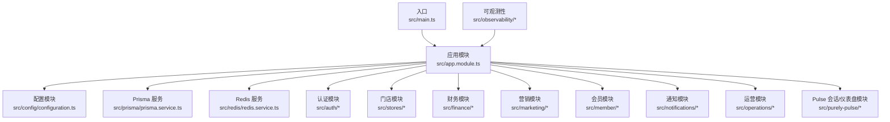
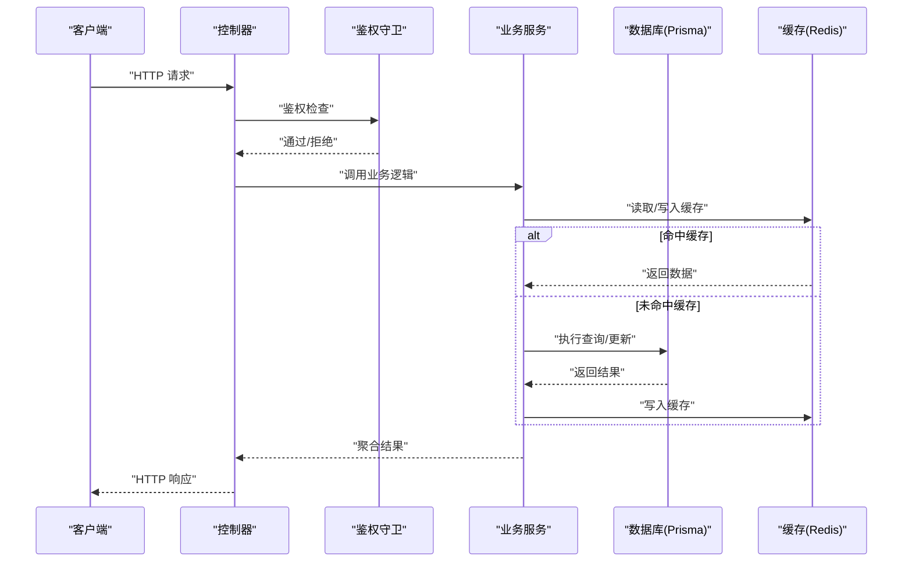
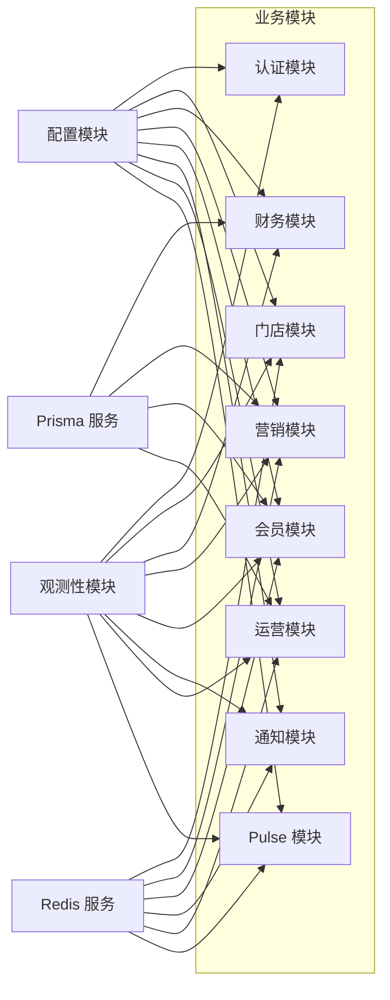

# 调试工具与技巧

<cite>
**本文引用的文件**
- [README.md](file://README.md)
- [package.json](file://package.json)
- [nest-cli.json](file://nest-cli.json)
- [tsconfig.json](file://tsconfig.json)
- [src/main.ts](file://src/main.ts)
- [src/app.module.ts](file://src/app.module.ts)
- [src/config/configuration.ts](file://src/config/configuration.ts)
- [src/prisma/prisma.service.ts](file://src/prisma/prisma.service.ts)
- [src/redis/redis.service.ts](file://src/redis/redis.service.ts)
- [src/redis/cache-prewarm.service.ts](file://src/redis/cache-prewarm.service.ts)
- [src/observability/runtime-metrics.ts](file://src/observability/runtime-metrics.ts)
- [src/observability/runtime-metrics.summary.ts](file://src/observability/runtime-metrics.summary.ts)
- [src/observability/runtime-metrics.summary-context.ts](file://src/observability/runtime-metrics.summary-context.ts)
- [src/observability/runtime-metrics.summary-context-actions-sql.ts](file://src/observability/runtime-metrics.summary-context-actions-sql.ts)
- [src/observability/runtime-metrics.summary-context-actions-redis.ts](file://src/observability/runtime-metrics.summary-context-actions-redis.ts)
- [src/observability/runtime-metrics.summary-context-actions-http.ts](file://src/observability/runtime-metrics.summary-context-actions-http.ts)
- [src/observability/runtime-metrics.summary-context-actions-cache-prewarm.ts](file://src/observability/runtime-metrics.summary-context-actions-cache-prewarm.ts)
- [src/observability/runtime-metrics.summary-context-actions-process.ts](file://src/observability/runtime-metrics.summary-context-actions-process.ts)
- [src/observability/runtime-metrics.summary-context-actions-shared.ts](file://src/observability/runtime-metrics.summary-context-actions-shared.ts)
- [src/observability/runtime-metrics.summary-context-severity.ts](file://src/observability/runtime-metrics.summary-context-severity.ts)
- [src/observability/runtime-metrics.summary-highlights.ts](file://src/observability/runtime-metrics.summary-highlights.ts)
- [src/observability/runtime-metrics.summary-highlights-sql.ts](file://src/observability/runtime-metrics.summary-highlights-sql.ts)
- [src/observability/runtime-metrics.summary-highlights-redis.ts](file://src/observability/runtime-metrics.summary-highlights-redis.ts)
- [src/observability/runtime-metrics.summary-highlights-http.ts](file://src/observability/runtime-metrics.summary-highlights-http.ts)
- [src/observability/runtime-metrics.summary-highlights-cache-prewarm.ts](file://src/observability/runtime-metrics.summary-highlights-cache-prewarm.ts)
- [src/observability/runtime-metrics.summary-highlights-process.ts](file://src/observability/runtime-metrics.summary-highlights-process.ts)
- [src/observability/runtime-metrics.summary-highlights-shared.ts](file://src/observability/runtime-metrics.summary-highlights-shared.ts)
- [src/observability/runtime-metrics.recorders.ts](file://src/observability/runtime-metrics.recorders.ts)
- [src/observability/runtime-metrics.state.ts](file://src/observability/runtime-metrics.state.ts)
- [src/observability/runtime-metrics.snapshots.ts](file://src/observability/runtime-metrics.snapshots.ts)
- [src/observability/metrics.protocol.ts](file://src/observability/metrics.protocol.ts)
- [src/observability/metrics-summary.protocol.ts](file://src/observability/metrics-summary.protocol.ts)
- [src/observability/metrics-snapshot.protocol.ts](file://src/observability/metrics-snapshot.protocol.ts)
- [src/observability/observability.protocol.ts](file://src/observability/observability.protocol.ts)
- [src/auth/auth.controller.ts](file://src/auth/auth.controller.ts)
- [src/auth/auth.service.ts](file://src/auth/auth.service.ts)
- [src/auth/auth.module.ts](file://src/auth/auth.module.ts)
- [src/auth/guards/jwt-auth.guard.ts](file://src/auth/guards/jwt-auth.guard.ts)
- [src/auth/strategies/jwt.strategy.ts](file://src/auth/strategies/jwt.strategy.ts)
- [src/stores/stores.controller.ts](file://src/stores/stores.controller.ts)
- [src/stores/stores.service.ts](file://src/stores/stores.service.ts)
- [src/stores/stores.module.ts](file://src/stores/stores.module.ts)
- [src/finance/finance.controller.ts](file://src/finance/finance.controller.ts)
- [src/finance/finance.service.ts](file://src/finance/finance.service.ts)
- [src/finance/finance.module.ts](file://src/finance/finance.module.ts)
- [src/marketing/marketing.controller.ts](file://src/marketing/marketing.controller.ts)
- [src/marketing/marketing.service.ts](file://src/marketing/marketing.service.ts)
- [src/marketing/marketing.module.ts](file://src/marketing/marketing.module.ts)
- [src/member/platform-membership/platform-membership.controller.ts](file://src/member/platform-membership/platform-membership.controller.ts)
- [src/member/platform-membership/platform-membership.service.ts](file://src/member/platform-membership/platform-membership.service.ts)
- [src/member/platform-membership/platform-membership.module.ts](file://src/member/platform-membership/platform-membership.module.ts)
- [src/notifications/notifications.controller.ts](file://src/notifications/notifications.controller.ts)
- [src/notifications/notifications.service.ts](file://src/notifications/notifications.service.ts)
- [src/notifications/notifications.module.ts](file://src/notifications/notifications.module.ts)
- [src/operations/sales-record/sales-record.controller.ts](file://src/operations/sales-record/sales-record.controller.ts)
- [src/operations/sales-record/sales-record.service.ts](file://src/operations/sales-record/sales-record.service.ts)
- [src/operations/sales-record/sales-record.module.ts](file://src/operations/sales-record/sales-record.module.ts)
- [src/purely-pulse/session/session.controller.ts](file://src/purely-pulse/session/session.controller.ts)
- [src/purely-pulse/session/session.service.ts](file://src/purely-pulse/session/session.service.ts)
- [src/purely-pulse/session/session.module.ts](file://src/purely-pulse/session/session.module.ts)
- [src/purely-pulse/dashboard/dashboard.controller.ts](file://src/purely-pulse/dashboard/dashboard.controller.ts)
- [src/purely-pulse/dashboard/dashboard.service.ts](file://src/purely-pulse/dashboard/dashboard.service.ts)
- [src/purely-pulse/dashboard/dashboard.module.ts](file://src/purely-pulse/dashboard/dashboard.module.ts)
</cite>

## 目录
1. [简介](#简介)
2. [项目结构](#项目结构)
3. [核心组件](#核心组件)
4. [架构总览](#架构总览)
5. [详细组件分析](#详细组件分析)
6. [依赖关系分析](#依赖关系分析)
7. [性能考量](#性能考量)
8. [故障排查指南](#故障排查指南)
9. [结论](#结论)
10. [附录](#附录)

## 简介
本指南面向 purelyprofit-server 的开发者与运维人员，系统性介绍如何在 NestJS 应用中进行高效调试，覆盖 TypeScript 调试器配置、断点与变量监视、调用栈分析、异步流程调试；同时提供 PostgreSQL 查询日志分析、Redis 缓存调试方法；并给出性能分析工具使用、内存泄漏检测、并发问题排查策略，以及日志级别配置、关键路径跟踪、异常堆栈分析与生产环境调试最佳实践。

## 项目结构
该项目采用 NestJS 模块化架构，按业务域划分模块（如 auth、stores、finance、marketing、member、notifications、operations、purely-pulse 等），并通过 Prisma 进行数据库访问，通过 Redis 提供缓存与预热能力，并内置可观测性指标体系用于运行时度量与高亮事件记录。

图表来源
- [src/main.ts](file://src/main.ts)
- [src/app.module.ts](file://src/app.module.ts)
- [src/config/configuration.ts](file://src/config/configuration.ts)
- [src/prisma/prisma.service.ts](file://src/prisma/prisma.service.ts)
- [src/redis/redis.service.ts](file://src/redis/redis.service.ts)
- [src/auth/auth.module.ts](file://src/auth/auth.module.ts)
- [src/stores/stores.module.ts](file://src/stores/stores.module.ts)
- [src/finance/finance.module.ts](file://src/finance/finance.module.ts)
- [src/marketing/marketing.module.ts](file://src/marketing/marketing.module.ts)
- [src/member/platform-membership/platform-membership.module.ts](file://src/member/platform-membership/platform-membership.module.ts)
- [src/notifications/notifications.module.ts](file://src/notifications/notifications.module.ts)
- [src/operations/sales-record/sales-record.module.ts](file://src/operations/sales-record/sales-record.module.ts)
- [src/purely-pulse/session/session.module.ts](file://src/purely-pulse/session/session.module.ts)
- [src/purely-pulse/dashboard/dashboard.module.ts](file://src/purely-pulse/dashboard/dashboard.module.ts)

章节来源
- [src/main.ts](file://src/main.ts)
- [src/app.module.ts](file://src/app.module.ts)
- [src/config/configuration.ts](file://src/config/configuration.ts)

## 核心组件
- 入口与启动：应用从入口文件启动，加载全局配置与模块。
- 配置中心：集中管理运行时配置项，便于调试时切换环境与开关。
- 数据访问层：通过 Prisma 服务统一访问数据库，支持查询日志与慢查询定位。
- 缓存层：通过 Redis 服务与缓存预热服务实现热点数据加速与一致性校验。
- 观测性：运行时指标、快照、摘要与高亮事件，帮助快速定位性能瓶颈与异常路径。

章节来源
- [src/main.ts](file://src/main.ts)
- [src/config/configuration.ts](file://src/config/configuration.ts)
- [src/prisma/prisma.service.ts](file://src/prisma/prisma.service.ts)
- [src/redis/redis.service.ts](file://src/redis/redis.service.ts)
- [src/redis/cache-prewarm.service.ts](file://src/redis/cache-prewarm.service.ts)
- [src/observability/runtime-metrics.ts](file://src/observability/runtime-metrics.ts)

## 架构总览
下图展示请求在系统中的典型流转：客户端请求进入控制器，经由守卫与服务层处理，必要时访问数据库或缓存，最终返回响应。可观测性模块贯穿各环节，记录运行时指标与高亮事件。

图表来源
- [src/auth/auth.controller.ts](file://src/auth/auth.controller.ts)
- [src/auth/guards/jwt-auth.guard.ts](file://src/auth/guards/jwt-auth.guard.ts)
- [src/auth/auth.service.ts](file://src/auth/auth.service.ts)
- [src/stores/stores.controller.ts](file://src/stores/stores.controller.ts)
- [src/stores/stores.service.ts](file://src/stores/stores.service.ts)
- [src/prisma/prisma.service.ts](file://src/prisma/prisma.service.ts)
- [src/redis/redis.service.ts](file://src/redis/redis.service.ts)

## 详细组件分析

### NestJS 调试与 TypeScript 配置
- 启动与断点
  - 在入口文件设置断点，验证应用初始化流程与配置加载。
  - 在控制器与服务层关键方法处设置断点，观察参数、上下文与返回值。
- 异步调试
  - 使用 Promise/async-await 的断点，关注微任务队列与事件循环时机。
  - 对于定时器、订阅回调等异步路径，结合条件断点与日志定位。
- 调用栈分析
  - 利用调用栈查看跨模块调用链，识别阻塞点与异常传播路径。
- 变量监视
  - 在 IDE 中添加监视表达式，持续观察关键状态（如用户标识、请求 ID、缓存键）。
- TypeScript 配置要点
  - 确保生成 sourcemap，以便断点映射到源码。
  - 保持严格模式与类型安全，减少运行期隐式错误。

章节来源
- [src/main.ts](file://src/main.ts)
- [src/app.module.ts](file://src/app.module.ts)
- [tsconfig.json](file://tsconfig.json)

### PostgreSQL 查询日志分析
- 开启慢查询日志
  - 在数据库侧启用慢查询阈值与日志输出，结合应用层 SQL 记录定位热点查询。
- Prisma 日志
  - 通过 Prisma 服务配置 SQL 输出，配合请求 ID 与上下文追踪单次请求的完整 SQL 调用序列。
- 关键路径跟踪
  - 将请求 ID 注入到 SQL 执行上下文中，形成端到端可追溯的查询链路。
- 常见问题定位
  - 排查 N+1 查询、缺失索引导致的全表扫描、不合理的 JOIN/子查询。
- 性能优化建议
  - 使用分页、批量查询、物化视图或缓存热点数据。

章节来源
- [src/prisma/prisma.service.ts](file://src/prisma/prisma.service.ts)
- [src/observability/runtime-metrics.summary-context-actions-sql.ts](file://src/observability/runtime-metrics.summary-context-actions-sql.ts)
- [src/observability/runtime-metrics.summary-highlights-sql.ts](file://src/observability/runtime-metrics.summary-highlights-sql.ts)

### Redis 缓存调试方法
- 基础连通性
  - 通过 Redis 服务连接测试，确认主机、端口、密码与超时配置正确。
- 键空间分析
  - 使用键扫描与 TTL 分析，识别过期键、大体积键与异常分布。
- 命令级调试
  - 在缓存读写路径设置断点，观察键构建规则、序列化格式与过期策略。
- 缓存预热
  - 使用缓存预热服务对热点键进行批量加载，结合高亮事件确认预热效果。
- 一致性校验
  - 对比缓存与数据库的数据一致性，定位写后读延迟或写入失败场景。

章节来源
- [src/redis/redis.service.ts](file://src/redis/redis.service.ts)
- [src/redis/cache-prewarm.service.ts](file://src/redis/cache-prewarm.service.ts)
- [src/observability/runtime-metrics.summary-context-actions-redis.ts](file://src/observability/runtime-metrics.summary-context-actions-redis.ts)
- [src/observability/runtime-metrics.summary-highlights-redis.ts](file://src/observability/runtime-metrics.summary-highlights-redis.ts)

### 观测性与运行时指标
- 指标采集
  - 使用运行时指标模块记录 SQL、Redis、HTTP、缓存预热、进程等维度的耗时与错误计数。
- 快照与摘要
  - 通过快照与摘要模块生成周期性统计，辅助趋势分析与异常高亮。
- 上下文与严重性
  - 将请求上下文与严重性等级注入指标，提升定位效率。
- 实战建议
  - 将关键路径的耗时与错误率纳入告警阈值，结合高亮事件快速复盘。

章节来源
- [src/observability/runtime-metrics.ts](file://src/observability/runtime-metrics.ts)
- [src/observability/runtime-metrics.summary.ts](file://src/observability/runtime-metrics.summary.ts)
- [src/observability/runtime-metrics.summary-context.ts](file://src/observability/runtime-metrics.summary-context.ts)
- [src/observability/runtime-metrics.summary-context-severity.ts](file://src/observability/runtime-metrics.summary-context-severity.ts)
- [src/observability/runtime-metrics.summary-highlights.ts](file://src/observability/runtime-metrics.summary-highlights.ts)
- [src/observability/runtime-metrics.recorders.ts](file://src/observability/runtime-metrics.recorders.ts)
- [src/observability/runtime-metrics.state.ts](file://src/observability/runtime-metrics.state.ts)
- [src/observability/runtime-metrics.snapshots.ts](file://src/observability/runtime-metrics.snapshots.ts)
- [src/observability/metrics.protocol.ts](file://src/observability/metrics.protocol.ts)
- [src/observability/metrics-summary.protocol.ts](file://src/observability/metrics-summary.protocol.ts)
- [src/observability/metrics-snapshot.protocol.ts](file://src/observability/metrics-snapshot.protocol.ts)
- [src/observability/observability.protocol.ts](file://src/observability/observability.protocol.ts)

### 认证与授权调试
- 守卫与策略
  - 在鉴权守卫与 JWT 策略中设置断点，验证令牌解析、签名验证与权限判定。
- 控制器与服务
  - 在认证控制器与服务层关键方法设置断点，观察用户上下文注入与权限检查结果。
- 常见问题
  - 令牌过期、权限不足、子账户限制等场景下的分支行为。

章节来源
- [src/auth/guards/jwt-auth.guard.ts](file://src/auth/guards/jwt-auth.guard.ts)
- [src/auth/strategies/jwt.strategy.ts](file://src/auth/strategies/jwt.strategy.ts)
- [src/auth/auth.controller.ts](file://src/auth/auth.controller.ts)
- [src/auth/auth.service.ts](file://src/auth/auth.service.ts)

### 业务模块调试要点
- 门店模块
  - 在控制器与服务层设置断点，验证读写分离、权限过滤与事务边界。
- 财务模块
  - 关注会计期间、对账与报表生成的边界条件与并发一致性。
- 营销模块
  - 检查促销、积分、充值等业务规则的分支与边界输入。
- 会员模块
  - 核对会员权益、平台会员计划与账务流水的一致性。
- 通知模块
  - 验证通知模板渲染、渠道投递与重试机制。
- 运营模块
  - 销售记录、成本与库存的联动更新与幂等性。
- Pulse 会话/仪表盘
  - 验证会话生命周期、上下文切换与数据聚合准确性。

章节来源
- [src/stores/stores.controller.ts](file://src/stores/stores.controller.ts)
- [src/stores/stores.service.ts](file://src/stores/stores.service.ts)
- [src/finance/finance.controller.ts](file://src/finance/finance.controller.ts)
- [src/finance/finance.service.ts](file://src/finance/finance.service.ts)
- [src/marketing/marketing.controller.ts](file://src/marketing/marketing.controller.ts)
- [src/marketing/marketing.service.ts](file://src/marketing/marketing.service.ts)
- [src/member/platform-membership/platform-membership.controller.ts](file://src/member/platform-membership/platform-membership.controller.ts)
- [src/member/platform-membership/platform-membership.service.ts](file://src/member/platform-membership/platform-membership.service.ts)
- [src/notifications/notifications.controller.ts](file://src/notifications/notifications.controller.ts)
- [src/notifications/notifications.service.ts](file://src/notifications/notifications.service.ts)
- [src/operations/sales-record/sales-record.controller.ts](file://src/operations/sales-record/sales-record.controller.ts)
- [src/operations/sales-record/sales-record.service.ts](file://src/operations/sales-record/sales-record.service.ts)
- [src/purely-pulse/session/session.controller.ts](file://src/purely-pulse/session/session.controller.ts)
- [src/purely-pulse/session/session.service.ts](file://src/purely-pulse/session/session.service.ts)
- [src/purely-pulse/dashboard/dashboard.controller.ts](file://src/purely-pulse/dashboard/dashboard.controller.ts)
- [src/purely-pulse/dashboard/dashboard.service.ts](file://src/purely-pulse/dashboard/dashboard.service.ts)

## 依赖关系分析
- 模块耦合
  - 各业务模块通过共享服务与 DTO 进行协作，避免直接耦合底层基础设施。
- 外部依赖
  - 数据库与缓存作为外部系统，通过服务封装隔离差异。
- 观测性集成
  - 运行时指标模块横切各业务模块，提供统一的度量与高亮能力。

图表来源
- [src/app.module.ts](file://src/app.module.ts)
- [src/config/configuration.ts](file://src/config/configuration.ts)
- [src/prisma/prisma.service.ts](file://src/prisma/prisma.service.ts)
- [src/redis/redis.service.ts](file://src/redis/redis.service.ts)
- [src/observability/runtime-metrics.ts](file://src/observability/runtime-metrics.ts)

章节来源
- [src/app.module.ts](file://src/app.module.ts)
- [src/config/configuration.ts](file://src/config/configuration.ts)
- [src/prisma/prisma.service.ts](file://src/prisma/prisma.service.ts)
- [src/redis/redis.service.ts](file://src/redis/redis.service.ts)
- [src/observability/runtime-metrics.ts](file://src/observability/runtime-metrics.ts)

## 性能考量
- SQL 性能
  - 使用慢查询日志与 Prisma SQL 输出，结合运行时指标定位热点与异常。
- 缓存命中率
  - 通过 Redis 指标与高亮事件评估命中率与过期策略有效性。
- 并发与锁竞争
  - 在高并发场景下，关注数据库锁等待与缓存竞争条件，必要时引入分布式锁或重试退避。
- 内存与 GC
  - 结合进程指标与快照，观察内存增长曲线与 GC 行为，识别潜在泄漏。
- I/O 与网络
  - HTTP 与外部服务调用的延迟与错误率，纳入高亮事件与告警。

章节来源
- [src/observability/runtime-metrics.summary-context-actions-sql.ts](file://src/observability/runtime-metrics.summary-context-actions-sql.ts)
- [src/observability/runtime-metrics.summary-context-actions-redis.ts](file://src/observability/runtime-metrics.summary-context-actions-redis.ts)
- [src/observability/runtime-metrics.summary-context-actions-http.ts](file://src/observability/runtime-metrics.summary-context-actions-http.ts)
- [src/observability/runtime-metrics.summary-context-actions-process.ts](file://src/observability/runtime-metrics.summary-context-actions-process.ts)
- [src/observability/runtime-metrics.summary-highlights-sql.ts](file://src/observability/runtime-metrics.summary-highlights-sql.ts)
- [src/observability/runtime-metrics.summary-highlights-redis.ts](file://src/observability/runtime-metrics.summary-highlights-redis.ts)
- [src/observability/runtime-metrics.summary-highlights-http.ts](file://src/observability/runtime-metrics.summary-highlights-http.ts)
- [src/observability/runtime-metrics.summary-highlights-process.ts](file://src/observability/runtime-metrics.summary-highlights-process.ts)

## 故障排查指南
- 日志级别与上下文
  - 在配置中调整日志级别，确保关键路径与异常具备足够上下文（如请求 ID、用户标识）。
- 异常堆栈分析
  - 结合调用栈与上下文，定位异常抛出位置与传播路径，优先修复上游错误。
- 关键路径跟踪
  - 使用请求 ID 串联 SQL、Redis、HTTP 调用，形成端到端可追溯链路。
- 生产环境调试
  - 仅在受控条件下开启更详细的日志与采样，避免对线上性能造成影响；利用高亮事件与指标进行快速回溯。

章节来源
- [src/config/configuration.ts](file://src/config/configuration.ts)
- [src/observability/runtime-metrics.summary-context.ts](file://src/observability/runtime-metrics.summary-context.ts)
- [src/observability/observability.protocol.ts](file://src/observability/observability.protocol.ts)

## 结论
通过合理配置调试器、建立完善的日志与指标体系、聚焦关键路径与异步流程，可以显著提升 purelyprofit-server 的调试效率与稳定性。建议在开发与测试环境中充分演练断点、变量监视与调用栈分析，在生产环境中以可观测性为核心，结合高亮事件与指标进行快速定位与恢复。

## 附录
- 工具与命令
  - 使用包管理器安装依赖并启动应用，结合调试器附加进程进行断点调试。
  - 在数据库与缓存侧开启详细日志，配合应用层上下文进行关联分析。
- 最佳实践清单
  - 为每个业务关键路径设置断点与日志，保留最小可复现样本。
  - 使用请求 ID 统一追踪跨服务调用链。
  - 对热点 SQL 与缓存键进行定期审查与优化。
  - 在变更发布前进行回归与压力测试，确保异常路径与边界条件被覆盖。

章节来源
- [package.json](file://package.json)
- [nest-cli.json](file://nest-cli.json)
- [README.md](file://README.md)