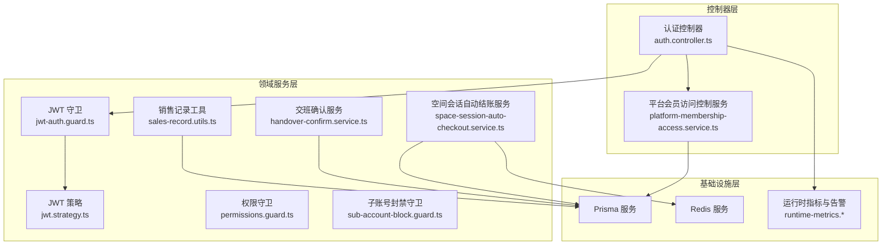
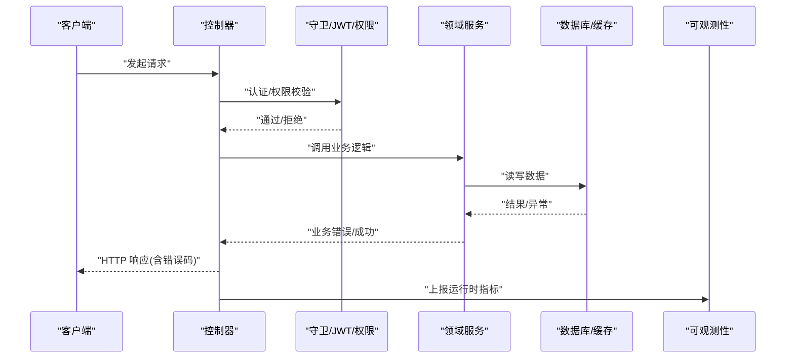
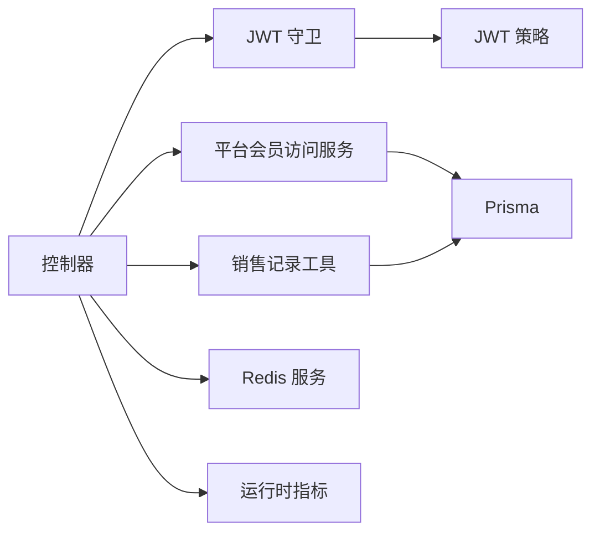

# 错误码对照表

<cite>
**本文引用的文件**
- [src/main.ts](file://src/main.ts)
- [src/purely-profit/auth/auth.service.ts](file://src/purely-profit/auth/auth.service.ts)
- [src/purely-profit/auth/auth.controller.ts](file://src/purely-profit/auth/auth.controller.ts)
- [src/purely-profit/auth/strategies/jwt.strategy.ts](file://src/purely-profit/auth/strategies/jwt.strategy.ts)
- [src/purely-profit/auth/guards/jwt-auth.guard.ts](file://src/purely-profit/auth/guards/jwt-auth.guard.ts)
- [src/purely-profit/access-control/guards/permissions.guard.ts](file://src/purely-profit/access-control/guards/permissions.guard.ts)
- [src/purely-profit/access-control/guards/sub-account-block.guard.ts](file://src/purely-profit/access-control/guards/sub-account-block.guard.ts)
- [src/purely-profit/member/platform-membership/platform-membership-access.service.ts](file://src/purely-profit/member/platform-membership/platform-membership-access.service.ts)
- [src/purely-profit/member/platform-membership/platform-membership-access.messages.ts](file://src/purely-profit/member/platform-membership/platform-membership-access.messages.ts)
- [src/purely-profit/member/platform-membership/platform-membership-access.shared.ts](file://src/purely-profit/member/platform-membership/platform-membership-access.shared.ts)
- [src/purely-profit/member/platform-membership/store-sub-account-login.service.ts](file://src/purely-profit/member/platform-membership/store-sub-account-login.service.ts)
- [src/purely-profit/operations/sales-record/sales-record.utils.ts](file://src/purely-profit/operations/sales-record/sales-record.utils.ts)
- [src/purely-profit/operations/handover/handover-confirm.service.ts](file://src/purely-profit/operations/handover/handover-confirm.service.ts)
- [src/purely-profit/operations/spaces/space-session-auto-checkout.service.ts](file://src/purely-profit/operations/spaces/space-session-auto-checkout.service.ts)
- [src/redis/cache-prewarm.error.ts](file://src/redis/cache-prewarm.error.ts)
- [src/redis/cache-prewarm.service.ts](file://src/redis/cache-prewarm.service.ts)
- [src/redis/redis.service.ts](file://src/redis/redis.service.ts)
- [src/purely-profit/auth/request-id.decorator.ts](file://src/purely-profit/auth/request-id.decorator.ts)
- [src/observability/runtime-metrics.summary-highlights-http.ts](file://src/observability/runtime-metrics.summary-highlights-http.ts)
- [src/observability/runtime-metrics.summary-cards.ts](file://src/observability/runtime-metrics.summary-cards.ts)
- [src/observability/runtime-metrics.summary-context-actions-http.ts](file://src/observability/runtime-metrics.summary-context-actions-http.ts)
</cite>

## 目录
1. [简介](#简介)
2. [项目结构](#项目结构)
3. [核心组件](#核心组件)
4. [架构总览](#架构总览)
5. [详细组件分析](#详细组件分析)
6. [依赖分析](#依赖分析)
7. [性能考量](#性能考量)
8. [故障排查指南](#故障排查指南)
9. [结论](#结论)
10. [附录](#附录)

## 简介
本对照表面向 purelyprofit-server 的业务与系统模块，系统性梳理并归类错误码，覆盖认证错误、业务数据错误、系统错误三类，并给出错误编号、错误描述、可能原因、解决方案与相关 API 接口的对应关系。同时提供错误码分类、优先级与处理建议，帮助开发者与运维快速定位与处置问题。

## 项目结构
围绕错误码的来源与影响范围，本项目中错误码主要由以下层次产生：
- 控制器层：对外暴露的 API，负责参数校验与调用领域服务；常见抛出 400、401、403、404、409、422、500 等状态码。
- 领域服务层：执行业务规则与权限校验，如平台会员配额、子账号额度、功能开关等。
- 基础设施层：数据库、缓存、可观测性等，出现异常时向上抛出通用异常或转换为业务错误。
- 中间件/守卫：认证与授权拦截，如 JWT 校验、权限守卫、子账号封禁等。

图表来源
- [src/purely-profit/auth/auth.controller.ts](file://src/purely-profit/auth/auth.controller.ts)
- [src/purely-profit/auth/strategies/jwt.strategy.ts](file://src/purely-profit/auth/strategies/jwt.strategy.ts)
- [src/purely-profit/auth/guards/jwt-auth.guard.ts](file://src/purely-profit/auth/guards/jwt-auth.guard.ts)
- [src/purely-profit/access-control/guards/permissions.guard.ts](file://src/purely-profit/access-control/guards/permissions.guard.ts)
- [src/purely-profit/access-control/guards/sub-account-block.guard.ts](file://src/purely-profit/access-control/guards/sub-account-block.guard.ts)
- [src/purely-profit/member/platform-membership/platform-membership-access.service.ts](file://src/purely-profit/member/platform-membership/platform-membership-access.service.ts)
- [src/purely-profit/operations/sales-record/sales-record.utils.ts](file://src/purely-profit/operations/sales-record/sales-record.utils.ts)
- [src/purely-profit/operations/handover/handover-confirm.service.ts](file://src/purely-profit/operations/handover/handover-confirm.service.ts)
- [src/purely-profit/operations/spaces/space-session-auto-checkout.service.ts](file://src/purely-profit/operations/spaces/space-session-auto-checkout.service.ts)
- [src/redis/redis.service.ts](file://src/redis/redis.service.ts)
- [src/observability/runtime-metrics.summary-highlights-http.ts](file://src/observability/runtime-metrics.summary-highlights-http.ts)

章节来源
- [src/main.ts](file://src/main.ts)
- [src/purely-profit/auth/auth.controller.ts](file://src/purely-profit/auth/auth.controller.ts)

## 核心组件
本节从错误码视角梳理关键组件与其职责：
- 认证与授权：JWT 登录、Token 校验、权限守卫、子账号封禁守卫。
- 平台会员与配额：子账号额度、功能开关、套餐限制。
- 业务数据校验：金额规范化、数值解析、业务规则校验。
- 系统异常：数据库/缓存异常、服务不可用、请求 ID 缺失。
- 运行时监控：HTTP 异常率/延迟告警、可视化卡片与动作元数据。

章节来源
- [src/purely-profit/auth/guards/jwt-auth.guard.ts](file://src/purely-profit/auth/guards/jwt-auth.guard.ts)
- [src/purely-profit/access-control/guards/permissions.guard.ts](file://src/purely-profit/access-control/guards/permissions.guard.ts)
- [src/purely-profit/access-control/guards/sub-account-block.guard.ts](file://src/purely-profit/access-control/guards/sub-account-block.guard.ts)
- [src/purely-profit/member/platform-membership/platform-membership-access.service.ts](file://src/purely-profit/member/platform-membership/platform-membership-access.service.ts)
- [src/purely-profit/operations/sales-record/sales-record.utils.ts](file://src/purely-profit/operations/sales-record/sales-record.utils.ts)
- [src/redis/cache-prewarm.error.ts](file://src/redis/cache-prewarm.error.ts)
- [src/purely-profit/auth/request-id.decorator.ts](file://src/purely-profit/auth/request-id.decorator.ts)
- [src/observability/runtime-metrics.summary-highlights-http.ts](file://src/observability/runtime-metrics.summary-highlights-http.ts)

## 架构总览
下图展示错误码在系统中的流转路径：客户端请求经控制器进入，中间经过守卫与服务层，若触发业务规则或系统异常则抛出相应错误，最终由全局异常过滤器统一响应。

图表来源
- [src/purely-profit/auth/auth.controller.ts](file://src/purely-profit/auth/auth.controller.ts)
- [src/purely-profit/auth/guards/jwt-auth.guard.ts](file://src/purely-profit/auth/guards/jwt-auth.guard.ts)
- [src/purely-profit/member/platform-membership/platform-membership-access.service.ts](file://src/purely-profit/member/platform-membership/platform-membership-access.service.ts)
- [src/observability/runtime-metrics.summary-highlights-http.ts](file://src/observability/runtime-metrics.summary-highlights-http.ts)

## 详细组件分析

### 认证与授权错误码
- 编号：AUTH_001
  - 描述：登录凭据无效
  - 可能原因：用户名/密码错误、账户不存在、账户被冻结
  - 解决方案：核对凭据、检查账户状态、重试登录
  - 相关接口：POST /api/auth/login
  - 优先级：高
  - 处理建议：记录失败次数，必要时启用账户锁定策略
  章节来源
  - [src/purely-profit/auth/auth.service.ts](file://src/purely-profit/auth/auth.service.ts)
  - [src/purely-profit/auth/auth.controller.ts](file://src/purely-profit/auth/auth.controller.ts)

- 编号：AUTH_002
  - 描述：Token 无效或已过期
  - 可能原因：签名不匹配、过期时间到、Token 被吊销
  - 解决方案：重新登录获取新 Token、检查服务器时间同步
  - 相关接口：受 JWT 守卫保护的所有接口
  - 优先级：高
  - 处理建议：前端定时刷新 Token，服务端严格校验签名与有效期
  章节来源
  - [src/purely-profit/auth/strategies/jwt.strategy.ts](file://src/purely-profit/auth/strategies/jwt.strategy.ts)
  - [src/purely-profit/auth/guards/jwt-auth.guard.ts](file://src/purely-profit/auth/guards/jwt-auth.guard.ts)

- 编号：AUTH_003
  - 描述：权限不足
  - 可能原因：角色/权限不足、越权访问
  - 解决方案：提升权限或切换账号
  - 相关接口：受权限守卫保护的接口
  - 优先级：高
  - 处理建议：细化权限粒度，明确角色与资源映射
  章节来源
  - [src/purely-profit/access-control/guards/permissions.guard.ts](file://src/purely-profit/access-control/guards/permissions.guard.ts)

- 编号：AUTH_004
  - 描述：子账号无权访问
  - 可能原因：接口被子账号封禁、子账号访问受限
  - 解决方案：主账号登录或调整封禁策略
  - 相关接口：受子账号封禁守卫保护的接口
  - 优先级：中
  - 处理建议：明确封禁范围，提供替代入口
  章节来源
  - [src/purely-profit/access-control/guards/sub-account-block.guard.ts](file://src/purely-profit/access-control/guards/sub-account-block.guard.ts)

- 编号：AUTH_005
  - 描述：请求缺少 request id
  - 可能原因：中间层未注入请求 ID
  - 解决方案：确保网关/代理正确透传或生成请求 ID
  - 相关接口：使用 RequestId 参数装饰器的接口
  - 优先级：中
  - 处理建议：统一接入层规范，避免链路中断
  章节来源
  - [src/purely-profit/auth/request-id.decorator.ts](file://src/purely-profit/auth/request-id.decorator.ts)

### 平台会员与配额错误码
- 编号：MEM_001
  - 描述：子账号额度不在有效范围内
  - 可能原因：超出套餐上限或低于最小值
  - 解决方案：调整额度至允许范围或升级套餐
  - 相关接口：平台会员配额相关接口
  - 优先级：中
  - 处理建议：前端实时校验并提示
  章节来源
  - [src/purely-profit/member/platform-membership/platform-membership-access.service.ts](file://src/purely-profit/member/platform-membership/platform-membership-access.service.ts)
  - [src/purely-profit/member/platform-membership/platform-membership-access.messages.ts](file://src/purely-profit/member/platform-membership/platform-membership-access.messages.ts)

- 编号：MEM_002
  - 描述：子账号额度字段缺失或未就绪
  - 可能原因：数据库迁移未完成，列不存在
  - 解决方案：执行数据库迁移，等待 schema 就绪
  - 相关接口：平台会员相关接口
  - 优先级：高
  - 处理建议：阻断式保护，避免回退到旧逻辑
  章节来源
  - [src/purely-profit/member/platform-membership/platform-membership-access.shared.ts](file://src/purely-profit/member/platform-membership/platform-membership-access.shared.ts)
  - [src/purely-profit/member/platform-membership/platform-membership-access.messages.ts](file://src/purely-profit/member/platform-membership/platform-membership-access.messages.ts)

- 编号：MEM_003
  - 描述：当前会员套餐不支持某功能
  - 可能原因：套餐限制
  - 解决方案：升级套餐或使用替代功能
  - 相关接口：财务/营销/报表导出等受限制的功能
  - 优先级：中
  - 处理建议：在前端预检并引导升级
  章节来源
  - [src/purely-profit/member/platform-membership/platform-membership-access.messages.ts](file://src/purely-profit/member/platform-membership/platform-membership-access.messages.ts)

- 编号：MEM_004
  - 描述：登录账号已被其他员工使用
  - 可能原因：账号冲突
  - 解决方案：更换登录方式或联系管理员
  - 相关接口：门店子账号登录
  - 优先级：中
  - 处理建议：提示唯一性约束并引导修复
  章节来源
  - [src/purely-profit/member/platform-membership/store-sub-account-login.service.ts](file://src/purely-profit/member/platform-membership/store-sub-account-login.service.ts)

### 业务数据错误码
- 编号：BUSI_001
  - 描述：金额非法（非有限数或小于 0）
  - 可能原因：传入 NaN/Infinity 或负数
  - 解决方案：修正输入，确保合法数值
  - 相关接口：销售记录、财务相关接口
  - 优先级：高
  - 处理建议：统一金额规范化工具，前端强校验
  章节来源
  - [src/purely-profit/operations/sales-record/sales-record.utils.ts](file://src/purely-profit/operations/sales-record/sales-record.utils.ts)

- 编号：BUSI_002
  - 描述：金额溢出或精度异常
  - 可能原因：计算累加导致精度丢失
  - 解决案：使用定点运算或固定小数位
  - 相关接口：财务汇总、报表
  - 优先级：高
  - 处理建议：统一金额工具函数，避免浮点误差
  章节来源
  - [src/purely-profit/operations/sales-record/sales-record.utils.ts](file://src/purely-profit/operations/sales-record/sales-record.utils.ts)

- 编号：BUSI_003
  - 描述：重复数据（如子账号登录冲突）
  - 可能原因：唯一约束冲突
  - 解决方案：去重或提示已有记录
  - 相关接口：用户/子账号相关接口
  - 优先级：中
  - 处理建议：幂等设计与唯一索引
  章节来源
  - [src/purely-profit/member/platform-membership/store-sub-account-login.service.ts](file://src/purely-profit/member/platform-membership/store-sub-account-login.service.ts)

- 编号：BUSI_004
  - 描述：当前班次已完成交班，暂不允许重复操作
  - 可能原因：业务状态机限制
  - 解决方案：等待新班次或联系管理员
  - 相关接口：交班确认
  - 优先级：中
  - 处理建议：明确状态提示与流程指引
  章节来源
  - [src/purely-profit/operations/handover/handover-confirm.service.ts](file://src/purely-profit/operations/handover/handover-confirm.service.ts)

- 编号：BUSI_005
  - 描述：读取会话超时
  - 可能原因：缓存/数据库延迟
  - 解决方案：重试或降级
  - 相关接口：空间会话自动结账
  - 优先级：中
  - 处理建议：增加超时与重试策略
  章节来源
  - [src/purely-profit/operations/spaces/space-session-auto-checkout.service.ts](file://src/purely-profit/operations/spaces/space-session-auto-checkout.service.ts)

### 系统错误码
- 编号：SYS_001
  - 描述：数据库连接失败
  - 可能原因：连接池耗尽、网络异常、实例不可达
  - 解决方案：检查连接池配置、网络连通性、实例状态
  - 相关接口：所有读写数据库的接口
  - 优先级：高
  - 处理建议：熔断与限流，自动重试与降级
  章节来源
  - [src/purely-profit/member/platform-membership/platform-membership-access.service.ts](file://src/purely-profit/member/platform-membership/platform-membership-access.service.ts)

- 编号：SYS_002
  - 描述：缓存异常（如 Redis 删除失败）
  - 可能原因：缓存服务不可用、网络抖动
  - 解决方案：重试、旁路缓存、降级
  - 相关接口：缓存预热、会话清理
  - 优先级：中
  - 处理建议：异步容错与补偿机制
  章节来源
  - [src/redis/cache-prewarm.service.ts](file://src/redis/cache-prewarm.service.ts)
  - [src/redis/redis.service.ts](file://src/redis/redis.service.ts)

- 编号：SYS_003
  - 描述：服务不可用（端口占用）
  - 可能原因：端口被占用，无法启动
  - 解决方案：释放端口或调整端口配置
  - 相关接口：启动阶段
  - 优先级：高
  - 处理建议：健康检查与端口轮询
  章节来源
  - [src/main.ts](file://src/main.ts)

- 编号：SYS_004
  - 描述：HTTP 异常率升高
  - 可能原因：上游依赖故障、流量突增
  - 解决方案：扩容、限流、熔断
  - 相关接口：HTTP 指标监控
  - 优先级：高
  - 处理建议：基于指标的自动化处置
  章节来源
  - [src/observability/runtime-metrics.summary-highlights-http.ts](file://src/observability/runtime-metrics.summary-highlights-http.ts)
  - [src/observability/runtime-metrics.summary-cards.ts](file://src/observability/runtime-metrics.summary-cards.ts)
  - [src/observability/runtime-metrics.summary-context-actions-http.ts](file://src/observability/runtime-metrics.summary-context-actions-http.ts)

## 依赖分析
- 组件耦合
  - 认证链路：控制器 → JWT 守卫 → JWT 策略，权限与子账号封禁守卫作为补充。
  - 业务规则：平台会员配额服务依赖数据库与套餐快照，受 schema 就绪保护。
  - 数据校验：销售记录工具集中处理金额规范化，降低各模块重复逻辑。
  - 系统异常：缓存/数据库异常通过服务层转换为业务错误，避免泄露内部细节。
- 外部依赖
  - Prisma：数据访问层，异常需上抛或转换。
  - Redis：缓存与预热，异常需降级与重试。
  - Swagger/Observability：用于接口文档与运行时指标采集。

图表来源
- [src/purely-profit/auth/auth.controller.ts](file://src/purely-profit/auth/auth.controller.ts)
- [src/purely-profit/auth/guards/jwt-auth.guard.ts](file://src/purely-profit/auth/guards/jwt-auth-guard.ts)
- [src/purely-profit/auth/strategies/jwt.strategy.ts](file://src/purely-profit/auth/strategies/jwt.strategy.ts)
- [src/purely-profit/member/platform-membership/platform-membership-access.service.ts](file://src/purely-profit/member/platform-membership/platform-membership-access.service.ts)
- [src/purely-profit/operations/sales-record/sales-record.utils.ts](file://src/purely-profit/operations/sales-record/sales-record.utils.ts)
- [src/redis/redis.service.ts](file://src/redis/redis.service.ts)
- [src/observability/runtime-metrics.summary-highlights-http.ts](file://src/observability/runtime-metrics.summary-highlights-http.ts)

## 性能考量
- HTTP 异常率与延迟
  - 当 5xx 错误率升高或慢请求增多时，系统应优先定位异常路由并采取限流/熔断措施。
  - 建议结合“异常路由”和“慢请求明细”面板进行根因分析。
- 缓存预热与降级
  - 缓存异常不应影响主流程，应采用异步重试与旁路策略，保障可用性。
- 启动与端口占用
  - 启动阶段若端口被占用，应自动尝试下一个端口，避免阻塞启动。

章节来源
- [src/observability/runtime-metrics.summary-highlights-http.ts](file://src/observability/runtime-metrics.summary-highlights-http.ts)
- [src/observability/runtime-metrics.summary-cards.ts](file://src/observability/runtime-metrics.summary-cards.ts)
- [src/redis/cache-prewarm.service.ts](file://src/redis/cache-prewarm.service.ts)
- [src/main.ts](file://src/main.ts)

## 故障排查指南
- 认证失败
  - 检查登录凭据与账户状态；确认 Token 未过期且签名有效；核对权限与子账号封禁策略。
- 平台会员配额异常
  - 若提示“子账号额度字段缺失”，需确认数据库迁移是否完成；若提示“额度超出范围”，需调整额度或升级套餐。
- 业务数据错误
  - 金额非法或精度异常时，检查前端输入与后端规范化逻辑；重复数据冲突时，确认唯一约束与幂等设计。
- 系统异常
  - 数据库/缓存异常时，查看连接池与网络状态；服务不可用时，检查端口占用与进程状态；HTTP 异常率升高时，优先排查异常路由与慢请求。
- 运行时告警
  - 关注“接口异常/波动/正常”的标签与建议，按指示打开“异常路由/慢请求明细”面板进行深入分析。

章节来源
- [src/purely-profit/auth/auth.service.ts](file://src/purely-profit/auth/auth.service.ts)
- [src/purely-profit/member/platform-membership/platform-membership-access.shared.ts](file://src/purely-profit/member/platform-membership/platform-membership-access.shared.ts)
- [src/purely-profit/operations/sales-record/sales-record.utils.ts](file://src/purely-profit/operations/sales-record/sales-record.utils.ts)
- [src/redis/cache-prewarm.error.ts](file://src/redis/cache-prewarm.error.ts)
- [src/main.ts](file://src/main.ts)
- [src/observability/runtime-metrics.summary-highlights-http.ts](file://src/observability/runtime-metrics.summary-highlights-http.ts)

## 结论
本对照表将认证、业务数据与系统三大类错误进行编号化与结构化，明确了错误描述、可能原因、解决方案与相关接口。配合运行时指标与告警体系，可实现从“发现—定位—处置—恢复”的闭环管理。建议在后续迭代中持续完善错误码命名规范与文档更新频率，以适应业务演进。

## 附录
- 错误码优先级说明
  - 高：直接影响核心功能与用户体验，需立即处置
  - 中：影响部分功能或体验，需尽快处置
  - 低：不影响核心功能，可延后处理
- 处理建议
  - 明确错误边界与返回格式，便于前端统一处理
  - 对高频错误建立统计与预警，辅助容量规划
  - 在测试环境模拟典型错误场景，完善回归用例