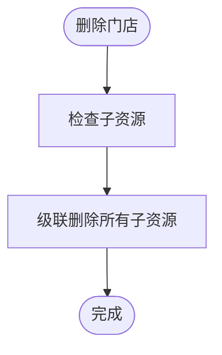

# 实体关系模型

<cite>
**本文引用的文件**
- [schema.prisma](file://prisma/schema.prisma)
- [store-accounts.prisma](file://prisma/purely-profit/stores/store-accounts.prisma)
- [employees.prisma](file://prisma/purely-profit/staff/employees.prisma)
- [members.prisma](file://prisma/purely-profit/member/members.prisma)
- [partners.prisma](file://prisma/purely-profit/member/partners.prisma)
- [platform-membership.prisma](file://prisma/purely-profit/member/platform-membership.prisma)
- [catalog.prisma](file://prisma/purely-profit/goods/catalog.prisma)
- [sales-records.prisma](file://prisma/purely-profit/operations/sales-records.prisma)
- [purchases.prisma](file://prisma/purely-profit/operations/purchases.prisma)
- [costs.prisma](file://prisma/purely-profit/operations/costs.prisma)
- [handover.prisma](file://prisma/purely-profit/operations/handover.prisma)
- [accounts.prisma](file://prisma/purely-profit/finance/accounts.prisma)
- [cash-flows.prisma](file://prisma/purely-profit/finance/cash-flows.prisma)
- [reconciliations.prisma](file://prisma/purely-profit/finance/reconciliations.prisma)
- [customers.prisma](file://prisma/purely-profit/marketing/customers.prisma)
- [products.prisma](file://prisma/purely-profit/marketing/products.prisma)
</cite>

## 目录
1. [引言](#引言)
2. [项目结构](#项目结构)
3. [核心组件](#核心组件)
4. [架构总览](#架构总览)
5. [详细组件分析](#详细组件分析)
6. [依赖分析](#依赖分析)
7. [性能考虑](#性能考虑)
8. [故障排查指南](#故障排查指南)
9. [结论](#结论)
10. [附录](#附录)

## 引言
本文件面向 purelyprofit-server 的数据库设计，基于 Prisma 模式文件构建“实体关系模型（ERD）”与“实体属性对照表”。目标是帮助开发者与产品人员理解业务实体的设计理念、字段含义、关系映射、外键约束与级联策略，并明确业务规则在数据库层面的落地方式。

## 项目结构
Prisma 核心模式通过单一入口 schema.prisma 声明数据源与生成器；具体业务模型按领域拆分至 purely-profit 子目录，便于维护与扩展。核心领域包括：门店与账号（stores）、员工（staff）、会员（member）、商品（goods）、财务（finance）、运营（operations）、营销（marketing）等。

```mermaid
graph TB
A["schema.prisma<br/>声明数据源与生成器"] --> B["stores.store-accounts.prisma<br/>用户/门店/员工/订阅/子账号/交接"]
A --> C["staff.employees.prisma<br/>部门/职位/员工/排班/请假/薪资"]
A --> D["member.members.prisma<br/>会员/积分/贝币/储值"]
A --> E["member.partners.prisma<br/>合伙人/提现/贝币流水"]
A --> F["member.platform-membership.prisma<br/>平台会员计划/门店会员中心"]
A --> G["goods.catalog.prisma<br/>商品分类/商品"]
A --> H["operations.sales-records.prisma<br/>销售订单/明细"]
A --> I["operations.purchases.prisma<br/>供应商/采购单/明细"]
A --> J["operations.costs.prisma<br/>成本记录"]
A --> K["operations.handover.prisma<br/>子账号配额/交接班/附加项"]
A --> L["finance.accounts.prisma<br/>往来账"]
A --> M["finance.cash-flows.prisma<br/>现金流水"]
A --> N["finance.reconciliations.prisma<br/>对账"]
A --> O["marketing.customers.prisma<br/>营销客户/储值/消费/积分"]
A --> P["marketing.products.prisma<br/>营销商品/分类"]
```

图表来源
- [schema.prisma:1-13](file://prisma/schema.prisma#L1-L13)
- [store-accounts.prisma:1-166](file://prisma/purely-profit/stores/store-accounts.prisma#L1-L166)
- [employees.prisma:1-197](file://prisma/purely-profit/staff/employees.prisma#L1-L197)
- [members.prisma:1-147](file://prisma/purely-profit/member/members.prisma#L1-L147)
- [partners.prisma:1-142](file://prisma/purely-profit/member/partners.prisma#L1-L142)
- [platform-membership.prisma:1-127](file://prisma/purely-profit/member/platform-membership.prisma#L1-L127)
- [catalog.prisma:1-48](file://prisma/purely-profit/goods/catalog.prisma#L1-L48)
- [sales-records.prisma:1-68](file://prisma/purely-profit/operations/sales-records.prisma#L1-L68)
- [purchases.prisma:1-65](file://prisma/purely-profit/operations/purchases.prisma#L1-L65)
- [costs.prisma:1-57](file://prisma/purely-profit/operations/costs.prisma#L1-L57)
- [handover.prisma:1-127](file://prisma/purely-profit/operations/handover.prisma#L1-L127)
- [accounts.prisma:1-49](file://prisma/purely-profit/finance/accounts.prisma#L1-L49)
- [cash-flows.prisma:1-56](file://prisma/purely-profit/finance/cash-flows.prisma#L1-L56)
- [reconciliations.prisma:1-76](file://prisma/purely-profit/finance/reconciliations.prisma#L1-L76)
- [customers.prisma:1-146](file://prisma/purely-profit/marketing/customers.prisma#L1-L146)
- [products.prisma:1-44](file://prisma/purely-profit/marketing/products.prisma#L1-L44)

章节来源
- [schema.prisma:1-13](file://prisma/schema.prisma#L1-L13)

## 核心组件
本节概述关键实体及其职责边界，后续章节将深入其属性、关系与约束。

- 用户（User）：系统身份主体，可绑定门店与员工档案，支持实名与身份证唯一性。
- 门店（Store）：业务组织单元，承载所有子域资源（员工、会员、商品、财务、运营等），并维护订阅与伙伴信息。
- 员工（Employee）：员工档案，关联部门/职位，支持排班、请假、薪资与交接。
- 会员（Member）：自有客户体系，管理储值、积分、贝币、充值与消费行为。
- 商品（Product）：商品目录与库存相关的核心实体，支持分类、价格、成本与预警阈值。
- 财务（Finance）：包含往来账、现金流水与对账，支撑收付款与账务核对。
- 运营（Operations）：销售、采购、成本与交接班等日常运营流程。
- 营销（Marketing）：营销客户、储值/消费/积分流水与营销商品。

章节来源
- [store-accounts.prisma:28-109](file://prisma/purely-profit/stores/store-accounts.prisma#L28-L109)
- [employees.prisma:64-106](file://prisma/purely-profit/staff/employees.prisma#L64-L106)
- [members.prisma:40-77](file://prisma/purely-profit/member/members.prisma#L40-L77)
- [catalog.prisma:18-47](file://prisma/purely-profit/goods/catalog.prisma#L18-L47)
- [accounts.prisma:24-48](file://prisma/purely-profit/finance/accounts.prisma#L24-L48)
- [sales-records.prisma:15-40](file://prisma/purely-profit/operations/sales-records.prisma#L15-L40)
- [purchases.prisma:21-43](file://prisma/purely-profit/operations/purchases.prisma#L21-L43)
- [costs.prisma:29-56](file://prisma/purely-profit/operations/costs.prisma#L29-L56)
- [handover.prisma:40-97](file://prisma/purely-profit/operations/handover.prisma#L40-L97)
- [customers.prisma:31-66](file://prisma/purely-profit/marketing/customers.prisma#L31-L66)
- [products.prisma:20-43](file://prisma/purely-profit/marketing/products.prisma#L20-L43)

## 架构总览
下图展示核心实体之间的关系与外键约束方向，体现“以门店为中心”的聚合设计与跨域引用。

```mermaid
erDiagram
USER ||--o{ STORE : "拥有者"
USER ||--o| STAFF : "绑定"
STORE ||--o{ STAFF : "雇佣"
STORE ||--o{ EMPLOYEE : "管理"
STORE ||--o{ MEMBER : "服务"
STORE ||--o{ PRODUCT : "售卖"
STORE ||--o{ PURCHASE_ORDER : "采购"
STORE ||--o{ SALE_ORDER : "销售"
STORE ||--o{ COST_RECORD : "成本"
STORE ||--o{ FINANCE_ACCOUNT_RECORD : "往来账"
STORE ||--o{ FINANCE_CASH_FLOW_RECORD : "现金流"
STORE ||--o{ FINANCE_RECONCILIATION_RECORD : "对账"
STORE ||--o{ MARKETING_CUSTOMER : "营销客户"
STORE ||--o{ MARKETING_PRODUCT : "营销商品"
STAFF ||--o{ MEMBER_POINTS_LOG : "操作"
STAFF ||--o{ MEMBER_BEAN_LOG : "操作"
STAFF ||--o{ MEMBER_RECHARGE_LOG : "操作"
STAFF ||--o{ PARTNER_WITHDRAWAL : "审批"
STAFF ||--o{ FINANCE_ACCOUNT_RECORD : "经办"
STAFF ||--o{ FINANCE_CASH_FLOW_RECORD : "经办"
STAFF ||--o{ FINANCE_RECONCILIATION_RECORD : "经办"
STAFF ||--o{ PURCHASE_ORDER : "经办"
STAFF ||--o{ SALE_ORDER : "经办"
STAFF ||--o{ COST_RECORD : "经办"
EMPLOYEE ||--o{ EMPLOYEE_LEAVE : "请假"
EMPLOYEE ||--o{ EMPLOYEE_SHIFT : "排班"
EMPLOYEE ||--o{ EMPLOYEE_PAYROLL : "薪资"
EMPLOYEE ||--o{ STORE_HANDOVER_RECORD : "交接发起/接收"
MEMBER ||--o{ MEMBER_POINTS_LOG : "产生"
MEMBER ||--o{ MEMBER_BEAN_LOG : "产生"
MEMBER ||--o{ MEMBER_RECHARGE_LOG : "产生"
PRODUCT ||--o{ SALE_ORDER_ITEM : "被售出"
PRODUCT ||--o{ PURCHASE_ORDER_ITEM : "被采购"
PURCHASE_ORDER ||--o{ PURCHASE_ORDER_ITEM : "包含"
SALE_ORDER ||--o{ SALE_ORDER_ITEM : "包含"
SUPPLIER ||--o{ PURCHASE_ORDER : "供应"
SUPPLIER ||--o{ PURCHASE_ORDER_ITEM : "供应"
FINANCE_ACCOUNT_RECORD ||--o{ FINANCE_CASH_FLOW_RECORD : "影响"
FINANCE_ACCOUNT_RECORD ||--o{ FINANCE_RECONCILIATION_RECORD : "核对"
```

图表来源
- [store-accounts.prisma:28-166](file://prisma/purely-profit/stores/store-accounts.prisma#L28-L166)
- [employees.prisma:64-197](file://prisma/purely-profit/staff/employees.prisma#L64-L197)
- [members.prisma:40-147](file://prisma/purely-profit/member/members.prisma#L40-L147)
- [catalog.prisma:3-47](file://prisma/purely-profit/goods/catalog.prisma#L3-L47)
- [sales-records.prisma:15-63](file://prisma/purely-profit/operations/sales-records.prisma#L15-L63)
- [purchases.prisma:3-64](file://prisma/purely-profit/operations/purchases.prisma#L3-L64)
- [costs.prisma:29-56](file://prisma/purely-profit/operations/costs.prisma#L29-L56)
- [accounts.prisma:24-48](file://prisma/purely-profit/finance/accounts.prisma#L24-L48)
- [cash-flows.prisma:32-55](file://prisma/purely-profit/finance/cash-flows.prisma#L32-L55)
- [reconciliations.prisma:28-75](file://prisma/purely-profit/finance/reconciliations.prisma#L28-L75)
- [customers.prisma:31-143](file://prisma/purely-profit/marketing/customers.prisma#L31-L143)
- [products.prisma:3-43](file://prisma/purely-profit/marketing/products.prisma#L3-L43)

## 详细组件分析

### 用户（User）
- 设计理念：统一身份凭证，支持邮箱唯一、实名与身份证唯一，可绑定门店与员工档案。
- 关系映射：
  - 一对一：与 Store.owner（唯一外键）
  - 一对一：与 Staff.user（唯一外键）
- 约束与索引：邮箱唯一、身份证唯一；表映射 users。
- 业务规则：
  - 实名与身份证字段用于合规与风控。
  - 与门店的绑定决定权限边界。

章节来源
- [store-accounts.prisma:28-42](file://prisma/purely-profit/stores/store-accounts.prisma#L28-L42)

### 门店（Store）
- 设计理念：业务组织单元，聚合所有子域资源，维护订阅与伙伴生态。
- 关系映射：
  - 一对多：Staff、Employee、Member、Product、Supplier、PurchaseOrder、SaleOrder、CostRecord、Finance* 等。
  - 一对一：StoreSubscription（唯一外键）。
  - 一对多：StorePartner、StoreMembership*、StoreSubAccount、StoreHandoverRecord 等。
- 约束与索引：owner 唯一、名称索引、联系人索引；表映射 stores。
- 业务规则：
  - 订阅状态与到期时间控制功能启用。
  - 门店维度的全量业务数据隔离。

章节来源
- [store-accounts.prisma:44-109](file://prisma/purely-profit/stores/store-accounts.prisma#L44-L109)

### 员工（Employee）
- 设计理念：员工档案与组织关系，支持部门/职位、排班、请假、薪资与交接。
- 关系映射：
  - 一对一：与 Staff.linkedStaff（唯一外键）。
  - 一对多：EmployeeLeave、EmployeeShift、EmployeePayroll。
  - 一对多：StoreHandoverRecord（作为交班发起方或接收方）。
- 约束与索引：员工编号唯一、状态与部门/职位/入职日期索引；表映射 employees。
- 业务规则：
  - 员工编号唯一性确保业务识别一致性。
  - 排班与请假影响薪资计算与考勤成本。

章节来源
- [employees.prisma:64-106](file://prisma/purely-profit/staff/employees.prisma#L64-L106)

### 会员（Member）
- 设计理念：自有客户体系，管理储值、积分、贝币、充值与消费行为。
- 关系映射：
  - 一对多：MemberPointsLog、MemberBeanLog、MemberRechargeLog。
- 约束与索引：手机号唯一、状态/等级/是否合伙人索引；表映射 members。
- 业务规则：
  - 积分与贝币来源/去向清晰可追溯。
  - 储值与消费形成闭环，支持营销激励。

章节来源
- [members.prisma:40-77](file://prisma/purely-profit/member/members.prisma#L40-L77)

### 商品（Product）
- 设计理念：商品目录与库存相关的核心实体，支持分类、价格、成本与预警阈值。
- 关系映射：
  - 多对一：ProductCategory（可空，支持无分类商品）。
  - 一对多：SaleOrderItem、PurchaseOrderItem、InventoryAdjustmentLog。
- 约束与索引：商品编码唯一、分类/状态/活跃度索引；表映射 products。
- 业务规则：
  - 成本价与利润字段用于核算。
  - 库存与预警阈值保障供应链安全。

章节来源
- [catalog.prisma:18-47](file://prisma/purely-profit/goods/catalog.prisma#L18-L47)

### 财务（Finance）
- 往来账（FinanceAccountRecord）
  - 关系映射：与 Staff.operator（可空）、Store、SaleOrder（可空）。
  - 约束与索引：状态/类型/到期日/经办人索引；表映射 finance_account_records。
  - 业务规则：应收应付分类、到期日控制回款节奏。
- 现金流水（FinanceCashFlowRecord）
  - 关系映射：与 Staff.operator、Store、SaleOrder（唯一关联）。
  - 约束与索引：方向/类别/日期/经办人索引；表映射 finance_cash_flow_records。
  - 业务规则：销售/退款/转账/费用等现金流归类。
- 对账（FinanceReconciliationRecord）
  - 关系映射：与 Staff.operator、Store、ReconciliationItem。
  - 约束与索引：状态/类型/日期/经办人索引；表映射 finance_reconciliation_records。
  - 业务规则：账面与实际差异追踪与调整。

章节来源
- [accounts.prisma:24-48](file://prisma/purely-profit/finance/accounts.prisma#L24-L48)
- [cash-flows.prisma:32-55](file://prisma/purely-profit/finance/cash-flows.prisma#L32-L55)
- [reconciliations.prisma:28-75](file://prisma/purely-profit/finance/reconciliations.prisma#L28-L75)

### 运营（Operations）
- 销售（SaleOrder/SaleOrderItem）
  - 关系映射：与 Staff.operator、Store、Product（明细可空）、InventoryAdjustmentLog、FinanceCashFlowRecord（可空）。
  - 约束与索引：订单号唯一、日期/经办人索引；表映射 sale_orders/sale_order_items。
  - 业务规则：订单号唯一性、明细与库存联动。
- 采购（PurchaseOrder/PurchaseOrderItem）
  - 关系映射：与 Supplier、Store、Product（明细可空）、CostRecord。
  - 约束与索引：日期/供应商/经办人索引；表映射 purchase_orders/purchase_order_items。
  - 业务规则：采购来源与成本归集。
- 成本（CostRecord）
  - 关系映射：与 Staff.operator、Store、PurchaseOrder、EmployeePayroll。
  - 约束与索引：唯一性组合（来源类型+采购单）、日期/类型/类别索引；表映射 cost_records。
  - 业务规则：避免重复入账，支持薪资/保险/公积金等多来源成本。
- 交接班（StoreHandoverRecord/StoreSubAccount）
  - 关系映射：与 Employee.from/to、StoreSubAccount.from/to、Staff.actor。
  - 约束与索引：状态/时间/角色/状态索引；表映射 store_handover_records/store_sub_accounts。
  - 业务规则：主账号与子账号交接模式区分，权限与配额审计。

章节来源
- [sales-records.prisma:15-63](file://prisma/purely-profit/operations/sales-records.prisma#L15-L63)
- [purchases.prisma:21-64](file://prisma/purely-profit/operations/purchases.prisma#L21-L64)
- [costs.prisma:29-56](file://prisma/purely-profit/operations/costs.prisma#L29-L56)
- [handover.prisma:40-127](file://prisma/purely-profit/operations/handover.prisma#L40-L127)

### 营销（Marketing）
- 营销客户（MarketingCustomer）
  - 关系映射：与 Store、MarketingRecharge、MarketingConsumption、MarketingPointsRecord。
  - 约束与索引：手机号唯一、等级/最近访问索引；表映射 marketing_customers。
  - 业务规则：等级随累计消费动态计算。
- 营销商品（MarketingProduct）
  - 关系映射：与 Store、MarketingProductCategory（限制删除）。
  - 约束与索引：名称/价格/状态/分类索引；表映射 marketing_products。
  - 业务规则：营销商品与常规商品分离，便于促销与定价策略。

章节来源
- [customers.prisma:31-143](file://prisma/purely-profit/marketing/customers.prisma#L31-L143)
- [products.prisma:20-43](file://prisma/purely-profit/marketing/products.prisma#L20-L43)

### 员工子域（Department/Position/Shift/Leave/Payroll）
- 部门/职位（EmployeeDepartment/EmployeePosition）
  - 关系映射：与 Store、Employee。
  - 约束与索引：同店同名唯一、更新时间索引；表映射 employee_departments/employee_positions。
- 排班/请假/薪资（EmployeeShift/EmployeeLeave/EmployeePayroll）
  - 关系映射：与 Employee、Store、ShiftDefinition、Payroll。
  - 约束与索引：日期/定义/状态/月份索引；表映射 employee_shifts/employee_leaves/employee_payrolls。
  - 业务规则：薪资唯一性（员工+月），避免重复结算。

章节来源
- [employees.prisma:36-197](file://prisma/purely-profit/staff/employees.prisma#L36-L197)

### 会员子域（合作伙伴/提现/贝币流水）
- 合伙人（StorePartner/StorePartnerApplication/StorePartnerApplicationNote）
  - 关系映射：与 Store、PartnerWithdrawal、StorePartnerBeanLog。
  - 约束与索引：状态/时间/地区索引；表映射 store_partners/store_partner_applications/store_partner_application_notes。
- 提现（PartnerWithdrawal）
  - 关系映射：与 Store、StorePartner、Staff.operator。
  - 约束与索引：状态/时间/经办人索引；表映射 partner_withdrawals。
- 贝币流水（StorePartnerBeanLog）
  - 关系映射：与 Store、StorePartner、MemberBeanSource。
  - 约束与索引：来源/时间索引；表映射 store_partner_bean_logs。

章节来源
- [partners.prisma:30-142](file://prisma/purely-profit/member/partners.prisma#L30-L142)

### 平台会员（StoreMembershipProfile/Order/PointsLog/PromoRecord）
- 门店会员中心（StoreMembershipProfile）
  - 关系映射：与 Store、StoreMembershipOrder、StoreMembershipPointsLog。
  - 约束与索引：到期日索引；表映射 store_membership_profiles。
- 订单（StoreMembershipOrder）
  - 关系映射：与 Store、StoreMembershipProfile、MembershipPaymentChannel。
  - 约束与索引：状态/时间索引；表映射 store_membership_orders。
- 积分流水（StoreMembershipPointsLog）
  - 关系映射：与 Store、StoreMembershipProfile、MemberPointsSource。
  - 约束与索引：来源/时间索引；表映射 store_membership_points_logs。
- 推广记录（StoreMembershipPromoRecord）
  - 关系映射：与 Store、MembershipPlanCycle。
  - 约束与索引：注册/充值/结算时间索引；表映射 store_membership_promo_records。

章节来源
- [platform-membership.prisma:42-127](file://prisma/purely-profit/member/platform-membership.prisma#L42-L127)

## 依赖分析
- 组件耦合：
  - Store 是聚合根，几乎所有实体均以 storeId 聚合，降低跨域查询复杂度。
  - Staff 与 Employee 通过唯一关联实现“一人一档”，避免重复身份。
  - 财务链路：销售订单 → 现金流水/往来账 → 对账，形成闭环。
- 外键与级联策略：
  - 默认：Cascade（删除门店时级联删除其下所有资源）。
  - 特例：SetNull（如 Staff.user、SaleOrderItem.productId、PurchaseOrderItem.productId）。
  - 限制删除：MarketingProduct.categoryId 使用 Restrict，防止误删分类导致商品悬挂。
- 索引策略：
  - 以查询热点字段建立复合索引（如 storeId+date、storeId+status、storeId+type 等）。
  - 唯一性约束：订单号、商品编码、员工编号、手机号、门店订阅等。

图表来源
- [store-accounts.prisma:51](file://prisma/purely-profit/stores/store-accounts.prisma#L51)
- [sales-records.prisma:49](file://prisma/purely-profit/operations/sales-records.prisma#L49)
- [purchases.prisma:52](file://prisma/purely-profit/operations/purchases.prisma#L52)

章节来源
- [store-accounts.prisma:44-109](file://prisma/purely-profit/stores/store-accounts.prisma#L44-L109)
- [sales-records.prisma:15-63](file://prisma/purely-profit/operations/sales-records.prisma#L15-L63)
- [purchases.prisma:21-64](file://prisma/purely-profit/operations/purchases.prisma#L21-L64)
- [products.prisma:25](file://prisma/purely-profit/marketing/products.prisma#L25)

## 性能考虑
- 查询优化：
  - 在高频过滤字段上建立复合索引（如 storeId+date、storeId+status、storeId+type）。
  - 对时间范围查询（如销售/采购/成本/流水）使用索引覆盖。
- 写入优化：
  - 批量写入销售/采购明细时，尽量按 storeId 分组，减少跨分区写入。
  - 成本入账采用唯一性约束（来源类型+关联单据），避免重复写入。
- 存储与精度：
  - 金额/单价统一使用 Decimal(12,2)，避免浮点误差。
  - 积分/贝币使用整数存储，避免小数位问题。
- 可观测性：
  - 为关键实体建立审计字段（createdAt/updatedAt），便于追踪与回溯。

## 故障排查指南
- 常见错误与定位
  - 外键冲突：插入明细时 productId 为空但未设置 SetNull，需检查商品是否存在或是否允许空引用。
  - 订单重复：销售订单号重复，检查唯一性约束与幂等逻辑。
  - 成本重复入账：同一来源类型+采购单已存在，检查唯一性约束。
  - 财务不平：对账差异，核对现金流水与销售订单、采购单的匹配关系。
- 审计与回溯
  - 利用 createdAt/updatedAt 字段定位异常时间窗口。
  - 通过 Staff.operator、StoreSubAccount.assignee 等经办字段快速定位责任人。

章节来源
- [sales-records.prisma:36](file://prisma/purely-profit/operations/sales-records.prisma#L36)
- [costs.prisma:49-50](file://prisma/purely-profit/operations/costs.prisma#L49-L50)
- [cash-flows.prisma:36](file://prisma/purely-profit/finance/cash-flows.prisma#L36)

## 结论
该 ERD 以“门店为中心”的聚合设计，结合严格的外键约束、索引与唯一性约束，实现了从用户、员工、会员、商品到财务、运营、营销的全链路业务闭环。通过清晰的关系映射与级联策略，既保证了数据一致性，也为后续扩展（如多门店伙伴、多子账号、多周期会员计划）提供了稳定基座。

## 附录

### 实体属性对照表（摘要）
- 用户（User）
  - 关键字段：email（唯一）、realName、idNumber（唯一）、name、avatar、createdAt、updatedAt
  - 关系：一对一（Owner→Store）、一对一（User→Staff）
- 门店（Store）
  - 关键字段：name、contactName、contactPhone、address、ownerId（唯一）、maxAccountSeats、createdAt、updatedAt
  - 关系：一对多（Staff、Employee、Member、Product、Supplier、PurchaseOrder、SaleOrder、CostRecord、Finance*）
- 员工（Employee）
  - 关键字段：empNo（唯一）、name、phone、department、position、joinDate、baseSalary、gender、status、createdAt、updatedAt
  - 关系：一对多（EmployeeLeave、EmployeeShift、EmployeePayroll、StoreHandoverRecord）
- 会员（Member）
  - 关键字段：name、phone、gender、level、tags、birthday、lastConsumeAt、totalConsumeAmount、totalConsumeCount、points、beanBalance、status、createdAt、updatedAt
  - 关系：一对多（MemberPointsLog、MemberBeanLog、MemberRechargeLog）
- 商品（Product）
  - 关键字段：code（唯一）、name、category、price、profit、costPrice、unit、stock、alertThreshold、isActive、createdAt、updatedAt
  - 关系：一对多（SaleOrderItem、PurchaseOrderItem、InventoryAdjustmentLog）
- 财务（Finance）
  - 往来账：counterpart、amount、paidAmount、remaining、status、dueDate、date、note
  - 现金流：direction、category、title、amount、payment、date、note
  - 对账：title、type、status、channel、periodStart、periodEnd、book/net、actual/net、diffAmount、adjustNote、date
- 运营（Operations）
  - 销售：orderNo（唯一）、totalRevenue、totalProfit、totalQuantity、paymentMethod、calcMode、date、note
  - 采购：supplierId、supplierName、totalAmount、date、note
  - 成本：title、type、category、amount、date、note
  - 交接班：from/to Employee/SubAccount、actor Staff、handoverMode、status、handoverAt、note
- 营销（Marketing）
  - 营销客户：name、phone、avatar、tier、balance、points、totalSpent、visitCount、lastVisitAt、remark
  - 营销商品：name、price、originalPrice、image、description、durationMinutes、personCount、isActive

章节来源
- [store-accounts.prisma:28-109](file://prisma/purely-profit/stores/store-accounts.prisma#L28-L109)
- [employees.prisma:64-106](file://prisma/purely-profit/staff/employees.prisma#L64-L106)
- [members.prisma:40-77](file://prisma/purely-profit/member/members.prisma#L40-L77)
- [catalog.prisma:18-47](file://prisma/purely-profit/goods/catalog.prisma#L18-L47)
- [accounts.prisma:24-48](file://prisma/purely-profit/finance/accounts.prisma#L24-L48)
- [cash-flows.prisma:32-55](file://prisma/purely-profit/finance/cash-flows.prisma#L32-L55)
- [reconciliations.prisma:28-75](file://prisma/purely-profit/finance/reconciliations.prisma#L28-L75)
- [sales-records.prisma:15-40](file://prisma/purely-profit/operations/sales-records.prisma#L15-L40)
- [purchases.prisma:21-43](file://prisma/purely-profit/operations/purchases.prisma#L21-L43)
- [costs.prisma:29-56](file://prisma/purely-profit/operations/costs.prisma#L29-L56)
- [handover.prisma:64-97](file://prisma/purely-profit/operations/handover.prisma#L64-L97)
- [customers.prisma:31-66](file://prisma/purely-profit/marketing/customers.prisma#L31-L66)
- [products.prisma:20-43](file://prisma/purely-profit/marketing/products.prisma#L20-L43)