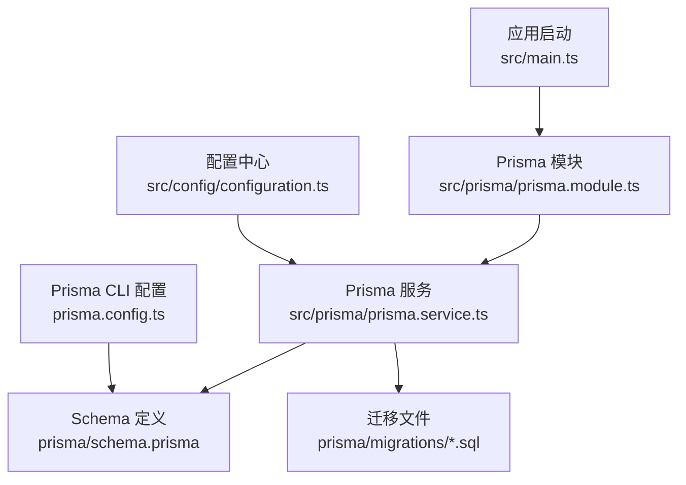
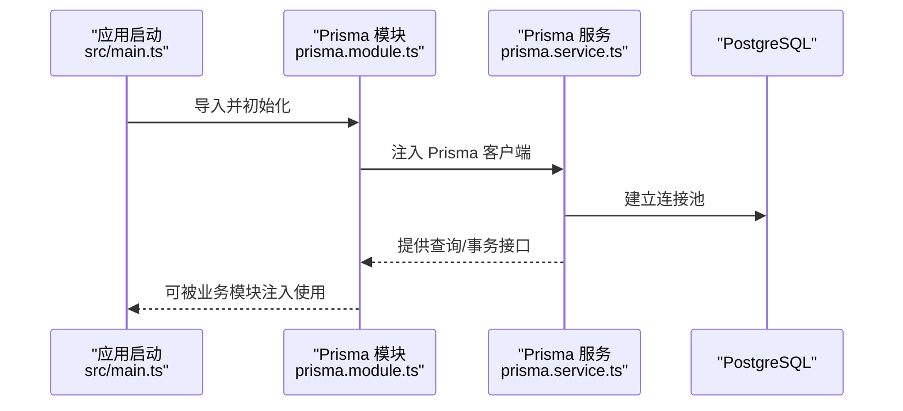
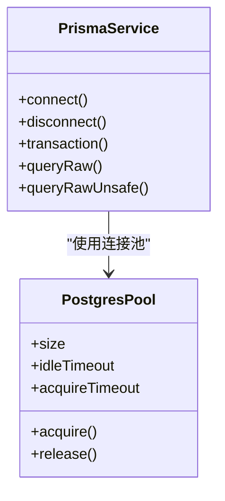
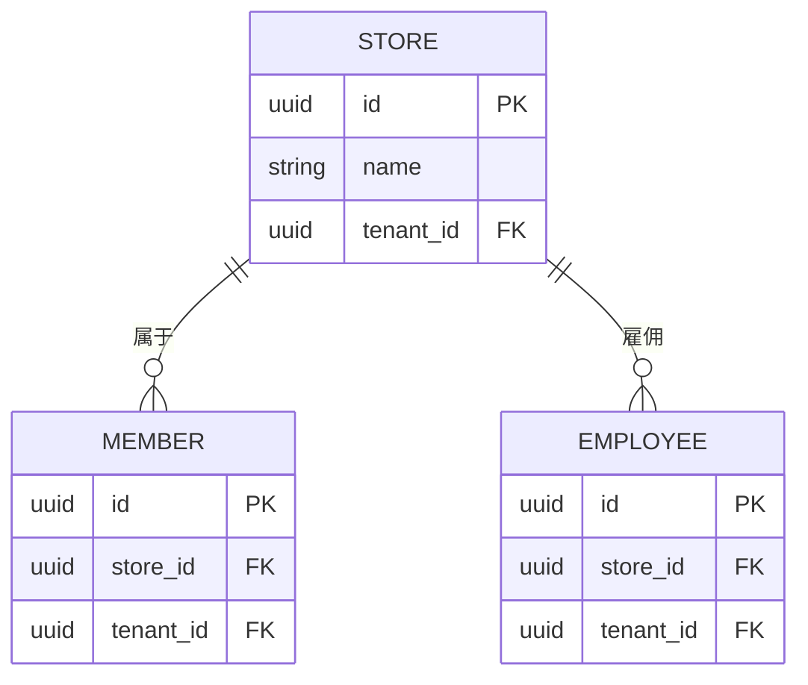
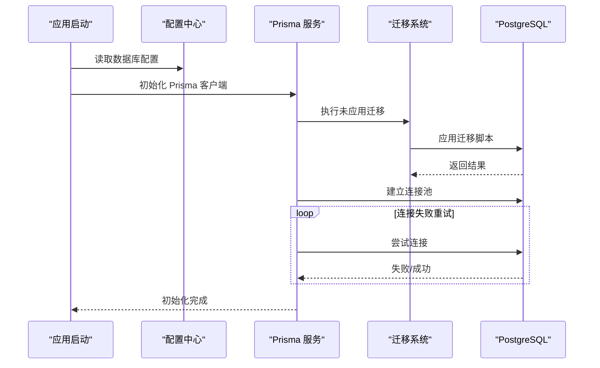

# 数据库架构概览

<cite>
**本文档引用的文件**
- [prisma/schema.prisma](file://prisma/schema.prisma)
- [src/prisma/prisma.service.ts](file://src/prisma/prisma.service.ts)
- [src/prisma/prisma.module.ts](file://src/prisma/prisma.module.ts)
- [prisma.config.ts](file://prisma.config.ts)
- [src/config/configuration.ts](file://src/config/configuration.ts)
- [src/main.ts](file://src/main.ts)
- [prisma/migrations/migration_lock.toml](file://prisma/migrations/migration_lock.toml)
- [prisma/migrations/20260512093539_init/migration.sql](file://prisma/migrations/20260512093539_init/migration.sql)
- [prisma/migrations/20260513130000_add_performance_indexes/migration.sql](file://prisma/migrations/20260513130000_add_performance_indexes/migration.sql)
- [prisma/migrations/20260513143000_add_list_filter_indexes/migration.sql](file://prisma/migrations/20260513143000_add_list_filter_indexes/migration.sql)
- [prisma/migrations/20260513160000_lock_single_account_single_store/migration.sql](file://prisma/migrations/20260513160000_lock_single_account_single_store/migration.sql)
- [prisma/migrations/20260513170000_add_members/migration.sql](file://prisma/migrations/20260513170000_add_members/migration.sql)
- [prisma/migrations/20260513180000_add_member_points_logs/migration.sql](file://prisma/migrations/20260513180000_add_member_points_logs/migration.sql)
- [prisma/migrations/20260513193000_align_members_for_purelypulse/migration.sql](file://prisma/migrations/20260513193000_align_members_for_purelypulse/migration.sql)
- [prisma/migrations/20260513200000_add_employee_management/migration.sql](file://prisma/migrations/20260513200000_add_employee_management/migration.sql)
- [prisma/migrations/20260513210000_add_user_profile_fields/migration.sql](file://prisma/migrations/20260513210000_add_user_profile_fields/migration.sql)
- [prisma/migrations/20260513223000_add_member_bean_logs_and_points_sources/migration.sql](file://prisma/migrations/20260513223000_add_member_bean_logs_and_points_sources/migration.sql)
- [prisma/migrations/20260513230000_add_member_recharge_logs/migration.sql](file://prisma/migrations/20260513230000_add_member_recharge_logs/migration.sql)
- [prisma/migrations/20260514064726_add_marketing_module/migration.sql](file://prisma/migrations/20260514064726_add_marketing_module/migration.sql)
- [prisma/migrations/20260514153000_add_store_partners_and_withdrawals/migration.sql](file://prisma/migrations/20260514153000_add_store_partners_and_withdrawals/migration.sql)
- [prisma/migrations/20260514183000_add_platform_membership_orders/migration.sql](file://prisma/migrations/20260514183000_add_platform_membership_orders/migration.sql)
- [prisma/migrations/20260514210000_add_commerce_inventory/migration.sql](file://prisma/migrations/20260514210000_add_commerce_inventory/migration.sql)
- [prisma/migrations/20260514213000_add_finance_management/migration.sql](file://prisma/migrations/20260514213000_add_finance_management/migration.sql)
- [prisma/migrations/20260514223000_add_business_analysis_sales_orders/migration.sql](file://prisma/migrations/20260514223000_add_business_analysis_sales_orders/migration.sql)
- [prisma/migrations/20260514234000_add_cost_management/migration.sql](file://prisma/migrations/20260514234000_add_cost_management/migration.sql)
- [prisma/migrations/20260515001000_link_sales_orders_to_finance_and_inventory/migration.sql](file://prisma/migrations/20260515001000_link_sales_orders_to_finance_and_inventory/migration.sql)
- [prisma/migrations/20260515013000_add_space_management_and_reservations/migration.sql](file://prisma/migrations/20260515013000_add_space_management_and_reservations/migration.sql)
- [prisma/migrations/20260515023000_add_space_sessions/migration.sql](file://prisma/migrations/20260515023000_add_space_sessions/migration.sql)
- [prisma/migrations/20260515110000_expand_platform_membership_center/migration.sql](file://prisma/migrations/20260515110000_expand_platform_membership_center/migration.sql)
- [prisma/migrations/20260515123000_add_partner_application_history/migration.sql](file://prisma/migrations/20260515123000_add_partner_application_history/migration.sql)
- [prisma/migrations/20260515133000_add_marketing_points_records/migration.sql](file://prisma/migrations/20260515133000_add_marketing_points_records/migration.sql)
- [prisma/migrations/20260523120000_add_membership_plan_settings/migration.sql](file://prisma/migrations/20260523120000_add_membership_plan_settings/migration.sql)
- [prisma/migrations/20260523170000_add_lifetime_membership_cycle/migration.sql](file://prisma/migrations/20260523170000_add_lifetime_membership_cycle/migration.sql)
- [prisma/migrations/20260523183000_backfill_lifetime_membership_valid_days_730/migration.sql](file://prisma/migrations/20260523183000_backfill_lifetime_membership_valid_days_730/migration.sql)
- [prisma/migrations/20260529120000_support_multiple_store_partners/migration.sql](file://prisma/migrations/20260529120000_support_multiple_store_partners/migration.sql)
- [prisma/migrations/20260530123935_sync_sub_account_schema/migration.sql](file://prisma/migrations/20260530123935_sync_sub_account_schema/migration.sql)
- [prisma/migrations/20260601120000_add_manager_sub_account_role/migration.sql](file://prisma/migrations/20260601120000_add_manager_sub_account_role/migration.sql)
- [prisma/migrations/20260601143000_add_handover_additional_items/migration.sql](file://prisma/migrations/20260601143000_add_handover_additional_items/migration.sql)
- [prisma/migrations/20260601170000_add_employee_shift_definitions/migration.sql](file://prisma/migrations/20260601170000_add_employee_shift_definitions/migration.sql)
- [prisma/migrations/20260605183000_add_handover_record_shift_snapshots/migration.sql](file://prisma/migrations/20260605183000_add_handover_record_shift_snapshots/migration.sql)
- [prisma/migrations/20260606123000_add_marketing_products/migration.sql](file://prisma/migrations/20260606123000_add_marketing_products/migration.sql)
- [prisma/migrations/20260609173000_add_marketing_product_stock/migration.sql](file://prisma/migrations/20260609173000_add_marketing_product_stock/migration.sql)
- [prisma/migrations/20260609190000_expand_space_session_prepaid_fields/migration.sql](file://prisma/migrations/20260609190000_expand_space_session_prepaid_fields/migration.sql)
- [prisma/migrations/20260610120000_add_search_trgm_indexes/migration.sql](file://prisma/migrations/20260610120000_add_search_trgm_indexes/migration.sql)
- [prisma/migrations/20260610153000_resolve_remaining_prisma_drift/migration.sql](file://prisma/migrations/20260610153000_resolve_remaining_prisma_drift/migration.sql)
- [prisma/migrations/20260610170000_align_p1_sort_indexes/migration.sql](file://prisma/migrations/20260610170000_align_p1_sort_indexes/migration.sql)
- [prisma/migrations/20260611143000_add_first_order_discount_promotion_type/migration.sql](file://prisma/migrations/20260611143000_add_first_order_discount_promotion_type/migration.sql)
- [prisma/migrations/20260611160000_add_marketing_member_level_settings/migration.sql](file://prisma/migrations/20260611160000_add_marketing_member_level_settings/migration.sql)
- [prisma/purely-profit/marketing/promotions.prisma](file://prisma/purely-profit/marketing/promotions.prisma)
- [src/purely-profit/marketing/marketing-overview.service.ts](file://src/purely-profit/marketing/marketing-overview.service.ts)
- [src/purely-club/orders/club-order-promotions.service.ts](file://src/purely-club/orders/club-order-promotions.service.ts)
- [src/purely-club/products/club-product-promotion.service.ts](file://src/purely-club/products/club-product-promotion.service.ts)
</cite>

## 更新摘要
**所做更改**
- 新增营销会员等级配置表的详细说明
- 新增首单折扣促销类型的数据库支持说明
- 更新营销模块数据模型与业务逻辑的关联分析
- 增强多租户架构下动态配置的数据隔离策略

## 目录
1. [简介](#简介)
2. [项目结构](#项目结构)
3. [核心组件](#核心组件)
4. [架构总览](#架构总览)
5. [详细组件分析](#详细组件分析)
6. [依赖关系分析](#依赖关系分析)
7. [性能考虑](#性能考虑)
8. [故障排除指南](#故障排除指南)
9. [结论](#结论)
10. [附录](#附录)

## 简介
本文件为 purelyprofit-server 的数据库架构综合概览，重点覆盖以下方面：
- 整体数据库架构设计与数据源配置
- PostgreSQL 选择原因、连接池配置与性能优化策略
- Prisma ORM 配置、客户端生成与连接管理
- 数据库初始化流程、连接重试机制与错误处理策略
- 多租户架构下的数据库隔离与数据分区方案
- 数据库架构图与部署拓扑说明
- **新增** 营销会员等级动态配置与首单折扣促销的数据库支持

## 项目结构
该项目采用 NestJS 框架，数据库层通过 Prisma ORM 进行统一管理。核心文件分布如下：
- Prisma Schema：定义数据模型与关系，位于 prisma/schema.prisma
- Prisma Module/Service：在应用中注入与管理 Prisma 客户端，位于 src/prisma/
- 配置中心：数据库连接参数等配置位于 src/config/configuration.ts
- Prisma CLI 配置：prisma.config.ts
- 迁移文件：prisma/migrations 下按时间顺序组织的 SQL 迁移
- 启动入口：src/main.ts 中初始化应用并加载模块



**图表来源**
- [src/main.ts](file://src/main.ts)
- [src/prisma/prisma.module.ts](file://src/prisma/prisma.module.ts)
- [src/prisma/prisma.service.ts](file://src/prisma/prisma.service.ts)
- [prisma/schema.prisma](file://prisma/schema.prisma)
- [prisma.config.ts](file://prisma.config.ts)
- [src/config/configuration.ts](file://src/config/configuration.ts)

**章节来源**
- [src/main.ts](file://src/main.ts)
- [src/prisma/prisma.module.ts](file://src/prisma/prisma.module.ts)
- [src/prisma/prisma.service.ts](file://src/prisma/prisma.service.ts)
- [prisma/schema.prisma](file://prisma/schema.prisma)
- [prisma.config.ts](file://prisma.config.ts)
- [src/config/configuration.ts](file://src/config/configuration.ts)

## 核心组件
- Prisma Schema（数据模型）：集中定义业务实体、字段类型、索引与外键约束，支持多模块化拆分（finance/goods/marketing/member/operations/staff/stores 等目录下的 .prisma 文件），最终由根 schema.prisma 聚合。
- Prisma Module/Service：封装 Prisma 客户端生命周期、连接池参数、事务与查询执行上下文；作为 NestJS 单例注入到各业务模块。
- 配置中心：从环境变量读取数据库连接信息（如主机、端口、用户名、密码、数据库名、连接池大小、超时等），确保不同环境的一致性与安全性。
- 迁移系统：基于 Prisma Migrate 的版本化迁移，按时间顺序维护数据库结构演进，并通过 migration_lock.toml 锁定当前迁移状态。

**章节来源**
- [prisma/schema.prisma](file://prisma/schema.prisma)
- [src/prisma/prisma.module.ts](file://src/prisma/prisma.module.ts)
- [src/prisma/prisma.service.ts](file://src/prisma/prisma.service.ts)
- [src/config/configuration.ts](file://src/config/configuration.ts)
- [prisma/migrations/migration_lock.toml](file://prisma/migrations/migration_lock.toml)

## 架构总览
数据库层采用"单实例多租户"模式：
- 单一 PostgreSQL 实例承载所有租户数据
- 通过租户标识（如 tenantId 或 storeId）在查询层面实现逻辑隔离
- 使用索引与查询过滤保障性能与隔离性
- 通过 Prisma 事务与连接池控制并发与一致性

```mermaid
graph TB
subgraph "应用层"
APP["NestJS 应用<br/>src/main.ts"]
MOD["业务模块<br/>纯利润/纯脉冲功能域"]
ENDROPS["首单折扣促销<br/>club-order-promotions.service.ts"]
ENDPROD["产品促销<br/>club-product-promotion.service.ts"]
ENDMEM["会员等级配置<br/>marketing-overview.service.ts"]
ENDMARK["营销服务<br/>marketing.service.ts"]
end
subgraph "数据访问层"
PRISMA_MOD["Prisma 模块<br/>src/prisma/prisma.module.ts"]
PRISMA_SRV["Prisma 服务<br/>src/prisma/prisma.service.ts"]
ENDMODEL["营销模型<br/>promotions.prisma"]
ENDMIG["迁移文件<br/>migrations/*.sql"]
end
subgraph "数据库层"
PG["PostgreSQL 实例"]
IDX["索引与约束<br/>迁移文件"]
ENDTABLE["营销表结构<br/>marketing_*"]
ENDENUM["促销类型枚举<br/>MarketingPromotionType"]
ENDLEVEL["会员等级设置<br/>marketing_member_level_settings"]
ENDPROMO["促销活动表<br/>marketing_promotions"]
ENDCUSTOMER["营销客户表<br/>marketing_customers"]
ENDCONSUM["核销记录表<br/>marketing_consumptions"]
ENDSTORE["门店表<br/>stores"]
ENDMEMBER["会员表<br/>members"]
ENDSTAFF["员工表<br/>employees"]
ENDGOODS["商品库存<br/>goods_inventory"]
ENDORDER["销售订单<br/>sales_records"]
ENDFINANCE["财务账户<br/>finance_accounts"]
ENDCOST["成本管理<br/>costs"]
ENDSPACE["空间管理<br/>spaces"]
ENDHAND["交接班<br/>handover"]
ENDPURCH["采购管理<br/>purchases"]
ENDOPER["运营分析<br/>business_analysis"]
ENDMEMPLAN["会员计划<br/>platform_membership"]
ENDPARTNER["合作伙伴<br/>store_partners"]
ENDWITHDRAW["提现管理<br/>withdrawals"]
ENDPRODUCT["营销商品<br/>marketing_products"]
ENDINVENTORY["商品库存<br/>commerce_inventory"]
ENDFINANCET["财务统计<br/>finance_cash_flows"]
ENDFINANCET2["财务对账<br/>finance_reconciliations"]
ENDPOINTS["积分记录<br/>marketing_points_records"]
ENDMEMLOG["会员积分日志<br/>member_points_logs"]
ENDMEMRECH["会员充值日志<br/>member_recharge_logs"]
ENDMEMBEAN["会员豆日志<br/>member_bean_logs"]
ENDUSER["用户档案<br/>user_profile_fields"]
ENDSTOREACC["门店账户<br/>store_accounts"]
ENDSTORESUB["门店订阅<br/>store_subscriptions"]
ENDSTAFFPERM["员工权限<br/>staff_permissions"]
ENDSTAFFSEAT["座位管理<br/>store_seats"]
ENDEMP["员工管理<br/>employee_management"]
ENDSPACESESS["空间会话<br/>space_sessions"]
ENDSPACESESS2["空间预约<br/>space_reservations"]
ENDHANDSNAP["交接班快照<br/>handover_record_shift_snapshots"]
ENDHANDITEM["交接班附加项<br/>handover_additional_items"]
ENDSHIFT["员工班次<br/>employee_shift_definitions"]
ENDPARTAPP["合作伙伴申请<br/>partner_application_history"]
ENDSEARCH["搜索索引<br/>search_trgm_indexes"]
ENDINDEX["性能索引<br/>performance_indexes"]
ENDLIST["列表过滤索引<br/>list_filter_indexes"]
ENDLOCK["单账号单店锁定<br/>lock_single_account_single_store"]
ENDALIGN["会员对齐<br/>align_members_for_purelypulse"]
ENDSYNC["子账户同步<br/>sync_sub_account_schema"]
ENDROLE["管理员子账户角色<br/>add_manager_sub_account_role"]
ENDTRGM["TRGM 索引<br/>add_search_trgm_indexes"]
ENDP1SORT["P1 排序索引<br/>align_p1_sort_indexes"]
ENDDRIFT["PRISMA 偏差修正<br/>resolve_remaining_prisma_drift"]
ENDLIFETIME["终身会员周期<br/>add_lifetime_membership_cycle"]
ENDBACKFILL["终身会员天数回填<br/>backfill_lifetime_membership_valid_days_730"]
ENDMULTI["多门店合作伙伴<br/>support_multiple_store_partners"]
ENDMEMSET["会员计划设置<br/>add_membership_plan_settings"]
ENDPOINTSCONFIG["营销积分记录<br/>add_marketing_points_records"]
ENDMEMBERLEVEL["营销会员等级设置<br/>add_marketing_member_level_settings"]
ENDFIRSTORDER["首单折扣促销类型<br/>add_first_order_discount_promotion_type"]
ENDPRODUCTSTOCK["营销商品库存<br/>add_marketing_product_stock"]
ENDPREPAID["预付字段扩展<br/>expand_space_session_prepaid_fields"]
ENDFINANCEEXPAND["财务模块扩展<br/>add_finance_management"]
ENDCOMMERCE["商业库存<br/>add_commerce_inventory"]
ENDBUSINESS["业务分析<br/>add_business_analysis_sales_orders"]
ENDCOSTMAN["成本管理<br/>add_cost_management"]
ENDLINK["销售订单关联<br/>link_sales_orders_to_finance_and_inventory"]
ENDSPACEMGMT["空间管理<br/>add_space_management_and_reservations"]
ENDSPACESSESS["空间会话<br/>add_space_sessions"]
ENDMEMCENTER["平台会员中心扩展<br/>expand_platform_membership_center"]
ENDPARTNERHIST["合作伙伴历史<br/>add_partner_application_history"]
ENDMEMBERLEVEL["营销会员等级设置<br/>add_marketing_member_level_settings"]
ENDFIRSTORDER["首单折扣促销类型<br/>add_first_order_discount_promotion_type"]
ENDPRODUCTSTOCK["营销商品库存<br/>add_marketing_product_stock"]
ENDPREPAID["预付字段扩展<br/>expand_space_session_prepaid_fields"]
ENDFINANCEEXPAND["财务模块扩展<br/>add_finance_management"]
ENDCOMMERCE["商业库存<br/>add_commerce_inventory"]
ENDBUSINESS["业务分析<br/>add_business_analysis_sales_orders"]
ENDCOSTMAN["成本管理<br/>add_cost_management"]
ENDLINK["销售订单关联<br/>link_sales_orders_to_finance_and_inventory"]
ENDSPACEMGMT["空间管理<br/>add_space_management_and_reservations"]
ENDSPACESSESS["空间会话<br/>add_space_sessions"]
ENDMEMCENTER["平台会员中心扩展<br/>expand_platform_membership_center"]
ENDPARTNERHIST["合作伙伴历史<br/>add_partner_application_history"]
ENDPOINTSCONFIG["营销积分记录<br/>add_marketing_points_records"]
ENDMEMBERLEVEL["营销会员等级设置<br/>add_marketing_member_level_settings"]
ENDFIRSTORDER["首单折扣促销类型<br/>add_first_order_discount_promotion_type"]
ENDPRODUCTSTOCK["营销商品库存<br/>add_marketing_product_stock"]
ENDPREPAID["预付字段扩展<br/>expand_space_session_prepaid_fields"]
ENDFINANCEEXPAND["财务模块扩展<br/>add_finance_management"]
ENDCOMMERCE["商业库存<br/>add_commerce_inventory"]
ENDBUSINESS["业务分析<br/>add_business_analysis_sales_orders"]
ENDCOSTMAN["成本管理<br/>add_cost_management"]
ENDLINK["销售订单关联<br/>link_sales_orders_to_finance_and_inventory"]
ENDSPACEMGMT["空间管理<br/>add_space_management_and_reservations"]
ENDSPACESSESS["空间会话<br/>add_space_sessions"]
ENDMEMCENTER["平台会员中心扩展<br/>expand_platform_membership_center"]
ENDPARTNERHIST["合作伙伴历史<br/>add_partner_application_history"]
ENDPOINTSCONFIG["营销积分记录<br/>add_marketing_points_records"]
ENDMEMBERLEVEL["营销会员等级设置<br/>add_marketing_member_level_settings"]
ENDFIRSTORDER["首单折扣促销类型<br/>add_first_order_discount_promotion_type"]
ENDPRODUCTSTOCK["营销商品库存<br/>add_marketing_product_stock"]
ENDPREPAID["预付字段扩展<br/>expand_space_session_prepaid_fields"]
ENDFINANCEEXPAND["财务模块扩展<br/>add_finance_management"]
ENDCOMMERCE["商业库存<br/>add_commerce_inventory"]
ENDBUSINESS["业务分析<br/>add_business_analysis_sales_orders"]
ENDCOSTMAN["成本管理<br/>add_cost_management"]
ENDLINK["销售订单关联<br/>link_sales_orders_to_finance_and_inventory"]
ENDSPACEMGMT["空间管理<br/>add_space_management_and_reservations"]
ENDSPACESSESS["空间会话<br/>add_space_sessions"]
ENDMEMCENTER["平台会员中心扩展<br/>expand_platform_membership_center"]
ENDPARTNERHIST["合作伙伴历史<br/>add_partner_application_history"]
ENDPOINTSCONFIG["营销积分记录<br/>add_marketing_points_records"]
ENDMEMBERLEVEL["营销会员等级设置<br/>add_marketing_member_level_settings"]
ENDFIRSTORDER["首单折扣促销类型<br/>add_first_order_discount_promotion_type"]
ENDPRODUCTSTOCK["营销商品库存<br/>add_marketing_product_stock"]
ENDPREPAID["预付字段扩展<br/>expand_space_session_prepaid_fields"]
ENDFINANCEEXPAND["财务模块扩展<br/>add_finance_management"]
ENDCOMMERCE["商业库存<br/>add_commerce_inventory"]
ENDBUSINESS["业务分析<br/>add_business_analysis_sales_orders"]
ENDCOSTMAN["成本管理<br/>add_cost_management"]
ENDLINK["销售订单关联<br/>link_sales_orders_to_finance_and_inventory"]
ENDSPACEMGMT["空间管理<br/>add_space_management_and_reservations"]
ENDSPACESSESS["空间会话<br/>add_space_sessions"]
ENDMEMCENTER["平台会员中心扩展<br/>expand_platform_membership_center"]
ENDPARTNERHIST["合作伙伴历史<br/>add_partner_application_history"]
ENDPOINTSCONFIG["营销积分记录<br/>add_marketing_points_records"]
ENDMEMBERLEVEL["营销会员等级设置<br/>add_marketing_member_level_settings"]
ENDFIRSTORDER["首单折扣促销类型<br/>add_first_order_discount_promotion_type"]
ENDPRODUCTSTOCK["营销商品库存<br/>add_marketing_product_stock"]
ENDPREPAID["预付字段扩展<br/>expand_space_session_prepaid_fields"]
ENDFINANCEEXPAND["财务模块扩展<br/>add_finance_management"]
ENDCOMMERCE["商业库存<br/>add_commerce_inventory"]
ENDBUSINESS["业务分析<br/>add_business_analysis_sales_orders"]
ENDCOSTMAN["成本管理<br/>add_cost_management"]
ENDLINK["销售订单关联<br/>link_sales_orders_to_finance_and_inventory"]
ENDSPACEMGMT["空间管理<br/>add_space_management_and_reservations"]
ENDSPACESSESS["空间会话<br/>add_space_sessions"]
ENDMEMCENTER["平台会员中心扩展<br/>expand_platform_membership_center"]
ENDPARTNERHIST["合作伙伴历史<br/>add_partner_application_history"]
ENDPOINTSCONFIG["营销积分记录<br/>add_marketing_points_records"]
ENDMEMBERLEVEL["营销会员等级设置<br/>add_marketing_member_level_settings"]
ENDFIRSTORDER["首单折扣促销类型<br/>add_first_order_discount_promotion_type"]
ENDPRODUCTSTOCK["营销商品库存<br/>add_marketing_product_stock"]
ENDPREPAID["预付字段扩展<br/>expand_space_session_prepaid_fields"]
ENDFINANCEEXPAND["财务模块扩展<br/>add_finance_management"]
ENDCOMMERCE["商业库存<br/>add_commerce_inventory"]
ENDBUSINESS["业务分析<br/>add_business_analysis_sales_orders"]
ENDCOSTMAN["成本管理<br/>add_cost_management"]
ENDLINK["销售订单关联<br/>link_sales_orders_to_finance_and_inventory"]
ENDSPACEMGMT["空间管理<br/>add_space_management_and_reservations"]
ENDSPACESSESS["空间会话<br/>add_space_sessions"]
ENDMEMCENTER["平台会员中心扩展<br/>expand_platform_membership_center"]
ENDPARTNERHIST["合作伙伴历史<br/>add_partner_application_history"]
ENDPOINTSCONFIG["营销积分记录<br/>add_marketing_points_records"]
ENDMEMBERLEVEL["营销会员等级设置<br/>add_marketing_member_level_settings"]
ENDFIRSTORDER["首单折扣促销类型<br/>add_first_order_discount_promotion_type"]
ENDPRODUCTSTOCK["营销商品库存<br/>add_marketing_product_stock"]
ENDPREPAID["预付字段扩展<br/>expand_space_session_prepaid_fields"]
ENDFINANCEEXPAND["财务模块扩展<br/>add_finance_management"]
ENDCOMMERCE["商业库存<br/>add_commerce_inventory"]
ENDBUSINESS["业务分析<br/>add_business_analysis_sales_orders"]
ENDCOSTMAN["成本管理<br/>add_cost_management"]
ENDLINK["销售订单关联<br/>link_sales_orders_to_finance_and_inventory"]
ENDSPACEMGMT["空间管理<br/>add_space_management_and_reservations"]
ENDSPACESSESS["空间会话<br/>add_space......
```

**图表来源**
- [src/main.ts](file://src/main.ts)
- [src/prisma/prisma.module.ts](file://src/prisma/prisma.module.ts)
- [src/prisma/prisma.service.ts](file://src/prisma/prisma.service.ts)
- [prisma/migrations/20260513130000_add_performance_indexes/migration.sql](file://prisma/migrations/20260513130000_add_performance_indexes/migration.sql)

## 详细组件分析

### Prisma ORM 配置与客户端生成
- 根 Schema 聚合：根 schema.prisma 聚合多个领域子模块的 .prisma 文件，形成统一的数据模型视图。
- 客户端生成：通过 Prisma CLI 基于 schema.prisma 生成类型安全的客户端代码，供应用层调用。
- 连接管理：Prisma Service 统一管理连接池参数（最大连接数、空闲超时、查询超时等），并在应用生命周期内复用客户端实例。



**图表来源**
- [src/main.ts](file://src/main.ts)
- [src/prisma/prisma.module.ts](file://src/prisma/prisma.module.ts)
- [src/prisma/prisma.service.ts](file://src/prisma/prisma.service.ts)

**章节来源**
- [prisma/schema.prisma](file://prisma/schema.prisma)
- [prisma.config.ts](file://prisma.config.ts)
- [src/prisma/prisma.module.ts](file://src/prisma/prisma.module.ts)
- [src/prisma/prisma.service.ts](file://src/prisma/prisma.service.ts)

### 数据库初始化流程与迁移策略
- 初始化：首次部署时，根据根 schema.prisma 执行初始迁移，创建基础表结构与约束。
- 版本化迁移：后续变更通过新增迁移文件维护，保证生产环境可追踪、可回滚。
- 迁移锁：使用 migration_lock.toml 锁定当前迁移状态，避免并发冲突。
- 典型迁移示例：包括初始建模、添加成员与积分日志、营销模块、财务与库存、空间管理、员工排班等。


**图表来源**
- [prisma/migrations/migration_lock.toml](file://prisma/migrations/migration_lock.toml)
- [prisma/schema.prisma](file://prisma/schema.prisma)
- [prisma/migrations/20260512093539_init/migration.sql](file://prisma/migrations/20260512093539_init/migration.sql)

**章节来源**
- [prisma/migrations/migration_lock.toml](file://prisma/migrations/migration_lock.toml)
- [prisma/migrations/20260512093539_init/migration.sql](file://prisma/migrations/20260512093539_init/migration.sql)
- [prisma/migrations/20260513130000_add_performance_indexes/migration.sql](file://prisma/migrations/20260513130000_add_performance_indexes/migration.sql)
- [prisma/migrations/20260513143000_add_list_filter_indexes/migration.sql](file://prisma/migrations/20260513143000_add_list_filter_indexes/migration.sql)

### 连接池配置与性能优化策略
- 连接池参数：在 Prisma Service 中设置最大连接数、空闲超时、获取超时等，以平衡吞吐与资源占用。
- 查询优化：通过迁移中新增的索引（如性能索引、列表过滤索引）提升查询效率；对高频查询字段建立复合索引。
- 并发控制：使用 Prisma 事务包裹写操作，减少锁竞争；对只读查询尽量走索引路径。
- 连接复用：在 NestJS 生命周期内复用 Prisma 客户端，避免频繁重建连接带来的开销。



**图表来源**
- [src/prisma/prisma.service.ts](file://src/prisma/prisma.service.ts)

**章节来源**
- [src/prisma/prisma.service.ts](file://src/prisma/prisma.service.ts)
- [prisma/migrations/20260513130000_add_performance_indexes/migration.sql](file://prisma/migrations/20260513130000_add_performance_indexes/migration.sql)
- [prisma/migrations/20260513143000_add_list_filter_indexes/migration.sql](file://prisma/migrations/20260513143000_add_list_filter_indexes/migration.sql)

### 多租户架构下的数据库隔离与数据分区
- 租户隔离：通过在实体中引入租户标识字段（如 storeId/tenantId），在查询时强制加入租户过滤条件，确保跨租户数据不可见。
- 访问控制：结合权限守卫与装饰器，在业务层进一步限制用户可见范围。
- 分区策略：对于超大表，可在迁移中引入分区策略（如按时间或租户 ID 分区），并配合索引优化查询。
- 子账户与角色：迁移中包含子账户与角色定义，用于精细化权限控制与数据边界划分。



**图表来源**
- [prisma/migrations/20260513160000_lock_single_account_single_store/migration.sql](file://prisma/migrations/20260513160000_lock_single_account_single_store/migration.sql)
- [prisma/migrations/20260513170000_add_members/migration.sql](file://prisma/migrations/20260513170000_add_members/migration.sql)
- [prisma/migrations/20260513200000_add_employee_management/migration.sql](file://prisma/migrations/20260513200000_add_employee_management/migration.sql)

**章节来源**
- [prisma/migrations/20260513160000_lock_single_account_single_store/migration.sql](file://prisma/migrations/20260513160000_lock_single_account_single_store/migration.sql)
- [prisma/migrations/20260513170000_add_members/migration.sql](file://prisma/migrations/20260513170000_add_members/migration.sql)
- [prisma/migrations/20260513200000_add_employee_management/migration.sql](file://prisma/migrations/20260513200000_add_employee_management/migration.sql)

### 数据库初始化流程与连接重试机制
- 初始化步骤：启动时加载配置 → 创建 Prisma 客户端 → 执行迁移 → 建立连接池 → 注入到全局模块。
- 连接重试：在 Prisma Service 中实现指数退避重试策略，当连接失败时自动重试，避免瞬时故障导致启动失败。
- 错误处理：捕获连接异常与迁移异常，记录详细日志并优雅降级或终止启动流程，确保可观测性。



**图表来源**
- [src/config/configuration.ts](file://src/config/configuration.ts)
- [src/prisma/prisma.service.ts](file://src/prisma/prisma.service.ts)
- [prisma/migrations/migration_lock.toml](file://prisma/migrations/migration_lock.toml)

**章节来源**
- [src/config/configuration.ts](file://src/config/configuration.ts)
- [src/prisma/prisma.service.ts](file://src/prisma/prisma.service.ts)
- [prisma/migrations/migration_lock.toml](file://prisma/migrations/migration_lock.toml)

### 营销会员等级配置与首单折扣促销的数据库支持

**更新** 新增营销会员等级动态配置表和首单折扣促销类型的支持

#### 营销会员等级配置表（marketing_member_level_settings）
- 表结构：包含 store_id（唯一索引）、levels（JSONB，默认空数组）、points_ratio（JSONB，默认空对象）、创建和更新时间戳
- 外键约束：store_id 引用 stores 表，级联删除和更新
- 业务用途：支持每个门店独立配置会员等级规则、折扣率和积分比例
- 数据隔离：通过 store_id 实现多租户隔离

#### 首单折扣促销类型（first_order_discount）
- 枚举值：在 MarketingPromotionType 枚举中新增 first_order_discount 值
- 业务逻辑：专门针对首次消费用户的折扣促销活动
- 查询策略：通过 type 字段精确匹配，结合时间范围和启用状态筛选

```mermaid
erDiagram
MARKETING_MEMBER_LEVEL_SETTINGS {
int id PK
int store_id UK FK
jsonb levels
jsonb points_ratio
timestamp created_at
timestamp updated_at
}
MARKETING_PROMOTIONS {
int id PK
int store_id FK
enum type
json params
timestamp start_at
timestamp end_at
boolean enabled
}
STORES {
int id PK
}
MARKETING_CUSTOMERS {
int id PK
int store_id FK
}
MARKETING_CONSUMPTIONS {
int id PK
int store_id FK
int customer_id FK
}
MARKETING_MEMBER_LEVEL_SETTINGS ||--|| STORES : "配置属于"
MARKETING_PROMOTIONS ||--|| STORES : "属于"
MARKETING_CUSTOMERS ||--|| STORES : "属于"
MARKETING_CONSUMPTIONS ||--|| MARKETING_CUSTOMERS : "记录消费"
```

**图表来源**
- [prisma/migrations/20260611160000_add_marketing_member_level_settings/migration.sql](file://prisma/migrations/20260611160000_add_marketing_member_level_settings/migration.sql)
- [prisma/migrations/20260611143000_add_first_order_discount_promotion_type/migration.sql](file://prisma/migrations/20260611143000_add_first_order_discount_promotion_type/migration.sql)
- [prisma/purely-profit/marketing/promotions.prisma](file://prisma/purely-profit/marketing/promotions.prisma)

**章节来源**
- [prisma/migrations/20260611160000_add_marketing_member_level_settings/migration.sql](file://prisma/migrations/20260611160000_add_marketing_member_level_settings/migration.sql)
- [prisma/migrations/20260611143000_add_first_order_discount_promotion_type/migration.sql](file://prisma/migrations/20260611143000_add_first_order_discount_promotion_type/migration.sql)
- [prisma/purely-profit/marketing/promotions.prisma](file://prisma/purely-profit/marketing/promotions.prisma)
- [src/purely-profit/marketing/marketing-overview.service.ts](file://src/purely-profit/marketing/marketing-overview.service.ts)
- [src/purely-club/orders/club-order-promotions.service.ts](file://src/purely-club/orders/club-order-promotions.service.ts)
- [src/purely-club/products/club-product-promotion.service.ts](file://src/purely-club/products/club-product-promotion.service.ts)

## 依赖关系分析
- 模块耦合：业务模块仅通过 Prisma Service 获取数据访问能力，降低对底层 ORM 的直接依赖。
- 外部依赖：PostgreSQL 作为持久化存储，Prisma 作为 ORM，NestJS 作为运行框架。
- 循环依赖：通过模块化与服务注入避免循环依赖；Prisma Service 作为单一事实源提供连接与事务能力。


**图表来源**
- [src/prisma/prisma.service.ts](file://src/prisma/prisma.service.ts)
- [src/prisma/prisma.module.ts](file://src/prisma/prisma.module.ts)

**章节来源**
- [src/prisma/prisma.module.ts](file://src/prisma/prisma.module.ts)
- [src/prisma/prisma.service.ts](file://src/prisma/prisma.service.ts)

## 性能考虑
- 索引优化：在高频查询字段上建立索引，减少全表扫描；对组合查询条件建立复合索引。
- 查询优化：避免 N+1 查询，使用 include/@@relation 预加载关联数据；对大数据量场景采用分页与游标分页。
- 连接池优化：合理设置最大连接数与超时阈值，避免连接泄漏；在高并发场景下启用连接池复用。
- 事务优化：将相关写操作放入单个事务，减少锁持有时间；避免长事务阻塞其他请求。
- 监控与告警：结合运行指标与慢查询日志，持续评估与优化数据库性能。

## 故障排除指南
- 连接失败：检查数据库可达性、凭据正确性与网络策略；查看 Prisma 服务中的重试日志。
- 迁移失败：确认 migration_lock.toml 状态；逐条回放失败迁移并修复；必要时手动回滚到上一个稳定版本。
- 查询缓慢：分析执行计划，补充缺失索引；优化查询条件与分页策略。
- 权限问题：核对租户过滤条件与角色权限；确保业务层装饰器与守卫生效。

**章节来源**
- [src/prisma/prisma.service.ts](file://src/prisma/prisma.service.ts)
- [prisma/migrations/migration_lock.toml](file://prisma/migrations/migration_lock.toml)

## 结论
purelyprofit-server 的数据库架构以 Prisma ORM 为核心，围绕 PostgreSQL 构建了可扩展、可维护且具备多租户隔离能力的数据层。通过版本化迁移、连接池与索引优化、以及完善的错误处理与监控体系，系统在功能演进与性能表现之间取得了良好平衡。

**新增功能增强** 最近的数据库扩展显著提升了系统的营销能力和个性化配置水平：
- 营销会员等级动态配置：支持每个门店独立配置会员等级规则，实现灵活的会员管理体系
- 首单折扣促销：专门针对新客户的优惠策略，提升用户转化率和留存率
- JSONB 数据类型：充分利用 PostgreSQL 的 JSONB 支持，实现灵活的数据结构和高效的查询性能

建议在后续迭代中持续完善分区策略与缓存配合，进一步提升大规模场景下的吞吐与延迟表现。

## 附录
- 配置项参考：数据库主机、端口、用户名、密码、数据库名、连接池大小、查询超时、空闲超时等，均来自配置中心。
- 迁移清单：按时间顺序维护的完整迁移历史，便于审计与回滚。

**章节来源**
- [src/config/configuration.ts](file://src/config/configuration.ts)
- [prisma/migrations/migration_lock.toml](file://prisma/migrations/migration_lock.toml)