# 数据库架构概览

<cite>
**本文引用的文件**
- [prisma/schema.prisma](file://prisma/schema.prisma)
- [src/prisma/prisma.service.ts](file://src/prisma/prisma.service.ts)
- [src/prisma/prisma.module.ts](file://src/prisma/prisma.module.ts)
- [prisma.config.ts](file://prisma.config.ts)
- [src/config/configuration.ts](file://src/config/configuration.ts)
- [src/main.ts](file://src/main.ts)
- [prisma/migrations/migration_lock.toml](file://prisma/migrations/migration_lock.toml)
- [prisma/migrations/20260512093539_init/migration.sql](file://prisma/migrations/20260512093539_init/migration.sql)
- [prisma/migrations/20260513130000_add_performance_indexes/migration.sql](file://prisma/migrations/20260513130000_add_performance_indexes/migration.sql)
- [prisma/migrations/20260513143000_add_list_filter_indexes/migration.sql](file://prisma/migrations/20260513143000_add_list_filter_indexes/migration.sql)
- [prisma/migrations/20260513160000_lock_single_account_single_store/migration.sql](file://prisma/migrations/20260513160000_lock_single_account_single_store/migration.sql)
- [prisma/migrations/20260513170000_add_members/migration.sql](file://prisma/migrations/20260513170000_add_members/migration.sql)
- [prisma/migrations/20260513180000_add_member_points_logs/migration.sql](file://prisma/migrations/20260513180000_add_member_points_logs/migration.sql)
- [prisma/migrations/20260513193000_align_members_for_purelypulse/migration.sql](file://prisma/migrations/20260513193000_align_members_for_purelypulse/migration.sql)
- [prisma/migrations/20260513200000_add_employee_management/migration.sql](file://prisma/migrations/20260513200000_add_employee_management/migration.sql)
- [prisma/migrations/20260513210000_add_user_profile_fields/migration.sql](file://prisma/migrations/20260513210000_add_user_profile_fields/migration.sql)
- [prisma/migrations/20260513223000_add_member_bean_logs_and_points_sources/migration.sql](file://prisma/migrations/20260513223000_add_member_bean_logs_and_points_sources/migration.sql)
- [prisma/migrations/20260513230000_add_member_recharge_logs/migration.sql](file://prisma/migrations/20260513230000_add_member_recharge_logs/migration.sql)
- [prisma/migrations/20260514064726_add_marketing_module/migration.sql](file://prisma/migrations/20260514064726_add_marketing_module/migration.sql)
- [prisma/migrations/20260514153000_add_store_partners_and_withdrawals/migration.sql](file://prisma/migrations/20260514153000_add_store_partners_and_withdrawals/migration.sql)
- [prisma/migrations/20260514183000_add_platform_membership_orders/migration.sql](file://prisma/migrations/20260514183000_add_platform_membership_orders/migration.sql)
- [prisma/migrations/20260514210000_add_commerce_inventory/migration.sql](file://prisma/migrations/20260514210000_add_commerce_inventory/migration.sql)
- [prisma/migrations/20260514213000_add_finance_management/migration.sql](file://prisma/migrations/20260514213000_add_finance_management/migration.sql)
- [prisma/migrations/20260514223000_add_business_analysis_sales_orders/migration.sql](file://prisma/migrations/20260514223000_add_business_analysis_sales_orders/migration.sql)
- [prisma/migrations/20260514234000_add_cost_management/migration.sql](file://prisma/migrations/20260514234000_add_cost_management/migration.sql)
- [prisma/migrations/20260515001000_link_sales_orders_to_finance_and_inventory/migration.sql](file://prisma/migrations/20260515001000_link_sales_orders_to_finance_and_inventory/migration.sql)
- [prisma/migrations/20260515013000_add_space_management_and_reservations/migration.sql](file://prisma/migrations/20260515013000_add_space_management_and_reservations/migration.sql)
- [prisma/migrations/20260515023000_add_space_sessions/migration.sql](file://prisma/migrations/20260515023000_add_space_sessions/migration.sql)
- [prisma/migrations/20260515110000_expand_platform_membership_center/migration.sql](file://prisma/migrations/20260515110000_expand_platform_membership_center/migration.sql)
- [prisma/migrations/20260515123000_add_partner_application_history/migration.sql](file://prisma/migrations/20260515123000_add_partner_application_history/migration.sql)
- [prisma/migrations/20260515133000_add_marketing_points_records/migration.sql](file://prisma/migrations/20260515133000_add_marketing_points_records/migration.sql)
- [prisma/migrations/20260523120000_add_membership_plan_settings/migration.sql](file://prisma/migrations/20260523120000_add_membership_plan_settings/migration.sql)
- [prisma/migrations/20260523170000_add_lifetime_membership_cycle/migration.sql](file://prisma/migrations/20260523170000_add_lifetime_membership_cycle/migration.sql)
- [prisma/migrations/20260523183000_backfill_lifetime_membership_valid_days_730/migration.sql](file://prisma/migrations/20260523183000_backfill_lifetime_membership_valid_days_730/migration.sql)
- [prisma/migrations/20260529120000_support_multiple_store_partners/migration.sql](file://prisma/migrations/20260529120000_support_multiple_store_partners/migration.sql)
- [prisma/migrations/20260530123935_sync_sub_account_schema/migration.sql](file://prisma/migrations/20260530123935_sync_sub_account_schema/migration.sql)
- [prisma/migrations/20260601120000_add_manager_sub_account_role/migration.sql](file://prisma/migrations/20260601120000_add_manager_sub_account_role/migration.sql)
- [prisma/migrations/20260601143000_add_handover_additional_items/migration.sql](file://prisma/migrations/20260601143000_add_handover_additional_items/migration.sql)
- [prisma/migrations/20260601170000_add_employee_shift_definitions/migration.sql](file://prisma/migrations/20260601170000_add_employee_shift_definitions/migration.sql)
- [prisma/migrations/20260605183000_add_handover_record_shift_snapshots/migration.sql](file://prisma/migrations/20260605183000_add_handover_record_shift_snapshots/migration.sql)
- [prisma/migrations/20260606123000_add_marketing_products/migration.sql](file://prisma/migrations/20260606123000_add_marketing_products/migration.sql)
- [prisma/migrations/20260609173000_add_marketing_product_stock/migration.sql](file://prisma/migrations/20260609173000_add_marketing_product_stock/migration.sql)
- [prisma/migrations/20260609190000_expand_space_session_prepaid_fields/migration.sql](file://prisma/migrations/20260609190000_expand_space_session_prepaid_fields/migration.sql)
- [prisma/migrations/20260610120000_add_search_trgm_indexes/migration.sql](file://prisma/migrations/20260610120000_add_search_trgm_indexes/migration.sql)
- [prisma/migrations/20260610153000_resolve_remaining_prisma_drift/migration.sql](file://prisma/migrations/20260610153000_resolve_remaining_prisma_drift/migration.sql)
- [prisma/migrations/20260610170000_align_p1_sort_indexes/migration.sql](file://prisma/migrations/20260610170000_align_p1_sort_indexes/migration.sql)
- [prisma/migrations/20260611143000_add_first_order_discount_promotion_type/migration.sql](file://prisma/migrations/20260611143000_add_first_order_discount_promotion_type/migration.sql)
- [prisma/migrations/20260611160000_add_marketing_member_level_settings/migration.sql](file://prisma/migrations/20260611160000_add_marketing_member_level_settings/migration.sql)
- [prisma/migrations/20260613074513_add_store_wechat_pay_fields/migration.sql](file://prisma/migrations/20260613074513_add_store_wechat_pay_fields/migration.sql)
- [prisma/migrations/20260613120000_add_store_wechat_pay_config/migration.sql](file://prisma/migrations/20260613120000_add_store_wechat_pay_config/migration.sql)
- [prisma/migrations/20260613140000_add_points_activity_and_discount_day_types/migration.sql](file://prisma/migrations/20260613140000_add_points_activity_and_discount_day_types/migration.sql)
- [prisma/migrations/20260614100000_add_description_title_to_marketing_product/migration.sql](file://prisma/migrations/20260614100000_add_description_title_to_marketing_product/migration.sql)
- [prisma/migrations/20260614180000_fix_points2x_discount_type/migration.sql](file://prisma/migrations/20260614180000_fix_points2x_discount_type/migration.sql)
- [prisma/migrations/20260615120000_add_club_wechat_auth_fields/migration.sql](file://prisma/migrations/20260615120000_add_club_wechat_auth_fields/migration.sql)
- [prisma/migrations/20260615130000_add_wechat_phone_to_users/migration.sql](file://prisma/migrations/20260615130000_add_wechat_phone_to_users/migration.sql)
- [prisma/migrations/20260616120000_fix_store_partners_indexes_drift/migration.sql](file://prisma/migrations/20260616120000_fix_store_partners_indexes_drift/migration.sql)
- [prisma/purely-profit/marketing/promotions.prisma](file://prisma/purely-profit/marketing/promotions.prisma)
- [prisma/purely-profit/member/partners.prisma](file://prisma/purely-profit/member/partners.prisma)
- [src/purely-profit/marketing/marketing-overview.service.ts](file://src/purely-profit/marketing/marketing-overview.service.ts)
- [src/purely-club/orders/club-order-promotions.service.ts](file://src/purely-club/orders/club-order-promotions.service.ts)
- [src/purely-club/products/club-product-promotion.service.ts](file://src/purely-club/products/club-product-promotion.service.ts)
- [src/shared/money.utils.ts](file://src/shared/money.utils.ts)
- [prisma/migrations/20260625130000_add_soft_delete_fields/migration.sql](file://prisma/migrations/20260625130000_add_soft_delete_fields/migration.sql)
- [prisma/migrations/20260625140000_step1_soft_delete_and_restrict_cascade/migration.sql](file://prisma/migrations/20260625140000_step1_soft_delete_and_restrict_cascade/migration.sql)
- [prisma/migrations/20260625160000_step3_amount_to_int/migration.sql](file://prisma/migrations/20260625160000_step3_amount_to_int/migration.sql)
- [prisma/migrations/20260625170000_add_store_invite_codes/migration.sql](file://prisma/migrations/20260625170000_add_store_invite_codes/migration.sql)
- [prisma/migrations/20260625180000_add_store_wechat_pay_config_table/migration.sql](file://prisma/migrations/20260625180000_add_store_wechat_pay_config_table/migration.sql)
- [prisma/migrations/20260626060415_apply_step8_step7_step9/migration.sql](file://prisma/migrations/20260626060415_apply_step8_step7_step9/migration.sql)
- [prisma/migrations/20260626120000_step6_db_integrity_constraints/migration.sql](file://prisma/migrations/20260626120000_step6_db_integrity_constraints/migration.sql)
- [prisma/migrations/20260627000000_safety_and_performance_indexes/migration.sql](file://prisma/migrations/20260627000000_safety_and_performance_indexes/migration.sql)
- [prisma/migrations/20260628110000_add_soft_delete_partial_indexes/migration.sql](file://prisma/migrations/20260628110000_add_soft_delete_partial_indexes/migration.sql)
- [prisma/migrations/20260628100000_drop_redundant_indexes/migration.sql](file://prisma/migrations/20260628100000_drop_redundant_indexes/migration.sql)
- [prisma/migrations/20260625190000_remove_space_status_field/migration.sql](file://prisma/migrations/20260625190000_remove_space_status_field/migration.sql)
- [prisma/migrations/20260627180000_space_add_cleaned_at/migration.sql](file://prisma/migrations/20260627180000_space_add_cleaned_at/migration.sql)
- [prisma/migrations/20260627200000_renew_record_add_voucher_face_amount/migration.sql](file://prisma/migrations/20260627200000_renew_record_add_voucher_face_amount/migration.sql)
- [prisma/purely-profit/stores/store-invite-codes.prisma](file://prisma/purely-profit/stores/store-invite-codes.prisma)
- [prisma/purely-profit/stores/store-wechat-pay-config.prisma](file://prisma/purely-profit/stores/store-wechat-pay-config.prisma)
- [prisma/purely-profit/stores/store-accounts.prisma](file://prisma/purely-profit/stores/store-accounts.prisma)
- [prisma/migrations/20260815120000_add_manual_entry_order_fields/migration.sql](file://prisma/migrations/20260815120000_add_manual_entry_order_fields/migration.sql)
- [prisma/migrations/20260816000001_add_scan_orders_manual_entry/migration.sql](file://prisma/migrations/20260816000001_add_scan_orders_manual_entry/migration.sql)
- [prisma/purely-profit/operations/sales-records.prisma](file://prisma/purely-profit/operations/sales-records.prisma)
- [src/purely-profit/operations/scan-ordering/manual-entry/dto/manual-entry.dto.ts](file://src/purely-profit/operations/scan-ordering/manual-entry/dto/manual-entry.dto.ts)
- [src/purely-profit/operations/scan-ordering/manual-entry/manual-entry.controller.ts](file://src/purely-profit/operations/scan-ordering/manual-entry/manual-entry.controller.ts)
</cite>

## 更新摘要
**所做更改**
- 新增手工录入订单功能相关的数据库字段和枚举类型定义
- 扩展 SaleOrder 表以支持手工补录订单的完整业务场景
- 增强 ScanOrders 表以支持手工补录单的状态机处理
- 新增手工录入订单的 API 接口和服务层实现
- 完善多平台结算和来源渠道追踪的数据模型

## 目录
1. [简介](#简介)
2. [项目结构](#项目结构)
3. [核心组件](#核心组件)
4. [架构总览](#架构总览)
5. [详细组件分析](#详细组件分析)
6. [依赖关系分析](#依赖关系分析)
7. [性能考虑](#性能考虑)
8. [故障排除指南](#故障排除指南)
9. [结论](#结论)
10. [附录](#附录)

## 简介
本文件为 purelyprofit-server 的数据库架构综合概览，重点覆盖以下方面：
- 整体数据库架构设计与数据源配置
- PostgreSQL 选择原因、连接池配置与性能优化策略
- Prisma ORM 配置、客户端生成与连接管理
- 数据库初始化流程、连接重试机制与错误处理策略
- 多租户架构下的数据库隔离与数据分区方案
- 数据库架构图与部署拓扑说明
- **新增** 手工录入订单功能的完整数据模型和业务逻辑支持
- **新增** 软删除机制、货币值标准化、新表设计和完整性约束的全面升级

## 项目结构
该项目采用 NestJS 框架，数据库层通过 Prisma ORM 进行统一管理。核心文件分布如下：
- Prisma Schema：定义数据模型与关系，位于 prisma/schema.prisma
- Prisma Module/Service：在应用中注入与管理 Prisma 客户端，位于 src/prisma/
- 配置中心：数据库连接参数等配置位于 src/config/configuration.ts
- Prisma CLI 配置：prisma.config.ts
- 迁移文件：prisma/migrations 下按时间顺序组织的 SQL 迁移
- 启动入口：src/main.ts 中初始化应用并加载模块
- **新增** 手工录入订单模块：位于 src/purely-profit/operations/scan-ordering/manual-entry/

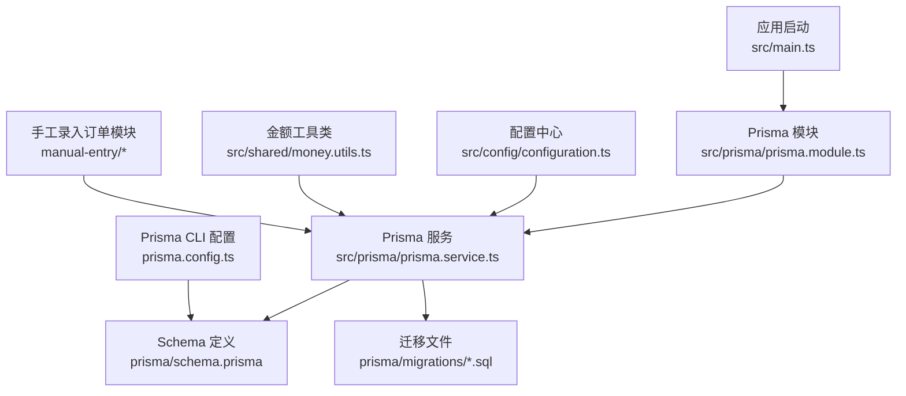

**图表来源**
- [src/main.ts](file://src/main.ts)
- [src/prisma/prisma.module.ts](file://src/prisma/prisma.module.ts)
- [src/prisma/prisma.service.ts](file://src/prisma/prisma.service.ts)
- [prisma/schema.prisma](file://prisma/schema.prisma)
- [prisma.config.ts](file://prisma.config.ts)
- [src/config/configuration.ts](file://src/config/configuration.ts)
- [src/shared/money.utils.ts](file://src/shared/money.utils.ts)
- [src/purely-profit/operations/scan-ordering/manual-entry/manual-entry.controller.ts](file://src/purely-profit/operations/scan-ordering/manual-entry/manual-entry.controller.ts)

**章节来源**
- [src/main.ts](file://src/main.ts)
- [src/prisma/prisma.module.ts](file://src/prisma/prisma.module.ts)
- [src/prisma/prisma.service.ts](file://src/prisma/prisma.service.ts)
- [prisma/schema.prisma](file://prisma/schema.prisma)
- [prisma.config.ts](file://prisma.config.ts)
- [src/config/configuration.ts](file://src/config/configuration.ts)

## 核心组件
- Prisma Schema（数据模型）：集中定义业务实体、字段类型、索引与外键约束，支持多模块化拆分（finance/goods/marketing/member/operations/staff/stores 等目录下的 .prisma 文件），最终由根 schema.prisma 聚合。
- Prisma Module/Service：封装 Prisma 客户端生命周期、连接池参数、事务与查询执行上下文；作为 NestJS 单例注入到各业务模块。
- 配置中心：从环境变量读取数据库连接信息（如主机、端口、用户名、密码、数据库名、连接池大小、超时等），确保不同环境的一致性与安全性。
- 迁移系统：基于 Prisma Migrate 的版本化迁移，按时间顺序维护数据库结构演进，并通过 migration_lock.toml 锁定当前迁移状态。
- **新增** 手工录入订单系统：提供完整的商家端手工补录订单功能，支持多种就餐方式和来源渠道。
- **新增** 金额工具类：提供严格的货币值对象 Money，统一处理元分转换和精度控制。

**章节来源**
- [prisma/schema.prisma](file://prisma/schema.prisma)
- [src/prisma/prisma.module.ts](file://src/prisma/prisma.module.ts)
- [src/prisma/prisma.service.ts](file://src/prisma/prisma.service.ts)
- [src/config/configuration.ts](file://src/config/configuration.ts)
- [prisma/migrations/migration_lock.toml](file://prisma/migrations/migration_lock.toml)
- [src/shared/money.utils.ts](file://src/shared/money.utils.ts)

## 架构总览
数据库层采用"单实例多租户"模式：
- 单一 PostgreSQL 实例承载所有租户数据
- 通过租户标识（如 tenantId 或 storeId）在查询层面实现逻辑隔离
- 使用索引与查询过滤保障性能与隔离性
- 通过 Prisma 事务与连接池控制并发与一致性
- **新增** 手工录入订单支持：通过专用字段和枚举类型区分手工补录订单与普通订单
- **新增** 软删除机制确保数据安全性和可恢复性
- **新增** 整数分存储避免浮点数精度问题

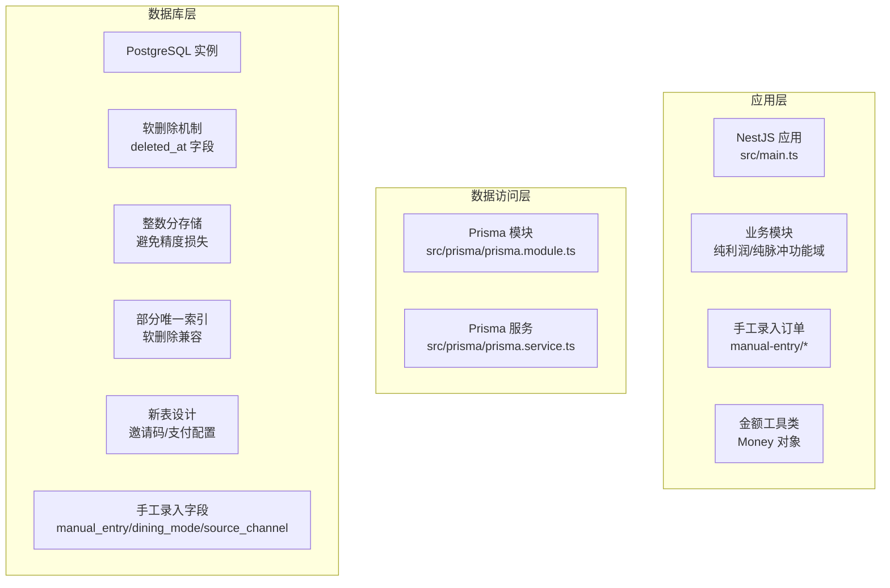

**图表来源**
- [src/main.ts](file://src/main.ts)
- [src/prisma/prisma.module.ts](file://src/prisma/prisma.module.ts)
- [src/prisma/prisma.service.ts](file://src/prisma/prisma.service.ts)
- [src/shared/money.utils.ts](file://src/shared/money.utils.ts)
- [src/purely-profit/operations/scan-ordering/manual-entry/manual-entry.controller.ts](file://src/purely-profit/operations/scan-ordering/manual-entry/manual-entry.controller.ts)
- [prisma/migrations/20260815120000_add_manual_entry_order_fields/migration.sql](file://prisma/migrations/20260815120000_add_manual_entry_order_fields/migration.sql)
- [prisma/migrations/20260625130000_add_soft_delete_fields/migration.sql](file://prisma/migrations/20260625130000_add_soft_delete_fields/migration.sql)
- [prisma/migrations/20260625160000_step3_amount_to_int/migration.sql](file://prisma/migrations/20260625160000_step3_amount_to_int/migration.sql)
- [prisma/migrations/20260625170000_add_store_invite_codes/migration.sql](file://prisma/migrations/20260625170000_add_store_invite_codes/migration.sql)
- [prisma/migrations/20260625180000_add_store_wechat_pay_config_table/migration.sql](file://prisma/migrations/20260625180000_add_store_wechat_pay_config_table/migration.sql)

## 详细组件分析

### Prisma ORM 配置与客户端生成
- 根 Schema 聚合：根 schema.prisma 聚合多个领域子模块的 .prisma 文件，形成统一的数据模型视图。
- 客户端生成：通过 Prisma CLI 基于 schema.prisma 生成类型安全的客户端代码，供应用层调用。
- 连接管理：Prisma Service 统一管理连接池参数（最大连接数、空闲超时、查询超时等），并在应用生命周期内复用客户端实例。

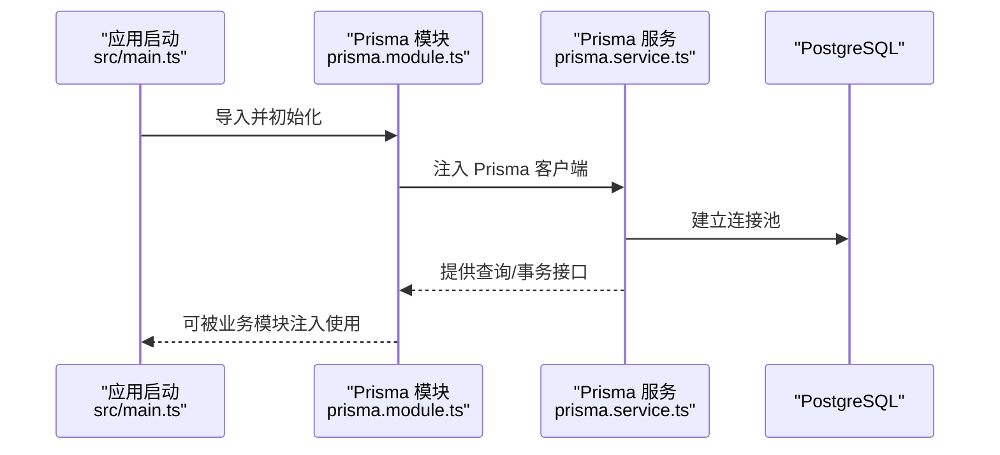

**图表来源**
- [src/main.ts](file://src/main.ts)
- [src/prisma/prisma.module.ts](file://src/prisma/prisma.module.ts)
- [src/prisma/prisma.service.ts](file://src/prisma/prisma.service.ts)

**章节来源**
- [prisma/schema.prisma](file://prisma/schema.prisma)
- [prisma.config.ts](file://prisma.config.ts)
- [src/prisma/prisma.module.ts](file://src/prisma/prisma.module.ts)
- [src/prisma/prisma.service.ts](file://src/prisma/prisma.service.ts)

### 数据库初始化流程与迁移策略
- 初始化：首次部署时，根据根 schema.prisma 执行初始迁移，创建基础表结构与约束。
- 版本化迁移：后续变更通过新增迁移文件维护，保证生产环境可追踪、可回滚。
- 迁移锁：使用 migration_lock.toml 锁定当前迁移状态，避免并发冲突。
- 典型迁移示例：包括初始建模、添加成员与积分日志、营销模块、财务与库存、空间管理、员工排班、**新增** 手工录入订单字段等。

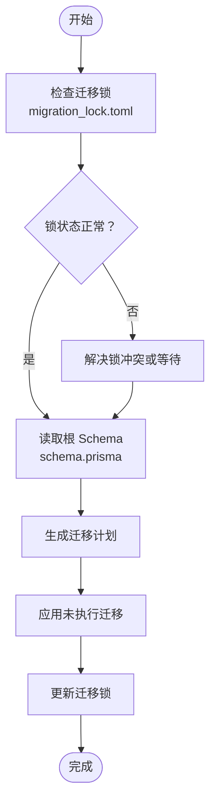

**图表来源**
- [prisma/migrations/migration_lock.toml](file://prisma/migrations/migration_lock.toml)
- [prisma/schema.prisma](file://prisma/schema.prisma)
- [prisma/migrations/20260512093539_init/migration.sql](file://prisma/migrations/20260512093539_init/migration.sql)

**章节来源**
- [prisma/migrations/migration_lock.toml](file://prisma/migrations/migration_lock.toml)
- [prisma/migrations/20260512093539_init/migration.sql](file://prisma/migrations/20260512093539_init/migration.sql)
- [prisma/migrations/20260513130000_add_performance_indexes/migration.sql](file://prisma/migrations/20260513130000_add_performance_indexes/migration.sql)
- [prisma/migrations/20260513143000_add_list_filter_indexes/migration.sql](file://prisma/migrations/20260513143000_add_list_filter_indexes/migration.sql)

### 连接池配置与性能优化策略
- 连接池参数：在 Prisma Service 中设置最大连接数、空闲超时、获取超时等，以平衡吞吐与资源占用。
- 查询优化：通过迁移中新增的索引（如性能索引、列表过滤索引）提升查询效率；对高频查询字段建立复合索引。
- 并发控制：使用 Prisma 事务包裹写操作，减少锁竞争；对只读查询尽量走索引路径。
- 连接复用：在 NestJS 生命周期内复用 Prisma 客户端，避免频繁重建连接带来的开销。

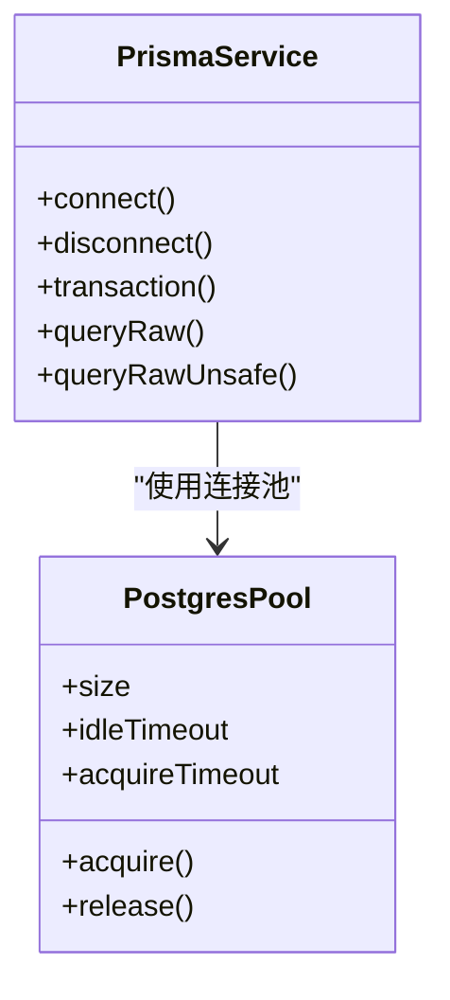

**图表来源**
- [src/prisma/prisma.service.ts](file://src/prisma/prisma.service.ts)

**章节来源**
- [src/prisma/prisma.service.ts](file://src/prisma/prisma.service.ts)
- [prisma/migrations/20260513130000_add_performance_indexes/migration.sql](file://prisma/migrations/20260513130000_add_performance_indexes/migration.sql)
- [prisma/migrations/20260513143000_add_list_filter_indexes/migration.sql](file://prisma/migrations/20260513143000_add_list_filter_indexes/migration.sql)

### 多租户架构下的数据库隔离与数据分区
- 租户隔离：通过在实体中引入租户标识字段（如 storeId/tenantId），在查询时强制加入租户过滤条件，确保跨租户数据不可见。
- 访问控制：结合权限守卫与装饰器，在业务层进一步限制用户可见范围。
- 分区策略：对于超大表，可在迁移中引入分区策略（如按时间或租户 ID 分区），并配合索引优化查询。
- 子账户与角色：迁移中包含子账户与角色定义，用于精细化权限控制与数据边界划分。

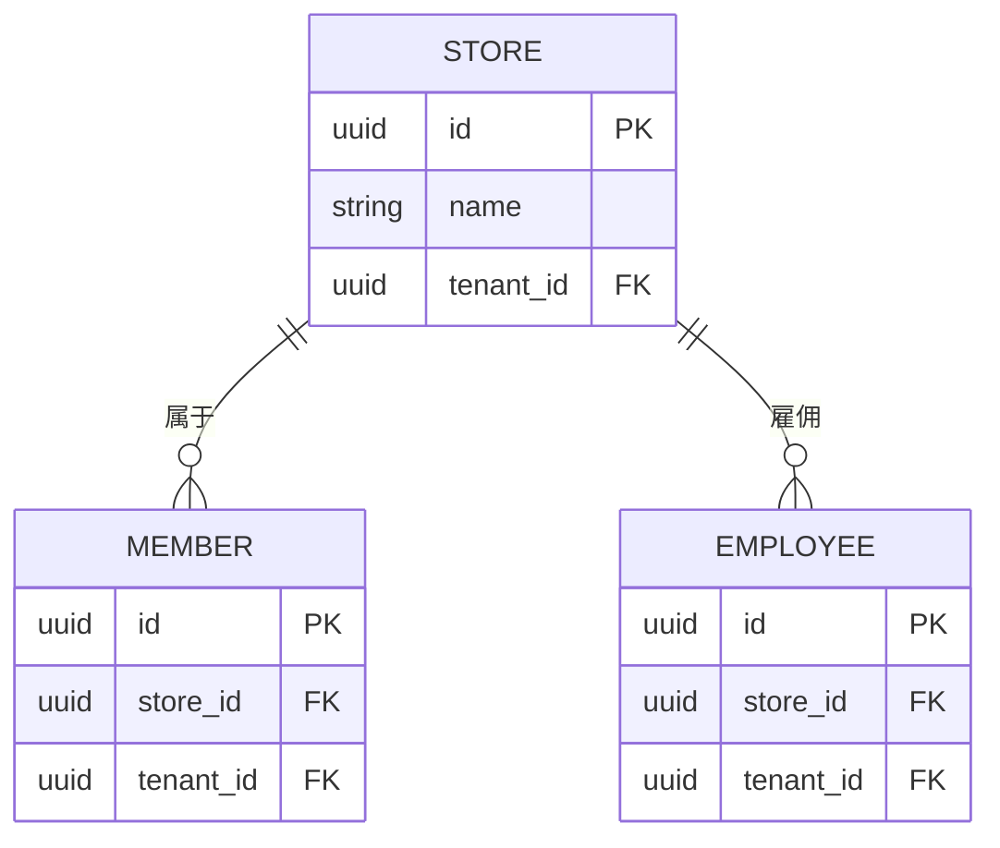

**图表来源**
- [prisma/migrations/20260513160000_lock_single_account_single_store/migration.sql](file://prisma/migrations/20260513160000_lock_single_account_single_store/migration.sql)
- [prisma/migrations/20260513170000_add_members/migration.sql](file://prisma/migrations/20260513170000_add_members/migration.sql)
- [prisma/migrations/20260513200000_add_employee_management/migration.sql](file://prisma/migrations/20260513200000_add_employee_management/migration.sql)

**章节来源**
- [prisma/migrations/20260513160000_lock_single_account_single_store/migration.sql](file://prisma/migrations/20260513160000_lock_single_account_single_store/migration.sql)
- [prisma/migrations/20260513170000_add_members/migration.sql](file://prisma/migrations/20260513170000_add_members/migration.sql)
- [prisma/migrations/20260513200000_add_employee_management/migration.sql](file://prisma/migrations/20260513200000_add_employee_management/migration.sql)

### 数据库初始化流程与连接重试机制
- 初始化步骤：启动时加载配置 → 创建 Prisma 客户端 → 执行迁移 → 建立连接池 → 注入到全局模块。
- 连接重试：在 Prisma Service 中实现指数退避重试策略，当连接失败时自动重试，避免瞬时故障导致启动失败。
- 错误处理：捕获连接异常与迁移异常，记录详细日志并优雅降级或终止启动流程，确保可观测性。

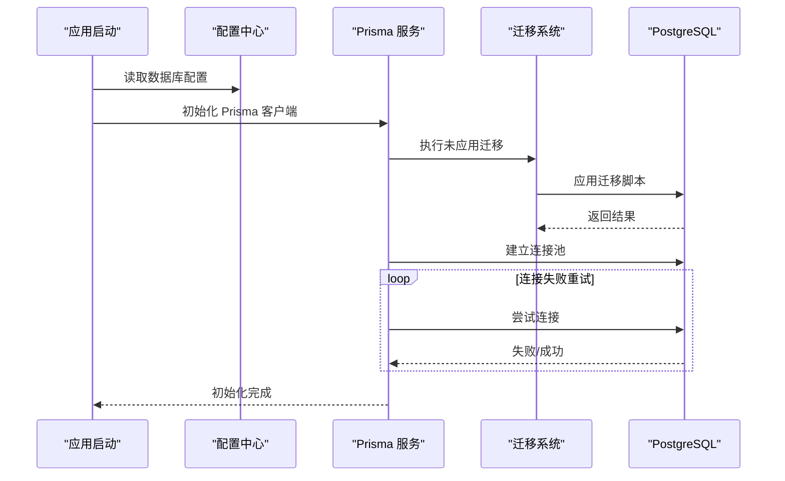

**图表来源**
- [src/config/configuration.ts](file://src/config/configuration.ts)
- [src/prisma/prisma.service.ts](file://src/prisma/prisma.service.ts)
- [prisma/migrations/migration_lock.toml](file://prisma/migrations/migration_lock.toml)

**章节来源**
- [src/config/configuration.ts](file://src/config/configuration.ts)
- [src/prisma/prisma.service.ts](file://src/prisma/prisma.service.ts)
- [prisma/migrations/migration_lock.toml](file://prisma/migrations/migration_lock.toml)

### 手工录入订单功能的数据模型设计

**新增** 手工录入订单功能为商家提供了线下交易补录能力，支持多种就餐方式和来源渠道追踪

#### 核心字段设计
- **manual_entry**: 布尔标识，标记是否为手工补录订单（默认 false）
- **dining_mode**: 就餐方式枚举，支持 dineIn（堂食）、takeaway（自取）、platform（第三方外卖）
- **source_channel**: 来源渠道枚举，支持 meituan（美团外卖）、eleme（饿了么）、meituanVoucher（美团团购）、douyin（抖音团购）、dianping（大众点评）、other（其他平台）
- **external_order_no**: 外部订单号，用于第三方平台对账（VARCHAR(128)）
- **guest_count**: 就餐人数，用于堂食场景统计
- **customer_phone**: 顾客手机号，用于订单归属和客户识别
- **dining_table_id**: 桌台关联ID，用于堂食场景的桌台管理

#### 枚举类型定义
```typescript
// 手工录入就餐方式
enum ManualEntryDiningMode {
  dineIn      // 堂食/团购到店
  takeaway    // 自取
  platform    // 第三方外卖
}

// 手工录入来源渠道
enum ManualEntrySourceChannel {
  meituan         // 美团外卖
  eleme           // 饿了么
  meituanVoucher  // 美团团购
  douyin          // 抖音团购
  dianping        // 大众点评
  other           // 其他平台
}
```

#### 数据库迁移实现
- 在 sale_orders 表中新增所有手工录入相关字段
- 创建新的枚举类型 ManualEntryDiningMode 和 ManualEntrySourceChannel
- 为 SalesPaymentMethod 枚举新增 platform 值（平台结算）
- 创建复合索引优化手工录入订单的查询性能

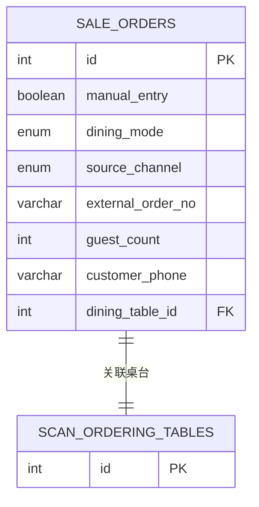

**图表来源**
- [prisma/migrations/20260815120000_add_manual_entry_order_fields/migration.sql](file://prisma/migrations/20260815120000_add_manual_entry_order_fields/migration.sql)
- [prisma/purely-profit/operations/sales-records.prisma](file://prisma/purely-profit/operations/sales-records.prisma)

**章节来源**
- [prisma/migrations/20260815120000_add_manual_entry_order_fields/migration.sql](file://prisma/migrations/20260815120000_add_manual_entry_order_fields/migration.sql)
- [prisma/purely-profit/operations/sales-records.prisma](file://prisma/purely-profit/operations/sales-records.prisma)
- [src/purely-profit/operations/scan-ordering/manual-entry/dto/manual-entry.dto.ts](file://src/purely-profit/operations/scan-ordering/manual-entry/dto/manual-entry.dto.ts)

### ScanOrders 表的增强支持

**新增** ScanOrders 表扩展以支持手工补录单的状态机处理

#### 字段扩展
- **manual_entry**: 布尔标识，标记是否来自录入订单（默认 false）
- **manual_entry_metadata**: JSONB 字段，存储手工补录单元的完整数据快照，包括 diningMode、paymentMethod、sourceChannel、externalOrderNo、guestCount、customerPhone、voucherAmount 等

#### 状态机改造
- 将 table_id 字段改为可空，支持 takeaway（自取）与 platform（第三方外卖）模式无桌台场景
- 通过 JSONB 最小侵入方式存储手工补录相关数据，避免大量可空字段
- 创建专用索引优化手工单的过滤与状态聚合查询

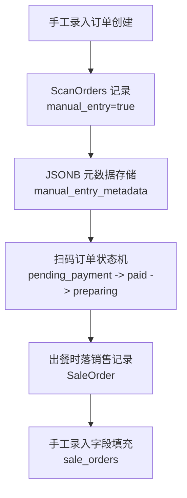

**图表来源**
- [prisma/migrations/20260816000001_add_scan_orders_manual_entry/migration.sql](file://prisma/migrations/20260816000001_add_scan_orders_manual_entry/migration.sql)
- [prisma/purely-profit/operations/schema.prisma](file://prisma/purely-profit/operations/schema.prisma)

**章节来源**
- [prisma/migrations/20260816000001_add_scan_orders_manual_entry/migration.sql](file://prisma/migrations/20260816000001_add_scan_orders_manual_entry/migration.sql)
- [prisma/purely-profit/operations/schema.prisma](file://prisma/purely-profit/operations/schema.prisma)

### 手工录入订单 API 接口设计

**新增** 完整的商家端手工录入订单 API 接口

#### 核心接口
- **GET /api/profit/scan-ordering/manual-entry/menu**: 获取录入订单菜单（分类+商品+规格+库存，含售罄态）
- **POST /api/profit/scan-ordering/manual-entry/preview**: 价格预览（规格组合单价/商品合计/券面抵扣/应付，金额后端权威计算）
- **POST /api/profit/scan-ordering/manual-entry/orders**: 建单（幂等，事务内预留库存并创建 ScanOrders，走状态机/出餐时落销售记录）

#### DTO 设计
- **ManualEntryItemDto**: 订单明细行，包含 productId、specOptionIds、quantity
- **ManualEntryPreviewDto**: 价格预览请求，包含 items[]、paymentMethod、voucherAmount
- **CreateManualEntryOrderDto**: 建单请求，包含完整的订单信息和幂等键

#### 业务规则验证
- dineIn（堂食）必选桌台和就餐人数
- platform（第三方外卖）强制 paymentMethod 为 platform
- 平台结算时必须填写 sourceChannel 和 externalOrderNo
- 券面金额仅在平台结算时可填

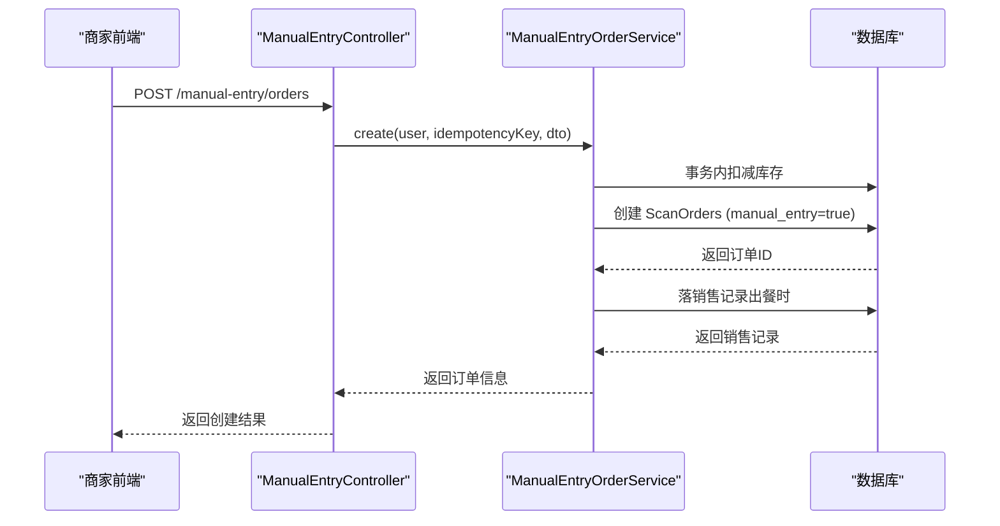

**图表来源**
- [src/purely-profit/operations/scan-ordering/manual-entry/manual-entry.controller.ts](file://src/purely-profit/operations/scan-ordering/manual-entry/manual-entry.controller.ts)
- [src/purely-profit/operations/scan-ordering/manual-entry/dto/manual-entry.dto.ts](file://src/purely-profit/operations/scan-ordering/manual-entry/dto/manual-entry.dto.ts)

**章节来源**
- [src/purely-profit/operations/scan-ordering/manual-entry/manual-entry.controller.ts](file://src/purely-profit/operations/scan-ordering/manual-entry/manual-entry.controller.ts)
- [src/purely-profit/operations/scan-ordering/manual-entry/dto/manual-entry.dto.ts](file://src/purely-profit/operations/scan-ordering/manual-entry/dto/manual-entry.dto.ts)

### 软删除机制与部分唯一索引实现

**更新** 新增全面的软删除机制和部分唯一索引实现，确保数据安全性和业务连续性

#### 软删除字段设计
- 统一 deleted_at 字段：为所有主档表（Store、Member、Employee、Product、Space、StorePartner 等）添加 deleted_at 字段
- 时间戳精度：统一使用 TIMESTAMP(3) 精度，确保时间戳一致性
- 默认值策略：deleted_at 为 NULL 表示未删除，非 NULL 表示已删除且值为删除时间

#### 部分唯一索引实现
- 唯一约束适配：将普通唯一索引改为部分唯一索引（WHERE deleted_at IS NULL），允许软删除后重新使用相同标识符
- 关键业务字段：会员手机号、顾客手机号、产品编码、员工编号等都实现了软删除兼容的唯一性
- 查询优化：为含 deleted_at 字段的表创建 partial index，确保软删除过滤走索引而非全表扫描

#### 级联删除保护
- 流水表保护：将 MemberPointsLog、BeanLog、RechargeLog 等流水表的 onDelete: Cascade 改为 Restrict，防止软删主档时误删历史数据
- 空间管理保护：SpaceReservation、SpaceSession 的级联删除也改为 Restrict，确保空间预订数据的完整性

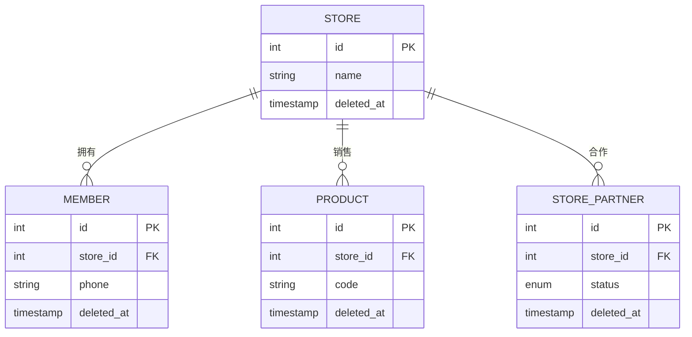

**图表来源**
- [prisma/migrations/20260625130000_add_soft_delete_fields/migration.sql](file://prisma/migrations/20260625130000_add_soft_delete_fields/migration.sql)
- [prisma/migrations/20260625140000_step1_soft_delete_and_restrict_cascade/migration.sql](file://prisma/migrations/20260625140000_step1_soft_delete_and_restrict_cascade/migration.sql)
- [prisma/migrations/20260628110000_add_soft_delete_partial_indexes/migration.sql](file://prisma/migrations/20260628110000_add_soft_delete_partial_indexes/migration.sql)

**章节来源**
- [prisma/migrations/20260625130000_add_soft_delete_fields/migration.sql](file://prisma/migrations/20260625130000_add_soft_delete_fields/migration.sql)
- [prisma/migrations/20260625140000_step1_soft_delete_and_restrict_cascade/migration.sql](file://prisma/migrations/20260625140000_step1_soft_delete_and_restrict_cascade/migration.sql)
- [prisma/migrations/20260628110000_add_soft_delete_partial_indexes/migration.sql](file://prisma/migrations/20260628110000_add_soft_delete_partial_indexes/migration.sql)

### 货币值标准化：从 Decimal 到整数分

**更新** 全面实现货币值标准化，将所有金额字段从 Decimal(12,2) 迁移为 Int（分），彻底解决浮点数精度问题

#### 金额单位统一策略
- 数据类型迁移：将所有 Decimal(12,2) 金额字段转换为 INT 类型，单位为分
- 精度转换：使用 ROUND(旧值 * 100)::INT 进行精确转换，精度损失≤0.5分
- 例外处理：五险一金（social_insurance/housing_fund）保留 Decimal 类型，不在本次迁移范围

#### Money 对象设计
- 严格类型约束：内部状态永远存"数据库分金额 Int"，前端入站只允许 fromInputYuan()，数据库出站只允许 fromDbCents()
- 安全整数验证：toSafeInteger() 确保数值在 JavaScript 安全整数范围内
- 四舍五入策略：ROUND_HALF_UP 确保金融级精度要求

#### 涉及的业务表
- 商品表：products.price、products.profit、products.cost_price
- 财务表：finance_cash_flow_records.amount、finance_account_records.amount/paid_amount/remaining
- 运营表：cost_records.amount、purchase_orders.total_amount、sale_orders.total_revenue/profit
- 员工表：employees.base_salary、employee_payrolls 相关工资字段

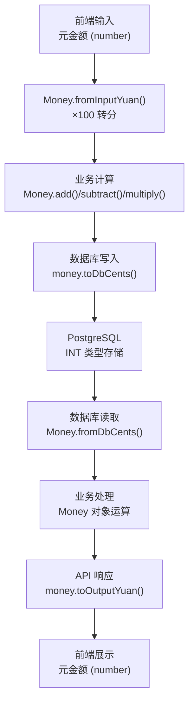

**图表来源**
- [src/shared/money.utils.ts](file://src/shared/money.utils.ts)
- [prisma/migrations/20260625160000_step3_amount_to_int/migration.sql](file://prisma/migrations/20260625160000_step3_amount_to_int/migration.sql)

**章节来源**
- [src/shared/money.utils.ts](file://src/shared/money.utils.ts)
- [prisma/migrations/20260625160000_step3_amount_to_int/migration.sql](file://prisma/migrations/20260625160000_step3_amount_to_int/migration.sql)

### 新表设计：门店邀请码与微信支付配置

**更新** 新增两个重要业务表：store_invite_codes（门店邀请码）和 store_wechat_pay_configs（微信支付配置）

#### StoreInviteCode 表设计
- 邀请码格式：8位字符，字符集为 0-9A-Z 去除 O/I/1，避免混淆
- 使用统计：is_active 标记启用状态，used_count 记录使用次数
- 数据回填：为现有门店自动生成随机邀请码，使用 UUID v4 映射算法
- 索引优化：创建 store_id + is_active 复合索引，支持按门店筛选活跃邀请码

#### StoreWechatPayConfig 表设计
- 敏感配置独立化：将微信商户号、名称、API v3 密钥等敏感信息从 stores 表分离
- 加密存储：api_v3_key_enc 字段使用 AES-256-GCM 加密后的 API v3 密钥
- 数据迁移：从 stores 表的 wechat_* 字段迁移数据，保留旧字段支持平滑过渡
- 级联删除：与 stores 表建立 CASCADE 删除关系，确保数据一致性

```mermaid
erDiagram
STORE_INVITE_CODES {
int id PK
int store_id FK
varchar code UK
boolean is_active
int used_count
timestamp created_at
timestamp updated_at
}
STORE_WECHAT_PAY_CONFIGS {
int id PK
int store_id UK FK
varchar mch_id
varchar mch_name
text api_v3_key_enc
timestamp configured_at
timestamp created_at
timestamp updated_at
}
STORES {
int id PK
}
STORE_INVITE_CODES ||--|| STORES : "属于"
STORE_WECHAT_PAY_CONFIGS ||--|| STORES : "配置"
```

**图表来源**
- [prisma/migrations/20260625170000_add_store_invite_codes/migration.sql](file://prisma/migrations/20260625170000_add_store_invite_codes/migration.sql)
- [prisma/migrations/20260625180000_add_store_wechat_pay_config_table/migration.sql](file://prisma/migrations/20260625180000_add_store_wechat_pay_config_table/migration.sql)
- [prisma/purely-profit/stores/store-invite-codes.prisma](file://prisma/purely-profit/stores/store-invite-codes.prisma)
- [prisma/purely-profit/stores/store-wechat-pay-config.prisma](file://prisma/purely-profit/stores/store-wechat-pay-config.prisma)

**章节来源**
- [prisma/migrations/20260625170000_add_store_invite_codes/migration.sql](file://prisma/migrations/20260625170000_add_store_invite_codes/migration.sql)
- [prisma/migrations/20260625180000_add_store_wechat_pay_config_table/migration.sql](file://prisma/migrations/20260625180000_add_store_wechat_pay_config_table/migration.sql)
- [prisma/purely-profit/stores/store-invite-codes.prisma](file://prisma/purely-profit/stores/store-invite-codes.prisma)
- [prisma/purely-profit/stores/store-wechat-pay-config.prisma](file://prisma/purely-profit/stores/store-wechat-pay-config.prisma)

### 数据库完整性约束与安全索引

**更新** 新增全面的数据库完整性约束和安全索引，提升数据质量和查询性能

#### 完整性约束设计
- CHECK 约束：为 space_reservations.guest_count > 0、spaces.capacity > 0、spaces.sort_order >= 1 等业务规则添加数据库级约束
- 多租户一致性：通过 CHECK 约束确保子记录的 storeId 与父记录 storeId 一致，避免跨店脏引用
- 部分唯一索引：为 CostRecord 的 (storeId, sourceType, purchaseOrderId) 和 (storeId, sourceType, payrollId) 添加条件唯一约束

#### 安全与性能索引
- 冗余索引清理：删除重复索引如 members.customer_id_idx（与 @@unique([customerId]) 重复）、staffs.store_id_idx（被前缀索引覆盖）
- 复合索引优化：为高频查询场景创建专用复合索引，如 store_partners.store_id_status_reviewed_at_id_partial_idx
- 并行索引创建：使用 CREATE INDEX CONCURRENTLY 避免长时间锁表影响线上服务


**图表来源**
- [prisma/migrations/20260626120000_step6_db_integrity_constraints/migration.sql](file://prisma/migrations/20260626120000_step6_db_integrity_constraints/migration.sql)
- [prisma/migrations/20260627000000_safety_and_performance_indexes/migration.sql](file://prisma/migrations/20260627000000_safety_and_performance_indexes/migration.sql)
- [prisma/migrations/20260628100000_drop_redundant_indexes/migration.sql](file://prisma/migrations/20260628100000_drop_redundant_indexes/migration.sql)

**章节来源**
- [prisma/migrations/20260626120000_step6_db_integrity_constraints/migration.sql](file://prisma/migrations/20260626120000_step6_db_integrity_constraints/migration.sql)
- [prisma/migrations/20260627000000_safety_and_performance_indexes/migration.sql](file://prisma/migrations/20260627000000_safety_and_performance_indexes/migration.sql)
- [prisma/migrations/20260628100000_drop_redundant_indexes/migration.sql](file://prisma/migrations/20260628100000_drop_redundant_indexes/migration.sql)

### 空间管理状态推导机制

**更新** 重构空间管理状态机制，从静态状态字段改为动态推导的运行态状态

#### 状态推导设计
- 移除静态状态：删除 spaces.status 字段和 SpaceStatus 枚举
- 动态推导：通过 SpaceSession 和 SpaceReservation 的状态推导空间的运行态
- 清洁状态：新增 cleaned_at 字段用于推导脏房 cleaning 状态
- 续费券面金额：space_session_renew_records 增加 voucher_face_amount 字段

#### 运行态字段设计
- cleaned_at 字段：记录空间最后清洁时间，用于判断是否需要清洁
- 状态推导逻辑：结合最近会话、预订记录和清洁时间综合判断空间可用状态
- 性能优化：移除冗余状态字段，减少数据更新复杂度

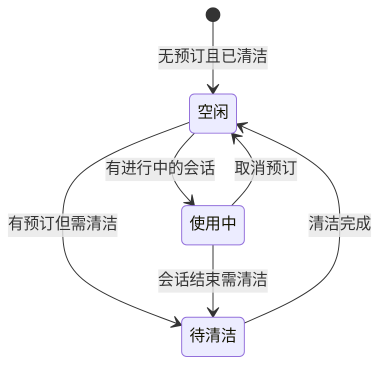

**图表来源**
- [prisma/migrations/20260625190000_remove_space_status_field/migration.sql](file://prisma/migrations/20260625190000_remove_space_status_field/migration.sql)
- [prisma/migrations/20260627180000_space_add_cleaned_at/migration.sql](file://prisma/migrations/20260627180000_space_add_cleaned_at/migration.sql)
- [prisma/migrations/20260627200000_renew_record_add_voucher_face_amount/migration.sql](file://prisma/migrations/20260627200000_renew_record_add_voucher_face_amount/migration.sql)

**章节来源**
- [prisma/migrations/20260625190000_remove_space_status_field/migration.sql](file://prisma/migrations/20260625190000_remove_space_status_field/migration.sql)
- [prisma/migrations/20260627180000_space_add_cleaned_at/migration.sql](file://prisma/migrations/20260627180000_space_add_cleaned_at/migration.sql)
- [prisma/migrations/20260627200000_renew_record_add_voucher_face_amount/migration.sql](file://prisma/migrations/20260627200000_renew_record_add_voucher_face_amount/migration.sql)

### 合作伙伴索引优化与多伙伴支持的数据库基础设施改进

**更新** 合作伙伴表索引优化与多伙伴支持的关键数据库改进保持不变

#### store_partners 表索引优化历程
- 初始设计：在 20260514153000_add_store_partners_and_withdrawals 迁移中，store_partners 表创建了唯一索引 `store_partners_store_id_key`，限制每个门店只能有一个合作伙伴
- 业务需求变更：随着业务发展，需要支持每家商店拥有多个合作伙伴，因此在 20260529120000_support_multiple_store_partners 迁移中移除了唯一约束
- 索引修复：在 20260616120000_fix_store_partners_indexes_drift 迁移中，修正了索引不一致问题，重新创建了复合索引

#### 复合索引设计与查询优化
- 新复合索引：`store_partners_store_id_status_updated_at_idx` (store_id, status, updated_at)
- 查询模式优化：针对常见的查询场景（按门店筛选、按状态过滤、按更新时间排序）进行优化
- 性能提升：复合索引支持覆盖查询，减少索引扫描和排序操作

#### 多伙伴支持的实现策略
- 唯一约束移除：DROP INDEX IF EXISTS "store_partners_store_id_key"
- 复合索引创建：CREATE INDEX IF NOT EXISTS "store_partners_store_id_status_updated_at_idx"
- 查询性能：支持每家门店多个合作伙伴的同时保持查询性能

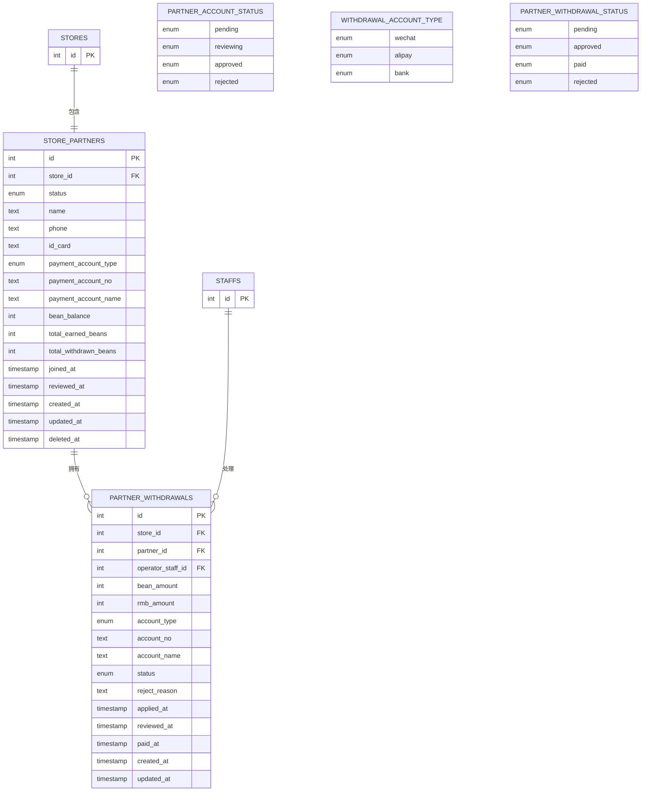

**图表来源**
- [prisma/migrations/20260514153000_add_store_partners_and_withdrawals/migration.sql](file://prisma/migrations/20260514153000_add_store_partners_and_withdrawals/migration.sql)
- [prisma/migrations/20260529120000_support_multiple_store_partners/migration.sql](file://prisma/migrations/20260529120000_support_multiple_store_partners/migration.sql)
- [prisma/migrations/20260616120000_fix_store_partners_indexes_drift/migration.sql](file://prisma/migrations/20260616120000_fix_store_partners_indexes_drift/migration.sql)
- [prisma/purely-profit/member/partners.prisma](file://prisma/purely-profit/member/partners.prisma)

#### 索引优化的具体实施效果
- 查询性能：复合索引支持按门店和状态的高效查询，减少全表扫描
- 并发性能：多伙伴支持允许更高的并发查询和写入操作
- 存储效率：合理的索引设计减少了存储空间的浪费
- 维护成本：索引优化降低了数据库维护的复杂度

**章节来源**
- [prisma/migrations/20260514153000_add_store_partners_and_withdrawals/migration.sql](file://prisma/migrations/20260514153000_add_store_partners_and_withdrawals/migration.sql)
- [prisma/migrations/20260529120000_support_multiple_store_partners/migration.sql](file://prisma/migrations/20260529120000_support_multiple_store_partners/migration.sql)
- [prisma/migrations/20260616120000_fix_store_partners_indexes_drift/migration.sql](file://prisma/migrations/20260616120000_fix_store_partners_indexes_drift/migration.sql)
- [prisma/purely-profit/member/partners.prisma](file://prisma/purely-profit/member/partners.prisma)

### 营销会员等级配置与首单折扣促销的数据库支持

**更新** 营销会员等级动态配置表和首单折扣促销类型的支持保持不变

#### 营销会员等级配置表（marketing_member_level_settings）
- 表结构：包含 store_id（唯一索引）、levels（JSONB，默认空数组）、points_ratio（JSONB，默认空对象）、创建和更新时间戳
- 外键约束：store_id 引用 stores 表，级联删除和更新
- 业务用途：支持每个门店独立配置会员等级规则、折扣率和积分比例
- 数据隔离：通过 store_id 实现多租户隔离

#### 首单折扣促销类型（first_order_discount）
- 枚举值：在 MarketingPromotionType 枚举中新增 first_order_discount 值
- 业务逻辑：专门针对首次消费用户的折扣促销活动
- 查询策略：通过 type 字段精确匹配，结合时间范围和启用状态筛选

```mermaid
erDiagram
MARKETING_MEMBER_LEVEL_SETTINGS {
int id PK
int store_id UK FK
jsonb levels
jsonb points_ratio
timestamp created_at
timestamp updated_at
}
MARKETING_PROMOTIONS {
int id PK
int store_id FK
enum type
json params
timestamp start_at
timestamp end_at
boolean enabled
}
STORES {
int id PK
}
MARKETING_CUSTOMERS {
int id PK
int store_id FK
}
MARKETING_CONSUMPTIONS {
int id PK
int store_id FK
int customer_id FK
}
MARKETING_MEMBER_LEVEL_SETTINGS ||--|| STORES : "配置属于"
MARKETING_PROMOTIONS ||--|| STORES : "属于"
MARKETING_CUSTOMERS ||--|| STORES : "属于"
MARKETING_CONSUMPTIONS ||--|| MARKETING_CUSTOMERS : "记录消费"
```

**图表来源**
- [prisma/migrations/20260611160000_add_marketing_member_level_settings/migration.sql](file://prisma/migrations/20260611160000_add_marketing_member_level_settings/migration.sql)
- [prisma/migrations/20260611143000_add_first_order_discount_promotion_type/migration.sql](file://prisma/migrations/20260611143000_add_first_order_discount_promotion_type/migration.sql)
- [prisma/purely-profit/marketing/promotions.prisma](file://prisma/purely-profit/marketing/promotions.prisma)

**章节来源**
- [prisma/migrations/20260611160000_add_marketing_member_level_settings/migration.sql](file://prisma/migrations/20260611160000_add_marketing_member_level_settings/migration.sql)
- [prisma/migrations/20260611143000_add_first_order_discount_promotion_type/migration.sql](file://prisma/migrations/20260611143000_add_first_order_discount_promotion_type/migration.sql)
- [prisma/purely-profit/marketing/promotions.prisma](file://prisma/purely-profit/marketing/promotions.prisma)
- [src/purely-profit/marketing/marketing-overview.service.ts](file://src/purely-profit/marketing/marketing-overview.service.ts)
- [src/purely-club/orders/club-order-promotions.service.ts](file://src/purely-club/orders/club-order-promotions.service.ts)
- [src/purely-club/products/club-product-promotion.service.ts](file://src/purely-club/products/club-product-promotion.service.ts)

## 依赖关系分析
- 模块耦合：业务模块仅通过 Prisma Service 获取数据访问能力，降低对底层 ORM 的直接依赖。
- 外部依赖：PostgreSQL 作为持久化存储，Prisma 作为 ORM，NestJS 作为运行框架。
- 循环依赖：通过模块化与服务注入避免循环依赖；Prisma Service 作为单一事实源提供连接与事务能力。
- **新增** 手工录入订单依赖：manual-entry 模块依赖 Prisma Service 和现有的订单、库存、菜单等服务。
- **新增** 金额工具类依赖：业务模块通过 Money 对象统一处理金额计算，避免直接使用原始数字类型。

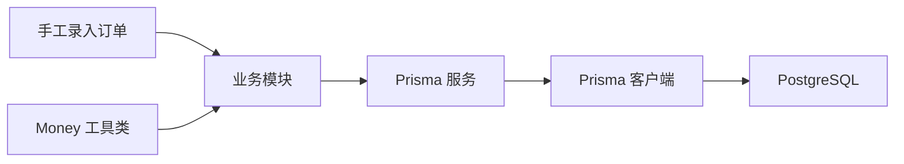

**图表来源**
- [src/prisma/prisma.service.ts](file://src/prisma/prisma.service.ts)
- [src/prisma/prisma.module.ts](file://src/prisma/prisma.module.ts)
- [src/shared/money.utils.ts](file://src/shared/money.utils.ts)
- [src/purely-profit/operations/scan-ordering/manual-entry/manual-entry.controller.ts](file://src/purely-profit/operations/scan-ordering/manual-entry/manual-entry.controller.ts)

**章节来源**
- [src/prisma/prisma.module.ts](file://src/prisma/prisma.module.ts)
- [src/prisma/prisma.service.ts](file://src/prisma/prisma.service.ts)
- [src/shared/money.utils.ts](file://src/shared/money.utils.ts)

## 性能考虑
- 索引优化：在高频查询字段上建立索引，减少全表扫描；对组合查询条件建立复合索引。
- 查询优化：避免 N+1 查询，使用 include/@@relation 预加载关联数据；对大数据量场景采用分页与游标分页。
- 连接池优化：合理设置最大连接数与超时阈值，避免连接泄漏；在高并发场景下启用连接池复用。
- 事务优化：将相关写操作放入单个事务，减少锁持有时间；避免长事务阻塞其他请求。
- 监控与告警：结合运行指标与慢查询日志，持续评估与优化数据库性能。
- **新增** 手工录入订单索引优化：为 sale_orders 表创建 store_id + manual_entry + created_at 复合索引，优化手工录入订单的查询性能。
- **新增** 软删除优化：partial index 确保软删除过滤高效执行，避免全表扫描。
- **新增** 整数分存储：INT 类型相比 DECIMAL 具有更好的性能和存储空间效率。
- **新增** 索引清理：定期清理冗余索引，减少写入成本和存储膨胀。

## 故障排除指南
- 连接失败：检查数据库可达性、凭据正确性与网络策略；查看 Prisma 服务中的重试日志。
- 迁移失败：确认 migration_lock.toml 状态；逐条回放失败迁移并修复；必要时手动回滚到上一个稳定版本。
- 查询缓慢：分析执行计划，补充缺失索引；优化查询条件与分页策略。
- 权限问题：核对租户过滤条件与角色权限；确保业务层装饰器与守卫生效。
- **新增** 手工录入订单问题：检查 manual_entry 字段是否正确设置；验证枚举类型值是否有效；确认 sourceChannel 和 externalOrderNo 的必填规则。
- **新增** 软删除问题：检查 deleted_at 字段是否正确设置；验证部分唯一索引是否生效。
- **新增** 金额精度问题：确认所有金额计算都通过 Money 对象处理；检查数据库字段类型是否为 INT。
- **新增** 索引冲突：检查是否有重复索引；验证部分唯一索引的条件是否正确。

**章节来源**
- [src/prisma/prisma.service.ts](file://src/prisma/prisma.service.ts)
- [prisma/migrations/migration_lock.toml](file://prisma/migrations/migration_lock.toml)
- [src/shared/money.utils.ts](file://src/shared/money.utils.ts)

## 结论
purelyprofit-server 的数据库架构以 Prisma ORM 为核心，围绕 PostgreSQL 构建了可扩展、可维护且具备多租户隔离能力的数据层。通过版本化迁移、连接池与索引优化、以及完善的错误处理与监控体系，系统在功能演进与性能表现之间取得了良好平衡。

**重大架构升级** 本次数据库架构 overhaul 带来了全方位的改进：
- **手工录入订单功能**：完整的商家端手工补录订单能力，支持多种就餐方式和来源渠道追踪
- **软删除机制**：全面实现 deleted_at 字段和部分唯一索引，确保数据可恢复性和业务连续性
- **货币值标准化**：从 Decimal 迁移到整数分，彻底解决浮点数精度问题，提升性能和准确性
- **新表设计**：独立的邀请码表和加密的微信支付配置表，提升安全性和可维护性
- **完整性约束**：全面的 CHECK 约束和部分唯一索引，确保数据质量和业务规则
- **空间管理重构**：从静态状态改为动态推导，简化数据模型并提升灵活性

**数据库基础设施改进总结** 本次架构升级体现了现代数据库设计的最佳实践：
- **渐进式演进**：通过详细的迁移步骤确保业务连续性和数据完整性
- **性能优先**：partial index、索引清理和整数分存储显著提升查询性能
- **安全加固**：敏感配置独立存储和加密，软删除保护历史数据
- **类型安全**：Money 对象确保金额计算的类型安全和精度控制
- **业务扩展**：手工录入订单功能完善了线下交易场景的数据支撑

建议在后续迭代中持续完善分区策略与缓存配合，进一步提升大规模场景下的吞吐与延迟表现。同时建议建立定期的数据库健康检查和性能监控机制，确保系统的长期稳定运行。

## 附录
- 配置项参考：数据库主机、端口、用户名、密码、数据库名、连接池大小、查询超时、空闲超时等，均来自配置中心。
- 迁移清单：按时间顺序维护的完整迁移历史，便于审计与回滚。
- **新增** 手工录入订单规范：所有手工录入订单必须包含完整的就餐方式、来源渠道和外部订单号信息。
- **新增** 金额处理规范：所有金额计算必须通过 Money 对象，禁止直接使用 number 类型进行金额运算。
- **新增** 软删除最佳实践：所有主档表都应支持软删除，查询时注意 deleted_at 过滤条件。

**章节来源**
- [src/config/configuration.ts](file://src/config/configuration.ts)
- [prisma/migrations/migration_lock.toml](file://prisma/migrations/migration_lock.toml)
- [src/shared/money.utils.ts](file://src/shared/money.utils.ts)