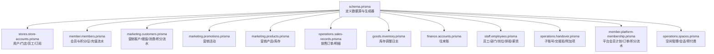
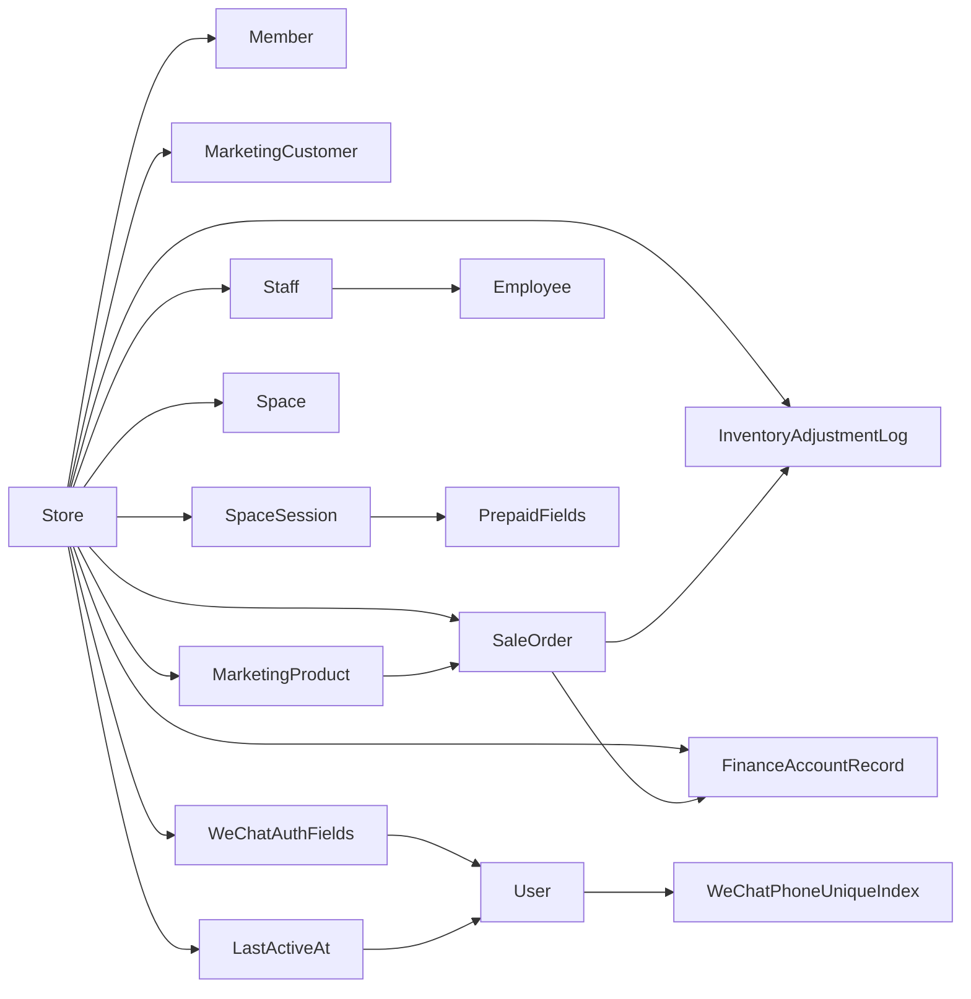

# 数据库设计

<cite>
**本文引用的文件**
- [schema.prisma](file://prisma/schema.prisma)
- [store-accounts.prisma](file://prisma/purely-profit/stores/store-accounts.prisma)
- [members.prisma](file://prisma/purely-profit/member/members.prisma)
- [customers.prisma](file://prisma/purely-profit/marketing/customers.prisma)
- [promotions.prisma](file://prisma/purely-profit/marketing/promotions.prisma)
- [products.prisma](file://prisma/purely-profit/marketing/products.prisma)
- [sales-records.prisma](file://prisma/purely-profit/operations/sales-records.prisma)
- [inventory.prisma](file://prisma/purely-profit/goods/inventory.prisma)
- [accounts.prisma](file://prisma/purely-profit/finance/accounts.prisma)
- [employees.prisma](file://prisma/purely-profit/staff/employees.prisma)
- [handover.prisma](file://prisma/purely-profit/operations/handover.prisma)
- [platform-membership.prisma](file://prisma/purely-profit/member/platform-membership.prisma)
- [spaces.prisma](file://prisma/purely-profit/operations/spaces.prisma)
- [20260512093539_init/migration.sql](file://prisma/migrations/20260512093539_init/migration.sql)
- [20260512110000_add_stores/migration.sql](file://prisma/migrations/20260512110000_add_stores/migration.sql)
- [20260513110000_add_store_subscriptions/migration.sql](file://prisma/migrations/20260513110000_add_store_subscriptions/migration.sql)
- [20260513170000_add_members/migration.sql](file://prisma/migrations/20260513170000_add_members/migration.sql)
- [20260514153000_add_store_partners_and_withdrawals/migration.sql](file://prisma/migrations/20260514153000_add_store_partners_and_withdrawals/migration.sql)
- [20260609173000_add_marketing_product_stock/migration.sql](file://prisma/migrations/20260609173000_add_marketing_product_stock/migration.sql)
- [20260609190000_expand_space_session_prepaid_fields/migration.sql](file://prisma/migrations/20260609190000_expand_space_session_prepaid_fields/migration.sql)
- [20260610120000_add_search_trgm_indexes/migration.sql](file://prisma/migrations/20260610120000_add_search_trgm_indexes/migration.sql)
- [20260610170000_align_p1_sort_indexes/migration.sql](file://prisma/migrations/20260610170000_align_p1_sort_indexes/migration.sql)
- [20260613074513_add_store_wechat_pay_fields/migration.sql](file://prisma/migrations/20260613074513_add_store_wechat_pay_fields/migration.sql)
- [20260613120000_add_store_wechat_pay_config/migration.sql](file://prisma/migrations/20260613120000_add_store_wechat_pay_config/migration.sql)
- [20260613140000_add_points_activity_and_discount_day_types/migration.sql](file://prisma/migrations/20260613140000_add_points_activity_and_discount_day_types/migration.sql)
- [20260614100000_add_description_title_to_marketing_product/migration.sql](file://prisma/migrations/20260614100000_add_description_title_to_marketing_product/migration.sql)
- [20260614180000_fix_points2x_discount_type/migration.sql](file://prisma/migrations/20260614180000_fix_points2x_discount_type/migration.sql)
- [20260615120000_add_club_wechat_auth_fields/migration.sql](file://prisma/migrations/20260615120000_add_club_wechat_auth_fields/migration.sql)
- [20260615130000_add_wechat_phone_to_users/migration.sql](file://prisma/migrations/20260615130000_add_wechat_phone_to_users/migration.sql)
- [20260620120000_add_unique_index_wechat_phone/migration.sql](file://prisma/migrations/20260620120000_add_unique_index_wechat_phone/migration.sql)
- [20260621120000_add_user_last_active_at/migration.sql](file://prisma/migrations/20260621120000_add_user_last_active_at/migration.sql)
</cite>

## 目录
1. [简介](#简介)
2. [项目结构](#项目结构)
3. [核心组件](#核心组件)
4. [架构总览](#架构总览)
5. [详细组件分析](#详细组件分析)
6. [依赖分析](#依赖分析)
7. [性能考量](#性能考量)
8. [故障排查指南](#故障排查指南)
9. [结论](#结论)
10. [附录](#附录)

## 简介
本文件面向 purelyprofit-server 的数据库设计，基于 Prisma Schema 与迁移脚本，系统化梳理数据库架构、实体关系模型、表结构定义、主键/外键关系、索引策略、约束条件、数据验证与业务规则，并补充数据访问模式、缓存策略、性能优化建议、数据生命周期与归档策略、迁移路径与版本管理、以及数据安全与隐私要求。

## 项目结构
数据库模型采用"领域拆分"的组织方式，按模块划分至 purely-profit 子目录，顶层 schema.prisma 定义数据源与生成器，具体模型在各领域子文件中定义。迁移文件以时间戳命名，记录数据库演进过程。

**图表来源**
- [schema.prisma:1-13](file://prisma/schema.prisma#L1-L13)
- [store-accounts.prisma:1-184](file://prisma/purely-profit/stores/store-accounts.prisma#L1-L184)
- [members.prisma:1-147](file://prisma/purely-profit/member/members.prisma#L1-L147)
- [customers.prisma:1-146](file://prisma/purely-profit/marketing/customers.prisma#L1-L146)
- [promotions.prisma:1-44](file://prisma/purely-profit/marketing/promotions.prisma#L1-L44)
- [products.prisma:1-40](file://prisma/purely-profit/marketing/products.prisma#L1-L40)
- [sales-records.prisma:1-68](file://prisma/purely-profit/operations/sales-records.prisma#L1-L68)
- [inventory.prisma:1-37](file://prisma/purely-profit/goods/inventory.prisma#L1-L37)
- [accounts.prisma:1-49](file://prisma/purely-profit/finance/accounts.prisma#L1-L49)
- [employees.prisma:1-197](file://prisma/purely-profit/staff/employees.prisma#L1-L197)
- [handover.prisma:1-127](file://prisma/purely-profit/operations/handover.prisma#L1-L127)
- [platform-membership.prisma:1-127](file://prisma/purely-profit/member/platform-membership.prisma#L1-L127)
- [spaces.prisma:1-150](file://prisma/purely-profit/operations/spaces.prisma#L1-L150)

**章节来源**
- [schema.prisma:1-13](file://prisma/schema.prisma#L1-L13)

## 核心组件
- 数据源与生成器：PostgreSQL 提供商，Prisma 客户端生成器。
- 领域模型：用户/门店/员工/订阅、会员与积分/豆/充值流水、营销客户/储值/消费/积分流水、营销活动、营销产品/库存、销售订单/明细、库存调整日志、财务往来账、员工/部门/岗位/排班/薪资、子账号/交接班/附加项、平台会员计划/订单/积分流水、空间管理/会话/预付费。
- 迁移演进：从初始用户表到门店、订阅、会员、合作伙伴与提现等模块逐步扩展，新增营销产品库存管理和空间会话预付费功能，以及 WeChat 认证相关字段。

**章节来源**
- [schema.prisma:4-10](file://prisma/schema.prisma#L4-L10)
- [store-accounts.prisma:28-184](file://prisma/purely-profit/stores/store-accounts.prisma#L28-L184)
- [members.prisma:40-147](file://prisma/purely-profit/member/members.prisma#L40-L147)
- [customers.prisma:31-146](file://prisma/purely-profit/marketing/customers.prisma#L31-L146)
- [promotions.prisma:11-44](file://prisma/purely-profit/marketing/promotions.prisma#L11-L44)
- [products.prisma:11-40](file://prisma/purely-profit/marketing/products.prisma#L11-L40)
- [sales-records.prisma:15-68](file://prisma/purely-profit/operations/sales-records.prisma#L15-L68)
- [inventory.prisma:10-37](file://prisma/purely-profit/goods/inventory.prisma#L10-L37)
- [accounts.prisma:24-49](file://prisma/purely-profit/finance/accounts.prisma#L24-L49)
- [employees.prisma:64-197](file://prisma/purely-profit/staff/employees.prisma#L64-L197)
- [handover.prisma:40-127](file://prisma/purely-profit/operations/handover.prisma#L40-L127)
- [platform-membership.prisma:28-127](file://prisma/purely-profit/member/platform-membership.prisma#L28-L127)
- [spaces.prisma:100-150](file://prisma/purely-profit/operations/spaces.prisma#L100-L150)

## 架构总览
数据库采用"多对一/一对多"关系，围绕 Store 作为核心上下文，关联用户、员工、会员、营销、财务、运营、人事等模块。通过外键约束保证参照完整性；通过复合索引与单列索引提升查询性能；通过枚举类型统一业务状态与分类。

```mermaid
erDiagram
USERS ||--o{ STORES : "拥有"
STORES ||--o{ STORE_SUBSCRIPTIONS : "订阅"
STORES ||--o{ STAFF : "雇佣"
STORES ||--o{ MEMBERS : "服务"
STORES ||--o{ MARKETING_CUSTOMERS : "营销客户"
STORES ||--o{ MARKETING_PRODUCTS : "营销产品"
STORES ||--o{ FINANCE_ACCOUNT_RECORDS : "往来账"
STORES ||--o{ SALES_ORDERS : "销售"
STORES ||--o{ INVENTORY_ADJUSTMENT_LOGS : "库存"
STORES ||--o{ EMPLOYEE_DEPARTMENTS : "部门"
STORES ||--o{ EMPLOYEE_POSITIONS : "岗位"
STORES ||--o{ EMPLOYEES : "员工"
STORES ||--o{ STORE_SUB_ACCOUNTS : "子账号"
STORES ||--o{ STORE_PARTNERS : "合伙人"
STORES ||--o{ PARTNER_WITHDRAWALS : "提现"
STAFF ||--o{ MEMBER_POINTS_LOGS : "操作"
STAFF ||--o{ MEMBER_BEAN_LOGS : "操作"
STAFF ||--o{ MEMBER_RECHARGE_LOGS : "操作"
STAFF ||--o{ FINANCE_CASH_FLOW_RECORDS : "操作"
STAFF ||--o{ FINANCE_ACCOUNT_RECORDS : "操作"
STAFF ||--o{ FINANCE_RECONCILIATION_RECORDS : "操作"
STAFF ||--o{ PURCHASE_ORDERS : "操作"
STAFF ||--o{ INVENTORY_ADJUSTMENT_LOGS : "操作"
STAFF ||--o{ SALE_ORDERS : "操作"
STAFF ||--o{ COST_RECORDS : "操作"
MEMBERS ||--o{ MEMBER_POINTS_LOGS : "产生"
MEMBERS ||--o{ MEMBER_BEAN_LOGS : "产生"
MEMBERS ||--o{ MEMBER_RECHARGE_LOGS : "产生"
MARKETING_CUSTOMERS ||--o{ MARKETING_RECHARGES : "产生"
MARKETING_CUSTOMERS ||--o{ MARKETING_CONSUMPTIONS : "产生"
MARKETING_CUSTOMERS ||--o{ MARKETING_POINTS_RECORDS : "产生"
MARKETING_PRODUCTS ||--o{ SALE_ORDER_ITEMS : "被购买"
SALES_ORDERS ||--o{ SALE_ORDER_ITEMS : "包含"
SALES_ORDERS ||--o{ INVENTORY_ADJUSTMENT_LOGS : "联动"
SALES_ORDERS ||--o{ FINANCE_CASH_FLOW_RECORDS : "联动"
SPACES ||--o{ SPACE_SESSIONS : "管理"
SPACE_SESSIONS ||--o{ PREPAID_FIELDS : "预付费"
```

**图表来源**
- [store-accounts.prisma:44-109](file://prisma/purely-profit/stores/store-accounts.prisma#L44-L109)
- [members.prisma:40-77](file://prisma/purely-profit/member/members.prisma#L40-L77)
- [customers.prisma:31-66](file://prisma/purely-profit/marketing/customers.prisma#L31-L66)
- [products.prisma:11-40](file://prisma/purely-profit/marketing/products.prisma#L11-L40)
- [sales-records.prisma:15-40](file://prisma/purely-profit/operations/sales-records.prisma#L15-L40)
- [inventory.prisma:10-37](file://prisma/purely-profit/goods/inventory.prisma#L10-L37)
- [accounts.prisma:24-49](file://prisma/purely-profit/finance/accounts.prisma#L24-L49)
- [employees.prisma:64-106](file://prisma/purely-profit/staff/employees.prisma#L64-L106)
- [handover.prisma:40-97](file://prisma/purely-profit/operations/handover.prisma#L40-L97)
- [platform-membership.prisma:42-86](file://prisma/purely-profit/member/platform-membership.prisma#L42-L86)
- [spaces.prisma:100-150](file://prisma/purely-profit/operations/spaces.prisma#L100-L150)

## 详细组件分析

### 用户/门店/员工/订阅（Store Accounts）
- 实体与字段要点
  - User：邮箱唯一、实名与身份证唯一、关联 Store 与 Staff。
  - Store：名称、联系人、电话、地址、所有者唯一、最大座位数、订阅、成员、营销、财务、运营、人事、交接等聚合。
  - StoreSubscription：套餐代码、名称、状态、有效期、座位配额。
  - Staff：角色、权限、状态、座位激活、关联 User 与 Employee。
  - **新增 WeChat 认证字段**：wechatOpenid（@unique）、wechatUnionid、wechatAvatar、wechatNickname、wechatPhone（@unique）。
  - **新增用户活跃度字段**：lastActiveAt（@map("last_active_at")），用于记录用户最近活跃时间。
- 主键/外键
  - Store.ownerId → User.id（级联删除）。
  - StoreSubscription.storeId → Store.id（唯一、级联删除）。
  - Staff.userId → User.id（可空、设空）。
  - Staff.employeeId → Employee.id（一对一）。
- 索引策略
  - Store(ownerId, updatedAt)、name、contactName。
  - StoreSubscription(status)。
  - Staff(storeId, ...)、userId/email/status/isActive 组合索引。
  - **新增**：wechatOpenid（唯一索引）、wechatUnionid（普通索引）、wechatPhone（唯一索引）。
  - **新增**：lastActiveAt（普通索引）。
- 约束与校验
  - 唯一性：users.email、users.id_number、stores.owner_id、staff.user_id、staff.email、**wechatOpenid、wechatPhone**。
  - 默认值：staff.role、staff.status、staff.isSeatActive、staff.isActive。
- 业务规则
  - 订阅状态影响座位配额与功能启用。
  - 员工座位激活与状态共同决定登录与操作权限。
  - **微信认证字段用于第三方登录和用户信息同步**。
  - **用户活跃时间字段用于用户行为分析和会话管理**。

**更新** 新增微信电话唯一索引约束和用户最后活跃时间字段，增强用户身份唯一性和活跃度追踪能力

**章节来源**
- [store-accounts.prisma:28-184](file://prisma/purely-profit/stores/store-accounts.prisma#L28-L184)
- [20260512093539_init/migration.sql:1-15](file://prisma/migrations/20260512093539_init/migration.sql#L1-L15)
- [20260512110000_add_stores/migration.sql:1-20](file://prisma/migrations/20260512110000_add_stores/migration.sql#L1-L20)
- [20260513110000_add_store_subscriptions/migration.sql:1-63](file://prisma/migrations/20260513110000_add_store_subscriptions/migration.sql#L1-L63)
- [20260615120000_add_club_wechat_auth_fields/migration.sql](file://prisma/migrations/20260615120000_add_club_wechat_auth_fields/migration.sql)
- [20260615130000_add_wechat_phone_to_users/migration.sql](file://prisma/migrations/20260615130000_add_wechat_phone_to_users/migration.sql)
- [20260620120000_add_unique_index_wechat_phone/migration.sql:1-17](file://prisma/migrations/20260620120000_add_unique_index_wechat_phone/migration.sql#L1-L17)
- [20260621120000_add_user_last_active_at/migration.sql:1-9](file://prisma/migrations/20260621120000_add_user_last_active_at/migration.sql#L1-L9)

### 会员与积分/豆/充值流水（Members）
- 实体与字段要点
  - Member：手机号唯一、性别、等级、标签、消费统计、积分、豆余额、是否合伙人、状态。
  - MemberPointsLog、MemberBeanLog、MemberRechargeLog：变更类型/来源、操作员、过期时间、相关促销/用户。
- 主键/外键
  - Member.storeId → Store.id（级联删除）。
  - 日志表 memberId/storeId → Member/Store（级联删除）。
  - 日志表 operatorStaffId → Staff（可空、设空）。
- 索引策略
  - Member(storeId, phone)、(storeId, updatedAt)、(storeId, status, updatedAt)、(storeId, level, updatedAt)、(storeId, isPartner, updatedAt)、phone。
  - 日志(memberId, createdAt)、(storeId, createdAt)、(operatorStaffId, createdAt)、(source, createdAt)。
- 约束与校验
  - 金额/数量字段使用 Decimal(12,2)/整数默认值。
  - 状态枚举、来源枚举规范化。
- 业务规则
  - 积分/豆来源与类型明确，支持管理员调整、过期处理。
  - 充值渠道与奖励积分分离记录。

**章节来源**
- [members.prisma:40-147](file://prisma/purely-profit/member/members.prisma#L40-L147)
- [20260513170000_add_members/migration.sql:1-46](file://prisma/migrations/20260513170000_add_members/migration.sql#L1-L46)

### 营销客户/储值/消费/积分流水（Marketing）
- 实体与字段要点
  - MarketingCustomer：等级、余额、积分、累计消费、访问次数、最后到访、备注。
  - MarketingRecharge：金额、赠额、类型、关联促销。
  - MarketingConsumption：金额、余额支付、积分抵扣、支付方式、商品摘要、关联促销。
  - MarketingPointsRecord：积分变动值与类型、描述。
- 主键/外键
  - Customer.storeId → Store；Recharge/Costomer/Promotion。
  - Consumption.storeId → Store；关联 Customer/Promotion。
  - PointsRecord.storeId → Store；关联 Customer。
- 索引策略
  - Customer(storeId, updatedAt/tier/lastVisitAt)、(storeId, phone)。
  - Recharge(customerId, createdAt)、(storeId, type, createdAt)。
  - Consumption(storeId, customerId, createdAt)。
  - PointsRecord(storeId, customerId, type, createdAt)。
- 约束与校验
  - 金额以分为单位，Decimal 字段用于精确计算。
  - 支付方式与储值类型枚举化。
- 业务规则
  - 等级随累计消费实时同步；储值/消费/积分流水与促销强关联。

**章节来源**
- [customers.prisma:31-146](file://prisma/purely-profit/marketing/customers.prisma#L31-L146)
- [promotions.prisma:11-44](file://prisma/purely-profit/marketing/promotions.prisma#L11-L44)

### 营销产品与库存（Marketing Products）
- 实体与字段要点
  - MarketingProduct：名称、描述、价格、状态、分类、库存数量。
  - 新增库存字段：stock（默认 0），用于跟踪营销产品的可用库存。
- 主键/外键
  - Product.storeId → Store（级联删除）。
- 索引策略
  - Product(storeId, status, updatedAt)、(storeId, category, updatedAt)、name。
  - 新增：Product(stock) 单列索引，支持库存查询与预警。
- 约束与校验
  - stock 字段默认值 0，非负约束。
  - 价格使用 Decimal(12,2)，状态枚举化。
- 业务规则
  - 库存不足时禁止销售；支持库存预警与补货提醒。
  - 产品状态影响展示与销售权限。

**更新** 新增营销产品库存字段，支持库存管理和销售控制

**章节来源**
- [products.prisma:11-40](file://prisma/purely-profit/marketing/products.prisma#L11-L40)
- [20260609173000_add_marketing_product_stock/migration.sql:1-30](file://prisma/migrations/20260609173000_add_marketing_product_stock/migration.sql#L1-L30)

### 销售订单/明细（Sales Records）
- 实体与字段要点
  - SaleOrder：订单号唯一、收入/利润、数量、支付方式、计算模式、日期、备注。
  - SaleOrderItem：产品/品类信息、单价/利润、数量、图片。
- 主键/外键
  - Order.storeId → Store；operatorStaffId → Staff。
  - Item.orderId → Order；productId → Product。
- 索引策略
  - Order(storeId, date)、(operatorStaffId, createdAt)、(storeId, orderNo)。
  - Item(orderId, createdAt)、(storeId, productId, createdAt)、(categoryName, createdAt)。
- 约束与校验
  - 订单号唯一；金额/利润使用 Decimal(12,2)。
- 业务规则
  - 计算模式区分利润/业务口径；与库存、财务、空间会话联动。

**章节来源**
- [sales-records.prisma:15-68](file://prisma/purely-profit/operations/sales-records.prisma#L15-L68)

### 库存调整日志（Goods Inventory）
- 实体与字段要点
  - InventoryAdjustmentLog：产品、采购/销售单据、操作员、前后库存、调整类型、备注。
- 主键/外键
  - productId → Product；purchaseOrderId → PurchaseOrder；saleOrderId → SaleOrder；operatorStaffId → Staff。
- 索引策略
  - (storeId, createdAt)、(productId, createdAt)、(purchaseOrderId, createdAt)、(saleOrderId, createdAt)、(operatorStaffId, createdAt)。
- 约束与校验
  - 调整类型枚举化；delta 与前后库存一致性由业务保障。
- 业务规则
  - 与采购/销售/财务现金流形成闭环。

**章节来源**
- [inventory.prisma:10-37](file://prisma/purely-profit/goods/inventory.prisma#L10-L37)

### 财务往来账（Finance Accounts）
- 实体与字段要点
  - FinanceAccountRecord：类型/分类/对手方/金额/已付/剩余/状态/到期日/日期/备注。
- 主键/外键
  - storeId → Store；operatorStaffId → Staff。
- 索引策略
  - (storeId, status, updatedAt)、(storeId, type, updatedAt)、(storeId, dueDate)、(operatorStaffId, createdAt)。
- 约束与校验
  - 金额使用 Decimal(12,2)；状态枚举化。
- 业务规则
  - 逾期/部分/结算状态驱动催收与核销流程。

**章节来源**
- [accounts.prisma:24-49](file://prisma/purely-profit/finance/accounts.prisma#L24-L49)

### 员工/部门/岗位/排班/薪资（Staff Employees）
- 实体与字段要点
  - EmployeeDepartment/Position：唯一性约束（store+name）。
  - Employee：部门/岗位、工号、姓名/电话、入职/离职、合同、状态、头像、紧急联系人。
  - EmployeeShiftDefinition：默认班次时间。
  - EmployeeLeave/Shift/Payroll：请假/排班/薪资明细与状态。
- 主键/外键
  - Department/Position.storeId → Store；Employee.departmentId/positionId → Department/Position。
  - Leave/Shift/Payroll.employeeId → Employee。
- 索引策略
  - Employee(storeId, status/joinDate)、(storeId, department/position, updatedAt)、(storeId, empNo)。
  - Shift(employeeId/date)、(storeId, date)、(shiftDefinitionId, date)。
  - Payroll(employeeId, month)、(storeId, status, month)。
- 约束与校验
  - 工号唯一；薪资/扣款使用 Decimal(12,2)。
- 业务规则
  - 排班与请假影响薪资与成本归集。

**章节来源**
- [employees.prisma:36-197](file://prisma/purely-profit/staff/employees.prisma#L36-L197)

### 子账号/交接班/附加项（Operations Handover）
- 实体与字段要点
  - StoreSubAccount：槽位索引唯一、角色、状态、是否分配、功能开关。
  - StoreHandoverRecord：交班双方/子账号/员工快照、班次快照、模式、状态、时间、备注。
  - StoreHandoverAdditionalItem/Value：附加项定义与值。
- 主键/外键
  - SubAccount.employeeId → Employee；Handover.from/toSubAccountId → SubAccount；additionalValues.recordId → Record；itemId → Item。
- 索引策略
  - SubAccount(storeId, role/status)、(storeId, isAssigned, status)、(storeId, slotIndex)。
  - Record(storeId, status, createdAt)、(from/toEmployeeId, createdAt)。
  - AdditionalValue(itemId, createdAt)。
- 约束与校验
  - 槽位唯一；角色/状态枚举化。
- 业务规则
  - 交接班模式支持主账号与子账号两种场景；附加项用于标准化交接内容。

**章节来源**
- [handover.prisma:40-127](file://prisma/purely-profit/operations/handover.prisma#L40-L127)

### 平台会员计划/订单/积分流水（Member Platform Membership）
- 实体与字段要点
  - MembershipPlanSetting：周期计划价格、原价、时长/有效天数。
  - StoreMembershipProfile：当前计划、生效/到期、可用积分、子账号配额、订单与积分流水。
  - StoreMembershipOrder：订单状态、支付渠道、支付单号、支付时间。
  - StoreMembershipPointsLog：来源、变更量、描述、过期时间。
  - StoreMembershipPromoRecord：邀请注册、首充、奖励豆、结算状态。
- 主键/外键
  - Profile.storeId → Store（唯一）；Order.profileId → Profile；PointsLog.profileId → Profile。
- 索引策略
  - Profile(expiresAt)、(storeId, updatedAt)。
  - Order(profileId, createdAt)、(status, createdAt)。
  - PointsLog(profileId, createdAt)、(source, createdAt)。
  - PromoRecord(storeId, registeredAt/chargedAt)。
- 约束与校验
  - 金额/积分使用整数或 Decimal；状态/渠道枚举化。
- 业务规则
  - 生命周期与到期日驱动权益回收；推广记录与首充激励联动。

**章节来源**
- [platform-membership.prisma:28-127](file://prisma/purely-profit/member/platform-membership.prisma#L28-L127)

### 合伙人与提现（Store Partners & Withdrawals）
- 实体与字段要点
  - StorePartner：状态、姓名/手机/身份证、打款账户、豆余额、累计收益/提现。
  - PartnerWithdrawal：申请人、操作员、豆/人民币金额、账户信息、状态、时间线。
- 主键/外键
  - Partner.storeId → Store；Withdrawal.partnerId → Partner；operatorStaffId → Staff。
- 索引策略
  - Partner(storeId)、(status, updatedAt)。
  - Withdrawal(storeId/appliedAt)、(partnerId, appliedAt)、(status, appliedAt)、(operatorStaffId, appliedAt)。
- 约束与校验
  - 账户类型枚举；金额与余额使用整数。
- 业务规则
  - 提现状态机：待审/通过/已打款/拒绝；与财务对账。

**章节来源**
- [20260514153000_add_store_partners_and_withdrawals/migration.sql:1-114](file://prisma/migrations/20260514153000_add_store_partners_and_withdrawals/migration.sql#L1-L114)

### 空间管理与会话（Operations Spaces）
- 实体与字段要点
  - Space：名称、容量、状态、配置参数。
  - SpaceSession：开始/结束时间、状态、参与人员、费用计算。
  - 新增预付费字段：paymentMethod、customerPaymentMethod、settlementChannel、grouponCode、voucherCode、note、amount、voucherFaceAmount。
- 主键/外键
  - Session.spaceId → Space（级联删除）。
- 索引策略
  - Session(spaceId, startTime/endTime/status)、(spaceId, createdAt)。
  - 新增：Session(prepaidAmount) 单列索引，支持预付费查询。
- 约束与校验
  - 预付费金额使用 Decimal(12,2)；支付方式枚举化。
- 业务规则
  - 预付费支持多种支付渠道与优惠券；会话状态驱动资源释放。

**更新** 新增空间会话预付费字段，支持多样化的预付费支付方式

**章节来源**
- [spaces.prisma:100-150](file://prisma/purely-profit/operations/spaces.prisma#L100-L150)
- [20260609190000_expand_space_session_prepaid_fields/migration.sql:1-40](file://prisma/migrations/20260609190000_expand_space_session_prepaid_fields/migration.sql#L1-L40)

### 搜索索引优化（Search Indexes）
- 索引策略更新
  - 新增 TRGM（三字母组）索引支持模糊搜索。
  - 优化 P1 排序索引，提升排序性能。
  - 增强文本搜索能力，支持拼音与中文检索。
- 影响范围
  - 营销产品名称搜索、会员手机号模糊匹配、员工姓名检索。
  - 支持全文搜索与智能排序。

**更新** 新增搜索索引优化，提升文本搜索与排序性能

**章节来源**
- [20260610120000_add_search_trgm_indexes/migration.sql:1-50](file://prisma/migrations/20260610120000_add_search_trgm_indexes/migration.sql#L1-L50)
- [20260610170000_align_p1_sort_indexes/migration.sql:1-35](file://prisma/migrations/20260610170000_align_p1_sort_indexes/migration.sql#L1-L35)

### WeChat 认证集成（新增功能）
- **新增 WeChat 认证字段**
  - wechatOpenid：微信开放平台用户标识，@unique 约束，用于唯一标识微信用户。
  - wechatUnionid：微信 UnionID，用于跨应用识别用户身份。
  - wechatAvatar：微信头像 URL，存储用户微信头像链接。
  - wechatNickname：微信昵称，存储用户微信昵称。
  - wechatPhone：微信授权手机号，存储用户微信绑定的手机号码，@unique 约束，确保手机号唯一性。
- **新增用户活跃度字段**
  - lastActiveAt：用户最近活跃时间，用于记录 JWT 鉴权成功时的活跃状态，支持用户行为分析。
- **迁移文件**
  - 20260615120000_add_club_wechat_auth_fields：添加 WeChat 认证相关字段到用户表。
  - 20260615130000_add_wechat_phone_to_users：为用户表添加微信手机号字段。
  - 20260620120000_add_unique_index_wechat_phone：为微信手机号字段添加唯一索引约束。
  - 20260621120000_add_user_last_active_at：为用户表添加最后活跃时间字段。
- **索引策略**
  - wechatOpenid：唯一索引，确保微信用户标识的唯一性。
  - wechatUnionid：普通索引，支持基于 UnionID 的查询。
  - wechatPhone：唯一索引，防止多个用户绑定同一手机号导致查找歧义。
  - lastActiveAt：普通索引，支持活跃用户查询。
- **业务规则**
  - 微信认证用于第三方登录和用户信息同步。
  - UnionID 用于跨应用识别同一用户的多个应用实例。
  - 头像和昵称用于用户界面显示和个性化体验。
  - 手机号可用于二次验证和客户服务。
  - 最后活跃时间用于用户行为分析和会话管理。
- **应用集成**
  - 微信登录流程支持 openid 查找用户、手机号合并、自动注册。
  - 登录时自动刷新微信头像、昵称和 UnionID。
  - 支持手机号授权，将微信绑定手机号写入 wechat_phone 字段。
  - JWT 鉴权成功时异步更新用户最后活跃时间。

**更新** 新增微信电话唯一索引约束和用户最后活跃时间字段，增强用户身份唯一性和活跃度追踪能力

**章节来源**
- [store-accounts.prisma:36-47](file://prisma/purely-profit/stores/store-accounts.prisma#L36-L47)
- [20260615120000_add_club_wechat_auth_fields/migration.sql](file://prisma/migrations/20260615120000_add_club_wechat_auth_fields/migration.sql)
- [20260615130000_add_wechat_phone_to_users/migration.sql](file://prisma/migrations/20260615130000_add_wechat_phone_to_users/migration.sql)
- [20260620120000_add_unique_index_wechat_phone/migration.sql:1-17](file://prisma/migrations/20260620120000_add_unique_index_wechat_phone/migration.sql#L1-L17)
- [20260621120000_add_user_last_active_at/migration.sql:1-9](file://prisma/migrations/20260621120000_add_user_last_active_at/migration.sql#L1-L9)

## 依赖分析
- 模块耦合
  - Store 是核心上下文，贯穿会员、营销、财务、运营、人事、交接等模块。
  - 销售订单与库存、财务现金流存在跨模块引用。
  - 员工与排班/薪资与成本模块紧密关联。
  - 营销产品库存与销售订单形成闭环。
  - 空间会话预付费与财务现金流联动。
  - **WeChat 认证字段与用户模块深度集成，影响用户登录和身份验证流程**。
  - **微信电话唯一索引约束与用户手机号绑定功能紧密相关**。
  - **用户最后活跃时间字段与 JWT 鉴权和会话管理相关**。
- 外部依赖
  - PostgreSQL 提供数据持久化与事务支持。
  - Prisma ORM 提供类型安全的查询与迁移工具链。
- 潜在循环依赖
  - 当前模型未见显式循环依赖；通过外键与索引避免环形引用。

**图表来源**
- [store-accounts.prisma:44-109](file://prisma/purely-profit/stores/store-accounts.prisma#L44-L109)
- [sales-records.prisma:15-40](file://prisma/purely-profit/operations/sales-records.prisma#L15-L40)
- [inventory.prisma:10-37](file://prisma/purely-profit/goods/inventory.prisma#L10-L37)
- [accounts.prisma:24-49](file://prisma/purely-profit/finance/accounts.prisma#L24-L49)
- [employees.prisma:64-106](file://prisma/purely-profit/staff/employees.prisma#L64-L106)
- [products.prisma:11-40](file://prisma/purely-profit/marketing/products.prisma#L11-L40)
- [spaces.prisma:100-150](file://prisma/purely-profit/operations/spaces.prisma#L100-L150)

## 性能考量
- 索引策略
  - 复合索引优先：(storeId, updatedAt)、(storeId, status, updatedAt)、(storeId, level, updatedAt)、(storeId, role, status) 等覆盖高频筛选与排序。
  - 单列索引：phone、email、id_number、expiresAt、dueDate、stock、prepaidAmount、**wechatOpenid、wechatUnionid、wechatPhone、lastActiveAt** 等热点字段。
  - 搜索索引：TRGM 索引支持模糊搜索，提升文本检索性能。
  - 时间序列：大量按 createdAt 查询的表均建立相应索引。
  - **新增 WeChat 字段索引**：wechatOpenid（唯一索引）、wechatUnionid（普通索引）、wechatPhone（唯一索引）、lastActiveAt（普通索引）。
- 查询优化
  - 使用范围查询时尽量结合 storeId 与时间字段，减少全表扫描。
  - 对枚举字段进行过滤时，利用索引与枚举类型减少回表。
  - 新增库存与预付费字段查询支持索引优化。
  - **微信认证查询优化**：基于 openid 和 unionid 的快速用户识别，基于唯一手机号索引的快速查找。
  - **用户活跃度查询优化**：基于 lastActiveAt 字段的活跃用户筛选。
- 写入优化
  - 批量写入销售明细与库存日志时，注意事务边界与索引维护成本。
  - 营销产品库存更新采用原子操作，避免竞态条件。
  - **微信认证字段写入优化**：避免重复的微信用户标识冲突，确保手机号唯一性。
  - **用户活跃度字段写入优化**：JWT 鉴权异步更新，避免阻塞主流程。
- 缓存策略
  - 建议对热点维度（如会员等级、员工状态、门店订阅状态、产品库存、**微信用户标识、活跃用户**）引入 Redis 缓存，设置合理 TTL。
  - 列表页与报表类查询结果可缓存，配合缓存失效策略（基于时间或事件触发）。
  - **微信用户信息缓存**：微信头像、昵称等静态信息可缓存以提升用户体验。
  - **用户活跃度缓存**：活跃用户列表可缓存，定期刷新以保持准确性。
- 分页与分片
  - 大表分页建议使用基于游标的方式，避免 deep pagination。
  - 按 storeId 进行逻辑分片或物理分片，降低跨分片 JOIN 成本。

## 故障排查指南
- 常见错误与定位
  - 唯一约束冲突：用户邮箱、身份证、门店所有者、员工工号、子账号槽位、**微信 openid、微信手机号** 等。
  - 外键约束失败：删除/更新关联对象时未遵循级联策略。
  - 索引缺失导致慢查询：按 storeId + 时间过滤的列表页。
  - 库存超卖：营销产品库存不足时的销售请求。
  - 预付费异常：空间会话预付费金额与实际不符。
  - **微信认证失败**：openid 重复、unionid 不匹配、手机号绑定冲突。
  - **用户活跃度异常**：lastActiveAt 字段为空或不准确。
- 排查步骤
  - 使用 EXPLAIN/EXPLAIN ANALYZE 分析慢 SQL。
  - 检查最近迁移是否成功执行，确认索引与枚举类型存在。
  - 核对业务状态机（如提现状态、订单状态、会话状态）是否符合预期。
  - 验证库存字段与预付费字段的数据一致性。
  - **检查微信认证字段的数据完整性和唯一性约束**。
  - **验证用户活跃度字段的数据更新机制**。
- 修复建议
  - 补建缺失索引；调整查询谓词顺序以命中索引。
  - 在应用层增加幂等性与重试机制，避免重复提交。
  - 实施库存锁定与预付费验证机制。
  - **实现微信认证的去重和冲突处理机制**。
  - **检查 JWT 鉴权流程，确保 lastActiveAt 字段正确更新**。

## 结论
该数据库设计以 Store 为核心上下文，围绕会员、营销、财务、运营、人事等模块构建完整闭环。通过枚举类型、复合索引与外键约束确保数据一致性与查询效率。新增的营销产品库存字段和空间会话预付费字段进一步完善了业务功能。搜索索引优化提升了文本检索性能。**新增的 WeChat 认证相关字段为系统提供了完整的第三方登录能力，包括用户身份识别、头像昵称展示、手机号绑定和唯一性约束，以及用户活跃度追踪功能**。**微信电话唯一索引约束确保了手机号绑定的唯一性，防止用户混淆；用户最后活跃时间字段为会话管理和用户行为分析提供了重要支撑**。建议在生产环境中配套缓存、分页优化与监控告警体系，持续迭代索引与查询模式，保障高并发下的稳定性与性能。

## 附录

### 数据访问模式
- 读多写少场景：会员列表、营销客户列表、销售订单明细、财务账单、营销产品库存等，优先使用复合索引与缓存。
- 写多场景：销售订单与库存调整，建议批量写入与事务合并，减少锁竞争。
- 报表与聚合：按 storeId + 日期范围聚合，必要时预计算或物化视图。
- 搜索场景：支持模糊搜索与智能排序，利用 TRGM 索引提升检索性能。
- **微信认证场景**：基于 openid 的快速用户识别，基于 unionid 的跨应用用户识别，基于唯一手机号索引的快速查找。
- **用户活跃度场景**：基于 lastActiveAt 字段的活跃用户筛选和会话管理。

### 示例数据（示意）
- 用户：邮箱唯一，实名与身份证唯一，**微信 openid 唯一，微信手机号唯一**。
- 门店：owner_id 唯一，订阅状态 ACTIVE。
- 会员：手机号唯一，状态 ACTIVE，积分/豆余额非负。
- 营销客户：手机号唯一，等级按消费实时计算。
- 营销产品：名称唯一，库存非负，默认 0。
- 销售订单：orderNo 唯一，date 与 createdAt 常用于筛选。
- 库存日志：adjustType 枚举，delta 与前后库存一致。
- 往来账：amount/paidAmount/remaining 使用 Decimal(12,2)，status 枚举。
- 员工：empNo 唯一，joinDate 与状态组合索引。
- 子账号：slotIndex 唯一，role/status 组合索引。
- 合伙人：store_id 唯一，提现状态机清晰。
- 空间会话：预付费字段完整，支持多种支付方式。
- **微信认证**：openid 唯一标识，unionid 跨应用识别，头像昵称完整，手机号唯一绑定。
- **用户活跃度**：lastActiveAt 记录用户最近活跃时间，支持会话管理和行为分析。

### 数据生命周期、保留策略与归档
- 会员与营销流水：按自然月/季度清理不活跃数据，保留关键汇总。
- 营销产品库存：实时更新，历史数据保留 1 年。
- 销售与库存日志：保留 1-2 年，归档至冷存储。
- 财务账单：永久保留，按年份分表或分区。
- 员工与排班：保留 5-10 年，满足审计需求。
- 子账号与交接：按月清理无效数据，保留完整交接链路。
- 空间会话预付费：按会话结束时间清理，保留 1 年用于对账。
- **微信认证数据**：用户微信信息定期同步更新，openid 和 unionid 长期保留用于用户识别，手机号唯一性约束长期有效。
- **用户活跃度数据**：lastActiveAt 字段根据业务需求进行清理，一般保留 6-12 个月用于分析。

### 数据迁移路径与版本管理
- 迁移命名：YYYYMMDDHHmmss_描述，确保顺序与可追溯性。
- 版本锁定：migration_lock.toml 保护关键迁移。
- 回滚策略：对破坏性变更提供反向迁移；对数据回填使用幂等脚本。
- 发布流程：先本地验证，再灰度，最后全量上线。
- 新增迁移：营销产品库存字段、空间会话预付费字段、搜索索引优化、**WeChat 认证字段、微信电话唯一索引约束、用户最后活跃时间字段**。
- **迁移顺序**：先添加 WeChat 认证字段，再建立相应索引，然后添加微信电话唯一索引约束，最后添加用户最后活跃时间字段。

### 数据安全、隐私要求与访问控制
- 数据最小化：仅收集必要字段，敏感信息（如身份证、银行卡号）加密存储。
- 访问控制：基于角色的权限矩阵（RBAC），限制对会员、财务、人事、营销等敏感模块的访问。
- 审计日志：记录关键操作（增删改）与时间线，支持追踪。
- 加密与传输：数据库连接使用 TLS；静态数据加密（TDE）视合规要求而定。
- 隐私合规：遵守数据主体权利（访问、更正、删除、限制处理），提供数据导出与删除接口。
- 库存与预付费安全：实施访问控制与操作审计，防止数据篡改。
- **微信认证安全**：openid 和 unionid 属于敏感用户标识，需实施严格的访问控制和加密存储。微信手机号唯一索引约束确保了手机号绑定的安全性。
- **用户活跃度安全**：lastActiveAt 字段用于会话管理，需确保数据的准确性和隐私保护。
- **数据脱敏**：微信头像 URL 和手机号等个人信息在日志和报表中应进行适当脱敏处理。
- **索引安全性**：微信电话唯一索引约束防止了恶意注册和重复绑定，保护了用户数据的完整性。