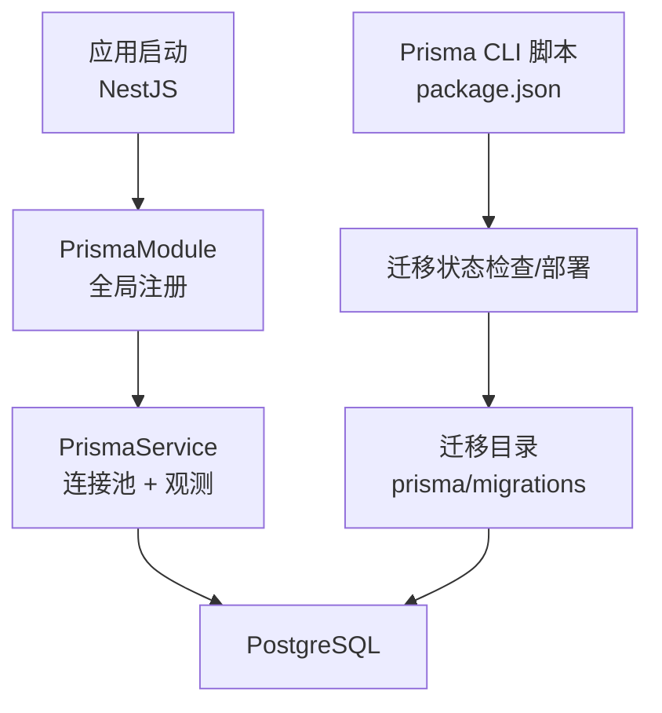
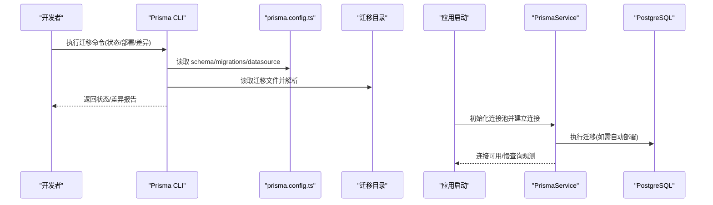
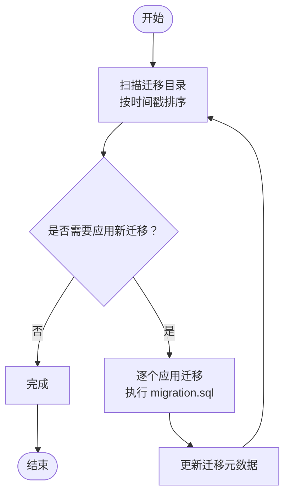
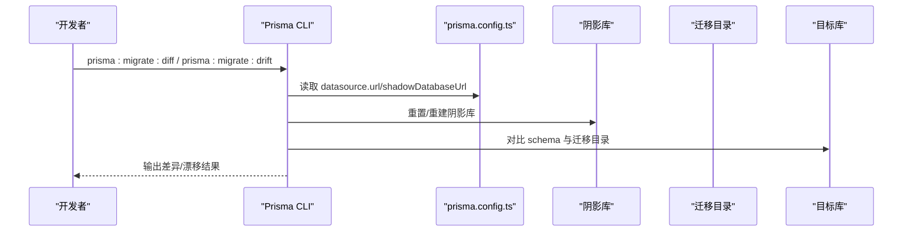
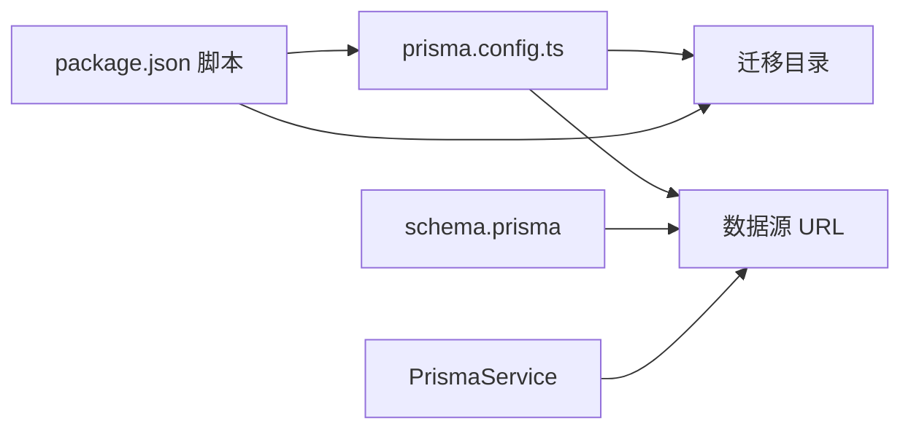

# 数据迁移管理

<cite>
**本文引用的文件**
- [prisma/migrations/migration_lock.toml](file://prisma/migrations/migration_lock.toml)
- [prisma/schema.prisma](file://prisma/schema.prisma)
- [prisma.config.ts](file://prisma.config.ts)
- [src/prisma/prisma.module.ts](file://src/prisma/prisma.module.ts)
- [src/prisma/prisma.service.ts](file://src/prisma/prisma.service.ts)
- [package.json](file://package.json)
- [prisma/migrations/20260512093539_init/migration.sql](file://prisma/migrations/20260512093539_init/migration.sql)
- [prisma/migrations/20260512110000_add_stores/migration.sql](file://prisma/migrations/20260512110000_add_stores/migration.sql)
- [prisma/migrations/20260512113000_add_staffs/migration.sql](file://prisma/migrations/20260512113000_add_staffs/migration.sql)
- [prisma/migrations/20260512121000_staff_permissions/migration.sql](file://prisma/migrations/20260512121000_staff_permissions/migration.sql)
- [prisma/migrations/20260512130000_store_seats_and_staff_status/migration.sql](file://prisma/migrations/20260512130000_store_seats_and_staff_status/migration.sql)
- [prisma/migrations/20260513110000_add_store_subscriptions/migration.sql](file://prisma/migrations/20260513110000_add_store_subscriptions/migration.sql)
- [prisma/migrations/20260513130000_add_performance_indexes/migration.sql](file://prisma/migrations/20260513130000_add_performance_indexes/migration.sql)
- [prisma/migrations/20260513143000_add_list_filter_indexes/migration.sql](file://prisma/migrations/20260513143000_add_list_filter_indexes/migration.sql)
- [prisma/migrations/20260513160000_lock_single_account_single_store/migration.sql](file://prisma/migrations/20260513160000_lock_single_account_single_store/migration.sql)
- [prisma/migrations/20260513170000_add_members/migration.sql](file://prisma/migrations/20260513170000_add_members/migration.sql)
- [prisma/migrations/20260513180000_add_member_points_logs/migration.sql](file://prisma/migrations/20260513180000_add_member_points_logs/migration.sql)
- [prisma/migrations/20260513193000_align_members_for_purelypulse/migration.sql](file://prisma/migrations/20260513193000_align_members_for_purelypulse/migration.sql)
- [prisma/migrations/20260513200000_add_employee_management/migration.sql](file://prisma/migrations/20260513200000_add_employee_management/migration.sql)
- [prisma/migrations/20260513210000_add_user_profile_fields/migration.sql](file://prisma/migrations/20260513210000_add_user_profile_fields/migration.sql)
- [prisma/migrations/20260513223000_add_member_bean_logs_and_points_sources/migration.sql](file://prisma/migrations/20260513223000_add_member_bean_logs_and_points_sources/migration.sql)
- [prisma/migrations/20260513230000_add_member_recharge_logs/migration.sql](file://prisma/migrations/20260513230000_add_member_recharge_logs/migration.sql)
- [prisma/migrations/20260514064726_add_marketing_module/migration.sql](file://prisma/migrations/20260514064726_add_marketing_module/migration.sql)
- [prisma/migrations/20260514153000_add_store_partners_and_withdrawals/migration.sql](file://prisma/migrations/20260514153000_add_store_partners_and_withdrawals/migration.sql)
- [prisma/migrations/20260514183000_add_platform_membership_orders/migration.sql](file://prisma/migrations/20260514183000_add_platform_membership_orders/migration.sql)
- [prisma/migrations/20260514210000_add_commerce_inventory/migration.sql](file://prisma/migrations/20260514210000_add_commerce_inventory/migration.sql)
- [prisma/migrations/20260514213000_add_finance_management/migration.sql](file://prisma/migrations/20260514213000_add_finance_management/migration.sql)
- [prisma/migrations/20260514223000_add_business_analysis_sales_orders/migration.sql](file://prisma/migrations/20260514223000_add_business_analysis_sales_orders/migration.sql)
- [prisma/migrations/20260514234000_add_cost_management/migration.sql](file://prisma/migrations/20260514234000_add_cost_management/migration.sql)
- [prisma/migrations/20260515001000_link_sales_orders_to_finance_and_inventory/migration.sql](file://prisma/migrations/20260515001000_link_sales_orders_to_finance_and_inventory/migration.sql)
- [prisma/migrations/20260515013000_add_space_management_and_reservations/migration.sql](file://prisma/migrations/20260515013000_add_space_management_and_reservations/migration.sql)
- [prisma/migrations/20260515023000_add_space_sessions/migration.sql](file://prisma/migrations/20260515023000_add_space_sessions/migration.sql)
- [prisma/migrations/20260515110000_expand_platform_membership_center/migration.sql](file://prisma/migrations/20260515110000_expand_platform_membership_center/migration.sql)
- [prisma/migrations/20260515123000_add_partner_application_history/migration.sql](file://prisma/migrations/20260515123000_add_partner_application_history/migration.sql)
- [prisma/migrations/20260515133000_add_marketing_points_records/migration.sql](file://prisma/migrations/20260515133000_add_marketing_points_records/migration.sql)
- [prisma/migrations/20260523120000_add_membership_plan_settings/migration.sql](file://prisma/migrations/20260523120000_add_membership_plan_settings/migration.sql)
- [prisma/migrations/20260523170000_add_lifetime_membership_cycle/migration.sql](file://prisma/migrations/20260523170000_add_lifetime_membership_cycle/migration.sql)
- [prisma/migrations/20260523183000_backfill_lifetime_membership_valid_days_730/migration.sql](file://prisma/migrations/20260523183000_backfill_lifetime_membership_valid_days_730/migration.sql)
- [prisma/migrations/20260529120000_support_multiple_store_partners/migration.sql](file://prisma/migrations/20260529120000_support_multiple_store_partners/migration.sql)
- [prisma/migrations/20260530123935_sync_sub_account_schema/migration.sql](file://prisma/migrations/20260530123935_sync_sub_account_schema/migration.sql)
- [prisma/migrations/20260601120000_add_manager_sub_account_role/migration.sql](file://prisma/migrations/20260601120000_add_manager_sub_account_role/migration.sql)
- [prisma/migrations/20260601143000_add_handover_additional_items/migration.sql](file://prisma/migrations/20260601143000_add_handover_additional_items/migration.sql)
- [prisma/migrations/20260601170000_add_employee_shift_definitions/migration.sql](file://prisma/migrations/20260601170000_add_employee_shift_definitions/migration.sql)
- [prisma/migrations/20260605183000_add_handover_record_shift_snapshots/migration.sql](file://prisma/migrations/20260605183000_add_handover_record_shift_snapshots/migration.sql)
- [prisma/migrations/20260606123000_add_marketing_products/migration.sql](file://prisma/migrations/20260606123000_add_marketing_products/migration.sql)
- [prisma/migrations/20260609173000_add_marketing_product_stock/migration.sql](file://prisma/migrations/20260609173000_add_marketing_product_stock/migration.sql)
- [prisma/migrations/20260609190000_expand_space_session_prepaid_fields/migration.sql](file://prisma/migrations/20260609190000_expand_space_session_prepaid_fields/migration.sql)
- [prisma/migrations/20260610120000_add_search_trgm_indexes/migration.sql](file://prisma/migrations/20260610120000_add_search_trgm_indexes/migration.sql)
- [prisma/migrations/20260610153000_resolve_remaining_prisma_drift/migration.sql](file://prisma/migrations/20260610153000_resolve_remaining_prisma_drift/migration.sql)
- [prisma/migrations/20260610170000_align_p1_sort_indexes/migration.sql](file://prisma/migrations/20260610170000_align_p1_sort_indexes/migration.sql)
- [prisma/migrations/20260611143000_add_first_order_discount_promotion_type/migration.sql](file://prisma/migrations/20260611143000_add_first_order_discount_promotion_type/migration.sql)
- [prisma/migrations/20260611160000_add_marketing_member_level_settings/migration.sql](file://prisma/migrations/20260611160000_add_marketing_member_level_settings/migration.sql)
- [prisma/migrations/20260613074513_add_store_wechat_pay_fields/migration.sql](file://prisma/migrations/20260613074513_add_store_wechat_pay_fields/migration.sql)
- [prisma/migrations/20260613120000_add_store_wechat_pay_config/migration.sql](file://prisma/migrations/20260613120000_add_store_wechat_pay_config/migration.sql)
- [prisma/migrations/20260613140000_add_points_activity_and_discount_day_types/migration.sql](file://prisma/migrations/20260613140000_add_points_activity_and_discount_day_types/migration.sql)
- [prisma/migrations/20260614100000_add_description_title_to_marketing_product/migration.sql](file://prisma/migrations/20260614100000_add_description_title_to_marketing_product/migration.sql)
- [prisma/migrations/20260614180000_fix_points2x_discount_type/migration.sql](file://prisma/migrations/20260614180000_fix_points2x_discount_type/migration.sql)
- [prisma/migrations/20260615120000_add_club_wechat_auth_fields/migration.sql](file://prisma/migrations/20260615120000_add_club_wechat_auth_fields/migration.sql)
- [prisma/migrations/20260615130000_add_wechat_phone_to_users/migration.sql](file://prisma/migrations/20260615130000_add_wechat_phone_to_users/migration.sql)
- [prisma/migrations/20260616120000_fix_store_partners_indexes_drift/migration.sql](file://prisma/migrations/20260616120000_fix_store_partners_indexes_drift/migration.sql)
</cite>

## 更新摘要
**变更内容**
- 新增20260616120000_fix_store_partners_indexes_drift迁移文件，修复store_partners表的索引漂移问题
- 更新索引管理章节，增加索引漂移修复的具体案例
- 补充索引优化策略，说明复合索引的设计原则
- 增强性能考虑章节，详细说明store_partners表的查询优化

## 目录
1. [简介](#简介)
2. [项目结构](#项目结构)
3. [核心组件](#核心组件)
4. [架构总览](#架构总览)
5. [详细组件分析](#详细组件分析)
6. [依赖分析](#依赖分析)
7. [性能考虑](#性能考虑)
8. [故障排除指南](#故障排除指南)
9. [结论](#结论)
10. [附录](#附录)

## 简介
本文件系统性阐述 purelyprofit-server 的数据迁移管理体系，覆盖 Prisma 迁移系统的使用方法、迁移文件版本管理与执行策略、初始与增量迁移、回滚机制、迁移锁与并发处理、生产最佳实践、备份与风险控制、迁移脚本规范、测试与部署流程，以及故障排除与监控告警建议。目标是帮助开发者在保证数据一致性的前提下，安全高效地推进数据库演进。

**更新** 新增store_partners表索引漂移修复案例，优化查询性能。

## 项目结构
- 迁移定义与版本化：迁移文件位于 prisma/migrations，采用时间戳前缀命名，每个迁移目录包含对应的 SQL 文件。
- 模式与数据源：根级 schema.prisma 定义 generator 与 datasource；prisma.config.ts 统一配置 schema、迁移路径与数据源 URL。
- 应用集成：通过 NestJS 模块注入 PrismaService，基于 @prisma/adapter-pg 使用 pg 连接池，确保连接池参数与慢查询观测可控。

**图表来源**
- [src/prisma/prisma.module.ts:1-10](file://src/prisma/prisma.module.ts#L1-L10)
- [src/prisma/prisma.service.ts:1-64](file://src/prisma/prisma.service.ts#L1-L64)
- [prisma.config.ts:1-15](file://prisma.config.ts#L1-L15)
- [package.json:8-30](file://package.json#L8-L30)

**章节来源**
- [prisma/schema.prisma:1-13](file://prisma/schema.prisma#L1-L13)
- [prisma.config.ts:1-15](file://prisma.config.ts#L1-L15)
- [src/prisma/prisma.module.ts:1-10](file://src/prisma/prisma.module.ts#L1-L10)
- [src/prisma/prisma.service.ts:1-64](file://src/prisma/prisma.service.ts#L1-L64)
- [package.json:8-30](file://package.json#L8-L30)

## 核心组件
- Prisma 配置与数据源
  - schema.prisma：定义 generator 与 datasource provider。
  - prisma.config.ts：集中配置 schema 目录、迁移路径与 datasource URL（含 shadowDatabaseUrl）。
- 迁移锁与并发控制
  - migration_lock.toml：记录当前迁移 provider，避免跨工具链不兼容导致的并发冲突。
- 应用侧 Prisma 集成
  - PrismaModule：全局模块，导出 PrismaService。
  - PrismaService：基于 @prisma/adapter-pg 的客户端，构造 pg.Pool 并启用慢查询观测。
- 迁移脚本与命令
  - package.json 中提供 migrate status/deploy/diff/drift/baseline 等脚本，支持 shadow database 对比与迁移解析。

**章节来源**
- [prisma/schema.prisma:1-13](file://prisma/schema.prisma#L1-L13)
- [prisma.config.ts:1-15](file://prisma.config.ts#L1-L15)
- [prisma/migrations/migration_lock.toml:1-4](file://prisma/migrations/migration_lock.toml#L1-L4)
- [src/prisma/prisma.module.ts:1-10](file://src/prisma/prisma.module.ts#L1-L10)
- [src/prisma/prisma.service.ts:1-64](file://src/prisma/prisma.service.ts#L1-L64)
- [package.json:8-30](file://package.json#L8-L30)

## 架构总览
下图展示迁移生命周期与各组件交互：开发阶段通过 Prisma CLI 生成迁移，应用启动时通过 PrismaService 连接数据库；迁移脚本负责状态校验、部署与对比。

**图表来源**
- [prisma.config.ts:1-15](file://prisma.config.ts#L1-L15)
- [package.json:8-30](file://package.json#L8-L30)
- [src/prisma/prisma.service.ts:1-64](file://src/prisma/prisma.service.ts#L1-L64)

## 详细组件分析

### 迁移文件与版本管理
- 命名与组织
  - 迁移以时间戳前缀命名，确保顺序稳定；每个迁移目录包含对应 migration.sql。
- 初始迁移与增量演进
  - 初次运行会创建基础表与索引；后续通过新增迁移逐步扩展模式。
- 版本一致性
  - 通过 prisma.config.ts 的 migrations.path 统一约束迁移目录，避免分散管理。

**图表来源**
- [prisma.config.ts:6-8](file://prisma.config.ts#L6-L8)
- [package.json:15-21](file://package.json#L15-L21)

**章节来源**
- [prisma/migrations/20260512093539_init/migration.sql:1-15](file://prisma/migrations/20260512093539_init/migration.sql#L1-L15)
- [prisma/migrations/20260512110000_add_stores/migration.sql:1-20](file://prisma/migrations/20260512110000_add_stores/migration.sql#L1-L20)
- [prisma/migrations/20260512113000_add_staffs/migration.sql:1-20](file://prisma/migrations/20260512113000_add_staffs/migration.sql#L1-L20)
- [prisma/migrations/20260512121000_staff_permissions/migration.sql:1-20](file://prisma/migrations/20260512121000_staff_permissions/migration.sql#L1-L20)
- [prisma/migrations/20260512130000_store_seats_and_staff_status/migration.sql:1-20](file://prisma/migrations/20260512130000_store_seats_and_staff_status/migration.sql#L1-L20)
- [prisma/migrations/20260513110000_add_store_subscriptions/migration.sql:1-20](file://prisma/migrations/20260513110000_add_store_subscriptions/migration.sql#L1-L20)
- [prisma/migrations/20260513130000_add_performance_indexes/migration.sql:1-20](file://prisma/migrations/20260513130000_add_performance_indexes/migration.sql#L1-L20)
- [prisma/migrations/20260513143000_add_list_filter_indexes/migration.sql:1-20](file://prisma/migrations/20260513143000_add_list_filter_indexes/migration.sql#L1-L20)
- [prisma/migrations/20260513160000_lock_single_account_single_store/migration.sql:1-20](file://prisma/migrations/20260513160000_lock_single_account_single_store/migration.sql#L1-L20)
- [prisma/migrations/20260513170000_add_members/migration.sql:1-20](file://prisma/migrations/20260513170000_add_members/migration.sql#L1-L20)
- [prisma/migrations/20260513180000_add_member_points_logs/migration.sql:1-20](file://prisma/migrations/20260513180000_add_member_points_logs/migration.sql#L1-L20)
- [prisma/migrations/20260513193000_align_members_for_purelypulse/migration.sql:1-20](file://prisma/migrations/20260513193000_align_members_for_purelypulse/migration.sql#L1-L20)
- [prisma/migrations/20260513200000_add_employee_management/migration.sql:1-20](file://prisma/migrations/20260513200000_add_employee_management/migration.sql#L1-L20)
- [prisma/migrations/20260513210000_add_user_profile_fields/migration.sql:1-20](file://prisma/migrations/20260513210000_add_user_profile_fields/migration.sql#L1-L20)
- [prisma/migrations/20260513223000_add_member_bean_logs_and_points_sources/migration.sql:1-20](file://prisma/migrations/20260513223000_add_member_bean_logs_and_points_sources/migration.sql#L1-L20)
- [prisma/migrations/20260513230000_add_member_recharge_logs/migration.sql:1-20](file://prisma/migrations/20260513230000_add_member_recharge_logs/migration.sql#L1-L20)
- [prisma/migrations/20260514064726_add_marketing_module/migration.sql:1-20](file://prisma/migrations/20260514064726_add_marketing_module/migration.sql#L1-L20)
- [prisma/migrations/20260514153000_add_store_partners_and_withdrawals/migration.sql:1-20](file://prisma/migrations/20260514153000_add_store_partners_and_withdrawals/migration.sql#L1-L20)
- [prisma/migrations/20260514183000_add_platform_membership_orders/migration.sql:1-20](file://prisma/migrations/20260514183000_add_platform_membership_orders/migration.sql#L1-L20)
- [prisma/migrations/20260514210000_add_commerce_inventory/migration.sql:1-20](file://prisma/migrations/20260514210000_add_commerce_inventory/migration.sql#L1-L20)
- [prisma/migrations/20260514213000_add_finance_management/migration.sql:1-20](file://prisma/migrations/20260514213000_add_finance_management/migration.sql#L1-L20)
- [prisma/migrations/20260514223000_add_business_analysis_sales_orders/migration.sql:1-20](file://prisma/migrations/20260514223000_add_business_analysis_sales_orders/migration.sql#L1-L20)
- [prisma/migrations/20260514234000_add_cost_management/migration.sql:1-20](file://prisma/migrations/20260514234000_add_cost_management/migration.sql#L1-L20)
- [prisma/migrations/20260515001000_link_sales_orders_to_finance_and_inventory/migration.sql:1-20](file://prisma/migrations/20260515001000_link_sales_orders_to_finance_and_inventory/migration.sql#L1-L20)
- [prisma/migrations/20260515013000_add_space_management_and_reservations/migration.sql:1-20](file://prisma/migrations/20260515013000_add_space_management_and_reservations/migration.sql#L1-L20)
- [prisma/migrations/20260515023000_add_space_sessions/migration.sql:1-20](file://prisma/migrations/20260515023000_add_space_sessions/migration.sql#L1-L20)
- [prisma/migrations/20260515110000_expand_platform_membership_center/migration.sql:1-20](file://prisma/migrations/20260515110000_expand_platform_membership_center/migration.sql#L1-L20)
- [prisma/migrations/20260515123000_add_partner_application_history/migration.sql:1-20](file://prisma/migrations/20260515123000_add_partner_application_history/migration.sql#L1-L20)
- [prisma/migrations/20260515133000_add_marketing_points_records/migration.sql:1-20](file://prisma/migrations/20260515133000_add_marketing_points_records/migration.sql#L1-L20)
- [prisma/migrations/20260523120000_add_membership_plan_settings/migration.sql:1-20](file://prisma/migrations/20260523120000_add_membership_plan_settings/migration.sql#L1-L20)
- [prisma/migrations/20260523170000_add_lifetime_membership_cycle/migration.sql:1-20](file://prisma/migrations/20260523170000_add_lifetime_membership_cycle/migration.sql#L1-L20)
- [prisma/migrations/20260523183000_backfill_lifetime_membership_valid_days_730/migration.sql:1-20](file://prisma/migrations/20260523183000_backfill_lifetime_membership_valid_days_730/migration.sql#L1-L20)
- [prisma/migrations/20260529120000_support_multiple_store_partners/migration.sql:1-20](file://prisma/migrations/20260529120000_support_multiple_store_partners/migration.sql#L1-L20)
- [prisma/migrations/20260530123935_sync_sub_account_schema/migration.sql:1-20](file://prisma/migrations/20260530123935_sync_sub_account_schema/migration.sql#L1-L20)
- [prisma/migrations/20260601120000_add_manager_sub_account_role/migration.sql:1-20](file://prisma/migrations/20260601120000_add_manager_sub_account_role/migration.sql#L1-L20)
- [prisma/migrations/20260601143000_add_handover_additional_items/migration.sql:1-20](file://prisma/migrations/20260601143000_add_handover_additional_items/migration.sql#L1-L20)
- [prisma/migrations/20260601170000_add_employee_shift_definitions/migration.sql:1-20](file://prisma/migrations/20260601170000_add_employee_shift_definitions/migration.sql#L1-L20)
- [prisma/migrations/20260605183000_add_handover_record_shift_snapshots/migration.sql:1-20](file://prisma/migrations/20260605183000_add_handover_record_shift_snapshots/migration.sql#L1-L20)
- [prisma/migrations/20260606123000_add_marketing_products/migration.sql:1-20](file://prisma/migrations/20260606123000_add_marketing_products/migration.sql#L1-L20)

### 迁移执行策略
- 自动部署与状态检查
  - migrate deploy：在生产环境自动应用未应用的迁移。
  - migrate status：检查当前数据库迁移状态，识别未应用或已偏离的迁移。
- 差异与漂移检测
  - migrate diff：对比当前 schema 与迁移目录，生成迁移或 SQL。
  - migrate drift：检测 schema 与数据库是否漂移，并返回退出码。
- 基线与阴影库
  - baseline：在本地基线化已有库，避免重复应用历史迁移。
  - shadow database：通过 SHADOW_DATABASE_URL 或 DATABASE_URL 推导阴影库名进行对比重置。

**图表来源**
- [prisma.config.ts:9-13](file://prisma.config.ts#L9-L13)
- [package.json:15-21](file://package.json#L15-L21)

**章节来源**
- [package.json:15-21](file://package.json#L15-L21)
- [prisma.config.ts:1-15](file://prisma.config.ts#L1-L15)

### 回滚机制与幂等性
- 回滚能力
  - Prisma 迁移默认不可逆；建议通过"向前迁移"补充修复迁移，而非直接回滚。
- 幂等性与安全性
  - 在迁移中使用条件判断与唯一约束，避免重复执行导致异常。
  - 对索引与外键变更，先检查是否存在再创建，减少失败风险。

**章节来源**
- [prisma/migrations/20260512093539_init/migration.sql:1-15](file://prisma/migrations/20260512093539_init/migration.sql#L1-L15)
- [prisma/migrations/20260512110000_add_stores/migration.sql:1-20](file://prisma/migrations/20260512110000_add_stores/migration.sql#L1-L20)

### 迁移锁与并发处理
- 迁移锁
  - migration_lock.toml 记录 provider，防止不同工具链同时写入造成冲突。
- 并发迁移
  - 建议单实例部署时串行执行迁移；CI/CD 环境中确保同一时间仅一个任务访问数据库。
  - 若出现并发冲突，优先解决锁文件与 CI 作业互斥，再重试迁移。

**章节来源**
- [prisma/migrations/migration_lock.toml:1-4](file://prisma/migrations/migration_lock.toml#L1-L4)

### 索引管理与优化

**更新** 新增store_partners表索引漂移修复案例，详细说明索引优化策略。

- 索引设计原则
  - 复合索引优先：针对常用查询条件组合创建复合索引，如(store_id, status, updated_at)。
  - 唯一性约束：确保业务唯一性需求，如store_id的唯一性约束。
  - 查询性能：根据查询频率和过滤条件选择合适的索引字段顺序。
- 索引漂移修复
  - 问题识别：通过migrate drift检测索引定义与实际数据库状态的不一致。
  - 修复策略：删除不正确的索引，创建符合schema定义的新索引。
  - 兼容性处理：支持多合作伙伴场景，移除store_id唯一性约束。
- store_partners表优化
  - 主要查询模式：按store_id和status过滤，按updated_at排序。
  - 索引设计：复合索引(store_id, status, updated_at)支持高效查询。
  - 性能监控：通过PrismaService的慢查询观测记录索引使用情况。

**章节来源**
- [prisma/migrations/20260616120000_fix_store_partners_indexes_drift/migration.sql:1-8](file://prisma/migrations/20260616120000_fix_store_partners_indexes_drift/migration.sql#L1-L8)
- [prisma/migrations/20260514153000_add_store_partners_and_withdrawals/migration.sql:68-73](file://prisma/migrations/20260514153000_add_store_partners_and_withdrawals/migration.sql#L68-L73)
- [prisma/migrations/20260529120000_support_multiple_store_partners/migration.sql:1-7](file://prisma/migrations/20260529120000_support_multiple_store_partners/migration.sql#L1-L7)
- [prisma/purely-profit/member/partners.prisma:54-56](file://prisma/purely-profit/member/partners.prisma#L54-L56)

### 生产环境最佳实践
- 部署前检查
  - 使用 migrate status 确认无未应用迁移；必要时使用 migrate deploy。
- 只读迁移
  - 将大表变更拆分为多步迁移，避免长时间锁表。
- 备份与回退
  - 迁移前对生产库进行快照/备份；准备"修复迁移"以快速回滚。
- 影子库验证
  - 使用 prisma:migrate:diff 与 prisma:migrate:drift 在预发布环境验证 schema 与迁移一致性。

**章节来源**
- [package.json:15-21](file://package.json#L15-L21)

### 迁移脚本编写规范
- 结构化迁移
  - 每个迁移聚焦单一职责，包含建表、索引、约束与外键的最小集合。
- 可观测与日志
  - 通过 PrismaService 的慢查询观测记录长耗时 SQL，便于定位性能问题。
- 测试与验证
  - 在本地与预发布环境执行 migrate diff 与 migrate drift，确保迁移可重复且幂等。

**章节来源**
- [src/prisma/prisma.service.ts:27-53](file://src/prisma/prisma.service.ts#L27-L53)
- [package.json:19-21](file://package.json#L19-L21)

### 部署流程
- 开发阶段
  - 本地修改 schema 后，使用 prisma:migrate:diff 生成迁移；在本地执行 migrate deploy 验证。
- 预发布阶段
  - 使用 prisma:migrate:drift 检测漂移；通过 prisma:migrate:deploy 应用迁移。
- 生产阶段
  - CI/CD 中串行执行 migrate deploy；失败时回滚至上一个稳定版本并修复迁移。

**章节来源**
- [package.json:15-21](file://package.json#L15-L21)

## 依赖分析
- 配置耦合
  - prisma.config.ts 决定迁移目录与数据源 URL；schema.prisma 决定 provider。
- 应用耦合
  - PrismaService 通过 @prisma/adapter-pg 与 pg.Pool 集成，提供连接池与慢查询观测。
- 脚本依赖
  - package.json 中的迁移脚本依赖 prisma.config.ts 的 datasource 配置与环境变量。

**图表来源**
- [prisma.config.ts:1-15](file://prisma.config.ts#L1-L15)
- [prisma/schema.prisma:1-13](file://prisma/schema.prisma#L1-L13)
- [src/prisma/prisma.service.ts:1-64](file://src/prisma/prisma.service.ts#L1-L64)
- [package.json:8-30](file://package.json#L8-L30)

**章节来源**
- [prisma.config.ts:1-15](file://prisma.config.ts#L1-L15)
- [prisma/schema.prisma:1-13](file://prisma/schema.prisma#L1-L13)
- [src/prisma/prisma.service.ts:1-64](file://src/prisma/prisma.service.ts#L1-L64)
- [package.json:8-30](file://package.json#L8-L30)

## 性能考虑

**更新** 增强store_partners表的查询优化策略，详细说明索引设计原则。

- 连接池参数
  - PrismaService 支持通过配置项设置最大连接数、空闲超时与连接超时，避免高并发下的连接争用。
- 慢查询观测
  - 通过 $on('query') 记录慢查询阈值与 SQL 文本，结合日志与监控定位热点。
- 迁移性能
  - 大表变更应拆分迁移，避免长时间锁表；优先在低峰时段执行。
- 索引优化策略
  - store_partners表：复合索引(store_id, status, updated_at)支持高效查询
  - 多合作伙伴支持：移除store_id唯一性约束，允许一个门店有多个合作伙伴
  - 查询模式匹配：针对常见查询模式设计索引，如按状态过滤、按时间排序

**章节来源**
- [src/prisma/prisma.service.ts:13-53](file://src/prisma/prisma.service.ts#L13-L53)
- [prisma/migrations/20260616120000_fix_store_partners_indexes_drift/migration.sql:1-8](file://prisma/migrations/20260616120000_fix_store_partners_indexes_drift/migration.sql#L1-L8)
- [prisma/migrations/20260514153000_add_store_partners_and_withdrawals/migration.sql:68-73](file://prisma/migrations/20260514153000_add_store_partners_and_withdrawals/migration.sql#L68-L73)

## 故障排除指南
- 常见问题
  - 迁移状态不一致：使用 migrate status 检查；必要时使用 migrate deploy 强制同步。
  - 漂移检测：使用 migrate drift 与 prisma:migrate:diff 对比 schema 与迁移目录。
  - 并发冲突：检查 migration_lock.toml 与 CI 作业互斥；清理后重试。
  - 索引漂移：使用migrate drift检测索引定义与实际状态的不一致，通过修复迁移解决。
- 修复步骤
  - 本地：执行 prisma:migrate:diff 生成迁移；在本地执行 prisma:migrate:deploy 验证。
  - 预发布：执行 prisma:migrate:drift；确认无漂移后再合并。
  - 生产：回滚至上一个稳定版本，修复迁移后重新部署。

**更新** 新增索引漂移故障排除指导。

**章节来源**
- [package.json:15-21](file://package.json#L15-L21)
- [prisma/migrations/migration_lock.toml:1-4](file://prisma/migrations/migration_lock.toml#L1-L4)
- [prisma/migrations/20260616120000_fix_store_partners_indexes_drift/migration.sql:1-8](file://prisma/migrations/20260616120000_fix_store_partners_indexes_drift/migration.sql#L1-L8)

## 结论
通过统一的 Prisma 配置、严格的迁移文件管理与完善的脚本工具链，purelyprofit-server 实现了从开发到生产的全链路迁移管控。配合迁移锁、影子库验证与慢查询观测，能够在保障数据一致性的同时提升迁移效率与稳定性。

**更新** 新增store_partners表索引优化案例，展示了如何通过修复迁移解决索引漂移问题，进一步提升了查询性能。

## 附录
- 关键命令速查
  - prisma:migrate:status：检查迁移状态
  - prisma:migrate:deploy：部署未应用迁移
  - prisma:migrate:diff：生成迁移或 SQL
  - prisma:migrate:drift：检测漂移
  - prisma:migrate:baseline:local：本地基线化
  - prisma:shadow:reset：重置阴影库

**章节来源**
- [package.json:15-21](file://package.json#L15-L21)