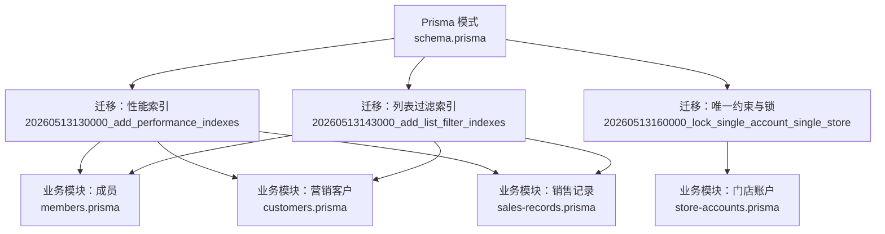
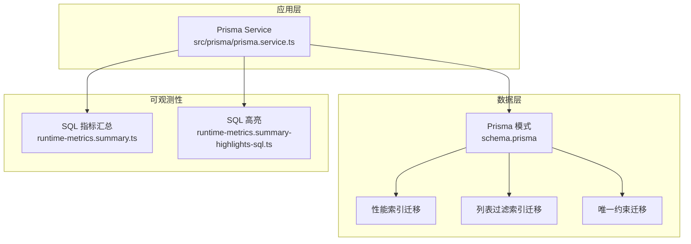
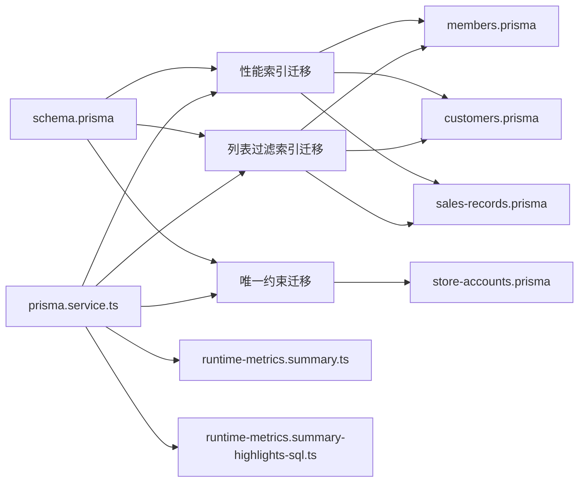

# 索引优化策略

<cite>
**本文引用的文件**
- [prisma/schema.prisma](file://prisma/schema.prisma)
- [prisma/migrations/20260513130000_add_performance_indexes/migration.sql](file://prisma/migrations/20260513130000_add_performance_indexes/migration.sql)
- [prisma/migrations/20260513143000_add_list_filter_indexes/migration.sql](file://prisma/migrations/20260513143000_add_list_filter_indexes/migration.sql)
- [prisma/migrations/20260513160000_lock_single_account_single_store/migration.sql](file://prisma/migrations/20260513160000_lock_single_account_single_store/migration.sql)
- [prisma/purely-profit/member/members.prisma](file://prisma/purely-profit/member/members.prisma)
- [prisma/purely-profit/marketing/customers.prisma](file://prisma/purely-profit/marketing/customers.prisma)
- [prisma/purely-profit/operations/sales-records.prisma](file://prisma/purely-profit/operations/sales-records.prisma)
- [prisma/purely-profit/stores/store-accounts.prisma](file://prisma/purely-profit/stores/store-accounts.prisma)
- [src/prisma/prisma.service.ts](file://src/prisma/prisma.service.ts)
- [src/observability/runtime-metrics.summary.ts](file://src/observability/runtime-metrics.summary.ts)
- [src/observability/runtime-metrics.summary-highlights-sql.ts](file://src/observability/runtime-metrics.summary-highlights-sql.ts)
</cite>

## 目录
1. [简介](#简介)
2. [项目结构](#项目结构)
3. [核心组件](#核心组件)
4. [架构总览](#架构总览)
5. [详细组件分析](#详细组件分析)
6. [依赖关系分析](#依赖关系分析)
7. [性能考量](#性能考量)
8. [故障排查指南](#故障排查指南)
9. [结论](#结论)
10. [附录](#附录)

## 简介
本文件面向 purelyprofit-server 的数据库索引优化，系统梳理性能索引、列表过滤索引与唯一性索引的设计策略与实现方式；阐述复合索引的创建原则、查询性能优化与存储空间权衡；说明唯一约束索引的目的、数据一致性与并发控制；并提供索引维护策略、定期重建计划与性能监控方法，辅以慢查询分析、索引使用统计与优化建议，最后总结最佳实践与常见陷阱。

## 项目结构
本项目的数据库模式由 Prisma Schema 统一定义，并通过迁移脚本逐步演进。索引优化相关的关键文件包括：
- 全局模式定义：schema.prisma
- 针对性能的索引迁移：add_performance_indexes
- 针对列表过滤的索引迁移：add_list_filter_indexes
- 唯一性约束与并发控制：lock_single_account_single_store
- 各业务模块的 Prisma 定义文件（用于定位字段与模型）
- 运行时可观测性指标（SQL 执行摘要与高亮）

图表来源
- [prisma/schema.prisma](file://prisma/schema.prisma)
- [prisma/migrations/20260513130000_add_performance_indexes/migration.sql](file://prisma/migrations/20260513130000_add_performance_indexes/migration.sql)
- [prisma/migrations/20260513143000_add_list_filter_indexes/migration.sql](file://prisma/migrations/20260513143000_add_list_filter_indexes/migration.sql)
- [prisma/migrations/20260513160000_lock_single_account_single_store/migration.sql](file://prisma/migrations/20260513160000_lock_single_account_single_store/migration.sql)
- [prisma/purely-profit/member/members.prisma](file://prisma/purely-profit/member/members.prisma)
- [prisma/purely-profit/marketing/customers.prisma](file://prisma/purely-profit/marketing/customers.prisma)
- [prisma/purely-profit/operations/sales-records.prisma](file://prisma/purely-profit/operations/sales-records.prisma)
- [prisma/purely-profit/stores/store-accounts.prisma](file://prisma/purely-profit/stores/store-accounts.prisma)

章节来源
- [prisma/schema.prisma](file://prisma/schema.prisma)
- [prisma/migrations/20260513130000_add_performance_indexes/migration.sql](file://prisma/migrations/20260513130000_add_performance_indexes/migration.sql)
- [prisma/migrations/20260513143000_add_list_filter_indexes/migration.sql](file://prisma/migrations/20260513143000_add_list_filter_indexes/migration.sql)
- [prisma/migrations/20260513160000_lock_single_account_single_store/migration.sql](file://prisma/migrations/20260513160000_lock_single_account_single_store/migration.sql)

## 核心组件
- 全局模式与索引策略：通过 Prisma Schema 统一声明字段类型、关系与索引，确保跨模块一致的索引设计。
- 性能索引迁移：聚焦高频查询路径，提升单表扫描与连接效率。
- 列表过滤索引迁移：针对分页、筛选与排序场景，优化列表类接口的响应时间。
- 唯一性约束与并发控制：通过唯一索引与外键约束，保障业务规则与数据一致性。
- 观测性与指标：运行时 SQL 指标与高亮，辅助定位慢查询与索引使用情况。

章节来源
- [prisma/schema.prisma](file://prisma/schema.prisma)
- [prisma/migrations/20260513130000_add_performance_indexes/migration.sql](file://prisma/migrations/20260513130000_add_performance_indexes/migration.sql)
- [prisma/migrations/20260513143000_add_list_filter_indexes/migration.sql](file://prisma/migrations/20260513143000_add_list_filter_indexes/migration.sql)
- [prisma/migrations/20260513160000_lock_single_account_single_store/migration.sql](file://prisma/migrations/20260513160000_lock_single_account_single_store/migration.sql)
- [src/observability/runtime-metrics.summary.ts](file://src/observability/runtime-metrics.summary.ts)
- [src/observability/runtime-metrics.summary-highlights-sql.ts](file://src/observability/runtime-metrics.summary-highlights-sql.ts)

## 架构总览
下图展示索引优化在整体系统中的位置与交互：Prisma Service 负责执行迁移与查询；Schema 定义索引策略；迁移脚本落地到数据库；运行时指标用于观测与优化。

图表来源
- [src/prisma/prisma.service.ts](file://src/prisma/prisma.service.ts)
- [prisma/schema.prisma](file://prisma/schema.prisma)
- [prisma/migrations/20260513130000_add_performance_indexes/migration.sql](file://prisma/migrations/20260513130000_add_performance_indexes/migration.sql)
- [prisma/migrations/20260513143000_add_list_filter_indexes/migration.sql](file://prisma/migrations/20260513143000_add_list_filter_indexes/migration.sql)
- [prisma/migrations/20260513160000_lock_single_account_single_store/migration.sql](file://prisma/migrations/20260513160000_lock_single_account_single_store/migration.sql)
- [src/observability/runtime-metrics.summary.ts](file://src/observability/runtime-metrics.summary.ts)
- [src/observability/runtime-metrics.summary-highlights-sql.ts](file://src/observability/runtime-metrics.summary-highlights-sql.ts)

## 详细组件分析

### 性能索引（add_performance_indexes）
目标：提升高频查询与连接的扫描效率，减少全表扫描与临时排序。
- 设计原则
  - 优先覆盖 WHERE、JOIN、ORDER BY 中的列组合，避免回表与额外排序。
  - 复合索引的列序遵循“等值条件优先、范围条件靠后”的原则。
  - 平衡写入成本与读取收益，避免过度索引导致 DML 抖动。
- 实施要点
  - 在销售记录、成员、营销客户等高频访问表上建立复合索引，覆盖常用过滤与排序字段。
  - 对于连接字段（如外键）建立单列索引，确保 JOIN 高效。
- 存储与性能权衡
  - 索引增大存储开销，需结合查询比例与数据增长趋势评估。
  - 定期分析索引选择性与使用率，淘汰低效或重复索引。

章节来源
- [prisma/migrations/20260513130000_add_performance_indexes/migration.sql](file://prisma/migrations/20260513130000_add_performance_indexes/migration.sql)
- [prisma/purely-profit/operations/sales-records.prisma](file://prisma/purely-profit/operations/sales-records.prisma)
- [prisma/purely-profit/member/members.prisma](file://prisma/purely-profit/member/members.prisma)
- [prisma/purely-profit/marketing/customers.prisma](file://prisma/purely-profit/marketing/customers.prisma)

### 列表过滤索引（add_list_filter_indexes）
目标：优化分页、筛选与排序场景，降低延迟与提高吞吐。
- 设计原则
  - 针对分页查询的排序列建立索引，避免“文件排序”。
  - 对筛选条件中出现频率高的列建立复合索引，提升过滤效率。
  - 结合业务查询模式，区分“精确匹配”和“模糊/范围查询”，采用不同索引策略。
- 实施要点
  - 在成员、营销客户、销售记录等列表接口频繁使用的字段上建立索引。
  - 使用覆盖索引减少回表，提升只读查询性能。
- 存储与性能权衡
  - 列表查询通常读多写少，可适当放宽写入成本，换取更高的查询性能。
  - 定期评估分页深度与查询分布，动态调整索引组合。

章节来源
- [prisma/migrations/20260513143000_add_list_filter_indexes/migration.sql](file://prisma/migrations/20260513143000_add_list_filter_indexes/migration.sql)
- [prisma/purely-profit/member/members.prisma](file://prisma/purely-profit/member/members.prisma)
- [prisma/purely-profit/marketing/customers.prisma](file://prisma/purely-profit/marketing/customers.prisma)
- [prisma/purely-profit/operations/sales-records.prisma](file://prisma/purely-profit/operations/sales-records.prisma)

### 唯一性索引与并发控制（lock_single_account_single_store）
目标：通过唯一约束保证业务规则（如一个账户仅绑定一个门店），并借助数据库并发控制保障一致性。
- 设计目的
  - 数据一致性：唯一索引防止重复绑定，确保业务规则强制执行。
  - 并发控制：数据库层面的唯一约束与锁机制，避免竞态条件。
- 实现方式
  - 在账户与门店关联字段上建立唯一索引，迁移脚本中明确约束。
  - 对写操作进行事务化处理，失败时利用数据库回滚保证原子性。
- 影响与注意事项
  - 写入时增加唯一性检查成本，但显著降低业务层校验复杂度。
  - 需要妥善处理唯一约束冲突的错误码与用户提示。

章节来源
- [prisma/migrations/20260513160000_lock_single_account_single_store/migration.sql](file://prisma/migrations/20260513160000_lock_single_account_single_store/migration.sql)
- [prisma/purely-profit/stores/store-accounts.prisma](file://prisma/purely-profit/stores/store-accounts.prisma)

### 复合索引创建原则与查询优化
- 创建原则
  - 列序：等值条件优先，范围/排序条件靠后；最左前缀匹配生效。
  - 选择性：高选择性的列优先；对低选择性列组合需谨慎。
  - 查询覆盖：尽量使用覆盖索引，减少回表。
- 查询性能优化
  - EXPLAIN/ANALYZE 分析执行计划，识别索引未命中与回表。
  - 避免在索引列上使用函数或隐式转换，防止索引失效。
- 存储空间权衡
  - 索引数量与宽度直接影响存储与写入放大；应按查询模式迭代优化。

章节来源
- [prisma/schema.prisma](file://prisma/schema.prisma)
- [prisma/migrations/20260513130000_add_performance_indexes/migration.sql](file://prisma/migrations/20260513130000_add_performance_indexes/migration.sql)
- [prisma/migrations/20260513143000_add_list_filter_indexes/migration.sql](file://prisma/migrations/20260513143000_add_list_filter_indexes/migration.sql)

### 唯一约束索引的数据一致性与并发控制
- 数据一致性
  - 唯一索引强制业务规则，避免脏数据进入系统。
  - 与外键约束配合，确保引用完整性。
- 并发控制
  - 数据库在插入/更新时进行唯一性检查与锁竞争，保证原子性。
  - 应用层需正确处理唯一约束冲突，避免死锁与重试风暴。

章节来源
- [prisma/migrations/20260513160000_lock_single_account_single_store/migration.sql](file://prisma/migrations/20260513160000_lock_single_account_single_store/migration.sql)

### 索引维护策略与定期重建
- 维护策略
  - 定期分析索引使用率与碎片率，清理长期未使用的索引。
  - 对高选择性且查询稳定的列，考虑合并或拆分复合索引。
- 重建计划
  - 建议在业务低峰期执行索引重建，减少对在线服务的影响。
  - 结合数据分布变化与查询模式演进，滚动式优化索引组合。
- 监控与告警
  - 基于运行时 SQL 指标，识别异常慢查询与索引缺失。
  - 设置阈值告警，触发人工复核与索引优化。

章节来源
- [src/observability/runtime-metrics.summary.ts](file://src/observability/runtime-metrics.summary.ts)
- [src/observability/runtime-metrics.summary-highlights-sql.ts](file://src/observability/runtime-metrics.summary-highlights-sql.ts)

### 慢查询分析与索引使用统计
- 慢查询分析
  - 通过运行时 SQL 高亮定位慢查询，结合执行计划判断是否缺索引或索引失效。
  - 对热点接口进行压测与回归测试，验证索引优化效果。
- 索引使用统计
  - 基于运行时指标统计各索引的命中率与扫描次数，指导索引取舍。
  - 关注新增索引带来的写入放大与存储占用。

章节来源
- [src/observability/runtime-metrics.summary.ts](file://src/observability/runtime-metrics.summary.ts)
- [src/observability/runtime-metrics.summary-highlights-sql.ts](file://src/observability/runtime-metrics.summary-highlights-sql.ts)

### 优化建议
- 以查询驱动索引设计：先分析查询模式，再设计索引组合。
- 控制索引数量：避免为个别边缘查询建立专用索引，优先优化主流路径。
- 与迁移流程集成：索引变更纳入版本化迁移，确保环境一致性。
- 持续演进：根据业务增长与查询分布变化，定期复盘与重构索引。

## 依赖关系分析
索引优化涉及模式定义、迁移脚本与运行时观测的协同：

图表来源
- [prisma/schema.prisma](file://prisma/schema.prisma)
- [prisma/migrations/20260513130000_add_performance_indexes/migration.sql](file://prisma/migrations/20260513130000_add_performance_indexes/migration.sql)
- [prisma/migrations/20260513143000_add_list_filter_indexes/migration.sql](file://prisma/migrations/20260513143000_add_list_filter_indexes/migration.sql)
- [prisma/migrations/20260513160000_lock_single_account_single_store/migration.sql](file://prisma/migrations/20260513160000_lock_single_account_single_store/migration.sql)
- [prisma/purely-profit/member/members.prisma](file://prisma/purely-profit/member/members.prisma)
- [prisma/purely-profit/marketing/customers.prisma](file://prisma/purely-profit/marketing/customers.prisma)
- [prisma/purely-profit/operations/sales-records.prisma](file://prisma/purely-profit/operations/sales-records.prisma)
- [prisma/purely-profit/stores/store-accounts.prisma](file://prisma/purely-profit/stores/store-accounts.prisma)
- [src/prisma/prisma.service.ts](file://src/prisma/prisma.service.ts)
- [src/observability/runtime-metrics.summary.ts](file://src/observability/runtime-metrics.summary.ts)
- [src/observability/runtime-metrics.summary-highlights-sql.ts](file://src/observability/runtime-metrics.summary-highlights-sql.ts)

章节来源
- [prisma/schema.prisma](file://prisma/schema.prisma)
- [prisma/migrations/20260513130000_add_performance_indexes/migration.sql](file://prisma/migrations/20260513130000_add_performance_indexes/migration.sql)
- [prisma/migrations/20260513143000_add_list_filter_indexes/migration.sql](file://prisma/migrations/20260513143000_add_list_filter_indexes/migration.sql)
- [prisma/migrations/20260513160000_lock_single_account_single_store/migration.sql](file://prisma/migrations/20260513160000_lock_single_account_single_store/migration.sql)
- [src/prisma/prisma.service.ts](file://src/prisma/prisma.service.ts)
- [src/observability/runtime-metrics.summary.ts](file://src/observability/runtime-metrics.summary.ts)
- [src/observability/runtime-metrics.summary-highlights-sql.ts](file://src/observability/runtime-metrics.summary-highlights-sql.ts)

## 性能考量
- 写入放大：索引越多，INSERT/UPDATE/DELETE 成本越高，需结合业务读写比例权衡。
- 存储成本：索引大小与表大小成正比，需关注磁盘与内存压力。
- 查询优化：优先覆盖高频查询路径，避免为冷门查询建立专用索引。
- 版本化管理：索引变更纳入迁移与发布流程，确保多环境一致性。

## 故障排查指南
- 慢查询定位
  - 使用运行时 SQL 高亮识别慢查询，结合执行计划判断索引使用情况。
  - 对热点接口进行压测，验证索引优化前后差异。
- 索引缺失
  - 若出现全表扫描或排序，检查是否存在最左前缀匹配的复合索引。
  - 对函数或表达式列的过滤，考虑添加生成列并建立索引。
- 唯一约束冲突
  - 正确捕获并处理唯一约束冲突，避免重复提交与死锁。
  - 在业务层做好预检与幂等处理，降低冲突概率。

章节来源
- [src/observability/runtime-metrics.summary-highlights-sql.ts](file://src/observability/runtime-metrics.summary-highlights-sql.ts)
- [prisma/migrations/20260513160000_lock_single_account_single_store/migration.sql](file://prisma/migrations/20260513160000_lock_single_account_single_store/migration.sql)

## 结论
索引优化是一项持续演进的工作，需要以查询模式为依据，结合存储与写入成本进行平衡。通过迁移脚本固化索引策略，配合运行时指标进行监控与复盘，可有效提升系统整体性能与稳定性。同时，唯一性索引与并发控制是保障数据一致性的重要手段，应与业务规则紧密结合。

## 附录
- 最佳实践
  - 以查询驱动索引设计，优先覆盖高频路径。
  - 控制索引数量与宽度，避免过度索引。
  - 将索引变更纳入版本化迁移，确保一致性。
  - 定期评估与重建，保持索引健康。
- 常见陷阱
  - 为边缘查询建立专用索引，导致写入成本过高。
  - 忽视索引失效场景（函数、隐式转换），造成性能回退。
  - 忽略唯一约束冲突处理，引发业务异常与用户体验下降。