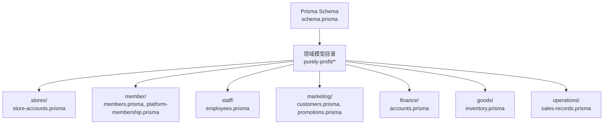
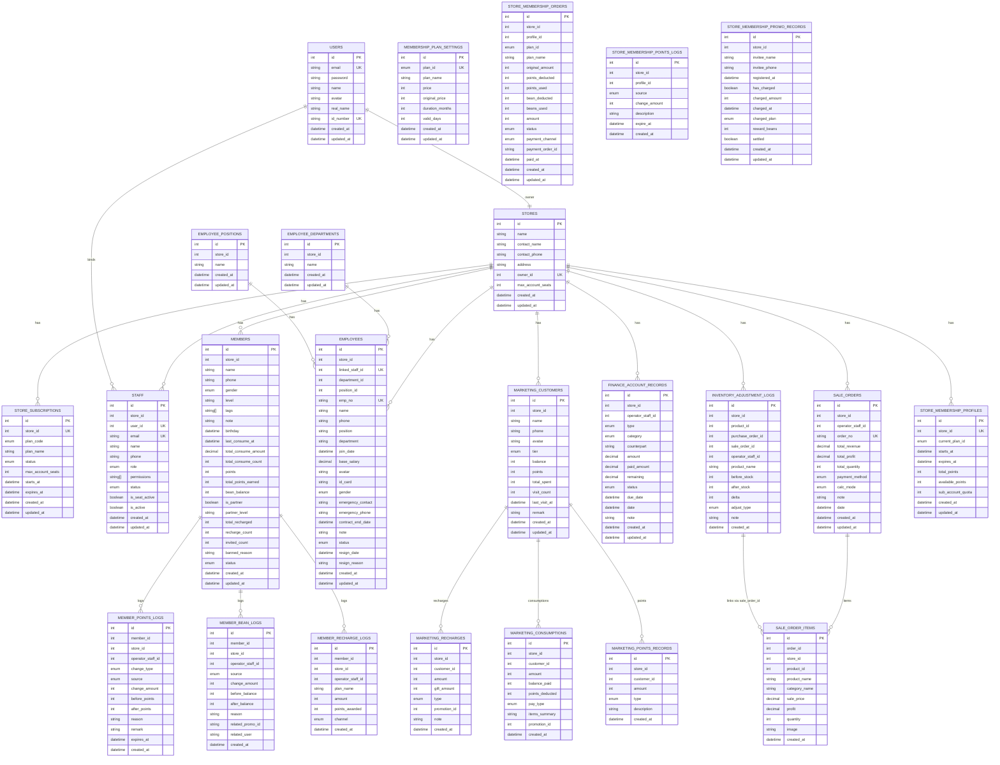
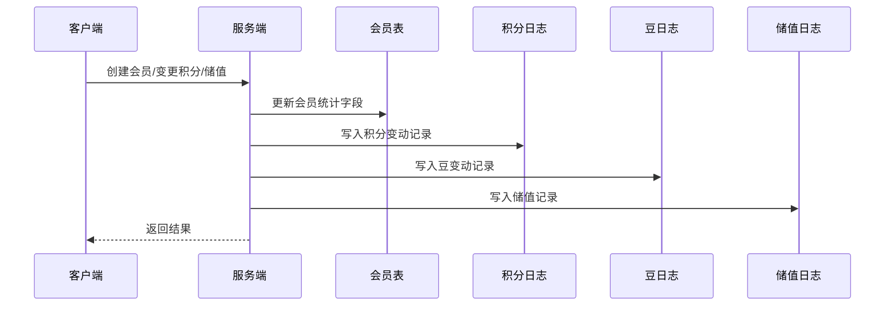
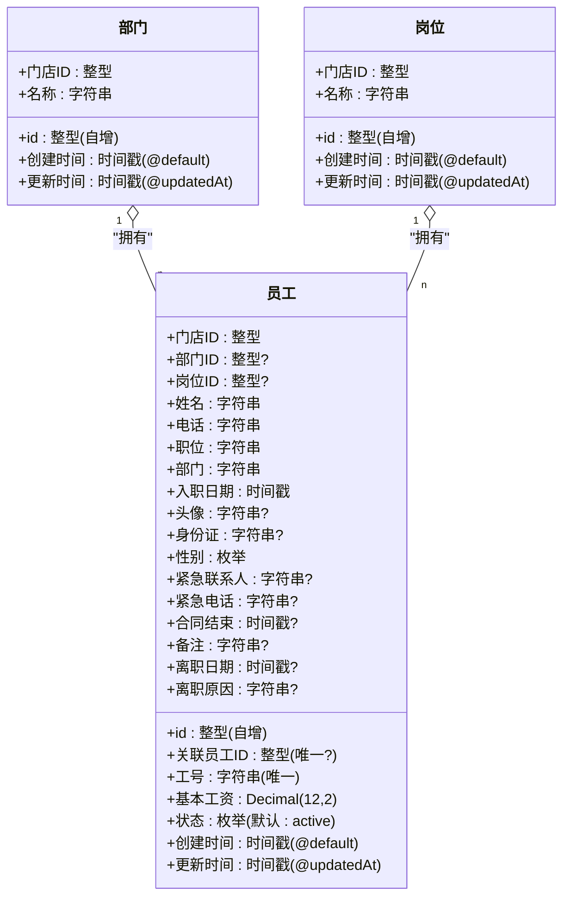
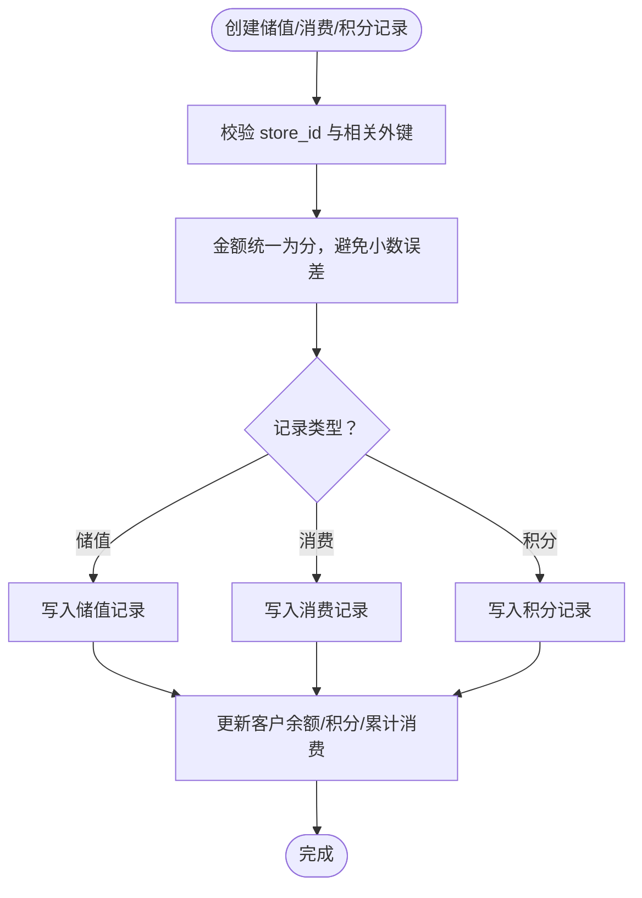
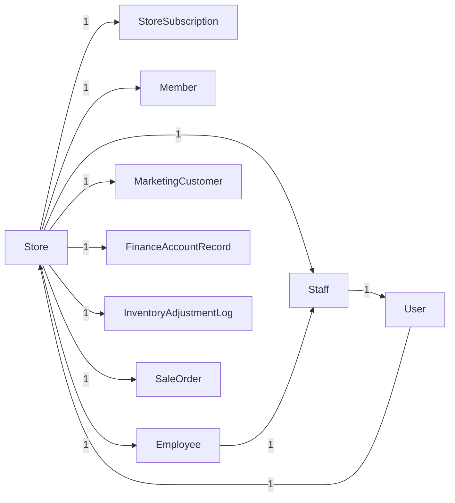

# 表结构设计

<cite>
**本文引用的文件**
- [schema.prisma](file://prisma/schema.prisma)
- [store-accounts.prisma](file://prisma/purely-profit/stores/store-accounts.prisma)
- [members.prisma](file://prisma/purely-profit/member/members.prisma)
- [employees.prisma](file://prisma/purely-profit/staff/employees.prisma)
- [customers.prisma](file://prisma/purely-profit/marketing/customers.prisma)
- [accounts.prisma](file://prisma/purely-profit/finance/accounts.prisma)
- [inventory.prisma](file://prisma/purely-profit/goods/inventory.prisma)
- [sales-records.prisma](file://prisma/purely-profit/operations/sales-records.prisma)
- [promotions.prisma](file://prisma/purely-profit/marketing/promotions.prisma)
- [platform-membership.prisma](file://prisma/purely-profit/member/platform-membership.prisma)
</cite>

## 目录
1. [简介](#简介)
2. [项目结构](#项目结构)
3. [核心组件](#核心组件)
4. [架构总览](#架构总览)
5. [详细组件分析](#详细组件分析)
6. [依赖分析](#依赖分析)
7. [性能考量](#性能考量)
8. [故障排查指南](#故障排查指南)
9. [结论](#结论)
10. [附录](#附录)

## 简介
本文件系统化梳理 purelyprofit-server 的数据库表结构设计，基于 Prisma 模式文件与迁移脚本，逐表说明字段定义、数据类型、约束条件、索引策略与业务含义，并给出时间戳管理、软删除与审计跟踪的设计建议。文档面向开发者与数据工程师，兼顾可读性与落地实践。

## 项目结构
- 数据库定义采用 Prisma Schema，统一在顶层 schema.prisma 中声明 provider 为 PostgreSQL，并通过 generator 生成客户端。
- 业务模型按“领域”拆分至 purely-profit 子目录，便于模块化维护与演进。
- 迁移文件以时间序号命名，记录了从初始表到当前版本的完整演进过程，是理解字段演进与索引添加的重要依据。



**图表来源**
- [schema.prisma:1-13](file://prisma/schema.prisma#L1-L13)
- [store-accounts.prisma:1-166](file://prisma/purely-profit/stores/store-accounts.prisma#L1-L166)
- [members.prisma:1-147](file://prisma/purely-profit/member/members.prisma#L1-L147)
- [employees.prisma:1-197](file://prisma/purely-profit/staff/employees.prisma#L1-L197)
- [customers.prisma:1-146](file://prisma/purely-profit/marketing/customers.prisma#L1-L146)
- [accounts.prisma:1-49](file://prisma/purely-profit/finance/accounts.prisma#L1-L49)
- [inventory.prisma:1-37](file://prisma/purely-profit/goods/inventory.prisma#L1-L37)
- [sales-records.prisma:1-68](file://prisma/purely-profit/operations/sales-records.prisma#L1-L68)
- [promotions.prisma:1-44](file://prisma/purely-profit/marketing/promotions.prisma#L1-L44)
- [platform-membership.prisma:1-127](file://prisma/purely-profit/member/platform-membership.prisma#L1-L127)

**章节来源**
- [schema.prisma:1-13](file://prisma/schema.prisma#L1-L13)

## 核心组件
- 数据库提供方：PostgreSQL
- 客户端生成器：prisma-client-js
- 领域划分：门店与账户、会员、员工、营销、财务、库存、销售、平台会员等

**章节来源**
- [schema.prisma:4-10](file://prisma/schema.prisma#L4-L10)

## 架构总览
下图展示核心实体之间的关系与外键约束方向，帮助理解跨模块的数据流向与一致性要求。



**图表来源**
- [store-accounts.prisma:28-166](file://prisma/purely-profit/stores/store-accounts.prisma#L28-L166)
- [members.prisma:40-147](file://prisma/purely-profit/member/members.prisma#L40-L147)
- [employees.prisma:36-197](file://prisma/purely-profit/staff/employees.prisma#L36-L197)
- [customers.prisma:31-146](file://prisma/purely-profit/marketing/customers.prisma#L31-L146)
- [accounts.prisma:24-49](file://prisma/purely-profit/finance/accounts.prisma#L24-L49)
- [inventory.prisma:10-37](file://prisma/purely-profit/goods/inventory.prisma#L10-L37)
- [sales-records.prisma:15-68](file://prisma/purely-profit/operations/sales-records.prisma#L15-L68)
- [platform-membership.prisma:28-127](file://prisma/purely-profit/member/platform-membership.prisma#L28-L127)

## 详细组件分析

### 用户与门店、订阅与工位
- 主键：自增整型
- 唯一性：邮箱、身份证、用户绑定的门店 owner、员工工号、订单号、计划设置标识
- 非空与默认值：大量字段使用默认值或非空约束；时间戳通过 @default(now()) 与 @updatedAt 统一管理
- 约束与枚举：角色、状态、订阅状态、计划代码等
- 索引：多处复合索引用于查询优化（如 staff 的多维过滤）

```mermaid
classDiagram
class 用户 {
+id : 整型(自增)
+email : 字符串(唯一)
+密码 : 字符串
+姓名 : 字符串?
+头像 : 字符串?
+真实姓名 : 字符串?
+身份证号 : 字符串?(唯一)
+创建时间 : 时间戳(@default)
+更新时间 : 时间戳(@updatedAt)
}
class 门店 {
+id : 整型(自增)
+名称 : 字符串
+联系人 : 字符串?
+联系电话 : 字符串?
+地址 : 字符串?
+所有者ID : 整型(唯一)
+最大工位数 : 整型(默认1)
+创建时间 : 时间戳(@default)
+更新时间 : 时间戳(@updatedAt)
}
class 门店订阅 {
+id : 整型(自增)
+门店ID : 整型(唯一)
+计划代码 : 枚举
+计划名称 : 字符串
+状态 : 枚举(默认 : ACTIVE)
+最大工位数 : 整型
+开始时间 : 时间戳(@default)
+到期时间 : 时间戳?
+创建时间 : 时间戳(@default)
+更新时间 : 时间戳(@updatedAt)
}
class 工作人员 {
+id : 整型(自增)
+门店ID : 整型
+用户ID : 整型(唯一?)
+邮箱 : 字符串(唯一)
+姓名 : 字符串
+电话 : 字符串?
+角色 : 枚举(默认 : STAFF)
+权限 : 字符串数组(默认[])
+状态 : 枚举(默认 : INVITED)
+工位激活 : 布尔(默认 : false)
+是否启用 : 布尔(默认 : true)
+创建时间 : 时间戳(@default)
+更新时间 : 时间戳(@updatedAt)
}
门店 "1" o-- "n" 门店订阅 : "拥有"
门店 "1" o-- "n" 工作人员 : "拥有"
用户 "1" ||--|| 门店 : "所有者"
```

**图表来源**
- [store-accounts.prisma:28-166](file://prisma/purely-profit/stores/store-accounts.prisma#L28-L166)

**章节来源**
- [store-accounts.prisma:28-166](file://prisma/purely-profit/stores/store-accounts.prisma#L28-L166)

### 会员与积分/豆/储值流水
- 业务字段命名：采用 snake_case，映射到数据库列名（如 real_name、id_number、last_consume_at 等）
- 数值精度：Decimal(12,2) 保证金额类字段的高精度存储
- 唯一性：手机号+门店组合唯一，防止重复
- 流水日志：积分、豆、储值分别有独立日志表，支持按成员、门店、操作员、来源、时间维度检索
- 索引：多维索引覆盖常见查询场景（如按成员/门店/时间/状态/等级/是否合伙人）



**图表来源**
- [members.prisma:40-147](file://prisma/purely-profit/member/members.prisma#L40-L147)

**章节来源**
- [members.prisma:40-147](file://prisma/purely-profit/member/members.prisma#L40-L147)

### 员工档案、部门与岗位、排班与薪资
- 唯一性：员工工号+门店唯一，避免重复
- 关系：员工与部门、岗位为多对一；与工作人员一对一关联
- 排班与请假：按日期与员工维度建立索引，便于排班查询
- 薪资：月度结算，带草稿/确认状态，支持扣款与奖金明细



**图表来源**
- [employees.prisma:36-197](file://prisma/purely-profit/staff/employees.prisma#L36-L197)

**章节来源**
- [employees.prisma:36-197](file://prisma/purely-profit/staff/employees.prisma#L36-L197)

### 营销客户、储值、消费与积分记录
- 客户等级：根据累计消费实时计算，支持按等级与最近访问时间筛选
- 储值与消费：金额单位为“分”，便于精确计算与避免浮点误差
- 积分记录：支持获得、消费、过期、赠送等类型，便于审计与核对



**图表来源**
- [customers.prisma:31-146](file://prisma/purely-profit/marketing/customers.prisma#L31-L146)

**章节来源**
- [customers.prisma:31-146](file://prisma/purely-profit/marketing/customers.prisma#L31-L146)

### 财务往来账
- 账目类型：应收/应付
- 状态：待处理/部分/已结清/逾期
- 分类：销售信用/预付款/供应商欠款/贷款/押金/其他
- 索引：按状态、类型、到期日、经办人等维度建立索引，支撑对账与催收

**章节来源**
- [accounts.prisma:24-49](file://prisma/purely-profit/finance/accounts.prisma#L24-L49)

### 库存调整日志
- 调整类型：补货/损耗/手工/销售
- 关联：可关联采购单或销售单，便于追踪
- 索引：按门店、产品、单据、经办人、时间建立索引，支撑出入库与盘点

**章节来源**
- [inventory.prisma:10-37](file://prisma/purely-profit/goods/inventory.prisma#L10-L37)

### 销售订单与订单项
- 订单号：全局唯一，便于外部系统对账
- 计价模式：利润口径/业务口径二选一
- 索引：按日期、经办人、产品类别等维度建立索引，支撑销售分析

**章节来源**
- [sales-records.prisma:15-68](file://prisma/purely-profit/operations/sales-records.prisma#L15-L68)

### 平台会员权益与门店会员中心
- 计划设置：按周期（月/季/年/终身）设定价格与有效期
- 门店会员档案：记录当前计划、生效/到期时间、可用积分与子账号额度
- 订单与积分流水：支持按门店、状态、创建时间等维度检索
- 推广记录：邀请注册与首充奖励链路清晰，支持结算标记

**章节来源**
- [platform-membership.prisma:28-127](file://prisma/purely-profit/member/platform-membership.prisma#L28-L127)

## 依赖分析
- 外键关系：多数实体通过 store_id 与 Store 关联，形成强一致的租户隔离
- 一对多/一对一：用户与门店（1:1），门店与员工/会员/订阅（1:n）
- 多对多：通过中间表（如员工与部门/岗位）实现灵活组织
- 约束与枚举：统一使用 Prisma 枚举类型，减少数据不一致风险



**图表来源**
- [store-accounts.prisma:28-166](file://prisma/purely-profit/stores/store-accounts.prisma#L28-L166)
- [employees.prisma:64-106](file://prisma/purely-profit/staff/employees.prisma#L64-L106)
- [customers.prisma:31-66](file://prisma/purely-profit/marketing/customers.prisma#L31-L66)
- [accounts.prisma:24-49](file://prisma/purely-profit/finance/accounts.prisma#L24-L49)
- [inventory.prisma:10-37](file://prisma/purely-profit/goods/inventory.prisma#L10-L37)
- [sales-records.prisma:15-40](file://prisma/purely-profit/operations/sales-records.prisma#L15-L40)

## 性能考量
- 索引设计原则
  - 单列索引：常用于唯一性（如 email、id_number）、过滤（如 status、level、phone）
  - 复合索引：按查询最频繁的前缀列构建（如 staff 的 (storeId, status, isSeatActive, isActive)、(storeId, status, role, updatedAt)）
  - 时间维度：大量按 createdAt/date 查询，需确保索引覆盖
- 数值精度
  - 金额统一使用 Decimal(12,2)，避免浮点误差
- 分页与扫描
  - 对高频列表接口（如会员、员工、订单）建议结合复合索引与游标分页
- 写入热点
  - 日志类表（积分/豆/储值/流水）写多读少，建议批量写入与异步归档策略

## 故障排查指南
- 唯一约束冲突
  - 现象：插入失败，提示违反唯一约束
  - 排查：检查 email/id_number/phone/工号/订单号等唯一字段是否重复
- 外键约束失败
  - 现象：删除/更新失败，提示外键约束
  - 排查：确认关联实体是否已被删除或状态不满足级联规则
- 索引缺失导致慢查询
  - 现象：列表/筛选接口响应慢
  - 排查：确认 WHERE/HAVING 条件中的列是否命中现有索引
- 时间戳异常
  - 现象：createdAt/updatedAt 未更新
  - 排查：确认 Prisma 模型中是否正确标注 @default(now())/@updatedAt

## 结论
该数据库设计以租户隔离为核心，围绕门店、员工、会员、营销、财务、库存与销售等模块构建，通过枚举与严格的数据类型保障一致性，配合多维索引提升查询性能。建议在后续迭代中持续关注查询模式与热点数据，动态优化索引与分页策略，并完善审计与监控体系。

## 附录
- 字段命名规范
  - 使用 snake_case，Prisma 通过 @map 映射到数据库列名
  - 业务语义明确，避免缩写
- 数据类型选择
  - 金额类使用 Decimal(12,2)
  - 时间类使用 DateTime
  - 枚举类统一使用 Prisma 枚举
- 约束与索引清单
  - 唯一性：email、id_number、user_id、phone、工号、订单号、计划设置标识
  - 复合索引：staff、members、employees、marketing、finance、inventory、sales、membership 等模块均有针对性索引
- 时间戳与审计
  - 统一使用 @default(now()) 与 @updatedAt 管理创建与更新时间
  - 日志表保留完整审计轨迹，便于回溯与对账