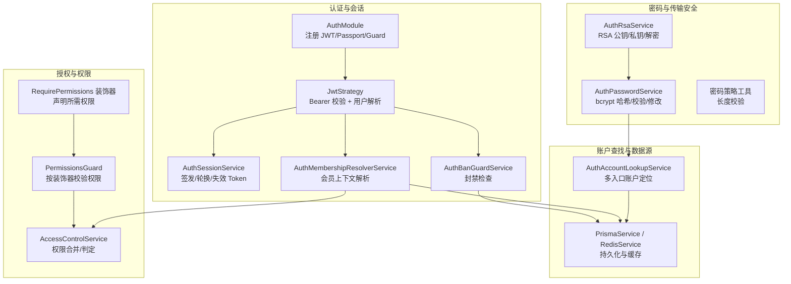
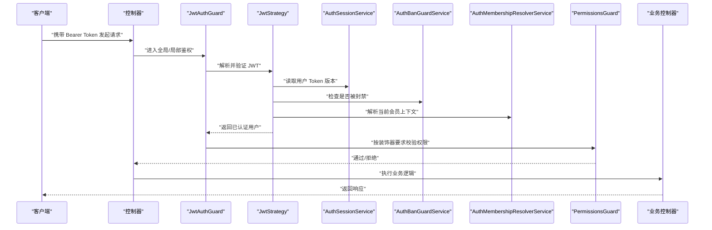
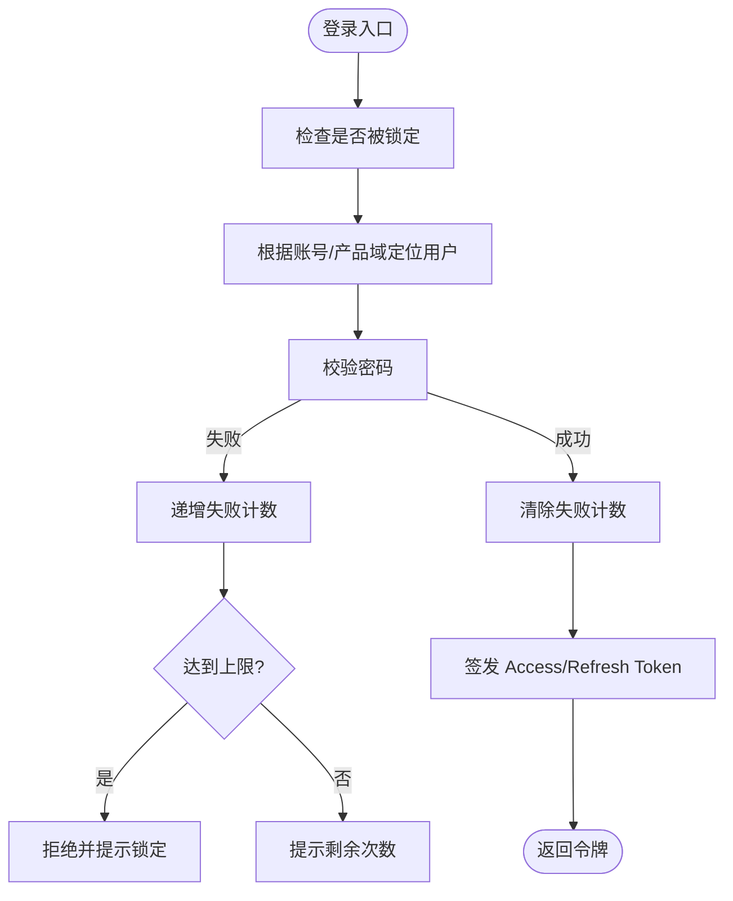
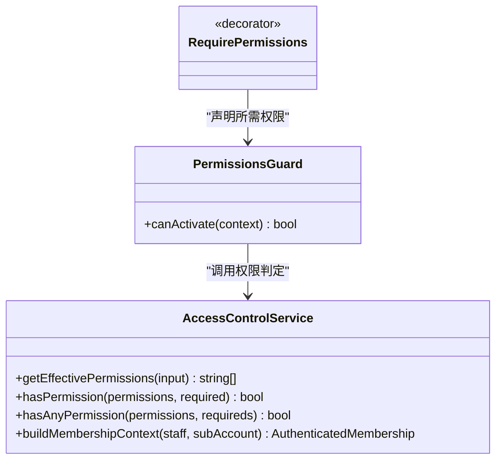
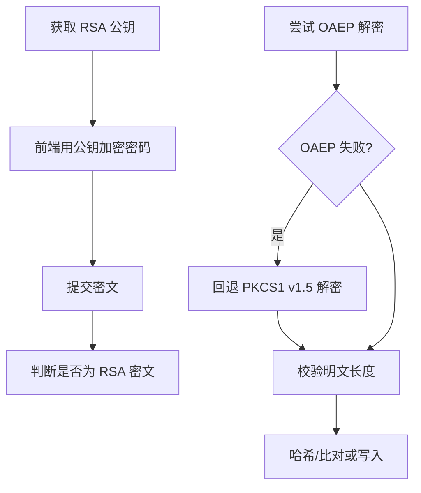
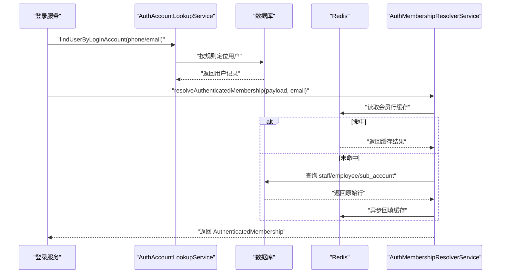
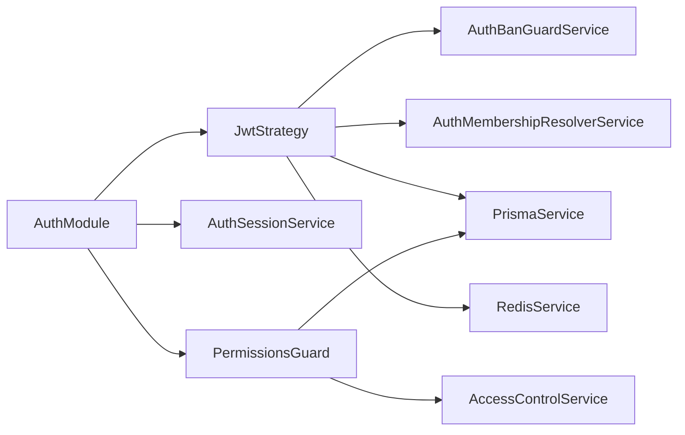

# 安全架构

<cite>
**本文引用的文件**   
- [auth.module.ts](file://src/purely-profit/auth/auth.module.ts)
- [jwt.strategy.ts](file://src/purely-profit/auth/strategies/jwt.strategy.ts)
- [auth-session.service.ts](file://src/purely-profit/auth/auth-session.service.ts)
- [auth-authentication.service.ts](file://src/purely-profit/auth/auth-authentication.service.ts)
- [auth-account-lookup.service.ts](file://src/purely-profit/auth/auth-account-lookup.service.ts)
- [auth-password.service.ts](file://src/purely-profit/auth/auth-password.service.ts)
- [auth-ban-guard.service.ts](file://src/purely-profit/auth/auth-ban-guard.service.ts)
- [auth-membership-resolver.service.ts](file://src/purely-profit/auth/auth-membership-resolver.service.ts)
- [access-control.service.ts](file://src/purely-profit/access-control/access-control.service.ts)
- [permissions.guard.ts](file://src/purely-profit/access-control/guards/permissions.guard.ts)
- [require-permissions.decorator.ts](file://src/purely-profit/access-control/decorators/require-permissions.decorator.ts)
- [auth-rsa.service.ts](file://src/purely-profit/auth/auth-rsa.service.ts)
- [password-policy.utils.ts](file://src/shared/password-policy.utils.ts)
- [public-key-response.dto.ts](file://src/purely-profit/auth/dto/public-key-response.dto.ts)
</cite>

## 目录
1. [简介](#简介)
2. [项目结构](#项目结构)
3. [核心组件](#核心组件)
4. [架构总览](#架构总览)
5. [详细组件分析](#详细组件分析)
6. [依赖关系分析](#依赖关系分析)
7. [性能与安全特性](#性能与安全特性)
8. [故障排查指南](#故障排查指南)
9. [结论](#结论)

## 简介
本文件聚焦于系统的安全架构，围绕认证、授权、会话与令牌管理、密码与敏感数据传输安全、封禁策略、权限模型与缓存一致性等关键维度进行系统化说明。目标是帮助读者快速理解并掌握系统在身份与访问控制方面的设计要点、实现路径与最佳实践。

## 项目结构
安全相关能力主要分布在以下模块：
- 认证与会话：登录流程、JWT 签发与校验、刷新令牌、版本失效、封禁检查、会员上下文解析
- 授权与权限：基于角色与子账号的权限计算、守卫与装饰器驱动的细粒度访问控制
- 密码与传输安全：RSA 公钥分发与解密、bcrypt 哈希存储、密码长度策略
- 缓存与一致性：用户资料、会员行、关联门店等缓存键设计与失效策略

图表来源
- [auth.module.ts:1-88](file://src/purely-profit/auth/auth.module.ts#L1-L88)
- [jwt.strategy.ts:1-204](file://src/purely-profit/auth/strategies/jwt.strategy.ts#L1-L204)
- [auth-session.service.ts:1-195](file://src/purely-profit/auth/auth-session.service.ts#L1-L195)
- [auth-ban-guard.service.ts:1-104](file://src/purely-profit/auth/auth-ban-guard.service.ts#L1-L104)
- [auth-membership-resolver.service.ts:1-351](file://src/purely-profit/auth/auth-membership-resolver.service.ts#L1-L351)
- [access-control.service.ts:1-243](file://src/purely-profit/access-control/access-control.service.ts#L1-L243)
- [permissions.guard.ts:1-103](file://src/purely-profit/access-control/guards/permissions.guard.ts#L1-L103)
- [require-permissions.decorator.ts:1-11](file://src/purely-profit/access-control/decorators/require-permissions.decorator.ts#L1-L11)
- [auth-rsa.service.ts:1-165](file://src/purely-profit/auth/auth-rsa.service.ts#L1-L165)
- [auth-password.service.ts:1-165](file://src/purely-profit/auth/auth-password.service.ts#L1-L165)
- [auth-account-lookup.service.ts:1-528](file://src/purely-profit/auth/auth-account-lookup.service.ts#L1-L528)

章节来源
- [auth.module.ts:1-88](file://src/purely-profit/auth/auth.module.ts#L1-L88)

## 核心组件
- 认证入口与编排
  - AuthModule 统一装配 Passport/JWT、各类 Guard 与服务，对外暴露认证与鉴权能力。
- 登录与令牌
  - AuthAuthenticationService 负责登录主链路（失败计数、锁定、审计）。
  - AuthSessionService 负责 Access/Refresh Token 签发、轮换、批量失效与版本控制。
- 请求级鉴权
  - JwtStrategy 在每次请求中验证 JWT、检查会话版本、封禁状态，并解析当前会员上下文。
  - PermissionsGuard 结合 RequirePermissions 装饰器执行资源级权限判定。
- 权限模型
  - AccessControlService 提供角色默认权限、子账号权限叠加、通配符匹配与有效权限计算。
- 密码与传输安全
  - AuthRsaService 提供 RSA 密钥对管理与 OAEP/PKCS1 v1.5 兼容解密。
  - AuthPasswordService 使用 bcrypt 进行密码哈希、校验与更新。
  - 密码策略工具确保明文长度合规。
- 账户定位与缓存
  - AuthAccountLookupService 支持手机号/邮箱/微信等多入口定位用户，并对用户缓存进行失效。
  - AuthMembershipResolverService 解析并缓存会员行，构建最终权限上下文。

章节来源
- [auth.module.ts:1-88](file://src/purely-profit/auth/auth.module.ts#L1-L88)
- [auth-authentication.service.ts:49-165](file://src/purely-profit/auth/auth-authentication.service.ts#L49-L165)
- [auth-session.service.ts:1-195](file://src/purely-profit/auth/auth-session.service.ts#L1-L195)
- [jwt.strategy.ts:1-204](file://src/purely-profit/auth/strategies/jwt.strategy.ts#L1-L204)
- [permissions.guard.ts:1-103](file://src/purely-profit/access-control/guards/permissions.guard.ts#L1-L103)
- [access-control.service.ts:1-243](file://src/purely-profit/access-control/access-control.service.ts#L1-L243)
- [auth-rsa.service.ts:1-165](file://src/purely-profit/auth/auth-rsa.service.ts#L1-L165)
- [auth-password.service.ts:1-165](file://src/purely-profit/auth/auth-password.service.ts#L1-L165)
- [password-policy.utils.ts:1-39](file://src/shared/password-policy.utils.ts#L1-L39)
- [auth-account-lookup.service.ts:1-528](file://src/purely-profit/auth/auth-account-lookup.service.ts#L1-L528)
- [auth-membership-resolver.service.ts:1-351](file://src/purely-profit/auth/auth-membership-resolver.service.ts#L1-L351)

## 架构总览
下图展示一次受保护接口的端到端安全处理流程，涵盖认证、会话版本、封禁、会员上下文与权限判定。

图表来源
- [jwt.strategy.ts:93-153](file://src/purely-profit/auth/strategies/jwt.strategy.ts#L93-L153)
- [auth-session.service.ts:129-144](file://src/purely-profit/auth/auth-session.service.ts#L129-L144)
- [auth-ban-guard.service.ts:25-45](file://src/purely-profit/auth/auth-ban-guard.service.ts#L25-L45)
- [auth-membership-resolver.service.ts:77-94](file://src/purely-profit/auth/auth-membership-resolver.service.ts#L77-L94)
- [permissions.guard.ts:24-77](file://src/purely-profit/access-control/guards/permissions.guard.ts#L24-L77)

## 详细组件分析

### 认证与会话
- 登录主链路
  - 输入校验、失败次数累计与临时锁定、成功后的审计日志记录。
- 令牌签发与轮换
  - Access Token 包含最小必要载荷与 sessionVersion；Refresh Token 以哈希形式存 Redis，一次性消费后轮换。
- 会话版本与强制下线
  - 通过 token version 比较实现“旧令牌失效”；密码变更或管理员操作可提升版本。
- 封禁检查
  - 按门店维度聚合封禁原因，全部封禁则拒绝访问；关联门店集合带缓存。

图表来源
- [auth-authentication.service.ts:123-165](file://src/purely-profit/auth/auth-authentication.service.ts#L123-L165)
- [auth-session.service.ts:55-107](file://src/purely-profit/auth/auth-session.service.ts#L55-L107)
- [auth-session.service.ts:114-127](file://src/purely-profit/auth/auth-session.service.ts#L114-L127)
- [auth-ban-guard.service.ts:25-45](file://src/purely-profit/auth/auth-ban-guard.service.ts#L25-L45)

章节来源
- [auth-authentication.service.ts:49-165](file://src/purely-profit/auth/auth-authentication.service.ts#L49-L165)
- [auth-session.service.ts:1-195](file://src/purely-profit/auth/auth-session.service.ts#L1-L195)
- [auth-ban-guard.service.ts:1-104](file://src/purely-profit/auth/auth-ban-guard.service.ts#L1-L104)

### 请求级鉴权与权限模型
- 权限来源
  - 角色默认权限 + 员工自定义权限 + 子账号角色权限集（收银/财务/店长）组合。
- 通配符与任意匹配
  - 支持通配符匹配，简化超级权限表达。
- 守卫与装饰器
  - 通过 RequirePermissions 声明接口所需权限，PermissionsGuard 执行判定，必要时回退兼容老 owner 访问。

图表来源
- [access-control.service.ts:125-243](file://src/purely-profit/access-control/access-control.service.ts#L125-L243)
- [permissions.guard.ts:17-77](file://src/purely-profit/access-control/guards/permissions.guard.ts#L17-L77)
- [require-permissions.decorator.ts:1-11](file://src/purely-profit/access-control/decorators/require-permissions.decorator.ts#L1-L11)

章节来源
- [access-control.service.ts:1-243](file://src/purely-profit/access-control/access-control.service.ts#L1-L243)
- [permissions.guard.ts:1-103](file://src/purely-profit/access-control/guards/permissions.guard.ts#L1-L103)
- [require-permissions.decorator.ts:1-11](file://src/purely-profit/access-control/decorators/require-permissions.decorator.ts#L1-L11)

### 密码与传输安全
- RSA 前端加密
  - 启动时生成 RSA 密钥对，仅内存持有；提供 PEM 公钥供前端加密敏感字段；后端优先 OAEP 填充，兼容 PKCS1 v1.5。
- 密码存储与校验
  - 使用 bcrypt 进行哈希存储与比对；密码长度在解密后进行校验。
- 公钥响应
  - 提供标准化 DTO 描述公钥字段。

图表来源
- [auth-rsa.service.ts:1-165](file://src/purely-profit/auth/auth-rsa.service.ts#L1-L165)
- [password-policy.utils.ts:1-39](file://src/shared/password-policy.utils.ts#L1-L39)
- [public-key-response.dto.ts:1-10](file://src/purely-profit/auth/dto/public-key-response.dto.ts#L1-L10)

章节来源
- [auth-rsa.service.ts:1-165](file://src/purely-profit/auth/auth-rsa.service.ts#L1-L165)
- [password-policy.utils.ts:1-39](file://src/shared/password-policy.utils.ts#L1-L39)
- [public-key-response.dto.ts:1-10](file://src/purely-profit/auth/dto/public-key-response.dto.ts#L1-L10)

### 账户定位与会员上下文
- 多入口账户定位
  - 支持手机号/邮箱/微信 openid/wechat_phone 等多种标识，覆盖纯利与俱乐部产品域。
- 会员上下文解析
  - 从数据库查询 staff/employee/sub_account 关联，构建最终权限上下文，并缓存以提升性能。
- 历史兼容修复
  - 自动修复老 owner 的 staff 记录，保证迁移期体验。

图表来源
- [auth-account-lookup.service.ts:41-172](file://src/purely-profit/auth/auth-account-lookup.service.ts#L41-L172)
- [auth-membership-resolver.service.ts:114-150](file://src/purely-profit/auth/auth-membership-resolver.service.ts#L114-L150)
- [auth-membership-resolver.service.ts:235-326](file://src/purely-profit/auth/auth-membership-resolver.service.ts#L235-L326)

章节来源
- [auth-account-lookup.service.ts:1-528](file://src/purely-profit/auth/auth-account-lookup.service.ts#L1-L528)
- [auth-membership-resolver.service.ts:1-351](file://src/purely-profit/auth/auth-membership-resolver.service.ts#L1-L351)

## 依赖关系分析
- 模块装配
  - AuthModule 集中导入 Passport/JWT，注册 JwtStrategy、各类 Guard 与核心服务，并导出公共能力。
- 运行时依赖
  - JwtStrategy 依赖 PrismaService、RedisService、AuthBanGuardService、AuthMembershipResolverService、AuthSessionService。
  - PermissionsGuard 依赖 Reflector、AccessControlService、PrismaService。
  - AuthSessionService 依赖 JwtService、RedisService、ConfigService。

图表来源
- [auth.module.ts:32-86](file://src/purely-profit/auth/auth.module.ts#L32-L86)
- [jwt.strategy.ts:66-91](file://src/purely-profit/auth/strategies/jwt.strategy.ts#L66-L91)
- [permissions.guard.ts:17-22](file://src/purely-profit/access-control/guards/permissions.guard.ts#L17-L22)

章节来源
- [auth.module.ts:1-88](file://src/purely-profit/auth/auth.module.ts#L1-L88)

## 性能与安全特性
- 性能优化
  - 用户基础信息、会员行、关联门店集合均引入 Redis 缓存，TTL 合理设置，写路径采用异步回填，避免阻塞鉴权主流程。
  - lastActiveAt 更新采用节流策略，降低写库频率。
- 安全加固
  - 登录失败次数限制与临时锁定；全量封禁检查；Token 版本控制与 Refresh Token 一次性轮换；敏感字段前端 RSA 加密；密码 bcrypt 哈希与长度策略。
- 兼容性保障
  - 老 owner 会员上下文自动修复；RSA 解密兼容旧客户端填充模式。

[本节为通用指导，不直接分析具体文件]

## 故障排查指南
- 登录频繁失败
  - 关注失败计数与锁定阈值，确认验证码与密码是否正确，查看审计日志。
- 令牌失效
  - 检查 sessionVersion 是否被提升（如密码变更），确认 Refresh Token 是否已被消费。
- 权限不足
  - 核对接口装饰器声明的权限码与当前会员的有效权限集合，确认子账号状态与分配情况。
- 封禁问题
  - 检查各门店封禁原因缓存，确认是否存在全量封禁场景。
- RSA 解密失败
  - 引导前端重新获取公钥，确认填充模式升级至 OAEP。

章节来源
- [auth-authentication.service.ts:123-165](file://src/purely-profit/auth/auth-authentication.service.ts#L123-L165)
- [auth-session.service.ts:89-107](file://src/purely-profit/auth/auth-session.service.ts#L89-L107)
- [permissions.guard.ts:61-77](file://src/purely-profit/access-control/guards/permissions.guard.ts#L61-L77)
- [auth-ban-guard.service.ts:25-45](file://src/purely-profit/auth/auth-ban-guard.service.ts#L25-L45)
- [auth-rsa.service.ts:108-165](file://src/purely-profit/auth/auth-rsa.service.ts#L108-L165)

## 结论
本安全架构以“最小载荷 JWT + 会话版本 + 刷新令牌轮换”为核心，结合“角色/子账号/通配符”的灵活权限模型与“RSA 前端加密 + bcrypt 存储”的密码安全方案，辅以多层缓存与降级策略，在保证高可用与高性能的同时，提供了完备的身份与访问控制能力。建议在生产环境严格配置密钥与过期策略，持续监控登录失败与封禁指标，并定期评估权限边界与缓存一致性。