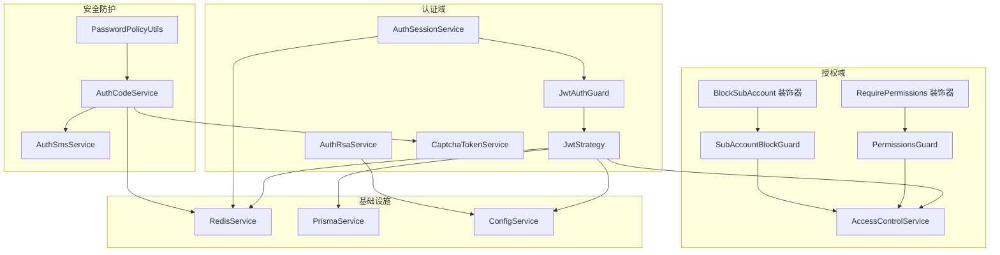
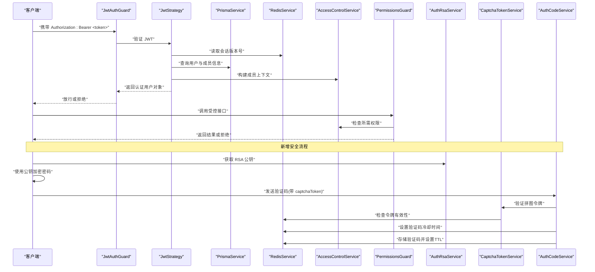
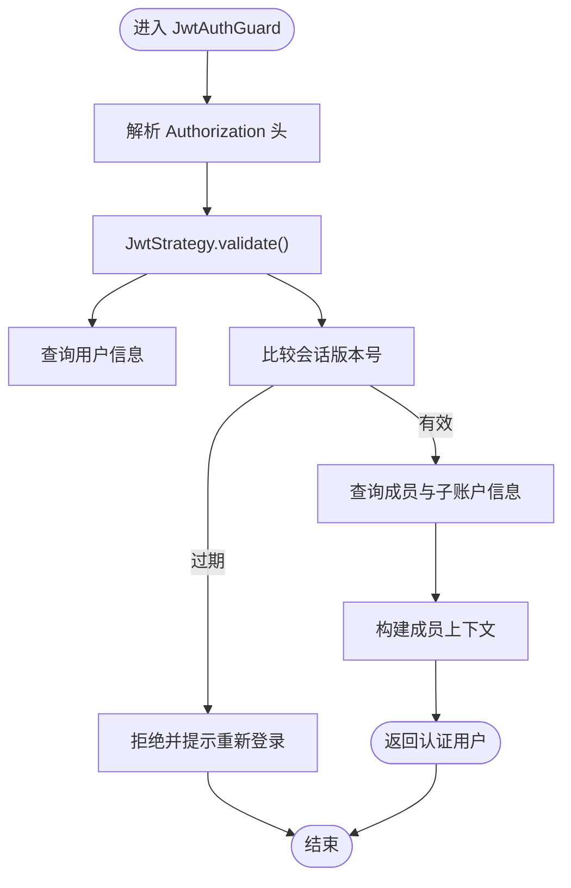
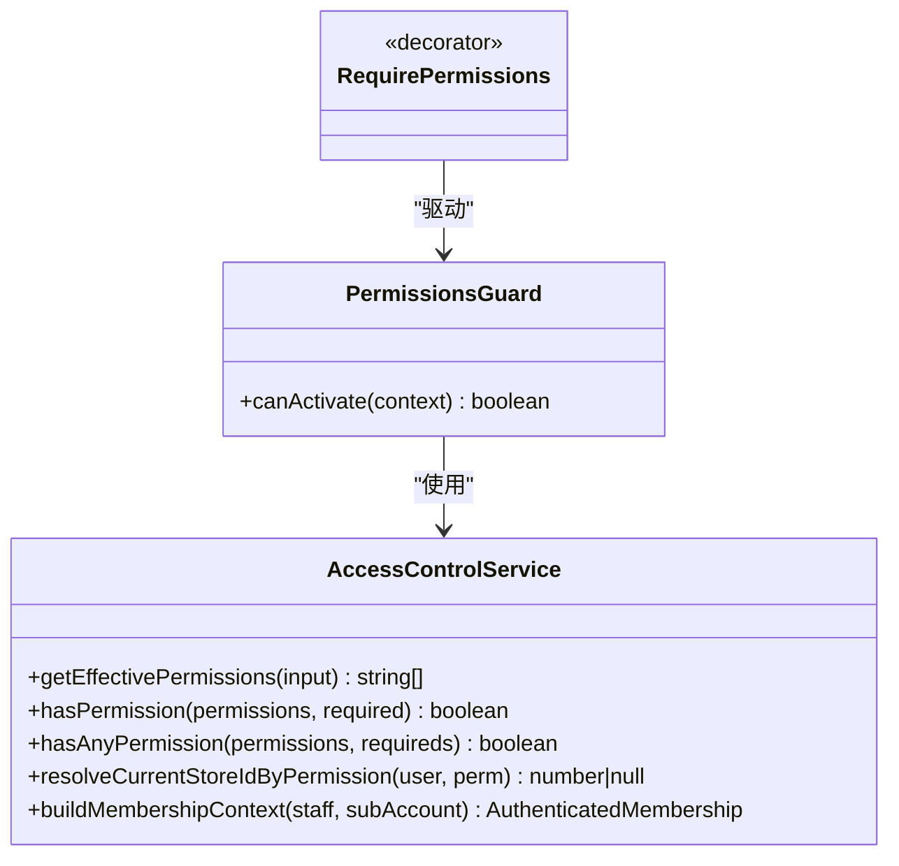
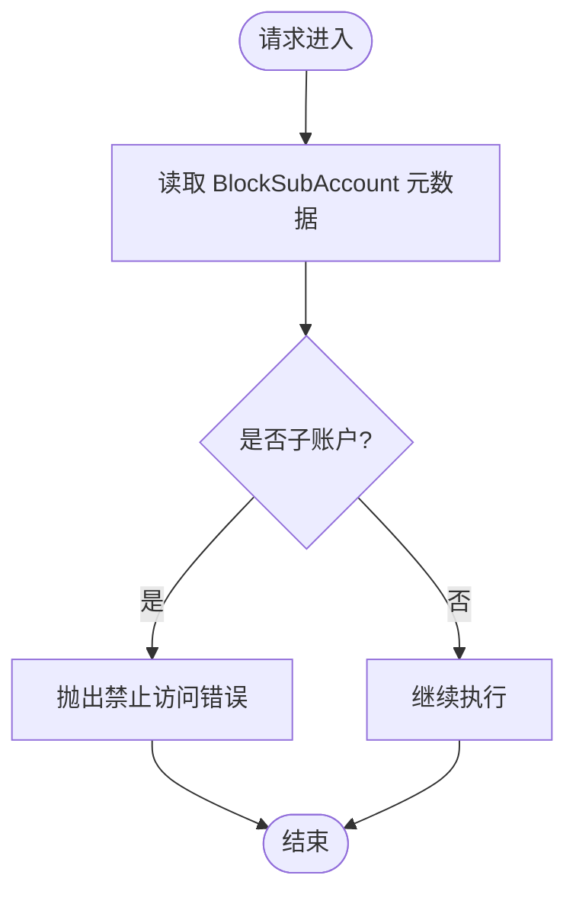
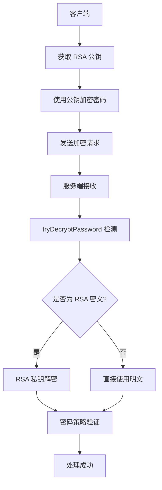
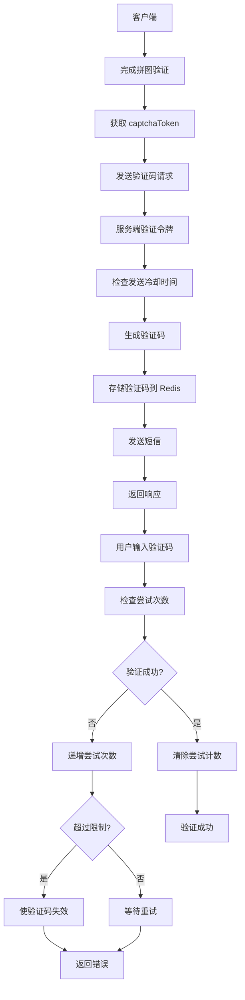
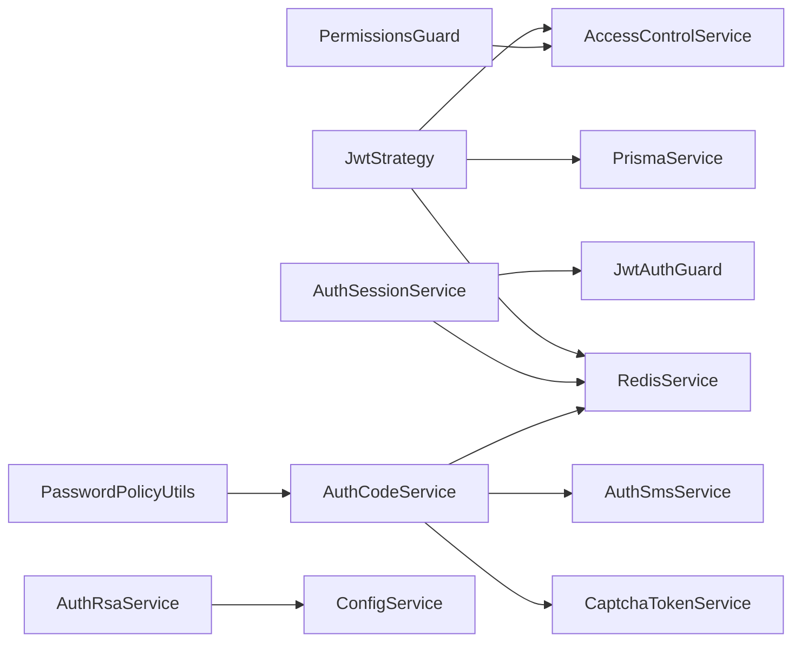

# 安全架构

<cite>
**本文引用的文件**
- [src/purely-profit/auth/strategies/jwt.strategy.ts](file://src/purely-profit/auth/strategies/jwt.strategy.ts)
- [src/purely-profit/auth/guards/jwt-auth.guard.ts](file://src/purely-profit/auth/guards/jwt-auth.guard.ts)
- [src/purely-profit/auth/auth-session.service.ts](file://src/purely-profit/auth/auth-session.service.ts)
- [src/purely-profit/access-control/access-control.service.ts](file://src/purely-profit/access-control/access-control.service.ts)
- [src/purely-profit/access-control/guards/permissions.guard.ts](file://src/purely-profit/access-control/guards/permissions.guard.ts)
- [src/purely-profit/access-control/guards/sub-account-block.guard.ts](file://src/purely-profit/access-control/guards/sub-account-block.guard.ts)
- [src/purely-profit/access-control/decorators/require-permissions.decorator.ts](file://src/purely-profit/access-control/decorators/require-permissions.decorator.ts)
- [src/purely-profit/access-control/decorators/block-sub-account.decorator.ts](file://src/purely-profit/access-control/decorators/block-sub-account.decorator.ts)
- [src/purely-profit/member/platform-membership/platform-membership-access.service.ts](file://src/purely-profit/member/platform-membership/platform-membership-access.service.ts)
- [src/purely-profit/auth/auth.utils.ts](file://src/purely-profit/auth/auth.utils.ts)
- [src/purely-profit/auth/strategies/jwt.strategy.spec.ts](file://src/purely-profit/auth/strategies/jwt.strategy.spec.ts)
- [src/purely-profit/access-control/access-control-alignment.spec.ts](file://src/purely-profit/access-control/access-control-alignment.spec.ts)
- [src/purely-profit/auth/auth.controller.ts](file://src/purely-profit/auth/auth.controller.ts)
- [src/purely-profit/auth/auth.service.ts](file://src/purely-profit/auth/auth.service.ts)
- [src/purely-profit/auth/auth-account.service.ts](file://src/purely-profit/auth/auth-account.service.ts)
- [src/purely-profit/auth/auth-capability.service.ts](file://src/purely-profit/auth/auth-capability.service.ts)
- [src/purely-profit/auth/auth-profile.service.ts](file://src/purely-profit/auth/auth-profile.service.ts)
- [src/purely-profit/auth/auth-password.service.ts](file://src/purely-profit/auth/auth-password.service.ts)
- [src/purely-profit/auth/auth-sms.service.ts](file://src/purely-profit/auth/auth-sms.service.ts)
- [src/purely-profit/auth/auth-code.service.ts](file://src/purely-profit/auth/auth-code.service.ts)
- [src/purely-profit/auth/auth-account-lookup.service.ts](file://src/purely-profit/auth/auth-account-lookup.service.ts)
- [src/purely-profit/auth/auth-account-membership.service.ts](file://src/purely-profit/auth/auth-account-membership.service.ts)
- [src/purely-profit/auth/current-user.decorator.ts](file://src/purely-profit/auth/current-user.decorator.ts)
- [src/purely-profit/auth/request-audit-context.decorator.ts](file://src/purely-profit/auth/request-audit-context.decorator.ts)
- [src/purely-profit/auth/request-id.decorator.ts](file://src/purely-profit/auth/request-id.decorator.ts)
- [src/purely-profit/auth/user-with-request-id.decorator.ts](file://src/purely-profit/auth/user-with-request-id.decorator.ts)
- [src/purely-profit/auth/auth-rsa.service.ts](file://src/purely-profit/auth/auth-rsa.service.ts)
- [src/purely-profit/auth/captcha-token.service.ts](file://src/purely-profit/auth/captcha-token.service.ts)
- [src/shared/password-policy.utils.ts](file://src/shared/password-policy.utils.ts)
- [src/shared/auth/auth-product-auth.service.ts](file://src/shared/auth/auth-product-auth.service.ts)
- [src/shared/auth/auth-password.types.ts](file://src/shared/auth/auth-password.types.ts)
- [src/redis/redis.service.ts](file://src/redis/redis.service.ts)
- [src/prisma/prisma.service.ts](file://src/prisma/prisma.service.ts)
- [src/app.module.ts](file://src/app.module.ts)
- [src/config/configuration.ts](file://src/config/configuration.ts)
</cite>

## 更新摘要
**变更内容**
- 新增 RSA 客户端密码加密服务，支持前端使用公钥加密敏感字段
- 增强微信集成，支持手机号绑定功能与真实手机号获取
- 实现短信验证码暴力破解防护机制，包含尝试次数限制和冷却时间控制
- 添加拼图验证码令牌验证，防止自动化攻击
- 完善密码策略校验，确保明文密码长度合规

## 目录
1. [引言](#引言)
2. [项目结构](#项目结构)
3. [核心组件](#核心组件)
4. [架构总览](#架构总览)
5. [详细组件分析](#详细组件分析)
6. [依赖关系分析](#依赖关系分析)
7. [性能考量](#性能考量)
8. [故障排查指南](#故障排查指南)
9. [结论](#结论)
10. [附录](#附录)

## 引言
本文件面向 purelyprofit-server 的安全架构，系统性阐述认证与授权的设计原则、实现机制与边界防护。重点覆盖：
- JWT 认证流程与会话版本控制
- 基于权限码的 RBAC 模型与细粒度访问控制
- 子账户保护机制与门店级权限隔离
- API 访问控制、数据加密策略、会话管理
- 安全审计、日志记录与异常处理
- 常见安全问题（OAuth2、CORS、CSRF）的应对思路
- **新增**：RSA 客户端密码加密、短信验证码防护、拼图验证码令牌验证

## 项目结构
后端采用 NestJS 架构，安全相关模块集中在 auth 与 access-control 两大域：
- 认证层：JWT 策略、会话服务、账户服务、短信/验证码服务等
- 授权层：权限守卫、子账户拦截器、权限计算与上下文构建
- 基础设施：Redis 缓存、Prisma 数据访问、全局配置
- **新增**：RSA 加密服务、验证码令牌服务、密码策略工具

图表来源
- [src/purely-profit/auth/guards/jwt-auth.guard.ts:1-5](file://src/purely-profit/auth/guards/jwt-auth.guard.ts#L1-L5)
- [src/purely-profit/auth/strategies/jwt.strategy.ts:1-284](file://src/purely-profit/auth/strategies/jwt.strategy.ts#L1-L284)
- [src/purely-profit/auth/auth-session.service.ts:1-46](file://src/purely-profit/auth/auth-session.service.ts#L1-L46)
- [src/purely-profit/auth/auth-rsa.service.ts:1-166](file://src/purely-profit/auth/auth-rsa.service.ts#L1-L166)
- [src/purely-profit/auth/captcha-token.service.ts:1-77](file://src/purely-profit/auth/captcha-token.service.ts#L1-L77)
- [src/purely-profit/auth/auth-code.service.ts:1-449](file://src/purely-profit/auth/auth-code.service.ts#L1-L449)
- [src/shared/password-policy.utils.ts:1-39](file://src/shared/password-policy.utils.ts#L1-L39)
- [src/purely-profit/access-control/access-control.service.ts:1-243](file://src/purely-profit/access-control/access-control.service.ts#L1-L243)
- [src/purely-profit/access-control/guards/permissions.guard.ts:1-55](file://src/purely-profit/access-control/guards/permissions.guard.ts#L1-L55)
- [src/purely-profit/access-control/guards/sub-account-block.guard.ts:1-48](file://src/purely-profit/access-control/guards/sub-account-block.guard.ts#L1-L48)
- [src/purely-profit/access-control/decorators/require-permissions.decorator.ts:1-7](file://src/purely-profit/access-control/decorators/require-permissions.decorator.ts#L1-L7)
- [src/purely-profit/access-control/decorators/block-sub-account.decorator.ts:1-200](file://src/purely-profit/access-control/decorators/block-sub-account.decorator.ts#L1-L200)
- [src/redis/redis.service.ts:1-200](file://src/redis/redis.service.ts#L1-L200)
- [src/prisma/prisma.service.ts:1-200](file://src/prisma/prisma.service.ts#L1-L200)

章节来源
- [src/app.module.ts:1-200](file://src/app.module.ts#L1-L200)
- [src/config/configuration.ts:1-200](file://src/config/configuration.ts#L1-L200)

## 核心组件
- JWT 认证与会话
  - JwtAuthGuard：统一的 JWT 鉴权入口
  - JwtStrategy：从请求中提取 JWT，校验过期与版本，加载用户与成员身份上下文
  - AuthSessionService：签发 JWT 并维护会话版本号
- 授权与访问控制
  - AccessControlService：计算有效权限、角色/子账户权限映射、当前门店 ID 解析
  - PermissionsGuard：基于控制器/方法上的 RequirePermissions 元数据进行权限校验
  - SubAccountBlockGuard：在需要时阻止子账户访问特定接口
- 子账户保护与业务边界
  - platform-membership-access.service：对子账户配额、交接功能等进行业务级校验
- **新增**：客户端安全加密
  - AuthRsaService：RSA 密钥对管理，提供公钥分发和私钥解密能力
  - CaptchaTokenService：拼图验证码令牌验证，防止自动化攻击
  - PasswordPolicyUtils：密码策略校验，确保明文密码长度合规
- **新增**：短信验证码防护
  - AuthCodeService：验证码发送、验证、防暴力破解机制
  - AuthSmsService：短信发送服务抽象
- 基础设施与工具
  - RedisService：存储会话版本号、封禁标记、验证码等
  - PrismaService：查询用户、成员、子账户等数据
  - AuthUtils：账号标识符构建、登录邮箱/手机号归一化

章节来源
- [src/purely-profit/auth/guards/jwt-auth.guard.ts:1-5](file://src/purely-profit/auth/guards/jwt-auth.guard.ts#L1-L5)
- [src/purely-profit/auth/strategies/jwt.strategy.ts:1-284](file://src/purely-profit/auth/strategies/jwt.strategy.ts#L1-L284)
- [src/purely-profit/auth/auth-session.service.ts:1-46](file://src/purely-profit/auth/auth-session.service.ts#L1-L46)
- [src/purely-profit/access-control/access-control.service.ts:1-243](file://src/purely-profit/access-control/access-control.service.ts#L1-L243)
- [src/purely-profit/access-control/guards/permissions.guard.ts:1-55](file://src/purely-profit/access-control/guards/permissions.guard.ts#L1-L55)
- [src/purely-profit/access-control/guards/sub-account-block.guard.ts:1-48](file://src/purely-profit/access-control/guards/sub-account-block.guard.ts#L1-L48)
- [src/purely-profit/member/platform-membership/platform-membership-access.service.ts:189-240](file://src/purely-profit/member/platform-membership/platform-membership-access.service.ts#L189-L240)
- [src/purely-profit/auth/auth-rsa.service.ts:1-166](file://src/purely-profit/auth/auth-rsa.service.ts#L1-L166)
- [src/purely-profit/auth/captcha-token.service.ts:1-77](file://src/purely-profit/auth/captcha-token.service.ts#L1-L77)
- [src/purely-profit/auth/auth-code.service.ts:1-449](file://src/purely-profit/auth/auth-code.service.ts#L1-L449)
- [src/shared/password-policy.utils.ts:1-39](file://src/shared/password-policy.utils.ts#L1-L39)
- [src/purely-profit/auth/auth.utils.ts:1-49](file://src/purely-profit/auth/auth.utils.ts#L1-L49)
- [src/redis/redis.service.ts:1-200](file://src/redis/redis.service.ts#L1-L200)
- [src/prisma/prisma.service.ts:1-200](file://src/prisma/prisma.service.ts#L1-L200)

## 架构总览
下图展示从客户端到数据库与缓存的完整安全链路，以及权限判定与子账户拦截的关键节点。

图表来源
- [src/purely-profit/auth/guards/jwt-auth.guard.ts:1-5](file://src/purely-profit/auth/guards/jwt-auth.guard.ts#L1-L5)
- [src/purely-profit/auth/strategies/jwt.strategy.ts:80-151](file://src/purely-profit/auth/strategies/jwt.strategy.ts#L80-L151)
- [src/purely-profit/access-control/guards/permissions.guard.ts:19-53](file://src/purely-profit/access-control/guards/permissions.guard.ts#L19-L53)
- [src/purely-profit/access-control/access-control.service.ts:124-172](file://src/purely-profit/access-control/access-control.service.ts#L124-L172)
- [src/purely-profit/auth/auth-rsa.service.ts:56-58](file://src/purely-profit/auth/auth-rsa.service.ts#L56-L58)
- [src/purely-profit/auth/captcha-token.service.ts:38-63](file://src/purely-profit/auth/captcha-token.service.ts#L38-L63)
- [src/purely-profit/auth/auth-code.service.ts:343-370](file://src/purely-profit/auth/auth-code.service.ts#L343-L370)
- [src/redis/redis.service.ts:1-200](file://src/redis/redis.service.ts#L1-L200)
- [src/prisma/prisma.service.ts:1-200](file://src/prisma/prisma.service.ts#L1-L200)

## 详细组件分析

### JWT 认证流程与会话管理
- 请求进入 JwtAuthGuard，委托 JwtStrategy 进行验证
- JwtStrategy 校验签名、过期时间，并读取 Redis 中的会话版本号
- 若 payload 的 sessionVersion 小于当前版本，则拒绝，强制重新登录
- 加载用户与成员身份上下文，构建包含角色、权限、子账户状态的认证对象
- AuthSessionService 负责签发 JWT，并在敏感操作后提升会话版本以使旧令牌失效

图表来源
- [src/purely-profit/auth/guards/jwt-auth.guard.ts:1-5](file://src/purely-profit/auth/guards/jwt-auth.guard.ts#L1-L5)
- [src/purely-profit/auth/strategies/jwt.strategy.ts:80-151](file://src/purely-profit/auth/strategies/jwt.strategy.ts#L80-L151)
- [src/purely-profit/auth/auth-session.service.ts:16-45](file://src/purely-profit/auth/auth-session.service.ts#L16-L45)

章节来源
- [src/purely-profit/auth/strategies/jwt.strategy.ts:67-78](file://src/purely-profit/auth/strategies/jwt.strategy.ts#L67-L78)
- [src/purely-profit/auth/strategies/jwt.strategy.spec.ts:39-63](file://src/purely-profit/auth/strategies/jwt.strategy.spec.ts#L39-L63)
- [src/purely-profit/auth/auth-session.service.ts:31-45](file://src/purely-profit/auth/auth-session.service.ts#L31-L45)

### 权限控制模型与 RBAC 实现
- 权限来源
  - 角色默认权限：不同角色具备基础权限集合
  - 成员自定义权限：成员可额外授予细粒度权限
  - 子账户权限：根据角色与状态动态推导，支持"交接"能力开关
- 权限判定
  - PermissionsGuard 读取控制器/方法上的 RequirePermissions 元数据
  - AccessControlService 计算有效权限集合并判断是否满足任一所需权限
- 权限码示例（节选）
  - 报表查看：report:view
  - 商品管理：goods:view/goods:create/goods:update
  - 销售与库存：sales:*、inventory:*
  - 财务：finance:view/finance:export
  - 交接：handover:view/create/update
  - 操作录入：operation-entry:create

图表来源
- [src/purely-profit/access-control/access-control.service.ts:124-172](file://src/purely-profit/access-control/access-control.service.ts#L124-L172)
- [src/purely-profit/access-control/guards/permissions.guard.ts:19-53](file://src/purely-profit/access-control/guards/permissions.guard.ts#L19-L53)
- [src/purely-profit/access-control/decorators/require-permissions.decorator.ts:1-7](file://src/purely-profit/access-control/decorators/require-permissions.decorator.ts#L1-L7)

章节来源
- [src/purely-profit/access-control/access-control.service.ts:50-120](file://src/purely-profit/access-control/access-control.service.ts#L50-L120)
- [src/purely-profit/access-control/access-control-alignment.spec.ts:258-304](file://src/purely-profit/access-control/access-control-alignment.spec.ts#L258-L304)
- [src/purely-profit/access-control/guards/permissions.guard.ts:19-53](file://src/purely-profit/access-control/guards/permissions.guard.ts#L19-L53)

### 子账户保护机制
- 身份类型
  - owner/staff/sub_account：区分主账户、正式员工与子账户
- 权限继承与限制
  - 子账户权限由角色与状态决定；若未分配或非激活则无权限
  - 可选启用"交接"能力，否则过滤掉交接相关权限
- 接口级拦截
  - SubAccountBlockGuard 在控制器/方法上标注后，阻止子账户访问
  - platform-membership-access.service 对子账户配额、交接开关等进行业务级校验

图表来源
- [src/purely-profit/access-control/guards/sub-account-block.guard.ts:17-46](file://src/purely-profit/access-control/guards/sub-account-block.guard.ts#L17-L46)
- [src/purely-profit/access-control/decorators/block-sub-account.decorator.ts:1-200](file://src/purely-profit/access-control/decorators/block-sub-account.decorator.ts#L1-L200)
- [src/purely-profit/member/platform-membership/platform-membership-access.service.ts:189-240](file://src/purely-profit/member/platform-membership/platform-membership-access.service.ts#L189-L240)

章节来源
- [src/purely-profit/access-control/access-control.service.ts:187-241](file://src/purely-profit/access-control/access-control.service.ts#L187-L241)
- [src/purely-profit/access-control/guards/sub-account-block.guard.ts:17-46](file://src/purely-profit/access-control/guards/sub-account-block.guard.ts#L17-L46)
- [src/purely-profit/member/platform-membership/platform-membership-access.service.ts:189-240](file://src/purely-profit/member/platform-membership/platform-membership-access.service.ts#L189-L240)

### API 访问控制与装饰器驱动
- RequirePermissions 装饰器在控制器/方法上声明所需权限码
- PermissionsGuard 自动注入并执行校验，未满足时返回 403
- 与 JwtAuthGuard 组合形成"先认证、后授权"的标准路径

章节来源
- [src/purely-profit/access-control/decorators/require-permissions.decorator.ts:1-7](file://src/purely-profit/access-control/decorators/require-permissions.decorator.ts#L1-L7)
- [src/purely-profit/access-control/guards/permissions.guard.ts:19-53](file://src/purely-profit/access-control/guards/permissions.guard.ts#L19-L53)

### 数据加密策略与安全增强

#### RSA 客户端密码加密
**新增** 系统实现了完整的 RSA 非对称加密方案，用于保护客户端传输的敏感数据：

- **密钥管理**
  - 启动时生成 RSA 2048-bit 密钥对，缓存在内存中
  - 支持通过环境变量配置固定密钥对，便于生产环境部署
  - 进程重启后密钥对自动轮换，旧密钥加密的密文自动失效

- **加密算法选择**
  - 优先使用 RSA-OAEP SHA-256 填充方式（比 PKCS1 v1.5 更安全，防范 Bleichenbacher 攻击）
  - 回退支持 OAEP SHA-1 和 PKCS1 v1.5，兼容尚未升级的旧客户端
  - 前端使用 jsencrypt 库的 encryptOAEP 方法与后端对齐

- **智能解密机制**
  - tryDecryptPassword 方法自动识别 RSA 加密的 Base64 字符串
  - 以 100 字符为阈值判断是否为加密密文（RSA 2048 加密后固定 344 字符）
  - 解密失败时抛出明确错误，避免静默回退导致的安全问题

图表来源
- [src/purely-profit/auth/auth-rsa.service.ts:56-58](file://src/purely-profit/auth/auth-rsa.service.ts#L56-L58)
- [src/purely-profit/auth/auth-rsa.service.ts:140-164](file://src/purely-profit/auth/auth-rsa.service.ts#L140-L164)
- [src/purely-profit/auth/auth-rsa.service.ts:70-127](file://src/purely-profit/auth/auth-rsa.service.ts#L70-L127)

#### 拼图验证码令牌验证
**新增** 系统实现了前端拼图验证码的令牌验证机制，防止自动化攻击：

- **令牌格式规范**
  - 前端 usePuzzleCaptcha 生成的 token 格式为 `puzzle_{timestamp}_{counter}`
  - 严格的正则表达式验证，防止随机字符串或注入攻击

- **一次性消费机制**
  - Token 存储在 Redis 中，有效期 5 分钟
  - 验证成功后立即删除，确保只能使用一次
  - 未传 token 或格式不合法直接拒绝请求

- **防重放攻击**
  - 通过 Redis 原子操作确保令牌消费的原子性
  - 过期令牌自动清理，避免存储膨胀

章节来源
- [src/purely-profit/auth/auth-rsa.service.ts:1-166](file://src/purely-profit/auth/auth-rsa.service.ts#L1-L166)
- [src/purely-profit/auth/captcha-token.service.ts:1-77](file://src/purely-profit/auth/captcha-token.service.ts#L1-L77)
- [src/shared/password-policy.utils.ts:1-39](file://src/shared/password-policy.utils.ts#L1-L39)

### 短信验证码防护机制

#### 暴力破解防护
**新增** 系统实现了完善的短信验证码安全防护机制：

- **发送频率限制**
  - 基于场景（注册、登录、密码重置、绑定手机）的独立冷却时间控制
  - 使用 Redis setIfAbsent 原子操作确保并发安全
  - 可配置的冷却时间，默认防止频繁发送

- **验证码尝试次数限制**
  - 每个验证码最多允许指定次数的验证尝试（默认 5 次）
  - 超限后自动清除验证码，使其彻底失效
  - 独立的尝试次数计数器，带 TTL 自动清理

- **验证码生命周期管理**
  - 注册验证码：默认 5 分钟有效期
  - 登录验证码：默认 5 分钟有效期  
  - 密码重置验证码：默认 10 分钟有效期
  - 所有验证码均使用 Redis 存储，自动过期清理

#### 微信手机号绑定增强
**新增** 系统增强了微信集成功能，支持真实手机号绑定：

- **wechat_phone 字段**
  - 存储微信授权的真实手机号（E.164 格式）
  - 唯一索引约束，防止多个用户绑定同一手机号
  - 作为 JWT phone 字段，替代占位符

- **账号合并逻辑**
  - 微信登录时可传入手机号，尝试与已有账号合并
  - 支持 openid 与手机号账号的互通
  - 统一账号体系，提升用户体验

图表来源
- [src/purely-profit/auth/auth-code.service.ts:343-370](file://src/purely-profit/auth/auth-code.service.ts#L343-L370)
- [src/purely-profit/auth/auth-code.service.ts:401-447](file://src/purely-profit/auth/auth-code.service.ts#L401-L447)
- [src/purely-profit/auth/captcha-token.service.ts:38-63](file://src/purely-profit/auth/captcha-token.service.ts#L38-L63)
- [prisma/migrations/20260615130000_add_wechat_phone_to_users/migration.sql:1-14](file://prisma/migrations/20260615130000_add_wechat_phone_to_users/migration.sql#L1-L14)
- [prisma/migrations/20260620120000_add_unique_index_wechat_phone/migration.sql:1-16](file://prisma/migrations/20260620120000_add_unique_index_wechat_phone/migration.sql#L1-L16)

章节来源
- [src/purely-profit/auth/auth-code.service.ts:1-449](file://src/purely-profit/auth/auth-code.service.ts#L1-L449)
- [src/purely-profit/auth/auth-sms.service.ts:1-55](file://src/purely-profit/auth/auth-sms.service.ts#L1-L55)
- [src/shared/auth/auth-product-auth.service.ts:167-208](file://src/shared/auth/auth-product-auth.service.ts#L167-L208)
- [src/shared/auth/auth-password.types.ts:13-22](file://src/shared/auth/auth-password.types.ts#L13-L22)

### 会话管理与强制失效
- 会话版本号
  - Redis 中按用户维度存储会话版本号
  - 签发新令牌时携带当前版本；旧令牌因版本落后被拒绝
- 强制失效场景
  - 修改敏感设置、重置密码、封禁用户等触发版本递增
- 封禁机制
  - Redis 中按门店维度存储封禁原因键值
  - JwtStrategy 在鉴权阶段检测并拒绝被封禁用户

章节来源
- [src/purely-profit/auth/auth-session.service.ts:31-45](file://src/purely-profit/auth/auth-session.service.ts#L31-L45)
- [src/purely-profit/auth/strategies/jwt.strategy.ts:236-252](file://src/purely-profit/auth/strategies/jwt.strategy.ts#L236-L252)
- [src/redis/redis.service.ts:1-200](file://src/redis/redis.service.ts#L1-L200)

### 安全审计、日志记录与异常处理
- 审计上下文
  - 提供 RequestAuditContext、RequestId、CurrentUser 等装饰器，便于在日志中关联用户与请求
- 日志建议
  - 记录认证失败、权限不足、封禁触发、会话版本不匹配等事件
  - 避免在日志中输出敏感信息（如完整 JWT、密码）
- 异常处理
  - 未认证：UnauthorizedException
  - 权限不足：ForbiddenException
  - 业务校验失败：ForbiddenException 或业务异常

章节来源
- [src/purely-profit/auth/request-audit-context.decorator.ts:1-200](file://src/purely-profit/auth/request-audit-context.decorator.ts#L1-L200)
- [src/purely-profit/auth/request-id.decorator.ts:1-200](file://src/purely-profit/auth/request-id.decorator.ts#L1-L200)
- [src/purely-profit/auth/current-user.decorator.ts:1-200](file://src/purely-profit/auth/current-user.decorator.ts#L1-L200)
- [src/purely-profit/auth/user-with-request-id.decorator.ts:1-200](file://src/purely-profit/auth/user-with-request-id.decorator.ts#L1-L200)

### 威胁模型与安全边界
- 威胁与缓解
  - 令牌泄露：通过会话版本控制与封禁机制快速失效
  - 权限提升：严格的 RBAC 与子账户拦截，接口级权限元数据驱动
  - 业务越权：平台会员子账户配额与功能开关的业务校验
  - 会话劫持：HTTPS、安全 Cookie、短 Token 生命周期
  - **新增**：暴力破解攻击：短信验证码频率限制与尝试次数控制
  - **新增**：自动化攻击：拼图验证码令牌验证与一次性消费机制
  - **新增**：中间人攻击：RSA 客户端加密，防止密码明文传输
- 边界与信任
  - 内部服务间通信建议使用受控网络与 TLS
  - 外部集成（如短信）需最小化暴露面与速率限制

## 依赖关系分析
- 组件耦合
  - JwtStrategy 依赖 PrismaService、RedisService、AccessControlService
  - PermissionsGuard 依赖 AccessControlService 与反射元数据
  - AuthSessionService 依赖 RedisService 与 JwtService
  - **新增**：AuthCodeService 依赖 CaptchaTokenService、AuthSmsService、RedisService
  - **新增**：AuthRsaService 依赖 ConfigService，提供纯内存加密服务
- 外部依赖
  - passport-jwt：JWT 提取与验证
  - @nestjs/jwt：令牌签发
  - Redis：会话版本与封禁标记、验证码存储、令牌验证
  - Prisma：成员与用户数据访问
  - node:crypto：RSA 加密解密算法

图表来源
- [src/purely-profit/auth/strategies/jwt.strategy.ts:1-284](file://src/purely-profit/auth/strategies/jwt.strategy.ts#L1-L284)
- [src/purely-profit/access-control/access-control.service.ts:1-243](file://src/purely-profit/access-control/access-control.service.ts#L1-L243)
- [src/purely-profit/access-control/guards/permissions.guard.ts:1-55](file://src/purely-profit/access-control/guards/permissions.guard.ts#L1-L55)
- [src/purely-profit/auth/auth-session.service.ts:1-46](file://src/purely-profit/auth/auth-session.service.ts#L1-L46)
- [src/purely-profit/auth/auth-code.service.ts:1-449](file://src/purely-profit/auth/auth-code.service.ts#L1-L449)
- [src/purely-profit/auth/auth-rsa.service.ts:1-166](file://src/purely-profit/auth/auth-rsa.service.ts#L1-L166)
- [src/shared/password-policy.utils.ts:1-39](file://src/shared/password-policy.utils.ts#L1-L39)

章节来源
- [src/purely-profit/auth/strategies/jwt.strategy.ts:1-284](file://src/purely-profit/auth/strategies/jwt.strategy.ts#L1-L284)
- [src/purely-profit/access-control/access-control.service.ts:1-243](file://src/purely-profit/access-control/access-control.service.ts#L1-L243)
- [src/purely-profit/access-control/guards/permissions.guard.ts:1-55](file://src/purely-profit/access-control/guards/permissions.guard.ts#L1-L55)
- [src/purely-profit/auth/auth-session.service.ts:1-46](file://src/purely-profit/auth/auth-session.service.ts#L1-L46)

## 性能考量
- 缓存优先：会话版本号、封禁标记均来自 Redis，减少数据库压力
- 查询优化：JwtStrategy 使用原生 SQL 聚合成员与子账户信息，避免多次往返
- 权限计算：AccessControlService 将默认权限与成员自定义权限去重合并，复杂度可控
- **新增**：RSA 加密性能：公钥获取为内存操作，私钥解密为 CPU 密集型但仅发生在敏感操作
- **新增**：验证码性能：Redis 原子操作确保并发安全，TTL 自动清理避免存储膨胀
- 建议
  - 合理设置 Redis TTL 与连接池
  - 对高频接口开启响应缓存（注意数据一致性）
  - 监控 RSA 解密失败率，及时提醒前端升级加密算法

## 故障排查指南
- 常见问题与定位
  - "登录态已失效，请重新登录"：会话版本落后，检查 AuthSessionService 是否正确提升版本
  - "账号已被封禁"：Redis 中存在封禁键，检查平台管理端封禁操作
  - "当前账号暂无门店权限/缺少接口访问权限"：确认成员状态、角色与权限元数据
  - "登录态能力上下文未就绪"：子账户模式相关表尚未迁移完成，等待迁移后再登录
  - **新增**："密码解密失败，请刷新页面重新获取公钥后重试"：RSA 密钥对已轮换，前端需重新获取公钥
  - **新增**："人机验证令牌格式不合法"：captchaToken 格式不符合规范，检查前端拼图验证实现
  - **新增**："短信发送过于频繁"：触发了发送冷却时间限制，等待指定时间后重试
  - **新增**："验证码错误次数过多，请重新获取验证码"：尝试次数超过限制，验证码已失效
- 单元测试参考
  - JwtStrategy 针对会话版本过期、开发者模式、封禁场景的断言
  - 权限装饰器与守卫的对齐测试，确保接口权限码正确

章节来源
- [src/purely-profit/auth/strategies/jwt.strategy.spec.ts:39-162](file://src/purely-profit/auth/strategies/jwt.strategy.spec.ts#L39-L162)
- [src/purely-profit/access-control/access-control-alignment.spec.ts:258-304](file://src/purely-profit/access-control/access-control-alignment.spec.ts#L258-L304)

## 结论
该安全架构以 JWT 为基础，结合 Redis 会话版本控制与严格的 RBAC 权限模型，实现了细粒度的 API 访问控制与子账户保护。通过装饰器驱动的权限声明与守卫，系统在不侵入业务代码的前提下提供了强一致的访问控制。配合封禁机制与审计上下文，整体具备良好的可运维性与可观测性。

**新增的安全增强**显著提升了系统的整体安全性：
- RSA 客户端加密有效防止了密码等敏感数据的明文传输
- 短信验证码防护机制有效抵御了暴力破解和自动化攻击
- 拼图验证码令牌验证确保了人机交互的真实性
- 微信手机号绑定功能完善了多账号体系的互通性

这些改进使得系统在面对现代网络安全威胁时具备了更强的防护能力。

## 附录
- OAuth2、CORS、CSRF 建议
  - OAuth2：如需外部登录，建议引入 OAuth2 客户端并在独立模块中实现，避免与内部 JWT 混用
  - CORS：仅开放必要域名，严格设置凭证与预检缓存
  - CSRF：后端以 JWT 为主，前端避免使用传统 Cookie 登录；如需 Cookie 登录，务必启用 SameSite 严格与 HttpOnly
- **新增**：RSA 加密最佳实践
  - 前端每次提交前重新获取公钥，避免使用过期公钥
  - 推荐使用 RSA-OAEP SHA-256 填充方式，提供更好的安全性
  - 实施渐进式升级策略，保持对旧客户端的兼容性
- **新增**：验证码安全配置
  - 生产环境禁用验证码回显，仅在开发环境启用
  - 合理设置验证码有效期和尝试次数限制
  - 监控验证码发送频率和验证失败率，及时发现异常行为