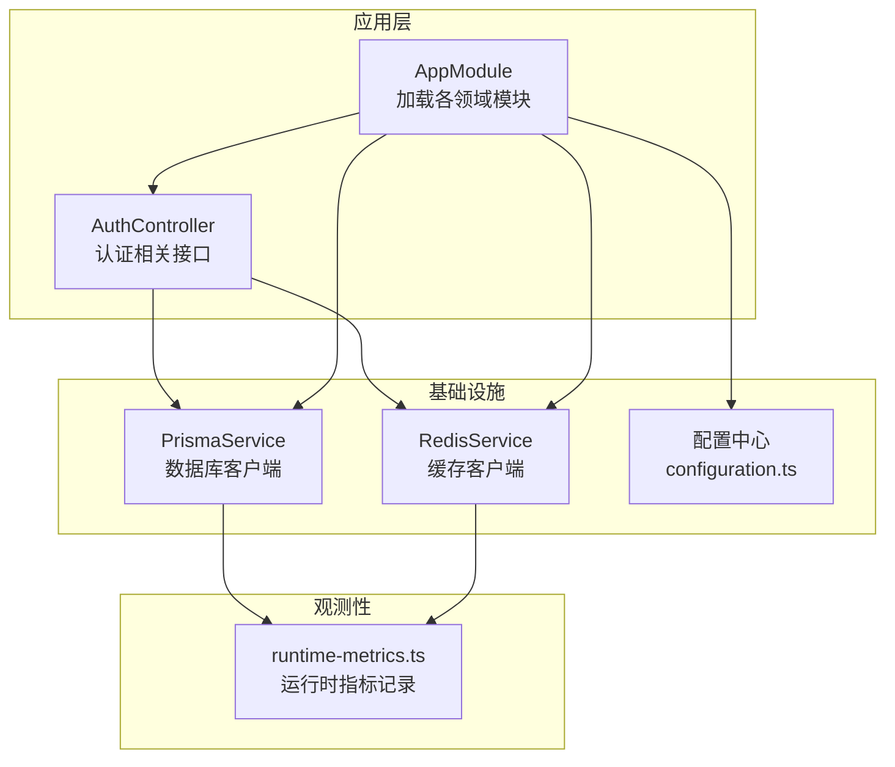
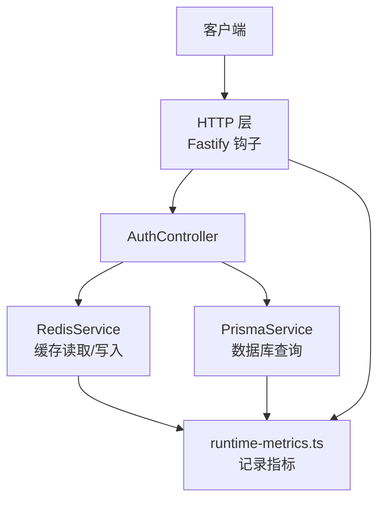
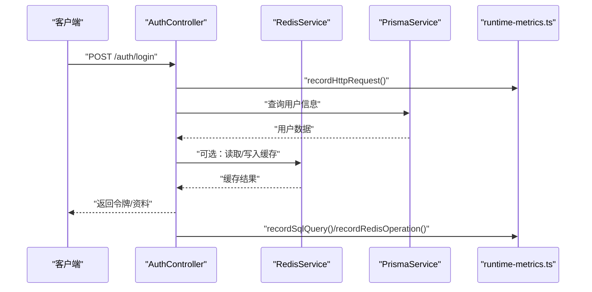
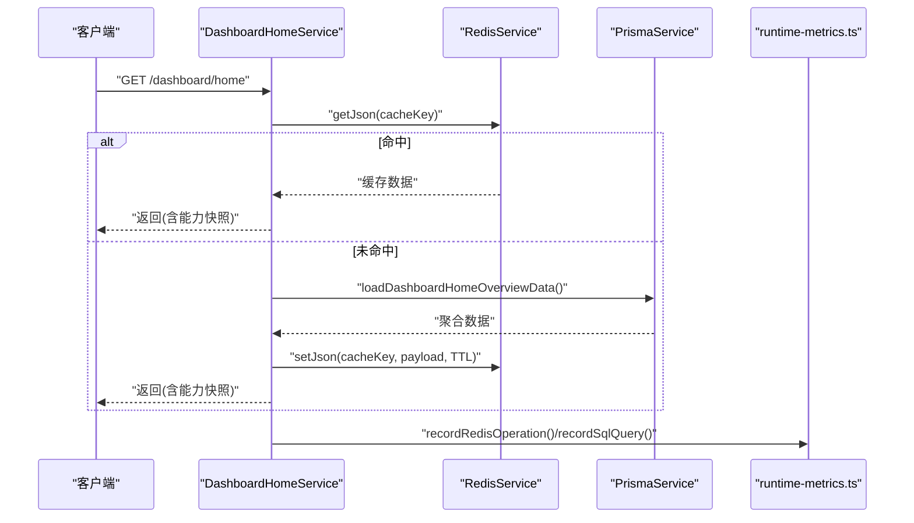
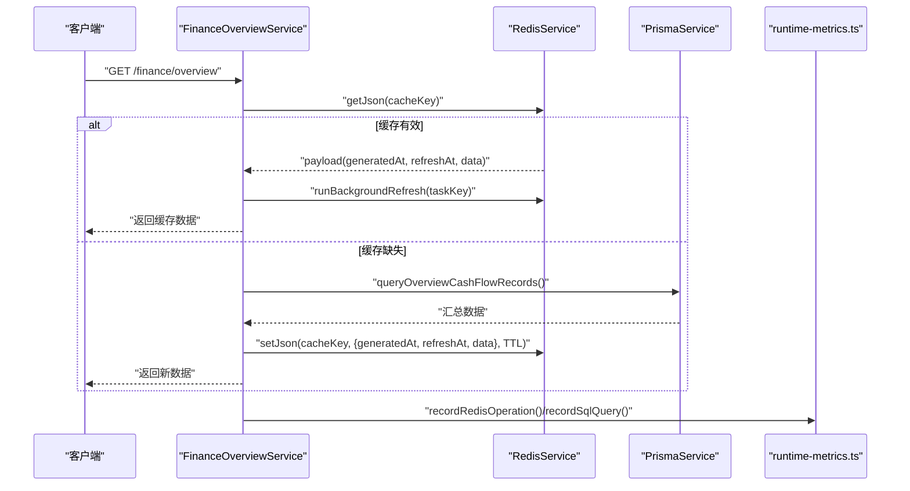
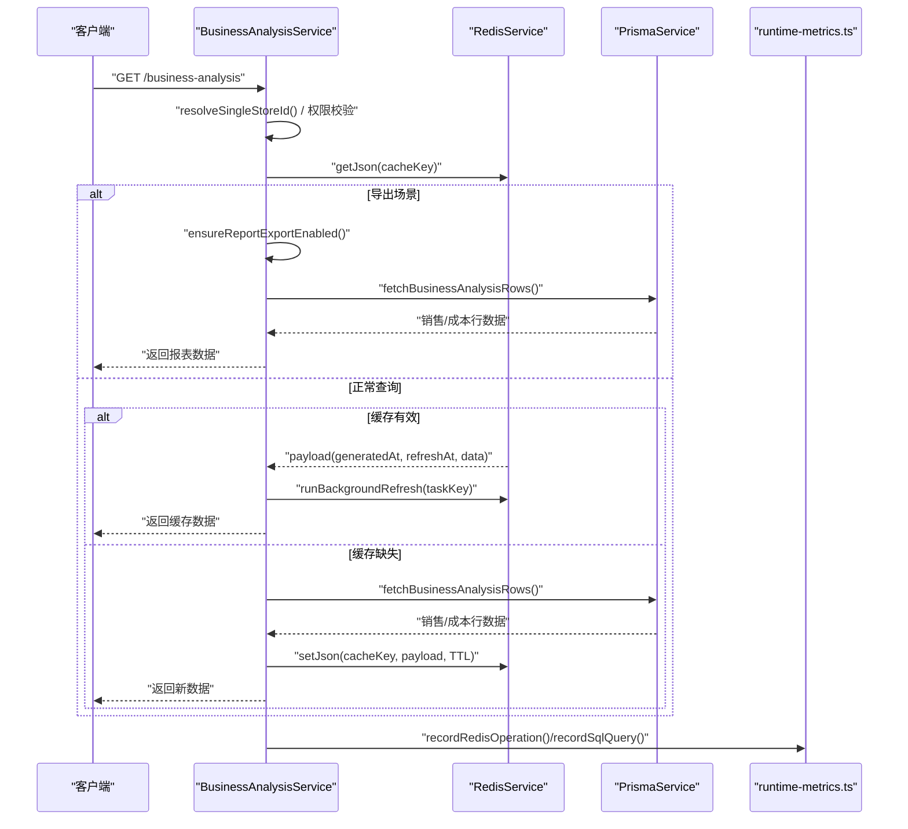
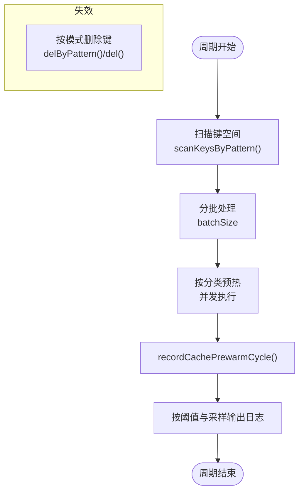
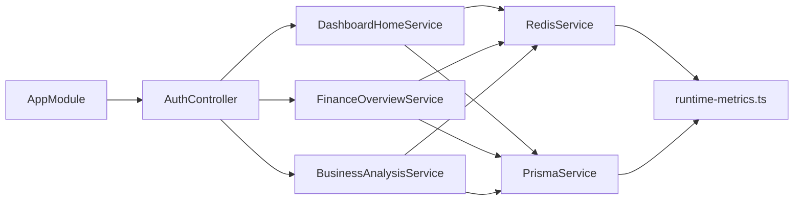

# 数据流设计

<cite>
**本文引用的文件**
- [main.ts](file://src/main.ts)
- [app.module.ts](file://src/app.module.ts)
- [configuration.ts](file://src/config/configuration.ts)
- [prisma.service.ts](file://src/prisma/prisma.service.ts)
- [redis.service.ts](file://src/redis/redis.service.ts)
- [cache-keys.ts](file://src/redis/cache-keys.ts)
- [cache-prewarm.service.ts](file://src/redis/cache-prewarm.service.ts)
- [cache-invalidator.service.ts](file://src/redis/cache-invalidator.service.ts)
- [runtime-metrics.ts](file://src/observability/runtime-metrics.ts)
- [index.ts](file://src/observability/index.ts)
- [auth.controller.ts](file://src/purely-profit/auth/auth.controller.ts)
- [dashboard-home.service.ts](file://src/purely-profit/dashboard/dashboard-home/dashboard-home.service.ts)
- [finance-overview.service.ts](file://src/purely-profit/finance/finance-overview.service.ts)
- [business-analysis.service.ts](file://src/purely-profit/dashboard/business-analysis/business-analysis.service.ts)
</cite>

## 目录
1. [简介](#简介)
2. [项目结构](#项目结构)
3. [核心组件](#核心组件)
4. [架构总览](#架构总览)
5. [详细组件分析](#详细组件分析)
6. [依赖关系分析](#依赖关系分析)
7. [性能考量](#性能考量)
8. [故障排查指南](#故障排查指南)
9. [结论](#结论)
10. [附录](#附录)

## 简介
本文件为 purelyprofit-server 的数据流设计文档，聚焦系统内数据的流转路径与处理机制，覆盖用户请求的完整生命周期（请求接收、认证授权、业务处理、缓存与数据库交互、观测性采集）、缓存系统的预热与失效策略、数据库查询执行流程、异步刷新与事件驱动的后台任务、以及数据一致性保障机制。文档同时提供数据流图与时序图，帮助读者快速理解关键数据节点的状态变化，并给出优化策略与性能监控方法。

## 项目结构
系统采用 NestJS 架构，以模块化组织功能域，核心模块包括认证、财务、商品、营销、会员、运营等。应用启动时初始化 Fastify 适配器、全局验证管道、跨域配置、Swagger 文档与端口监听；数据库使用 Prisma 客户端连接 PostgreSQL，缓存使用 Redis 提供高性能读取与键空间管理。

图表来源
- [app.module.ts:39-78](file://src/app.module.ts#L39-L78)
- [main.ts:136-144](file://src/main.ts#L136-L144)
- [configuration.ts:8-139](file://src/config/configuration.ts#L8-L139)
- [prisma.service.ts:8-64](file://src/prisma/prisma.service.ts#L8-L64)
- [redis.service.ts:8-167](file://src/redis/redis.service.ts#L8-L167)
- [runtime-metrics.ts:1-12](file://src/observability/runtime-metrics.ts#L1-L12)

章节来源
- [app.module.ts:1-83](file://src/app.module.ts#L1-L83)
- [main.ts:121-204](file://src/main.ts#L121-L204)
- [configuration.ts:8-139](file://src/config/configuration.ts#L8-L139)

## 核心组件
- 应用引导与中间件
  - Fastify 适配器、全局验证管道、CORS、Swagger、端口监听与回退策略。
  - HTTP 请求观测钩子记录请求耗时、路由、状态码与请求 ID。
- 数据库层
  - Prisma 客户端通过 pg 连接池访问 PostgreSQL，开启 query 事件监听，记录慢查询与观测指标。
- 缓存层
  - Redis 客户端封装 GET/SET/DEL/SCAN 等操作，统一观测记录与慢日志。
  - 缓存预热周期性扫描键空间并批量写入热点数据。
  - 缓存失效器按业务域模式匹配删除键，支持并发清理与组合失效。
- 观测性
  - 统一记录 HTTP 请求、SQL 查询、Redis 操作与缓存预热周期指标，支持健康快照与运行时指标快照。

章节来源
- [main.ts:32-75](file://src/main.ts#L32-L75)
- [prisma.service.ts:37-53](file://src/prisma/prisma.service.ts#L37-L53)
- [redis.service.ts:141-165](file://src/redis/redis.service.ts#L141-L165)
- [cache-prewarm.service.ts:90-141](file://src/redis/cache-prewarm.service.ts#L90-L141)
- [cache-invalidator.service.ts:15-89](file://src/redis/cache-invalidator.service.ts#L15-L89)
- [runtime-metrics.ts:1-12](file://src/observability/runtime-metrics.ts#L1-L12)

## 架构总览
下图展示从客户端到数据库与缓存的整体数据流，包含鉴权、缓存命中/未命中分支、数据库查询与写入缓存、以及观测性指标记录。

图表来源
- [main.ts:32-75](file://src/main.ts#L32-L75)
- [auth.controller.ts:28-182](file://src/purely-profit/auth/auth.controller.ts#L28-L182)
- [redis.service.ts:35-108](file://src/redis/redis.service.ts#L35-L108)
- [prisma.service.ts:37-53](file://src/prisma/prisma.service.ts#L37-L53)
- [runtime-metrics.ts:1-12](file://src/observability/runtime-metrics.ts#L1-L12)

## 详细组件分析

### 认证与用户资料接口数据流
用户通过认证控制器发起登录、注册、获取资料等请求。控制器调用认证服务，服务内部可能进行权限校验、会话管理与资料构建，随后根据业务需要访问缓存或数据库。

图表来源
- [auth.controller.ts:56-65](file://src/purely-profit/auth/auth.controller.ts#L56-L65)
- [prisma.service.ts:37-53](file://src/prisma/prisma.service.ts#L37-L53)
- [redis.service.ts:35-108](file://src/redis/redis.service.ts#L35-L108)
- [runtime-metrics.ts:1-12](file://src/observability/runtime-metrics.ts#L1-L12)

章节来源
- [auth.controller.ts:28-182](file://src/purely-profit/auth/auth.controller.ts#L28-L182)

### 仪表盘首页数据流（缓存命中/未命中）
DashboardHomeService 负责首页概览数据，优先从 Redis 读取，命中则直接返回；未命中则查询数据库并写入缓存，同时合并能力快照返回。

图表来源
- [dashboard-home.service.ts:35-99](file://src/purely-profit/dashboard/dashboard-home/dashboard-home.service.ts#L35-L99)
- [redis.service.ts:35-108](file://src/redis/redis.service.ts#L35-L108)
- [prisma.service.ts:37-53](file://src/prisma/prisma.service.ts#L37-L53)
- [runtime-metrics.ts:1-12](file://src/observability/runtime-metrics.ts#L1-L12)

章节来源
- [dashboard-home.service.ts:25-144](file://src/purely-profit/dashboard/dashboard-home/dashboard-home.service.ts#L25-L144)

### 财务概览数据流（带后台刷新）
FinanceOverviewService 支持带过期时间的缓存，若缓存存在但已到刷新阈值，则在后台触发刷新任务，避免阻塞当前请求。

图表来源
- [finance-overview.service.ts:54-83](file://src/purely-profit/finance/finance-overview.service.ts#L54-L83)
- [finance-overview.service.ts:141-157](file://src/purely-profit/finance/finance-overview.service.ts#L141-L157)
- [finance-overview.service.ts:159-179](file://src/purely-profit/finance/finance-overview.service.ts#L159-L179)
- [redis.service.ts:125-139](file://src/redis/redis.service.ts#L125-L139)
- [prisma.service.ts:37-53](file://src/prisma/prisma.service.ts#L37-L53)
- [runtime-metrics.ts:1-12](file://src/observability/runtime-metrics.ts#L1-L12)

章节来源
- [finance-overview.service.ts:45-271](file://src/purely-profit/finance/finance-overview.service.ts#L45-L271)

### 经营分析数据流（带后台刷新与导出控制）
BusinessAnalysisService 对分析结果进行缓存，支持导出场景下的权限校验，未命中时查询数据库并写入缓存。

图表来源
- [business-analysis.service.ts:47-91](file://src/purely-profit/dashboard/business-analysis/business-analysis.service.ts#L47-L91)
- [business-analysis.service.ts:104-142](file://src/purely-profit/dashboard/business-analysis/business-analysis.service.ts#L104-L142)
- [business-analysis.service.ts:144-210](file://src/purely-profit/dashboard/business-analysis/business-analysis.service.ts#L144-L210)
- [redis.service.ts:125-139](file://src/redis/redis.service.ts#L125-L139)
- [prisma.service.ts:37-53](file://src/prisma/prisma.service.ts#L37-L53)
- [runtime-metrics.ts:1-12](file://src/observability/runtime-metrics.ts#L1-L12)

章节来源
- [business-analysis.service.ts:38-212](file://src/purely-profit/dashboard/business-analysis/business-analysis.service.ts#L38-L212)

### 缓存预热与失效流程
- 预热：定时扫描指定模式的键集合，按分类并发预热，记录周期指标并按阈值与采样策略输出日志。
- 失效：按业务域模式匹配键并批量删除，支持组合失效以减少重复计算。

图表来源
- [cache-prewarm.service.ts:90-141](file://src/redis/cache-prewarm.service.ts#L90-L141)
- [cache-invalidator.service.ts:19-88](file://src/redis/cache-invalidator.service.ts#L19-L88)
- [redis.service.ts:90-108](file://src/redis/redis.service.ts#L90-L108)
- [cache-keys.ts:49-91](file://src/redis/cache-keys.ts#L49-L91)

章节来源
- [cache-prewarm.service.ts:20-165](file://src/redis/cache-prewarm.service.ts#L20-L165)
- [cache-invalidator.service.ts:15-90](file://src/redis/cache-invalidator.service.ts#L15-L90)
- [cache-keys.ts:1-226](file://src/redis/cache-keys.ts#L1-L226)

### 数据一致性与事件驱动
- 读多写少场景：通过缓存 TTL 与后台刷新降低数据库压力，前台返回即时数据，后台异步刷新确保后续请求命中新鲜数据。
- 写后失效：对衍生数据（如首页、财务概览、经营分析）进行组合失效，确保下游读取不会返回过期数据。
- 异步刷新：RedisService 提供 runBackgroundRefresh，避免阻塞请求线程。

章节来源
- [finance-overview.service.ts:141-157](file://src/purely-profit/finance/finance-overview.service.ts#L141-L157)
- [business-analysis.service.ts:104-120](file://src/purely-profit/dashboard/business-analysis/business-analysis.service.ts#L104-L120)
- [cache-invalidator.service.ts:63-88](file://src/redis/cache-invalidator.service.ts#L63-L88)
- [redis.service.ts:125-139](file://src/redis/redis.service.ts#L125-L139)

## 依赖关系分析
- 模块耦合
  - AppModule 统一导入各领域模块与基础设施模块，形成清晰的边界。
  - 控制器仅依赖服务，服务依赖 PrismaService 与 RedisService，保持低耦合高内聚。
- 外部依赖
  - Fastify 作为 HTTP 服务器，PrismaPg 作为数据库适配器，ioredis 作为 Redis 客户端。
  - 观测性模块独立于业务逻辑，通过统一记录器上报指标。

图表来源
- [app.module.ts:39-78](file://src/app.module.ts#L39-L78)
- [auth.controller.ts:28-182](file://src/purely-profit/auth/auth.controller.ts#L28-L182)
- [dashboard-home.service.ts:25-144](file://src/purely-profit/dashboard/dashboard-home/dashboard-home.service.ts#L25-L144)
- [finance-overview.service.ts:45-271](file://src/purely-profit/finance/finance-overview.service.ts#L45-L271)
- [business-analysis.service.ts:38-212](file://src/purely-profit/dashboard/business-analysis/business-analysis.service.ts#L38-L212)
- [redis.service.ts:8-167](file://src/redis/redis.service.ts#L8-L167)
- [prisma.service.ts:8-64](file://src/prisma/prisma.service.ts#L8-L64)
- [runtime-metrics.ts:1-12](file://src/observability/runtime-metrics.ts#L1-L12)

章节来源
- [app.module.ts:1-83](file://src/app.module.ts#L1-L83)

## 性能考量
- HTTP 层
  - Fastify 钩子记录请求耗时与慢请求阈值，便于定位慢接口。
  - 全局验证管道启用白名单与转换，减少无效参数带来的数据库压力。
- 数据库层
  - Prisma $on('query') 记录慢查询并输出压缩后的 SQL 片段，便于优化。
  - 连接池参数可配置，建议结合 QPS 与峰值内存调整最大连接数与超时。
- 缓存层
  - Redis 封装统一观测与慢日志，SCAN 批量扫描避免阻塞。
  - 缓存预热周期性批量写入热点键，降低突发流量对数据库冲击。
  - 后台刷新避免阻塞请求，提升响应延迟稳定性。
- 配置项
  - 通过 configuration.ts 统一管理慢请求/慢查询/慢 Redis 阈值、缓存预热间隔与并发度等，便于灰度与调优。

章节来源
- [main.ts:32-75](file://src/main.ts#L32-L75)
- [prisma.service.ts:27-53](file://src/prisma/prisma.service.ts#L27-L53)
- [redis.service.ts:141-165](file://src/redis/redis.service.ts#L141-L165)
- [cache-prewarm.service.ts:42-63](file://src/redis/cache-prewarm.service.ts#L42-L63)
- [configuration.ts:39-97](file://src/config/configuration.ts#L39-L97)

## 故障排查指南
- 慢请求定位
  - 查看 HTTP 层慢请求日志与阈值配置，确认是否超过 slowRequestThresholdMs。
- 慢查询定位
  - 查看 Prisma 慢查询日志，关注 slowQueryThresholdMs 与 SQL 压缩片段。
- 慢缓存/慢 Redis
  - 查看 Redis 慢命令日志，关注 slowRedisThresholdMs 与命令类型。
- 缓存预热异常
  - 关注周期失败指标与日志采样，检查并发度与批次大小设置。
- 键空间清理
  - 使用 cache-invalidator 按模式删除键，确认模式匹配正确与批量删除数量。

章节来源
- [main.ts:67-71](file://src/main.ts#L67-L71)
- [prisma.service.ts:44-52](file://src/prisma/prisma.service.ts#L44-L52)
- [redis.service.ts:158-162](file://src/redis/redis.service.ts#L158-L162)
- [cache-prewarm.service.ts:134-140](file://src/redis/cache-prewarm.service.ts#L134-L140)
- [cache-invalidator.service.ts:19-88](file://src/redis/cache-invalidator.service.ts#L19-L88)

## 结论
本系统通过“缓存优先 + 后台刷新 + 组合失效”的策略，在保证用户体验的同时显著降低数据库压力；通过统一的观测性记录与阈值配置，实现对慢请求、慢查询与慢 Redis 的可观测与告警。建议持续优化缓存键设计与扫描模式，结合业务峰值动态调整预热并发与批次大小，以获得更佳的吞吐与延迟表现。

## 附录
- 关键数据节点状态
  - 缓存：miss/hit/neutral，用于统计命中率与慢操作。
  - 数据库：慢查询阈值与压缩 SQL 片段，辅助索引与查询优化。
  - 预热：周期耗时、分类命中/未命中统计、失败指标与日志采样。
- 性能监控建议
  - 建立基于运行时指标的健康快照与趋势分析，结合慢日志进行根因分析。
  - 对高频接口与报表接口分别设置差异化阈值与采样策略。