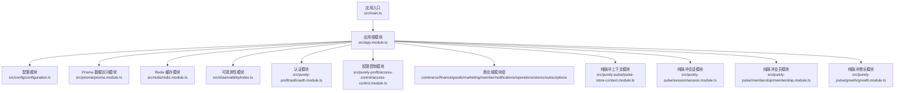
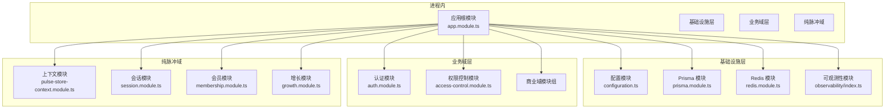
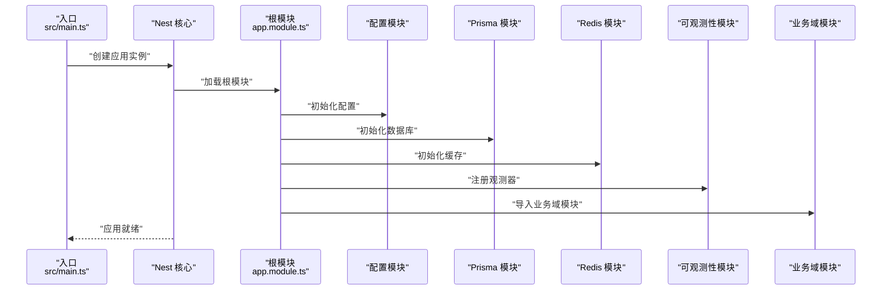
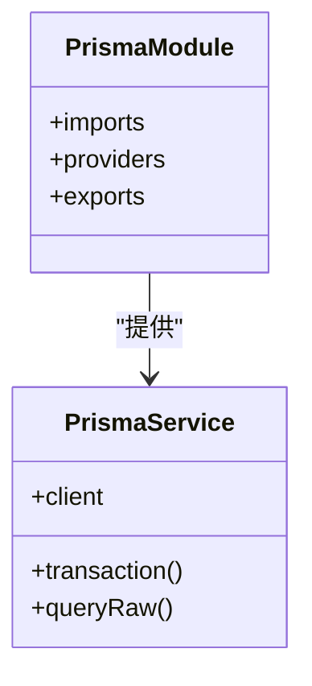
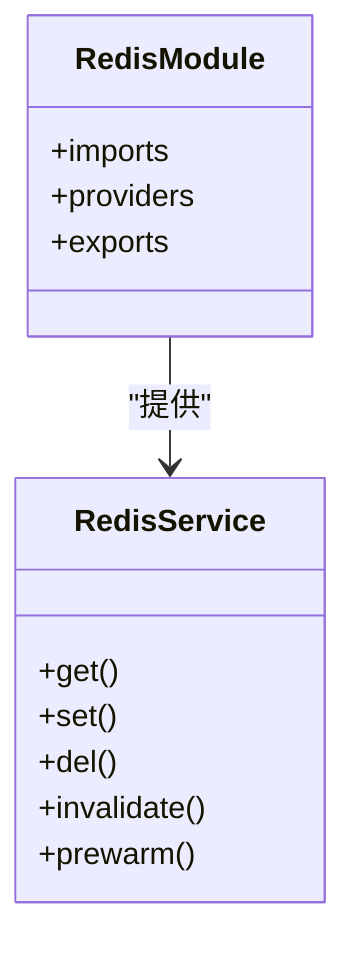
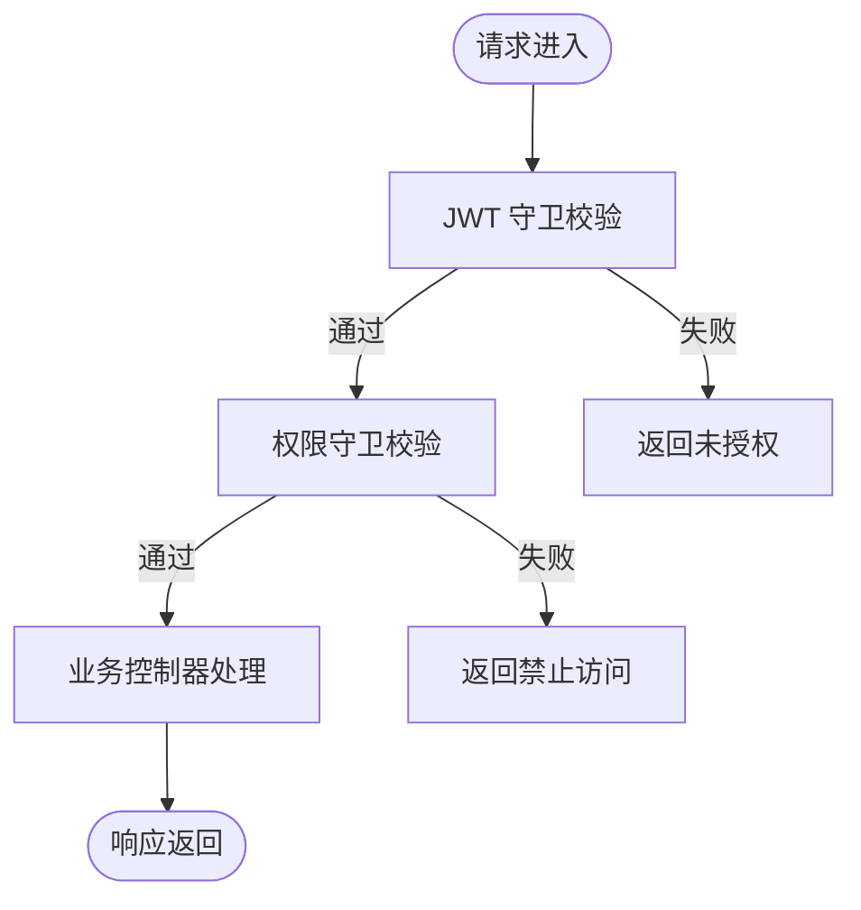
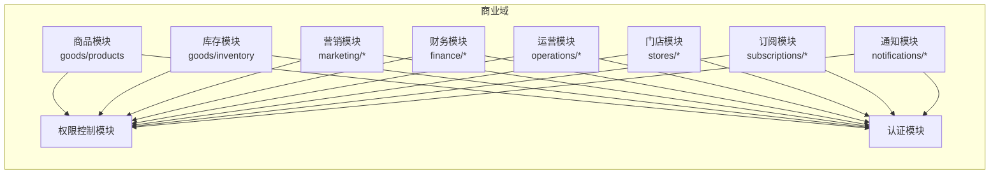
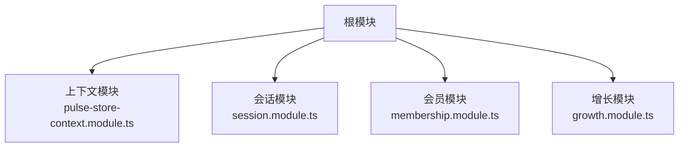
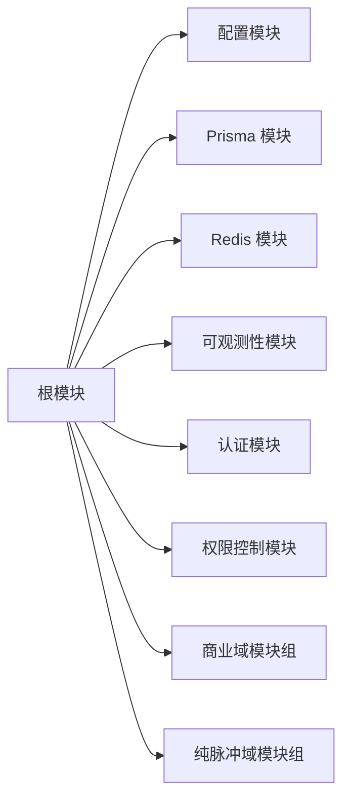

# 整体架构

<cite>
**本文引用的文件**
- [src/main.ts](file://src/main.ts)
- [src/app.module.ts](file://src/app.module.ts)
- [src/config/configuration.ts](file://src/config/configuration.ts)
- [src/prisma/prisma.module.ts](file://src/prisma/prisma.module.ts)
- [src/prisma/prisma.service.ts](file://src/prisma/prisma.service.ts)
- [src/redis/redis.module.ts](file://src/redis/redis.module.ts)
- [src/redis/redis.service.ts](file://src/redis/redis.service.ts)
- [src/observability/index.ts](file://src/observability/index.ts)
- [src/observability/runtime-metrics.ts](file://src/observability/runtime-metrics.ts)
- [src/observability/runtime-metrics.summary.ts](file://src/observability/runtime-metrics.summary.ts)
- [src/purely-profit/auth/auth.module.ts](file://src/purely-profit/auth/auth.module.ts)
- [src/purely-profit/access-control/access-control.module.ts](file://src/purely-profit/access-control/access-control.module.ts)
- [src/purely-profit/commerce/commerce.module.ts](file://src/purely-profit/commerce/commerce.module.ts)
- [src/purely-profit/dashboard/dashboard-home/dashboard-home.module.ts](file://src/purely-profit/dashboard/dashboard-home/dashboard-home.module.ts)
- [src/purely-profit/finance/finance.module.ts](file://src/purely-profit/finance/finance.module.ts)
- [src/purely-profit/goods/products/products.module.ts](file://src/purely-profit/goods/products/products.module.ts)
- [src/purely-profit/marketing/marketing.module.ts](file://src/purely-profit/marketing/marketing.module.ts)
- [src/purely-profit/member/platform-membership/platform-membership.module.ts](file://src/purely-profit/member/platform-membership/platform-membership.module.ts)
- [src/purely-profit/notifications/notifications.module.ts](file://src/purely-profit/notifications/notifications.module.ts)
- [src/purely-profit/operations/sales-record/sales-record.module.ts](file://src/purely-profit/operations/sales-record/sales-record.module.ts)
- [src/purely-profit/staff/employees/employees.module.ts](file://src/purely-profit/staff/employees/employees.module.ts)
- [src/purely-profit/stores/stores.module.ts](file://src/purely-profit/stores/stores.module.ts)
- [src/purely-profit/subscriptions/subscriptions.module.ts](file://src/purely-profit/subscriptions/subscriptions.module.ts)
- [src/purely-pulse/pulse-store-context.module.ts](file://src/purely-pulse/pulse-store-context.module.ts)
- [src/purely-pulse/session/session.module.ts](file://src/purely-pulse/session/session.module.ts)
- [src/purely-pulse/membership/membership.module.ts](file://src/purely-pulse/membership/membership.module.ts)
- [src/purely-pulse/growth/growth.module.ts](file://src/purely-pulse/growth/growth.module.ts)
- [prisma/schema.prisma](file://prisma/schema.prisma)
- [prisma.config.ts](file://prisma.config.ts)
- [package.json](file://package.json)
</cite>

## 目录
1. [引言](#引言)
2. [项目结构](#项目结构)
3. [核心组件](#核心组件)
4. [架构总览](#架构总览)
5. [详细组件分析](#详细组件分析)
6. [依赖分析](#依赖分析)
7. [性能考量](#性能考量)
8. [故障排查指南](#故障排查指南)
9. [结论](#结论)
10. [附录](#附录)

## 引言
本架构文档面向 purelyprofit-server 的整体设计与实现，聚焦于模块化架构原理、组件组织方式、依赖注入容器的使用、应用启动流程、模块加载顺序与服务初始化过程。文档同时覆盖系统边界、外部依赖关系以及微服务架构的可扩展性设计，并通过多种图示展示模块间的交互方式与数据流。

## 项目结构
purelyprofit-server 基于 NestJS 框架构建，采用模块化分层组织，核心入口位于应用模块，业务域按功能划分为多个子模块；数据访问通过 Prisma 管理，缓存与会话通过 Redis 提供；可观测性贯穿运行时指标采集与汇总；纯利润（Purely Profit）与纯脉冲（Purely Pulse）两大产品线并行存在，彼此独立又共享基础设施。

图表来源
- [src/main.ts:1-50](file://src/main.ts#L1-L50)
- [src/app.module.ts:1-120](file://src/app.module.ts#L1-L120)
- [src/config/configuration.ts:1-120](file://src/config/configuration.ts#L1-L120)
- [src/prisma/prisma.module.ts:1-80](file://src/prisma/prisma.module.ts#L1-L80)
- [src/redis/redis.module.ts:1-80](file://src/redis/redis.module.ts#L1-L80)
- [src/observability/index.ts:1-120](file://src/observability/index.ts#L1-L120)
- [src/purely-profit/auth/auth.module.ts:1-120](file://src/purely-profit/auth/auth.module.ts#L1-L120)
- [src/purely-profit/access-control/access-control.module.ts:1-120](file://src/purely-profit/access-control/access-control.module.ts#L1-L120)
- [src/purely-pulse/pulse-store-context.module.ts:1-120](file://src/purely-pulse/pulse-store-context.module.ts#L1-L120)
- [src/purely-pulse/session/session.module.ts:1-120](file://src/purely-pulse/session/session.module.ts#L1-L120)
- [src/purely-pulse/membership/membership.module.ts:1-120](file://src/purely-pulse/membership/membership.module.ts#L1-L120)
- [src/purely-pulse/growth/growth.module.ts:1-120](file://src/purely-pulse/growth/growth.module.ts#L1-L120)

章节来源
- [src/main.ts:1-50](file://src/main.ts#L1-L50)
- [src/app.module.ts:1-120](file://src/app.module.ts#L1-L120)

## 核心组件
- 应用入口与启动流程：应用通过入口文件初始化 Nest 核心，随后加载根模块，完成依赖注入容器的构建与各模块的懒/预加载。
- 配置管理：集中式配置模块负责环境变量与默认值合并，为其他模块提供统一配置源。
- 数据访问层：Prisma 模块封装数据库连接与事务，提供类型安全的数据访问能力。
- 缓存与会话：Redis 模块提供缓存键空间、失效器与预热策略，支撑高并发场景下的读写分离与热点数据加速。
- 可观测性：运行时指标采集与汇总模块，提供多维度指标快照与摘要，辅助性能监控与问题定位。
- 认证与权限：认证模块处理登录、令牌签发与用户资料；权限控制模块基于能力模型进行细粒度授权校验。
- 业务域模块：围绕“商业域”（commerce/finance/goods/marketing/member/notifications/operations/stores/subscriptions）与“纯脉冲域”（session/membership/growth/pulse-store-context）划分，每个域以独立模块组织，职责清晰、边界明确。
- 外部依赖：数据库（PostgreSQL）、缓存（Redis）、Prisma ORM、NestJS 框架、Jest 测试框架等。

章节来源
- [src/main.ts:1-50](file://src/main.ts#L1-L50)
- [src/app.module.ts:1-120](file://src/app.module.ts#L1-L120)
- [src/config/configuration.ts:1-120](file://src/config/configuration.ts#L1-L120)
- [src/prisma/prisma.module.ts:1-80](file://src/prisma/prisma.module.ts#L1-L80)
- [src/redis/redis.module.ts:1-80](file://src/redis/redis.module.ts#L1-L80)
- [src/observability/index.ts:1-120](file://src/observability/index.ts#L1-L120)

## 架构总览
系统采用“单体微服务化”的架构思路：以 NestJS 模块作为服务单元，内部通过依赖注入解耦，对外通过 HTTP 控制器暴露接口；纯利润与纯脉冲两个产品线在同一个进程中运行，共享基础设施（数据库、缓存、配置、可观测性），通过模块边界隔离业务域，便于演进与扩展。

图表来源
- [src/app.module.ts:1-120](file://src/app.module.ts#L1-L120)
- [src/config/configuration.ts:1-120](file://src/config/configuration.ts#L1-L120)
- [src/prisma/prisma.module.ts:1-80](file://src/prisma/prisma.module.ts#L1-L80)
- [src/redis/redis.module.ts:1-80](file://src/redis/redis.module.ts#L1-L80)
- [src/observability/index.ts:1-120](file://src/observability/index.ts#L1-L120)
- [src/purely-profit/auth/auth.module.ts:1-120](file://src/purely-profit/auth/auth.module.ts#L1-L120)
- [src/purely-profit/access-control/access-control.module.ts:1-120](file://src/purely-profit/access-control/access-control.module.ts#L1-L120)
- [src/purely-pulse/pulse-store-context.module.ts:1-120](file://src/purely-pulse/pulse-store-context.module.ts#L1-L120)
- [src/purely-pulse/session/session.module.ts:1-120](file://src/purely-pulse/session/session.module.ts#L1-L120)
- [src/purely-pulse/membership/membership.module.ts:1-120](file://src/purely-pulse/membership/membership.module.ts#L1-L120)
- [src/purely-pulse/growth/growth.module.ts:1-120](file://src/purely-pulse/growth/growth.module.ts#L1-L120)

## 详细组件分析

### 应用启动与模块加载顺序
- 入口文件负责创建 Nest 应用实例、加载根模块、初始化全局中间件与守卫，随后进入事件循环。
- 根模块作为所有业务域与基础设施模块的聚合点，定义模块间依赖关系与导入顺序。
- 配置模块优先加载，确保后续模块能正确读取环境变量与默认配置。
- 数据库与缓存模块在业务域之前完成初始化，保证数据访问与缓存可用。
- 观测性模块贯穿应用生命周期，提供指标采集与汇总能力。
- 业务域模块按需懒加载或在根模块中集中导入，控制器与服务在模块加载时完成依赖注入。

图表来源
- [src/main.ts:1-50](file://src/main.ts#L1-L50)
- [src/app.module.ts:1-120](file://src/app.module.ts#L1-L120)
- [src/config/configuration.ts:1-120](file://src/config/configuration.ts#L1-L120)
- [src/prisma/prisma.module.ts:1-80](file://src/prisma/prisma.module.ts#L1-L80)
- [src/redis/redis.module.ts:1-80](file://src/redis/redis.module.ts#L1-L80)
- [src/observability/index.ts:1-120](file://src/observability/index.ts#L1-L120)

章节来源
- [src/main.ts:1-50](file://src/main.ts#L1-L50)
- [src/app.module.ts:1-120](file://src/app.module.ts#L1-L120)

### 数据访问层（Prisma）
- 模块职责：封装 Prisma 客户端、连接池、事务与查询工具，提供类型安全的数据访问。
- 关键点：通过依赖注入向业务服务提供数据访问能力；支持迁移与模式同步。
- 外部依赖：数据库驱动、Prisma CLI 与运行时库。

图表来源
- [src/prisma/prisma.module.ts:1-80](file://src/prisma/prisma.module.ts#L1-L80)
- [src/prisma/prisma.service.ts:1-200](file://src/prisma/prisma.service.ts#L1-L200)

章节来源
- [src/prisma/prisma.module.ts:1-80](file://src/prisma/prisma.module.ts#L1-L80)
- [src/prisma/prisma.service.ts:1-200](file://src/prisma/prisma.service.ts#L1-L200)
- [prisma/schema.prisma:1-300](file://prisma/schema.prisma#L1-L300)
- [prisma.config.ts:1-120](file://prisma.config.ts#L1-L120)

### 缓存与会话（Redis）
- 模块职责：提供缓存键空间管理、失效器与预热执行器，支撑热点数据与批量预热。
- 关键点：与业务服务解耦，通过依赖注入提供缓存能力；支持错误处理与日志记录。
- 外部依赖：Redis 服务器。

图表来源
- [src/redis/redis.module.ts:1-80](file://src/redis/redis.module.ts#L1-L80)
- [src/redis/redis.service.ts:1-200](file://src/redis/redis.service.ts#L1-L200)

章节来源
- [src/redis/redis.module.ts:1-80](file://src/redis/redis.module.ts#L1-L80)
- [src/redis/redis.service.ts:1-200](file://src/redis/redis.service.ts#L1-L200)

### 认证与权限控制
- 认证模块：处理登录、令牌签发、用户资料读取与更新、短信验证码等。
- 权限控制模块：基于能力模型进行权限校验，拦截未授权请求。
- 关键点：与业务域解耦，通过守卫与装饰器在控制器层面生效。

图表来源
- [src/purely-profit/auth/auth.module.ts:1-120](file://src/purely-profit/auth/auth.module.ts#L1-L120)
- [src/purely-profit/access-control/access-control.module.ts:1-120](file://src/purely-profit/access-control/access-control.module.ts#L1-L120)

章节来源
- [src/purely-profit/auth/auth.module.ts:1-120](file://src/purely-profit/auth/auth.module.ts#L1-L120)
- [src/purely-profit/access-control/access-control.module.ts:1-120](file://src/purely-profit/access-control/access-control.module.ts#L1-L120)

### 业务域模块（概览）
- 商业域：包含商品、库存、营销、财务、运营、门店、订阅等子模块，每个子模块封装领域模型、查询与服务。
- 纯脉冲域：包含上下文、会话、会员、增长等子模块，服务于纯脉冲产品线的特定需求。
- 关键点：模块间通过依赖注入解耦，控制器仅依赖服务接口，便于测试与替换。

图表来源
- [src/purely-profit/goods/products/products.module.ts:1-120](file://src/purely-profit/goods/products/products.module.ts#L1-L120)
- [src/purely-profit/goods/inventory/inventory.module.ts:1-120](file://src/purely-profit/goods/inventory/inventory.module.ts#L1-L120)
- [src/purely-profit/marketing/marketing.module.ts:1-120](file://src/purely-profit/marketing/marketing.module.ts#L1-L120)
- [src/purely-profit/finance/finance.module.ts:1-120](file://src/purely-profit/finance/finance.module.ts#L1-L120)
- [src/purely-profit/operations/sales-record/sales-record.module.ts:1-120](file://src/purely-profit/operations/sales-record/sales-record.module.ts#L1-L120)
- [src/purely-profit/stores/stores.module.ts:1-120](file://src/purely-profit/stores/stores.module.ts#L1-L120)
- [src/purely-profit/subscriptions/subscriptions.module.ts:1-120](file://src/purely-profit/subscriptions/subscriptions.module.ts#L1-L120)
- [src/purely-profit/notifications/notifications.module.ts:1-120](file://src/purely-profit/notifications/notifications.module.ts#L1-L120)
- [src/purely-profit/access-control/access-control.module.ts:1-120](file://src/purely-profit/access-control/access-control.module.ts#L1-L120)
- [src/purely-profit/auth/auth.module.ts:1-120](file://src/purely-profit/auth/auth.module.ts#L1-L120)

章节来源
- [src/purely-profit/goods/products/products.module.ts:1-120](file://src/purely-profit/goods/products/products.module.ts#L1-L120)
- [src/purely-profit/goods/inventory/inventory.module.ts:1-120](file://src/purely-profit/goods/inventory/inventory.module.ts#L1-L120)
- [src/purely-profit/marketing/marketing.module.ts:1-120](file://src/purely-profit/marketing/marketing.module.ts#L1-L120)
- [src/purely-profit/finance/finance.module.ts:1-120](file://src/purely-profit/finance/finance.module.ts#L1-L120)
- [src/purely-profit/operations/sales-record/sales-record.module.ts:1-120](file://src/purely-profit/operations/sales-record/sales-record.module.ts#L1-L120)
- [src/purely-profit/stores/stores.module.ts:1-120](file://src/purely-profit/stores/stores.module.ts#L1-L120)
- [src/purely-profit/subscriptions/subscriptions.module.ts:1-120](file://src/purely-profit/subscriptions/subscriptions.module.ts#L1-L120)
- [src/purely-profit/notifications/notifications.module.ts:1-120](file://src/purely-profit/notifications/notifications.module.ts#L1-L120)
- [src/purely-profit/access-control/access-control.module.ts:1-120](file://src/purely-profit/access-control/access-control.module.ts#L1-L120)
- [src/purely-profit/auth/auth.module.ts:1-120](file://src/purely-profit/auth/auth.module.ts#L1-L120)

### 纯脉冲域（概览）
- 上下文模块：提供门店上下文解析与切换能力，支撑多门店场景。
- 会话模块：处理会话生命周期、通知与状态管理。
- 会员模块：会员相关查询与变更逻辑。
- 增长模块：合作伙伴与收益相关业务。
- 关键点：与纯利润域解耦，独立演进。

图表来源
- [src/purely-pulse/pulse-store-context.module.ts:1-120](file://src/purely-pulse/pulse-store-context.module.ts#L1-L120)
- [src/purely-pulse/session/session.module.ts:1-120](file://src/purely-pulse/session/session.module.ts#L1-L120)
- [src/purely-pulse/membership/membership.module.ts:1-120](file://src/purely-pulse/membership/membership.module.ts#L1-L120)
- [src/purely-pulse/growth/growth.module.ts:1-120](file://src/purely-pulse/growth/growth.module.ts#L1-L120)

章节来源
- [src/purely-pulse/pulse-store-context.module.ts:1-120](file://src/purely-pulse/pulse-store-context.module.ts#L1-L120)
- [src/purely-pulse/session/session.module.ts:1-120](file://src/purely-pulse/session/session.module.ts#L1-L120)
- [src/purely-pulse/membership/membership.module.ts:1-120](file://src/purely-pulse/membership/membership.module.ts#L1-L120)
- [src/purely-pulse/growth/growth.module.ts:1-120](file://src/purely-pulse/growth/growth.module.ts#L1-L120)

## 依赖分析
- 内聚性：每个模块聚焦单一职责，控制器仅编排服务，服务封装业务规则，降低耦合。
- 耦合度：模块间通过接口与依赖注入耦合，避免硬编码依赖；跨域调用通过服务接口与 DTO 解耦。
- 外部依赖：数据库、缓存、配置中心（环境变量）、第三方 SDK（如短信）。
- 循环依赖：通过接口与懒加载避免循环依赖；根模块统一导入，避免深层循环。

图表来源
- [src/app.module.ts:1-120](file://src/app.module.ts#L1-L120)
- [src/config/configuration.ts:1-120](file://src/config/configuration.ts#L1-L120)
- [src/prisma/prisma.module.ts:1-80](file://src/prisma/prisma.module.ts#L1-L80)
- [src/redis/redis.module.ts:1-80](file://src/redis/redis.module.ts#L1-L80)
- [src/observability/index.ts:1-120](file://src/observability/index.ts#L1-L120)
- [src/purely-profit/auth/auth.module.ts:1-120](file://src/purely-profit/auth/auth.module.ts#L1-L120)
- [src/purely-profit/access-control/access-control.module.ts:1-120](file://src/purely-profit/access-control/access-control.module.ts#L1-L120)

章节来源
- [src/app.module.ts:1-120](file://src/app.module.ts#L1-L120)

## 性能考量
- 数据访问优化：通过 Prisma 查询优化、索引设计与只读副本（如适用）提升查询性能；事务边界最小化，避免长事务阻塞。
- 缓存策略：热点数据使用 Redis 缓存，结合失效器与预热器降低数据库压力；合理设置 TTL 与键命名规范。
- 并发与限流：在网关或控制器层引入限流与熔断策略，防止雪崩效应。
- 指标与告警：通过可观测性模块采集 CPU、内存、SQL 与 Redis 命中率等指标，建立告警阈值。
- 启动与热身：模块懒加载与缓存预热减少冷启动时间；数据库连接池参数与 Redis 连接数根据 QPS 调优。

## 故障排查指南
- 启动失败：检查根模块导入顺序与依赖注入是否正确；确认配置模块已加载且环境变量有效。
- 数据库异常：验证 Prisma 连接字符串、迁移状态与权限；检查慢查询与锁等待。
- 缓存异常：确认 Redis 服务连通性与键空间命名；排查预热任务失败与过期策略。
- 权限拒绝：核对权限守卫与装饰器使用；检查用户能力矩阵与角色映射。
- 指标异常：检查可观测性模块是否注册；确认指标采集周期与存储后端可用性。

章节来源
- [src/app.module.ts:1-120](file://src/app.module.ts#L1-L120)
- [src/prisma/prisma.module.ts:1-80](file://src/prisma/prisma.module.ts#L1-L80)
- [src/redis/redis.module.ts:1-80](file://src/redis/redis.module.ts#L1-L80)
- [src/observability/index.ts:1-120](file://src/observability/index.ts#L1-L120)

## 结论
purelyprofit-server 采用模块化与依赖注入的 NestJS 架构，将纯利润与纯脉冲两大产品线在同一进程中协同运行，通过基础设施层（数据库、缓存、配置、可观测性）与业务域模块的清晰边界实现高内聚低耦合。该架构在保证开发效率的同时，具备良好的可扩展性与可维护性，适合未来向微服务拆分演进。

## 附录
- 项目技术栈：NestJS、Prisma、Redis、Jest、TypeScript。
- 配置来源：环境变量与配置模块合并。
- 数据库模式：由 Prisma Schema 定义，迁移脚本管理版本演进。
- 包管理：pnpm。

章节来源
- [package.json:1-120](file://package.json#L1-L120)
- [prisma/schema.prisma:1-300](file://prisma/schema.prisma#L1-L300)
- [prisma.config.ts:1-120](file://prisma.config.ts#L1-L120)